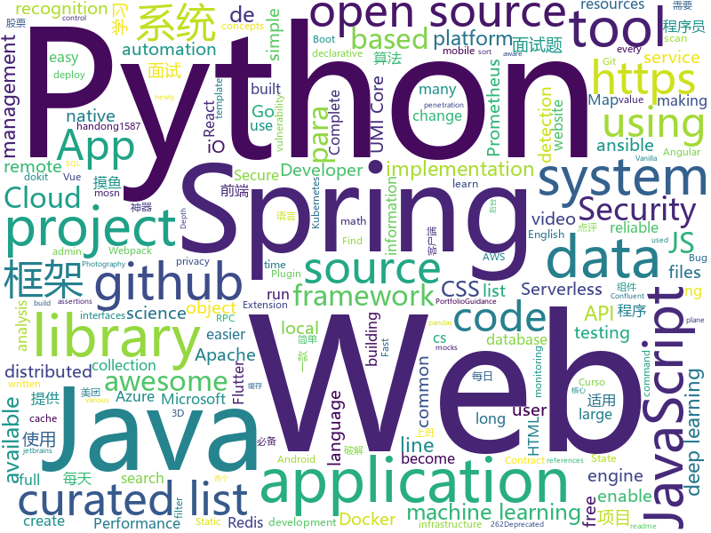

# 2020-07-24
See what the GitHub community is most excited about.

## python
+ [fawkes](https://github.com/Shawn-Shan/fawkes)(**389 stars today**): Fawkes, privacy preserving tool against facial recognition systems. More info at http://sandlab.cs.uchicago.edu/fawkes
+ [stock](https://github.com/pythonstock/stock)(**498 stars today**): stock，股票系统。使用python进行开发。
+ [3d-photo-inpainting](https://github.com/vt-vl-lab/3d-photo-inpainting)(**82 stars today**): [CVPR 2020] 3D Photography using Context-aware Layered Depth Inpainting
+ [mlflow](https://github.com/mlflow/mlflow)(**10 stars today**): Open source platform for the machine learning lifecycle
+ [semgrep](https://github.com/returntocorp/semgrep)(**110 stars today**): Lightweight static analysis for many languages. Find bug variants with patterns that look like source code.
+ [data-science-ipython-notebooks](https://github.com/donnemartin/data-science-ipython-notebooks)(**16 stars today**): Data science Python notebooks: Deep learning (TensorFlow, Theano, Caffe, Keras), scikit-learn, Kaggle, big data (Spark, Hadoop MapReduce, HDFS), matplotlib, pandas, NumPy, SciPy, Python essentials, AWS, and various command lines.
+ [airflow](https://github.com/apache/airflow)(**19 stars today**): Apache Airflow - A platform to programmatically author, schedule, and monitor workflows
+ [chalice](https://github.com/aws/chalice)(**5 stars today**): Python Serverless Microframework for AWS
+ [ansible](https://github.com/ansible/ansible)(**25 stars today**): Ansible is a radically simple IT automation platform that makes your applications and systems easier to deploy. Avoid writing scripts or custom code to deploy and update your applications — automate in a language that approaches plain English, using SSH, with no agents to install on remote systems. https://docs.ansible.com/ansible/
+ [python-cheatsheet](https://github.com/gto76/python-cheatsheet)(**10 stars today**): Comprehensive Python Cheatsheet
+ [jina](https://github.com/jina-ai/jina)(**13 stars today**): An easier way to build neural search in the cloud
+ [algo](https://github.com/wangzheng0822/algo)(**26 stars today**): 数据结构和算法必知必会的50个代码实现
+ [django](https://github.com/django/django)(**34 stars today**): The Web framework for perfectionists with deadlines.
+ [graphene-django](https://github.com/graphql-python/graphene-django)(**4 stars today**): Integrate GraphQL into your Django project.
+ [pytorch_geometric](https://github.com/rusty1s/pytorch_geometric)(**18 stars today**): Geometric Deep Learning Extension Library for PyTorch
+ [manim](https://github.com/3b1b/manim)(**65 stars today**): Animation engine for explanatory math videos
+ [d2l-en](https://github.com/d2l-ai/d2l-en)(**109 stars today**): Interactive deep learning book with code, math, and discussions. Available in multi-frameworks.
+ [core](https://github.com/home-assistant/core)(**21 stars today**): 🏡Open source home automation that puts local control and privacy first
+ [content](https://github.com/demisto/content)(**1 stars today**): Demisto's ever-growing Content Repository
+ [devops-exercises](https://github.com/bregman-arie/devops-exercises)(**17 stars today**): Linux, Jenkins, AWS, SRE, Prometheus, Docker, Python, Ansible, Git, Kubernetes, Terraform, OpenStack, SQL, NoSQL, Azure, GCP, DNS, Elastic, Network, Virtualization
+ [serverless-application-model](https://github.com/awslabs/serverless-application-model)(**7 stars today**): AWS Serverless Application Model (SAM) is an open-source framework for building serverless applications
+ [Bug-Bounty-Toolz](https://github.com/m4ll0k/Bug-Bounty-Toolz)(**12 stars today**): BBT - Bug Bounty Tools
+ [PayloadsAllTheThings](https://github.com/swisskyrepo/PayloadsAllTheThings)(**25 stars today**): A list of useful payloads and bypass for Web Application Security and Pentest/CTF
+ [facenet-pytorch](https://github.com/timesler/facenet-pytorch)(**9 stars today**): Pretrained Pytorch face detection (MTCNN) and recognition (InceptionResnet) models
+ [confluent-kafka-python](https://github.com/confluentinc/confluent-kafka-python)(**5 stars today**): Confluent's Kafka Python Client

## java
+ [cat](https://github.com/dianping/cat)(**17 stars today**): CAT 作为服务端项目基础组件，提供了 Java, C/C++, Node.js, Python, Go 等多语言客户端，已经在美团点评的基础架构中间件框架（MVC框架，RPC框架，数据库框架，缓存框架等，消息队列，配置系统等）深度集成，为美团点评各业务线提供系统丰富的性能指标、健康状况、实时告警等。
+ [camel](https://github.com/apache/camel)(**7 stars today**): Apache Camel
+ [DoraemonKit](https://github.com/didi/DoraemonKit)(**13 stars today**): A full-featured App (iOS & Android) development assistant. You deserve it. 简称 "DoKit" 。一款功能齐全的客户端（ iOS 、Android、微信小程序 ）研发助手，你值得拥有。https://www.dokit.cn/
+ [spring-boot](https://github.com/spring-projects/spring-boot)(**37 stars today**): Spring Boot
+ [nifi](https://github.com/apache/nifi)(**4 stars today**): Apache NiFi
+ [easyexcel](https://github.com/alibaba/easyexcel)(**30 stars today**): 快速、简单避免OOM的java处理Excel工具
+ [SpringAll](https://github.com/wuyouzhuguli/SpringAll)(**26 stars today**): 循序渐进，学习Spring Boot、Spring Boot & Shiro、Spring Batch、Spring Cloud、Spring Cloud Alibaba、Spring Security & Spring Security OAuth2，博客Spring系列源码：https://mrbird.cc
+ [opentelemetry-java](https://github.com/open-telemetry/opentelemetry-java)(**3 stars today**): OpenTelemetry Java SDK
+ [antlr4](https://github.com/antlr/antlr4)(**8 stars today**): ANTLR (ANother Tool for Language Recognition) is a powerful parser generator for reading, processing, executing, or translating structured text or binary files.
+ [cim](https://github.com/crossoverJie/cim)(**8 stars today**): 📲cim(cross IM) 适用于开发者的分布式即时通讯系统
+ [CS-Notes](https://github.com/CyC2018/CS-Notes)(**141 stars today**): 📚技术面试必备基础知识、Leetcode、计算机操作系统、计算机网络、系统设计、Java、Python、C++
+ [skywalking](https://github.com/apache/skywalking)(**26 stars today**): APM, Application Performance Monitoring System
+ [pinpoint](https://github.com/naver/pinpoint)(**8 stars today**): APM, (Application Performance Management) tool for large-scale distributed systems.
+ [kafka](https://github.com/apache/kafka)(**13 stars today**): Mirror of Apache Kafka
+ [base-admin](https://github.com/huanzi-qch/base-admin)(**20 stars today**): Base Admin一套简单通用的后台管理系统
+ [schema-registry](https://github.com/confluentinc/schema-registry)(**1 stars today**): Confluent Schema Registry for Kafka
+ [flutter_boost](https://github.com/alibaba/flutter_boost)(**6 stars today**): FlutterBoost is a Flutter plugin which enables hybrid integration of Flutter for your existing native apps with minimum efforts
+ [canal](https://github.com/alibaba/canal)(**10 stars today**): 阿里巴巴 MySQL binlog 增量订阅&消费组件
+ [react-native-push-notification](https://github.com/zo0r/react-native-push-notification)(**9 stars today**): React Native Local and Remote Notifications
+ [redisson](https://github.com/redisson/redisson)(**15 stars today**): Redisson - Redis Java client with features of In-Memory Data Grid. Over 50 Redis based Java objects and services: Set, Multimap, SortedSet, Map, List, Queue, Deque, Semaphore, Lock, AtomicLong, Map Reduce, Publish / Subscribe, Bloom filter, Spring Cache, Tomcat, Scheduler, JCache API, Hibernate, MyBatis, RPC, local cache ...
+ [vertx-examples](https://github.com/vert-x3/vertx-examples)(**3 stars today**): Vert.x examples
+ [serve](https://github.com/pytorch/serve)(**10 stars today**): Model Serving on PyTorch
+ [jenkins](https://github.com/jenkinsci/jenkins)(**6 stars today**): Jenkins automation server
+ [elasticsearch](https://github.com/elastic/elasticsearch)(**26 stars today**): Open Source, Distributed, RESTful Search Engine
+ [graal](https://github.com/oracle/graal)(**7 stars today**): GraalVM: Run Programs Faster Anywhere🚀

## unknown
+ [applied-ml](https://github.com/eugeneyan/applied-ml)(**162 stars today**): Curated papers, articles & videos on data science & machine learning applied in production, with results.
+ [jetbrains-agent-latest](https://github.com/czl0325/jetbrains-agent-latest)(**27 stars today**): jetbrains全家桶永久激活破解，不需要修改host。完美破解！共享给各个程序员兄弟使用。适用于2020版本。
+ [awesome-mlops](https://github.com/visenger/awesome-mlops)(**136 stars today**): A curated list of references for MLOps
+ [coding-interview-university](https://github.com/jwasham/coding-interview-university)(**374 stars today**): A complete computer science study plan to become a software engineer.
+ [css-in-readme-like-wat](https://github.com/sindresorhus/css-in-readme-like-wat)(**269 stars today**): Style your readme using CSS with this simple trick
+ [awesome-ml-courses](https://github.com/luspr/awesome-ml-courses)(**193 stars today**): Awesome free machine learning and AI courses with video lectures.
+ [JavaFamily](https://github.com/AobingJava/JavaFamily)(**117 stars today**): 【Java面试+Java学习指南】 一份涵盖大部分Java程序员所需要掌握的核心知识。
+ [umi-core-py](https://github.com/umi-top/umi-core-py)(**309 stars today**): UMI Core Python Library
+ [nuclei-templates](https://github.com/projectdiscovery/nuclei-templates)(**4 stars today**): Community curated list of template files for the nuclei engine to find security vulnerability and fingerprinting the targets.
+ [developer-handbook](https://github.com/apptension/developer-handbook)(**24 stars today**): An opinionated guide on how to become a professional Web/Mobile App Developer.
+ [public-attacknets](https://github.com/ethereum/public-attacknets)(**11 stars today**): Public attacknets available for eth2
+ [awesome-gpt3](https://github.com/elyase/awesome-gpt3)(**88 stars today**): 
+ [awesome-remote-job](https://github.com/lukasz-madon/awesome-remote-job)(**144 stars today**): A curated list of awesome remote jobs and resources. Inspired by https://github.com/vinta/awesome-python
+ [machine-learning-roadmap](https://github.com/mrdbourke/machine-learning-roadmap)(**24 stars today**): A roadmap connecting many of the most important concepts in machine learning, how to learn them and what tools to use to perform them.
+ [iampawan](https://github.com/iampawan/iampawan)(**8 stars today**): Pawan Kumar Portfolio
+ [renaming](https://github.com/github/renaming)(**129 stars today**): Guidance for changing the default branch name for GitHub repositories
+ [PCAP-ATTACK](https://github.com/sbousseaden/PCAP-ATTACK)(**7 stars today**): 
+ [awesome-object-detection](https://github.com/amusi/awesome-object-detection)(**8 stars today**): Awesome Object Detection based on handong1587 github: https://handong1587.github.io/deep_learning/2015/10/09/object-detection.html
+ [awesome-self-supervised-learning](https://github.com/jason718/awesome-self-supervised-learning)(**9 stars today**): A curated list of awesome self-supervised methods
+ [100-days-of-angular](https://github.com/angular-vietnam/100-days-of-angular)(**5 stars today**): Series độc quyền cung cấp bởi thành viên của Angular Vietnam về các chủ đề liên quan tới Angular trong vòng 100 ngày.
+ [PoC-in-GitHub](https://github.com/nomi-sec/PoC-in-GitHub)(**4 stars today**): 📡PoC auto collect from GitHub.
+ [NewGrad-2021](https://github.com/Pitt-CSC/NewGrad-2021)(**12 stars today**): A collection of New Grad full time roles in SWE, Quant, and PM.
+ [project-based-learning](https://github.com/tuvtran/project-based-learning)(**49 stars today**): Curated list of project-based tutorials
+ [data-police-shootings](https://github.com/washingtonpost/data-police-shootings)(**14 stars today**): The Washington Post is compiling a database of every fatal shooting in the United States by a police officer in the line of duty in 2015 and 2016.
+ [vagas](https://github.com/frontendbr/vagas)(**10 stars today**): 🔬Espaço para divulgação de vagas para front-enders.

## javascript
+ [hello-algorithm](https://github.com/geekxh/hello-algorithm)(**1,214 stars today**): 🙈🙉🙊本项目包括：1、我写的三十万字图解算法题典 2、100 张 IT 相关超清思维导图 3、100 篇大厂面经汇总 4、各语言编程电子书 100 本 5、English version supported !!!🚀🚀国人项目上榜首不易，右上角助力一波！干就对了，奥利给 ！🚀🚀
+ [umi-core-js](https://github.com/umi-top/umi-core-js)(**283 stars today**): UMI Core JS Library
+ [fe-interview](https://github.com/haizlin/fe-interview)(**119 stars today**): 前端面试每日 3+1，以面试题来驱动学习，提倡每日学习与思考，每天进步一点！每天早上5点纯手工发布面试题（死磕自己，愉悦大家），3000+道前端面试题全面覆盖，HTML/CSS/JavaScript/Vue/React/Nodejs/TypeScript/ECMAScritpt/Webpack/Jquery/小程序/软技能……
+ [cypress](https://github.com/cypress-io/cypress)(**28 stars today**): Fast, easy and reliable testing for anything that runs in a browser.
+ [junior-recruit-scheduler](https://github.com/jojoldu/junior-recruit-scheduler)(**11 stars today**): 주니어 개발자 채용 정보
+ [gpt3-sandbox](https://github.com/shreyashankar/gpt3-sandbox)(**54 stars today**): The goal of this project is to enable users to create cool web demos using the newly released OpenAI GPT-3 API with just a few lines of Python.
+ [mdx](https://github.com/mdx-js/mdx)(**18 stars today**): JSX in Markdown for ambitious projects
+ [plotly.js](https://github.com/plotly/plotly.js)(**10 stars today**): Open-source JavaScript charting library behind Plotly and Dash
+ [rengine](https://github.com/yogeshojha/rengine)(**228 stars today**): reNgine is an automated reconnaissance framework meant for gathering information during penetration testing of web applications. reNgine has customizable scan engines, which can be used to scan the websites, endpoints, and gather information.
+ [svelte](https://github.com/sveltejs/svelte)(**49 stars today**): Cybernetically enhanced web apps
+ [ccxt](https://github.com/ccxt/ccxt)(**14 stars today**): A JavaScript / Python / PHP cryptocurrency trading API with support for more than 120 bitcoin/altcoin exchanges
+ [Thief](https://github.com/cteamx/Thief)(**18 stars today**): 一款创新跨平台摸鱼神器，支持小说、股票、网页、视频、直播、PDF、游戏等摸鱼模式，为上班族打造的上班必备神器，使用此软件可以让上班倍感轻松，远离 ICU。
+ [react](https://github.com/facebook/react)(**95 stars today**): A declarative, efficient, and flexible JavaScript library for building user interfaces.
+ [odoo](https://github.com/odoo/odoo)(**7 stars today**): Odoo. Open Source Apps To Grow Your Business.
+ [33-js-concepts](https://github.com/leonardomso/33-js-concepts)(**38 stars today**): 📜33 concepts every JavaScript developer should know.
+ [Inquirer.js](https://github.com/SBoudrias/Inquirer.js)(**14 stars today**): A collection of common interactive command line user interfaces.
+ [gutenberg](https://github.com/WordPress/gutenberg)(**8 stars today**): The Block Editor project for WordPress and beyond. Plugin is available from the official repository.
+ [three.js](https://github.com/mrdoob/three.js)(**32 stars today**): JavaScript 3D library.
+ [portainer](https://github.com/portainer/portainer)(**15 stars today**): Making Docker management easy.
+ [carbon](https://github.com/carbon-design-system/carbon)(**4 stars today**): A design system built by IBM
+ [openzeppelin-contracts](https://github.com/OpenZeppelin/openzeppelin-contracts)(**5 stars today**): OpenZeppelin Contracts is a library for secure smart contract development.
+ [vue-echarts](https://github.com/ecomfe/vue-echarts)(**6 stars today**): ECharts component for Vue.js.
+ [jitsi-meet](https://github.com/jitsi/jitsi-meet)(**21 stars today**): Jitsi Meet - Secure, Simple and Scalable Video Conferences that you use as a standalone app or embed in your web application.
+ [swiper](https://github.com/nolimits4web/swiper)(**13 stars today**): Most modern mobile touch slider with hardware accelerated transitions
+ [react-beautiful-dnd](https://github.com/atlassian/react-beautiful-dnd)(**21 stars today**): Beautiful and accessible drag and drop for lists with React

## html
+ [proposal-record-tuple](https://github.com/tc39/proposal-record-tuple)(**40 stars today**): ECMAScript proposal for the Record and Tuple value types. | Stage 2: it will change!
+ [umi-top.github.io](https://github.com/umi-top/umi-top.github.io)(**257 stars today**): 
+ [portfolio-website](https://github.com/divanov11/portfolio-website)(**19 stars today**): 
+ [css-sweeper](https://github.com/propjockey/css-sweeper)(**62 stars today**): MineSweeper implemented in CSS + HTML using the Space Toggle trick (no JavaScript!)
+ [JavaScript30](https://github.com/wesbos/JavaScript30)(**14 stars today**): 30 Day Vanilla JS Challenge
+ [html-css](https://github.com/gustavoguanabara/html-css)(**2 stars today**): Curso de HTML5 e CSS3
+ [PowerBI-DataScience](https://github.com/dsacademybr/PowerBI-DataScience)(**2 stars today**): Repositório do Curso Microsoft Power BI Para Data Science
+ [webdevbootcamp](https://github.com/nax3t/webdevbootcamp)(**2 stars today**): All source code for back-end projects from the Web Developer Bootcamp
+ [ctf-wiki](https://github.com/ctf-wiki/ctf-wiki)(**3 stars today**): CTF Wiki Online. Come and join us, we need you!
+ [hammer-website](https://github.com/geohot/hammer-website)(**14 stars today**): 
+ [docker.github.io](https://github.com/docker/docker.github.io)(**2 stars today**): Source repo for Docker's Documentation
+ [isotope](https://github.com/metafizzy/isotope)(**4 stars today**): 💞Filter & sort magical layouts
+ [keycloak-documentation](https://github.com/keycloak/keycloak-documentation)(**0 stars today**): 
+ [ecma262](https://github.com/tc39/ecma262)(**6 stars today**): Status, process, and documents for ECMA-262
+ [chosen](https://github.com/harvesthq/chosen)(**2 stars today**): Deprecated - Chosen is a library for making long, unwieldy select boxes more friendly.
+ [boost](https://github.com/boostorg/boost)(**3 stars today**): Super-project for modularized Boost
+ [web-moderno](https://github.com/cod3rcursos/web-moderno)(**9 stars today**): 
+ [hyperblog](https://github.com/freddier/hyperblog)(**14 stars today**): Un blog increíble para el curso de Git y Github de Platzi
+ [awesome-webpack](https://github.com/webpack-contrib/awesome-webpack)(**4 stars today**): A curated list of awesome Webpack resources, libraries and tools
+ [coreui-free-bootstrap-admin-template](https://github.com/coreui/coreui-free-bootstrap-admin-template)(**5 stars today**): CoreUI is free bootstrap admin template
+ [django-DefectDojo](https://github.com/DefectDojo/django-DefectDojo)(**2 stars today**): DefectDojo is an open-source application vulnerability correlation and security orchestration tool.
+ [bulma-templates](https://github.com/BulmaTemplates/bulma-templates)(**1 stars today**): free flexbox templates built with the bulma css framework
+ [almanac.httparchive.org](https://github.com/HTTPArchive/almanac.httparchive.org)(**3 stars today**): HTTP Archive's annual "State of the Web" report made by the web community
+ [1-pixel-wealth](https://github.com/MKorostoff/1-pixel-wealth)(**3 stars today**): 
+ [computer-science-flash-cards](https://github.com/jwasham/computer-science-flash-cards)(**12 stars today**): Mini website for testing both general CS knowledge and enforce coding practice and common algorithm/data structure memorization.

## go
+ [lotus](https://github.com/filecoin-project/lotus)(**5 stars today**): Implementation of the Filecoin protocol, written in Go
+ [OpenDiablo2](https://github.com/OpenDiablo2/OpenDiablo2)(**29 stars today**): An open source re-implementation of Diablo 2
+ [vault](https://github.com/hashicorp/vault)(**137 stars today**): A tool for secrets management, encryption as a service, and privileged access management
+ [gotraining](https://github.com/ardanlabs/gotraining)(**114 stars today**): Go Training Class Material :
+ [umi-core](https://github.com/umi-top/umi-core)(**307 stars today**): UMI Core Go Library
+ [thanos](https://github.com/thanos-io/thanos)(**11 stars today**): Highly available Prometheus setup with long term storage capabilities. CNCF Sandbox project.
+ [clash](https://github.com/Dreamacro/clash)(**52 stars today**): A rule-based tunnel in Go.
+ [testify](https://github.com/stretchr/testify)(**20 stars today**): A toolkit with common assertions and mocks that plays nicely with the standard library
+ [clutch](https://github.com/lyft/clutch)(**73 stars today**): Extensible platform for infrastructure management
+ [golang-lru](https://github.com/hashicorp/golang-lru)(**5 stars today**): Golang LRU cache
+ [terraform](https://github.com/hashicorp/terraform)(**72 stars today**): Terraform enables you to safely and predictably create, change, and improve infrastructure. It is an open source tool that codifies APIs into declarative configuration files that can be shared amongst team members, treated as code, edited, reviewed, and versioned.
+ [rancher](https://github.com/rancher/rancher)(**7 stars today**): Complete container management platform
+ [argo-cd](https://github.com/argoproj/argo-cd)(**7 stars today**): Declarative continuous deployment for Kubernetes.
+ [ffuf](https://github.com/ffuf/ffuf)(**17 stars today**): Fast web fuzzer written in Go
+ [clair](https://github.com/quay/clair)(**7 stars today**): Vulnerability Static Analysis for Containers
+ [prometheus](https://github.com/prometheus/prometheus)(**26 stars today**): The Prometheus monitoring system and time series database.
+ [mosn](https://github.com/mosn/mosn)(**28 stars today**): MOSN is a cloud native proxy for edge or service mesh. https://mosn.io
+ [dns](https://github.com/miekg/dns)(**10 stars today**): DNS library in Go
+ [go-control-plane](https://github.com/envoyproxy/go-control-plane)(**5 stars today**): Go implementation of data-plane-api
+ [jwt-go](https://github.com/dgrijalva/jwt-go)(**5 stars today**): Golang implementation of JSON Web Tokens (JWT)
+ [azure-sdk-for-go](https://github.com/Azure/azure-sdk-for-go)(**0 stars today**): Microsoft Azure SDK for Go
+ [git-lfs](https://github.com/git-lfs/git-lfs)(**2 stars today**): Git extension for versioning large files
+ [kubernetes-ingress](https://github.com/nginxinc/kubernetes-ingress)(**2 stars today**): NGINX and NGINX Plus Ingress Controllers for Kubernetes
+ [atlantis](https://github.com/runatlantis/atlantis)(**8 stars today**): Terraform Pull Request Automation
+ [etcd](https://github.com/etcd-io/etcd)(**30 stars today**): Distributed reliable key-value store for the most critical data of a distributed system

## WordCloud

