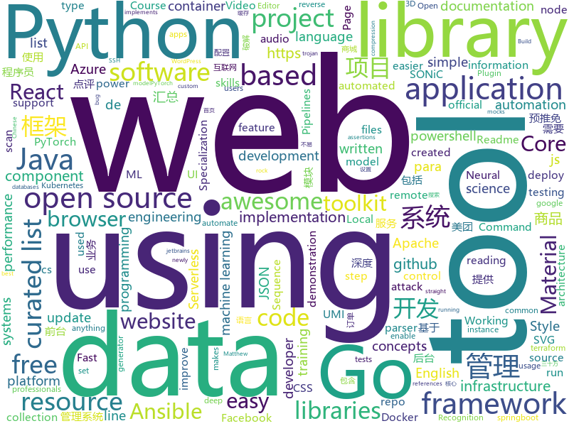

# 2020-07-25
See what the GitHub community is most excited about.

## python
+ [fawkes](https://github.com/Shawn-Shan/fawkes)(**444 stars today**): Fawkes, privacy preserving tool against facial recognition systems. More info at http://sandlab.cs.uchicago.edu/fawkes
+ [rpi-power-monitor](https://github.com/David00/rpi-power-monitor)(**120 stars today**): Raspberry Pi Power Monitor
+ [stock](https://github.com/pythonstock/stock)(**285 stars today**): stock，股票系统。使用python进行开发。
+ [GitHub520](https://github.com/521xueweihan/GitHub520)(**75 stars today**): 😘让你“爱”上 GitHub，解决访问时图裂、加载慢的问题。
+ [retinaface](https://github.com/ternaus/retinaface)(**29 stars today**): The remake of the https://github.com/biubug6/Pytorch_Retinaface
+ [BorderDet](https://github.com/Megvii-BaseDetection/BorderDet)(**36 stars today**): Stay tuned for updates!
+ [Pytorch_Retinaface](https://github.com/biubug6/Pytorch_Retinaface)(**17 stars today**): Retinaface get 80.99% in widerface hard val using mobilenet0.25.
+ [ansible](https://github.com/ansible/ansible)(**27 stars today**): Ansible is a radically simple IT automation platform that makes your applications and systems easier to deploy. Avoid writing scripts or custom code to deploy and update your applications — automate in a language that approaches plain English, using SSH, with no agents to install on remote systems. https://docs.ansible.com/ansible/
+ [fairseq](https://github.com/pytorch/fairseq)(**8 stars today**): Facebook AI Research Sequence-to-Sequence Toolkit written in Python.
+ [awesome-python](https://github.com/vinta/awesome-python)(**80 stars today**): A curated list of awesome Python frameworks, libraries, software and resources
+ [ansible-for-devops](https://github.com/geerlingguy/ansible-for-devops)(**8 stars today**): Ansible examples from Ansible for DevOps.
+ [zipline](https://github.com/quantopian/zipline)(**9 stars today**): Zipline, a Pythonic Algorithmic Trading Library
+ [PaddleDetection](https://github.com/PaddlePaddle/PaddleDetection)(**30 stars today**): Object detection and instance segmentation toolkit based on PaddlePaddle.
+ [kedro](https://github.com/quantumblacklabs/kedro)(**18 stars today**): A Python library that implements software engineering best-practice for data and ML pipelines.
+ [azure-cli](https://github.com/Azure/azure-cli)(**3 stars today**): Azure Command-Line Interface
+ [public-apis](https://github.com/public-apis/public-apis)(**94 stars today**): A collective list of free APIs for use in software and web development.
+ [unicorn](https://github.com/trustedsec/unicorn)(**5 stars today**): Unicorn is a simple tool for using a PowerShell downgrade attack and inject shellcode straight into memory. Based on Matthew Graeber's powershell attacks and the powershell bypass technique presented by David Kennedy (TrustedSec) and Josh Kelly at Defcon 18.
+ [yyg-seir-simulator](https://github.com/youyanggu/yyg-seir-simulator)(**3 stars today**): Underlying SEIR simulator for the YYG / covid19-projections.com model
+ [PyTorch_YOLOv4](https://github.com/WongKinYiu/PyTorch_YOLOv4)(**8 stars today**): PyTorch implementation of YOLOv4
+ [Summer2021-Internships](https://github.com/Pitt-CSC/Summer2021-Internships)(**30 stars today**): Collection of Summer 2021 tech internships!
+ [skywater-pdk](https://github.com/google/skywater-pdk)(**9 stars today**): Open source process design kit for usage with SkyWater Technology Foundry's 130nm node.
+ [nni](https://github.com/microsoft/nni)(**13 stars today**): An open source AutoML toolkit for automate machine learning lifecycle, including feature engineering, neural architecture search, model compression and hyper-parameter tuning.
+ [horovod](https://github.com/horovod/horovod)(**12 stars today**): Distributed training framework for TensorFlow, Keras, PyTorch, and Apache MXNet.
+ [django](https://github.com/django/django)(**38 stars today**): The Web framework for perfectionists with deadlines.
+ [dagster](https://github.com/dagster-io/dagster)(**6 stars today**): A Python library for building data applications: ETL, ML, Data Pipelines, and more.

## java
+ [ghidra](https://github.com/NationalSecurityAgency/ghidra)(**28 stars today**): Ghidra is a software reverse engineering (SRE) framework
+ [testcontainers-java](https://github.com/testcontainers/testcontainers-java)(**13 stars today**): Testcontainers is a Java library that supports JUnit tests, providing lightweight, throwaway instances of common databases, Selenium web browsers, or anything else that can run in a Docker container.
+ [react-native-video](https://github.com/react-native-community/react-native-video)(**3 stars today**): A <Video /> component for react-native
+ [antlr4](https://github.com/antlr/antlr4)(**4 stars today**): ANTLR (ANother Tool for Language Recognition) is a powerful parser generator for reading, processing, executing, or translating structured text or binary files.
+ [cat](https://github.com/dianping/cat)(**40 stars today**): CAT 作为服务端项目基础组件，提供了 Java, C/C++, Node.js, Python, Go 等多语言客户端，已经在美团点评的基础架构中间件框架（MVC框架，RPC框架，数据库框架，缓存框架等，消息队列，配置系统等）深度集成，为美团点评各业务线提供系统丰富的性能指标、健康状况、实时告警等。
+ [BigData-Notes](https://github.com/heibaiying/BigData-Notes)(**10 stars today**): 大数据入门指南⭐
+ [OpenRefine](https://github.com/OpenRefine/OpenRefine)(**3 stars today**): OpenRefine is a free, open source power tool for working with messy data and improving it
+ [igniter](https://github.com/trojan-gfw/igniter)(**10 stars today**): A trojan client for Android (UNDER CONSTRUCTION).
+ [Jetpack-MVVM-Best-Practice](https://github.com/KunMinX/Jetpack-MVVM-Best-Practice)(**21 stars today**): 是 难得一见 的 Jetpack MVVM 最佳实践！在 以简驭繁 的代码中，对 视图控制器 乃至 标准化开发模式 形成正确、深入的理解！
+ [jdk](https://github.com/openjdk/jdk)(**19 stars today**): Read-only mirror of https://hg.openjdk.java.net/jdk/jdk
+ [LeetCode](https://github.com/yuanguangxin/LeetCode)(**4 stars today**): LeetCode刷题记录
+ [Lawnchair](https://github.com/LawnchairLauncher/Lawnchair)(**18 stars today**): No clever tagline needed
+ [hibernate-orm](https://github.com/hibernate/hibernate-orm)(**3 stars today**): Hibernate's core Object/Relational Mapping functionality
+ [java-design-patterns](https://github.com/iluwatar/java-design-patterns)(**26 stars today**): Design patterns implemented in Java
+ [beam](https://github.com/apache/beam)(**4 stars today**): Apache Beam is a unified programming model for Batch and Streaming
+ [react-native-track-player](https://github.com/react-native-kit/react-native-track-player)(**3 stars today**): A fully fledged audio module created for music apps. Provides audio playback, external media controls, chromecast support, background mode and more!
+ [SpringCloud](https://github.com/zhoutaoo/SpringCloud)(**9 stars today**): 基于SpringCloud2.1的微服务开发脚手架，整合了spring-security-oauth2、nacos、feign、sentinel、springcloud-gateway等。服务治理方面引入elasticsearch、skywalking、springboot-admin、zipkin等，让项目开发快速进入业务开发，而不需过多时间花费在架构搭建上。持续更新中
+ [fastjson](https://github.com/alibaba/fastjson)(**16 stars today**): A fast JSON parser/generator for Java.
+ [nifi](https://github.com/apache/nifi)(**3 stars today**): Apache NiFi
+ [react-native-push-notification](https://github.com/zo0r/react-native-push-notification)(**8 stars today**): React Native Local and Remote Notifications
+ [mall](https://github.com/macrozheng/mall)(**68 stars today**): mall项目是一套电商系统，包括前台商城系统及后台管理系统，基于SpringBoot+MyBatis实现，采用Docker容器化部署。 前台商城系统包含首页门户、商品推荐、商品搜索、商品展示、购物车、订单流程、会员中心、客户服务、帮助中心等模块。 后台管理系统包含商品管理、订单管理、会员管理、促销管理、运营管理、内容管理、统计报表、财务管理、权限管理、设置等模块。
+ [skywalking](https://github.com/apache/skywalking)(**17 stars today**): APM, Application Performance Monitoring System
+ [grpc-java](https://github.com/grpc/grpc-java)(**3 stars today**): The Java gRPC implementation. HTTP/2 based RPC
+ [jenkins](https://github.com/jenkinsci/jenkins)(**6 stars today**): Jenkins automation server
+ [serve](https://github.com/pytorch/serve)(**5 stars today**): Model Serving on PyTorch

## unknown
+ [easy_rust](https://github.com/Dhghomon/easy_rust)(**801 stars today**): Rust explained using easy English
+ [JavaFamily](https://github.com/AobingJava/JavaFamily)(**244 stars today**): 【Java面试+Java学习指南】 一份涵盖大部分Java程序员所需要掌握的核心知识。
+ [jetbrains-agent-latest](https://github.com/czl0325/jetbrains-agent-latest)(**89 stars today**): jetbrains全家桶永久激活破解，不需要修改host。完美破解！共享给各个程序员兄弟使用。适用于2020版本。
+ [umi-core-py](https://github.com/umi-top/umi-core-py)(**2,144 stars today**): UMI Core Python Library
+ [LeetcodeTop](https://github.com/afatcoder/LeetcodeTop)(**139 stars today**): 汇总各大互联网公司容易考察的高频leetcode题🔥
+ [awesome-gpt3](https://github.com/elyase/awesome-gpt3)(**111 stars today**): 
+ [awesome-react-components](https://github.com/brillout/awesome-react-components)(**20 stars today**): Curated List of React Components & Libraries.
+ [app-ideas](https://github.com/florinpop17/app-ideas)(**127 stars today**): A Collection of application ideas which can be used to improve your coding skills.
+ [applied-ml](https://github.com/eugeneyan/applied-ml)(**243 stars today**): Curated papers, articles & videos on data science & machine learning applied in production, with results.
+ [lantern](https://github.com/ntkernel/lantern)(**11 stars today**): 免费 V2Ray 配置（vmess）
+ [project-based-learning](https://github.com/tuvtran/project-based-learning)(**44 stars today**): Curated list of project-based tutorials
+ [coding-interview-university](https://github.com/jwasham/coding-interview-university)(**543 stars today**): A complete computer science study plan to become a software engineer.
+ [market-toolkit](https://github.com/ckz8780/market-toolkit)(**41 stars today**): A collection of stock market resources and tools
+ [machine-learning-roadmap](https://github.com/mrdbourke/machine-learning-roadmap)(**31 stars today**): A roadmap connecting many of the most important concepts in machine learning, how to learn them and what tools to use to perform them.
+ [what-happens-when](https://github.com/alex/what-happens-when)(**23 stars today**): An attempt to answer the age old interview question "What happens when you type google.com into your browser and press enter?"
+ [css-in-readme-like-wat](https://github.com/sindresorhus/css-in-readme-like-wat)(**274 stars today**): Style your readme using CSS with this simple trick
+ [svg-banners](https://github.com/Akshay090/svg-banners)(**39 stars today**): Styled banners for your Readme made with html/css in SVG !!
+ [CyberProfDevelopmentCovidResources](https://github.com/gerryguy311/CyberProfDevelopmentCovidResources)(**10 stars today**): An awesome list of FREE resources for training, conferences, speaking, labs, reading, etc that are free all the time or during COVID-19 that cybersecurity professionals with downtime can take advantage of to improve their skills and marketability to come out on the other side ready to rock.
+ [CSYuTuiMian2020](https://github.com/hcy226/CSYuTuiMian2020)(**17 stars today**): 关于2020年CS预推免的汇总。欢迎大家分享预推免信息，资瓷一下互联网精神吼不吼啊？
+ [pikvm](https://github.com/pikvm/pikvm)(**76 stars today**): Open and cheap DIY IP-KVM based on Raspberry Pi
+ [awesome-mlops](https://github.com/visenger/awesome-mlops)(**118 stars today**): A curated list of references for MLOps
+ [vagas](https://github.com/backend-br/vagas)(**9 stars today**): ✌️Espaço para divulgação de vagas para backenders
+ [awesome-bigdata](https://github.com/onurakpolat/awesome-bigdata)(**9 stars today**): A curated list of awesome big data frameworks, ressources and other awesomeness.
+ [awesome-c](https://github.com/kozross/awesome-c)(**8 stars today**): A curated list of awesome C frameworks, libraries, resources and other shiny things. Inspired by all the other awesome-... projects out there.
+ [Resources-for-Beginner-Bug-Bounty-Hunters](https://github.com/nahamsec/Resources-for-Beginner-Bug-Bounty-Hunters)(**9 stars today**): A list of resources for those interested in getting started in bug bounties

## javascript
+ [rengine](https://github.com/yogeshojha/rengine)(**199 stars today**): reNgine is an automated reconnaissance framework meant for gathering information during penetration testing of web applications. reNgine has customizable scan engines, which can be used to scan the websites, endpoints, and gather information.
+ [hello-algorithm](https://github.com/geekxh/hello-algorithm)(**927 stars today**): 🙈🙉🙊本项目包括：1、我写的三十万字图解算法题典 2、100 张 IT 相关超清思维导图 3、100 篇大厂面经汇总 4、各语言编程电子书 100 本 5、English version supported !!!🚀🚀国人项目上榜首不易，右上角助力一波！干就对了，奥利给 ！🚀🚀
+ [gpt3-sandbox](https://github.com/shreyashankar/gpt3-sandbox)(**56 stars today**): The goal of this project is to enable users to create cool web demos using the newly released OpenAI GPT-3 API with just a few lines of Python.
+ [umi-core-js](https://github.com/umi-top/umi-core-js)(**2,077 stars today**): UMI Core JS Library
+ [react-query](https://github.com/tannerlinsley/react-query)(**104 stars today**): ⚛️Hooks for fetching, caching and updating asynchronous data in React
+ [gutenberg](https://github.com/WordPress/gutenberg)(**11 stars today**): The Block Editor project for WordPress and beyond. Plugin is available from the official repository.
+ [clean-code-javascript](https://github.com/ryanmcdermott/clean-code-javascript)(**39 stars today**): 🛁Clean Code concepts adapted for JavaScript
+ [responsively-app](https://github.com/manojVivek/responsively-app)(**50 stars today**): A modified web browser that helps in responsive web development. A web developer's must have dev-tool.
+ [hacker-scripts](https://github.com/NARKOZ/hacker-scripts)(**13 stars today**): Based on a true story
+ [cube.js](https://github.com/cube-js/cube.js)(**23 stars today**): 📊Cube.js - Open Source Analytics Framework
+ [cypress](https://github.com/cypress-io/cypress)(**32 stars today**): Fast, easy and reliable testing for anything that runs in a browser.
+ [plotly.js](https://github.com/plotly/plotly.js)(**11 stars today**): Open-source JavaScript charting library behind Plotly and Dash
+ [three.js](https://github.com/mrdoob/three.js)(**42 stars today**): JavaScript 3D library.
+ [react-refresh-webpack-plugin](https://github.com/pmmmwh/react-refresh-webpack-plugin)(**57 stars today**): A Webpack plugin to enable "Fast Refresh" (also previously known as Hot Reloading) for React components.
+ [odoo](https://github.com/odoo/odoo)(**14 stars today**): Odoo. Open Source Apps To Grow Your Business.
+ [pipedream](https://github.com/PipedreamHQ/pipedream)(**9 stars today**): Serverless integration and compute platform. Free for developers.
+ [serverless](https://github.com/serverless/serverless)(**28 stars today**): ⚡Serverless Framework – Build web, mobile and IoT applications with serverless architectures using AWS Lambda, Azure Functions, Google CloudFunctions & more! –
+ [docusaurus](https://github.com/facebook/docusaurus)(**23 stars today**): Easy to maintain open source documentation websites.
+ [amphtml](https://github.com/ampproject/amphtml)(**1 stars today**): The AMP web component framework.
+ [next.js](https://github.com/vercel/next.js)(**66 stars today**): The React Framework
+ [awx](https://github.com/ansible/awx)(**9 stars today**): AWX Project
+ [heroicons](https://github.com/tailwindlabs/heroicons)(**18 stars today**): A set of free MIT-licensed high-quality SVG icons for UI development.
+ [plugins](https://github.com/rollup/plugins)(**3 stars today**): 🍣The one-stop shop for official Rollup plugins
+ [v4](https://github.com/bchiang7/v4)(**16 stars today**): Fourth iteration of my personal website
+ [javascript](https://github.com/airbnb/javascript)(**48 stars today**): JavaScript Style Guide

## html
+ [umi-top.github.io](https://github.com/umi-top/umi-top.github.io)(**1,882 stars today**): 
+ [proposal-record-tuple](https://github.com/tc39/proposal-record-tuple)(**48 stars today**): ECMAScript proposal for the Record and Tuple value types. | Stage 2: it will change!
+ [shellphish](https://github.com/suljot/shellphish)(**10 stars today**): Phishing Tool for Instagram, Facebook, Twitter, Snapchat, Github
+ [html](https://github.com/whatwg/html)(**12 stars today**): HTML Standard
+ [csswg-drafts](https://github.com/w3c/csswg-drafts)(**6 stars today**): CSS Working Group Editor Drafts
+ [intro.js](https://github.com/usablica/intro.js)(**6 stars today**): A better way for new feature introduction and step-by-step users guide for your website and project.
+ [hyperblog](https://github.com/freddier/hyperblog)(**22 stars today**): Un blog increíble para el curso de Git y Github de Platzi
+ [luci-app-clash](https://github.com/frainzy1477/luci-app-clash)(**4 stars today**): Luci interface for Clash Openwrt
+ [webdevbootcamp](https://github.com/nax3t/webdevbootcamp)(**4 stars today**): All source code for back-end projects from the Web Developer Bootcamp
+ [hammer-website](https://github.com/geohot/hammer-website)(**9 stars today**): 
+ [Tasmota](https://github.com/arendst/Tasmota)(**10 stars today**): Alternative firmware for ESP8266 with easy configuration using webUI, OTA updates, automation using timers or rules, expandability and entirely local control over MQTT, HTTP, Serial or KNX. Full documentation at
+ [ai-edu](https://github.com/microsoft/ai-edu)(**13 stars today**): AI education materials for Chinese students, teachers and IT professionals.
+ [startbootstrap-resume](https://github.com/StartBootstrap/startbootstrap-resume)(**6 stars today**): A Bootstrap 4 resume/CV theme created by Start Bootstrap
+ [CamPhish](https://github.com/techchipnet/CamPhish)(**3 stars today**): Grab cam shots from target's phone front camera or PC webcam just sending a link.
+ [portfolio-website](https://github.com/divanov11/portfolio-website)(**13 stars today**): 
+ [glTF](https://github.com/KhronosGroup/glTF)(**3 stars today**): glTF – Runtime 3D Asset Delivery
+ [courses](https://github.com/DataScienceSpecialization/courses)(**4 stars today**): Course materials for the Data Science Specialization: https://www.coursera.org/specialization/jhudatascience/1
+ [SONiC](https://github.com/Azure/SONiC)(**3 stars today**): Landing page for Software for Open Networking in the Cloud (SONiC) - http://azure.github.io/SONiC/
+ [nndl.github.io](https://github.com/nndl/nndl.github.io)(**14 stars today**): 《神经网络与深度学习》 邱锡鹏著 Neural Network and Deep Learning
+ [website](https://github.com/kubernetes/website)(**3 stars today**): Kubernetes website and documentation repo:
+ [svelte-material-ui](https://github.com/hperrin/svelte-material-ui)(**4 stars today**): Svelte Material UI Components
+ [fullstack-course5](https://github.com/jhu-ep-coursera/fullstack-course5)(**1 stars today**): All of the source code for the Single Page Web Applications with AngularJS course.
+ [Spoon-Knife](https://github.com/octocat/Spoon-Knife)(**2 stars today**): This repo is for demonstration purposes only.
+ [pcc_2e](https://github.com/ehmatthes/pcc_2e)(**3 stars today**): Online resources for Python Crash Course (Second Edition), from No Starch Press
+ [blockchain-demo](https://github.com/anders94/blockchain-demo)(**2 stars today**): A web-based demonstration of blockchain concepts.

## go
+ [OpenDiablo2](https://github.com/OpenDiablo2/OpenDiablo2)(**56 stars today**): An open source re-implementation of Diablo 2
+ [umi-core](https://github.com/umi-top/umi-core)(**2,140 stars today**): UMI Core Go Library
+ [vault](https://github.com/hashicorp/vault)(**470 stars today**): A tool for secrets management, encryption as a service, and privileged access management
+ [cadvisor](https://github.com/google/cadvisor)(**7 stars today**): Analyzes resource usage and performance characteristics of running containers.
+ [clutch](https://github.com/lyft/clutch)(**53 stars today**): Extensible platform for infrastructure management
+ [terraformer](https://github.com/GoogleCloudPlatform/terraformer)(**18 stars today**): CLI tool to generate terraform files from existing infrastructure (reverse Terraform). Infrastructure to Code
+ [gotraining](https://github.com/ardanlabs/gotraining)(**77 stars today**): Go Training Class Material :
+ [go](https://github.com/golang/go)(**68 stars today**): The Go programming language
+ [gonum](https://github.com/gonum/gonum)(**9 stars today**): Gonum is a set of numeric libraries for the Go programming language. It contains libraries for matrices, statistics, optimization, and more
+ [kaniko](https://github.com/GoogleContainerTools/kaniko)(**9 stars today**): Build Container Images In Kubernetes
+ [ffuf](https://github.com/ffuf/ffuf)(**28 stars today**): Fast web fuzzer written in Go
+ [echo](https://github.com/labstack/echo)(**17 stars today**): High performance, minimalist Go web framework
+ [lotus](https://github.com/filecoin-project/lotus)(**20 stars today**): Implementation of the Filecoin protocol, written in Go
+ [gabs](https://github.com/Jeffail/gabs)(**23 stars today**): For parsing, creating and editing unknown or dynamic JSON in Go
+ [charts](https://github.com/helm/charts)(**22 stars today**): Curated applications for Kubernetes
+ [sarama](https://github.com/Shopify/sarama)(**8 stars today**): Sarama is a Go library for Apache Kafka 0.8, and up.
+ [k9s](https://github.com/derailed/k9s)(**28 stars today**): 🐶Kubernetes CLI To Manage Your Clusters In Style!
+ [helm](https://github.com/helm/helm)(**8 stars today**): The Kubernetes Package Manager
+ [jwt-go](https://github.com/dgrijalva/jwt-go)(**14 stars today**): Golang implementation of JSON Web Tokens (JWT)
+ [fzf](https://github.com/junegunn/fzf)(**35 stars today**): 🌸A command-line fuzzy finder
+ [golang-lru](https://github.com/hashicorp/golang-lru)(**7 stars today**): Golang LRU cache
+ [go-spew](https://github.com/davecgh/go-spew)(**3 stars today**): Implements a deep pretty printer for Go data structures to aid in debugging
+ [logrus](https://github.com/sirupsen/logrus)(**13 stars today**): Structured, pluggable logging for Go.
+ [testify](https://github.com/stretchr/testify)(**13 stars today**): A toolkit with common assertions and mocks that plays nicely with the standard library
+ [terratest](https://github.com/gruntwork-io/terratest)(**7 stars today**): Terratest is a Go library that makes it easier to write automated tests for your infrastructure code.

## WordCloud

