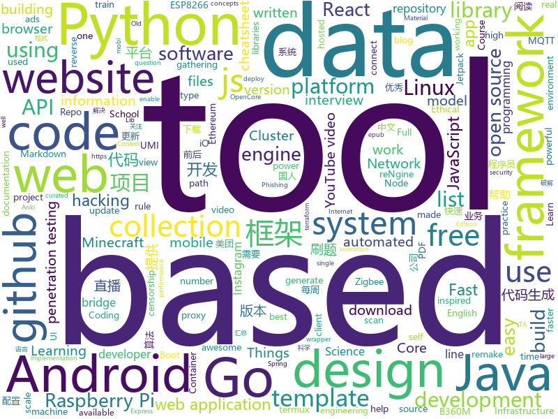

# 2020-07-26
See what the GitHub community is most excited about.

## python
+ [python-cheatsheet](https://github.com/gto76/python-cheatsheet)(**56 stars today**): Comprehensive Python Cheatsheet
+ [GitHub520](https://github.com/521xueweihan/GitHub520)(**119 stars today**): 😘让你“爱”上 GitHub，解决访问时图裂、加载慢的问题。
+ [rpi-power-monitor](https://github.com/David00/rpi-power-monitor)(**85 stars today**): Raspberry Pi Power Monitor
+ [fawkes](https://github.com/Shawn-Shan/fawkes)(**345 stars today**): Fawkes, privacy preserving tool against facial recognition systems. More info at http://sandlab.cs.uchicago.edu/fawkes
+ [InstaPy](https://github.com/timgrossmann/InstaPy)(**16 stars today**): 📷Instagram Bot - Tool for automated Instagram interactions
+ [system-design-primer](https://github.com/donnemartin/system-design-primer)(**109 stars today**): Learn how to design large-scale systems. Prep for the system design interview. Includes Anki flashcards.
+ [anki](https://github.com/ankitects/anki)(**16 stars today**): Anki for desktop computers
+ [Tool-X](https://github.com/rajkumardusad/Tool-X)(**10 stars today**): Tool-X is a kali linux hacking Tool installer. Tool-X developed for termux and other Linux based systems. using Tool-X you can install almost 370+ hacking tools in termux app and other linux based distributions.
+ [TextAttack](https://github.com/QData/TextAttack)(**33 stars today**): TextAttack🐙is a Python framework for adversarial attacks, data augmentation, and model training in NLP
+ [retinaface](https://github.com/ternaus/retinaface)(**38 stars today**): The remake of the https://github.com/biubug6/Pytorch_Retinaface
+ [youtube-dl](https://github.com/ytdl-org/youtube-dl)(**49 stars today**): Command-line program to download videos from YouTube.com and other video sites
+ [public-apis](https://github.com/public-apis/public-apis)(**75 stars today**): A collective list of free APIs for use in software and web development.
+ [b0mb3r](https://github.com/crinny/b0mb3r)(**6 stars today**): 💣Открытый СМС бомбер
+ [OnlyFans](https://github.com/DIGITALCRIMINAL/OnlyFans)(**12 stars today**): Scrape all the media from a OnlyFans account
+ [python-telegram-bot](https://github.com/python-telegram-bot/python-telegram-bot)(**22 stars today**): We have made you a wrapper you can't refuse
+ [python-patterns](https://github.com/faif/python-patterns)(**12 stars today**): A collection of design patterns/idioms in Python
+ [deep-learning-from-scratch](https://github.com/oreilly-japan/deep-learning-from-scratch)(**5 stars today**): 『ゼロから作る Deep Learning』(O'Reilly Japan, 2016)
+ [Gesture-Gaming-using-OpenCV](https://github.com/gnana1997/Gesture-Gaming-using-OpenCV)(**13 stars today**): 
+ [tinypilot](https://github.com/mtlynch/tinypilot)(**52 stars today**): Use your Raspberry Pi as a browser-based KVM.
+ [kedro](https://github.com/quantumblacklabs/kedro)(**7 stars today**): A Python library that implements software engineering best-practice for data and ML pipelines.
+ [dvc](https://github.com/iterative/dvc)(**29 stars today**): 🦉Data Version Control | Git for Data & Models
+ [Real-Time-Voice-Cloning](https://github.com/CorentinJ/Real-Time-Voice-Cloning)(**23 stars today**): Clone a voice in 5 seconds to generate arbitrary speech in real-time
+ [real-url](https://github.com/wbt5/real-url)(**11 stars today**): 获取斗鱼&虎牙&哔哩哔哩&抖音&快手等 27 个直播平台的真实流媒体地址(直播源)和弹幕，直播源可在 PotPlayer、flv.js 等播放器中播放。
+ [ta-lib](https://github.com/mrjbq7/ta-lib)(**7 stars today**): Python wrapper for TA-Lib (http://ta-lib.org/).
+ [hypothesis](https://github.com/HypothesisWorks/hypothesis)(**8 stars today**): Hypothesis is a powerful, flexible, and easy to use library for property-based testing.

## java
+ [androidx](https://github.com/androidx/androidx)(**331 stars today**): Development environment for Jetpack Android extension libraries. Synchronized with Jetpack's primary development branch on AOSP.
+ [GitHub-Chinese-Top-Charts](https://github.com/kon9chunkit/GitHub-Chinese-Top-Charts)(**73 stars today**): 🇨🇳GitHub中文排行榜，帮助你发现高分优秀中文项目、更高效地吸收国人的优秀经验成果；榜单每周更新一次，敬请关注！
+ [Geyser](https://github.com/GeyserMC/Geyser)(**9 stars today**): A bridge/proxy allowing you to connect to Minecraft: Java Edition servers with Minecraft: Bedrock edition.
+ [Mindustry](https://github.com/Anuken/Mindustry)(**10 stars today**): A sandbox tower defense game
+ [CtCI-6th-Edition](https://github.com/careercup/CtCI-6th-Edition)(**12 stars today**): Cracking the Coding Interview 6th Ed. Solutions
+ [animation-samples](https://github.com/android/animation-samples)(**2 stars today**): Multiple samples showing the best practices in animation on Android.
+ [MPAndroidChart](https://github.com/PhilJay/MPAndroidChart)(**12 stars today**): A powerful🚀Android chart view / graph view library, supporting line- bar- pie- radar- bubble- and candlestick charts as well as scaling, panning and animations.
+ [blynk-server](https://github.com/blynkkk/blynk-server)(**6 stars today**): Blynk is an Internet of Things Platform aimed to simplify building mobile and web applications for the Internet of Things. Easily connect 400+ hardware models like Arduino, ESP8266, ESP32, Raspberry Pi and similar MCUs and drag-n-drop IOT mobile apps for iOS and Android in 5 minutes
+ [cat](https://github.com/dianping/cat)(**38 stars today**): CAT 作为服务端项目基础组件，提供了 Java, C/C++, Node.js, Python, Go 等多语言客户端，已经在美团点评的基础架构中间件框架（MVC框架，RPC框架，数据库框架，缓存框架等，消息队列，配置系统等）深度集成，为美团点评各业务线提供系统丰富的性能指标、健康状况、实时告警等。
+ [GeoSpark](https://github.com/DataSystemsLab/GeoSpark)(**1 stars today**): A Cluster Computing System for Processing Large-Scale Spatial Data
+ [VirtualApp](https://github.com/asLody/VirtualApp)(**3 stars today**): Virtual Engine for Android(Support 10.0 in business version)
+ [ghidra](https://github.com/NationalSecurityAgency/ghidra)(**32 stars today**): Ghidra is a software reverse engineering (SRE) framework
+ [termux-app](https://github.com/termux/termux-app)(**9 stars today**): Android terminal and Linux environment - app repository.
+ [clojure](https://github.com/clojure/clojure)(**5 stars today**): The Clojure programming language
+ [lithium-fabric](https://github.com/jellysquid3/lithium-fabric)(**6 stars today**): A Fabric mod designed to improve the general performance of Minecraft without breaking things
+ [MyBookshelf](https://github.com/gedoor/MyBookshelf)(**6 stars today**): 阅读是一款可以自定义来源阅读网络内容的工具，为广大网络文学爱好者提供一种方便、快捷舒适的试读体验。
+ [k-9](https://github.com/k9mail/k-9)(**4 stars today**): K-9 Mail – Open Source Email App for Android
+ [igniter](https://github.com/trojan-gfw/igniter)(**4 stars today**): A trojan client for Android (UNDER CONSTRUCTION).
+ [ripme](https://github.com/RipMeApp/ripme)(**4 stars today**): Downloads albums in bulk
+ [OpenRefine](https://github.com/OpenRefine/OpenRefine)(**2 stars today**): OpenRefine is a free, open source power tool for working with messy data and improving it
+ [jeecg-boot](https://github.com/zhangdaiscott/jeecg-boot)(**20 stars today**): 基于代码生成器的低代码平台，无代码开发、超越传统商业平台！前后端分离架构：SpringBoot 2.x，Ant Design&Vue，Mybatis-plus，Shiro，JWT。强大的代码生成器让前后端代码一键生成，无需写任何代码! 引领新开发模式(OnlineCoding-> 代码生成-> 手工MERGE)，帮助Java项目解决70%重复工作，让开发更关注业务逻辑，既能快速提高开发效率，帮助公司节省成本，同时又不失灵活性。
+ [Cimoc](https://github.com/Haleydu/Cimoc)(**6 stars today**): 
+ [runelite](https://github.com/runelite/runelite)(**1 stars today**): Open source Old School RuneScape client
+ [LeetCode](https://github.com/yuanguangxin/LeetCode)(**4 stars today**): LeetCode刷题记录
+ [SpringBoot-Learning](https://github.com/dyc87112/SpringBoot-Learning)(**9 stars today**): Spring Boot基础教程，Spring Boot 2.x版本连载中！！！

## unknown
+ [jetbrains-agent-latest](https://github.com/czl0325/jetbrains-agent-latest)(**142 stars today**): jetbrains全家桶永久激活破解，不需要修改host。完美破解！共享给各个程序员兄弟使用。适用于2020版本。
+ [awesome-cold-showers](https://github.com/hwayne/awesome-cold-showers)(**864 stars today**): For when people get too hyped up about things
+ [PENTESTING-BIBLE](https://github.com/blaCCkHatHacEEkr/PENTESTING-BIBLE)(**42 stars today**): Updates to this repository will continue to arrive until the number of links reaches 10000 links & 10000 pdf files .Learn Ethical Hacking and penetration testing .hundreds of ethical hacking & penetration testing & red team & cyber security & computer science resources.
+ [machine-learning-roadmap](https://github.com/mrdbourke/machine-learning-roadmap)(**46 stars today**): A roadmap connecting many of the most important concepts in machine learning, how to learn them and what tools to use to perform them.
+ [easy_rust](https://github.com/Dhghomon/easy_rust)(**515 stars today**): Rust explained using easy English
+ [awesome-gpt3](https://github.com/elyase/awesome-gpt3)(**93 stars today**): 
+ [LeetcodeTop](https://github.com/afatcoder/LeetcodeTop)(**105 stars today**): 汇总各大互联网公司容易考察的高频leetcode题🔥
+ [umi-core-py](https://github.com/umi-top/umi-core-py)(**1,844 stars today**): UMI Core Python Library
+ [pikvm](https://github.com/pikvm/pikvm)(**31 stars today**): Open and cheap DIY IP-KVM based on Raspberry Pi
+ [JavaFamily](https://github.com/AobingJava/JavaFamily)(**187 stars today**): 【Java面试+Java学习指南】 一份涵盖大部分Java程序员所需要掌握的核心知识。
+ [data-science](https://github.com/ossu/data-science)(**39 stars today**): 📊Path to a free self-taught education in Data Science!
+ [AllThingsSSRF](https://github.com/jdonsec/AllThingsSSRF)(**36 stars today**): This is a collection of writeups, cheatsheets, videos, books related to SSRF in one single location
+ [anuraghazra](https://github.com/anuraghazra/anuraghazra)(**5 stars today**): 
+ [what-happens-when](https://github.com/alex/what-happens-when)(**27 stars today**): An attempt to answer the age old interview question "What happens when you type google.com into your browser and press enter?"
+ [lantern](https://github.com/ntkernel/lantern)(**11 stars today**): 免费 V2Ray 配置（vmess）
+ [v2fly-cf](https://github.com/tlmoe/v2fly-cf)(**12 stars today**): 
+ [COVID-19](https://github.com/CSSEGISandData/COVID-19)(**28 stars today**): Novel Coronavirus (COVID-19) Cases, provided by JHU CSSE
+ [PandaOCR](https://github.com/miaomiaosoft/PandaOCR)(**7 stars today**): PandaOCR - 多功能OCR图文识别+翻译+朗读+弹窗+公式+表格+图床+搜图+二维码
+ [clash_for_windows_pkg](https://github.com/Fndroid/clash_for_windows_pkg)(**46 stars today**): A Windows/macOS GUI based on Clash
+ [nuclei-templates](https://github.com/projectdiscovery/nuclei-templates)(**5 stars today**): Community curated list of template files for the nuclei engine to find security vulnerability and fingerprinting the targets.
+ [timburgan](https://github.com/timburgan/timburgan)(**27 stars today**): 
+ [free-programming-books](https://github.com/EbookFoundation/free-programming-books)(**87 stars today**): 📚Freely available programming books
+ [the-economist-ebooks](https://github.com/hehonghui/the-economist-ebooks)(**7 stars today**): The Economist ebooks(epub, mobi format), update weekly. 经济学人、纽约客杂志电子版下载、订阅(kindle格式),支持epub、mobi格式, 每周更新
+ [MSI-B360M-MORTAR-HACKINTOSH-OPENCORE-EFI](https://github.com/GeQ1an/MSI-B360M-MORTAR-HACKINTOSH-OPENCORE-EFI)(**3 stars today**): 「微星 B360M 迫击炮」黑苹果 OpenCore EFI / MSI B360M MORTAR Hackintosh OpenCore EFI
+ [the-book-of-secret-knowledge](https://github.com/trimstray/the-book-of-secret-knowledge)(**24 stars today**): A collection of inspiring lists, manuals, cheatsheets, blogs, hacks, one-liners, cli/web tools and more.

## javascript
+ [rengine](https://github.com/yogeshojha/rengine)(**198 stars today**): reNgine is an automated reconnaissance framework meant for gathering information during penetration testing of web applications. reNgine has customizable scan engines, which can be used to scan the websites, endpoints, and gather information.
+ [github-readme-stats](https://github.com/anuraghazra/github-readme-stats)(**258 stars today**): ⚡Dynamically generated stats for your github readmes
+ [gpt3-sandbox](https://github.com/shreyashankar/gpt3-sandbox)(**108 stars today**): The goal of this project is to enable users to create cool web demos using the newly released OpenAI GPT-3 API with just a few lines of Python.
+ [umi-core-js](https://github.com/umi-top/umi-core-js)(**1,584 stars today**): UMI Core JS Library
+ [clean-code-javascript](https://github.com/ryanmcdermott/clean-code-javascript)(**52 stars today**): 🛁Clean Code concepts adapted for JavaScript
+ [hello-algorithm](https://github.com/geekxh/hello-algorithm)(**727 stars today**): 🙈🙉🙊本项目包括：1、我写的三十万字图解算法题典 2、100 张 IT 相关超清思维导图 3、100 篇大厂面经汇总 4、各语言编程电子书 100 本 5、English version supported !!!🚀🚀国人项目上榜首不易，右上角助力一波！干就对了，奥利给 ！🚀🚀
+ [yieldfarming](https://github.com/yieldfarming/yieldfarming)(**7 stars today**): 🧑‍🌾It ain't much, but it's an honest work
+ [leonsans](https://github.com/cmiscm/leonsans)(**136 stars today**): Leon Sans is a geometric sans-serif typeface made with code in 2019 by Jongmin Kim.
+ [v4](https://github.com/bchiang7/v4)(**17 stars today**): Fourth iteration of my personal website
+ [project_chat_application](https://github.com/adrianhajdin/project_chat_application)(**17 stars today**): This is a code repository for the corresponding YouTube video. In this tutorial we are going to build and deploy a real time chat application. Covered topics: React.js, Node.js, Express.js, and Socket.io.
+ [iptv](https://github.com/iptv-org/iptv)(**28 stars today**): Collection of 8000+ publicly available IPTV channels from all over the world
+ [react-refresh-webpack-plugin](https://github.com/pmmmwh/react-refresh-webpack-plugin)(**89 stars today**): A Webpack plugin to enable "Fast Refresh" (also previously known as Hot Reloading) for React components.
+ [pipedream](https://github.com/PipedreamHQ/pipedream)(**11 stars today**): Serverless integration and compute platform. Free for developers.
+ [awesome-README-templates](https://github.com/elangosundar/awesome-README-templates)(**16 stars today**): A collection of awesome readme templates to display on your github profile.
+ [zigbee2mqtt](https://github.com/Koenkk/zigbee2mqtt)(**4 stars today**): Zigbee🐝to MQTT bridge🌉, get rid of your proprietary Zigbee bridges🔨
+ [esercizi-di-programmazione-javascript](https://github.com/AlbertoOlla/esercizi-di-programmazione-javascript)(**3 stars today**): Esercizi di informatica! Impara a programmare, metti alla prova!
+ [three.js](https://github.com/mrdoob/three.js)(**39 stars today**): JavaScript 3D library.
+ [next.js](https://github.com/vercel/next.js)(**58 stars today**): The React Framework
+ [heroicons](https://github.com/tailwindlabs/heroicons)(**20 stars today**): A set of free MIT-licensed high-quality SVG icons for UI development.
+ [Motrix](https://github.com/agalwood/Motrix)(**20 stars today**): A full-featured download manager.
+ [gatsby-simplefolio](https://github.com/cobidev/gatsby-simplefolio)(**9 stars today**): ⚡️A minimal Gatsby portfolio template for Developers
+ [label-studio](https://github.com/heartexlabs/label-studio)(**15 stars today**): Label Studio is a multi-type data labeling and annotation tool with standardized output format
+ [website](https://github.com/CodingTrain/website)(**8 stars today**): The train engine powering the Coding Train website
+ [WebGL-Fluid-Simulation](https://github.com/PavelDoGreat/WebGL-Fluid-Simulation)(**32 stars today**): Play with fluids in your browser (works even on mobile)
+ [material-ui](https://github.com/mui-org/material-ui)(**37 stars today**): React components for faster and easier web development. Build your own design system, or start with Material Design.

## html
+ [umi-top.github.io](https://github.com/umi-top/umi-top.github.io)(**1,943 stars today**): 
+ [us-potus-model](https://github.com/TheEconomist/us-potus-model)(**5 stars today**): Code for a dynamic multilevel Bayesian model to predict US presidential elections. Written in R and Stan.
+ [fluxion](https://github.com/FluxionNetwork/fluxion)(**7 stars today**): Fluxion is a remake of linset by vk496 with enhanced functionality.
+ [node-ytdl-core](https://github.com/fent/node-ytdl-core)(**4 stars today**): YouTube video downloader in javascript.
+ [Tasmota](https://github.com/arendst/Tasmota)(**10 stars today**): Alternative firmware for ESP8266 with easy configuration using webUI, OTA updates, automation using timers or rules, expandability and entirely local control over MQTT, HTTP, Serial or KNX. Full documentation at
+ [webdevbootcamp](https://github.com/nax3t/webdevbootcamp)(**6 stars today**): All source code for back-end projects from the Web Developer Bootcamp
+ [hugo-academic](https://github.com/gcushen/hugo-academic)(**13 stars today**): 📝The website builder for Hugo. Build and deploy a beautiful website in minutes!
+ [Coursera-ML-AndrewNg-Notes](https://github.com/fengdu78/Coursera-ML-AndrewNg-Notes)(**22 stars today**): 吴恩达老师的机器学习课程个人笔记
+ [shellphish](https://github.com/suljot/shellphish)(**6 stars today**): Phishing Tool for Instagram, Facebook, Twitter, Snapchat, Github
+ [hugo-book](https://github.com/alex-shpak/hugo-book)(**9 stars today**): Hugo documentation theme as simple as plain book
+ [Intro-to-Data-APIs-JS](https://github.com/CodingTrain/Intro-to-Data-APIs-JS)(**4 stars today**): Working with Data and APIs in JavaScript
+ [datasciencecoursera](https://github.com/mGalarnyk/datasciencecoursera)(**2 stars today**): Data Science Repo and blog for John Hopkins Coursera Courses. Please let me know if you have any questions.
+ [EIPs](https://github.com/ethereum/EIPs)(**3 stars today**): The Ethereum Improvement Proposal repository
+ [personal-website](https://github.com/github/personal-website)(**6 stars today**): Code that'll help you kickstart a personal website that showcases your work as a software developer.
+ [portfolio-website](https://github.com/divanov11/portfolio-website)(**7 stars today**): 
+ [svelte-material-ui](https://github.com/hperrin/svelte-material-ui)(**4 stars today**): Svelte Material UI Components
+ [FakeLocation](https://github.com/Lerist/FakeLocation)(**5 stars today**): Fake Location
+ [ML-notes](https://github.com/Sakura-gh/ML-notes)(**14 stars today**): notes about machine learning
+ [awesome-piracy](https://github.com/Igglybuff/awesome-piracy)(**13 stars today**): A curated list of awesome warez and piracy links
+ [web-moderno](https://github.com/cod3rcursos/web-moderno)(**5 stars today**): 
+ [fullstack-course5](https://github.com/jhu-ep-coursera/fullstack-course5)(**0 stars today**): All of the source code for the Single Page Web Applications with AngularJS course.
+ [learning-area](https://github.com/mdn/learning-area)(**6 stars today**): Github repo for the MDN Learning Area.
+ [zphisher](https://github.com/htr-tech/zphisher)(**5 stars today**): Automated Phishing Tool
+ [blog_os](https://github.com/phil-opp/blog_os)(**14 stars today**): Writing an OS in Rust
+ [educenter-hugo](https://github.com/themefisher/educenter-hugo)(**0 stars today**): Educenter is an educational website template. It can be used as an online teaching platform, school and university websites

## go
+ [OpenDiablo2](https://github.com/OpenDiablo2/OpenDiablo2)(**180 stars today**): An open source re-implementation of Diablo 2
+ [umi-core](https://github.com/umi-top/umi-core)(**1,845 stars today**): UMI Core Go Library
+ [PhoneInfoga](https://github.com/sundowndev/PhoneInfoga)(**6 stars today**): Advanced information gathering & OSINT framework for phone numbers
+ [twtxt](https://github.com/prologic/twtxt)(**14 stars today**): 📕a twtxt client in the form of a web application and hosted service that provides a self-hosted, decentralised micro-blogging platform. No ads, no tracking, your content!
+ [go-admin](https://github.com/GoAdminGroup/go-admin)(**8 stars today**): A golang framework helps gopher to build a data visualization and admin panel in ten minutes
+ [cluster-api](https://github.com/kubernetes-sigs/cluster-api)(**8 stars today**): Home for the Cluster Management API work, a subproject of sig-cluster-lifecycle
+ [hugo](https://github.com/gohugoio/hugo)(**44 stars today**): The world’s fastest framework for building websites.
+ [clash](https://github.com/Dreamacro/clash)(**63 stars today**): A rule-based tunnel in Go.
+ [gotop](https://github.com/cjbassi/gotop)(**6 stars today**): A terminal based graphical activity monitor inspired by gtop and vtop
+ [lantern](https://github.com/getlantern/lantern)(**22 stars today**): Lantern官方版本下载 蓝灯 翻墙 代理 科学上网 外网 加速器 梯子 路由 lantern proxy vpn censorship-circumvention censorship gfw accelerator
+ [charts](https://github.com/helm/charts)(**17 stars today**): Curated applications for Kubernetes
+ [v2ray-core](https://github.com/v2ray/v2ray-core)(**32 stars today**): A platform for building proxies to bypass network restrictions.
+ [fiber](https://github.com/gofiber/fiber)(**53 stars today**): ⚡️Fiber is an Express inspired web framework written in Go with☕️
+ [fasthttp](https://github.com/valyala/fasthttp)(**25 stars today**): Fast HTTP package for Go. Tuned for high performance. Zero memory allocations in hot paths. Up to 10x faster than net/http
+ [goldmark](https://github.com/yuin/goldmark)(**13 stars today**): 🏆A markdown parser written in Go. Easy to extend, standard(CommonMark) compliant, well structured.
+ [esbuild](https://github.com/evanw/esbuild)(**20 stars today**): An extremely fast JavaScript bundler and minifier
+ [go-ethereum](https://github.com/ethereum/go-ethereum)(**13 stars today**): Official Go implementation of the Ethereum protocol
+ [terraformer](https://github.com/GoogleCloudPlatform/terraformer)(**13 stars today**): CLI tool to generate terraform files from existing infrastructure (reverse Terraform). Infrastructure to Code
+ [httprobe](https://github.com/tomnomnom/httprobe)(**4 stars today**): Take a list of domains and probe for working HTTP and HTTPS servers
+ [vuls](https://github.com/future-architect/vuls)(**107 stars today**): Agent-less vulnerability scanner for Linux, FreeBSD, Container Image, Running Container, WordPress, Programming language libraries, Network devices
+ [nuclei](https://github.com/projectdiscovery/nuclei)(**9 stars today**): Nuclei is a fast tool for configurable targeted scanning based on templates offering massive extensibility and ease of use.
+ [algorithm-pattern](https://github.com/greyireland/algorithm-pattern)(**45 stars today**): 算法模板，最科学的刷题方式，最快速的刷题路径，你值得拥有~
+ [AdGuardHome](https://github.com/AdguardTeam/AdGuardHome)(**18 stars today**): Network-wide ads & trackers blocking DNS server
+ [gotenberg](https://github.com/thecodingmachine/gotenberg)(**10 stars today**): A Docker-powered stateless API for converting HTML, Markdown and Office documents to PDF
+ [golang-web-dev](https://github.com/GoesToEleven/golang-web-dev)(**4 stars today**): 

## WordCloud

