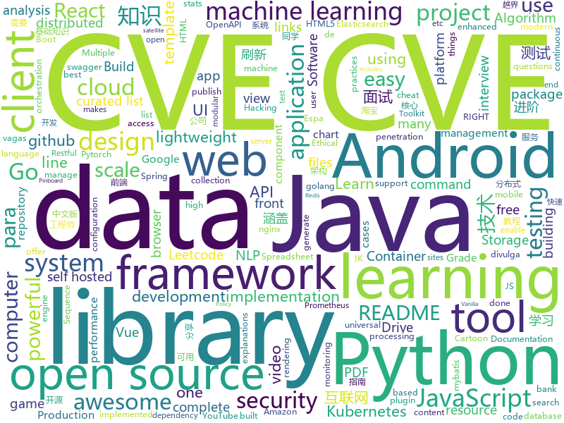

# 2020-07-29
See what the GitHub community is most excited about.

## python
+ [python-cheatsheet](https://github.com/gto76/python-cheatsheet)(**306 stars today**): Comprehensive Python Cheatsheet
+ [movement-tracking](https://github.com/surya-veer/movement-tracking)(**92 stars today**): UP - DOWN - LEFT - RIGHT movement tracking.
+ [Super-mario-bros-PPO-pytorch](https://github.com/uvipen/Super-mario-bros-PPO-pytorch)(**53 stars today**): Proximal Policy Optimization (PPO) algorithm for Super Mario Bros
+ [QuickCut](https://github.com/HaujetZhao/QuickCut)(**51 stars today**): Your most handy video processing software
+ [fairseq](https://github.com/pytorch/fairseq)(**16 stars today**): Facebook AI Research Sequence-to-Sequence Toolkit written in Python.
+ [youtube-dl](https://github.com/ytdl-org/youtube-dl)(**45 stars today**): Command-line program to download videos from YouTube.com and other video sites
+ [spaCy](https://github.com/explosion/spaCy)(**17 stars today**): 💫Industrial-strength Natural Language Processing (NLP) with Python and Cython
+ [keras](https://github.com/keras-team/keras)(**16 stars today**): Deep Learning for humans
+ [ckan](https://github.com/ckan/ckan)(**4 stars today**): CKAN is an open-source DMS (data management system) for powering data hubs and data portals. CKAN makes it easy to publish, share and use data. It powers catalog.data.gov, europeandataportal.eu/data, data.humdata.org among many other sites.
+ [mmsegmentation](https://github.com/open-mmlab/mmsegmentation)(**45 stars today**): OpenMMLab Semantic Segmentation Toolbox and Benchmark.
+ [saleor](https://github.com/mirumee/saleor)(**12 stars today**): A modular, high performance, headless e-commerce storefront built with Python, GraphQL, Django, and ReactJS.
+ [system-design-primer](https://github.com/donnemartin/system-design-primer)(**197 stars today**): Learn how to design large-scale systems. Prep for the system design interview. Includes Anki flashcards.
+ [apex](https://github.com/NVIDIA/apex)(**5 stars today**): A PyTorch Extension: Tools for easy mixed precision and distributed training in Pytorch
+ [photo2cartoon](https://github.com/minivision-ai/photo2cartoon)(**27 stars today**): 人像卡通化探索项目 (photo-to-cartoon translation project)
+ [scikit-learn](https://github.com/scikit-learn/scikit-learn)(**24 stars today**): scikit-learn: machine learning in Python
+ [ArchiveBox](https://github.com/pirate/ArchiveBox)(**62 stars today**): 🗃The open source self-hosted web archive. Takes browser history/bookmarks/Pocket/Pinboard/etc., saves HTML, JS, PDFs, media, and more...
+ [nginx-ui](https://github.com/schenkd/nginx-ui)(**19 stars today**): Nginx UI allows you to access and modify the nginx configurations files without cli.
+ [salt](https://github.com/saltstack/salt)(**6 stars today**): Software to automate the management and configuration of any infrastructure or application at scale. Get access to the Salt software package repository here:
+ [pytest](https://github.com/pytest-dev/pytest)(**9 stars today**): The pytest framework makes it easy to write small tests, yet scales to support complex functional testing
+ [pytube](https://github.com/nficano/pytube)(**7 stars today**): A lightweight, dependency-free Python library (and command-line utility) for downloading YouTube Videos.
+ [White-box-Cartoonization](https://github.com/SystemErrorWang/White-box-Cartoonization)(**26 stars today**): Official tensorflow implementation for CVPR2020 paper “Learning to Cartoonize Using White-box Cartoon Representations”
+ [dispatch](https://github.com/Netflix/dispatch)(**12 stars today**): All of the ad-hoc things you're doing to manage incidents today, done for you, and much more!
+ [Mobile-Security-Framework-MobSF](https://github.com/MobSF/Mobile-Security-Framework-MobSF)(**1 stars today**): Mobile Security Framework (MobSF) is an automated, all-in-one mobile application (Android/iOS/Windows) pen-testing, malware analysis and security assessment framework capable of performing static and dynamic analysis.
+ [sentence-transformers](https://github.com/UKPLab/sentence-transformers)(**17 stars today**): Sentence Embeddings with BERT & XLNet
+ [weblogicScanner](https://github.com/0xn0ne/weblogicScanner)(**22 stars today**): weblogic 漏洞扫描工具。目前包含 CVE-2014-4210、CVE-2016-0638、CVE-2016-3510、CVE-2017-3248、CVE-2017-3506、CVE-2017-10271、CVE-2018-2628、CVE-2018-2893、CVE-2018-2894、CVE-2018-3191、CVE-2018-3245、CVE-2018-3252、CVE-2019-2618、CVE-2019-2725、CVE-2019-2729、CVE-2019-2890、CVE-2020-2551

## java
+ [NewPipe](https://github.com/TeamNewPipe/NewPipe)(**57 stars today**): A libre lightweight streaming front-end for Android.
+ [MCVmComputers](https://github.com/Delta2Force/MCVmComputers)(**20 stars today**): Order computer parts from a satellite orbiting around your minecraft world and build actual working computers with them!
+ [metersphere](https://github.com/metersphere/metersphere)(**30 stars today**): An open source continuous testing platform. MeterSphere 是一站式的开源企业级持续测试平台，涵盖测试跟踪、接口测试、性能测试、团队协作等功能，全面兼容 JMeter、Postman 等开源、主流标准。
+ [Telegram](https://github.com/DrKLO/Telegram)(**13 stars today**): Telegram for Android source
+ [advanced-java](https://github.com/doocs/advanced-java)(**33 stars today**): 😮互联网 Java 工程师进阶知识完全扫盲：涵盖高并发、分布式、高可用、微服务、海量数据处理等领域知识，后端同学必看，前端同学也可学习
+ [mybatis-plus](https://github.com/baomidou/mybatis-plus)(**12 stars today**): An powerful enhanced toolkit of MyBatis for simplify development
+ [spring-security](https://github.com/spring-projects/spring-security)(**7 stars today**): Spring Security
+ [okhttp](https://github.com/square/okhttp)(**13 stars today**): Square’s meticulous HTTP client for Java and Kotlin.
+ [dbeaver](https://github.com/dbeaver/dbeaver)(**19 stars today**): Free universal database tool and SQL client
+ [graphql-java](https://github.com/graphql-java/graphql-java)(**4 stars today**): GraphQL Java implementation
+ [CS-Notes](https://github.com/CyC2018/CS-Notes)(**86 stars today**): 📚技术面试必备基础知识、Leetcode、计算机操作系统、计算机网络、系统设计、Java、Python、C++
+ [liugh-parent](https://github.com/qq53182347/liugh-parent)(**19 stars today**): SpringBoot+SpringCloud Oauth2+JWT+MybatisPlus实现Restful快速开发后端脚手架
+ [spring-boot-examples](https://github.com/ityouknow/spring-boot-examples)(**15 stars today**): about learning Spring Boot via examples. Spring Boot 教程、技术栈示例代码，快速简单上手教程。
+ [JavaGuide](https://github.com/Snailclimb/JavaGuide)(**100 stars today**): 「Java学习+面试指南」一份涵盖大部分Java程序员所需要掌握的核心知识。
+ [QMUI_Android](https://github.com/Tencent/QMUI_Android)(**12 stars today**): 提高 Android UI 开发效率的 UI 库
+ [cim](https://github.com/crossoverJie/cim)(**9 stars today**): 📲cim(cross IM) 适用于开发者的分布式即时通讯系统
+ [mybatis](https://github.com/tuguangquan/mybatis)(**5 stars today**): mybatis源码中文注释
+ [selenium](https://github.com/SeleniumHQ/selenium)(**14 stars today**): A browser automation framework and ecosystem.
+ [elasticsearch](https://github.com/elastic/elasticsearch)(**22 stars today**): Open Source, Distributed, RESTful Search Engine
+ [MPAndroidChart](https://github.com/PhilJay/MPAndroidChart)(**13 stars today**): A powerful🚀Android chart view / graph view library, supporting line- bar- pie- radar- bubble- and candlestick charts as well as scaling, panning and animations.
+ [elasticsearch-analysis-ik](https://github.com/medcl/elasticsearch-analysis-ik)(**12 stars today**): The IK Analysis plugin integrates Lucene IK analyzer into elasticsearch, support customized dictionary.
+ [java-design-patterns](https://github.com/iluwatar/java-design-patterns)(**30 stars today**): Design patterns implemented in Java
+ [SmartRefreshLayout](https://github.com/scwang90/SmartRefreshLayout)(**9 stars today**): 🔥下拉刷新、上拉加载、二级刷新、淘宝二楼、RefreshLayout、OverScroll，Android智能下拉刷新框架，支持越界回弹、越界拖动，具有极强的扩展性，集成了几十种炫酷的Header和 Footer。
+ [Sentinel](https://github.com/alibaba/Sentinel)(**16 stars today**): A powerful flow control component enabling reliability, resilience and monitoring for microservices. (面向云原生微服务的高可用流控防护组件)
+ [views-widgets-samples](https://github.com/android/views-widgets-samples)(**8 stars today**): Multiple samples showing the best practices in views-widgets on Android.

## unknown
+ [rest-api-description](https://github.com/github/rest-api-description)(**83 stars today**): An OpenAPI description for GitHub's REST API
+ [machine-learning-roadmap](https://github.com/mrdbourke/machine-learning-roadmap)(**658 stars today**): A roadmap connecting many of the most important concepts in machine learning, how to learn them and what tools to use to perform them.
+ [fucking-algorithm](https://github.com/labuladong/fucking-algorithm)(**294 stars today**): 刷算法全靠套路，认准 labuladong 就够了！English version supported! Crack LeetCode, not only how, but also why.
+ [pikvm](https://github.com/pikvm/pikvm)(**53 stars today**): Open and cheap DIY IP-KVM based on Raspberry Pi
+ [awesome-gpt3](https://github.com/elyase/awesome-gpt3)(**195 stars today**): 
+ [awesome-falsehood](https://github.com/kdeldycke/awesome-falsehood)(**80 stars today**): 😱Falsehoods Programmers Believe in
+ [PENTESTING-BIBLE](https://github.com/blaCCkHatHacEEkr/PENTESTING-BIBLE)(**121 stars today**): Updates to this repository will continue to arrive until the number of links reaches 10000 links & 10000 pdf files .Learn Ethical Hacking and penetration testing .hundreds of ethical hacking & penetration testing & red team & cyber security & computer science resources.
+ [awesome-readme](https://github.com/matiassingers/awesome-readme)(**33 stars today**): A curated list of awesome READMEs
+ [OnJava8](https://github.com/LingCoder/OnJava8)(**148 stars today**): 《On Java 8》中文版，又名《Java编程思想》 第5版
+ [LeetcodeTop](https://github.com/afatcoder/LeetcodeTop)(**213 stars today**): 汇总各大互联网公司容易考察的高频leetcode题🔥
+ [deep-learning-drizzle](https://github.com/kmario23/deep-learning-drizzle)(**18 stars today**): Drench yourself in Deep Learning, Reinforcement Learning, Machine Learning, Computer Vision, and NLP by learning from these exciting lectures!!
+ [covid-19-data](https://github.com/nytimes/covid-19-data)(**9 stars today**): An ongoing repository of data on coronavirus cases and deaths in the U.S.
+ [InterpretableMLBook](https://github.com/MingchaoZhu/InterpretableMLBook)(**16 stars today**): 《可解释的机器学习--黑盒模型可解释性理解指南》，该书为《Interpretable Machine Learning》中文版
+ [NLP_ability](https://github.com/DA-southampton/NLP_ability)(**23 stars today**): 总结梳理自然语言处理工程师(NLP)需要积累的各方面知识，包括各种面试题，基础知识，工程能力等等，提升核心竞争力
+ [vagas](https://github.com/backend-br/vagas)(**11 stars today**): ✌️Espaço para divulgação de vagas para backenders
+ [docker-cheat-sheet](https://github.com/wsargent/docker-cheat-sheet)(**6 stars today**): Docker Cheat Sheet
+ [javascript-questions](https://github.com/lydiahallie/javascript-questions)(**30 stars today**): A long list of (advanced) JavaScript questions, and their explanations✨
+ [bank_interview](https://github.com/sty945/bank_interview)(**17 stars today**): 🏦银行笔试面试经验分享及资料分享（help you pass the bank interview, and get a amazing bank offer!）
+ [architecture.of.internet-product](https://github.com/davideuler/architecture.of.internet-product)(**43 stars today**): 互联网公司技术架构，微信/淘宝/微博/腾讯/阿里/美团点评/百度/Google/Facebook/Amazon/eBay的架构，欢迎PR补充
+ [awesome-domain-adaptation](https://github.com/zhaoxin94/awesome-domain-adaptation)(**4 stars today**): A collection of AWESOME things about domian adaptation
+ [Become-A-Full-Stack-Web-Developer](https://github.com/bmorelli25/Become-A-Full-Stack-Web-Developer)(**9 stars today**): Free resources for learning Full Stack Web Development
+ [awesome-self-supervised-learning](https://github.com/jason718/awesome-self-supervised-learning)(**23 stars today**): A curated list of awesome self-supervised methods
+ [architect-awesome](https://github.com/xingshaocheng/architect-awesome)(**28 stars today**): 后端架构师技术图谱
+ [vagas](https://github.com/frontendbr/vagas)(**10 stars today**): 🔬Espaço para divulgação de vagas para front-enders.
+ [machine-learning-for-software-engineers](https://github.com/ZuzooVn/machine-learning-for-software-engineers)(**10 stars today**): A complete daily plan for studying to become a machine learning engineer.

## javascript
+ [aluraflix](https://github.com/imersao-alura/aluraflix)(**46 stars today**): ⚛️Projeto feito durante a Imersão React da Alura
+ [Zoom-Clone-With-WebRTC](https://github.com/WebDevSimplified/Zoom-Clone-With-WebRTC)(**27 stars today**): 
+ [gpt3-sandbox](https://github.com/shreyashankar/gpt3-sandbox)(**102 stars today**): The goal of this project is to enable users to create cool web demos using the newly released OpenAI GPT-3 API with just a few lines of Python.
+ [github-readme-stats](https://github.com/anuraghazra/github-readme-stats)(**550 stars today**): ⚡Dynamically generated stats for your github readmes
+ [javascript-algorithms](https://github.com/trekhleb/javascript-algorithms)(**101 stars today**): 📝Algorithms and data structures implemented in JavaScript with explanations and links to further readings
+ [nuxt.js](https://github.com/nuxt/nuxt.js)(**32 stars today**): The Intuitive Vue Framework
+ [next.js](https://github.com/vercel/next.js)(**74 stars today**): The React Framework
+ [angular.js](https://github.com/angular/angular.js)(**5 stars today**): AngularJS - HTML enhanced for web apps!
+ [algorithm-visualizer](https://github.com/algorithm-visualizer/algorithm-visualizer)(**26 stars today**): 🎆Interactive Online Platform that Visualizes Algorithms from Code
+ [github-profile-readme-generator](https://github.com/rahuldkjain/github-profile-readme-generator)(**70 stars today**): 🚀Generate github profile README easily with latest add-ons like visitors count, github stats, etc using minimal UI.
+ [sheetjs](https://github.com/SheetJS/sheetjs)(**22 stars today**): 📗SheetJS Community Edition -- Spreadsheet Data Toolkit
+ [Awesome-Profile-README-templates](https://github.com/kautukkundan/Awesome-Profile-README-templates)(**216 stars today**): A collection of awesome readme templates to display on your profile
+ [create-react-app](https://github.com/facebook/create-react-app)(**41 stars today**): Set up a modern web app by running one command.
+ [material-ui](https://github.com/mui-org/material-ui)(**33 stars today**): React components for faster and easier web development. Build your own design system, or start with Material Design.
+ [Chart.js](https://github.com/chartjs/Chart.js)(**28 stars today**): Simple HTML5 Charts using the <canvas> tag
+ [javascript](https://github.com/airbnb/javascript)(**55 stars today**): JavaScript Style Guide
+ [pdf.js](https://github.com/mozilla/pdf.js)(**13 stars today**): PDF Reader in JavaScript
+ [discord.js](https://github.com/discordjs/discord.js)(**17 stars today**): A powerful JavaScript library for interacting with the Discord API
+ [handsontable](https://github.com/handsontable/handsontable)(**9 stars today**): Handsontable is a JavaScript/HTML5 data grid with spreadsheet look & feel. Available for React, Vue and Angular.
+ [react](https://github.com/facebook/react)(**74 stars today**): A declarative, efficient, and flexible JavaScript library for building user interfaces.
+ [msk-components](https://github.com/ManojSatishkumar/msk-components)(**9 stars today**): A Library of all the components for MSK Documents
+ [Zettlr](https://github.com/Zettlr/Zettlr)(**32 stars today**): A Markdown Editor for the 21st century.
+ [gatsby](https://github.com/gatsbyjs/gatsby)(**32 stars today**): Build blazing fast, modern apps and websites with React
+ [cypress](https://github.com/cypress-io/cypress)(**25 stars today**): Fast, easy and reliable testing for anything that runs in a browser.
+ [engine](https://github.com/cocos-creator/engine)(**1 stars today**): Cocos Creator is a complete package of game development tools and workflow, including a game engine, resource management, scene editing, game preview, debug and publish one project to multiple platforms.

## html
+ [training-kit](https://github.com/github/training-kit)(**6 stars today**): Open source cheat sheets for Git and GitHub
+ [JavaScript30](https://github.com/wesbos/JavaScript30)(**15 stars today**): 30 Day Vanilla JS Challenge
+ [tidytuesday](https://github.com/rfordatascience/tidytuesday)(**6 stars today**): Official repo for the #tidytuesday project
+ [django-DefectDojo](https://github.com/DefectDojo/django-DefectDojo)(**3 stars today**): DefectDojo is an open-source application vulnerability correlation and security orchestration tool.
+ [mxgraph](https://github.com/jgraph/mxgraph)(**10 stars today**): mxGraph is a fully client side JavaScript diagramming library
+ [Front-end-Developer-Interview-Questions](https://github.com/h5bp/Front-end-Developer-Interview-Questions)(**29 stars today**): A list of helpful front-end related questions you can use to interview potential candidates, test yourself or completely ignore.
+ [swagger-codegen](https://github.com/swagger-api/swagger-codegen)(**6 stars today**): swagger-codegen contains a template-driven engine to generate documentation, API clients and server stubs in different languages by parsing your OpenAPI / Swagger definition.
+ [docsy](https://github.com/google/docsy)(**3 stars today**): A set of Hugo doc templates for launching open source content.
+ [Java-Interview-Advanced](https://github.com/shishan100/Java-Interview-Advanced)(**8 stars today**): 中华石杉--互联网Java进阶面试训练营
+ [seldon-core](https://github.com/SeldonIO/seldon-core)(**3 stars today**): An MLOps framework to package, deploy, monitor and manage thousands of production machine learning models
+ [boost](https://github.com/boostorg/boost)(**3 stars today**): Super-project for modularized Boost
+ [v-calendar](https://github.com/nathanreyes/v-calendar)(**5 stars today**): A lightweight, dependency-free plugin for building attributed calendars in Vue.js
+ [apidoc](https://github.com/apidoc/apidoc)(**11 stars today**): RESTful web API Documentation Generator.
+ [OpenClash](https://github.com/vernesong/OpenClash)(**10 stars today**): A Clash Client For OpenWrt
+ [openshift-docs](https://github.com/openshift/openshift-docs)(**0 stars today**): OpenShift 3 and 4 documentation
+ [DetectionLab](https://github.com/clong/DetectionLab)(**6 stars today**): Automate the creation of a lab environment complete with security tooling and logging best practices
+ [Front-End-Knowledges](https://github.com/dennis-jiang/Front-End-Knowledges)(**0 stars today**): 前端知识进阶
+ [embeddedsw](https://github.com/Xilinx/embeddedsw)(**0 stars today**): Xilinx Embedded Software (embeddedsw) Development
+ [bulma-templates](https://github.com/BulmaTemplates/bulma-templates)(**4 stars today**): free flexbox templates built with the bulma css framework
+ [zphisher](https://github.com/htr-tech/zphisher)(**3 stars today**): Automated Phishing Tool
+ [os-syllabi](https://github.com/computer-system-education/os-syllabi)(**1 stars today**): 
+ [ML-notes](https://github.com/Sakura-gh/ML-notes)(**12 stars today**): notes about machine learning
+ [url-to-pdf-api](https://github.com/alvarcarto/url-to-pdf-api)(**2 stars today**): Web page PDF/PNG rendering done right. Self-hosted service for rendering receipts, invoices, or any content.
+ [EIPs](https://github.com/ethereum/EIPs)(**4 stars today**): The Ethereum Improvement Proposal repository
+ [electron-api-demos](https://github.com/electron/electron-api-demos)(**8 stars today**): Explore the Electron APIs

## go
+ [argo-cd](https://github.com/argoproj/argo-cd)(**8 stars today**): Declarative continuous deployment for Kubernetes.
+ [redis](https://github.com/go-redis/redis)(**12 stars today**): Type-safe Redis client for Golang
+ [beats](https://github.com/elastic/beats)(**4 stars today**): 🐠Beats - Lightweight shippers for Elasticsearch & Logstash
+ [rclone](https://github.com/rclone/rclone)(**18 stars today**): "rsync for cloud storage" - Google Drive, Amazon Drive, S3, Dropbox, Backblaze B2, One Drive, Swift, Hubic, Cloudfiles, Google Cloud Storage, Yandex Files
+ [awesome-go](https://github.com/avelino/awesome-go)(**51 stars today**): A curated list of awesome Go frameworks, libraries and software
+ [dubbo-go](https://github.com/apache/dubbo-go)(**24 stars today**): Go Implementation For Apache Dubbo
+ [kops](https://github.com/kubernetes/kops)(**10 stars today**): Kubernetes Operations (kops) - Production Grade K8s Installation, Upgrades, and Management
+ [terraform-provider-aws](https://github.com/terraform-providers/terraform-provider-aws)(**7 stars today**): Terraform AWS provider
+ [xlsx](https://github.com/tealeg/xlsx)(**5 stars today**): Go (golang) library for reading and writing XLSX files.
+ [prometheus](https://github.com/prometheus/prometheus)(**24 stars today**): The Prometheus monitoring system and time series database.
+ [alertmanager](https://github.com/prometheus/alertmanager)(**5 stars today**): Prometheus Alertmanager
+ [groupcache](https://github.com/golang/groupcache)(**8 stars today**): groupcache is a caching and cache-filling library, intended as a replacement for memcached in many cases.
+ [sourcegraph](https://github.com/sourcegraph/sourcegraph)(**5 stars today**): Universal code search (self-hosted)
+ [kubernetes](https://github.com/kubernetes/kubernetes)(**40 stars today**): Production-Grade Container Scheduling and Management
+ [node_exporter](https://github.com/prometheus/node_exporter)(**10 stars today**): Exporter for machine metrics
+ [cri-o](https://github.com/cri-o/cri-o)(**3 stars today**): Open Container Initiative-based implementation of Kubernetes Container Runtime Interface
+ [client_golang](https://github.com/prometheus/client_golang)(**4 stars today**): Prometheus instrumentation library for Go applications
+ [client-go](https://github.com/kubernetes/client-go)(**6 stars today**): Go client for Kubernetes.
+ [distribution](https://github.com/docker/distribution)(**5 stars today**): The Docker toolset to pack, ship, store, and deliver content
+ [nats-server](https://github.com/nats-io/nats-server)(**6 stars today**): High-Performance server for NATS, the cloud native messaging system.
+ [ferry](https://github.com/lanyulei/ferry)(**18 stars today**): 
+ [rook](https://github.com/rook/rook)(**7 stars today**): Storage Orchestration for Kubernetes
+ [fabric](https://github.com/hyperledger/fabric)(**9 stars today**): Hyperledger Fabric is an enterprise-grade permissioned distributed ledger framework for developing solutions and applications. Its modular and versatile design satisfies a broad range of industry use cases. It offers a unique approach to consensus that enables performance at scale while preserving privacy.
+ [operator-sdk](https://github.com/operator-framework/operator-sdk)(**5 stars today**): SDK for building Kubernetes applications. Provides high level APIs, useful abstractions, and project scaffolding.
+ [go-cloud](https://github.com/google/go-cloud)(**5 stars today**): The Go Cloud Development Kit (Go CDK): A library and tools for open cloud development in Go.

## WordCloud

