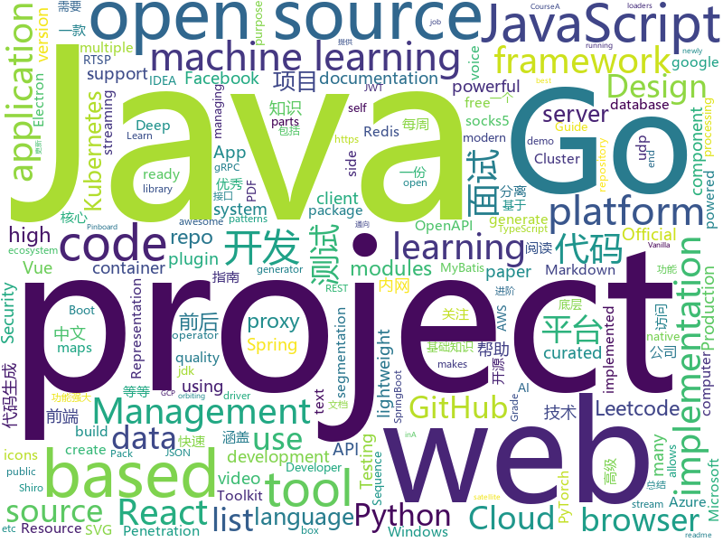

# 2020-07-30
See what the GitHub community is most excited about.

## python
+ [PyTorch_YOLOv4](https://github.com/WongKinYiu/PyTorch_YOLOv4)(**109 stars today**): PyTorch implementation of YOLOv4
+ [python-cheatsheet](https://github.com/gto76/python-cheatsheet)(**491 stars today**): Comprehensive Python Cheatsheet
+ [QuickCut](https://github.com/HaujetZhao/QuickCut)(**124 stars today**): Your most handy video processing software
+ [erpnext](https://github.com/frappe/erpnext)(**8 stars today**): Open Source Alternative to SAP
+ [sentence-transformers](https://github.com/UKPLab/sentence-transformers)(**12 stars today**): Sentence Embeddings with BERT & XLNet
+ [detectron2](https://github.com/facebookresearch/detectron2)(**25 stars today**): Detectron2 is FAIR's next-generation platform for object detection and segmentation.
+ [fairseq](https://github.com/pytorch/fairseq)(**15 stars today**): Facebook AI Research Sequence-to-Sequence Toolkit written in Python.
+ [White-box-Cartoonization](https://github.com/SystemErrorWang/White-box-Cartoonization)(**33 stars today**): Official tensorflow implementation for CVPR2020 paper “Learning to Cartoonize Using White-box Cartoon Representations”
+ [rasa](https://github.com/RasaHQ/rasa)(**16 stars today**): 💬Open source machine learning framework to automate text- and voice-based conversations: NLU, dialogue management, connect to Slack, Facebook, and more - Create chatbots and voice assistants
+ [medusa](https://github.com/Ch0pin/medusa)(**16 stars today**): Binary instrumentation framework based on FRIDA
+ [caldera](https://github.com/mitre/caldera)(**9 stars today**): Automated Adversary Emulation
+ [fsociety](https://github.com/Manisso/fsociety)(**9 stars today**): fsociety Hacking Tools Pack – A Penetration Testing Framework
+ [pre-commit-hooks](https://github.com/pre-commit/pre-commit-hooks)(**4 stars today**): Some out-of-the-box hooks for pre-commit
+ [dash](https://github.com/plotly/dash)(**13 stars today**): Analytical Web Apps for Python, R, Julia, and Jupyter. No JavaScript Required.
+ [pytest](https://github.com/pytest-dev/pytest)(**13 stars today**): The pytest framework makes it easy to write small tests, yet scales to support complex functional testing
+ [kubespray](https://github.com/kubernetes-sigs/kubespray)(**8 stars today**): Deploy a Production Ready Kubernetes Cluster
+ [libra](https://github.com/Palashio/libra)(**28 stars today**): Fully automated machine learning in one-liners.
+ [optuna](https://github.com/optuna/optuna)(**9 stars today**): A hyperparameter optimization framework
+ [yolov5](https://github.com/ultralytics/yolov5)(**30 stars today**): YOLOv5 in PyTorch > ONNX > CoreML > iOS
+ [DeepLearningExamples](https://github.com/NVIDIA/DeepLearningExamples)(**12 stars today**): Deep Learning Examples
+ [ArchiveBox](https://github.com/pirate/ArchiveBox)(**30 stars today**): 🗃The open source self-hosted web archive. Takes browser history/bookmarks/Pocket/Pinboard/etc., saves HTML, JS, PDFs, media, and more...
+ [HRNet-Semantic-Segmentation](https://github.com/HRNet/HRNet-Semantic-Segmentation)(**6 stars today**): This is an official implementation of semantic segmentation for our TPAMI paper "Deep High-Resolution Representation Learning for Visual Recognition". https://arxiv.org/abs/1908.07919
+ [trax](https://github.com/google/trax)(**16 stars today**): Trax — Deep Learning with Clear Code and Speed
+ [doccano](https://github.com/doccano/doccano)(**12 stars today**): Open source text annotation tool for machine learning practitioner.
+ [spack](https://github.com/spack/spack)(**13 stars today**): A flexible package manager that supports multiple versions, configurations, platforms, and compilers.

## java
+ [tutorials](https://github.com/eugenp/tutorials)(**40 stars today**): Just Announced - "Learn Spring Security OAuth":
+ [metersphere](https://github.com/metersphere/metersphere)(**66 stars today**): An open source continuous testing platform. MeterSphere 是一站式的开源企业级持续测试平台，涵盖测试跟踪、接口测试、性能测试、团队协作等功能，全面兼容 JMeter、Postman 等开源、主流标准。
+ [NewPipe](https://github.com/TeamNewPipe/NewPipe)(**78 stars today**): A libre lightweight streaming front-end for Android.
+ [java-design-patterns](https://github.com/iluwatar/java-design-patterns)(**41 stars today**): Design patterns implemented in Java
+ [interviews](https://github.com/kdn251/interviews)(**52 stars today**): Everything you need to know to get the job.
+ [keycloak](https://github.com/keycloak/keycloak)(**12 stars today**): Open Source Identity and Access Management For Modern Applications and Services
+ [questdb](https://github.com/questdb/questdb)(**57 stars today**): An open source SQL database designed to process time series data, faster
+ [lombok-intellij-plugin](https://github.com/mplushnikov/lombok-intellij-plugin)(**7 stars today**): Lombok Plugin for IntelliJ IDEA
+ [jvm](https://github.com/doocs/jvm)(**13 stars today**): 🤗JVM 底层原理知识总结
+ [vhr](https://github.com/lenve/vhr)(**27 stars today**): 微人事是一个前后端分离的人力资源管理系统，项目采用SpringBoot+Vue开发。
+ [MyBookshelf](https://github.com/gedoor/MyBookshelf)(**22 stars today**): 阅读是一款可以自定义来源阅读网络内容的工具，为广大网络文学爱好者提供一种方便、快捷舒适的试读体验。
+ [baritone](https://github.com/cabaletta/baritone)(**5 stars today**): google maps for block game
+ [MCVmComputers](https://github.com/Delta2Force/MCVmComputers)(**33 stars today**): Order computer parts from a satellite orbiting around your minecraft world and build actual working computers with them!
+ [pulsar](https://github.com/apache/pulsar)(**8 stars today**): Apache Pulsar - distributed pub-sub messaging system
+ [GitHub-Chinese-Top-Charts](https://github.com/kon9chunkit/GitHub-Chinese-Top-Charts)(**75 stars today**): 🇨🇳GitHub中文排行榜，帮助你发现高分优秀中文项目、更高效地吸收国人的优秀经验成果；榜单每周更新一次，敬请关注！
+ [mybatis-plus](https://github.com/baomidou/mybatis-plus)(**14 stars today**): An powerful enhanced toolkit of MyBatis for simplify development
+ [usb-serial-for-android](https://github.com/mik3y/usb-serial-for-android)(**3 stars today**): Android USB host serial driver library for CDC, FTDI, Arduino and other devices.
+ [selenium](https://github.com/SeleniumHQ/selenium)(**14 stars today**): A browser automation framework and ecosystem.
+ [ksql](https://github.com/confluentinc/ksql)(**3 stars today**): The event streaming database purpose-built for stream processing applications
+ [k-9](https://github.com/k9mail/k-9)(**3 stars today**): K-9 Mail – Open Source Email App for Android
+ [java8-tutorial](https://github.com/winterbe/java8-tutorial)(**21 stars today**): Modern Java - A Guide to Java 8
+ [jdk](https://github.com/openjdk/jdk)(**64 stars today**): Read-only mirror of https://hg.openjdk.java.net/jdk/jdk
+ [jeecg-boot](https://github.com/zhangdaiscott/jeecg-boot)(**20 stars today**): 基于代码生成器的低代码平台，无代码开发、超越传统商业平台！前后端分离架构：SpringBoot 2.x，Ant Design&Vue，Mybatis-plus，Shiro，JWT。强大的代码生成器让前后端代码一键生成，无需写任何代码! 引领新开发模式(OnlineCoding-> 代码生成-> 手工MERGE)，帮助Java项目解决70%重复工作，让开发更关注业务逻辑，既能快速提高开发效率，帮助公司节省成本，同时又不失灵活性。
+ [jeecg-cloud](https://github.com/zhangdaiscott/jeecg-cloud)(**5 stars today**): 基于Spring Boot 2.1.3、 Spring Cloud Greenwich.SR3 & Alibaba、 Shiro、JWT的 JAVA快速开发平台（Jeecg Boot的微服务版本，功能和底层代码，两边保持同步）
+ [JavaGuide](https://github.com/Snailclimb/JavaGuide)(**93 stars today**): 「Java学习+面试指南」一份涵盖大部分Java程序员所需要掌握的核心知识。

## unknown
+ [roadmap](https://github.com/github/roadmap)(**621 stars today**): GitHub public roadmap
+ [machine-learning-roadmap](https://github.com/mrdbourke/machine-learning-roadmap)(**704 stars today**): A roadmap connecting many of the most important concepts in machine learning, how to learn them and what tools to use to perform them.
+ [laravel-best-practices](https://github.com/alexeymezenin/laravel-best-practices)(**32 stars today**): Laravel best practices
+ [awesome-falsehood](https://github.com/kdeldycke/awesome-falsehood)(**165 stars today**): 😱Falsehoods Programmers Believe in
+ [app-ideas](https://github.com/florinpop17/app-ideas)(**89 stars today**): A Collection of application ideas which can be used to improve your coding skills.
+ [api-guidelines](https://github.com/microsoft/api-guidelines)(**88 stars today**): Microsoft REST API Guidelines
+ [awesome-gpt3](https://github.com/elyase/awesome-gpt3)(**206 stars today**): 
+ [recetas-javascripteras](https://github.com/ger86/recetas-javascripteras)(**13 stars today**): Recopilación de recetas sobre Javascript
+ [rest-api-description](https://github.com/github/rest-api-description)(**225 stars today**): An OpenAPI description for GitHub's REST API
+ [awesome-java](https://github.com/akullpp/awesome-java)(**35 stars today**): A curated list of awesome frameworks, libraries and software for the Java programming language.
+ [fucking-algorithm](https://github.com/labuladong/fucking-algorithm)(**295 stars today**): 刷算法全靠套路，认准 labuladong 就够了！English version supported! Crack LeetCode, not only how, but also why.
+ [incyber](https://github.com/Malajab/incyber)(**15 stars today**): 
+ [leetcode_company_wise_questions](https://github.com/MysteryVaibhav/leetcode_company_wise_questions)(**16 stars today**): This is a repository containing the list of company wise questions available on leetcode premium
+ [M0nica](https://github.com/M0nica/M0nica)(**9 stars today**): All about Monica
+ [OnJava8](https://github.com/LingCoder/OnJava8)(**89 stars today**): 《On Java 8》中文版，又名《Java编程思想》 第5版
+ [JavaInterview](https://github.com/OUYANGSIHAI/JavaInterview)(**18 stars today**): 【Java面试+Java后端技术学习指南】：一份通向理想互联网公司的面试指南，包括 Java，技术面试必备基础知识、Leetcode、计算机操作系统、计算机网络、系统设计、分布式、数据库（MySQL、Redis）、Java 项目实战等
+ [NLP_ability](https://github.com/DA-southampton/NLP_ability)(**33 stars today**): 总结梳理自然语言处理工程师(NLP)需要积累的各方面知识，包括各种面试题，基础知识，工程能力等等，提升核心竞争力
+ [pikvm](https://github.com/pikvm/pikvm)(**111 stars today**): Open and cheap DIY IP-KVM based on Raspberry Pi
+ [awesome-self-supervised-learning](https://github.com/jason718/awesome-self-supervised-learning)(**15 stars today**): A curated list of awesome self-supervised methods
+ [applied-ml](https://github.com/eugeneyan/applied-ml)(**90 stars today**): 📚Curated papers, articles & videos on data science & machine learning applied in production, with results.
+ [blog](https://github.com/yygmind/blog)(**9 stars today**): 我是木易杨，公众号「高级前端进阶」作者，跟着我每周重点攻克一个前端面试重难点。接下来让我带你走进高级前端的世界，在进阶的路上，共勉！
+ [Licensing](https://github.com/AaronDinnage/Licensing)(**4 stars today**): Microsoft 365 licensing diagrams
+ [covid-19-data](https://github.com/nytimes/covid-19-data)(**18 stars today**): An ongoing repository of data on coronavirus cases and deaths in the U.S.
+ [document-style-guide](https://github.com/ruanyf/document-style-guide)(**15 stars today**): 中文技术文档的写作规范
+ [Windows-Privilege-Escalation-Resources](https://github.com/Gr1mmie/Windows-Privilege-Escalation-Resources)(**3 stars today**): Compilation of Resources from TCM's Windows Priv Esc Udemy Course

## javascript
+ [macintosh.js](https://github.com/felixrieseberg/macintosh.js)(**2,022 stars today**): A virtual Apple Macintosh with System 8, running in Electron. I'm sorry.
+ [Zoom-Clone-With-WebRTC](https://github.com/WebDevSimplified/Zoom-Clone-With-WebRTC)(**115 stars today**): 
+ [hiring-without-whiteboards](https://github.com/poteto/hiring-without-whiteboards)(**609 stars today**): ⭐️Companies that don't have a broken hiring process
+ [Otto](https://github.com/KartikChugh/Otto)(**87 stars today**): Otto makes machine learning an intuitive, natural language experience.🏆Facebook AI Challenge winner
+ [javascript-algorithms](https://github.com/trekhleb/javascript-algorithms)(**363 stars today**): 📝Algorithms and data structures implemented in JavaScript with explanations and links to further readings
+ [aluraflix](https://github.com/imersao-alura/aluraflix)(**66 stars today**): ⚛️Projeto feito durante a Imersão React da Alura
+ [react-typescript-cheatsheet](https://github.com/typescript-cheatsheets/react-typescript-cheatsheet)(**76 stars today**): Cheatsheets for experienced React developers getting started with TypeScript
+ [realworld](https://github.com/gothinkster/realworld)(**64 stars today**): "The mother of all demo apps" — Exemplary fullstack Medium.com clone powered by React, Angular, Node, Django, and many more🏅
+ [generator-jhipster](https://github.com/jhipster/generator-jhipster)(**25 stars today**): JHipster is a development platform to quickly generate, develop, & deploy modern web applications & microservice architectures.
+ [lerna](https://github.com/lerna/lerna)(**17 stars today**): 🐉A tool for managing JavaScript projects with multiple packages.
+ [gpt3-sandbox](https://github.com/shreyashankar/gpt3-sandbox)(**237 stars today**): The goal of this project is to enable users to create cool web demos using the newly released OpenAI GPT-3 API with just a few lines of Python.
+ [awx](https://github.com/ansible/awx)(**7 stars today**): AWX Project
+ [opensource.guide](https://github.com/github/opensource.guide)(**8 stars today**): 📚Community guides for open source creators
+ [webpack](https://github.com/webpack/webpack)(**15 stars today**): A bundler for javascript and friends. Packs many modules into a few bundled assets. Code Splitting allows for loading parts of the application on demand. Through "loaders", modules can be CommonJs, AMD, ES6 modules, CSS, Images, JSON, Coffeescript, LESS, ... and your custom stuff.
+ [prettier](https://github.com/prettier/prettier)(**18 stars today**): Prettier is an opinionated code formatter.
+ [next.js](https://github.com/vercel/next.js)(**71 stars today**): The React Framework
+ [mapbox-gl-js](https://github.com/mapbox/mapbox-gl-js)(**5 stars today**): Interactive, thoroughly customizable maps in the browser, powered by vector tiles and WebGL
+ [Zettlr](https://github.com/Zettlr/Zettlr)(**28 stars today**): A Markdown Editor for the 21st century.
+ [openlayers](https://github.com/openlayers/openlayers)(**5 stars today**): OpenLayers
+ [vitrine-imersao-react](https://github.com/imersao-alura/vitrine-imersao-react)(**6 stars today**): 
+ [slick](https://github.com/kenwheeler/slick)(**6 stars today**): the last carousel you'll ever need
+ [react-select](https://github.com/JedWatson/react-select)(**12 stars today**): The Select Component for React.js
+ [pdfmake](https://github.com/bpampuch/pdfmake)(**3 stars today**): Client/server side PDF printing in pure JavaScript
+ [Windows-universal-samples](https://github.com/microsoft/Windows-universal-samples)(**3 stars today**): API samples for the Universal Windows Platform.
+ [github-readme-stats](https://github.com/anuraghazra/github-readme-stats)(**359 stars today**): ⚡Dynamically generated stats for your github readmes

## html
+ [tabler-icons](https://github.com/tabler/tabler-icons)(**103 stars today**): A set of over 550 free MIT-licensed high-quality SVG icons for you to use in your web projects.
+ [django-DefectDojo](https://github.com/DefectDojo/django-DefectDojo)(**5 stars today**): DefectDojo is an open-source application vulnerability correlation and security orchestration tool.
+ [tiny-slider](https://github.com/ganlanyuan/tiny-slider)(**6 stars today**): Vanilla javascript slider for all purposes.
+ [tidytuesday](https://github.com/rfordatascience/tidytuesday)(**5 stars today**): Official repo for the #tidytuesday project
+ [swagger-codegen](https://github.com/swagger-api/swagger-codegen)(**5 stars today**): swagger-codegen contains a template-driven engine to generate documentation, API clients and server stubs in different languages by parsing your OpenAPI / Swagger definition.
+ [3d-force-graph](https://github.com/vasturiano/3d-force-graph)(**3 stars today**): 3D force-directed graph component using ThreeJS/WebGL
+ [html](https://github.com/whatwg/html)(**5 stars today**): HTML Standard
+ [v-calendar](https://github.com/nathanreyes/v-calendar)(**2 stars today**): A lightweight, dependency-free plugin for building attributed calendars in Vue.js
+ [kubernetes-failure-stories](https://github.com/hjacobs/kubernetes-failure-stories)(**7 stars today**): Compilation of public failure/horror stories related to Kubernetes
+ [repo-badges](https://github.com/dwyl/repo-badges)(**5 stars today**): ⭐Use repo badges (build passing, coverage, etc) in your readme/markdown file to signal code quality in a project.
+ [electron-api-demos](https://github.com/electron/electron-api-demos)(**8 stars today**): Explore the Electron APIs
+ [mxgraph](https://github.com/jgraph/mxgraph)(**5 stars today**): mxGraph is a fully client side JavaScript diagramming library
+ [webdevbootcamp](https://github.com/nax3t/webdevbootcamp)(**5 stars today**): All source code for back-end projects from the Web Developer Bootcamp
+ [OneIndex-Serverless](https://github.com/LiuChangFreeman/OneIndex-Serverless)(**4 stars today**): Serverless version of OneIndex, which can be deployed on aliyun.com
+ [fastclick](https://github.com/ftlabs/fastclick)(**2 stars today**): Polyfill to remove click delays on browsers with touch UIs
+ [docs](https://github.com/prometheus/docs)(**0 stars today**): Prometheus documentation: content and static site generator
+ [learning-area](https://github.com/mdn/learning-area)(**3 stars today**): Github repo for the MDN Learning Area.
+ [qcloud-documents](https://github.com/tencentyun/qcloud-documents)(**2 stars today**): 腾讯云官方文档
+ [simple-icons](https://github.com/simple-icons/simple-icons)(**8 stars today**): SVG icons for popular brands
+ [typedoc](https://github.com/TypeStrong/typedoc)(**4 stars today**): Documentation generator for TypeScript projects.
+ [boost](https://github.com/boostorg/boost)(**3 stars today**): Super-project for modularized Boost
+ [bootstrap-multiselect](https://github.com/davidstutz/bootstrap-multiselect)(**1 stars today**): JQuery multiselect plugin based on Twitter Bootstrap.
+ [MatBlazor](https://github.com/SamProf/MatBlazor)(**5 stars today**): Material Design components for Blazor and Razor Components
+ [lottie](https://github.com/airbnb/lottie)(**7 stars today**): Lottie documentation for http://airbnb.io/lottie
+ [proposal-pipeline-operator](https://github.com/tc39/proposal-pipeline-operator)(**3 stars today**): A proposal for adding the simple-but-useful pipeline operator to JavaScript.

## go
+ [cilium](https://github.com/cilium/cilium)(**7 stars today**): eBPF-based Networking, Security, and Observability
+ [grpc-gateway](https://github.com/grpc-ecosystem/grpc-gateway)(**15 stars today**): gRPC to JSON proxy generator following the gRPC HTTP spec
+ [blackbox_exporter](https://github.com/prometheus/blackbox_exporter)(**5 stars today**): Blackbox prober exporter
+ [traefik](https://github.com/containous/traefik)(**20 stars today**): The Cloud Native Edge Router
+ [logrus](https://github.com/sirupsen/logrus)(**16 stars today**): Structured, pluggable logging for Go.
+ [loki](https://github.com/grafana/loki)(**50 stars today**): Like Prometheus, but for logs.
+ [terraform-provider-azurerm](https://github.com/terraform-providers/terraform-provider-azurerm)(**4 stars today**): Terraform provider for Azure Resource Manager
+ [kubernetes](https://github.com/kubernetes/kubernetes)(**45 stars today**): Production-Grade Container Scheduling and Management
+ [nps](https://github.com/ehang-io/nps)(**38 stars today**): 一款轻量级、高性能、功能强大的内网穿透代理服务器。支持tcp、udp、socks5、http等几乎所有流量转发，可用来访问内网网站、本地支付接口调试、ssh访问、远程桌面，内网dns解析、内网socks5代理等等……，并带有功能强大的web管理端。a lightweight, high-performance, powerful intranet penetration proxy server, with a powerful web management terminal.
+ [sloot](https://github.com/deletescape/sloot)(**14 stars today**): loot source code from sonarqube
+ [mongo-go-driver](https://github.com/mongodb/mongo-go-driver)(**6 stars today**): The Go driver for MongoDB
+ [kubefed](https://github.com/kubernetes-sigs/kubefed)(**1 stars today**): Kubernetes Cluster Federation
+ [protobuf](https://github.com/golang/protobuf)(**5 stars today**): Go support for Google's protocol buffers
+ [webrtc](https://github.com/pion/webrtc)(**16 stars today**): Pure Go implementation of the WebRTC API
+ [clutch](https://github.com/lyft/clutch)(**118 stars today**): Extensible platform for infrastructure management
+ [redis](https://github.com/go-redis/redis)(**12 stars today**): Type-safe Redis client for Golang
+ [go-patterns](https://github.com/tmrts/go-patterns)(**32 stars today**): Curated list of Go design patterns, recipes and idioms
+ [gardener](https://github.com/gardener/gardener)(**1 stars today**): Kubernetes-native system managing the full lifecycle of conformant Kubernetes clusters as a service on Alicloud, AWS, Azure, GCP, OpenStack, Packet, MetalStack, and vSphere with minimal TCO.
+ [moby](https://github.com/moby/moby)(**11 stars today**): Moby Project - a collaborative project for the container ecosystem to assemble container-based systems
+ [flagger](https://github.com/weaveworks/flagger)(**8 stars today**): Progressive delivery Kubernetes operator (Canary, A/B Testing and Blue/Green deployments)
+ [rtsp-simple-server](https://github.com/aler9/rtsp-simple-server)(**5 stars today**): ready-to-use RTSP server and RTSP proxy that allows to read and publish video and audio streams via UDP and TCP
+ [terraform-provider-aws](https://github.com/terraform-providers/terraform-provider-aws)(**7 stars today**): Terraform AWS provider
+ [go-cloud](https://github.com/google/go-cloud)(**9 stars today**): The Go Cloud Development Kit (Go CDK): A library and tools for open cloud development in Go.
+ [grpc-go](https://github.com/grpc/grpc-go)(**9 stars today**): The Go language implementation of gRPC. HTTP/2 based RPC
+ [kops](https://github.com/kubernetes/kops)(**11 stars today**): Kubernetes Operations (kops) - Production Grade K8s Installation, Upgrades, and Management

## WordCloud

