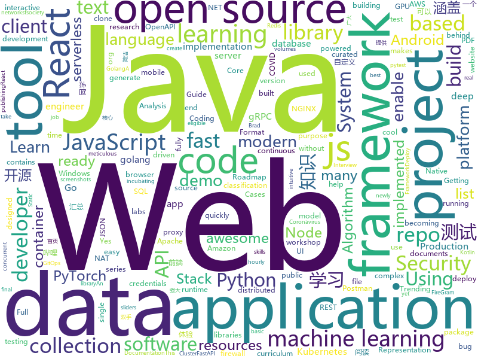

# 2020-07-31
See what the GitHub community is most excited about.

## python
+ [detext](https://github.com/linkedin/detext)(**133 stars today**): DeText: A Deep Neural Text Understanding Framework for Ranking and Classification Tasks
+ [TransCoder](https://github.com/facebookresearch/TransCoder)(**147 stars today**): Public release of the TransCoder research project https://arxiv.org/pdf/2006.03511.pdf
+ [python-cheatsheet](https://github.com/gto76/python-cheatsheet)(**266 stars today**): Comprehensive Python Cheatsheet
+ [PyTorch_YOLOv4](https://github.com/WongKinYiu/PyTorch_YOLOv4)(**120 stars today**): PyTorch implementation of YOLOv4
+ [sagemaker-python-sdk](https://github.com/aws/sagemaker-python-sdk)(**3 stars today**): A library for training and deploying machine learning models on Amazon SageMaker
+ [White-box-Cartoonization](https://github.com/SystemErrorWang/White-box-Cartoonization)(**35 stars today**): Official tensorflow implementation for CVPR2020 paper “Learning to Cartoonize Using White-box Cartoon Representations”
+ [jax](https://github.com/google/jax)(**33 stars today**): Composable transformations of Python+NumPy programs: differentiate, vectorize, JIT to GPU/TPU, and more
+ [pfrl](https://github.com/pfnet/pfrl)(**61 stars today**): PFRL: a PyTorch-based deep reinforcement learning library
+ [dbt](https://github.com/fishtown-analytics/dbt)(**6 stars today**): dbt (data build tool) enables data analysts and engineers to transform their data using the same practices that software engineers use to build applications.
+ [doccano](https://github.com/doccano/doccano)(**12 stars today**): Open source text annotation tool for machine learning practitioner.
+ [black](https://github.com/psf/black)(**18 stars today**): The uncompromising Python code formatter
+ [incubator-superset](https://github.com/apache/incubator-superset)(**20 stars today**): Apache Superset (incubating) is a modern, enterprise-ready business intelligence web application
+ [CrackMapExec](https://github.com/byt3bl33d3r/CrackMapExec)(**6 stars today**): A swiss army knife for pentesting networks
+ [fsociety](https://github.com/Manisso/fsociety)(**8 stars today**): fsociety Hacking Tools Pack – A Penetration Testing Framework
+ [kubespray](https://github.com/kubernetes-sigs/kubespray)(**10 stars today**): Deploy a Production Ready Kubernetes Cluster
+ [fastapi](https://github.com/tiangolo/fastapi)(**73 stars today**): FastAPI framework, high performance, easy to learn, fast to code, ready for production
+ [incubator-tvm](https://github.com/apache/incubator-tvm)(**14 stars today**): Open deep learning compiler stack for cpu, gpu and specialized accelerators
+ [bert4keras](https://github.com/bojone/bert4keras)(**22 stars today**): keras implement of transformers for humans
+ [pytest](https://github.com/pytest-dev/pytest)(**10 stars today**): The pytest framework makes it easy to write small tests, yet scales to support complex functional testing
+ [allennlp](https://github.com/allenai/allennlp)(**9 stars today**): An open-source NLP research library, built on PyTorch.
+ [sigma](https://github.com/Neo23x0/sigma)(**9 stars today**): Generic Signature Format for SIEM Systems
+ [DeepLearningExamples](https://github.com/NVIDIA/DeepLearningExamples)(**16 stars today**): Deep Learning Examples
+ [EyeWitness](https://github.com/FortyNorthSecurity/EyeWitness)(**10 stars today**): EyeWitness is designed to take screenshots of websites, provide some server header info, and identify default credentials if possible.
+ [serverless-application-model](https://github.com/awslabs/serverless-application-model)(**5 stars today**): AWS Serverless Application Model (SAM) is an open-source framework for building serverless applications
+ [yolov4-pytorch](https://github.com/bubbliiiing/yolov4-pytorch)(**9 stars today**): 这是一个YoloV4-pytorch的源码，可以用于训练自己的模型。

## java
+ [metersphere](https://github.com/metersphere/metersphere)(**176 stars today**): An open source continuous testing platform. MeterSphere 是一站式的开源企业级持续测试平台，涵盖测试跟踪、接口测试、性能测试、团队协作等功能，全面兼容 JMeter、Postman 等开源、主流标准。
+ [java8-tutorial](https://github.com/winterbe/java8-tutorial)(**49 stars today**): Modern Java - A Guide to Java 8
+ [java-design-patterns](https://github.com/iluwatar/java-design-patterns)(**117 stars today**): Design patterns implemented in Java
+ [interviews](https://github.com/kdn251/interviews)(**88 stars today**): Everything you need to know to get the job.
+ [Java](https://github.com/TheAlgorithms/Java)(**159 stars today**): All Algorithms implemented in Java
+ [CtCI-6th-Edition](https://github.com/careercup/CtCI-6th-Edition)(**80 stars today**): Cracking the Coding Interview 6th Ed. Solutions
+ [tutorials](https://github.com/eugenp/tutorials)(**71 stars today**): Just Announced - "Learn Spring Security OAuth":
+ [NewPipe](https://github.com/TeamNewPipe/NewPipe)(**68 stars today**): A libre lightweight streaming front-end for Android.
+ [questdb](https://github.com/questdb/questdb)(**107 stars today**): An open source SQL database designed to process time series data, faster
+ [jvm](https://github.com/doocs/jvm)(**23 stars today**): 🤗JVM 底层原理知识总结
+ [hadoop](https://github.com/apache/hadoop)(**10 stars today**): Apache Hadoop
+ [spring-security](https://github.com/spring-projects/spring-security)(**8 stars today**): Spring Security
+ [cassandra-workshop-series](https://github.com/DataStax-Academy/cassandra-workshop-series)(**4 stars today**): All materials for the Cassandra Workshop Series in a single place
+ [XUI](https://github.com/xuexiangjys/XUI)(**7 stars today**): 💍一个简洁而优雅的Android原生UI框架，解放你的双手！
+ [advanced-java](https://github.com/doocs/advanced-java)(**60 stars today**): 😮互联网 Java 工程师进阶知识完全扫盲：涵盖高并发、分布式、高可用、微服务、海量数据处理等领域知识，后端同学必看，前端同学也可学习
+ [micronaut-core](https://github.com/micronaut-projects/micronaut-core)(**11 stars today**): Micronaut Application Framework
+ [MyBookshelf](https://github.com/gedoor/MyBookshelf)(**27 stars today**): 阅读是一款可以自定义来源阅读网络内容的工具，为广大网络文学爱好者提供一种方便、快捷舒适的试读体验。
+ [okhttp](https://github.com/square/okhttp)(**18 stars today**): Square’s meticulous HTTP client for Java and Kotlin.
+ [grpc-java](https://github.com/grpc/grpc-java)(**5 stars today**): The Java gRPC implementation. HTTP/2 based RPC
+ [JCSprout](https://github.com/crossoverJie/JCSprout)(**10 stars today**): 👨‍🎓Java Core Sprout : basic, concurrent, algorithm
+ [JavaGuide](https://github.com/Snailclimb/JavaGuide)(**76 stars today**): 「Java学习+面试指南」一份涵盖大部分Java程序员所需要掌握的核心知识。
+ [zeppelin](https://github.com/apache/zeppelin)(**4 stars today**): Web-based notebook that enables data-driven, interactive data analytics and collaborative documents with SQL, Scala and more.
+ [atlas](https://github.com/apache/atlas)(**2 stars today**): Apache Atlas
+ [arthas](https://github.com/alibaba/arthas)(**21 stars today**): Alibaba Java Diagnostic Tool Arthas/Alibaba Java诊断利器Arthas
+ [lombok-intellij-plugin](https://github.com/mplushnikov/lombok-intellij-plugin)(**11 stars today**): Lombok Plugin for IntelliJ IDEA

## unknown
+ [api-guidelines](https://github.com/microsoft/api-guidelines)(**206 stars today**): Microsoft REST API Guidelines
+ [awesome-java](https://github.com/akullpp/awesome-java)(**143 stars today**): A curated list of awesome frameworks, libraries and software for the Java programming language.
+ [Android-Analysis](https://github.com/1d8/Android-Analysis)(**30 stars today**): Getting Genymotion & Burpsuite setup for Android Mobile App Analysis
+ [awesome-falsehood](https://github.com/kdeldycke/awesome-falsehood)(**325 stars today**): 😱Falsehoods Programmers Believe in
+ [bounty-targets-data](https://github.com/arkadiyt/bounty-targets-data)(**33 stars today**): This repo contains hourly-updated data dumps of bug bounty platform scopes (like Hackerone/Bugcrowd/Intigriti/etc) that are eligible for reports
+ [golang-developer-roadmap](https://github.com/Alikhll/golang-developer-roadmap)(**43 stars today**): Roadmap to becoming a Go developer in 2020
+ [awesome-wechat-weapp](https://github.com/justjavac/awesome-wechat-weapp)(**20 stars today**): 微信小程序开发资源汇总💯
+ [laravel-best-practices](https://github.com/alexeymezenin/laravel-best-practices)(**98 stars today**): Laravel best practices
+ [ml-engineer-roadmap](https://github.com/chris-chris/ml-engineer-roadmap)(**31 stars today**): WIP: Roadmap to becoming a machine learning engineer in 2020
+ [bank](https://github.com/pietrzakadrian/bank)(**12 stars today**): Full Stack Web Application similar to financial software that is used in professional banking institutions
+ [awesome-security](https://github.com/sbilly/awesome-security)(**17 stars today**): A collection of awesome software, libraries, documents, books, resources and cools stuffs about security.
+ [app-ideas](https://github.com/florinpop17/app-ideas)(**214 stars today**): A Collection of application ideas which can be used to improve your coding skills.
+ [machine-learning-roadmap](https://github.com/mrdbourke/machine-learning-roadmap)(**346 stars today**): A roadmap connecting many of the most important concepts in machine learning, how to learn them and what tools to use to perform them.
+ [firegram](https://github.com/iamshaunjp/firegram)(**13 stars today**): Starting & final course files for the FireGram tutorial (React, Firebase & Framer Motion) on Brad Traversy's YouTube channel.
+ [open-source-cs](https://github.com/ForrestKnight/open-source-cs)(**11 stars today**): Video discussing this curriculum:
+ [Cookbook](https://github.com/andkret/Cookbook)(**8 stars today**): The Data Engineering Cookbook
+ [NewGrad-2021](https://github.com/Pitt-CSC/NewGrad-2021)(**12 stars today**): A collection of New Grad full time roles in SWE, Quant, and PM.
+ [WinDev](https://github.com/microsoft/WinDev)(**27 stars today**): A repo for developers on Windows to file issues that impede their productivity, efficiency, and efficacy
+ [roadmap](https://github.com/github/roadmap)(**388 stars today**): GitHub public roadmap
+ [Become-A-Full-Stack-Web-Developer](https://github.com/bmorelli25/Become-A-Full-Stack-Web-Developer)(**6 stars today**): Free resources for learning Full Stack Web Development
+ [incyber](https://github.com/Malajab/incyber)(**10 stars today**): 
+ [awesome-github-vue](https://github.com/opendigg/awesome-github-vue)(**7 stars today**): Vue相关开源项目库汇总
+ [COVID-19](https://github.com/CSSEGISandData/COVID-19)(**25 stars today**): Novel Coronavirus (COVID-19) Cases, provided by JHU CSSE
+ [postman-app-support](https://github.com/postmanlabs/postman-app-support)(**0 stars today**): Postman helps you be more efficient while working with APIs. Using Postman, you can construct complex HTTP requests quickly, organize them in collections and share them with your co-workers.
+ [rest-api-description](https://github.com/github/rest-api-description)(**25 stars today**): An OpenAPI description for GitHub's REST API

## javascript
+ [stayaway-app](https://github.com/stayawayinesctec/stayaway-app)(**30 stars today**): Official repository for the STAYAWAY COVID mobile application
+ [javascript-algorithms](https://github.com/trekhleb/javascript-algorithms)(**318 stars today**): 📝Algorithms and data structures implemented in JavaScript with explanations and links to further readings
+ [Zoom-Clone-With-WebRTC](https://github.com/WebDevSimplified/Zoom-Clone-With-WebRTC)(**141 stars today**): 
+ [generator-jhipster](https://github.com/jhipster/generator-jhipster)(**42 stars today**): JHipster is a development platform to quickly generate, develop, & deploy modern web applications & microservice architectures.
+ [macintosh.js](https://github.com/felixrieseberg/macintosh.js)(**1,365 stars today**): A virtual Apple Macintosh with System 8, running in Electron. I'm sorry.
+ [realworld](https://github.com/gothinkster/realworld)(**105 stars today**): "The mother of all demo apps" — Exemplary fullstack Medium.com clone powered by React, Angular, Node, Django, and many more🏅
+ [react-typescript-cheatsheet](https://github.com/typescript-cheatsheets/react-typescript-cheatsheet)(**103 stars today**): Cheatsheets for experienced React developers getting started with TypeScript
+ [Bilibili-Evolved](https://github.com/the1812/Bilibili-Evolved)(**69 stars today**): 强大的哔哩哔哩增强脚本: 下载视频, 音乐, 封面, 弹幕 / 简化直播间, 评论区, 首页 / 自定义顶栏, 删除广告, 夜间模式 / 触屏设备支持
+ [javascript](https://github.com/airbnb/javascript)(**75 stars today**): JavaScript Style Guide
+ [hiring-without-whiteboards](https://github.com/poteto/hiring-without-whiteboards)(**290 stars today**): ⭐️Companies that don't have a broken hiring process
+ [awx](https://github.com/ansible/awx)(**7 stars today**): AWX Project
+ [faker.js](https://github.com/Marak/faker.js)(**16 stars today**): generate massive amounts of realistic fake data in Node.js and the browser
+ [aluraflix](https://github.com/imersao-alura/aluraflix)(**69 stars today**): ⚛️Projeto feito durante a Imersão React da Alura
+ [node](https://github.com/nodejs/node)(**36 stars today**): Node.js JavaScript runtime✨🐢🚀✨
+ [node-react-ecommerce](https://github.com/basir/node-react-ecommerce)(**7 stars today**): Build ECommerce Website Like Amazon By React & Node & MongoDB
+ [Otto](https://github.com/KartikChugh/Otto)(**92 stars today**): Otto makes machine learning an intuitive, natural language experience.🏆Facebook AI Challenge winner⭐️#4 Trending JS Project⭐️#15 Trending Project (All Languages)
+ [vue](https://github.com/vuejs/vue)(**107 stars today**): 🖖Vue.js is a progressive, incrementally-adoptable JavaScript framework for building UI on the web.
+ [mapbox-gl-js](https://github.com/mapbox/mapbox-gl-js)(**7 stars today**): Interactive, thoroughly customizable maps in the browser, powered by vector tiles and WebGL
+ [chrome-plugin-demo](https://github.com/sxei/chrome-plugin-demo)(**16 stars today**): 《Chrome插件开发全攻略》配套完整Demo，欢迎clone体验
+ [wavesurfer.js](https://github.com/katspaugh/wavesurfer.js)(**7 stars today**): Navigable waveform built on Web Audio and Canvas
+ [freeCodeCamp](https://github.com/freeCodeCamp/freeCodeCamp)(**75 stars today**): freeCodeCamp.org's open source codebase and curriculum. Learn to code at home.
+ [aws-serverless-workshops](https://github.com/aws-samples/aws-serverless-workshops)(**5 stars today**): Code and walkthrough labs to set up serverless applications for Wild Rydes workshops
+ [semantic-release](https://github.com/semantic-release/semantic-release)(**13 stars today**): 📦🚀Fully automated version management and package publishing
+ [react-virtualized](https://github.com/bvaughn/react-virtualized)(**12 stars today**): React components for efficiently rendering large lists and tabular data
+ [gpt3-sandbox](https://github.com/shreyashankar/gpt3-sandbox)(**104 stars today**): The goal of this project is to enable users to create cool web demos using the newly released OpenAI GPT-3 API with just a few lines of Python.

## html
+ [TheHive](https://github.com/TheHive-Project/TheHive)(**4 stars today**): TheHive: a Scalable, Open Source and Free Security Incident Response Platform
+ [swagger-codegen](https://github.com/swagger-api/swagger-codegen)(**6 stars today**): swagger-codegen contains a template-driven engine to generate documentation, API clients and server stubs in different languages by parsing your OpenAPI / Swagger definition.
+ [log-analysis-training](https://github.com/JPCERTCC/log-analysis-training)(**9 stars today**): ログ分析トレーニング用コンテンツ
+ [devdocs](https://github.com/magento/devdocs)(**0 stars today**): Magento Developer Documentation
+ [Spoon-Knife](https://github.com/octocat/Spoon-Knife)(**1 stars today**): This repo is for demonstration purposes only.
+ [NGINX-Demos](https://github.com/nginxinc/NGINX-Demos)(**2 stars today**): NGINX and NGINX Plus demos
+ [awesome-modern-cpp](https://github.com/rigtorp/awesome-modern-cpp)(**9 stars today**): A collection of resources on modern C++
+ [fastText](https://github.com/facebookresearch/fastText)(**6 stars today**): Library for fast text representation and classification.
+ [wpt](https://github.com/web-platform-tests/wpt)(**1 stars today**): Test suites for Web platform specs — including WHATWG, W3C, and others
+ [IntroLabs](https://github.com/strandjs/IntroLabs)(**9 stars today**): These are the labs for my Intro class. Yes, this is public. Yes, this is intentional.
+ [mxgraph](https://github.com/jgraph/mxgraph)(**9 stars today**): mxGraph is a fully client side JavaScript diagramming library
+ [bookclub-Advanced_R](https://github.com/r4ds/bookclub-Advanced_R)(**4 stars today**): 
+ [seldon-core](https://github.com/SeldonIO/seldon-core)(**2 stars today**): An MLOps framework to package, deploy, monitor and manage thousands of production machine learning models
+ [learning-area](https://github.com/mdn/learning-area)(**2 stars today**): Github repo for the MDN Learning Area.
+ [webProject](https://github.com/YUUXIAO/webProject)(**1 stars today**): 记录我在学习前端学习过程中做过的小demo，js部分全用源生js实现。
+ [phpstan](https://github.com/phpstan/phpstan)(**3 stars today**): PHP Static Analysis Tool - discover bugs in your code without running it!
+ [System.Linq.Dynamic.Core](https://github.com/zzzprojects/System.Linq.Dynamic.Core)(**0 stars today**): The .NET Standard / .NET Core version from the System Linq Dynamic functionality.
+ [pdf2htmlEX](https://github.com/coolwanglu/pdf2htmlEX)(**3 stars today**): Convert PDF to HTML without losing text or format.
+ [django-DefectDojo](https://github.com/DefectDojo/django-DefectDojo)(**3 stars today**): DefectDojo is an open-source application vulnerability correlation and security orchestration tool.
+ [webdevbootcamp](https://github.com/nax3t/webdevbootcamp)(**5 stars today**): All source code for back-end projects from the Web Developer Bootcamp
+ [glTF](https://github.com/KhronosGroup/glTF)(**3 stars today**): glTF – Runtime 3D Asset Delivery
+ [awesome-piracy](https://github.com/Igglybuff/awesome-piracy)(**5 stars today**): A curated list of awesome warez and piracy links
+ [kubelabs](https://github.com/collabnix/kubelabs)(**2 stars today**): Kubernetes - Beginners | Intermediate | Advanced
+ [photo-stream](https://github.com/maxvoltar/photo-stream)(**4 stars today**): Self-hosted, super simple photo stream
+ [tidytuesday](https://github.com/rfordatascience/tidytuesday)(**5 stars today**): Official repo for the #tidytuesday project

## go
+ [shellhub](https://github.com/shellhub-io/shellhub)(**35 stars today**): 💻ShellHub enables teams to easily access any Linux device behind firewall and NAT.
+ [grpc-gateway](https://github.com/grpc-ecosystem/grpc-gateway)(**15 stars today**): gRPC to JSON proxy generator following the gRPC HTTP spec
+ [authelia](https://github.com/authelia/authelia)(**19 stars today**): The Single Sign-On Multi-Factor portal for web apps
+ [frp](https://github.com/fatedier/frp)(**32 stars today**): A fast reverse proxy to help you expose a local server behind a NAT or firewall to the internet.
+ [cilium](https://github.com/cilium/cilium)(**100 stars today**): eBPF-based Networking, Security, and Observability
+ [ingress-nginx](https://github.com/kubernetes/ingress-nginx)(**12 stars today**): NGINX Ingress Controller for Kubernetes
+ [esbuild](https://github.com/evanw/esbuild)(**33 stars today**): An extremely fast JavaScript bundler and minifier
+ [vitess](https://github.com/vitessio/vitess)(**10 stars today**): Vitess is a database clustering system for horizontal scaling of MySQL.
+ [etcd](https://github.com/etcd-io/etcd)(**21 stars today**): Distributed reliable key-value store for the most critical data of a distributed system
+ [concourse](https://github.com/concourse/concourse)(**2 stars today**): Concourse is a container-based continuous thing-doer written in Go and Elm.
+ [traefik](https://github.com/containous/traefik)(**29 stars today**): The Cloud Native Edge Router
+ [podman](https://github.com/containers/podman)(**9 stars today**): Podman: A tool for managing OCI containers and pods
+ [aws-vault](https://github.com/99designs/aws-vault)(**6 stars today**): A vault for securely storing and accessing AWS credentials in development environments
+ [loki](https://github.com/grafana/loki)(**26 stars today**): Like Prometheus, but for logs.
+ [kubernetes](https://github.com/kubernetes/kubernetes)(**37 stars today**): Production-Grade Container Scheduling and Management
+ [deej](https://github.com/omriharel/deej)(**41 stars today**): Set app volumes with real sliders! deej is an Arduino & Go project to let you build your own hardware mixer for Windows and Linux
+ [arkade](https://github.com/alexellis/arkade)(**13 stars today**): Your one-stop CLI for Kubernetes
+ [cron](https://github.com/robfig/cron)(**6 stars today**): a cron library for go
+ [mattermost-server](https://github.com/mattermost/mattermost-server)(**5 stars today**): Open source Slack-alternative in Golang and React - Mattermost
+ [groupcache](https://github.com/golang/groupcache)(**10 stars today**): groupcache is a caching and cache-filling library, intended as a replacement for memcached in many cases.
+ [redis](https://github.com/go-redis/redis)(**14 stars today**): Type-safe Redis client for Golang
+ [volcano](https://github.com/volcano-sh/volcano)(**3 stars today**): A Kubernetes Native Batch System (Project under CNCF)
+ [easyjson](https://github.com/mailru/easyjson)(**4 stars today**): Fast JSON serializer for golang.
+ [sqlx](https://github.com/jmoiron/sqlx)(**12 stars today**): general purpose extensions to golang's database/sql
+ [flux](https://github.com/fluxcd/flux)(**13 stars today**): The GitOps Kubernetes operator

## WordCloud

