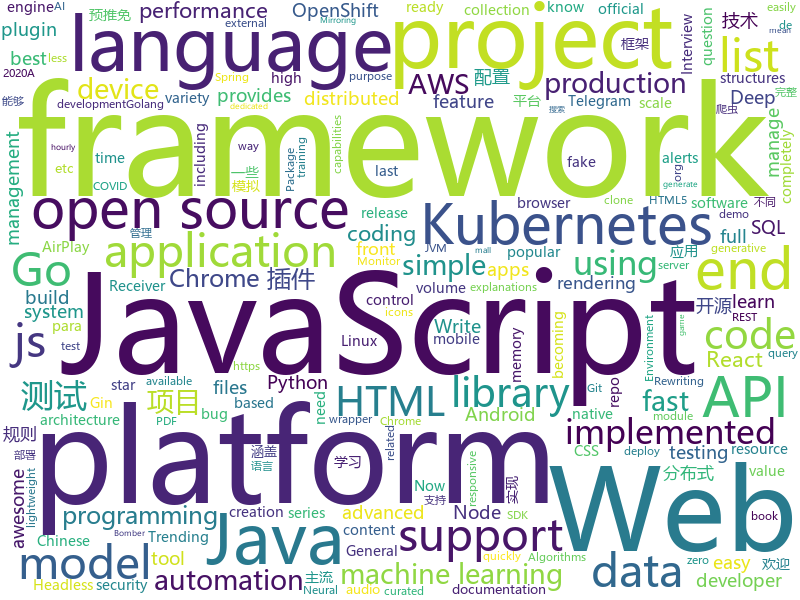

# 2020-08-01
See what the GitHub community is most excited about.

## python
+ [UnusualVolumeDetector](https://github.com/SamPom100/UnusualVolumeDetector)(**254 stars today**): Gets the last 5 months of volume history for every ticker, and alerts you when a stock's volume exceeds 10 standard deviations from the mean within the last 3 days
+ [haystack](https://github.com/deepset-ai/haystack)(**27 stars today**): 🔍Transformers at scale for question answering & search
+ [TransCoder](https://github.com/facebookresearch/TransCoder)(**104 stars today**): Public release of the TransCoder research project https://arxiv.org/pdf/2006.03511.pdf
+ [QUANTAXIS](https://github.com/QUANTAXIS/QUANTAXIS)(**16 stars today**): QUANTAXIS 支持任务调度 分布式部署的 股票/期货/期权/港股/虚拟货币 数据/回测/模拟/交易/可视化/多账户 纯本地量化解决方案
+ [qiling](https://github.com/qilingframework/qiling)(**21 stars today**): Qiling Advanced Binary Emulation Framework
+ [awesome-python-login-model](https://github.com/Kr1s77/awesome-python-login-model)(**23 stars today**): 😮python模拟登陆一些大型网站，还有一些简单的爬虫，希望对你们有所帮助❤️，如果喜欢记得给个star哦🌟
+ [ParlAI](https://github.com/facebookresearch/ParlAI)(**7 stars today**): A framework for training and evaluating AI models on a variety of openly available dialogue datasets.
+ [hue](https://github.com/cloudera/hue)(**4 stars today**): Open source SQL Query Assistant for Databases/Warehouses
+ [pytorch-lightning](https://github.com/PyTorchLightning/pytorch-lightning)(**23 stars today**): The lightweight PyTorch wrapper for ML researchers. Scale your models. Write less boilerplate
+ [bert](https://github.com/google-research/bert)(**32 stars today**): TensorFlow code and pre-trained models for BERT
+ [TBomb](https://github.com/TheSpeedX/TBomb)(**6 stars today**): This is a SMS And Call Bomber For Linux And Termux
+ [gpiozero](https://github.com/gpiozero/gpiozero)(**44 stars today**): A simple interface to GPIO devices with Raspberry Pi
+ [fastapi](https://github.com/tiangolo/fastapi)(**63 stars today**): FastAPI framework, high performance, easy to learn, fast to code, ready for production
+ [Statistical-Learning-Method_Code](https://github.com/Dod-o/Statistical-Learning-Method_Code)(**48 stars today**): 手写实现李航《统计学习方法》书中全部算法
+ [rewriting](https://github.com/davidbau/rewriting)(**70 stars today**): Rewriting a Deep Generative Model, ECCV 2020 (oral). Edits the weights of a deep generative network by rewriting associative memory directly, without training data.
+ [DeepFaceLab](https://github.com/iperov/DeepFaceLab)(**28 stars today**): DeepFaceLab is the leading software for creating deepfakes.
+ [SeleniumBase](https://github.com/seleniumbase/SeleniumBase)(**4 stars today**): ✅Easy Web Automation and Testing with Selenium & pytest. Batteries included.
+ [TikTokHacks](https://github.com/hoppuman/TikTokHacks)(**5 stars today**): 
+ [detext](https://github.com/linkedin/detext)(**116 stars today**): DeText: A Deep Neural Text Understanding Framework for Ranking and Classification Tasks
+ [GOMP](https://github.com/MarkForged/GOMP)(**38 stars today**): GOMP (Git cOMPare) is a tool for comparing branches.
+ [TorrentLeech-Gdrive](https://github.com/gautamajay52/TorrentLeech-Gdrive)(**4 stars today**): It is fork of 'PublicLeech' with support of uploading files and foder to gdrive or any drive rclone.org support. Like onedrive, mega and so on. Now supports Unzip, unrar, untar too. Now you all can also mirror the telegram files to your repective cloud too.
+ [volatility](https://github.com/volatilityfoundation/volatility)(**7 stars today**): An advanced memory forensics framework
+ [espnet](https://github.com/espnet/espnet)(**9 stars today**): End-to-End Speech Processing Toolkit
+ [isort](https://github.com/timothycrosley/isort)(**7 stars today**): A Python utility / library to sort imports.
+ [nni](https://github.com/microsoft/nni)(**11 stars today**): An open source AutoML toolkit for automate machine learning lifecycle, including feature engineering, neural architecture search, model compression and hyper-parameter tuning.

## java
+ [CtCI-6th-Edition](https://github.com/careercup/CtCI-6th-Edition)(**111 stars today**): Cracking the Coding Interview 6th Ed. Solutions
+ [metersphere](https://github.com/metersphere/metersphere)(**199 stars today**): An open source continuous testing platform. MeterSphere 是一站式的开源企业级持续测试平台，涵盖测试跟踪、接口测试、性能测试、团队协作等功能，全面兼容 JMeter、Postman 等开源、主流标准。
+ [Java](https://github.com/TheAlgorithms/Java)(**180 stars today**): All Algorithms implemented in Java
+ [interviews](https://github.com/kdn251/interviews)(**200 stars today**): Everything you need to know to get the job.
+ [java-design-patterns](https://github.com/iluwatar/java-design-patterns)(**249 stars today**): Design patterns implemented in Java
+ [java8-tutorial](https://github.com/winterbe/java8-tutorial)(**132 stars today**): Modern Java - A Guide to Java 8
+ [tutorials](https://github.com/eugenp/tutorials)(**120 stars today**): Just Announced - "Learn Spring Security OAuth":
+ [pulsar](https://github.com/apache/pulsar)(**11 stars today**): Apache Pulsar - distributed pub-sub messaging system
+ [jvm](https://github.com/doocs/jvm)(**50 stars today**): 🤗JVM 底层原理知识总结
+ [lombok-intellij-plugin](https://github.com/mplushnikov/lombok-intellij-plugin)(**9 stars today**): Lombok Plugin for IntelliJ IDEA
+ [presto](https://github.com/prestodb/presto)(**4 stars today**): The official home of the Presto distributed SQL query engine for big data
+ [lombok](https://github.com/rzwitserloot/lombok)(**6 stars today**): Very spicy additions to the Java programming language.
+ [buck](https://github.com/facebook/buck)(**5 stars today**): A fast build system that encourages the creation of small, reusable modules over a variety of platforms and languages.
+ [RxJava-Android-Samples](https://github.com/kaushikgopal/RxJava-Android-Samples)(**46 stars today**): Learning RxJava for Android by example
+ [apollo](https://github.com/ctripcorp/apollo)(**18 stars today**): Apollo（阿波罗）是携程框架部门研发的分布式配置中心，能够集中化管理应用不同环境、不同集群的配置，配置修改后能够实时推送到应用端，并且具备规范的权限、流程治理等特性，适用于微服务配置管理场景。
+ [spring-boot-api-project-seed](https://github.com/lihengming/spring-boot-api-project-seed)(**11 stars today**): 🌱🚀一个基于Spring Boot & MyBatis的种子项目，用于快速构建中小型API、RESTful API项目~
+ [micronaut-core](https://github.com/micronaut-projects/micronaut-core)(**11 stars today**): Micronaut Application Framework
+ [libgdx](https://github.com/libgdx/libgdx)(**8 stars today**): Desktop/Android/HTML5/iOS Java game development framework
+ [react-native-track-player](https://github.com/react-native-kit/react-native-track-player)(**11 stars today**): A fully fledged audio module created for music apps. Provides audio playback, external media controls, chromecast support, background mode and more!
+ [selenium](https://github.com/SeleniumHQ/selenium)(**11 stars today**): A browser automation framework and ecosystem.
+ [PlaceholderAPI](https://github.com/PlaceholderAPI/PlaceholderAPI)(**4 stars today**): The best and simplest way to add placeholders to your server! - 350k+ Downloads - 2.5k+ Placeholders
+ [mall-learning](https://github.com/macrozheng/mall-learning)(**12 stars today**): mall学习教程，架构、业务、技术要点全方位解析。mall项目（25k+star）是一套电商系统，使用现阶段主流技术实现。 涵盖了SpringBoot2.1.3、MyBatis3.4.6、Elasticsearch6.2.2、RabbitMQ3.7.15、Redis5.0、Mongodb4.2.5、Mysql5.7等技术，采用Docker容器化部署。
+ [apollo-android](https://github.com/apollographql/apollo-android)(**4 stars today**): 🤖A strongly-typed, caching GraphQL client for the JVM, Android and Kotlin multiplatform
+ [hutool](https://github.com/looly/hutool)(**13 stars today**): A set of tools that keep Java sweet.
+ [kafdrop](https://github.com/obsidiandynamics/kafdrop)(**6 stars today**): Kafka Web UI

## unknown
+ [awesome-java](https://github.com/akullpp/awesome-java)(**155 stars today**): A curated list of awesome frameworks, libraries and software for the Java programming language.
+ [api-guidelines](https://github.com/microsoft/api-guidelines)(**261 stars today**): Microsoft REST API Guidelines
+ [ml-engineer-roadmap](https://github.com/chris-chris/ml-engineer-roadmap)(**50 stars today**): WIP: Roadmap to becoming a machine learning engineer in 2020
+ [You-Dont-Know-JS](https://github.com/getify/You-Dont-Know-JS)(**64 stars today**): A book series on JavaScript. @YDKJS on twitter.
+ [app-ideas](https://github.com/florinpop17/app-ideas)(**125 stars today**): A Collection of application ideas which can be used to improve your coding skills.
+ [awesome-falsehood](https://github.com/kdeldycke/awesome-falsehood)(**290 stars today**): 😱Falsehoods Programmers Believe in
+ [COVID-19](https://github.com/CSSEGISandData/COVID-19)(**19 stars today**): Novel Coronavirus (COVID-19) Cases, provided by JHU CSSE
+ [you-dont-know-js-ru](https://github.com/azat-io/you-dont-know-js-ru)(**6 stars today**): 📚Russian translation of "You Don't Know JS" book series
+ [AWS-SAA-C02-Course](https://github.com/alozano-77/AWS-SAA-C02-Course)(**3 stars today**): Personal notes for SAA-C02 test from: https://learn.cantrill.io
+ [leetcode](https://github.com/grandyang/leetcode)(**202 stars today**): Provide all my solutions and explanations in Chinese for all the Leetcode coding problems.
+ [codeSTACKr](https://github.com/codeSTACKr/codeSTACKr)(**14 stars today**): 
+ [AzureMonitorCommunity](https://github.com/microsoft/AzureMonitorCommunity)(**29 stars today**): An open repo for Azure Monitor queries, workbooks, alerts and more
+ [awesome-vue](https://github.com/vuejs/awesome-vue)(**31 stars today**): 🎉A curated list of awesome things related to Vue.js
+ [vagas](https://github.com/frontendbr/vagas)(**21 stars today**): 🔬Espaço para divulgação de vagas para front-enders.
+ [CVPR2020-Code](https://github.com/amusi/CVPR2020-Code)(**18 stars today**): CVPR 2020 论文开源项目合集
+ [awesome-web-effect](https://github.com/lindelof/awesome-web-effect)(**66 stars today**): A series of awesome little special effects
+ [CSYuTuiMian2020](https://github.com/hcy226/CSYuTuiMian2020)(**13 stars today**): 关于2020年CS预推免的汇总。欢迎大家分享预推免信息，资瓷一下互联网精神吼不吼啊？
+ [laravel-best-practices](https://github.com/alexeymezenin/laravel-best-practices)(**57 stars today**): Laravel best practices
+ [bounty-targets-data](https://github.com/arkadiyt/bounty-targets-data)(**31 stars today**): This repo contains hourly-updated data dumps of bug bounty platform scopes (like Hackerone/Bugcrowd/Intigriti/etc) that are eligible for reports
+ [golang-developer-roadmap](https://github.com/Alikhll/golang-developer-roadmap)(**47 stars today**): Roadmap to becoming a Go developer in 2020
+ [incyber](https://github.com/Malajab/incyber)(**6 stars today**): 
+ [Resources-for-Beginner-Bug-Bounty-Hunters](https://github.com/nahamsec/Resources-for-Beginner-Bug-Bounty-Hunters)(**9 stars today**): A list of resources for those interested in getting started in bug bounties
+ [stats-illustrations](https://github.com/allisonhorst/stats-illustrations)(**22 stars today**): R & stats illustrations by @allison_horst
+ [NewGrad-2021](https://github.com/Pitt-CSC/NewGrad-2021)(**6 stars today**): A collection of New Grad full time roles in SWE, Quant, and PM.
+ [Python-Core-50-Courses](https://github.com/jackfrued/Python-Core-50-Courses)(**15 stars today**): Python语言基础50课

## javascript
+ [ChromeAppHeroes](https://github.com/zhaoolee/ChromeAppHeroes)(**84 stars today**): 🌈谷粒-Chrome插件英雄榜, 为优秀的Chrome插件写一本中文说明书, 让Chrome插件英雄们造福人类~ ChromePluginHeroes, Write a Chinese manual for the excellent Chrome plugin, let the Chrome plugin heroes benefit the human~ 公众号「0加1」同步更新
+ [realworld](https://github.com/gothinkster/realworld)(**169 stars today**): "The mother of all demo apps" — Exemplary fullstack Medium.com clone powered by React, Angular, Node, Django, and many more🏅
+ [teenyicons](https://github.com/teenyicons/teenyicons)(**159 stars today**): Tiny minimal 1px icons designed to fit in the smallest places.
+ [stayaway-app](https://github.com/stayawayinesctec/stayaway-app)(**30 stars today**): Official repository for the STAYAWAY COVID mobile application
+ [generator-jhipster](https://github.com/jhipster/generator-jhipster)(**85 stars today**): JHipster is a development platform to quickly generate, develop, & deploy modern web applications & microservice architectures.
+ [macintosh.js](https://github.com/felixrieseberg/macintosh.js)(**933 stars today**): A virtual Apple Macintosh with System 8, running in Electron. I'm sorry.
+ [Zoom-Clone-With-WebRTC](https://github.com/WebDevSimplified/Zoom-Clone-With-WebRTC)(**107 stars today**): 
+ [javascript](https://github.com/airbnb/javascript)(**64 stars today**): JavaScript Style Guide
+ [vitrine-imersao-react](https://github.com/imersao-alura/vitrine-imersao-react)(**29 stars today**): 
+ [Otto](https://github.com/KartikChugh/Otto)(**201 stars today**): Otto makes machine learning an intuitive, natural language experience.🏆Facebook AI Challenge winner⭐️#4 Trending JS Project⭐️#15 Trending Project (All Languages)
+ [javascript-algorithms](https://github.com/trekhleb/javascript-algorithms)(**289 stars today**): 📝Algorithms and data structures implemented in JavaScript with explanations and links to further readings
+ [Luckysheet](https://github.com/mengshukeji/Luckysheet)(**229 stars today**): Luckysheet is an online spreadsheet like excel that is powerful, simple to configure, and completely open source.
+ [strapi](https://github.com/strapi/strapi)(**33 stars today**): 🚀Open source Node.js Headless CMS to easily build customisable APIs
+ [json-server](https://github.com/typicode/json-server)(**61 stars today**): Get a full fake REST API with zero coding in less than 30 seconds (seriously)
+ [magnetW](https://github.com/xiandanin/magnetW)(**87 stars today**): 磁力链接聚合搜索
+ [content](https://github.com/nuxt/content)(**13 stars today**): Write in a content/ directory and fetch your Markdown, JSON, YAML and CSV files through a MongoDB like API, acting as a Git-based Headless CMS
+ [faker.js](https://github.com/Marak/faker.js)(**13 stars today**): generate massive amounts of realistic fake data in Node.js and the browser
+ [d3](https://github.com/d3/d3)(**34 stars today**): Bring data to life with SVG, Canvas and HTML.📊📈🎉
+ [chrome-plugin-demo](https://github.com/sxei/chrome-plugin-demo)(**12 stars today**): 《Chrome插件开发全攻略》配套完整Demo，欢迎clone体验
+ [react-table](https://github.com/tannerlinsley/react-table)(**75 stars today**): ⚛️Hooks for building fast and extendable tables and datagrids for React
+ [react-virtualized](https://github.com/bvaughn/react-virtualized)(**9 stars today**): React components for efficiently rendering large lists and tabular data
+ [Detox](https://github.com/wix/Detox)(**10 stars today**): Gray box end-to-end testing and automation framework for mobile apps
+ [Viewers](https://github.com/OHIF/Viewers)(**1 stars today**): OHIF zero-footprint DICOM viewer and oncology specific Lesion Tracker, plus shared extension packages
+ [sigma.js](https://github.com/jacomyal/sigma.js)(**5 stars today**): A JavaScript library dedicated to graph drawing
+ [Recoil](https://github.com/facebookexperimental/Recoil)(**67 stars today**): Recoil is an experimental state management library for React apps. It provides several capabilities that are difficult to achieve with React alone, while being compatible with the newest features of React.

## html
+ [css-sweeper](https://github.com/propjockey/css-sweeper)(**84 stars today**): MineSweeper implemented in CSS + HTML using the Space Toggle trick (no JavaScript!)
+ [ACL4SSR](https://github.com/ACL4SSR/ACL4SSR)(**12 stars today**): SSR 去广告ACL规则/SS完整GFWList规则/Clash规则碎片，Telegram频道订阅地址
+ [seldon-core](https://github.com/SeldonIO/seldon-core)(**4 stars today**): An MLOps framework to package, deploy, monitor and manage thousands of production machine learning models
+ [simple-icons](https://github.com/simple-icons/simple-icons)(**9 stars today**): SVG icons for popular brands
+ [proposal-record-tuple](https://github.com/tc39/proposal-record-tuple)(**32 stars today**): ECMAScript proposal for the Record and Tuple value types. | Stage 2: it will change!
+ [screenfull.js](https://github.com/sindresorhus/screenfull.js)(**28 stars today**): Simple wrapper for cross-browser usage of the JavaScript Fullscreen API
+ [wpt](https://github.com/web-platform-tests/wpt)(**0 stars today**): Test suites for Web platform specs — including WHATWG, W3C, and others
+ [blog_os](https://github.com/phil-opp/blog_os)(**12 stars today**): Writing an OS in Rust
+ [responsive-html-email-template](https://github.com/leemunroe/responsive-html-email-template)(**6 stars today**): A free simple responsive HTML email template
+ [boost](https://github.com/boostorg/boost)(**6 stars today**): Super-project for modularized Boost
+ [DetectionLab](https://github.com/clong/DetectionLab)(**2 stars today**): Automate the creation of a lab environment complete with security tooling and logging best practices
+ [simpl](https://github.com/samdutton/simpl)(**2 stars today**): Simplest possible examples of HTML, CSS and Javascript:
+ [Tasmota](https://github.com/arendst/Tasmota)(**12 stars today**): Alternative firmware for ESP8266 with easy configuration using webUI, OTA updates, automation using timers or rules, expandability and entirely local control over MQTT, HTTP, Serial or KNX. Full documentation at
+ [url-to-pdf-api](https://github.com/alvarcarto/url-to-pdf-api)(**3 stars today**): Web page PDF/PNG rendering done right. Self-hosted service for rendering receipts, invoices, or any content.
+ [openshift-docs](https://github.com/openshift/openshift-docs)(**2 stars today**): OpenShift 3 and 4 documentation
+ [100knocks-preprocess](https://github.com/The-Japan-DataScientist-Society/100knocks-preprocess)(**3 stars today**): データサイエンス100本ノック（構造化データ加工編）
+ [webdevbootcamp](https://github.com/nax3t/webdevbootcamp)(**1 stars today**): All source code for back-end projects from the Web Developer Bootcamp
+ [Front-end-Developer-Interview-Questions](https://github.com/h5bp/Front-end-Developer-Interview-Questions)(**33 stars today**): A list of helpful front-end related questions you can use to interview potential candidates, test yourself or completely ignore.
+ [rellax](https://github.com/dixonandmoe/rellax)(**3 stars today**): Lightweight, vanilla javascript parallax library
+ [html-css](https://github.com/gustavoguanabara/html-css)(**2 stars today**): Curso de HTML5 e CSS3
+ [en.javascript.info](https://github.com/javascript-tutorial/en.javascript.info)(**14 stars today**): Modern JavaScript Tutorial
+ [web-moderno](https://github.com/cod3rcursos/web-moderno)(**4 stars today**): 
+ [foundation-sites](https://github.com/foundation/foundation-sites)(**3 stars today**): The most advanced responsive front-end framework in the world. Quickly create prototypes and production code for sites that work on any kind of device.
+ [glTF](https://github.com/KhronosGroup/glTF)(**1 stars today**): glTF – Runtime 3D Asset Delivery
+ [Airplay-SDK](https://github.com/xfirefly/Airplay-SDK)(**4 stars today**): Airplay Receiver SDK supports Airplay Mirroring and AirPlay Casting to a receiver device.

## go
+ [terraform-provider-aws](https://github.com/terraform-providers/terraform-provider-aws)(**9 stars today**): Terraform AWS provider
+ [copilot-cli](https://github.com/aws/copilot-cli)(**11 stars today**): The AWS Copilot CLI is a tool for developers to build, release and operate production ready containerized applications on Amazon ECS and AWS Fargate.
+ [shellhub](https://github.com/shellhub-io/shellhub)(**40 stars today**): 💻ShellHub enables teams to easily access any Linux device behind firewall and NAT.
+ [helm](https://github.com/helm/helm)(**13 stars today**): The Kubernetes Package Manager
+ [external-dns](https://github.com/kubernetes-sigs/external-dns)(**5 stars today**): Configure external DNS servers (AWS Route53, Google CloudDNS and others) for Kubernetes Ingresses and Services
+ [thanos](https://github.com/thanos-io/thanos)(**11 stars today**): Highly available Prometheus setup with long term storage capabilities. CNCF Sandbox project.
+ [dashboard](https://github.com/kubernetes/dashboard)(**10 stars today**): General-purpose web UI for Kubernetes clusters
+ [lazydocker](https://github.com/jesseduffield/lazydocker)(**40 stars today**): The lazier way to manage everything docker
+ [test-infra](https://github.com/kubernetes/test-infra)(**3 stars today**): Test infrastructure for the Kubernetes project.
+ [goflow](https://github.com/faasflow/goflow)(**38 stars today**): A Golang based high performance, scalable and distributed workflow framework
+ [crawlab](https://github.com/crawlab-team/crawlab)(**16 stars today**): Distributed web crawler admin platform for spiders management regardless of languages and frameworks. 分布式爬虫管理平台，支持任何语言和框架
+ [origin](https://github.com/openshift/origin)(**4 stars today**): Images for OpenShift 3 and 4 - see openshift/okd for more
+ [velero](https://github.com/vmware-tanzu/velero)(**5 stars today**): Backup and migrate Kubernetes applications and their persistent volumes
+ [multichain](https://github.com/renproject/multichain)(**2 stars today**): An abstraction over multiple different underlying blockchains (Bitcoin, Ethereum, Zcash, etc.)
+ [Yearning](https://github.com/cookieY/Yearning)(**11 stars today**): 🐳A most popular sql audit platform for mysql
+ [pipeline](https://github.com/tektoncd/pipeline)(**3 stars today**): A K8s-native Pipeline resource.
+ [cert-manager](https://github.com/jetstack/cert-manager)(**8 stars today**): Automatically provision and manage TLS certificates in Kubernetes
+ [go](https://github.com/golang/go)(**56 stars today**): The Go programming language
+ [aws-sdk-go](https://github.com/aws/aws-sdk-go)(**2 stars today**): AWS SDK for the Go programming language.
+ [opa](https://github.com/open-policy-agent/opa)(**11 stars today**): An open source, general-purpose policy engine.
+ [gin](https://github.com/gin-gonic/gin)(**44 stars today**): Gin is a HTTP web framework written in Go (Golang). It features a Martini-like API with much better performance -- up to 40 times faster. If you need smashing performance, get yourself some Gin.
+ [jx](https://github.com/jenkins-x/jx)(**5 stars today**): Jenkins X provides automated CI+CD for Kubernetes with Preview Environments on Pull Requests using Tekton, Knative, Lighthouse, Skaffold and Helm
+ [mapstructure](https://github.com/mitchellh/mapstructure)(**10 stars today**): Go library for decoding generic map values into native Go structures and vice versa.
+ [golangci-lint](https://github.com/golangci/golangci-lint)(**10 stars today**): Fast linters Runner for Go
+ [rancher](https://github.com/rancher/rancher)(**10 stars today**): Complete container management platform

## WordCloud

