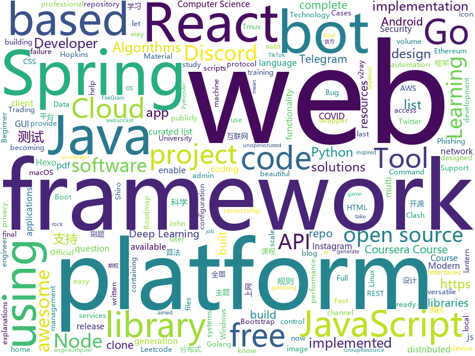

# 2020-08-02
See what the GitHub community is most excited about.

## python
+ [Statistical-Learning-Method_Code](https://github.com/Dod-o/Statistical-Learning-Method_Code)(**55 stars today**): 手写实现李航《统计学习方法》书中全部算法
+ [haystack](https://github.com/deepset-ai/haystack)(**44 stars today**): 🔍Transformers at scale for question answering & search
+ [Python](https://github.com/TheAlgorithms/Python)(**111 stars today**): All Algorithms implemented in Python
+ [discord.py](https://github.com/Rapptz/discord.py)(**15 stars today**): An API wrapper for Discord written in Python.
+ [HoshinoBot](https://github.com/Ice-Cirno/HoshinoBot)(**3 stars today**): A qqbot for Princess Connect Re:Dive (and other usage :)
+ [notifiers](https://github.com/liiight/notifiers)(**22 stars today**): The easy way to send notifications
+ [bunk_bot](https://github.com/sujaysathya/bunk_bot)(**88 stars today**): 
+ [Bug-Bounty-Toolz](https://github.com/m4ll0k/Bug-Bounty-Toolz)(**12 stars today**): BBT - Bug Bounty Tools
+ [awesome-python](https://github.com/vinta/awesome-python)(**65 stars today**): A curated list of awesome Python frameworks, libraries, software and resources
+ [hummingbot](https://github.com/CoinAlpha/hummingbot)(**7 stars today**): Hummingbot: a client for crypto market making
+ [ranger](https://github.com/ranger/ranger)(**9 stars today**): A VIM-inspired filemanager for the console
+ [contrastive-unpaired-translation](https://github.com/taesungp/contrastive-unpaired-translation)(**80 stars today**): Contrastive unpaired image-to-image translation, faster and lighter training than cyclegan (ECCV 2020, in PyTorch)
+ [zipline](https://github.com/quantopian/zipline)(**16 stars today**): Zipline, a Pythonic Algorithmic Trading Library
+ [TransCoder](https://github.com/facebookresearch/TransCoder)(**161 stars today**): Public release of the TransCoder research project https://arxiv.org/pdf/2006.03511.pdf
+ [b0mb3r](https://github.com/crinny/b0mb3r)(**6 stars today**): 💣Открытый СМС бомбер
+ [pyrogram](https://github.com/pyrogram/pyrogram)(**7 stars today**): Telegram MTProto API Client Library and Framework for Python
+ [White-box-Cartoonization](https://github.com/SystemErrorWang/White-box-Cartoonization)(**30 stars today**): Official tensorflow implementation for CVPR2020 paper “Learning to Cartoonize Using White-box Cartoon Representations”
+ [HiddenEye](https://github.com/DarkSecDevelopers/HiddenEye)(**8 stars today**): Modern Phishing Tool With Advanced Functionality And Multiple Tunnelling Services [ Android-Support-Available ]
+ [igbot](https://github.com/ohld/igbot)(**4 stars today**): 🐙Free scripts, bots and Python API wrapper. Get free followers with our auto like, auto follow and other scripts!
+ [core](https://github.com/home-assistant/core)(**26 stars today**): 🏡Open source home automation that puts local control and privacy first
+ [InstaPy](https://github.com/timgrossmann/InstaPy)(**13 stars today**): 📷Instagram Bot - Tool for automated Instagram interactions
+ [ProperTree](https://github.com/corpnewt/ProperTree)(**9 stars today**): Cross platform GUI plist editor written in python.
+ [keras](https://github.com/keras-team/keras)(**23 stars today**): Deep Learning for humans
+ [kaggle-api](https://github.com/Kaggle/kaggle-api)(**5 stars today**): Official Kaggle API
+ [QUANTAXIS](https://github.com/QUANTAXIS/QUANTAXIS)(**10 stars today**): QUANTAXIS 支持任务调度 分布式部署的 股票/期货/期权/港股/虚拟货币 数据/回测/模拟/交易/可视化/多账户 纯本地量化解决方案

## java
+ [Java](https://github.com/TheAlgorithms/Java)(**219 stars today**): All Algorithms implemented in Java
+ [CtCI-6th-Edition](https://github.com/careercup/CtCI-6th-Edition)(**186 stars today**): Cracking the Coding Interview 6th Ed. Solutions
+ [interviews](https://github.com/kdn251/interviews)(**191 stars today**): Everything you need to know to get the job.
+ [java8-tutorial](https://github.com/winterbe/java8-tutorial)(**216 stars today**): Modern Java - A Guide to Java 8
+ [InternetArchitect](https://github.com/bjmashibing/InternetArchitect)(**11 stars today**): 年薪百万互联网架构师课程文档及源码(公开部分)
+ [java-design-patterns](https://github.com/iluwatar/java-design-patterns)(**190 stars today**): Design patterns implemented in Java
+ [metersphere](https://github.com/metersphere/metersphere)(**138 stars today**): An open source continuous testing platform. MeterSphere 是一站式的开源企业级持续测试平台，涵盖测试跟踪、接口测试、性能测试、团队协作等功能，全面兼容 JMeter、Postman 等开源、主流标准。
+ [JUC](https://github.com/bjmashibing/JUC)(**2 stars today**): 多线程与高并发
+ [Sokobot](https://github.com/PolyMarsDev/Sokobot)(**7 stars today**): A Discord bot that lets you play Sokoban
+ [Java-Preparation](https://github.com/shinigami017/Java-Preparation)(**4 stars today**): 
+ [ghidra](https://github.com/NationalSecurityAgency/ghidra)(**28 stars today**): Ghidra is a software reverse engineering (SRE) framework
+ [Signal-Android](https://github.com/signalapp/Signal-Android)(**13 stars today**): A private messenger for Android.
+ [xdm](https://github.com/subhra74/xdm)(**12 stars today**): Powerfull download accelerator and video downloader
+ [Hystrix](https://github.com/Netflix/Hystrix)(**12 stars today**): Hystrix is a latency and fault tolerance library designed to isolate points of access to remote systems, services and 3rd party libraries, stop cascading failure and enable resilience in complex distributed systems where failure is inevitable.
+ [mit-deep-learning-book-pdf](https://github.com/janishar/mit-deep-learning-book-pdf)(**11 stars today**): MIT Deep Learning Book in PDF format (complete and parts) by Ian Goodfellow, Yoshua Bengio and Aaron Courville
+ [Java](https://github.com/DuGuQiuBai/Java)(**12 stars today**): 27天成为Java大神
+ [RxJava](https://github.com/ReactiveX/RxJava)(**14 stars today**): RxJava – Reactive Extensions for the JVM – a library for composing asynchronous and event-based programs using observable sequences for the Java VM.
+ [HackerRank_solutions](https://github.com/RodneyShag/HackerRank_solutions)(**4 stars today**): 317 efficient solutions to HackerRank problems
+ [TelegramBots](https://github.com/rubenlagus/TelegramBots)(**6 stars today**): Java library to create bots using Telegram Bots API
+ [Essentials](https://github.com/EssentialsX/Essentials)(**1 stars today**): The essential plugin suite for Minecraft servers.
+ [Arduino](https://github.com/arduino/Arduino)(**5 stars today**): open-source electronics platform
+ [SpringAll](https://github.com/wuyouzhuguli/SpringAll)(**32 stars today**): 循序渐进，学习Spring Boot、Spring Boot & Shiro、Spring Batch、Spring Cloud、Spring Cloud Alibaba、Spring Security & Spring Security OAuth2，博客Spring系列源码：https://mrbird.cc
+ [interview](https://github.com/mission-peace/interview)(**9 stars today**): Interview questions
+ [springBoot](https://github.com/527515025/springBoot)(**4 stars today**): springboot 框架与其它组件结合如 jpa、mybatis、websocket、security、shiro、cache等
+ [Summer2020_B20](https://github.com/CybertekSchool/Summer2020_B20)(**3 stars today**): B20_Java Class

## unknown
+ [ml-engineer-roadmap](https://github.com/chris-chris/ml-engineer-roadmap)(**73 stars today**): WIP: Roadmap to becoming a machine learning engineer in 2020
+ [coding-interview-university](https://github.com/jwasham/coding-interview-university)(**131 stars today**): A complete computer science study plan to become a software engineer.
+ [trackerslist](https://github.com/ngosang/trackerslist)(**29 stars today**): Updated list of public BitTorrent trackers
+ [awesome-java](https://github.com/akullpp/awesome-java)(**246 stars today**): A curated list of awesome frameworks, libraries and software for the Java programming language.
+ [developer-roadmap](https://github.com/kamranahmedse/developer-roadmap)(**214 stars today**): Roadmap to becoming a web developer in 2020
+ [api-guidelines](https://github.com/microsoft/api-guidelines)(**230 stars today**): Microsoft REST API Guidelines
+ [everyones-guide-for-starting-up-on-wechat-network](https://github.com/xiaolai/everyones-guide-for-starting-up-on-wechat-network)(**14 stars today**): 微信互联网平民创业
+ [leetcode](https://github.com/grandyang/leetcode)(**141 stars today**): Provide all my solutions and explanations in Chinese for all the Leetcode coding problems.
+ [leetcode_company_wise_questions](https://github.com/MysteryVaibhav/leetcode_company_wise_questions)(**28 stars today**): This is a repository containing the list of company wise questions available on leetcode premium
+ [Beginner-Network-Pentesting](https://github.com/hmaverickadams/Beginner-Network-Pentesting)(**13 stars today**): Notes for Beginner Network Pentesting Course
+ [first-contributions](https://github.com/firstcontributions/first-contributions)(**19 stars today**): 🚀✨Help beginners to contribute to open source projects
+ [build-your-own-x](https://github.com/danistefanovic/build-your-own-x)(**76 stars today**): 🤓Build your own (insert technology here)
+ [COVID-19](https://github.com/CSSEGISandData/COVID-19)(**17 stars today**): Novel Coronavirus (COVID-19) Cases, provided by JHU CSSE
+ [Resources-for-Beginner-Bug-Bounty-Hunters](https://github.com/nahamsec/Resources-for-Beginner-Bug-Bounty-Hunters)(**15 stars today**): A list of resources for those interested in getting started in bug bounties
+ [d2l-study-group](https://github.com/dair-ai/d2l-study-group)(**45 stars today**): Deep Learning Study Group
+ [codeSTACKr](https://github.com/codeSTACKr/codeSTACKr)(**15 stars today**): 
+ [aws_exposable_resources](https://github.com/SummitRoute/aws_exposable_resources)(**30 stars today**): Resource types that can be publicly exposed on AWS
+ [JavRocket](https://github.com/gentlemansolo/JavRocket)(**7 stars today**): JavRocket is a beautiful and elegant APP
+ [awesome-gcp-certifications](https://github.com/sathishvj/awesome-gcp-certifications)(**6 stars today**): Google Cloud Platform Certification resources.
+ [clash_for_windows_pkg](https://github.com/Fndroid/clash_for_windows_pkg)(**53 stars today**): A Windows/macOS GUI based on Clash
+ [computer-science](https://github.com/ossu/computer-science)(**58 stars today**): 🎓Path to a free self-taught education in Computer Science!
+ [.tmux](https://github.com/gpakosz/.tmux)(**10 stars today**): 🇫🇷Oh My Tmux! Pretty & versatile tmux configuration / customization made with❤️
+ [firegram](https://github.com/iamshaunjp/firegram)(**8 stars today**): Starting & final course files for the FireGram tutorial (React, Firebase & Framer Motion) on Brad Traversy's YouTube channel.
+ [fancyss_history_package](https://github.com/hq450/fancyss_history_package)(**9 stars today**): 科学上网插件的离线安装包储存在这里
+ [CyberProfDevelopmentCovidResources](https://github.com/gerryguy311/CyberProfDevelopmentCovidResources)(**9 stars today**): An awesome list of FREE resources for training, conferences, speaking, labs, reading, etc that are free. Originally built during COVID-19 for cybersecurity professionals with downtime can take advantage of to improve their skills and marketability to come out on the other side ready to rock. Now its taken on a life of its own and will persist, C…

## javascript
+ [icons](https://github.com/twbs/icons)(**270 stars today**): Official open source SVG icon library for Bootstrap.
+ [complete-javascript-course](https://github.com/jonasschmedtmann/complete-javascript-course)(**8 stars today**): Starter files, final projects and FAQ for my Complete JavaScript course
+ [teenyicons](https://github.com/teenyicons/teenyicons)(**208 stars today**): Tiny minimal 1px icons designed to fit in the smallest places.
+ [realworld](https://github.com/gothinkster/realworld)(**191 stars today**): "The mother of all demo apps" — Exemplary fullstack Medium.com clone powered by React, Angular, Node, Django, and many more🏅
+ [netron](https://github.com/lutzroeder/netron)(**27 stars today**): Visualizer for neural network, deep learning and machine learning models
+ [30-seconds-of-code](https://github.com/30-seconds/30-seconds-of-code)(**43 stars today**): Short JavaScript code snippets for all your development needs
+ [json-server](https://github.com/typicode/json-server)(**59 stars today**): Get a full fake REST API with zero coding in less than 30 seconds (seriously)
+ [home-cloud](https://github.com/antoniosarosi/home-cloud)(**29 stars today**): The "cloud" at home
+ [Ghost](https://github.com/TryGhost/Ghost)(**23 stars today**): 👻The #1 headless Node.js CMS for professional publishing
+ [Recoil](https://github.com/facebookexperimental/Recoil)(**63 stars today**): Recoil is an experimental state management library for React apps. It provides several capabilities that are difficult to achieve with React alone, while being compatible with the newest features of React.
+ [iptv](https://github.com/iptv-org/iptv)(**42 stars today**): Collection of 8000+ publicly available IPTV channels from all over the world
+ [stayaway-app](https://github.com/stayawayinesctec/stayaway-app)(**80 stars today**): Official repository for the STAYAWAY COVID mobile application
+ [react-native](https://github.com/facebook/react-native)(**37 stars today**): A framework for building native apps with React.
+ [core](https://github.com/JAVClub/core)(**75 stars today**): 🔞JAVClub - 让你的大姐姐不再走丢
+ [tiktok-clone](https://github.com/CleverProgrammers/tiktok-clone)(**12 stars today**): A clone of TikTok built by Sonny & Qazi👉https://tik-tok-clone-eb635.web.app/
+ [brave-browser](https://github.com/brave/brave-browser)(**11 stars today**): Next generation Brave browser for macOS, Windows, Linux, Android.
+ [engine](https://github.com/playcanvas/engine)(**46 stars today**): Fast and lightweight WebGL game engine
+ [generator-jhipster](https://github.com/jhipster/generator-jhipster)(**195 stars today**): JHipster is a development platform to quickly generate, develop, & deploy modern web applications & microservice architectures.
+ [uFragments](https://github.com/ampleforth/uFragments)(**4 stars today**): Smart contracts for Ampleforth Protocol (working name uFragments)
+ [javascript-algorithms](https://github.com/trekhleb/javascript-algorithms)(**332 stars today**): 📝Algorithms and data structures implemented in JavaScript with explanations and links to further readings
+ [express](https://github.com/expressjs/express)(**28 stars today**): Fast, unopinionated, minimalist web framework for node.
+ [Instagram-clone-MERN-Stack](https://github.com/mukeshphulwani66/Instagram-clone-MERN-Stack)(**0 stars today**): 
+ [node-express-realworld-example-app](https://github.com/gothinkster/node-express-realworld-example-app)(**1 stars today**): 
+ [fullstack-course4](https://github.com/jhu-ep-coursera/fullstack-course4)(**21 stars today**): Example code for HTML, CSS, and Javascript for Web Developers Coursera Course
+ [evobot](https://github.com/eritislami/evobot)(**5 stars today**): 🤖EvoBot is a Discord Music Bot built with discord.js & uses Command Handler from discordjs.guide

## html
+ [Tasmota](https://github.com/arendst/Tasmota)(**12 stars today**): Alternative firmware for ESP8266 with easy configuration using webUI, OTA updates, automation using timers or rules, expandability and entirely local control over MQTT, HTTP, Serial or KNX. Full documentation at
+ [ACL4SSR](https://github.com/ACL4SSR/ACL4SSR)(**11 stars today**): SSR 去广告ACL规则/SS完整GFWList规则/Clash规则碎片，Telegram频道订阅地址
+ [UnusualVolumeDetector](https://github.com/SamPom100/UnusualVolumeDetector)(**253 stars today**): Gets the last 5 months of volume history for every ticker, and alerts you when a stock's volume exceeds 10 standard deviations from the mean within the last 3 days
+ [ESPEasy](https://github.com/letscontrolit/ESPEasy)(**2 stars today**): Easy MultiSensor device based on ESP8266
+ [samples](https://github.com/GoogleChrome/samples)(**5 stars today**): A repo containing samples tied to new functionality in each release of Google Chrome.
+ [REKCARC-TSC-UHT](https://github.com/PKUanonym/REKCARC-TSC-UHT)(**13 stars today**): 清华大学计算机系课程攻略 Guidance for courses in Department of Computer Science and Technology, Tsinghua University
+ [v2-ui](https://github.com/sprov065/v2-ui)(**7 stars today**): 支持多协议多用户的 v2ray 面板，Support multi-protocol multi-user v2ray panel
+ [zenbot](https://github.com/DeviaVir/zenbot)(**7 stars today**): Zenbot is a command-line cryptocurrency trading bot using Node.js and MongoDB.
+ [hexo-theme-matery](https://github.com/blinkfox/hexo-theme-matery)(**9 stars today**): A beautiful hexo blog theme with material design and responsive design.一个基于材料设计和响应式设计而成的全面、美观的Hexo主题。国内访问：http://blinkfox.com
+ [gentelella](https://github.com/ColorlibHQ/gentelella)(**8 stars today**): Free Bootstrap 4 Admin Dashboard Template
+ [learning-area](https://github.com/mdn/learning-area)(**5 stars today**): Github repo for the MDN Learning Area.
+ [datasciencecoursera](https://github.com/mGalarnyk/datasciencecoursera)(**4 stars today**): Data Science Repo and blog for John Hopkins Coursera Courses. Please let me know if you have any questions.
+ [100knocks-preprocess](https://github.com/The-Japan-DataScientist-Society/100knocks-preprocess)(**3 stars today**): データサイエンス100本ノック（構造化データ加工編）
+ [hexo-theme-white](https://github.com/FuShaoLei/hexo-theme-white)(**5 stars today**): 一款在极简和个性之间徘徊的Hexo主题
+ [awesome-piracy](https://github.com/Igglybuff/awesome-piracy)(**21 stars today**): A curated list of awesome warez and piracy links
+ [boost](https://github.com/boostorg/boost)(**6 stars today**): Super-project for modularized Boost
+ [Coursera_HTML-CSS-Javascript-for-Web-Developers](https://github.com/goggle/Coursera_HTML-CSS-Javascript-for-Web-Developers)(**0 stars today**): Solutions to the assignments of the Coursera course "HTML, CSS, and Javascript for Web Developers" by Johns Hopkins University.
+ [blog_os](https://github.com/phil-opp/blog_os)(**12 stars today**): Writing an OS in Rust
+ [CLRS](https://github.com/walkccc/CLRS)(**4 stars today**): 📚Solutions to Introduction to Algorithms Third Edition
+ [shellphish](https://github.com/suljot/shellphish)(**2 stars today**): Phishing Tool for Instagram, Facebook, Twitter, Snapchat, Github
+ [zphisher](https://github.com/htr-tech/zphisher)(**8 stars today**): Automated Phishing Tool
+ [electron-api-demos](https://github.com/electron/electron-api-demos)(**4 stars today**): Explore the Electron APIs
+ [fluxion](https://github.com/FluxionNetwork/fluxion)(**4 stars today**): Fluxion is a remake of linset by vk496 with enhanced functionality.
+ [element-web](https://github.com/vector-im/element-web)(**6 stars today**): A glossy Matrix collaboration client for the web.
+ [twemoji](https://github.com/twitter/twemoji)(**14 stars today**): Emoji for everyone. https://twemoji.twitter.com/

## go
+ [algorithm-pattern](https://github.com/greyireland/algorithm-pattern)(**166 stars today**): 算法模板，最科学的刷题方式，最快速的刷题路径，你值得拥有~
+ [v2ray-core](https://github.com/v2ray/v2ray-core)(**34 stars today**): A platform for building proxies to bypass network restrictions.
+ [prysm](https://github.com/prysmaticlabs/prysm)(**6 stars today**): Go implementation of the Ethereum 2.0 blockchain
+ [PhoneInfoga](https://github.com/sundowndev/PhoneInfoga)(**7 stars today**): Advanced information gathering & OSINT framework for phone numbers
+ [esbuild](https://github.com/evanw/esbuild)(**50 stars today**): An extremely fast JavaScript bundler and minifier
+ [shellhub](https://github.com/shellhub-io/shellhub)(**48 stars today**): 💻ShellHub enables teams to easily access any Linux device behind firewall and NAT.
+ [go-ethereum](https://github.com/ethereum/go-ethereum)(**23 stars today**): Official Go implementation of the Ethereum protocol
+ [crawlab](https://github.com/crawlab-team/crawlab)(**13 stars today**): Distributed web crawler admin platform for spiders management regardless of languages and frameworks. 分布式爬虫管理平台，支持任何语言和框架
+ [lantern](https://github.com/getlantern/lantern)(**27 stars today**): Lantern官方版本下载 蓝灯 翻墙 代理 科学上网 外网 加速器 梯子 路由 lantern proxy vpn censorship-circumvention censorship gfw accelerator
+ [yagpdb](https://github.com/jonas747/yagpdb)(**2 stars today**): Yet another general purpose discord bot
+ [fyne](https://github.com/fyne-io/fyne)(**6 stars today**): Cross platform GUI in Go based on Material Design
+ [gocui](https://github.com/jroimartin/gocui)(**6 stars today**): Minimalist Go package aimed at creating Console User Interfaces.
+ [authelia](https://github.com/authelia/authelia)(**32 stars today**): The Single Sign-On Multi-Factor portal for web apps
+ [GolangTraining](https://github.com/GoesToEleven/GolangTraining)(**19 stars today**): Training for Golang (go language)
+ [Cloudreve](https://github.com/cloudreve/Cloudreve)(**18 stars today**): 🌩支持多家云存储的云盘系统 (A project helps you build your own cloud in minutes)
+ [goflow](https://github.com/faasflow/goflow)(**31 stars today**): A Golang based high performance, scalable and distributed workflow framework
+ [copilot-cli](https://github.com/aws/copilot-cli)(**10 stars today**): The AWS Copilot CLI is a tool for developers to build, release and operate production ready containerized applications on Amazon ECS and AWS Fargate.
+ [go-ipfs](https://github.com/ipfs/go-ipfs)(**7 stars today**): IPFS implementation in Go
+ [fabric](https://github.com/hyperledger/fabric)(**10 stars today**): Hyperledger Fabric is an enterprise-grade permissioned distributed ledger framework for developing solutions and applications. Its modular and versatile design satisfies a broad range of industry use cases. It offers a unique approach to consensus that enables performance at scale while preserving privacy.
+ [todocheck](https://github.com/preslavmihaylov/todocheck)(**24 stars today**): A static code analyzer for annotated TODO comments
+ [reform](https://github.com/go-reform/reform)(**49 stars today**): A better ORM for Go, based on non-empty interfaces and code generation.
+ [assetfinder](https://github.com/tomnomnom/assetfinder)(**11 stars today**): Find domains and subdomains related to a given domain
+ [oto](https://github.com/pacedotdev/oto)(**23 stars today**): Go driven rpc code generation tool for right now.
+ [f1viewer](https://github.com/SoMuchForSubtlety/f1viewer)(**10 stars today**): 🏎️TUI for F1TV
+ [lazydocker](https://github.com/jesseduffield/lazydocker)(**33 stars today**): The lazier way to manage everything docker

## WordCloud

