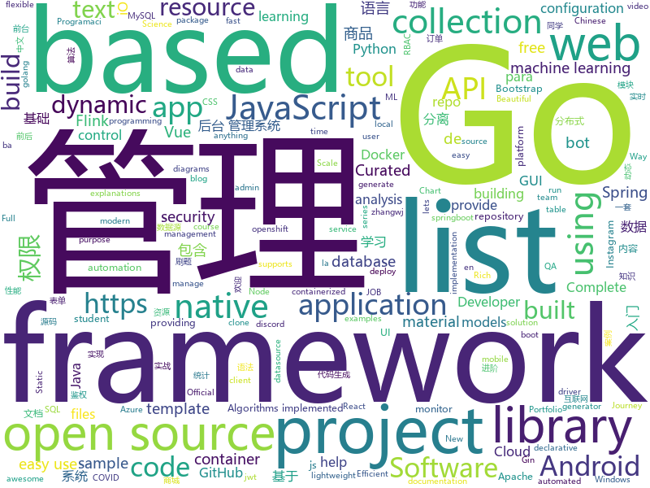

# 2020-08-05
See what the GitHub community is most excited about.

## python
+ [Statistical-Learning-Method_Code](https://github.com/Dod-o/Statistical-Learning-Method_Code)(**117 stars today**): 手写实现李航《统计学习方法》书中全部算法
+ [rich](https://github.com/willmcgugan/rich)(**393 stars today**): Rich is a Python library for rich text and beautiful formatting in the terminal.
+ [Python](https://github.com/TheAlgorithms/Python)(**296 stars today**): All Algorithms implemented in Python
+ [Ciphey](https://github.com/Ciphey/Ciphey)(**251 stars today**): Automated decryption tool
+ [machine_learning_examples](https://github.com/lazyprogrammer/machine_learning_examples)(**9 stars today**): A collection of machine learning examples and tutorials.
+ [InstaPy](https://github.com/timgrossmann/InstaPy)(**75 stars today**): 📷Instagram Bot - Tool for automated Instagram interactions
+ [full-stack-fastapi-postgresql](https://github.com/tiangolo/full-stack-fastapi-postgresql)(**8 stars today**): Full stack, modern web application generator. Using FastAPI, PostgreSQL as database, Docker, automatic HTTPS and more.
+ [core](https://github.com/home-assistant/core)(**21 stars today**): 🏡Open source home automation that puts local control and privacy first
+ [harmonizeproject](https://github.com/MCPCapital/harmonizeproject)(**58 stars today**): Harmonize Project - Sync HDMI video with Philips Hue lights using a Raspberry Pi!
+ [pe_tree](https://github.com/blackberry/pe_tree)(**180 stars today**): 
+ [100DaysOfCloudIdeas](https://github.com/100DaysOfCloud/100DaysOfCloudIdeas)(**16 stars today**): The purpose of this repo is to provide a list of micro-projects to help people with their Cloud Journey.
+ [Real-World-Masked-Face-Dataset](https://github.com/X-zhangyang/Real-World-Masked-Face-Dataset)(**14 stars today**): Real-World Masked Face Dataset，口罩人脸数据集
+ [Mobile-Security-Framework-MobSF](https://github.com/MobSF/Mobile-Security-Framework-MobSF)(**19 stars today**): Mobile Security Framework (MobSF) is an automated, all-in-one mobile application (Android/iOS/Windows) pen-testing, malware analysis and security assessment framework capable of performing static and dynamic analysis.
+ [magic-python](https://github.com/iswbm/magic-python)(**23 stars today**): Python 黑魔法手册
+ [VideoPose3D](https://github.com/facebookresearch/VideoPose3D)(**6 stars today**): Efficient 3D human pose estimation in video using 2D keypoint trajectories
+ [mlfinlab](https://github.com/hudson-and-thames/mlfinlab)(**4 stars today**): MlFinLab helps portfolio managers and traders who want to leverage the power of machine learning by providing reproducible, interpretable, and easy to use tools.
+ [Summer2021-Internships](https://github.com/Pitt-CSC/Summer2021-Internships)(**18 stars today**): Collection of Summer 2021 tech internships!
+ [gym](https://github.com/openai/gym)(**18 stars today**): A toolkit for developing and comparing reinforcement learning algorithms.
+ [CRAFT-pytorch](https://github.com/clovaai/CRAFT-pytorch)(**4 stars today**): Official implementation of Character Region Awareness for Text Detection (CRAFT)
+ [DeepCTR](https://github.com/shenweichen/DeepCTR)(**8 stars today**): Easy-to-use,Modular and Extendible package of deep-learning based CTR models.
+ [pytorch-lightning](https://github.com/PyTorchLightning/pytorch-lightning)(**37 stars today**): The lightweight PyTorch wrapper for ML researchers. Scale your models. Write less boilerplate
+ [b0mb3r](https://github.com/crinny/b0mb3r)(**4 stars today**): 💣Открытый СМС бомбер
+ [airflow](https://github.com/apache/airflow)(**14 stars today**): Apache Airflow - A platform to programmatically author, schedule, and monitor workflows
+ [ida-plugins](https://github.com/repnz/ida-plugins)(**12 stars today**): A collection of my IDA plugins
+ [faceswap](https://github.com/deepfakes/faceswap)(**26 stars today**): Deepfakes Software For All

## java
+ [Java](https://github.com/TheAlgorithms/Java)(**236 stars today**): All Algorithms implemented in Java
+ [flink-learning](https://github.com/zhisheng17/flink-learning)(**35 stars today**): flink learning blog. http://www.54tianzhisheng.cn 含 Flink 入门、概念、原理、实战、性能调优、源码解析等内容。涉及 Flink Connector、Metrics、Library、DataStream API、Table API & SQL 等内容的学习案例，还有 Flink 落地应用的大型项目案例（PVUV、日志存储、百亿数据实时去重、监控告警）分享。欢迎大家支持我的专栏《大数据实时计算引擎 Flink 实战与性能优化》
+ [lombok-intellij-plugin](https://github.com/mplushnikov/lombok-intellij-plugin)(**8 stars today**): Lombok Plugin for IntelliJ IDEA
+ [hive](https://github.com/apache/hive)(**5 stars today**): Apache Hive
+ [Diplo_NT_Intro_Programacion](https://github.com/martindapol/Diplo_NT_Intro_Programacion)(**45 stars today**): Repositorio de código con material didáctico utilizado para el módulo Introducción a la Programación de la Diplomatura en Nuevas Tecnologías
+ [mall](https://github.com/macrozheng/mall)(**121 stars today**): mall项目是一套电商系统，包括前台商城系统及后台管理系统，基于SpringBoot+MyBatis实现，采用Docker容器化部署。 前台商城系统包含首页门户、商品推荐、商品搜索、商品展示、购物车、订单流程、会员中心、客户服务、帮助中心等模块。 后台管理系统包含商品管理、订单管理、会员管理、促销管理、运营管理、内容管理、统计报表、财务管理、权限管理、设置等模块。
+ [hbase](https://github.com/apache/hbase)(**4 stars today**): Apache HBase
+ [xxl-job](https://github.com/xuxueli/xxl-job)(**17 stars today**): A distributed task scheduling framework.（分布式任务调度平台XXL-JOB）
+ [Sokobot](https://github.com/PolyMarsDev/Sokobot)(**5 stars today**): A Discord bot that lets you play Sokoban
+ [code-examples](https://github.com/thombergs/code-examples)(**3 stars today**): A collection of code examples from blog posts etc.
+ [InternetArchitect](https://github.com/bjmashibing/InternetArchitect)(**40 stars today**): 年薪百万互联网架构师课程文档及源码(公开部分)
+ [spring-petclinic](https://github.com/spring-projects/spring-petclinic)(**2 stars today**): A sample Spring-based application
+ [RxJava](https://github.com/ReactiveX/RxJava)(**10 stars today**): RxJava – Reactive Extensions for the JVM – a library for composing asynchronous and event-based programs using observable sequences for the Java VM.
+ [advanced-java](https://github.com/doocs/advanced-java)(**44 stars today**): 😮互联网 Java 工程师进阶知识完全扫盲：涵盖高并发、分布式、高可用、微服务、海量数据处理等领域知识，后端同学必看，前端同学也可学习
+ [kafdrop](https://github.com/obsidiandynamics/kafdrop)(**9 stars today**): Kafka Web UI
+ [shardingsphere](https://github.com/apache/shardingsphere)(**11 stars today**): Distributed database middleware
+ [shardingsphere-elasticjob](https://github.com/apache/shardingsphere-elasticjob)(**10 stars today**): Distributed scheduled job framework
+ [Signal-Android](https://github.com/signalapp/Signal-Android)(**7 stars today**): A private messenger for Android.
+ [mlkit](https://github.com/googlesamples/mlkit)(**7 stars today**): A collection of sample apps to demonstrate how to use Google's ML Kit APIs on Android and iOS
+ [instagrabber](https://github.com/austinhuang0131/instagrabber)(**85 stars today**): InstaGrabber, the open-source Instagram client for Android. Originally by @AwaisKing.
+ [kafka](https://github.com/apache/kafka)(**12 stars today**): Mirror of Apache Kafka
+ [spring-cloud-gateway](https://github.com/spring-cloud/spring-cloud-gateway)(**7 stars today**): A Gateway built on Spring Framework 5.x and Spring Boot 2.x providing routing and more.
+ [nacos](https://github.com/alibaba/nacos)(**25 stars today**): an easy-to-use dynamic service discovery, configuration and service management platform for building cloud native applications.
+ [testcontainers-java](https://github.com/testcontainers/testcontainers-java)(**3 stars today**): Testcontainers is a Java library that supports JUnit tests, providing lightweight, throwaway instances of common databases, Selenium web browsers, or anything else that can run in a Docker container.
+ [dynamic-datasource-spring-boot-starter](https://github.com/baomidou/dynamic-datasource-spring-boot-starter)(**14 stars today**): dynamic datasource for springboot 多数据源 动态数据源 主从分离 读写分离 分布式事务 https://github.com/baomidou/dynamic-datasource-spring-boot-starter/wiki

## unknown
+ [how-to-secure-anything](https://github.com/veeral-patel/how-to-secure-anything)(**408 stars today**): How to systematically secure anything: a repository about security engineering
+ [coding-interview-university](https://github.com/jwasham/coding-interview-university)(**611 stars today**): A complete computer science study plan to become a software engineer.
+ [UNSAM_2020c2_Python](https://github.com/python-unsam/UNSAM_2020c2_Python)(**20 stars today**): Curso de programación en Python - 2do cuatrimestre 2020 - UNSAM
+ [educative.io_courses](https://github.com/aboelkassem/educative.io_courses)(**118 stars today**): this is downloadings of all educative.io free student subscription courses as pdf from GitHub student pack
+ [Data-Science-Interview-Resources](https://github.com/rbhatia46/Data-Science-Interview-Resources)(**78 stars today**): A repository listing out the potential sources which will help you in preparing for a Data Science/Machine Learning interview. New resources added frequently.
+ [design-resources-for-developers](https://github.com/bradtraversy/design-resources-for-developers)(**50 stars today**): Curated list of design and UI resources from stock photos, web templates, CSS frameworks, UI libraries, tools and much more
+ [You-Dont-Know-JS](https://github.com/getify/You-Dont-Know-JS)(**121 stars today**): A book series on JavaScript. @YDKJS on twitter.
+ [leetcode](https://github.com/grandyang/leetcode)(**77 stars today**): Provide all my solutions and explanations in Chinese for all the Leetcode coding problems.
+ [NewGrad-2021](https://github.com/Pitt-CSC/NewGrad-2021)(**30 stars today**): A collection of New Grad full time roles in SWE, Quant, and PM.
+ [AzureMonitorCommunity](https://github.com/microsoft/AzureMonitorCommunity)(**9 stars today**): An open repo for Azure Monitor queries, workbooks, alerts and more
+ [build-your-own-x](https://github.com/danistefanovic/build-your-own-x)(**59 stars today**): 🤓Build your own (insert technology here)
+ [project-based-learning](https://github.com/tuvtran/project-based-learning)(**66 stars today**): Curated list of project-based tutorials
+ [coding-interview-cpp](https://github.com/meenakshiravisankar/coding-interview-cpp)(**19 stars today**): A concise preparation material for competitive programming interviews
+ [mirai](https://github.com/mamoe/mirai)(**79 stars today**): 
+ [javascript-questions](https://github.com/lydiahallie/javascript-questions)(**43 stars today**): A long list of (advanced) JavaScript questions, and their explanations✨
+ [FreezeG](https://github.com/bryandlee/FreezeG)(**30 stars today**): Freezing generator for pseudo image translation
+ [awesome-open-geoscience](https://github.com/softwareunderground/awesome-open-geoscience)(**6 stars today**): Curated from repositories that make our lives as geoscientists, hackers and data wranglers easier or just more awesome
+ [Awesome-SOAR](https://github.com/correlatedsecurity/Awesome-SOAR)(**2 stars today**): A curated Cyber "Security Orchestration, Automation and Response (SOAR)" awesome list.
+ [codeSTACKr](https://github.com/codeSTACKr/codeSTACKr)(**21 stars today**): 
+ [COVID-19](https://github.com/pcm-dpc/COVID-19)(**1 stars today**): COVID-19 Italia - Monitoraggio situazione
+ [trust-token-api](https://github.com/WICG/trust-token-api)(**10 stars today**): Trust Token API
+ [vagas](https://github.com/frontendbr/vagas)(**10 stars today**): 🔬Espaço para divulgação de vagas para front-enders.
+ [QA_bible](https://github.com/Vladislav610/QA_bible)(**4 stars today**): Библия QA это 200++ страниц обновляемой смеси ответов на вопросы с реальных собеседований на QA, перевода интересного контента с зарубежных ресурсов и агрегации материала с отечественных.
+ [aws_exposable_resources](https://github.com/SummitRoute/aws_exposable_resources)(**17 stars today**): Resource types that can be publicly exposed on AWS
+ [Python-Core-50-Courses](https://github.com/jackfrued/Python-Core-50-Courses)(**23 stars today**): Python语言基础50课

## javascript
+ [gpu.js](https://github.com/gpujs/gpu.js)(**210 stars today**): GPU Accelerated JavaScript
+ [ps4-ipv6-uaf](https://github.com/ChendoChap/ps4-ipv6-uaf)(**19 stars today**): 
+ [drawio](https://github.com/jgraph/drawio)(**108 stars today**): Source to app.diagrams.net
+ [complete-javascript-course](https://github.com/jonasschmedtmann/complete-javascript-course)(**92 stars today**): Starter files, final projects and FAQ for my Complete JavaScript course
+ [uPlot](https://github.com/leeoniya/uPlot)(**44 stars today**): 📈A small, fast chart for time series, lines, areas, ohlc & bars
+ [bluezone-app](https://github.com/BluezoneGlobal/bluezone-app)(**14 stars today**): Bluezone - Bảo vệ mình, bảo vệ cộng đồng
+ [drawio-desktop](https://github.com/jgraph/drawio-desktop)(**84 stars today**): Official electron build of diagrams.net
+ [vxe-table](https://github.com/x-extends/vxe-table)(**19 stars today**): 🐬vxe-table vue 表格解决方案
+ [masterPortfolio](https://github.com/ashutosh1919/masterPortfolio)(**14 stars today**): 🔥The Complete Customizable Software Developer Portfolio Template which lets you showcase your work and provides each and every detail about you as Software Developer.
+ [Rocket.Chat](https://github.com/RocketChat/Rocket.Chat)(**9 stars today**): The ultimate Free Open Source Solution for team communications.
+ [absensiqrcode](https://github.com/xietsunzao/absensiqrcode)(**3 stars today**): 
+ [react](https://github.com/facebook/react)(**92 stars today**): A declarative, efficient, and flexible JavaScript library for building user interfaces.
+ [Javascript](https://github.com/TheAlgorithms/Javascript)(**31 stars today**): A repository for All algorithms implemented in Javascript (for educational purposes only)
+ [icons](https://github.com/twbs/icons)(**208 stars today**): Official open source SVG icon library for Bootstrap.
+ [tiktok-clone](https://github.com/CleverProgrammers/tiktok-clone)(**7 stars today**): A clone of TikTok built by Sonny & Qazi👉https://tik-tok-clone-eb635.web.app/
+ [react-native](https://github.com/facebook/react-native)(**33 stars today**): A framework for building native apps with React.
+ [whistle](https://github.com/avwo/whistle)(**8 stars today**): HTTP, HTTP2, HTTPS, Websocket debugging proxy
+ [vuex](https://github.com/vuejs/vuex)(**12 stars today**): 🗃️Centralized State Management for Vue.js.
+ [quill](https://github.com/quilljs/quill)(**18 stars today**): Quill is a modern WYSIWYG editor built for compatibility and extensibility.
+ [react-beautiful-dnd](https://github.com/atlassian/react-beautiful-dnd)(**17 stars today**): Beautiful and accessible drag and drop for lists with React
+ [egg](https://github.com/eggjs/egg)(**6 stars today**): 🥚Born to build better enterprise frameworks and apps with Node.js & Koa
+ [joplin](https://github.com/laurent22/joplin)(**20 stars today**): Joplin - an open source note taking and to-do application with synchronization capabilities for Windows, macOS, Linux, Android and iOS. Forum: https://discourse.joplinapp.org/
+ [nodebestpractices](https://github.com/goldbergyoni/nodebestpractices)(**31 stars today**): ✅The Node.js best practices list (August 2020)
+ [BullshitGenerator](https://github.com/menzi11/BullshitGenerator)(**8 stars today**): Needs to generate some texts to test if my GUI rendering codes good or not. so I made this.

## html
+ [seldon-core](https://github.com/SeldonIO/seldon-core)(**4 stars today**): An MLOps framework to package, deploy, monitor and manage thousands of production machine learning models
+ [keep-a-changelog](https://github.com/olivierlacan/keep-a-changelog)(**2 stars today**): If you build software, keep a changelog.
+ [discord-bot-client](https://github.com/Flam3rboy/discord-bot-client)(**1 stars today**): A custom hosted discord website, with bot login support
+ [fastText](https://github.com/facebookresearch/fastText)(**5 stars today**): Library for fast text representation and classification.
+ [indigo](https://github.com/sergiokopplin/indigo)(**4 stars today**): 🍜Minimalist Jekyll Template
+ [calico](https://github.com/projectcalico/calico)(**6 stars today**): Cloud native networking and network security
+ [ai-edu](https://github.com/microsoft/ai-edu)(**8 stars today**): AI education materials for Chinese students, teachers and IT professionals.
+ [samples](https://github.com/azure-ad-b2c/samples)(**0 stars today**): Azure AD B2C Identity Experience Framework sample User Journeys.
+ [bulma-templates](https://github.com/BulmaTemplates/bulma-templates)(**2 stars today**): free flexbox templates built with the bulma css framework
+ [Tasmota](https://github.com/arendst/Tasmota)(**8 stars today**): Alternative firmware for ESP8266 with easy configuration using webUI, OTA updates, automation using timers or rules, expandability and entirely local control over MQTT, HTTP, Serial or KNX. Full documentation at
+ [webdevbootcamp](https://github.com/nax3t/webdevbootcamp)(**7 stars today**): All source code for back-end projects from the Web Developer Bootcamp
+ [html](https://github.com/whatwg/html)(**2 stars today**): HTML Standard
+ [tidytuesday](https://github.com/rfordatascience/tidytuesday)(**6 stars today**): Official repo for the #tidytuesday project
+ [covid19-forecast-hub](https://github.com/reichlab/covid19-forecast-hub)(**2 stars today**): Projections of COVID-19, in standardized format
+ [swagger-codegen](https://github.com/swagger-api/swagger-codegen)(**6 stars today**): swagger-codegen contains a template-driven engine to generate documentation, API clients and server stubs in different languages by parsing your OpenAPI / Swagger definition.
+ [qcloud-documents](https://github.com/tencentyun/qcloud-documents)(**0 stars today**): 腾讯云官方文档
+ [chart-doctor](https://github.com/ft-interactive/chart-doctor)(**6 stars today**): Sample files to accompany the FT's Chart Doctor column
+ [ESPEasy](https://github.com/letscontrolit/ESPEasy)(**0 stars today**): Easy MultiSensor device based on ESP8266
+ [en.javascript.info](https://github.com/javascript-tutorial/en.javascript.info)(**14 stars today**): Modern JavaScript Tutorial
+ [phpstan](https://github.com/phpstan/phpstan)(**2 stars today**): PHP Static Analysis Tool - discover bugs in your code without running it!
+ [Markdown-Resume](https://github.com/CyC2018/Markdown-Resume)(**5 stars today**): ⭐️Markdown 简历模版
+ [chatcord](https://github.com/bradtraversy/chatcord)(**2 stars today**): Realtime chat app with rooms
+ [ML-notes](https://github.com/Sakura-gh/ML-notes)(**6 stars today**): notes about machine learning
+ [awesome-piracy](https://github.com/Igglybuff/awesome-piracy)(**12 stars today**): A curated list of awesome warez and piracy links
+ [startbootstrap-sb-admin-2](https://github.com/StartBootstrap/startbootstrap-sb-admin-2)(**4 stars today**): A free, open source, Bootstrap admin theme created by Start Bootstrap

## go
+ [algorithm-pattern](https://github.com/greyireland/algorithm-pattern)(**155 stars today**): 算法模板，最科学的刷题方式，最快速的刷题路径，你值得拥有~
+ [mysql](https://github.com/go-sql-driver/mysql)(**7 stars today**): Go MySQL Driver is a MySQL driver for Go's (golang) database/sql package
+ [prysm](https://github.com/prysmaticlabs/prysm)(**11 stars today**): Go implementation of the Ethereum 2.0 blockchain
+ [telegram-bot-api](https://github.com/go-telegram-bot-api/telegram-bot-api)(**6 stars today**): Golang bindings for the Telegram Bot API
+ [argo-cd](https://github.com/argoproj/argo-cd)(**9 stars today**): Declarative continuous deployment for Kubernetes.
+ [go-admin](https://github.com/wenjianzhang/go-admin)(**7 stars today**): 基于Gin + Vue + Element UI的前后端分离权限管理系统脚手架（包含了：基础用户管理功能，jwt鉴权，代码生成器，RBAC资源控制，表单构建等）文档：http://doc.zhangwj.com/go-admin-site/ Demo： http://www.zhangwj.com/#/login
+ [pipeline](https://github.com/tektoncd/pipeline)(**9 stars today**): A K8s-native Pipeline resource.
+ [gin-vue-admin](https://github.com/flipped-aurora/gin-vue-admin)(**28 stars today**): 基于gin+vue搭建的后台管理系统框架，集成jwt鉴权，权限管理，动态路由，分页封装，多点登录拦截，资源权限，上传下载，代码生成器，表单生成器等基础功能，五分钟一套CURD前后端代码包含数据库的快感你不要体验一下吗~,更多功能正在开发中，欢迎issue和pr~
+ [terraform](https://github.com/hashicorp/terraform)(**11 stars today**): Terraform enables you to safely and predictably create, change, and improve infrastructure. It is an open source tool that codifies APIs into declarative configuration files that can be shared amongst team members, treated as code, edited, reviewed, and versioned.
+ [horcrux-ui](https://github.com/jesseduffield/horcrux-ui)(**37 stars today**): GUI for horcrux
+ [lazydocker](https://github.com/jesseduffield/lazydocker)(**45 stars today**): The lazier way to manage everything docker
+ [moby](https://github.com/moby/moby)(**7 stars today**): Moby Project - a collaborative project for the container ecosystem to assemble container-based systems
+ [traefik](https://github.com/containous/traefik)(**14 stars today**): The Cloud Native Edge Router
+ [terraform-provider-aws](https://github.com/terraform-providers/terraform-provider-aws)(**8 stars today**): Terraform AWS provider
+ [fyne](https://github.com/fyne-io/fyne)(**16 stars today**): Cross platform GUI in Go based on Material Design
+ [helmfile](https://github.com/roboll/helmfile)(**4 stars today**): Deploy Kubernetes Helm Charts
+ [singularity](https://github.com/hpcng/singularity)(**2 stars today**): Singularity: Application containers for Linux
+ [go](https://github.com/golang/go)(**54 stars today**): The Go programming language
+ [origin](https://github.com/openshift/origin)(**3 stars today**): Images for OpenShift 3 and 4 - see openshift/okd for more
+ [go-ast-book](https://github.com/chai2010/go-ast-book)(**10 stars today**): 📚《Go语法树入门——开启自制编程语言和编译器之旅》(开源免费图书/Go语言进阶/掌握抽象语法树/Go语言AST/LLVM/LLIR/凹语言)
+ [act](https://github.com/nektos/act)(**71 stars today**): Run your GitHub Actions locally🚀
+ [authelia](https://github.com/authelia/authelia)(**24 stars today**): The Single Sign-On Multi-Factor portal for web apps
+ [nomad](https://github.com/hashicorp/nomad)(**5 stars today**): Nomad is an easy-to-use, flexible, and performant workload orchestrator that can deploy a mix of microservice, batch, containerized, and non-containerized applications. Nomad is easy to operate and scale and has native Consul and Vault integrations.
+ [casbin](https://github.com/casbin/casbin)(**11 stars today**): An authorization library that supports access control models like ACL, RBAC, ABAC in Golang
+ [the-way-to-go_ZH_CN](https://github.com/unknwon/the-way-to-go_ZH_CN)(**20 stars today**): 《The Way to Go》中文译本，中文正式名《Go 入门指南》

## WordCloud

