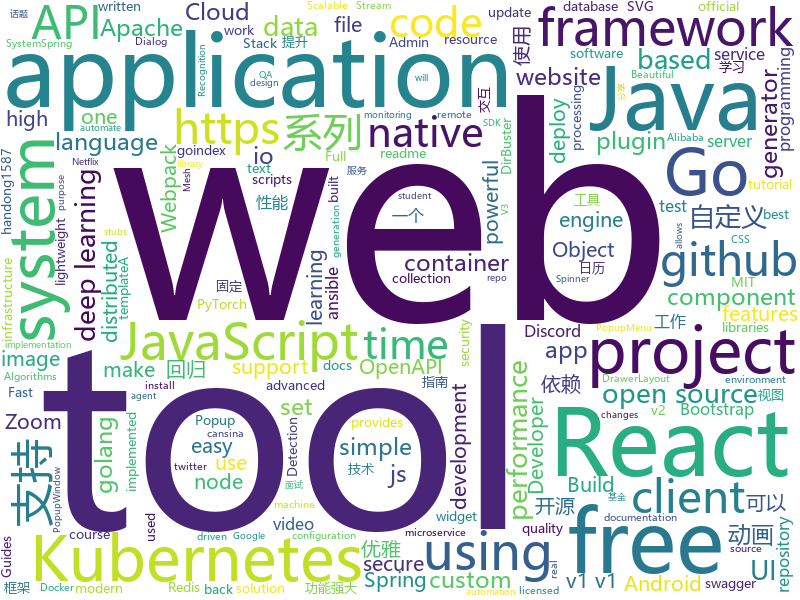

# 2020-08-07
See what the GitHub community is most excited about.

## python
+ [bpytop](https://github.com/aristocratos/bpytop)(**232 stars today**): Linux/OSX/FreeBSD resource monitor
+ [iOS-DeviceSupport](https://github.com/iGhibli/iOS-DeviceSupport)(**11 stars today**): This repository holds the device support files for the iOS, and I will update it regularly.
+ [mixer](https://github.com/ubisoft/mixer)(**134 stars today**): Add-on for real-time collaboration in Blender.
+ [yolov5](https://github.com/ultralytics/yolov5)(**77 stars today**): YOLOv5 in PyTorch > ONNX > CoreML > iOS
+ [learn-python](https://github.com/KhoaDauTay/learn-python)(**5 stars today**): 
+ [Ciphey](https://github.com/Ciphey/Ciphey)(**429 stars today**): Automated decryption tool
+ [pytorch-tutorial](https://github.com/yunjey/pytorch-tutorial)(**27 stars today**): PyTorch Tutorial for Deep Learning Researchers
+ [espnet](https://github.com/espnet/espnet)(**9 stars today**): End-to-End Speech Processing Toolkit
+ [fawkes](https://github.com/Shawn-Shan/fawkes)(**136 stars today**): Fawkes, privacy preserving tool against facial recognition systems. More info at https://sandlab.cs.uchicago.edu/fawkes
+ [bert-as-service](https://github.com/hanxiao/bert-as-service)(**12 stars today**): Mapping a variable-length sentence to a fixed-length vector using BERT model
+ [great_expectations](https://github.com/great-expectations/great_expectations)(**36 stars today**): Always know what to expect from your data.
+ [practical-python](https://github.com/dabeaz-course/practical-python)(**25 stars today**): Practical Python Programming (course by @dabeaz)
+ [ansible](https://github.com/ansible/ansible)(**18 stars today**): Ansible is a radically simple IT automation platform that makes your applications and systems easier to deploy. Avoid writing scripts or custom code to deploy and update your applications — automate in a language that approaches plain English, using SSH, with no agents to install on remote systems. https://docs.ansible.com/ansible/
+ [Python](https://github.com/TheAlgorithms/Python)(**274 stars today**): All Algorithms implemented in Python
+ [prefect](https://github.com/PrefectHQ/prefect)(**7 stars today**): The easiest way to automate your data
+ [crocodilehunter](https://github.com/EFForg/crocodilehunter)(**61 stars today**): Taking one back for Steve Irwin (๑•̀ㅂ•́)و
+ [full-stack-fastapi-postgresql](https://github.com/tiangolo/full-stack-fastapi-postgresql)(**115 stars today**): Full stack, modern web application generator. Using FastAPI, PostgreSQL as database, Docker, automatic HTTPS and more.
+ [DDParser](https://github.com/baidu/DDParser)(**94 stars today**): 百度开源的依存句法分析系统
+ [public-apis](https://github.com/public-apis/public-apis)(**96 stars today**): A collective list of free APIs for use in software and web development.
+ [checkov](https://github.com/bridgecrewio/checkov)(**9 stars today**): Prevent cloud misconfigurations during build-time for Terraform, Cloudformation, Kubernetes, Serverless framework and other infrastructure-as-code-languages with Checkov by Bridgecrew.
+ [DeepSpeed](https://github.com/microsoft/DeepSpeed)(**12 stars today**): DeepSpeed is a deep learning optimization library that makes distributed training easy, efficient, and effective.
+ [Summer2021-Internships](https://github.com/Pitt-CSC/Summer2021-Internships)(**35 stars today**): Collection of Summer 2021 tech internships!
+ [dirmap](https://github.com/H4ckForJob/dirmap)(**7 stars today**): An advanced web directory & file scanning tool that will be more powerful than DirBuster, Dirsearch, cansina, and Yu Jian.一个高级web目录、文件扫描工具，功能将会强于DirBuster、Dirsearch、cansina、御剑。
+ [pytorch-image-models](https://github.com/rwightman/pytorch-image-models)(**20 stars today**): PyTorch image models, scripts, pretrained weights -- (SE)ResNet/ResNeXT, DPN, EfficientNet, MixNet, MobileNet-V3/V2, MNASNet, Single-Path NAS, FBNet, and more
+ [avatarify](https://github.com/alievk/avatarify)(**89 stars today**): Avatars for Zoom, Skype and other video-conferencing apps.

## java
+ [pulsar](https://github.com/apache/pulsar)(**7 stars today**): Apache Pulsar - distributed pub-sub messaging system
+ [spring-cloud-alibaba](https://github.com/alibaba/spring-cloud-alibaba)(**27 stars today**): Spring Cloud Alibaba provides a one-stop solution for application development for the distributed solutions of Alibaba middleware.
+ [antlr4](https://github.com/antlr/antlr4)(**12 stars today**): ANTLR (ANother Tool for Language Recognition) is a powerful parser generator for reading, processing, executing, or translating structured text or binary files.
+ [CalendarView](https://github.com/huanghaibin-dev/CalendarView)(**5 stars today**): Android上一个优雅、万能自定义UI、支持周视图、自定义周起始、性能高效的日历控件，支持热插拔实现的UI定制！支持标记、自定义颜色、农历、自定义月视图各种显示模式等。Canvas绘制，速度快、占用内存低，你真的想不到日历居然还可以如此优雅！An elegant, highly customized and high-performance Calendar Widget on Android.
+ [nifi](https://github.com/apache/nifi)(**2 stars today**): Apache NiFi
+ [skywalking](https://github.com/apache/skywalking)(**12 stars today**): APM, Application Performance Monitoring System
+ [spring-boot](https://github.com/spring-projects/spring-boot)(**28 stars today**): Spring Boot
+ [camunda-bpm-platform](https://github.com/camunda/camunda-bpm-platform)(**4 stars today**): Flexible framework for workflow and decision automation with BPMN and DMN. Integration with Spring, Spring Boot, CDI.
+ [aws-sdk-java](https://github.com/aws/aws-sdk-java)(**3 stars today**): The official AWS SDK for Java.
+ [JavaGuide](https://github.com/Snailclimb/JavaGuide)(**90 stars today**): 「Java学习+面试指南」一份涵盖大部分Java程序员所需要掌握的核心知识。
+ [openapi-generator](https://github.com/OpenAPITools/openapi-generator)(**14 stars today**): OpenAPI Generator allows generation of API client libraries (SDK generation), server stubs, documentation and configuration automatically given an OpenAPI Spec (v2, v3)
+ [guava](https://github.com/google/guava)(**17 stars today**): Google core libraries for Java
+ [spring-cloud-netflix](https://github.com/spring-cloud/spring-cloud-netflix)(**4 stars today**): Integration with Netflix OSS components
+ [jib](https://github.com/GoogleContainerTools/jib)(**8 stars today**): 🏗Build container images for your Java applications.
+ [spring-framework](https://github.com/spring-projects/spring-framework)(**27 stars today**): Spring Framework
+ [conductor](https://github.com/Netflix/conductor)(**6 stars today**): Conductor is a microservices orchestration engine - https://netflix.github.io/conductor/
+ [PowerJob](https://github.com/KFCFans/PowerJob)(**142 stars today**): 新一代分布式任务调度与计算框架，支持CRON、API、固定频率、固定延迟等调度策略，提供工作流来编排任务解决依赖关系，使用简单，功能强大，文档齐全，欢迎各位接入使用！
+ [OpenRefine](https://github.com/OpenRefine/OpenRefine)(**3 stars today**): OpenRefine is a free, open source power tool for working with messy data and improving it
+ [kafka-streams-examples](https://github.com/confluentinc/kafka-streams-examples)(**2 stars today**): Demo applications and code examples for Apache Kafka's Streams API.
+ [react-native-push-notification](https://github.com/zo0r/react-native-push-notification)(**1 stars today**): React Native Local and Remote Notifications
+ [toBeTopJavaer](https://github.com/hollischuang/toBeTopJavaer)(**27 stars today**): To Be Top Javaer - Java工程师成神之路
+ [lettuce-core](https://github.com/lettuce-io/lettuce-core)(**2 stars today**): Advanced Java Redis client for thread-safe sync, async, and reactive usage. Supports Cluster, Sentinel, Pipelining, and codecs.
+ [lombok-intellij-plugin](https://github.com/mplushnikov/lombok-intellij-plugin)(**15 stars today**): Lombok Plugin for IntelliJ IDEA
+ [react-native-video](https://github.com/react-native-community/react-native-video)(**5 stars today**): A <Video /> component for react-native
+ [XPopup](https://github.com/li-xiaojun/XPopup)(**11 stars today**): 🔥XPopup2.0版本重磅来袭，2倍以上性能提升，带来可观的动画性能优化和交互细节的提升！！！功能强大，交互优雅，动画丝滑的通用弹窗！可以替代Dialog，PopupWindow，PopupMenu，BottomSheet，DrawerLayout，Spinner等组件，自带十几种效果良好的动画， 支持完全的UI和动画自定义！(Powerful and Beautiful Popup，can absolutely replace Dialog，PopupWindow，PopupMenu，BottomSheet，DrawerLayout，Spinner. With built-in animators , very easy to custom popup view.)

## unknown
+ [educative.io_courses](https://github.com/aboelkassem/educative.io_courses)(**116 stars today**): this is downloadings of all educative.io free student subscription courses as pdf from GitHub student pack
+ [reverse-interview](https://github.com/viraptor/reverse-interview)(**137 stars today**): Questions to ask the company during your interview
+ [955.WLB](https://github.com/formulahendry/955.WLB)(**163 stars today**): 955 不加班的公司名单 - 工作 955，work–life balance (工作与生活的平衡)
+ [Best-websites-a-programmer-should-visit](https://github.com/sdmg15/Best-websites-a-programmer-should-visit)(**211 stars today**): 🔗Some useful websites for programmers.
+ [applied-ml](https://github.com/eugeneyan/applied-ml)(**42 stars today**): 📚Papers & articles of companies sharing their work on applied data science & machine learning.
+ [bank](https://github.com/pietrzakadrian/bank)(**38 stars today**): Full Stack Web Application similar to financial software that is used in banking institutions | React.js and Node.js
+ [codeSTACKr](https://github.com/codeSTACKr/codeSTACKr)(**27 stars today**): 
+ [QA_bible](https://github.com/Vladislav610/QA_bible)(**36 stars today**): Библия QA это 200++ страниц обновляемой смеси ответов на вопросы с реальных собеседований на QA, перевода интересного контента с зарубежных ресурсов и агрегации материала с отечественных.
+ [JavaCollection](https://github.com/hansonwang99/JavaCollection)(**9 stars today**): Java开源项目之「自学编程之路」：学习指南+面试指南+资源分享+技术文章
+ [Blog](https://github.com/mqyqingfeng/Blog)(**14 stars today**): 冴羽写博客的地方，预计写四个系列：JavaScript深入系列、JavaScript专题系列、ES6系列、React系列。
+ [xiaobaiyang](https://github.com/liupan1890/xiaobaiyang)(**77 stars today**): 
+ [d2l-study-group](https://github.com/dair-ai/d2l-study-group)(**21 stars today**): Deep Learning Study Group
+ [css-in-readme-like-wat](https://github.com/sindresorhus/css-in-readme-like-wat)(**10 stars today**): Style your readme using CSS with this simple trick
+ [awesome-scalability](https://github.com/binhnguyennus/awesome-scalability)(**17 stars today**): The Patterns of Scalable, Reliable, and Performant Large-Scale Systems
+ [android_guides](https://github.com/codepath/android_guides)(**7 stars today**): Extensive Open-Source Guides for Android Developers
+ [free-programming-books](https://github.com/EbookFoundation/free-programming-books)(**71 stars today**): 📚Freely available programming books
+ [Deep-learning-books](https://github.com/loveunk/Deep-learning-books)(**11 stars today**): Books for machine learning, deep learning, math, NLP, CV, RL, etc
+ [ue4-style-guide](https://github.com/Allar/ue4-style-guide)(**3 stars today**): An attempt to make Unreal Engine 4 projects more consistent
+ [msgpack-c](https://github.com/msgpack/msgpack-c)(**5 stars today**): MessagePack implementation for C and C++ / msgpack.org[C/C++]
+ [curriculum](https://github.com/TheOdinProject/curriculum)(**7 stars today**): The open curriculum for learning web development
+ [fe-news](https://github.com/naver/fe-news)(**17 stars today**): FE 기술 소식 큐레이션 뉴스레터
+ [FreezeG](https://github.com/bryandlee/FreezeG)(**28 stars today**): Freezing generator for pseudo image translation
+ [golang-open-source-projects](https://github.com/hackstoic/golang-open-source-projects)(**15 stars today**): 为互联网IT人打造的中文版awesome-go
+ [awesome-object-detection](https://github.com/amusi/awesome-object-detection)(**7 stars today**): Awesome Object Detection based on handong1587 github: https://handong1587.github.io/deep_learning/2015/10/09/object-detection.html
+ [how-to-secure-anything](https://github.com/veeral-patel/how-to-secure-anything)(**399 stars today**): How to systematically secure anything: a repository about security engineering

## javascript
+ [Javascript](https://github.com/TheAlgorithms/Javascript)(**82 stars today**): A repository for All algorithms implemented in Javascript (for educational purposes only)
+ [github-readme-stats](https://github.com/anuraghazra/github-readme-stats)(**262 stars today**): ⚡Dynamically generated stats for your github readmes
+ [blog-post-workflow](https://github.com/gautamkrishnar/blog-post-workflow)(**41 stars today**): Show your latest blog posts from any sources or StackOverflow activity on your GitHub profile/project readme automatically using the RSS feed
+ [blockly](https://github.com/google/blockly)(**11 stars today**): The web-based visual programming editor.
+ [react-native](https://github.com/facebook/react-native)(**23 stars today**): A framework for building native apps with React.
+ [DNSExfiltrator](https://github.com/Arno0x/DNSExfiltrator)(**33 stars today**): Data exfiltration over DNS request covert channel
+ [husky](https://github.com/typicode/husky)(**21 stars today**): Git hooks made easy🐶woof!
+ [leek-fund](https://github.com/giscafer/leek-fund)(**52 stars today**): VSCode 插件（韭菜基金），VSCode 里也可以看股票 & 基金实时数据
+ [heroicons](https://github.com/tailwindlabs/heroicons)(**84 stars today**): A set of free MIT-licensed high-quality SVG icons for UI development.
+ [carbon](https://github.com/carbon-design-system/carbon)(**3 stars today**): A design system built by IBM
+ [project-guidelines](https://github.com/elsewhencode/project-guidelines)(**15 stars today**): A set of best practices for JavaScript projects
+ [UnblockNeteaseMusic](https://github.com/nondanee/UnblockNeteaseMusic)(**58 stars today**): Revive unavailable songs for Netease Cloud Music
+ [react-native-website](https://github.com/facebook/react-native-website)(**4 stars today**): The site and docs for React Native
+ [BetterDiscordApp](https://github.com/rauenzi/BetterDiscordApp)(**7 stars today**): Better Discord App enhances Discord desktop app with new features.
+ [mocha](https://github.com/mochajs/mocha)(**9 stars today**): ☕️simple, flexible, fun javascript test framework for node.js & the browser
+ [bootstrap-datetimepicker](https://github.com/Eonasdan/bootstrap-datetimepicker)(**1 stars today**): Date/time picker widget based on twitter bootstrap
+ [react-refresh-webpack-plugin](https://github.com/pmmmwh/react-refresh-webpack-plugin)(**60 stars today**): A Webpack plugin to enable "Fast Refresh" (also previously known as Hot Reloading) for React components.
+ [MagneticButtons](https://github.com/codrops/MagneticButtons)(**20 stars today**): A set of buttons with a magnetic interaction and a hover effect.
+ [hapi](https://github.com/hapijs/hapi)(**8 stars today**): The Simple, Secure Framework Developers Trust
+ [axios](https://github.com/axios/axios)(**38 stars today**): Promise based HTTP client for the browser and node.js
+ [goindex-theme-acrou](https://github.com/Aicirou/goindex-theme-acrou)(**18 stars today**): This is a goindex theme.一个goindex的扩展主题。
+ [Awesome-Design-Tools](https://github.com/goabstract/Awesome-Design-Tools)(**33 stars today**): The best design tools and plugins for everything👉
+ [remax](https://github.com/remaxjs/remax)(**13 stars today**): 使用真正的 React 构建跨平台小程序
+ [tailblocks](https://github.com/mertJF/tailblocks)(**43 stars today**): 🎉Ready-to-use Tailwind CSS blocks.
+ [bootstrap-vue](https://github.com/bootstrap-vue/bootstrap-vue)(**10 stars today**): BootstrapVue provides one of the most comprehensive implementations of Bootstrap v4 for Vue.js. With extensive and automated WAI-ARIA accessibility markup.

## html
+ [rellax](https://github.com/dixonandmoe/rellax)(**1 stars today**): Lightweight, vanilla javascript parallax library
+ [web-moderno](https://github.com/cod3rcursos/web-moderno)(**4 stars today**): 
+ [boost](https://github.com/boostorg/boost)(**4 stars today**): Super-project for modularized Boost
+ [fastText](https://github.com/facebookresearch/fastText)(**3 stars today**): Library for fast text representation and classification.
+ [swagger-codegen](https://github.com/swagger-api/swagger-codegen)(**4 stars today**): swagger-codegen contains a template-driven engine to generate documentation, API clients and server stubs in different languages by parsing your OpenAPI / Swagger definition.
+ [twemoji](https://github.com/twitter/twemoji)(**12 stars today**): Emoji for everyone. https://twemoji.twitter.com/
+ [dailyPaper](https://github.com/GoSSIP-SJTU/dailyPaper)(**27 stars today**): 每日论文推荐
+ [HTML-Form-Submission-Mail-Google-sheet](https://github.com/nikhilkilivayil/HTML-Form-Submission-Mail-Google-sheet)(**7 stars today**): 
+ [tabler-icons](https://github.com/tabler/tabler-icons)(**36 stars today**): A set of over 550 free MIT-licensed high-quality SVG icons for you to use in your web projects.
+ [3d-force-graph](https://github.com/vasturiano/3d-force-graph)(**16 stars today**): 3D force-directed graph component using ThreeJS/WebGL
+ [docker.github.io](https://github.com/docker/docker.github.io)(**4 stars today**): Source repo for Docker's Documentation
+ [styleguide](https://github.com/google/styleguide)(**6 stars today**): Style guides for Google-originated open-source projects
+ [webdevbootcamp](https://github.com/nax3t/webdevbootcamp)(**3 stars today**): All source code for back-end projects from the Web Developer Bootcamp
+ [dive-into-webpack](https://github.com/gwuhaolin/dive-into-webpack)(**3 stars today**): 全面的Webpack教程《深入浅出Webpack》电子书
+ [tidytuesday](https://github.com/rfordatascience/tidytuesday)(**3 stars today**): Official repo for the #tidytuesday project
+ [coreui-free-bootstrap-admin-template](https://github.com/coreui/coreui-free-bootstrap-admin-template)(**1 stars today**): CoreUI is free bootstrap admin template
+ [discord-bot-client](https://github.com/Flam3rboy/discord-bot-client)(**5 stars today**): A custom hosted discord website, with bot login support
+ [Machine-Learning](https://github.com/Jack-Cherish/Machine-Learning)(**7 stars today**): ⚡机器学习实战（Python3）：kNN、决策树、贝叶斯、逻辑回归、SVM、线性回归、树回归
+ [TheHive](https://github.com/TheHive-Project/TheHive)(**1 stars today**): TheHive: a Scalable, Open Source and Free Security Incident Response Platform
+ [stisla](https://github.com/stisla/stisla)(**6 stars today**): Free Bootstrap Admin Template
+ [awesome-modern-cpp](https://github.com/rigtorp/awesome-modern-cpp)(**21 stars today**): A collection of resources on modern C++
+ [hugo-academic](https://github.com/gcushen/hugo-academic)(**8 stars today**): 📝The website builder for Hugo. Build and deploy a beautiful website in minutes!
+ [grabcam](https://github.com/noob-hackers/grabcam)(**2 stars today**): A tool to hack camera from termux for video tutorial visit youtube.com/noobhackers
+ [railsgirls.github.io](https://github.com/railsgirls/railsgirls.github.io)(**7 stars today**): Rails Girls Guides
+ [zphisher](https://github.com/htr-tech/zphisher)(**7 stars today**): Automated Phishing Tool

## go
+ [osm](https://github.com/openservicemesh/osm)(**277 stars today**): Open Service Mesh (OSM) is a lightweight, extensible, cloud native service mesh that allows users to uniformly manage, secure, and get out-of-the-box observability features for highly dynamic microservice environments.
+ [charts](https://github.com/helm/charts)(**11 stars today**): Curated applications for Kubernetes
+ [jupiter](https://github.com/douyu/jupiter)(**134 stars today**): Jupiter是斗鱼开源的面向服务治理的Golang微服务框架
+ [afero](https://github.com/spf13/afero)(**9 stars today**): A FileSystem Abstraction System for Go
+ [minio](https://github.com/minio/minio)(**38 stars today**): High Performance, Kubernetes Native Object Storage
+ [minikube](https://github.com/kubernetes/minikube)(**10 stars today**): Run Kubernetes locally
+ [testify](https://github.com/stretchr/testify)(**13 stars today**): A toolkit with common assertions and mocks that plays nicely with the standard library
+ [glab](https://github.com/profclems/glab)(**183 stars today**): A custom Gitlab Cli tool written in Go (golang)
+ [moby](https://github.com/moby/moby)(**13 stars today**): Moby Project - a collaborative project for the container ecosystem to assemble container-based systems
+ [pprof](https://github.com/google/pprof)(**14 stars today**): pprof is a tool for visualization and analysis of profiling data
+ [goreplay](https://github.com/buger/goreplay)(**17 stars today**): GoReplay is an open-source tool for capturing and replaying live HTTP traffic into a test environment in order to continuously test your system with real data. It can be used to increase confidence in code deployments, configuration changes and infrastructure changes.
+ [flux](https://github.com/fluxcd/flux)(**8 stars today**): The GitOps Kubernetes operator
+ [dashboard](https://github.com/kubernetes/dashboard)(**5 stars today**): General-purpose web UI for Kubernetes clusters
+ [kubernetes](https://github.com/kubernetes/kubernetes)(**43 stars today**): Production-Grade Container Scheduling and Management
+ [gin](https://github.com/gin-gonic/gin)(**47 stars today**): Gin is a HTTP web framework written in Go (Golang). It features a Martini-like API with much better performance -- up to 40 times faster. If you need smashing performance, get yourself some Gin.
+ [amqp](https://github.com/streadway/amqp)(**5 stars today**): Go client for AMQP 0.9.1
+ [telegraf](https://github.com/influxdata/telegraf)(**10 stars today**): The plugin-driven server agent for collecting & reporting metrics.
+ [prometheus](https://github.com/prometheus/prometheus)(**30 stars today**): The Prometheus monitoring system and time series database.
+ [vault](https://github.com/hashicorp/vault)(**7 stars today**): A tool for secrets management, encryption as a service, and privileged access management
+ [sarama](https://github.com/Shopify/sarama)(**6 stars today**): Sarama is a Go library for Apache Kafka 0.8, and up.
+ [sealos](https://github.com/fanux/sealos)(**7 stars today**): 只能用丝滑一词形容的kubernetes高可用安装（kubernetes install）工具，一条命令，离线安装，包含所有依赖，内核负载不依赖haproxy keepalived,纯golang开发,99年证书,支持v1.16 v1.15 v1.17 v1.18!
+ [night](https://github.com/talkgo/night)(**11 stars today**): Weekly Go Online Meetup via Zoom and Bilibili｜Go 夜读｜由 SIG 成员维护｜通过 zoom 在线直播的方式分享 Go 相关的技术话题，每天大家在微信/telegram/Slack 上及时沟通交流编程技术话题。
+ [streamhut](https://github.com/miguelmota/streamhut)(**25 stars today**): Stream your terminal to web without installing anything
+ [golangci-lint](https://github.com/golangci/golangci-lint)(**16 stars today**): Fast linters Runner for Go
+ [redigo](https://github.com/gomodule/redigo)(**8 stars today**): Go client for Redis

## WordCloud

