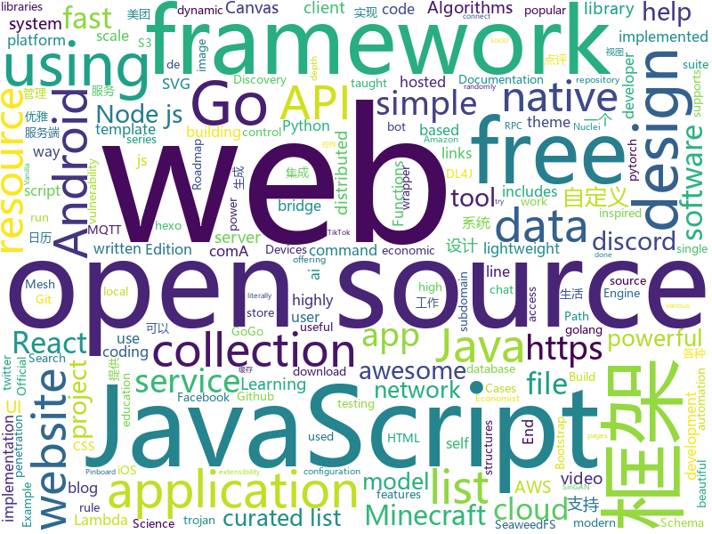

# 2020-08-09
See what the GitHub community is most excited about.

## python
+ [tuya-convert](https://github.com/ct-Open-Source/tuya-convert)(**5 stars today**): A collection of scripts to flash Tuya IoT devices to alternative firmwares
+ [prefect](https://github.com/PrefectHQ/prefect)(**27 stars today**): The easiest way to automate your data
+ [TikTok-Shares-Botter](https://github.com/zoony1337/TikTok-Shares-Botter)(**15 stars today**): Adds TikTok Shares for you.
+ [public-apis](https://github.com/public-apis/public-apis)(**205 stars today**): A collective list of free APIs for use in software and web development.
+ [ai-economist](https://github.com/salesforce/ai-economist)(**19 stars today**): Foundation is a flexible, modular, and composable framework to model socio-economic behaviors and dynamics with both agents and governments. This framework can be used in conjunction with reinforcement learning to learn optimal economic policies, as done by the AI Economist (https://www.einstein.ai/the-ai-economist).
+ [bpytop](https://github.com/aristocratos/bpytop)(**333 stars today**): Linux/OSX/FreeBSD resource monitor
+ [Atlas](https://github.com/magicleap/Atlas)(**104 stars today**): Atlas: End-to-End 3D Scene Reconstruction from Posed Images
+ [youtube-dl](https://github.com/ytdl-org/youtube-dl)(**37 stars today**): Command-line program to download videos from YouTube.com and other video sites
+ [system-design-primer](https://github.com/donnemartin/system-design-primer)(**138 stars today**): Learn how to design large-scale systems. Prep for the system design interview. Includes Anki flashcards.
+ [pytorch-lightning](https://github.com/PyTorchLightning/pytorch-lightning)(**26 stars today**): The lightweight PyTorch wrapper for ML researchers. Scale your models. Write less boilerplate
+ [antenny](https://github.com/RedBalloonShenanigans/antenny)(**8 stars today**): Make your own base station to communicate with satellites!
+ [PySyft](https://github.com/OpenMined/PySyft)(**7 stars today**): A library for answering questions using data you cannot see
+ [wttr.in](https://github.com/chubin/wttr.in)(**16 stars today**): ⛅The right way to check the weather
+ [cupp](https://github.com/Mebus/cupp)(**6 stars today**): Common User Passwords Profiler (CUPP)
+ [zulip](https://github.com/zulip/zulip)(**9 stars today**): Zulip server - powerful open source team chat
+ [h4cker](https://github.com/The-Art-of-Hacking/h4cker)(**27 stars today**): This repository is primarily maintained by Omar Santos and includes thousands of resources related to ethical hacking / penetration testing, digital forensics and incident response (DFIR), vulnerability research, exploit development, reverse engineering, and more.
+ [gibMacOS](https://github.com/corpnewt/gibMacOS)(**10 stars today**): Py2/py3 script that can download macOS components direct from Apple
+ [learn-python](https://github.com/KhoaDauTay/learn-python)(**92 stars today**): 
+ [routersploit](https://github.com/threat9/routersploit)(**5 stars today**): Exploitation Framework for Embedded Devices
+ [core](https://github.com/home-assistant/core)(**26 stars today**): 🏡Open source home automation that puts local control and privacy first
+ [howdoi](https://github.com/gleitz/howdoi)(**11 stars today**): instant coding answers via the command line
+ [SinGAN](https://github.com/tamarott/SinGAN)(**15 stars today**): Official pytorch implementation of the paper: "SinGAN: Learning a Generative Model from a Single Natural Image"
+ [festin](https://github.com/cr0hn/festin)(**14 stars today**): FestIn - S3 Bucket Weakness Discovery
+ [ArchiveBox](https://github.com/pirate/ArchiveBox)(**13 stars today**): 🗃The open source self-hosted web archive. Takes browser history/bookmarks/Pocket/Pinboard/etc., saves HTML, JS, PDFs, media, and more...
+ [Lazymux](https://github.com/Gameye98/Lazymux)(**4 stars today**): termux tool installer

## java
+ [MCinaBox](https://github.com/longjunyu2/MCinaBox)(**22 stars today**): MCinaBox - A Minecraft Java Edition Launcher on Android
+ [shardingsphere](https://github.com/apache/shardingsphere)(**15 stars today**): Distributed database middleware
+ [interview](https://github.com/mission-peace/interview)(**9 stars today**): Interview questions
+ [elasticsearch](https://github.com/elastic/elasticsearch)(**24 stars today**): Open Source, Distributed, RESTful Search Engine
+ [AarogyaSetu_Android](https://github.com/nic-delhi/AarogyaSetu_Android)(**3 stars today**): Aarogya Setu Android app native code
+ [cat](https://github.com/dianping/cat)(**20 stars today**): CAT 作为服务端项目基础组件，提供了 Java, C/C++, Node.js, Python, Go 等多语言客户端，已经在美团点评的基础架构中间件框架（MVC框架，RPC框架，数据库框架，缓存框架等，消息队列，配置系统等）深度集成，为美团点评各业务线提供系统丰富的性能指标、健康状况、实时告警等。
+ [netty](https://github.com/netty/netty)(**8 stars today**): Netty project - an event-driven asynchronous network application framework
+ [Geyser](https://github.com/GeyserMC/Geyser)(**6 stars today**): A bridge/proxy allowing you to connect to Minecraft: Java Edition servers with Minecraft: Bedrock edition.
+ [runelite](https://github.com/runelite/runelite)(**3 stars today**): Open source Old School RuneScape client
+ [Kafka-Sprout](https://github.com/oslabs-beta/Kafka-Sprout)(**52 stars today**): 🚀Web GUI for Kafka Cluster Management
+ [JDA](https://github.com/DV8FromTheWorld/JDA)(**4 stars today**): Java wrapper for the popular chat & VOIP service: Discord https://discord.com
+ [data-structures](https://github.com/williamfiset/data-structures)(**7 stars today**): A collection of powerful data structures
+ [NewPipe](https://github.com/TeamNewPipe/NewPipe)(**10 stars today**): A libre lightweight streaming front-end for Android.
+ [QNotified](https://github.com/cinit/QNotified)(**8 stars today**): QQ辅助性功能增强
+ [Algorithms](https://github.com/williamfiset/Algorithms)(**17 stars today**): A collection of algorithms and data structures
+ [CalendarView](https://github.com/huanghaibin-dev/CalendarView)(**11 stars today**): Android上一个优雅、万能自定义UI、支持周视图、自定义周起始、性能高效的日历控件，支持热插拔实现的UI定制！支持标记、自定义颜色、农历、自定义月视图各种显示模式等。Canvas绘制，速度快、占用内存低，你真的想不到日历居然还可以如此优雅！An elegant, highly customized and high-performance Calendar Widget on Android.
+ [NetGuard](https://github.com/M66B/NetGuard)(**3 stars today**): A simple way to block access to the internet per app
+ [CS-Notes](https://github.com/CyC2018/CS-Notes)(**98 stars today**): 📚技术面试必备基础知识、Leetcode、计算机操作系统、计算机网络、系统设计、Java、Python、C++
+ [java-algorithms-implementation](https://github.com/phishman3579/java-algorithms-implementation)(**4 stars today**): Algorithms and Data Structures implemented in Java
+ [cve_2020_14644](https://github.com/potats0/cve_2020_14644)(**5 stars today**): 
+ [deeplearning4j-examples](https://github.com/eclipse/deeplearning4j-examples)(**1 stars today**): Deeplearning4j Examples (DL4J, DL4J Spark, DataVec)
+ [quarkus](https://github.com/quarkusio/quarkus)(**4 stars today**): Quarkus: Supersonic Subatomic Java.
+ [Mindustry](https://github.com/Anuken/Mindustry)(**4 stars today**): A sandbox tower defense game
+ [igniter](https://github.com/trojan-gfw/igniter)(**5 stars today**): A trojan client for Android (UNDER CONSTRUCTION).
+ [Essentials](https://github.com/EssentialsX/Essentials)(**4 stars today**): The essential plugin suite for Minecraft servers.

## unknown
+ [You-Dont-Know-JS](https://github.com/getify/You-Dont-Know-JS)(**87 stars today**): A book series on JavaScript. @YDKJS on twitter.
+ [Best-websites-a-programmer-should-visit](https://github.com/sdmg15/Best-websites-a-programmer-should-visit)(**224 stars today**): 🔗Some useful websites for programmers.
+ [awesome-production-machine-learning](https://github.com/EthicalML/awesome-production-machine-learning)(**110 stars today**): A curated list of awesome open source libraries to deploy, monitor, version and scale your machine learning
+ [build-your-own-x](https://github.com/danistefanovic/build-your-own-x)(**186 stars today**): 🤓Build your own (insert technology here)
+ [awesome-sysadmin](https://github.com/kahun/awesome-sysadmin)(**546 stars today**): A curated list of amazingly awesome open source sysadmin resources inspired by Awesome PHP.
+ [free-programming-books](https://github.com/EbookFoundation/free-programming-books)(**79 stars today**): 📚Freely available programming books
+ [app-ideas](https://github.com/florinpop17/app-ideas)(**71 stars today**): A Collection of application ideas which can be used to improve your coding skills.
+ [codeSTACKr](https://github.com/codeSTACKr/codeSTACKr)(**40 stars today**): 
+ [955.WLB](https://github.com/formulahendry/955.WLB)(**292 stars today**): 955 不加班的公司名单 - 工作 955，work–life balance (工作与生活的平衡)
+ [javascript-dev-bookmarks](https://github.com/didicodes/javascript-dev-bookmarks)(**89 stars today**): A collection of articles that will help you get better at JavaScript.
+ [gpt-3](https://github.com/openai/gpt-3)(**66 stars today**): GPT-3: Language Models are Few-Shot Learners
+ [stereo-from-mono](https://github.com/nianticlabs/stereo-from-mono)(**8 stars today**): [ECCV 2020] Learning stereo from single images using monocular depth estimation networks
+ [system_design](https://github.com/shashank88/system_design)(**16 stars today**): Preparation links and resources for system design questions
+ [flutter_roadmap](https://github.com/olexale/flutter_roadmap)(**21 stars today**): Highly Subjective Roadmap to Flutter Development
+ [Design_to_code](https://github.com/dheerajghub/Design_to_code)(**6 stars today**): This is a series of design that i randomly took from various instagram, facebook pages and try to convert thoes into code hope it helps you.
+ [COVID-19](https://github.com/CSSEGISandData/COVID-19)(**23 stars today**): Novel Coronavirus (COVID-19) Cases, provided by JHU CSSE
+ [data-science](https://github.com/ossu/data-science)(**27 stars today**): 📊Path to a free self-taught education in Data Science!
+ [computer-science](https://github.com/ossu/computer-science)(**38 stars today**): 🎓Path to a free self-taught education in Computer Science!
+ [developer-roadmap](https://github.com/kamranahmedse/developer-roadmap)(**132 stars today**): Roadmap to becoming a web developer in 2020
+ [DEF-CON-Links](https://github.com/AngusRed/DEF-CON-Links)(**6 stars today**): Easy links and guides for DEF CON 28 Safemode
+ [Xiaomi_Kernel_OpenSource](https://github.com/MiCode/Xiaomi_Kernel_OpenSource)(**5 stars today**): Xiaomi Mobile Phone Kernel OpenSource
+ [github-cheat-sheet](https://github.com/tiimgreen/github-cheat-sheet)(**52 stars today**): A list of cool features of Git and GitHub.
+ [binance-official-api-docs](https://github.com/binance-exchange/binance-official-api-docs)(**3 stars today**): Official Documentation for the Binance APIs and Streams
+ [nuclei-templates](https://github.com/projectdiscovery/nuclei-templates)(**9 stars today**): Community curated list of template files for the nuclei engine to find security vulnerability and fingerprinting the targets.
+ [open-source-cs](https://github.com/ForrestKnight/open-source-cs)(**5 stars today**): Video discussing this curriculum:

## javascript
+ [heroicons](https://github.com/tailwindlabs/heroicons)(**180 stars today**): A set of free MIT-licensed high-quality SVG icons for UI development.
+ [nodejs-zoom-clone](https://github.com/CleverProgrammers/nodejs-zoom-clone)(**50 stars today**): 
+ [facebook-scripts-dom-manipulation](https://github.com/JayremntB/facebook-scripts-dom-manipulation)(**17 stars today**): An open-source project includes many scripts with no Access Token needed for Facebook users by directly manipulating the DOM.
+ [javascript-algorithms](https://github.com/trekhleb/javascript-algorithms)(**145 stars today**): 📝Algorithms and data structures implemented in JavaScript with explanations and links to further readings
+ [nodebestpractices](https://github.com/goldbergyoni/nodebestpractices)(**135 stars today**): ✅The Node.js best practices list (August 2020)
+ [Javascript](https://github.com/TheAlgorithms/Javascript)(**273 stars today**): A repository for All algorithms implemented in Javascript (for educational purposes only)
+ [awesome-selfhosted](https://github.com/awesome-selfhosted/awesome-selfhosted)(**22 stars today**): A list of Free Software network services and web applications which can be hosted locally. Selfhosting is the process of hosting and managing applications instead of renting from Software-as-a-Service providers
+ [vanillawebprojects](https://github.com/bradtraversy/vanillawebprojects)(**14 stars today**): Mini projects built with HTML5, CSS & JavaScript. No frameworks or libraries
+ [functions-samples](https://github.com/firebase/functions-samples)(**9 stars today**): Collection of sample apps showcasing popular use cases using Cloud Functions for Firebase
+ [react-native](https://github.com/facebook/react-native)(**47 stars today**): A framework for building native apps with React.
+ [fullstack-course4](https://github.com/jhu-ep-coursera/fullstack-course4)(**21 stars today**): Example code for HTML, CSS, and Javascript for Web Developers Coursera Course
+ [node-react-ecommerce](https://github.com/basir/node-react-ecommerce)(**7 stars today**): Build ECommerce Website Like Amazon By React & Node & MongoDB
+ [discord.js](https://github.com/discordjs/discord.js)(**8 stars today**): A powerful JavaScript library for interacting with the Discord API
+ [devsoutinhoflix](https://github.com/omariosouto/devsoutinhoflix)(**4 stars today**): Projeto da Imersão Alura
+ [supabase](https://github.com/supabase/supabase)(**38 stars today**): Website, docs, and client libraries. Follow to stay updated about our public Beta.
+ [aws-serverless-express](https://github.com/awslabs/aws-serverless-express)(**5 stars today**): Run serverless applications and REST APIs using your existing Node.js application framework, on top of AWS Lambda and Amazon API Gateway
+ [AdminLTE](https://github.com/ColorlibHQ/AdminLTE)(**13 stars today**): AdminLTE - Free admin dashboard template based on Bootstrap 4
+ [zigbee2mqtt](https://github.com/Koenkk/zigbee2mqtt)(**5 stars today**): Zigbee🐝to MQTT bridge🌉, get rid of your proprietary Zigbee bridges🔨
+ [webogram](https://github.com/zhukov/webogram)(**3 stars today**): Telegram web application, GPL v3
+ [dribbble2react](https://github.com/react-ui-kit/dribbble2react)(**3 stars today**): Transform Dribbble designs to React-Native code | Shop UI Kit >>
+ [aws-lambda-power-tuning](https://github.com/alexcasalboni/aws-lambda-power-tuning)(**10 stars today**): AWS Lambda Power Tuning is an open-source tool that can help you visualize and fine-tune the memory/power configuration of Lambda functions. It runs in your own AWS account - powered by AWS Step Functions - and it supports three optimization strategies: cost, speed, and balanced.
+ [OSINT-Framework](https://github.com/lockfale/OSINT-Framework)(**3 stars today**): OSINT Framework
+ [next.js](https://github.com/vercel/next.js)(**28 stars today**): The React Framework
+ [fabric.js](https://github.com/fabricjs/fabric.js)(**12 stars today**): Javascript Canvas Library, SVG-to-Canvas (& canvas-to-SVG) Parser
+ [node-express-realworld-example-app](https://github.com/gothinkster/node-express-realworld-example-app)(**5 stars today**): 

## html
+ [free-for-dev](https://github.com/ripienaar/free-for-dev)(**67 stars today**): A list of SaaS, PaaS and IaaS offerings that have free tiers of interest to devops and infradev
+ [zphisher](https://github.com/htr-tech/zphisher)(**9 stars today**): Automated Phishing Tool
+ [discord-bot-client](https://github.com/Flam3rboy/discord-bot-client)(**13 stars today**): A custom hosted discord website, with bot login support
+ [Tasmota](https://github.com/arendst/Tasmota)(**8 stars today**): Alternative firmware for ESP8266 with easy configuration using webUI, OTA updates, automation using timers or rules, expandability and entirely local control over MQTT, HTTP, Serial or KNX. Full documentation at
+ [hyperblog](https://github.com/freddier/hyperblog)(**16 stars today**): Un blog increíble para el curso de Git y Github de Platzi
+ [beautiful-jekyll](https://github.com/daattali/beautiful-jekyll)(**2 stars today**): ✨Build a beautiful and simple website in literally minutes. Demo at https://beautifuljekyll.com
+ [awesome-piracy](https://github.com/Igglybuff/awesome-piracy)(**6 stars today**): A curated list of awesome warez and piracy links
+ [JavaScript30](https://github.com/wesbos/JavaScript30)(**12 stars today**): 30 Day Vanilla JS Challenge
+ [Coursera-ML-AndrewNg-Notes](https://github.com/fengdu78/Coursera-ML-AndrewNg-Notes)(**20 stars today**): 吴恩达老师的机器学习课程个人笔记
+ [zenbot](https://github.com/DeviaVir/zenbot)(**2 stars today**): Zenbot is a command-line cryptocurrency trading bot using Node.js and MongoDB.
+ [en.javascript.info](https://github.com/javascript-tutorial/en.javascript.info)(**23 stars today**): Modern JavaScript Tutorial
+ [twemoji](https://github.com/twitter/twemoji)(**14 stars today**): Emoji for everyone. https://twemoji.twitter.com/
+ [py4e](https://github.com/csev/py4e)(**5 stars today**): Web site for www.py4e.com and source to the Python 3.0 textbook
+ [hexo-theme-matery](https://github.com/blinkfox/hexo-theme-matery)(**6 stars today**): A beautiful hexo blog theme with material design and responsive design.一个基于材料设计和响应式设计而成的全面、美观的Hexo主题。国内访问：http://blinkfox.com
+ [awesome-modern-cpp](https://github.com/rigtorp/awesome-modern-cpp)(**10 stars today**): A collection of resources on modern C++
+ [re0-web](https://github.com/lyy289065406/re0-web)(**4 stars today**): RE0：从零开始的异世界生活 （WEB版）
+ [boost](https://github.com/boostorg/boost)(**5 stars today**): Super-project for modularized Boost
+ [wpt](https://github.com/web-platform-tests/wpt)(**0 stars today**): Test suites for Web platform specs — including WHATWG, W3C, and others
+ [personal-website](https://github.com/github/personal-website)(**6 stars today**): Code that'll help you kickstart a personal website that showcases your work as a software developer.
+ [fastText](https://github.com/facebookresearch/fastText)(**7 stars today**): Library for fast text representation and classification.
+ [urban-octo-telegram](https://github.com/coding-boot-camp/urban-octo-telegram)(**0 stars today**): 
+ [startbootstrap-resume](https://github.com/StartBootstrap/startbootstrap-resume)(**2 stars today**): A Bootstrap 4 resume/CV theme created by Start Bootstrap
+ [hugo-coder](https://github.com/luizdepra/hugo-coder)(**2 stars today**): A minimalist blog theme for hugo.
+ [schemaorg](https://github.com/schemaorg/schemaorg)(**8 stars today**): Schema.org - schemas and (appengine) software
+ [chatcord](https://github.com/bradtraversy/chatcord)(**5 stars today**): Realtime chat app with rooms

## go
+ [jupiter](https://github.com/douyu/jupiter)(**51 stars today**): Jupiter是斗鱼开源的面向服务治理的Golang微服务框架
+ [lotus](https://github.com/filecoin-project/lotus)(**6 stars today**): Implementation of the Filecoin protocol, written in Go
+ [go-zero](https://github.com/tal-tech/go-zero)(**38 stars today**): go-zero是一个集成了各种工程实践的web和rpc框架。通过弹性设计保障了大并发服务端的稳定性，经受了充分的实战检验。包含极简的API定义和生成工具，可以一键生成Go, iOS, Android, Dart, TypeScript, JavaScript代码，并可直接运行。
+ [go-cqhttp](https://github.com/Mrs4s/go-cqhttp)(**19 stars today**): cqhttp的golang实现，轻量、原生跨平台.
+ [osm](https://github.com/openservicemesh/osm)(**232 stars today**): Open Service Mesh (OSM) is a lightweight, extensible, cloud native service mesh that allows users to uniformly manage, secure, and get out-of-the-box observability features for highly dynamic microservice environments.
+ [v2ray-core](https://github.com/v2ray/v2ray-core)(**41 stars today**): A platform for building proxies to bypass network restrictions.
+ [go-ethereum](https://github.com/ethereum/go-ethereum)(**13 stars today**): Official Go implementation of the Ethereum protocol
+ [clash](https://github.com/Dreamacro/clash)(**32 stars today**): A rule-based tunnel in Go.
+ [Amass](https://github.com/OWASP/Amass)(**10 stars today**): In-depth Attack Surface Mapping and Asset Discovery
+ [mux](https://github.com/gorilla/mux)(**15 stars today**): A powerful HTTP router and URL matcher for building Go web servers with🦍
+ [cockroach](https://github.com/cockroachdb/cockroach)(**10 stars today**): CockroachDB - the open source, cloud-native distributed SQL database.
+ [trojan](https://github.com/Jrohy/trojan)(**10 stars today**): trojan多用户管理部署程序, 支持web页面管理
+ [annie](https://github.com/iawia002/annie)(**8 stars today**): 👾Fast, simple and clean video downloader
+ [httprobe](https://github.com/tomnomnom/httprobe)(**7 stars today**): Take a list of domains and probe for working HTTP and HTTPS servers
+ [seaweedfs](https://github.com/chrislusf/seaweedfs)(**5 stars today**): SeaweedFS is a simple and highly scalable distributed file system to store and serve billions of files fast! SeaweedFS object store has O(1) disk seek, transparent cloud integration, and SeaweedFS Filer supports Kubernetes, POSIX, S3 API, encryption, Erasure Coding for warm storage, FUSE mount, Hadoop, WebDAV.
+ [subfinder](https://github.com/projectdiscovery/subfinder)(**11 stars today**): Subfinder is a subdomain discovery tool that discovers valid subdomains for websites. Designed as a passive framework to be useful for bug bounties and safe for penetration testing.
+ [syncthing](https://github.com/syncthing/syncthing)(**10 stars today**): Open Source Continuous File Synchronization
+ [chainlink](https://github.com/smartcontractkit/chainlink)(**6 stars today**): node of the decentralized oracle network, bridging on and off-chain computation
+ [chat](https://github.com/tinode/chat)(**7 stars today**): Instant messaging platform. Backend in Go. Clients: Swift iOS, Java Android, JS webapp, scriptable command line; chatbots
+ [ffuf](https://github.com/ffuf/ffuf)(**10 stars today**): Fast web fuzzer written in Go
+ [riot](https://github.com/go-ego/riot)(**5 stars today**): Go Open Source, Distributed, Simple and efficient Search Engine
+ [fiber](https://github.com/gofiber/fiber)(**10 stars today**): ⚡️Fiber is an Express inspired web framework written in Go with☕️
+ [nuclei](https://github.com/projectdiscovery/nuclei)(**12 stars today**): Nuclei is a fast tool for configurable targeted scanning based on templates offering massive extensibility and ease of use.
+ [lets-fork](https://github.com/peterzernia/lets-fork)(**25 stars today**): Let's Fork server
+ [isucon9-qualify](https://github.com/isucon/isucon9-qualify)(**0 stars today**): ISUCON9予選

## WordCloud

