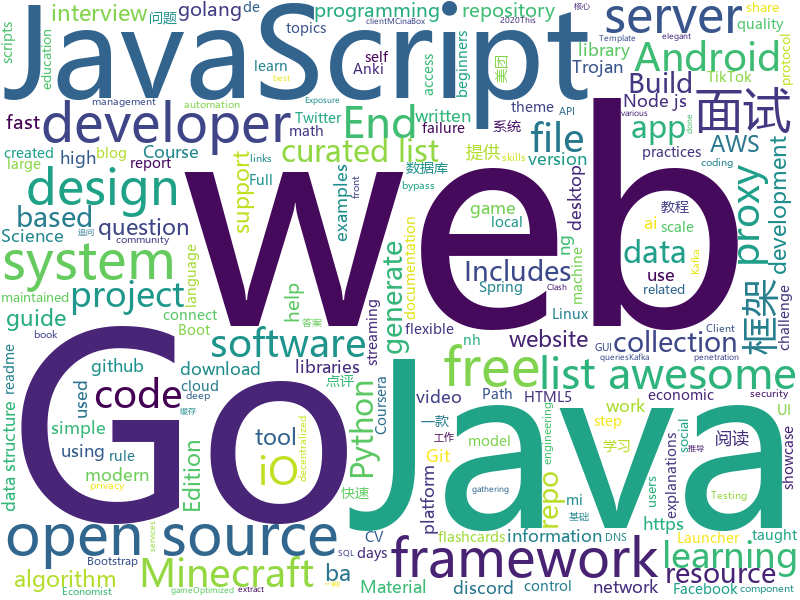

# 2020-08-10
See what the GitHub community is most excited about.

## python
+ [prefect](https://github.com/PrefectHQ/prefect)(**76 stars today**): The easiest way to automate your data
+ [AnimeGANv2](https://github.com/TachibanaYoshino/AnimeGANv2)(**75 stars today**): [Open Source]. The improved version of AnimeGAN.
+ [InvoiceNet](https://github.com/naiveHobo/InvoiceNet)(**84 stars today**): Deep neural network to extract intelligent information from PDF invoice documents.
+ [TikTok-Shares-Botter](https://github.com/zoony1337/TikTok-Shares-Botter)(**30 stars today**): Adds TikTok Shares for you.
+ [core](https://github.com/home-assistant/core)(**22 stars today**): 🏡Open source home automation that puts local control and privacy first
+ [public-apis](https://github.com/public-apis/public-apis)(**402 stars today**): A collective list of free APIs for use in software and web development.
+ [Bug-Hunting-Colab](https://github.com/hackingguy/Bug-Hunting-Colab)(**16 stars today**): A Colab For Bug Hunting!
+ [30-Days-Of-Python](https://github.com/Asabeneh/30-Days-Of-Python)(**19 stars today**): 30 days of Python programming challenge is a step by step guide to learn Python programming language in 30 days.
+ [tuya-convert](https://github.com/ct-Open-Source/tuya-convert)(**37 stars today**): A collection of scripts to flash Tuya IoT devices to alternative firmwares
+ [Atlas](https://github.com/magicleap/Atlas)(**196 stars today**): Atlas: End-to-End 3D Scene Reconstruction from Posed Images
+ [h4cker](https://github.com/The-Art-of-Hacking/h4cker)(**32 stars today**): This repository is primarily maintained by Omar Santos and includes thousands of resources related to ethical hacking / penetration testing, digital forensics and incident response (DFIR), vulnerability research, exploit development, reverse engineering, and more.
+ [manim](https://github.com/3b1b/manim)(**21 stars today**): Animation engine for explanatory math videos
+ [corona](https://github.com/geohot/corona)(**8 stars today**): Reverse engineering SARS-CoV-2
+ [raspiblitz](https://github.com/rootzoll/raspiblitz)(**3 stars today**): Get your own Bitcoin & Lightning Node running - on a RaspberryPi with a nice LCD
+ [system-design-primer](https://github.com/donnemartin/system-design-primer)(**90 stars today**): Learn how to design large-scale systems. Prep for the system design interview. Includes Anki flashcards.
+ [interactive-coding-challenges](https://github.com/donnemartin/interactive-coding-challenges)(**13 stars today**): 120+ interactive Python coding interview challenges (algorithms and data structures). Includes Anki flashcards.
+ [zipline](https://github.com/quantopian/zipline)(**8 stars today**): Zipline, a Pythonic Algorithmic Trading Library
+ [byob](https://github.com/malwaredllc/byob)(**4 stars today**): BYOB (Build Your Own Botnet)
+ [geneva](https://github.com/Kkevsterrr/geneva)(**86 stars today**): automated censorship evasion for the client-side and server-side
+ [bluezone](https://github.com/thaidn/bluezone)(**78 stars today**): 
+ [cloudsplaining](https://github.com/salesforce/cloudsplaining)(**11 stars today**): Cloudsplaining is an AWS IAM Security Assessment tool that identifies violations of least privilege and generates a risk-prioritized report.
+ [bpytop](https://github.com/aristocratos/bpytop)(**405 stars today**): Linux/OSX/FreeBSD resource monitor
+ [ai-economist](https://github.com/salesforce/ai-economist)(**34 stars today**): Foundation is a flexible, modular, and composable framework to model socio-economic behaviors and dynamics with both agents and governments. This framework can be used in conjunction with reinforcement learning to learn optimal economic policies, as done by the AI Economist (https://www.einstein.ai/the-ai-economist).
+ [awesome-python](https://github.com/vinta/awesome-python)(**39 stars today**): A curated list of awesome Python frameworks, libraries, software and resources
+ [sherlock](https://github.com/sherlock-project/sherlock)(**18 stars today**): 🔎Hunt down social media accounts by username across social networks

## java
+ [react-native-bluetooth-scan](https://github.com/BluezoneGlobal/react-native-bluetooth-scan)(**13 stars today**): Bluezone - Bảo vệ mình, bảo vệ cộng đồng
+ [Algorithms](https://github.com/williamfiset/Algorithms)(**22 stars today**): A collection of algorithms and data structures
+ [Geyser](https://github.com/GeyserMC/Geyser)(**11 stars today**): A bridge/proxy allowing you to connect to Minecraft: Java Edition servers with Minecraft: Bedrock edition.
+ [NewPipe](https://github.com/TeamNewPipe/NewPipe)(**22 stars today**): A libre lightweight streaming front-end for Android.
+ [termux-app](https://github.com/termux/termux-app)(**16 stars today**): Android terminal and Linux environment - app repository.
+ [runelite](https://github.com/runelite/runelite)(**6 stars today**): Open source Old School RuneScape client
+ [MCinaBox](https://github.com/longjunyu2/MCinaBox)(**31 stars today**): MCinaBox - A Minecraft Java Edition Launcher on Android
+ [Mindustry](https://github.com/Anuken/Mindustry)(**9 stars today**): A sandbox tower defense game
+ [FirebaseUI-Android](https://github.com/firebase/FirebaseUI-Android)(**3 stars today**): Optimized UI components for Firebase
+ [JavaGuide](https://github.com/Snailclimb/JavaGuide)(**90 stars today**): 「Java学习+面试指南」一份涵盖大部分Java程序员所需要掌握的核心知识。
+ [aws-doc-sdk-examples](https://github.com/awsdocs/aws-doc-sdk-examples)(**9 stars today**): Welcome to the AWS Code Examples Repository. This repo contains code examples used in the AWS documentation, AWS SDK Developer Guides, and more. For more information, see the Readme.rst file below.
+ [libgdx](https://github.com/libgdx/libgdx)(**7 stars today**): Desktop/Android/HTML5/iOS Java game development framework
+ [Arduino](https://github.com/arduino/Arduino)(**6 stars today**): open-source electronics platform
+ [kafdrop](https://github.com/obsidiandynamics/kafdrop)(**25 stars today**): Kafka Web UI
+ [spring-boot-examples](https://github.com/ityouknow/spring-boot-examples)(**20 stars today**): about learning Spring Boot via examples. Spring Boot 教程、技术栈示例代码，快速简单上手教程。
+ [Kafka-Sprout](https://github.com/oslabs-beta/Kafka-Sprout)(**76 stars today**): 🚀Web GUI for Kafka Cluster Management
+ [Hystrix](https://github.com/Netflix/Hystrix)(**8 stars today**): Hystrix is a latency and fault tolerance library designed to isolate points of access to remote systems, services and 3rd party libraries, stop cascading failure and enable resilience in complex distributed systems where failure is inevitable.
+ [interview](https://github.com/mission-peace/interview)(**12 stars today**): Interview questions
+ [PojavLauncher](https://github.com/PojavLauncherTeam/PojavLauncher)(**3 stars today**): An open source Minecraft: Java Edition launcher for Android based from Boardwalk. Support up-to Minecraft 1.11.2
+ [MyBookshelf](https://github.com/gedoor/MyBookshelf)(**10 stars today**): 阅读是一款可以自定义来源阅读网络内容的工具，为广大网络文学爱好者提供一种方便、快捷舒适的试读体验。
+ [cat](https://github.com/dianping/cat)(**34 stars today**): CAT 作为服务端项目基础组件，提供了 Java, C/C++, Node.js, Python, Go 等多语言客户端，已经在美团点评的基础架构中间件框架（MVC框架，RPC框架，数据库框架，缓存框架等，消息队列，配置系统等）深度集成，为美团点评各业务线提供系统丰富的性能指标、健康状况、实时告警等。
+ [Cimoc](https://github.com/Haleydu/Cimoc)(**5 stars today**): 
+ [formulog](https://github.com/HarvardPL/formulog)(**10 stars today**): Datalog with support for SMT queries
+ [akhq](https://github.com/tchiotludo/akhq)(**14 stars today**): Kafka GUI for Apache Kafka to manage topics, topics data, consumers group, schema registry, connect and more...
+ [jedis](https://github.com/xetorthio/jedis)(**5 stars today**): A blazingly small and sane redis java client

## unknown
+ [awesome-system-design](https://github.com/madd86/awesome-system-design)(**511 stars today**): A curated list of awesome system design mateiral
+ [free-programming-books](https://github.com/EbookFoundation/free-programming-books)(**509 stars today**): 📚Freely available programming books
+ [build-your-own-x](https://github.com/danistefanovic/build-your-own-x)(**273 stars today**): 🤓Build your own (insert technology here)
+ [Best-websites-a-programmer-should-visit](https://github.com/sdmg15/Best-websites-a-programmer-should-visit)(**408 stars today**): 🔗Some useful websites for programmers.
+ [data-science](https://github.com/ossu/data-science)(**40 stars today**): 📊Path to a free self-taught education in Data Science!
+ [awesome-production-machine-learning](https://github.com/EthicalML/awesome-production-machine-learning)(**233 stars today**): A curated list of awesome open source libraries to deploy, monitor, version and scale your machine learning
+ [QuantumultX](https://github.com/nzw9314/QuantumultX)(**13 stars today**): QuantumultX
+ [app-ideas](https://github.com/florinpop17/app-ideas)(**96 stars today**): A Collection of application ideas which can be used to improve your coding skills.
+ [pumpkin-book](https://github.com/datawhalechina/pumpkin-book)(**68 stars today**): 《机器学习》（西瓜书）公式推导解析，在线阅读地址：https://datawhalechina.github.io/pumpkin-book
+ [You-Dont-Know-JS](https://github.com/getify/You-Dont-Know-JS)(**125 stars today**): A book series on JavaScript. @YDKJS on twitter.
+ [computer-science](https://github.com/ossu/computer-science)(**46 stars today**): 🎓Path to a free self-taught education in Computer Science!
+ [javascript-questions](https://github.com/lydiahallie/javascript-questions)(**30 stars today**): A long list of (advanced) JavaScript questions, and their explanations✨
+ [Awesome-Hacking](https://github.com/Hack-with-Github/Awesome-Hacking)(**22 stars today**): A collection of various awesome lists for hackers, pentesters and security researchers
+ [955.WLB](https://github.com/formulahendry/955.WLB)(**358 stars today**): 955 不加班的公司名单 - 工作 955，work–life balance (工作与生活的平衡)
+ [developer-roadmap](https://github.com/kamranahmedse/developer-roadmap)(**193 stars today**): Roadmap to becoming a web developer in 2020
+ [Script](https://github.com/NobyDa/Script)(**5 stars today**): This project is based on the scripting capabilities of two excellent iOS proxy tools, Quantumult X or Surge.
+ [first-contributions](https://github.com/firstcontributions/first-contributions)(**12 stars today**): 🚀✨Help beginners to contribute to open source projects
+ [covid-19-data](https://github.com/nytimes/covid-19-data)(**7 stars today**): An ongoing repository of data on coronavirus cases and deaths in the U.S.
+ [awesome-for-beginners](https://github.com/MunGell/awesome-for-beginners)(**30 stars today**): A list of awesome beginners-friendly projects.
+ [system_design](https://github.com/shashank88/system_design)(**5 stars today**): Preparation links and resources for system design questions
+ [Deep-learning-books](https://github.com/loveunk/Deep-learning-books)(**3 stars today**): Books for machine learning, deep learning, math, NLP, CV, RL, etc
+ [gpt-3](https://github.com/openai/gpt-3)(**73 stars today**): GPT-3: Language Models are Few-Shot Learners
+ [Waking-Up](https://github.com/wolverinn/Waking-Up)(**5 stars today**): 计算机基础（计算机网络/操作系统/数据库/Git...）面试问题全面总结，包含详细的follow-up question以及答案；全部采用【问题+追问+答案】的形式，即拿即用，直击互联网大厂面试🚀；可用于模拟面试、面试前复习、短期内快速备战面试...
+ [eloquente-javascript](https://github.com/braziljs/eloquente-javascript)(**16 stars today**): Tradução do livro Eloquent JavaScript - 2ª edição.
+ [crash-course-CRM](https://github.com/divanov11/crash-course-CRM)(**0 stars today**): Django customer management platform

## javascript
+ [bluezone-app](https://github.com/BluezoneGlobal/bluezone-app)(**30 stars today**): Bluezone - Bảo vệ mình, bảo vệ cộng đồng
+ [javascript-algorithms](https://github.com/trekhleb/javascript-algorithms)(**305 stars today**): 📝Algorithms and data structures implemented in JavaScript with explanations and links to further readings
+ [nodejs-zoom-clone](https://github.com/CleverProgrammers/nodejs-zoom-clone)(**126 stars today**): 
+ [heroicons](https://github.com/tailwindlabs/heroicons)(**685 stars today**): A set of free MIT-licensed high-quality SVG icons for UI development.
+ [nodebestpractices](https://github.com/goldbergyoni/nodebestpractices)(**173 stars today**): ✅The Node.js best practices list (August 2020)
+ [twitter-clone](https://github.com/CleverProgrammers/twitter-clone)(**15 stars today**): 
+ [Motrix](https://github.com/agalwood/Motrix)(**16 stars today**): A full-featured download manager.
+ [discord.js](https://github.com/discordjs/discord.js)(**15 stars today**): A powerful JavaScript library for interacting with the Discord API
+ [opensource.guide](https://github.com/github/opensource.guide)(**7 stars today**): 📚Community guides for open source creators
+ [fullstack-course4](https://github.com/jhu-ep-coursera/fullstack-course4)(**31 stars today**): Example code for HTML, CSS, and Javascript for Web Developers Coursera Course
+ [Ghost](https://github.com/TryGhost/Ghost)(**12 stars today**): 👻The #1 headless Node.js CMS for professional publishing
+ [pipedream](https://github.com/PipedreamHQ/pipedream)(**2 stars today**): Serverless integration and compute platform. Free for developers.
+ [baiduwp](https://github.com/TkzcM/baiduwp)(**19 stars today**): PanDownload Web, built with CloudFlare Workers
+ [uBlock](https://github.com/gorhill/uBlock)(**19 stars today**): uBlock Origin - An efficient blocker for Chromium and Firefox. Fast and lean.
+ [complete-javascript-course](https://github.com/jonasschmedtmann/complete-javascript-course)(**9 stars today**): Starter files, final projects and FAQ for my Complete JavaScript course
+ [junior-recruit-scheduler](https://github.com/jojoldu/junior-recruit-scheduler)(**10 stars today**): 주니어 개발자 채용 정보
+ [phaser](https://github.com/photonstorm/phaser)(**12 stars today**): Phaser is a fun, free and fast 2D game framework for making HTML5 games for desktop and mobile web browsers, supporting Canvas and WebGL rendering.
+ [full-mark-composition-generator](https://github.com/BeautyYuYanli/full-mark-composition-generator)(**43 stars today**): 将专业术语和名人名言以随机报菜名的方式填入模板，生成一篇只有聪明人才能看懂的满分作文！
+ [facebook-scripts-dom-manipulation](https://github.com/JayremntB/facebook-scripts-dom-manipulation)(**24 stars today**): An open-source project includes many scripts with no Access Token needed for Facebook users by directly manipulating the DOM.
+ [developerFolio](https://github.com/saadpasta/developerFolio)(**9 stars today**): 🚀Software Developer Portfolio Template that helps you showcase your work and skills as a software developer.
+ [gatsby](https://github.com/gatsbyjs/gatsby)(**30 stars today**): Build blazing fast, modern apps and websites with React
+ [surge](https://github.com/yichahucha/surge)(**3 stars today**): script
+ [bootswatch](https://github.com/thomaspark/bootswatch)(**4 stars today**): Themes for Bootstrap
+ [CodeceptJS](https://github.com/codeceptjs/CodeceptJS)(**2 stars today**): Supercharged End 2 End Testing Framework for NodeJS
+ [guide](https://github.com/discordjs/guide)(**1 stars today**): The official guide for discord.js, created and maintained by core members of its community.

## html
+ [free-for-dev](https://github.com/ripienaar/free-for-dev)(**177 stars today**): A list of SaaS, PaaS and IaaS offerings that have free tiers of interest to devops and infradev
+ [Tasmota](https://github.com/arendst/Tasmota)(**13 stars today**): Alternative firmware for ESP8266 with easy configuration using webUI, OTA updates, automation using timers or rules, expandability and entirely local control over MQTT, HTTP, Serial or KNX. Full documentation at
+ [learning-area](https://github.com/mdn/learning-area)(**5 stars today**): Github repo for the MDN Learning Area.
+ [personal-website](https://github.com/github/personal-website)(**4 stars today**): Code that'll help you kickstart a personal website that showcases your work as a software developer.
+ [discord-bot-client](https://github.com/Flam3rboy/discord-bot-client)(**10 stars today**): A custom hosted discord website, with bot login support
+ [hexo-theme-fluid](https://github.com/fluid-dev/hexo-theme-fluid)(**11 stars today**): 🌊一款 Material Design 风格的 Hexo 主题 / An elegant Material-Design theme for Hexo
+ [shellphish](https://github.com/suljot/shellphish)(**0 stars today**): Phishing Tool for Instagram, Facebook, Twitter, Snapchat, Github
+ [hyperblog](https://github.com/freddier/hyperblog)(**12 stars today**): Un blog increíble para el curso de Git y Github de Platzi
+ [Front-end-Developer-Interview-Questions](https://github.com/h5bp/Front-end-Developer-Interview-Questions)(**18 stars today**): A list of helpful front-end related questions you can use to interview potential candidates, test yourself or completely ignore.
+ [fluxion](https://github.com/FluxionNetwork/fluxion)(**6 stars today**): Fluxion is a remake of linset by vk496 with enhanced functionality.
+ [aave-protocol](https://github.com/aave/aave-protocol)(**1 stars today**): Aave Protocol Version 1.0 - Decentralized Lending Pools
+ [OpenClash](https://github.com/vernesong/OpenClash)(**8 stars today**): A Clash Client For OpenWrt
+ [datasciencecoursera](https://github.com/mGalarnyk/datasciencecoursera)(**4 stars today**): Data Science Repo and blog for John Hopkins Coursera Courses. Please let me know if you have any questions.
+ [startbootstrap-resume](https://github.com/StartBootstrap/startbootstrap-resume)(**4 stars today**): A Bootstrap 4 resume/CV theme created by Start Bootstrap
+ [stisla](https://github.com/stisla/stisla)(**4 stars today**): Free Bootstrap Admin Template
+ [WebFundamentals](https://github.com/google/WebFundamentals)(**3 stars today**): Best practices for modern web development
+ [app-privacy-policy-generator](https://github.com/nisrulz/app-privacy-policy-generator)(**12 stars today**): A simple web app to generate a generic privacy policy for your Android/iOS apps
+ [awesome-competitive-programming](https://github.com/lnishan/awesome-competitive-programming)(**9 stars today**): 💎A curated list of awesome Competitive Programming, Algorithm and Data Structure resources
+ [html](https://github.com/whatwg/html)(**3 stars today**): HTML Standard
+ [openwrt-packages](https://github.com/kenzok8/openwrt-packages)(**5 stars today**): openwet常用软件包
+ [ClashR_for_Windows](https://github.com/BoyceLig/ClashR_for_Windows)(**4 stars today**): 
+ [tiktok-downloader-and-rehoster](https://github.com/antiops/tiktok-downloader-and-rehoster)(**14 stars today**): A simple webapp that allows users to easily download TikTok videos and share them as all videos are rehosted on our servers.
+ [repo-badges](https://github.com/dwyl/repo-badges)(**4 stars today**): ⭐Use repo badges (build passing, coverage, etc) in your readme/markdown file to signal code quality in a project.
+ [awesome-piracy](https://github.com/Igglybuff/awesome-piracy)(**9 stars today**): A curated list of awesome warez and piracy links
+ [zphisher](https://github.com/htr-tech/zphisher)(**10 stars today**): Automated Phishing Tool

## go
+ [PhoneInfoga](https://github.com/sundowndev/PhoneInfoga)(**11 stars today**): Advanced information gathering & OSINT framework for phone numbers
+ [chainlink](https://github.com/smartcontractkit/chainlink)(**14 stars today**): node of the decentralized oracle network, bridging on and off-chain computation
+ [v2ray-core](https://github.com/v2ray/v2ray-core)(**48 stars today**): A platform for building proxies to bypass network restrictions.
+ [gotraining](https://github.com/ardanlabs/gotraining)(**8 stars today**): Go Training Class Material :
+ [gearbox](https://github.com/gogearbox/gearbox)(**26 stars today**): Gearbox⚙️is a web framework written in Go with a focus on high performance
+ [gqlgen](https://github.com/99designs/gqlgen)(**5 stars today**): go generate based graphql server library
+ [got](https://github.com/melbahja/got)(**53 stars today**): Got: Simple golang package and CLI tool to download large files faster than cURL and Wget!
+ [livego](https://github.com/gwuhaolin/livego)(**30 stars today**): live video streaming server in golang
+ [f1viewer](https://github.com/SoMuchForSubtlety/f1viewer)(**6 stars today**): 🏎️TUI for F1TV
+ [lorca](https://github.com/zserge/lorca)(**11 stars today**): Build cross-platform modern desktop apps in Go + HTML5
+ [trojan-go](https://github.com/p4gefau1t/trojan-go)(**10 stars today**): Go实现的Trojan代理，支持多路复用/路由功能/CDN中转/Shadowsocks混淆插件，多平台，无依赖。A Trojan proxy written in Go. An unidentifiable mechanism that helps you bypass GFW. https://p4gefau1t.github.io/trojan-go/
+ [nats-server](https://github.com/nats-io/nats-server)(**5 stars today**): High-Performance server for NATS, the cloud native messaging system.
+ [excelize](https://github.com/360EntSecGroup-Skylar/excelize)(**65 stars today**): Golang library for reading and writing Microsoft Excel™ (XLSX) files.
+ [esbuild](https://github.com/evanw/esbuild)(**24 stars today**): An extremely fast JavaScript bundler and minifier
+ [askgit](https://github.com/augmentable-dev/askgit)(**10 stars today**): Query git repositories with SQL. Generate reports, perform status checks, analyze codebases.🔍📊
+ [yay](https://github.com/Jguer/yay)(**4 stars today**): Yet another Yogurt - An AUR Helper written in Go
+ [exposure-notifications-verification-server](https://github.com/google/exposure-notifications-verification-server)(**2 stars today**): Verification component for COVID-19 Exposure Notifications.
+ [kubernetes](https://github.com/kubernetes/kubernetes)(**35 stars today**): Production-Grade Container Scheduling and Management
+ [discordgo](https://github.com/bwmarrin/discordgo)(**3 stars today**): (Golang) Go bindings for Discord
+ [bolt](https://github.com/boltdb/bolt)(**17 stars today**): An embedded key/value database for Go.
+ [clash](https://github.com/Dreamacro/clash)(**42 stars today**): A rule-based tunnel in Go.
+ [Reloader](https://github.com/stakater/Reloader)(**9 stars today**): A Kubernetes controller to watch changes in ConfigMap and Secrets and do rolling upgrades on Pods with their associated Deployment, StatefulSet, DaemonSet and DeploymentConfig – [✩Star] if you're using it!
+ [smogcloud](https://github.com/BishopFox/smogcloud)(**19 stars today**): Find cloud assets that no one wants exposed🔎☁️
+ [dnscrypt-proxy](https://github.com/DNSCrypt/dnscrypt-proxy)(**6 stars today**): dnscrypt-proxy 2 - A flexible DNS proxy, with support for encrypted DNS protocols.
+ [go-ipfs](https://github.com/ipfs/go-ipfs)(**3 stars today**): IPFS implementation in Go

## WordCloud

