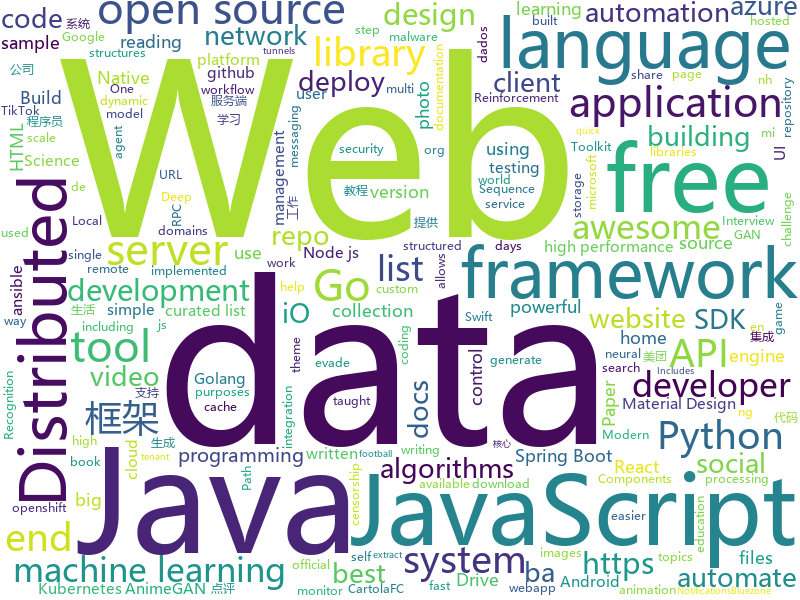

# 2020-08-11
See what the GitHub community is most excited about.

## python
+ [prefect](https://github.com/PrefectHQ/prefect)(**214 stars today**): The easiest way to automate your data
+ [IntelOwl](https://github.com/intelowlproject/IntelOwl)(**216 stars today**): Intel Owl: analyze files, domains, IPs in multiple ways from a single API at scale
+ [AnimeGANv2](https://github.com/TachibanaYoshino/AnimeGANv2)(**92 stars today**): [Open Source]. The improved version of AnimeGAN.
+ [malwoverview](https://github.com/alexandreborges/malwoverview)(**24 stars today**): Malwoverview is a first response tool to perform an initial and quick triage in a directory containing malware samples, specific malware sample, suspect URL and domains. Additionally, it allows to download and send samples to main online sandboxes.
+ [eat_pytorch_in_20_days](https://github.com/lyhue1991/eat_pytorch_in_20_days)(**127 stars today**): Pytorch🍊🍉is delicious, just eat it!😋😋
+ [TikTok-Shares-Botter](https://github.com/zoony1337/TikTok-Shares-Botter)(**57 stars today**): Adds TikTok Shares for you.
+ [InvoiceNet](https://github.com/naiveHobo/InvoiceNet)(**151 stars today**): Deep neural network to extract intelligent information from invoice documents.
+ [public-apis](https://github.com/public-apis/public-apis)(**341 stars today**): A collective list of free APIs for use in software and web development.
+ [chineseocr_lite](https://github.com/ouyanghuiyu/chineseocr_lite)(**30 stars today**): 超轻量级中文ocr，支持竖排文字识别, 支持ncnn推理 , dbnet(1.7M) + crnn(6.3M) + anglenet(1.5M) 总模型仅10M
+ [fairseq](https://github.com/pytorch/fairseq)(**14 stars today**): Facebook AI Research Sequence-to-Sequence Toolkit written in Python.
+ [geneva](https://github.com/Kkevsterrr/geneva)(**68 stars today**): automated censorship evasion for the client-side and server-side
+ [Summer2021-Internships](https://github.com/Pitt-CSC/Summer2021-Internships)(**37 stars today**): Collection of Summer 2021 tech internships!
+ [core](https://github.com/home-assistant/core)(**85 stars today**): 🏡Open source home automation that puts local control and privacy first
+ [nni](https://github.com/microsoft/nni)(**10 stars today**): An open source AutoML toolkit for automate machine learning lifecycle, including feature engineering, neural architecture search, model compression and hyper-parameter tuning.
+ [ansible](https://github.com/ansible/ansible)(**20 stars today**): Ansible is a radically simple IT automation platform that makes your applications and systems easier to deploy. Avoid writing scripts or custom code to deploy and update your applications — automate in a language that approaches plain English, using SSH, with no agents to install on remote systems. https://docs.ansible.com/ansible/
+ [cloudsplaining](https://github.com/salesforce/cloudsplaining)(**18 stars today**): Cloudsplaining is an AWS IAM Security Assessment tool that identifies violations of least privilege and generates a risk-prioritized report.
+ [seirsplus](https://github.com/ryansmcgee/seirsplus)(**5 stars today**): Models of SEIRS epidemic dynamics with extensions, including network-structured populations, testing, contact tracing, and social distancing.
+ [30-Days-Of-Python](https://github.com/Asabeneh/30-Days-Of-Python)(**16 stars today**): 30 days of Python programming challenge is a step by step guide to learn Python programming language in 30 days.
+ [PettingZoo](https://github.com/PettingZoo-Team/PettingZoo)(**72 stars today**): Gym for multi-agent reinforcement learning
+ [interactive-coding-challenges](https://github.com/donnemartin/interactive-coding-challenges)(**13 stars today**): 120+ interactive Python coding interview challenges (algorithms and data structures). Includes Anki flashcards.
+ [sherlock](https://github.com/sherlock-project/sherlock)(**23 stars today**): 🔎Hunt down social media accounts by username across social networks
+ [libra](https://github.com/Palashio/libra)(**17 stars today**): Ergonomic machine learning.
+ [AnimeGAN](https://github.com/TachibanaYoshino/AnimeGAN)(**31 stars today**): A Tensorflow implementation of AnimeGAN for fast photo animation ! This is the Open source of the paper <AnimeGAN: a novel lightweight GAN for photo animation>, which uses the GAN framwork to transform real-world photos into anime images.
+ [django](https://github.com/django/django)(**37 stars today**): The Web framework for perfectionists with deadlines.
+ [cheatsheets](https://github.com/matplotlib/cheatsheets)(**25 stars today**): Official Matplotlib cheat sheets

## java
+ [LeetCode](https://github.com/yuanguangxin/LeetCode)(**188 stars today**): LeetCode刷题记录
+ [react-native-push-notification](https://github.com/zo0r/react-native-push-notification)(**7 stars today**): React Native Local and Remote Notifications
+ [react-native-bluetooth-scan](https://github.com/BluezoneGlobal/react-native-bluetooth-scan)(**10 stars today**): Bluezone - Bảo vệ mình, bảo vệ cộng đồng
+ [Algorithms](https://github.com/williamfiset/Algorithms)(**20 stars today**): A collection of algorithms and data structures
+ [kafdrop](https://github.com/obsidiandynamics/kafdrop)(**16 stars today**): Kafka Web UI
+ [keycloak](https://github.com/keycloak/keycloak)(**13 stars today**): Open Source Identity and Access Management For Modern Applications and Services
+ [cat](https://github.com/dianping/cat)(**34 stars today**): CAT 作为服务端项目基础组件，提供了 Java, C/C++, Node.js, Python, Go 等多语言客户端，已经在美团点评的基础架构中间件框架（MVC框架，RPC框架，数据库框架，缓存框架等，消息队列，配置系统等）深度集成，为美团点评各业务线提供系统丰富的性能指标、健康状况、实时告警等。
+ [jdk](https://github.com/openjdk/jdk)(**25 stars today**): Read-only mirror of https://hg.openjdk.java.net/jdk/jdk
+ [cas](https://github.com/apereo/cas)(**9 stars today**): Apereo CAS - Enterprise Single Sign On for all earthlings and beyond.
+ [JavaGuide](https://github.com/Snailclimb/JavaGuide)(**101 stars today**): 「Java学习+面试指南」一份涵盖大部分Java程序员所需要掌握的核心知识。
+ [shardingsphere](https://github.com/apache/shardingsphere)(**15 stars today**): Distributed database middleware
+ [presto](https://github.com/prestodb/presto)(**6 stars today**): The official home of the Presto distributed SQL query engine for big data
+ [azure-sdk-for-java](https://github.com/Azure/azure-sdk-for-java)(**3 stars today**): This repository is for active development of the Azure SDK for Java. For consumers of the SDK we recommend visiting our public developer docs at https://docs.microsoft.com/en-us/java/azure/ or our versioned developer docs at https://azure.github.io/azure-sdk-for-java.
+ [spring-boot-examples](https://github.com/ityouknow/spring-boot-examples)(**19 stars today**): about learning Spring Boot via examples. Spring Boot 教程、技术栈示例代码，快速简单上手教程。
+ [MCinaBox](https://github.com/longjunyu2/MCinaBox)(**17 stars today**): MCinaBox - A Minecraft Java Edition Launcher on Android
+ [elasticsearch](https://github.com/elastic/elasticsearch)(**34 stars today**): Open Source, Distributed, RESTful Search Engine
+ [tech-interview-for-developer](https://github.com/gyoogle/tech-interview-for-developer)(**19 stars today**): 👶🏻 신입 개발자 전공 지식 & 기술 면접 백과사전📖
+ [aviator](https://github.com/killme2008/aviator)(**9 stars today**): A high performance scripting language hosted on the JVM.
+ [cve_2020_14644](https://github.com/potats0/cve_2020_14644)(**10 stars today**): 
+ [seata](https://github.com/seata/seata)(**18 stars today**): 🔥Seata is an easy-to-use, high-performance, open source distributed transaction solution.
+ [antlr4](https://github.com/antlr/antlr4)(**9 stars today**): ANTLR (ANother Tool for Language Recognition) is a powerful parser generator for reading, processing, executing, or translating structured text or binary files.
+ [micronaut-core](https://github.com/micronaut-projects/micronaut-core)(**5 stars today**): Micronaut Application Framework
+ [retrofit](https://github.com/square/retrofit)(**22 stars today**): A type-safe HTTP client for Android and the JVM
+ [rocketmq](https://github.com/apache/rocketmq)(**18 stars today**): Mirror of Apache RocketMQ
+ [camunda-bpm-platform](https://github.com/camunda/camunda-bpm-platform)(**3 stars today**): Flexible framework for workflow and decision automation with BPMN and DMN. Integration with Spring, Spring Boot, CDI.

## unknown
+ [archive-program](https://github.com/github/archive-program)(**582 stars today**): The GitHub Archive Program & Arctic Code Vault
+ [data-science](https://github.com/ossu/data-science)(**262 stars today**): 📊Path to a free self-taught education in Data Science!
+ [awesome-system-design](https://github.com/madd86/awesome-system-design)(**546 stars today**): A curated list of awesome System Design (A.K.A. Distributed Computing) resources.
+ [app-ideas](https://github.com/florinpop17/app-ideas)(**142 stars today**): A Collection of application ideas which can be used to improve your coding skills.
+ [build-your-own-x](https://github.com/danistefanovic/build-your-own-x)(**264 stars today**): 🤓Build your own (insert technology here)
+ [applied-ml](https://github.com/eugeneyan/applied-ml)(**96 stars today**): 📚Papers & articles of companies sharing their work on applied data science & machine learning.
+ [awesome-production-machine-learning](https://github.com/EthicalML/awesome-production-machine-learning)(**245 stars today**): A curated list of awesome open source libraries to deploy, monitor, version and scale your machine learning
+ [You-Dont-Know-JS](https://github.com/getify/You-Dont-Know-JS)(**89 stars today**): A book series on JavaScript. @YDKJS on twitter.
+ [Best-websites-a-programmer-should-visit](https://github.com/sdmg15/Best-websites-a-programmer-should-visit)(**265 stars today**): 🔗Some useful websites for programmers.
+ [computer-science](https://github.com/ossu/computer-science)(**43 stars today**): 🎓Path to a free self-taught education in Computer Science!
+ [The-NLP-Pandect](https://github.com/ivan-bilan/The-NLP-Pandect)(**68 stars today**): A comprehensive reference for all topics related to Natural Language Processing
+ [free-programming-books](https://github.com/EbookFoundation/free-programming-books)(**345 stars today**): 📚Freely available programming books
+ [Best-websites-a-programmer-should-visit-zh](https://github.com/tuteng/Best-websites-a-programmer-should-visit-zh)(**22 stars today**): 程序员应该访问的最佳网站中文版
+ [pumpkin-book](https://github.com/datawhalechina/pumpkin-book)(**33 stars today**): 《机器学习》（西瓜书）公式推导解析，在线阅读地址：https://datawhalechina.github.io/pumpkin-book
+ [spellbook-of-modern-webdev](https://github.com/dexteryy/spellbook-of-modern-webdev)(**43 stars today**): A Big Picture, Thesaurus, and Taxonomy of Modern JavaScript Web Development
+ [weekly](https://github.com/dt-fe/weekly)(**24 stars today**): 前端精读周刊
+ [EmotionLib](https://github.com/EmotionEngi/EmotionLib)(**14 stars today**): Simple dynamic library for video sentiment recognition
+ [Interview_Question_for_Beginner](https://github.com/JaeYeopHan/Interview_Question_for_Beginner)(**10 stars today**): 👦👧Technical-Interview guidelines written for those who started studying programming. I wish you all the best.👾
+ [955.WLB](https://github.com/formulahendry/955.WLB)(**272 stars today**): 955 不加班的公司名单 - 工作 955，work–life balance (工作与生活的平衡)
+ [Chengdu-IT-company-blacklist](https://github.com/Hootrix/Chengdu-IT-company-blacklist)(**18 stars today**): 成都IT公司黑名单
+ [benchmark_results](https://github.com/foolwood/benchmark_results)(**9 stars today**): Visual Tracking Paper List
+ [vagas](https://github.com/qa-brasil/vagas)(**6 stars today**): 🚀Divulgue facilmente e receba a vaga por completo no seu e-mail
+ [awesome](https://github.com/sindresorhus/awesome)(**92 stars today**): 😎Awesome lists about all kinds of interesting topics
+ [free-books](https://github.com/ruanyf/free-books)(**5 stars today**): 互联网上的免费书籍
+ [awesome-bigdata](https://github.com/onurakpolat/awesome-bigdata)(**14 stars today**): A curated list of awesome big data frameworks, ressources and other awesomeness.

## javascript
+ [heroicons](https://github.com/tailwindlabs/heroicons)(**556 stars today**): A set of free MIT-licensed high-quality SVG icons for UI development.
+ [javascript-algorithms](https://github.com/trekhleb/javascript-algorithms)(**314 stars today**): 📝Algorithms and data structures implemented in JavaScript with explanations and links to further readings
+ [nodebestpractices](https://github.com/goldbergyoni/nodebestpractices)(**110 stars today**): ✅The Node.js best practices list (August 2020)
+ [next.js](https://github.com/vercel/next.js)(**43 stars today**): The React Framework
+ [react-table](https://github.com/tannerlinsley/react-table)(**14 stars today**): ⚛️Hooks for building fast and extendable tables and datagrids for React
+ [bluezone-app](https://github.com/BluezoneGlobal/bluezone-app)(**52 stars today**): Bluezone - Bảo vệ mình, bảo vệ cộng đồng
+ [twitter-clone](https://github.com/CleverProgrammers/twitter-clone)(**31 stars today**): 
+ [nodejs-zoom-clone](https://github.com/CleverProgrammers/nodejs-zoom-clone)(**87 stars today**): 
+ [baiduwp](https://github.com/TkzcM/baiduwp)(**37 stars today**): PanDownload Web, built with CloudFlare Workers
+ [fullstack-course4](https://github.com/jhu-ep-coursera/fullstack-course4)(**14 stars today**): Example code for HTML, CSS, and Javascript for Web Developers Coursera Course
+ [Detox](https://github.com/wix/Detox)(**4 stars today**): Gray box end-to-end testing and automation framework for mobile apps
+ [pipedream](https://github.com/PipedreamHQ/pipedream)(**2 stars today**): Serverless integration and compute platform. Free for developers.
+ [elementor](https://github.com/elementor/elementor)(**6 stars today**): The most advanced frontend drag & drop page builder. Create high-end, pixel perfect websites at record speeds. Any theme, any page, any design.
+ [Awesome-Design-Tools](https://github.com/goabstract/Awesome-Design-Tools)(**47 stars today**): The best design tools and plugins for everything👉
+ [vue](https://github.com/vuejs/vue)(**132 stars today**): 🖖Vue.js is a progressive, incrementally-adoptable JavaScript framework for building UI on the web.
+ [react-spectrum](https://github.com/adobe/react-spectrum)(**36 stars today**): A collection of libraries and tools that help you build adaptive, accessible, and robust user experiences.
+ [ethsupply](https://github.com/madumas/ethsupply)(**8 stars today**): 
+ [Javascript](https://github.com/TheAlgorithms/Javascript)(**147 stars today**): A repository for All algorithms implemented in Javascript (for educational purposes only)
+ [react-native-calendars](https://github.com/wix/react-native-calendars)(**8 stars today**): React Native Calendar Components🗓️📆
+ [pwnagotchi](https://github.com/evilsocket/pwnagotchi)(**11 stars today**): (⌐■_■) - Deep Reinforcement Learning instrumenting bettercap for WiFi pwning.
+ [CodeceptJS](https://github.com/codeceptjs/CodeceptJS)(**2 stars today**): Supercharged End 2 End Testing Framework for NodeJS
+ [joi](https://github.com/sideway/joi)(**14 stars today**): The most powerful data validation library for JS
+ [Chart.js](https://github.com/chartjs/Chart.js)(**26 stars today**): Simple HTML5 Charts using the <canvas> tag
+ [material-ui](https://github.com/mui-org/material-ui)(**41 stars today**): React components for faster and easier web development. Build your own design system, or start with Material Design.
+ [javascript](https://github.com/airbnb/javascript)(**47 stars today**): JavaScript Style Guide

## html
+ [discord-bot-client](https://github.com/Flam3rboy/discord-bot-client)(**10 stars today**): A custom hosted discord website, with bot login support
+ [free-for-dev](https://github.com/ripienaar/free-for-dev)(**73 stars today**): A list of SaaS, PaaS and IaaS offerings that have free tiers of interest to devops and infradev
+ [zphisher](https://github.com/htr-tech/zphisher)(**7 stars today**): Automated Phishing Tool
+ [tidytuesday](https://github.com/rfordatascience/tidytuesday)(**5 stars today**): Official repo for the #tidytuesday project
+ [website](https://github.com/kubernetes/website)(**4 stars today**): Kubernetes website and documentation repo:
+ [tiktok-downloader-and-rehoster](https://github.com/antiops/tiktok-downloader-and-rehoster)(**34 stars today**): A simple webapp that allows users to easily download TikTok videos and share them as all videos are rehosted on our servers.
+ [caRtola](https://github.com/henriquepgomide/caRtola)(**2 stars today**): Extração de dados da API do CartolaFC, análise exploratória dos dados e modelos preditivos em R e Python - 2014-20. [EN] Data munging, analysis and modeling of CartolaFC - the most popular fantasy football game in Brazil and maybe in the world. Data cover years 2014-19.
+ [seldon-core](https://github.com/SeldonIO/seldon-core)(**3 stars today**): An MLOps framework to package, deploy, monitor and manage thousands of production machine learning models
+ [re0-web](https://github.com/lyy289065406/re0-web)(**3 stars today**): RE0：从零开始的异世界生活 （WEB版）
+ [html](https://github.com/whatwg/html)(**4 stars today**): HTML Standard
+ [hexo-theme-fluid](https://github.com/fluid-dev/hexo-theme-fluid)(**15 stars today**): 🌊一款 Material Design 风格的 Hexo 主题 / An elegant Material-Design theme for Hexo
+ [learning-area](https://github.com/mdn/learning-area)(**4 stars today**): Github repo for the MDN Learning Area.
+ [DetectionLab](https://github.com/clong/DetectionLab)(**6 stars today**): Automate the creation of a lab environment complete with security tooling and logging best practices
+ [covid19-forecast-hub](https://github.com/reichlab/covid19-forecast-hub)(**3 stars today**): Projections of COVID-19, in standardized format
+ [swagger-codegen](https://github.com/swagger-api/swagger-codegen)(**8 stars today**): swagger-codegen contains a template-driven engine to generate documentation, API clients and server stubs in different languages by parsing your OpenAPI / Swagger definition.
+ [home-assistant.io](https://github.com/home-assistant/home-assistant.io)(**2 stars today**): 📘Home Assistant User documentation
+ [coreui-free-bootstrap-admin-template](https://github.com/coreui/coreui-free-bootstrap-admin-template)(**4 stars today**): CoreUI is free bootstrap admin template
+ [openshift-docs](https://github.com/openshift/openshift-docs)(**0 stars today**): OpenShift 3 and 4 product and community documentation
+ [tabler](https://github.com/tabler/tabler)(**12 stars today**): Tabler is free and open-source HTML Dashboard UI Kit built on Bootstrap
+ [r-basic](https://github.com/joanby/r-basic)(**0 stars today**): Curso de introducción a la estadística descriptiva con R Studio
+ [machine-learning-systems-design](https://github.com/chiphuyen/machine-learning-systems-design)(**6 stars today**): A booklet on machine learning systems design with exercises
+ [webdevbootcamp](https://github.com/nax3t/webdevbootcamp)(**5 stars today**): All source code for back-end projects from the Web Developer Bootcamp
+ [bedrock](https://github.com/mozilla/bedrock)(**1 stars today**): Making mozilla.org awesome, one pebble at a time
+ [tiny-slider](https://github.com/ganlanyuan/tiny-slider)(**5 stars today**): Vanilla javascript slider for all purposes.
+ [prebid.github.io](https://github.com/prebid/prebid.github.io)(**0 stars today**): Repo that controls Prebid.org website

## go
+ [Noctilucent](https://github.com/SixGenInc/Noctilucent)(**93 stars today**): Using TLS 1.3 to evade censors, bypass network defenses, and blend in with the noise
+ [rancher](https://github.com/rancher/rancher)(**16 stars today**): Complete container management platform
+ [kubebuilder](https://github.com/kubernetes-sigs/kubebuilder)(**7 stars today**): Kubebuilder - SDK for building Kubernetes APIs using CRDs
+ [go-zero](https://github.com/tal-tech/go-zero)(**29 stars today**): go-zero是一个集成了各种工程实践的web和rpc框架。通过弹性设计保障了大并发服务端的稳定性，经受了充分的实战检验。包含极简的API定义和生成工具，可以一键生成Go, iOS, Android, Dart, TypeScript, JavaScript代码，并可直接运行。
+ [excelize](https://github.com/360EntSecGroup-Skylar/excelize)(**67 stars today**): Golang library for reading and writing Microsoft Excel™ (XLSX) files.
+ [nats-server](https://github.com/nats-io/nats-server)(**11 stars today**): High-Performance server for NATS, the cloud native messaging system.
+ [argo](https://github.com/argoproj/argo)(**15 stars today**): Argo Workflows: Get stuff done with Kubernetes.
+ [livego](https://github.com/gwuhaolin/livego)(**41 stars today**): live video streaming server in golang
+ [GolangTraining](https://github.com/GoesToEleven/GolangTraining)(**23 stars today**): Training for Golang (go language)
+ [chainlink](https://github.com/smartcontractkit/chainlink)(**8 stars today**): node of the decentralized oracle network, bridging on and off-chain computation
+ [istio](https://github.com/istio/istio)(**22 stars today**): Connect, secure, control, and observe services.
+ [olric](https://github.com/buraksezer/olric)(**484 stars today**): Distributed cache and in-memory key/value data store. It can be used both as an embedded Go library and as a language-independent service.
+ [groupcache](https://github.com/golang/groupcache)(**25 stars today**): groupcache is a caching and cache-filling library, intended as a replacement for memcached in many cases.
+ [rclone](https://github.com/rclone/rclone)(**18 stars today**): "rsync for cloud storage" - Google Drive, Amazon Drive, S3, Dropbox, Backblaze B2, One Drive, Swift, Hubic, Cloudfiles, Google Cloud Storage, Yandex Files
+ [velero](https://github.com/vmware-tanzu/velero)(**4 stars today**): Backup and migrate Kubernetes applications and their persistent volumes
+ [Cloak](https://github.com/cbeuw/Cloak)(**10 stars today**): A censorship circumvention tool to evade detection against state adversaries
+ [cortex](https://github.com/cortexproject/cortex)(**11 stars today**): A horizontally scalable, highly available, multi-tenant, long term Prometheus.
+ [mux](https://github.com/gorilla/mux)(**15 stars today**): A powerful HTTP router and URL matcher for building Go web servers with🦍
+ [chat](https://github.com/tinode/chat)(**5 stars today**): Instant messaging platform. Backend in Go. Clients: Swift iOS, Java Android, JS webapp, scriptable command line; chatbots
+ [ngrok](https://github.com/inconshreveable/ngrok)(**11 stars today**): Introspected tunnels to localhost
+ [migrate](https://github.com/golang-migrate/migrate)(**7 stars today**): Database migrations. CLI and Golang library.
+ [nvm-windows](https://github.com/coreybutler/nvm-windows)(**18 stars today**): A node.js version management utility for Windows. Ironically written in Go.
+ [origin](https://github.com/openshift/origin)(**4 stars today**): Images for OpenShift 3 and 4 - see openshift/okd for more
+ [chaosmonkey](https://github.com/Netflix/chaosmonkey)(**14 stars today**): Chaos Monkey is a resiliency tool that helps applications tolerate random instance failures.
+ [nakama](https://github.com/heroiclabs/nakama)(**5 stars today**): Distributed server for social and realtime games and apps.

## WordCloud

