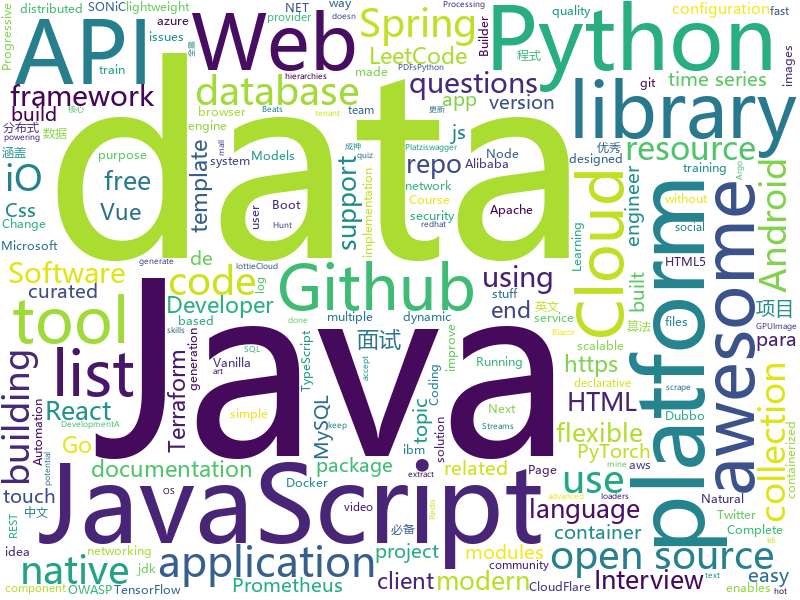

# 2020-08-13
See what the GitHub community is most excited about.

## python
+ [prefect](https://github.com/PrefectHQ/prefect)(**258 stars today**): The easiest way to automate your data
+ [sherlock](https://github.com/sherlock-project/sherlock)(**113 stars today**): 🔎Hunt down social media accounts by username across social networks
+ [jupyter-book](https://github.com/executablebooks/jupyter-book)(**86 stars today**): Build interactive, publication-quality documents from Jupyter Notebooks
+ [mmdetection3d](https://github.com/open-mmlab/mmdetection3d)(**30 stars today**): OpenMMLab's next-generation platform for general 3D object detection.
+ [workshops](https://github.com/ansible/workshops)(**2 stars today**): Training Course for Ansible Automation Platform
+ [transformers](https://github.com/huggingface/transformers)(**76 stars today**): 🤗Transformers: State-of-the-art Natural Language Processing for Pytorch and TensorFlow 2.0.
+ [camelot](https://github.com/camelot-dev/camelot)(**19 stars today**): A Python library to extract tabular data from PDFs
+ [magic-python](https://github.com/iswbm/magic-python)(**71 stars today**): Python 黑魔法手册
+ [pyinstaller](https://github.com/pyinstaller/pyinstaller)(**15 stars today**): Freeze (package) Python programs into stand-alone executables
+ [tfx](https://github.com/tensorflow/tfx)(**3 stars today**): TFX is an end-to-end platform for deploying production ML pipelines
+ [python-telegram-bot](https://github.com/python-telegram-bot/python-telegram-bot)(**16 stars today**): We have made you a wrapper you can't refuse
+ [bert](https://github.com/google-research/bert)(**25 stars today**): TensorFlow code and pre-trained models for BERT
+ [spack](https://github.com/spack/spack)(**5 stars today**): A flexible package manager that supports multiple versions, configurations, platforms, and compilers.
+ [horovod](https://github.com/horovod/horovod)(**5 stars today**): Distributed training framework for TensorFlow, Keras, PyTorch, and Apache MXNet.
+ [models](https://github.com/tensorflow/models)(**21 stars today**): Models and examples built with TensorFlow
+ [OneForAll](https://github.com/shmilylty/OneForAll)(**12 stars today**): OneForAll是一款功能强大的子域收集工具
+ [AnimeGANv2](https://github.com/TachibanaYoshino/AnimeGANv2)(**111 stars today**): [Open Source]. The improved version of AnimeGAN.
+ [sentence-transformers](https://github.com/UKPLab/sentence-transformers)(**7 stars today**): Sentence Embeddings with BERT & XLNet
+ [elasticsearch-py](https://github.com/elastic/elasticsearch-py)(**1 stars today**): Official Python low-level client for Elasticsearch
+ [IntelOwl](https://github.com/intelowlproject/IntelOwl)(**116 stars today**): Intel Owl: analyze files, domains, IPs in multiple ways from a single API at scale
+ [dbt](https://github.com/fishtown-analytics/dbt)(**5 stars today**): dbt (data build tool) enables data analysts and engineers to transform their data using the same practices that software engineers use to build applications.
+ [fast-reid](https://github.com/JDAI-CV/fast-reid)(**12 stars today**): SOTA ReID Methods and Toolbox
+ [twint](https://github.com/twintproject/twint)(**15 stars today**): An advanced Twitter scraping & OSINT tool written in Python that doesn't use Twitter's API, allowing you to scrape a user's followers, following, Tweets and more while evading most API limitations.
+ [PySyft](https://github.com/OpenMined/PySyft)(**1 stars today**): A library for answering questions using data you cannot see
+ [eat_tensorflow2_in_30_days](https://github.com/lyhue1991/eat_tensorflow2_in_30_days)(**14 stars today**): Tensorflow2.0🍎🍊is delicious, just eat it!😋😋

## java
+ [KOOM](https://github.com/KwaiAppTeam/KOOM)(**147 stars today**): KOOM is an OOM killer on mobile platform by Kwai.
+ [SpringBoot-Labs](https://github.com/YunaiV/SpringBoot-Labs)(**66 stars today**): 一个涵盖六个专栏：Spring Boot 2.X、Spring Cloud、Spring Cloud Alibaba、Dubbo、分布式消息队列、分布式事务的仓库。希望胖友小手一抖，右上角来个 Star，感恩 1024
+ [LeetCode](https://github.com/yuanguangxin/LeetCode)(**535 stars today**): LeetCode刷题记录
+ [GitHub-Chinese-Top-Charts](https://github.com/kon9chunkit/GitHub-Chinese-Top-Charts)(**55 stars today**): 🇨🇳GitHub中文排行榜，帮助你发现高分优秀中文项目、更高效地吸收国人的优秀经验成果；榜单每周更新一次，敬请关注！
+ [JavaGuide](https://github.com/Snailclimb/JavaGuide)(**128 stars today**): 「Java学习+面试指南」一份涵盖大部分Java程序员所需要掌握的核心知识。
+ [jib](https://github.com/GoogleContainerTools/jib)(**10 stars today**): 🏗Build container images for your Java applications.
+ [debezium](https://github.com/debezium/debezium)(**8 stars today**): Change data capture for a variety of databases. Please log issues at https://issues.redhat.com/browse/DBZ.
+ [QR-Code-generator](https://github.com/nayuki/QR-Code-generator)(**9 stars today**): High-quality QR Code generator library in Java, TypeScript/JavaScript, Python, C++, C, Rust.
+ [selenium](https://github.com/SeleniumHQ/selenium)(**12 stars today**): A browser automation framework and ecosystem.
+ [nacos](https://github.com/alibaba/nacos)(**21 stars today**): an easy-to-use dynamic service discovery, configuration and service management platform for building cloud native applications.
+ [react-native-camera](https://github.com/react-native-community/react-native-camera)(**7 stars today**): A Camera component for React Native. Also supports barcode scanning!
+ [hutool](https://github.com/looly/hutool)(**115 stars today**): A set of tools that keep Java sweet.
+ [android-interview-questions](https://github.com/MindorksOpenSource/android-interview-questions)(**7 stars today**): Your Cheat Sheet For Android Interview - Android Interview Questions
+ [grpc-java](https://github.com/grpc/grpc-java)(**3 stars today**): The Java gRPC implementation. HTTP/2 based RPC
+ [tutorials](https://github.com/eugenp/tutorials)(**11 stars today**): Just Announced - "Learn Spring Security OAuth":
+ [LeetCodeAnimation](https://github.com/MisterBooo/LeetCodeAnimation)(**40 stars today**): Demonstrate all the questions on LeetCode in the form of animation.（用动画的形式呈现解LeetCode题目的思路）
+ [android-gpuimage](https://github.com/cats-oss/android-gpuimage)(**3 stars today**): Android filters based on OpenGL (idea from GPUImage for iOS)
+ [onemall](https://github.com/YunaiV/onemall)(**24 stars today**): 芋道 mall 商城，基于微服务的思想，构建在 B2C 电商场景下的项目实战。核心技术栈，是 Spring Boot + Dubbo 。未来，会重构成 Spring Cloud Alibaba 。
+ [tinker](https://github.com/Tencent/tinker)(**5 stars today**): Tinker is a hot-fix solution library for Android, it supports dex, library and resources update without reinstall apk.
+ [hbase](https://github.com/apache/hbase)(**3 stars today**): Apache HBase
+ [capacitor](https://github.com/ionic-team/capacitor)(**9 stars today**): Build cross-platform Native Progressive Web Apps for iOS, Android, and the Web⚡️
+ [questdb](https://github.com/questdb/questdb)(**23 stars today**): An open source SQL database designed to process time series data, faster
+ [serve](https://github.com/pytorch/serve)(**6 stars today**): Model Serving on PyTorch
+ [CS-Notes](https://github.com/CyC2018/CS-Notes)(**89 stars today**): 📚技术面试必备基础知识、Leetcode、计算机操作系统、计算机网络、系统设计、Java、Python、C++
+ [jdk](https://github.com/openjdk/jdk)(**27 stars today**): Read-only mirror of https://hg.openjdk.java.net/jdk/jdk

## unknown
+ [fucking-algorithm](https://github.com/labuladong/fucking-algorithm)(**468 stars today**): 刷算法全靠套路，认准 labuladong 就够了！English version supported! Crack LeetCode, not only how, but also why.
+ [app-ideas](https://github.com/florinpop17/app-ideas)(**227 stars today**): A Collection of application ideas which can be used to improve your coding skills.
+ [gdshare](https://github.com/iwestlin/gdshare)(**29 stars today**): 
+ [data-science](https://github.com/ossu/data-science)(**216 stars today**): 📊Path to a free self-taught education in Data Science!
+ [awesome-java](https://github.com/Snailclimb/awesome-java)(**46 stars today**): Collection of awesome Java project on Github(Github 上非常棒的 Java 开源项目集合).
+ [The-NLP-Pandect](https://github.com/ivan-bilan/The-NLP-Pandect)(**66 stars today**): A comprehensive reference for all topics related to Natural Language Processing
+ [machine-learning-for-software-engineers](https://github.com/ZuzooVn/machine-learning-for-software-engineers)(**9 stars today**): A complete daily plan for studying to become a machine learning engineer.
+ [IOS13-SimulateTouch](https://github.com/xuan32546/IOS13-SimulateTouch)(**47 stars today**): iOS13 touch simulation Simulate Touch iOS touch event
+ [awesome-for-beginners](https://github.com/MunGell/awesome-for-beginners)(**40 stars today**): A list of awesome beginners-friendly projects.
+ [awesome-laravel](https://github.com/chiraggude/awesome-laravel)(**10 stars today**): A curated list of bookmarks, packages, tutorials, videos and other cool resources from the Laravel ecosystem
+ [Pentest-Tools](https://github.com/S3cur3Th1sSh1t/Pentest-Tools)(**10 stars today**): 
+ [EmotionLib](https://github.com/EmotionEngi/EmotionLib)(**66 stars today**): Simple dynamic library for video sentiment recognition
+ [Awesome-Red-Teaming](https://github.com/yeyintminthuhtut/Awesome-Red-Teaming)(**23 stars today**): List of Awesome Red Teaming Resources
+ [PoC-in-GitHub](https://github.com/nomi-sec/PoC-in-GitHub)(**29 stars today**): 📡PoC auto collect from GitHub.
+ [NewGrad-2021](https://github.com/Pitt-CSC/NewGrad-2021)(**27 stars today**): A collection of New Grad full time roles in SWE, Quant, and PM.
+ [vagas](https://github.com/backend-br/vagas)(**10 stars today**): ✌️Espaço para divulgação de vagas para backenders
+ [awesome](https://github.com/sindresorhus/awesome)(**79 stars today**): 😎Awesome lists about all kinds of interesting topics
+ [God-Of-BigData](https://github.com/wangzhiwubigdata/God-Of-BigData)(**41 stars today**): 大数据面试题，大数据成神之路开启...Flink/Spark/Hadoop/Hbase/Hive...
+ [awesome-interview-questions](https://github.com/MaximAbramchuck/awesome-interview-questions)(**15 stars today**): A curated awesome list of lists of interview questions. Feel free to contribute!🎓
+ [SS-Rule-Snippet](https://github.com/Hackl0us/SS-Rule-Snippet)(**7 stars today**): 搜集、整理、维护 Surge / Quantumult / Shadowrocket / Surfboard / clash(X) 实用规则。
+ [Python-programming-exercises](https://github.com/zhiwehu/Python-programming-exercises)(**14 stars today**): 100+ Python challenging programming exercises
+ [awesome-blazor](https://github.com/AdrienTorris/awesome-blazor)(**12 stars today**): Resources for Blazor, a .NET web framework using C#/Razor and HTML that runs in the browser with WebAssembly.
+ [binance-official-api-docs](https://github.com/binance-exchange/binance-official-api-docs)(**3 stars today**): Official Documentation for the Binance APIs and Streams
+ [English-for-Programmers](https://github.com/EngTW/English-for-Programmers)(**28 stars today**): 《程式英文》：用英文提昇程式可讀性
+ [api-guidelines](https://github.com/microsoft/api-guidelines)(**20 stars today**): Microsoft REST API Guidelines

## javascript
+ [clean-code-javascript](https://github.com/ryanmcdermott/clean-code-javascript)(**109 stars today**): 🛁Clean Code concepts adapted for JavaScript
+ [react](https://github.com/facebook/react)(**100 stars today**): A declarative, efficient, and flexible JavaScript library for building user interfaces.
+ [pdf.js](https://github.com/mozilla/pdf.js)(**20 stars today**): PDF Reader in JavaScript
+ [javascript-algorithms](https://github.com/trekhleb/javascript-algorithms)(**246 stars today**): 📝Algorithms and data structures implemented in JavaScript with explanations and links to further readings
+ [baiduwp](https://github.com/TkzcM/baiduwp)(**55 stars today**): PanDownload Web, built with CloudFlare Workers
+ [Chart.js](https://github.com/chartjs/Chart.js)(**20 stars today**): Simple HTML5 Charts using the <canvas> tag
+ [next.js](https://github.com/vercel/next.js)(**36 stars today**): The React Framework
+ [curso-javascript-ninja](https://github.com/da2k/curso-javascript-ninja)(**3 stars today**): Curso Javascript Ninja
+ [tailwindcss.com](https://github.com/tailwindlabs/tailwindcss.com)(**8 stars today**): 
+ [plyr](https://github.com/sampotts/plyr)(**12 stars today**): A simple HTML5, YouTube and Vimeo player
+ [gatsby](https://github.com/gatsbyjs/gatsby)(**21 stars today**): Build blazing fast, modern apps and websites with React
+ [webpack](https://github.com/webpack/webpack)(**17 stars today**): A bundler for javascript and friends. Packs many modules into a few bundled assets. Code Splitting allows for loading parts of the application on demand. Through "loaders", modules can be CommonJs, AMD, ES6 modules, CSS, Images, JSON, Coffeescript, LESS, ... and your custom stuff.
+ [react-sortable-tree](https://github.com/frontend-collective/react-sortable-tree)(**37 stars today**): Drag-and-drop sortable component for nested data and hierarchies
+ [masterPortfolio](https://github.com/ashutosh1919/masterPortfolio)(**14 stars today**): 🔥The Complete Customizable Software Developer Portfolio Template which lets you showcase your work and provides each and every detail about you as Software Developer.
+ [csgo_bugs](https://github.com/kkthxbye-code/csgo_bugs)(**9 stars today**): Random CSGO stuff
+ [PNU_3983](https://github.com/AliRazavi-edu/PNU_3983)(**25 stars today**): Summer Semester Courses 1399/2020
+ [in-quiz-questions](https://github.com/Ebazhanov/in-quiz-questions)(**5 stars today**): Skill Linkedin quiz (Assessment) answers and questions (aws-lambda, rest-api, javascript, react, git, html, jquery, maven, mongodb, xml, java, css, python ...) ответы на квиз
+ [grapesjs](https://github.com/artf/grapesjs)(**13 stars today**): Free and Open source Web Builder Framework. Next generation tool for building templates without coding
+ [mermaid](https://github.com/mermaid-js/mermaid)(**19 stars today**): Generation of diagram and flowchart from text in a similar manner as markdown
+ [create-react-app](https://github.com/facebook/create-react-app)(**44 stars today**): Set up a modern web app by running one command.
+ [website](https://github.com/CodingTrain/website)(**8 stars today**): The train engine powering the Coding Train website
+ [faker.js](https://github.com/Marak/faker.js)(**17 stars today**): generate massive amounts of realistic fake data in Node.js and the browser
+ [knex](https://github.com/knex/knex)(**14 stars today**): A query builder for PostgreSQL, MySQL and SQLite3, designed to be flexible, portable, and fun to use.
+ [vue](https://github.com/vuejs/vue)(**104 stars today**): 🖖Vue.js is a progressive, incrementally-adoptable JavaScript framework for building UI on the web.
+ [FE-Interview](https://github.com/lgwebdream/FE-Interview)(**12 stars today**): 前端面试必备题库，1000+面试真题，Html、Css、JavaScript、Vue、React、Node、TypeScript、Webpack、算法、网络与安全、浏览器

## html
+ [awesome-compose](https://github.com/docker/awesome-compose)(**12 stars today**): Awesome Docker Compose samples
+ [learning-area](https://github.com/mdn/learning-area)(**4 stars today**): Github repo for the MDN Learning Area.
+ [JavaScript30](https://github.com/wesbos/JavaScript30)(**15 stars today**): 30 Day Vanilla JS Challenge
+ [tidytuesday](https://github.com/rfordatascience/tidytuesday)(**5 stars today**): Official repo for the #tidytuesday project
+ [Cerberus](https://github.com/TedGoas/Cerberus)(**3 stars today**): A few simple, but solid patterns for responsive HTML email templates and newsletters. Even in Outlook and Gmail.
+ [awesome-piracy](https://github.com/Igglybuff/awesome-piracy)(**8 stars today**): A curated list of awesome warez and piracy links
+ [html](https://github.com/whatwg/html)(**3 stars today**): HTML Standard
+ [msteams-docs](https://github.com/MicrosoftDocs/msteams-docs)(**0 stars today**): Source for the Microsoft Teams developer platform documentation.
+ [tiny-slider](https://github.com/ganlanyuan/tiny-slider)(**5 stars today**): Vanilla javascript slider for all purposes.
+ [Front-end-Developer-Interview-Questions](https://github.com/h5bp/Front-end-Developer-Interview-Questions)(**26 stars today**): A list of helpful front-end related questions you can use to interview potential candidates, test yourself or completely ignore.
+ [embeddedsw](https://github.com/Xilinx/embeddedsw)(**0 stars today**): Xilinx Embedded Software (embeddedsw) Development
+ [awesome-modern-cpp](https://github.com/rigtorp/awesome-modern-cpp)(**4 stars today**): A collection of resources on modern C++
+ [www-community](https://github.com/OWASP/www-community)(**3 stars today**): OWASP Community Pages are a place where OWASP can accept community contributions for security-related content.
+ [blog_os](https://github.com/phil-opp/blog_os)(**13 stars today**): Writing an OS in Rust
+ [v-calendar](https://github.com/nathanreyes/v-calendar)(**7 stars today**): A lightweight, dependency-free plugin for building attributed calendars in Vue.js
+ [GDIndex](https://github.com/maple3142/GDIndex)(**5 stars today**): A Google Drive Index built with Vue Running on CloudFlare Workers
+ [webdevbootcamp](https://github.com/nax3t/webdevbootcamp)(**1 stars today**): All source code for back-end projects from the Web Developer Bootcamp
+ [hyperblog](https://github.com/freddier/hyperblog)(**12 stars today**): Un blog increíble para el curso de Git y Github de Platzi
+ [swagger-codegen](https://github.com/swagger-api/swagger-codegen)(**5 stars today**): swagger-codegen contains a template-driven engine to generate documentation, API clients and server stubs in different languages by parsing your OpenAPI / Swagger definition.
+ [ecom_steps](https://github.com/divanov11/ecom_steps)(**0 stars today**): 
+ [SONiC](https://github.com/Azure/SONiC)(**1 stars today**): Landing page for Software for Open Networking in the Cloud (SONiC) - http://azure.github.io/SONiC/
+ [lottie](https://github.com/airbnb/lottie)(**5 stars today**): Lottie documentation for http://airbnb.io/lottie
+ [calico](https://github.com/projectcalico/calico)(**4 stars today**): Cloud native networking and network security
+ [docker.github.io](https://github.com/docker/docker.github.io)(**4 stars today**): Source repo for Docker's Documentation
+ [Adapt-Solutions](https://github.com/iamsomraj/Adapt-Solutions)(**1 stars today**): This is a repository, containing the solutions of Adapt. I have made this repo for only educational purpose of mine.

## go
+ [go-github](https://github.com/google/go-github)(**7 stars today**): Go library for accessing the GitHub API
+ [eventnative](https://github.com/ksensehq/eventnative)(**103 stars today**): EventNative is an open-source data collection framework
+ [alertmanager](https://github.com/prometheus/alertmanager)(**2 stars today**): Prometheus Alertmanager
+ [chainlink](https://github.com/smartcontractkit/chainlink)(**13 stars today**): node of the decentralized oracle network, bridging on and off-chain computation
+ [tidb](https://github.com/pingcap/tidb)(**21 stars today**): TiDB is an open source distributed HTAP database compatible with the MySQL protocol
+ [traefik](https://github.com/containous/traefik)(**24 stars today**): The Cloud Native Edge Router
+ [k6](https://github.com/loadimpact/k6)(**8 stars today**): A modern load testing tool, using Go and JavaScript - https://k6.io
+ [singularity](https://github.com/hpcng/singularity)(**3 stars today**): Singularity: Application containers for Linux
+ [terraform-provider-aws](https://github.com/terraform-providers/terraform-provider-aws)(**5 stars today**): Terraform AWS provider
+ [terraform](https://github.com/hashicorp/terraform)(**24 stars today**): Terraform enables you to safely and predictably create, change, and improve infrastructure. It is an open source tool that codifies APIs into declarative configuration files that can be shared amongst team members, treated as code, edited, reviewed, and versioned.
+ [redis](https://github.com/go-redis/redis)(**11 stars today**): Type-safe Redis client for Golang
+ [podman](https://github.com/containers/podman)(**9 stars today**): Podman: A tool for managing OCI containers and pods
+ [vitess](https://github.com/vitessio/vitess)(**5 stars today**): Vitess is a database clustering system for horizontal scaling of MySQL.
+ [argo](https://github.com/argoproj/argo)(**10 stars today**): Argo Workflows: Get stuff done with Kubernetes.
+ [terraform-provider-ibm](https://github.com/IBM-Cloud/terraform-provider-ibm)(**0 stars today**): Terraform IBM provider https://cloud.ibm.com/docs/terraform?topic=terraform-tf-provider
+ [nomad](https://github.com/hashicorp/nomad)(**5 stars today**): Nomad is an easy-to-use, flexible, and performant workload orchestrator that can deploy a mix of microservice, batch, containerized, and non-containerized applications. Nomad is easy to operate and scale and has native Consul and Vault integrations.
+ [yaml](https://github.com/go-yaml/yaml)(**6 stars today**): YAML support for the Go language.
+ [beats](https://github.com/elastic/beats)(**7 stars today**): 🐠Beats - Lightweight shippers for Elasticsearch & Logstash
+ [elastic](https://github.com/olivere/elastic)(**4 stars today**): Elasticsearch client for Go.
+ [loki](https://github.com/grafana/loki)(**5 stars today**): Like Prometheus, but for logs.
+ [prometheus](https://github.com/prometheus/prometheus)(**26 stars today**): The Prometheus monitoring system and time series database.
+ [cortex](https://github.com/cortexproject/cortex)(**3 stars today**): A horizontally scalable, highly available, multi-tenant, long term Prometheus.
+ [terraform-provider-azurerm](https://github.com/terraform-providers/terraform-provider-azurerm)(**5 stars today**): Terraform provider for Azure Resource Manager
+ [go-swagger](https://github.com/go-swagger/go-swagger)(**7 stars today**): Swagger 2.0 implementation for go
+ [VictoriaMetrics](https://github.com/VictoriaMetrics/VictoriaMetrics)(**10 stars today**): VictoriaMetrics - fast, cost-effective and scalable time series database

## WordCloud

