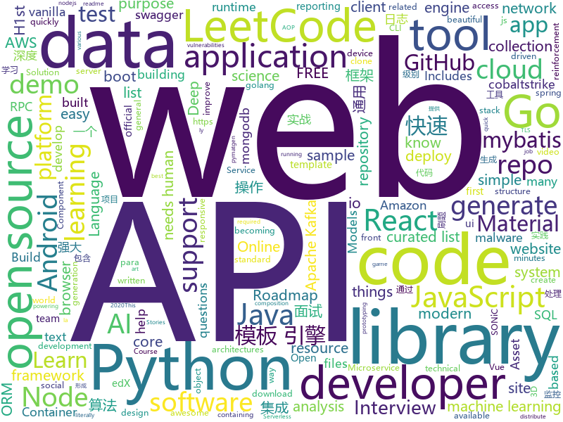

# 2020-08-18
See what the GitHub community is most excited about.

## python
+ [libra](https://github.com/Palashio/libra)(**110 stars today**): Ergonomic machine learning.
+ [image-gpt](https://github.com/openai/image-gpt)(**10 stars today**): 
+ [latexify_py](https://github.com/odashi/latexify_py)(**46 stars today**): Generates LaTeX math description from Python functions.
+ [edx-platform](https://github.com/edx/edx-platform)(**4 stars today**): The Open edX platform, the software that powers edX!
+ [sherlock](https://github.com/sherlock-project/sherlock)(**304 stars today**): 🔎Hunt down social media accounts by username across social networks
+ [data-science-ipython-notebooks](https://github.com/donnemartin/data-science-ipython-notebooks)(**17 stars today**): Data science Python notebooks: Deep learning (TensorFlow, Theano, Caffe, Keras), scikit-learn, Kaggle, big data (Spark, Hadoop MapReduce, HDFS), matplotlib, pandas, NumPy, SciPy, Python essentials, AWS, and various command lines.
+ [system-design-primer](https://github.com/donnemartin/system-design-primer)(**88 stars today**): Learn how to design large-scale systems. Prep for the system design interview. Includes Anki flashcards.
+ [PyGithub](https://github.com/PyGithub/PyGithub)(**3 stars today**): Typed interactions with the GitHub API v3
+ [doccano](https://github.com/doccano/doccano)(**9 stars today**): Open source text annotation tool for machine learning practitioner.
+ [data-scientist-roadmap](https://github.com/MrMimic/data-scientist-roadmap)(**39 stars today**): Toturial coming with "data science roadmap" graphe.
+ [h1st](https://github.com/h1st-ai/h1st)(**64 stars today**): Get a FREE premium T-shirt and celebrate the launch of H1st AI!🎉https://bit.ly/free-tshirt-for-h1st — H1st AI solves three critical challenges in real-world data science:☑️Can‘t Start: Industrial AI needs human insight.☑️Can‘t Profit: DS needs human tools.☑️Can‘t Deploy: AI needs human trust.
+ [Hitomi-Downloader](https://github.com/KurtBestor/Hitomi-Downloader)(**23 stars today**): 🍰Desktop application to download images/videos/music/text from Hitomi.la and other sites, and more.
+ [spinningup](https://github.com/openai/spinningup)(**19 stars today**): An educational resource to help anyone learn deep reinforcement learning.
+ [sentry](https://github.com/getsentry/sentry)(**14 stars today**): Sentry is cross-platform application monitoring, with a focus on error reporting.
+ [diagrams](https://github.com/mingrammer/diagrams)(**14 stars today**): 🎨Diagram as Code for prototyping cloud system architectures
+ [localstack](https://github.com/localstack/localstack)(**31 stars today**): 💻A fully functional local AWS cloud stack. Develop and test your cloud & Serverless apps offline!
+ [gym](https://github.com/openai/gym)(**21 stars today**): A toolkit for developing and comparing reinforcement learning algorithms.
+ [malwoverview](https://github.com/alexandreborges/malwoverview)(**38 stars today**): Malwoverview is a first response tool to perform an initial and quick triage in a directory containing malware samples, specific malware sample, suspect URL and domains. Additionally, it allows to download and send samples to main online sandboxes.
+ [flair](https://github.com/flairNLP/flair)(**11 stars today**): A very simple framework for state-of-the-art Natural Language Processing (NLP)
+ [practical-python](https://github.com/dabeaz-course/practical-python)(**4 stars today**): Practical Python Programming (course by @dabeaz)
+ [yanderifier](https://github.com/dunnousername/yanderifier)(**22 stars today**): completely setup environment with GUI for first-order-motion deepfakes (this repo serves as an easy way to distribute these files to non-technical users, rather than as an exercise in the "right way of doing things.")
+ [community.general](https://github.com/ansible-collections/community.general)(**3 stars today**): 
+ [detectron2](https://github.com/facebookresearch/detectron2)(**29 stars today**): Detectron2 is FAIR's next-generation platform for object detection and segmentation.
+ [great_expectations](https://github.com/great-expectations/great_expectations)(**4 stars today**): Always know what to expect from your data.
+ [pymatgen](https://github.com/materialsproject/pymatgen)(**0 stars today**): Python Materials Genomics (pymatgen) is a robust materials analysis code that defines core object representations for structures and molecules with support for many electronic structure codes. It is currently the core analysis code powering the Materials Project.

## java
+ [LeetCodeAnimation](https://github.com/MisterBooo/LeetCodeAnimation)(**88 stars today**): Demonstrate all the questions on LeetCode in the form of animation.（用动画的形式呈现解LeetCode题目的思路）
+ [pentaho-kettle](https://github.com/pentaho/pentaho-kettle)(**10 stars today**): Pentaho Data Integration ( ETL ) a.k.a Kettle
+ [interviews](https://github.com/kdn251/interviews)(**31 stars today**): Everything you need to know to get the job.
+ [karate](https://github.com/intuit/karate)(**119 stars today**): Test Automation Made Simple
+ [mockito](https://github.com/mockito/mockito)(**6 stars today**): Most popular Mocking framework for unit tests written in Java
+ [lithium-fabric](https://github.com/jellysquid3/lithium-fabric)(**8 stars today**): A Fabric mod designed to improve the general performance of Minecraft without breaking things
+ [java](https://github.com/kubernetes-client/java)(**5 stars today**): Official Java client library for kubernetes
+ [kafka-streams-examples](https://github.com/confluentinc/kafka-streams-examples)(**3 stars today**): Demo applications and code examples for Apache Kafka's Streams API.
+ [strimzi-kafka-operator](https://github.com/strimzi/strimzi-kafka-operator)(**3 stars today**): Apache Kafka running on Kubernetes
+ [zaproxy](https://github.com/zaproxy/zaproxy)(**6 stars today**): The OWASP ZAP core project
+ [XposedInstaller](https://github.com/rovo89/XposedInstaller)(**2 stars today**): 
+ [DependencyCheck](https://github.com/jeremylong/DependencyCheck)(**2 stars today**): OWASP dependency-check is a software composition analysis utility that detects publicly disclosed vulnerabilities in application dependencies.
+ [tutorials](https://github.com/eugenp/tutorials)(**19 stars today**): Just Announced - "Learn Spring Security OAuth":
+ [instagrabber](https://github.com/austinhuang0131/instagrabber)(**9 stars today**): An open-source alternative for the Instagram app on Android. Originally by @AwaisKing.
+ [canal](https://github.com/alibaba/canal)(**30 stars today**): 阿里巴巴 MySQL binlog 增量订阅&消费组件
+ [grpc-java](https://github.com/grpc/grpc-java)(**6 stars today**): The Java gRPC implementation. HTTP/2 based RPC
+ [newbee-mall-api](https://github.com/newbee-ltd/newbee-mall-api)(**5 stars today**): 新蜂商城前后端分离版本-后端API源码
+ [easyexcel](https://github.com/alibaba/easyexcel)(**27 stars today**): 快速、简单避免OOM的java处理Excel工具
+ [keycloak](https://github.com/keycloak/keycloak)(**13 stars today**): Open Source Identity and Access Management For Modern Applications and Services
+ [Jetpack-MVVM-Best-Practice](https://github.com/KunMinX/Jetpack-MVVM-Best-Practice)(**23 stars today**): 是 难得一见 的 Jetpack MVVM 最佳实践！在 以简驭繁 的代码中，对 视图控制器 乃至 标准化开发模式 形成正确、深入的理解！
+ [android-interview-questions](https://github.com/MindorksOpenSource/android-interview-questions)(**7 stars today**): Your Cheat Sheet For Android Interview - Android Interview Questions
+ [keepass2android](https://github.com/PhilippC/keepass2android)(**6 stars today**): Password manager app for Android
+ [spring-boot-demo](https://github.com/xkcoding/spring-boot-demo)(**54 stars today**): spring boot demo 是一个用来深度学习并实战 spring boot 的项目，目前总共包含 65 个集成demo，已经完成 53 个。 该项目已成功集成 actuator(监控)、admin(可视化监控)、logback(日志)、aopLog(通过AOP记录web请求日志)、统一异常处理(json级别和页面级别)、freemarker(模板引擎)、thymeleaf(模板引擎)、Beetl(模板引擎)、Enjoy(模板引擎)、JdbcTemplate(通用JDBC操作数据库)、JPA(强大的ORM框架)、mybatis(强大的ORM框架)、通用Mapper(快速操作Mybatis)、PageHelper(通用的Mybatis分页插件)、mybatis-plus(快速操作M…
+ [zeebe](https://github.com/zeebe-io/zeebe)(**4 stars today**): Distributed Workflow Engine for Microservices Orchestration
+ [spring-boot](https://github.com/spring-projects/spring-boot)(**32 stars today**): Spring Boot

## unknown
+ [fucking-algorithm](https://github.com/labuladong/fucking-algorithm)(**1,350 stars today**): 刷算法全靠套路，认准 labuladong 就够了！English version supported! Crack LeetCode, not only how, but also why.
+ [bootcamp-gostack-desafios](https://github.com/rocketseat-education/bootcamp-gostack-desafios)(**35 stars today**): Repositório contendo todos os desafios dos módulos do Bootcamp Gostack
+ [Behinder](https://github.com/rebeyond/Behinder)(**110 stars today**): “冰蝎”动态二进制加密网站管理客户端
+ [awesome-tall-stack](https://github.com/blade-ui-kit/awesome-tall-stack)(**36 stars today**): A curated list of awesome things related to the TALL stack.
+ [low-level-design-primer](https://github.com/prasadgujar/low-level-design-primer)(**18 stars today**): 
+ [gpt-3](https://github.com/openai/gpt-3)(**94 stars today**): GPT-3: Language Models are Few-Shot Learners
+ [PoC-in-GitHub](https://github.com/nomi-sec/PoC-in-GitHub)(**41 stars today**): 📡PoC auto collect from GitHub.
+ [developer-roadmap](https://github.com/kamranahmedse/developer-roadmap)(**230 stars today**): Roadmap to becoming a web developer in 2020
+ [leetcode_company_wise_questions](https://github.com/MysteryVaibhav/leetcode_company_wise_questions)(**11 stars today**): This is a repository containing the list of company wise questions available on leetcode premium
+ [ml-engineer-roadmap](https://github.com/chris-chris/ml-engineer-roadmap)(**37 stars today**): WIP: Roadmap to becoming a machine learning engineer in 2020
+ [100-Days-Of-ML-Code](https://github.com/Avik-Jain/100-Days-Of-ML-Code)(**21 stars today**): 100 Days of ML Coding
+ [vagas](https://github.com/frontendbr/vagas)(**13 stars today**): 🔬Espaço para divulgação de vagas para front-enders.
+ [Awesome-CobaltStrike](https://github.com/zer0yu/Awesome-CobaltStrike)(**112 stars today**): cobaltstrike的相关资源汇总 / A collection of cobaltstrike resources to make you better!
+ [covid-19-data](https://github.com/nytimes/covid-19-data)(**9 stars today**): An ongoing repository of data on coronavirus cases and deaths in the U.S.
+ [awesome-mlops](https://github.com/visenger/awesome-mlops)(**11 stars today**): A curated list of references for MLOps
+ [CV-Company-List](https://github.com/amusi/CV-Company-List)(**13 stars today**): 中国提供计算机视觉(CV)算法岗位的公司名单，欢迎大家提交issues进行补充
+ [awesome-react-components](https://github.com/brillout/awesome-react-components)(**28 stars today**): Curated List of React Components & Libraries.
+ [awesome-gpt3](https://github.com/elyase/awesome-gpt3)(**30 stars today**): 
+ [Java-Interview](https://github.com/gzc426/Java-Interview)(**11 stars today**): Java 面试必会 直通BAT
+ [CEHv10](https://github.com/khanhnnvn/CEHv10)(**6 stars today**): Leaked slides and labs
+ [every-programmer-should-know](https://github.com/mtdvio/every-programmer-should-know)(**20 stars today**): A collection of (mostly) technical things every software developer should know about
+ [python_interview_question](https://github.com/kenwoodjw/python_interview_question)(**8 stars today**): 关于python的面试题
+ [setu_time](https://github.com/nainai722/setu_time)(**6 stars today**): 
+ [update_miui_ota](https://github.com/mooseIre/update_miui_ota)(**5 stars today**): 
+ [tessdata](https://github.com/tesseract-ocr/tessdata)(**3 stars today**): Trained models with support for legacy and LSTM OCR engine

## javascript
+ [youtube-clone-nodejs-api](https://github.com/techreagan/youtube-clone-nodejs-api)(**64 stars today**): VueTube is a YouTube clone built with nodejs, expressjs & mongodb. This is the RESTful API repository.
+ [realworld](https://github.com/gothinkster/realworld)(**60 stars today**): "The mother of all demo apps" — Exemplary fullstack Medium.com clone powered by React, Angular, Node, Django, and many more🏅
+ [Rocket.Chat](https://github.com/RocketChat/Rocket.Chat)(**15 stars today**): The ultimate Free Open Source Solution for team communications.
+ [nodebestpractices](https://github.com/goldbergyoni/nodebestpractices)(**179 stars today**): ✅The Node.js best practices list (August 2020)
+ [desafio-1-2020](https://github.com/maratonadev-la/desafio-1-2020)(**26 stars today**): 
+ [OS13k](https://github.com/KilledByAPixel/OS13k)(**152 stars today**): A Tiny JavaScript Operating System
+ [mogollar](https://github.com/dashersw/mogollar)(**79 stars today**): A MongoDB UI built with Electron
+ [responsively-app](https://github.com/responsively-org/responsively-app)(**47 stars today**): A modified web browser that helps in responsive web development. A web developer's must have dev-tool.
+ [desafio-1-2020](https://github.com/maratonadev-br/desafio-1-2020)(**98 stars today**): 
+ [Awesome-Profile-README-templates](https://github.com/kautukkundan/Awesome-Profile-README-templates)(**57 stars today**): A collection of awesome readme templates to display on your profile
+ [generator-jhipster](https://github.com/jhipster/generator-jhipster)(**10 stars today**): JHipster is a development platform to quickly generate, develop, & deploy modern web applications & microservice architectures.
+ [sequelize](https://github.com/sequelize/sequelize)(**14 stars today**): An easy-to-use multi SQL dialect ORM for Node.js
+ [AdguardBrowserExtension](https://github.com/AdguardTeam/AdguardBrowserExtension)(**5 stars today**): AdGuard browser extension
+ [teachingtechYT.github.io](https://github.com/teachingtechYT/teachingtechYT.github.io)(**10 stars today**): 
+ [Sortable](https://github.com/SortableJS/Sortable)(**9 stars today**): Sortable — is a JavaScript library for reorderable drag-and-drop lists on modern browsers and touch devices. No jQuery required. Supports Meteor, AngularJS, React, Polymer, Vue, Ember, Knockout and any CSS library, e.g. Bootstrap.
+ [faker.js](https://github.com/Marak/faker.js)(**19 stars today**): generate massive amounts of realistic fake data in Node.js and the browser
+ [material-table](https://github.com/mbrn/material-table)(**7 stars today**): Datatable for React based on material-ui's table with additional features
+ [web-stories-wp](https://github.com/google/web-stories-wp)(**3 stars today**): Web Stories for WordPress
+ [three.js](https://github.com/mrdoob/three.js)(**29 stars today**): JavaScript 3D library.
+ [nuxt.js](https://github.com/nuxt/nuxt.js)(**37 stars today**): The Intuitive Vue Framework
+ [shapez.io](https://github.com/tobspr/shapez.io)(**9 stars today**): shapez.io is an open source base building game inspired by factorio! Available on web & desktop
+ [Vulkan-Docs](https://github.com/KhronosGroup/Vulkan-Docs)(**2 stars today**): The Vulkan API Specification and related tools
+ [react-router](https://github.com/ReactTraining/react-router)(**20 stars today**): Declarative routing for React
+ [covid19india-react](https://github.com/covid19india/covid19india-react)(**9 stars today**): Tracking the impact of COVID-19 in India
+ [react](https://github.com/typescript-cheatsheets/react)(**32 stars today**): Cheatsheets for experienced React developers getting started with TypeScript

## html
+ [spotMicro](https://github.com/mike4192/spotMicro)(**122 stars today**): Spot Micro Quadripeg Project
+ [html](https://github.com/whatwg/html)(**5 stars today**): HTML Standard
+ [info](https://github.com/free-belarus/info)(**12 stars today**): База всех полезных данных о происходящих в Беларуси репрессиях. Новости, аналитика, советы.
+ [element-web](https://github.com/vector-im/element-web)(**6 stars today**): A glossy Matrix collaboration client for the web.
+ [swagger-codegen](https://github.com/swagger-api/swagger-codegen)(**10 stars today**): swagger-codegen contains a template-driven engine to generate documentation, API clients and server stubs in different languages by parsing your OpenAPI / Swagger definition.
+ [beautiful-jekyll](https://github.com/daattali/beautiful-jekyll)(**2 stars today**): ✨Build a beautiful and simple website in literally minutes. Demo at https://beautifuljekyll.com
+ [devdocs](https://github.com/magento/devdocs)(**0 stars today**): Magento Developer Documentation
+ [raytracing.github.io](https://github.com/RayTracing/raytracing.github.io)(**8 stars today**): Main Web Site (Online Books)
+ [tidytuesday](https://github.com/rfordatascience/tidytuesday)(**6 stars today**): Official repo for the #tidytuesday project
+ [3d-force-graph](https://github.com/vasturiano/3d-force-graph)(**10 stars today**): 3D force-directed graph component using ThreeJS/WebGL
+ [Java-Interview-Advanced](https://github.com/shishan100/Java-Interview-Advanced)(**6 stars today**): 中华石杉--互联网Java进阶面试训练营
+ [railsgirls.github.io](https://github.com/railsgirls/railsgirls.github.io)(**8 stars today**): Rails Girls Guides
+ [AR.js](https://github.com/jeromeetienne/AR.js)(**1 stars today**): Efficient Augmented Reality for the Web - 60fps on mobile!
+ [SONiC](https://github.com/Azure/SONiC)(**2 stars today**): Landing page for Software for Open Networking in the Cloud (SONiC) - http://azure.github.io/SONiC/
+ [pcc_2e](https://github.com/ehmatthes/pcc_2e)(**2 stars today**): Online resources for Python Crash Course (Second Edition), from No Starch Press
+ [Spoon-Knife](https://github.com/octocat/Spoon-Knife)(**3 stars today**): This repo is for demonstration purposes only.
+ [tiny-slider](https://github.com/ganlanyuan/tiny-slider)(**6 stars today**): Vanilla javascript slider for all purposes.
+ [foundation-sites](https://github.com/foundation/foundation-sites)(**2 stars today**): The most advanced responsive front-end framework in the world. Quickly create prototypes and production code for sites that work on any kind of device.
+ [openshift-docs](https://github.com/openshift/openshift-docs)(**0 stars today**): OpenShift 3 and 4 product and community documentation
+ [glTF](https://github.com/KhronosGroup/glTF)(**4 stars today**): glTF – Runtime 3D Asset Delivery
+ [nndl.github.io](https://github.com/nndl/nndl.github.io)(**3 stars today**): 《神经网络与深度学习》 邱锡鹏著 Neural Network and Deep Learning
+ [web-moderno](https://github.com/cod3rcursos/web-moderno)(**4 stars today**): 
+ [webKnowledge](https://github.com/huyaocode/webKnowledge)(**4 stars today**): 前端面试知识点总结
+ [rellax](https://github.com/dixonandmoe/rellax)(**5 stars today**): Lightweight, vanilla javascript parallax library
+ [hugo-academic](https://github.com/gcushen/hugo-academic)(**4 stars today**): 📝The website builder for Hugo. Build and deploy a beautiful website in minutes!

## go
+ [LeetCode-Go](https://github.com/halfrost/LeetCode-Go)(**344 stars today**): ✅Solutions to LeetCode by Go, 100% test coverage, runtime beats 100% / LeetCode 题解
+ [annie](https://github.com/iawia002/annie)(**80 stars today**): 👾Fast, simple and clean video downloader
+ [algorithm-pattern](https://github.com/greyireland/algorithm-pattern)(**39 stars today**): 算法模板，最科学的刷题方式，最快速的刷题路径，你值得拥有~
+ [sh](https://github.com/mvdan/sh)(**10 stars today**): A shell parser, formatter, and interpreter with bash support; includes shfmt
+ [glab](https://github.com/profclems/glab)(**56 stars today**): A custom Gitlab Cli tool written in Go (golang)
+ [skaffold](https://github.com/GoogleContainerTools/skaffold)(**8 stars today**): Easy and Repeatable Kubernetes Development
+ [go-zero](https://github.com/tal-tech/go-zero)(**33 stars today**): go-zero是一个集成了各种工程实践的web和rpc框架。通过弹性设计保障了大并发服务端的稳定性，经受了充分的实战检验。包含极简的API定义和生成工具，可以一键生成Go, iOS, Android, Dart, TypeScript, JavaScript代码，并可直接运行。
+ [amazon-ecs-agent](https://github.com/aws/amazon-ecs-agent)(**1 stars today**): Amazon Elastic Container Service Agent
+ [tzone](https://github.com/enesusta/tzone)(**34 stars today**): tzone is a REST API that presents address information for Turkish developers.
+ [squirrel](https://github.com/Masterminds/squirrel)(**6 stars today**): Fluent SQL generation for golang
+ [govalidator](https://github.com/asaskevich/govalidator)(**15 stars today**): [Go] Package of validators and sanitizers for strings, numerics, slices and structs
+ [sarama](https://github.com/Shopify/sarama)(**6 stars today**): Sarama is a Go library for Apache Kafka 0.8, and up.
+ [opa](https://github.com/open-policy-agent/opa)(**10 stars today**): An open source, general-purpose policy engine.
+ [eksctl](https://github.com/weaveworks/eksctl)(**4 stars today**): The official CLI for Amazon EKS
+ [terraform-provider-aws](https://github.com/terraform-providers/terraform-provider-aws)(**5 stars today**): Terraform AWS provider
+ [terraform](https://github.com/hashicorp/terraform)(**21 stars today**): Terraform enables you to safely and predictably create, change, and improve infrastructure. It is an open source tool that codifies APIs into declarative configuration files that can be shared amongst team members, treated as code, edited, reviewed, and versioned.
+ [bk-cmdb](https://github.com/Tencent/bk-cmdb)(**6 stars today**): 蓝鲸智云配置平台(BlueKing CMDB)
+ [enhancements](https://github.com/kubernetes/enhancements)(**3 stars today**): Enhancements tracking repo for Kubernetes
+ [magma](https://github.com/magma/magma)(**2 stars today**): Platform for building access networks and modular network services
+ [go-github](https://github.com/google/go-github)(**155 stars today**): Go library for accessing the GitHub API
+ [telegraf](https://github.com/influxdata/telegraf)(**2 stars today**): The plugin-driven server agent for collecting & reporting metrics.
+ [cert-manager](https://github.com/jetstack/cert-manager)(**11 stars today**): Automatically provision and manage TLS certificates in Kubernetes
+ [kubernetes](https://github.com/kubernetes/kubernetes)(**30 stars today**): Production-Grade Container Scheduling and Management
+ [go-micro](https://github.com/micro/go-micro)(**13 stars today**): A Go standard library for microservices
+ [Amass](https://github.com/OWASP/Amass)(**18 stars today**): In-depth Attack Surface Mapping and Asset Discovery

## WordCloud

