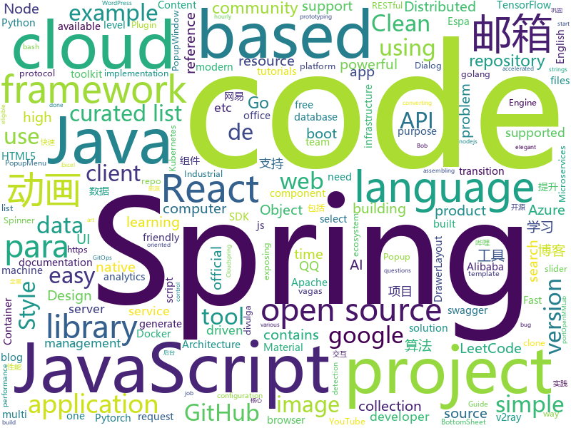

# 2020-08-19
See what the GitHub community is most excited about.

## python
+ [libra](https://github.com/Palashio/libra)(**95 stars today**): Ergonomic machine learning for everyone.
+ [h1st](https://github.com/h1st-ai/h1st)(**61 stars today**): H1st AI solves the critical “cold-start” problem of Industrial AI: encoding human expertise to augment the lack of data, while building a smooth transition toward a machine-learning future. This problem has caused most industrial-AI projects to fail.
+ [locast2plex](https://github.com/tgorgdotcom/locast2plex)(**10 stars today**): A very simple script to connect locast to Plex's live tv/dvr feature.
+ [horovod](https://github.com/horovod/horovod)(**13 stars today**): Distributed training framework for TensorFlow, Keras, PyTorch, and Apache MXNet.
+ [posthog](https://github.com/PostHog/posthog)(**17 stars today**): 🦔PostHog is developer-friendly, open-source product analytics.
+ [fastapi](https://github.com/tiangolo/fastapi)(**68 stars today**): FastAPI framework, high performance, easy to learn, fast to code, ready for production
+ [stock](https://github.com/pythonstock/stock)(**69 stars today**): stock，股票系统。使用python进行开发。
+ [matplotlib](https://github.com/matplotlib/matplotlib)(**8 stars today**): matplotlib: plotting with Python
+ [hedy](https://github.com/Felienne/hedy)(**61 stars today**): Hedy is a gradual programming language, which increases in syntactic elements level by level.
+ [PaddleDetection](https://github.com/PaddlePaddle/PaddleDetection)(**18 stars today**): Object detection and instance segmentation toolkit based on PaddlePaddle.
+ [jina](https://github.com/jina-ai/jina)(**41 stars today**): An easier way to build neural search in the cloud
+ [Statistical-Learning-Method_Code](https://github.com/Dod-o/Statistical-Learning-Method_Code)(**74 stars today**): 手写实现李航《统计学习方法》书中全部算法
+ [image-gpt](https://github.com/openai/image-gpt)(**38 stars today**): 
+ [XingGAN](https://github.com/Ha0Tang/XingGAN)(**42 stars today**): [ECCV 2020] XingGAN for Person Image Generation
+ [PyGithub](https://github.com/PyGithub/PyGithub)(**5 stars today**): Typed interactions with the GitHub API v3
+ [APT_REPORT](https://github.com/blackorbird/APT_REPORT)(**17 stars today**): Interesting apt report collection and some special ioc express
+ [InfoSpider](https://github.com/kangvcar/InfoSpider)(**79 stars today**): INFO-SPIDER 是一个集众多数据源于一身的爬虫工具箱🧰，旨在安全快捷的帮助用户拿回自己的数据，工具代码开源，流程透明。支持数据源包括GitHub、QQ邮箱、网易邮箱、阿里邮箱、新浪邮箱、Hotmail邮箱、Outlook邮箱、京东、淘宝、支付宝、中国移动、中国联通、中国电信、知乎、哔哩哔哩、网易云音乐、QQ好友、QQ群、生成朋友圈相册、浏览器浏览历史、12306、博客园、CSDN博客、开源中国博客、简书。
+ [aws-cdk-examples](https://github.com/aws-samples/aws-cdk-examples)(**11 stars today**): Example projects using the AWS CDK
+ [handcalcs](https://github.com/connorferster/handcalcs)(**90 stars today**): Python library for converting Python calculations into rendered latex.
+ [transformers](https://github.com/huggingface/transformers)(**73 stars today**): 🤗Transformers: State-of-the-art Natural Language Processing for Pytorch and TensorFlow 2.0.
+ [content](https://github.com/demisto/content)(**0 stars today**): Demisto's ever-growing Content Repository
+ [synapse](https://github.com/matrix-org/synapse)(**6 stars today**): Synapse: Matrix reference homeserver
+ [wait-for-it](https://github.com/vishnubob/wait-for-it)(**7 stars today**): Pure bash script to test and wait on the availability of a TCP host and port
+ [mmcv](https://github.com/open-mmlab/mmcv)(**4 stars today**): OpenMMLab Computer Vision Foundation
+ [diagrams](https://github.com/mingrammer/diagrams)(**36 stars today**): 🎨Diagram as Code for prototyping cloud system architectures

## java
+ [hello-algorithm](https://github.com/geekxh/hello-algorithm)(**364 stars today**): 🌍🌎东半球最酷的学习项目 | 包括：1、我写的三十万字图解算法题典 2、100 张各语言思维导图 和 1000 本编程电子📚3、100 篇大厂面经下载 | English version supported !!! 国人项目上榜不易，右上角助力一波🚀🚀！干就对了，奥利给 ！💪💪💪
+ [interviews](https://github.com/kdn251/interviews)(**46 stars today**): Everything you need to know to get the job.
+ [LeetCodeAnimation](https://github.com/MisterBooo/LeetCodeAnimation)(**215 stars today**): Demonstrate all the questions on LeetCode in the form of animation.（用动画的形式呈现解LeetCode题目的思路）
+ [COLA](https://github.com/alibaba/COLA)(**8 stars today**): Clean Object-oriented & Layered Architecture
+ [druid](https://github.com/apache/druid)(**7 stars today**): Apache Druid: a high performance real-time analytics database.
+ [code-examples](https://github.com/thombergs/code-examples)(**3 stars today**): A collection of code examples from blog posts etc.
+ [spring-microservices](https://github.com/in28minutes/spring-microservices)(**4 stars today**): Spring Microservices using Spring Cloud
+ [springboot-learning-example](https://github.com/JeffLi1993/springboot-learning-example)(**14 stars today**): spring boot 实践学习案例，是 spring boot 初学者及核心技术巩固的最佳实践。另外写博客，用 OpenWrite。
+ [Sentinel](https://github.com/alibaba/Sentinel)(**16 stars today**): A powerful flow control component enabling reliability, resilience and monitoring for microservices. (面向云原生微服务的高可用流控防护组件)
+ [keycloak](https://github.com/keycloak/keycloak)(**13 stars today**): Open Source Identity and Access Management For Modern Applications and Services
+ [spring-authorization-server](https://github.com/spring-projects-experimental/spring-authorization-server)(**6 stars today**): A community-driven project led by the Spring Security team and is focused on delivering Authorization Server support to the Spring community
+ [elasticsearch](https://github.com/elastic/elasticsearch)(**32 stars today**): Open Source, Distributed, RESTful Search Engine
+ [easyexcel](https://github.com/alibaba/easyexcel)(**23 stars today**): 快速、简单避免OOM的java处理Excel工具
+ [quartz](https://github.com/quartz-scheduler/quartz)(**6 stars today**): Code for Quartz Scheduler
+ [selenium](https://github.com/SeleniumHQ/selenium)(**18 stars today**): A browser automation framework and ecosystem.
+ [spring-cloud-alibaba](https://github.com/alibaba/spring-cloud-alibaba)(**34 stars today**): Spring Cloud Alibaba provides a one-stop solution for application development for the distributed solutions of Alibaba middleware.
+ [springboot-guide](https://github.com/Snailclimb/springboot-guide)(**18 stars today**): Not only Spring Boot but also important knowledge of Spring（不只是SpringBoot还有Spring重要知识点）
+ [community](https://github.com/GoogleCloudPlatform/community)(**6 stars today**): This repository holds the content submitted to https://cloud.google.com/community. Files added to the tutorials/ will appear at https://cloud.google.com/community/tutorials.
+ [quarkus](https://github.com/quarkusio/quarkus)(**16 stars today**): Quarkus: Supersonic Subatomic Java.
+ [react-native-push-notification](https://github.com/zo0r/react-native-push-notification)(**5 stars today**): React Native Local and Remote Notifications
+ [jmx_exporter](https://github.com/prometheus/jmx_exporter)(**3 stars today**): A process for exposing JMX Beans via HTTP for Prometheus consumption
+ [nacos](https://github.com/alibaba/nacos)(**35 stars today**): an easy-to-use dynamic service discovery, configuration and service management platform for building cloud native applications.
+ [pentaho-kettle](https://github.com/pentaho/pentaho-kettle)(**6 stars today**): Pentaho Data Integration ( ETL ) a.k.a Kettle
+ [google-java-format](https://github.com/google/google-java-format)(**7 stars today**): Reformats Java source code to comply with Google Java Style.
+ [XPopup](https://github.com/li-xiaojun/XPopup)(**8 stars today**): 🔥XPopup2.0版本重磅来袭，2倍以上性能提升，带来可观的动画性能优化和交互细节的提升！！！功能强大，交互优雅，动画丝滑的通用弹窗！可以替代Dialog，PopupWindow，PopupMenu，BottomSheet，DrawerLayout，Spinner等组件，自带十几种效果良好的动画， 支持完全的UI和动画自定义！(Powerful and Beautiful Popup，can absolutely replace Dialog，PopupWindow，PopupMenu，BottomSheet，DrawerLayout，Spinner. With built-in animators , very easy to custom popup view.)

## unknown
+ [design-resources-for-developers](https://github.com/bradtraversy/design-resources-for-developers)(**110 stars today**): Curated list of design and UI resources from stock photos, web templates, CSS frameworks, UI libraries, tools and much more
+ [fucking-algorithm](https://github.com/labuladong/fucking-algorithm)(**797 stars today**): 刷算法全靠套路，认准 labuladong 就够了！English version supported! Crack LeetCode, not only how, but also why.
+ [bounty-targets-data](https://github.com/arkadiyt/bounty-targets-data)(**14 stars today**): This repo contains hourly-updated data dumps of bug bounty platform scopes (like Hackerone/Bugcrowd/Intigriti/etc) that are eligible for reports
+ [bootcamp-gostack-desafios](https://github.com/rocketseat-education/bootcamp-gostack-desafios)(**32 stars today**): Repositório contendo todos os desafios dos módulos do Bootcamp Gostack
+ [Behinder](https://github.com/rebeyond/Behinder)(**98 stars today**): “冰蝎”动态二进制加密网站管理客户端
+ [PentesterSpecialDict](https://github.com/ppbibo/PentesterSpecialDict)(**8 stars today**): 🧢渗透测试人员专用精简化字典👒Dictionary for penetration testers happy hacker🎉
+ [eloquente-javascript](https://github.com/braziljs/eloquente-javascript)(**19 stars today**): Tradução do livro Eloquent JavaScript - 2ª edição.
+ [awesome-mlops](https://github.com/visenger/awesome-mlops)(**21 stars today**): A curated list of references for MLOps
+ [gpt-3](https://github.com/openai/gpt-3)(**188 stars today**): GPT-3: Language Models are Few-Shot Learners
+ [awesome-reMarkable](https://github.com/reHackable/awesome-reMarkable)(**15 stars today**): A curated list of projects related to the reMarkable tablet
+ [learn-regex](https://github.com/ziishaned/learn-regex)(**25 stars today**): Learn regex the easy way
+ [guide](https://github.com/uber-go/guide)(**21 stars today**): The Uber Go Style Guide.
+ [vagas](https://github.com/frontendbr/vagas)(**20 stars today**): 🔬Espaço para divulgação de vagas para front-enders.
+ [vagas](https://github.com/backend-br/vagas)(**18 stars today**): ✌️Espaço para divulgação de vagas para backenders
+ [PoC-in-GitHub](https://github.com/nomi-sec/PoC-in-GitHub)(**19 stars today**): 📡PoC auto collect from GitHub.
+ [low-level-design-primer](https://github.com/prasadgujar/low-level-design-primer)(**52 stars today**): 
+ [Licensing](https://github.com/AaronDinnage/Licensing)(**4 stars today**): Microsoft 365 licensing diagrams
+ [CEHv10](https://github.com/khanhnnvn/CEHv10)(**4 stars today**): Leaked slides and labs
+ [awesome-nestjs](https://github.com/juliandavidmr/awesome-nestjs)(**5 stars today**): 😏Curated list of NestJS
+ [You-Dont-Know-JS](https://github.com/getify/You-Dont-Know-JS)(**48 stars today**): A book series on JavaScript. @YDKJS on twitter.
+ [JavaFamily](https://github.com/AobingJava/JavaFamily)(**140 stars today**): 【Java面试+Java学习指南】 一份涵盖大部分Java程序员所需要掌握的核心知识。
+ [coding-interview-university](https://github.com/jwasham/coding-interview-university)(**75 stars today**): A complete computer science study plan to become a software engineer.
+ [deep_learning_object_detection](https://github.com/hoya012/deep_learning_object_detection)(**12 stars today**): A paper list of object detection using deep learning.
+ [100-Days-Of-ML-Code](https://github.com/Avik-Jain/100-Days-Of-ML-Code)(**20 stars today**): 100 Days of ML Coding
+ [Awesome-CobaltStrike](https://github.com/zer0yu/Awesome-CobaltStrike)(**52 stars today**): cobaltstrike的相关资源汇总 / A collection of cobaltstrike resources to make you better!

## javascript
+ [javascript](https://github.com/airbnb/javascript)(**58 stars today**): JavaScript Style Guide
+ [youtube-clone-nodejs-api](https://github.com/techreagan/youtube-clone-nodejs-api)(**106 stars today**): VueTube is a YouTube clone built with nodejs, expressjs & mongodb. This is the RESTful API repository.
+ [selectize.js](https://github.com/selectize/selectize.js)(**4 stars today**): Selectize is the hybrid of a textbox and <select> box. It's jQuery based and it has autocomplete and native-feeling keyboard navigation; useful for tagging, contact lists, etc.
+ [three.js](https://github.com/mrdoob/three.js)(**30 stars today**): JavaScript 3D library.
+ [plyr](https://github.com/sampotts/plyr)(**20 stars today**): A simple HTML5, YouTube and Vimeo player
+ [react](https://github.com/typescript-cheatsheets/react)(**84 stars today**): Cheatsheets for experienced React developers getting started with TypeScript
+ [next.js](https://github.com/vercel/next.js)(**53 stars today**): The React Framework
+ [FileSaver.js](https://github.com/eligrey/FileSaver.js)(**13 stars today**): An HTML5 saveAs() FileSaver implementation
+ [junior-recruit-scheduler](https://github.com/jojoldu/junior-recruit-scheduler)(**11 stars today**): 주니어 개발자 채용 정보
+ [axios](https://github.com/axios/axios)(**47 stars today**): Promise based HTTP client for the browser and node.js
+ [swiper](https://github.com/nolimits4web/swiper)(**21 stars today**): Most modern mobile touch slider with hardware accelerated transitions
+ [realworld](https://github.com/gothinkster/realworld)(**74 stars today**): "The mother of all demo apps" — Exemplary fullstack Medium.com clone powered by React, Angular, Node, Django, and many more🏅
+ [request](https://github.com/request/request)(**6 stars today**): 🏊🏾 Simplified HTTP request client.
+ [odoo](https://github.com/odoo/odoo)(**11 stars today**): Odoo. Open Source Apps To Grow Your Business.
+ [Universal-Bypass](https://github.com/Sainan/Universal-Bypass)(**8 stars today**): Don't waste your time with compliance. Universal Bypass circumvents annoying link shorteners.
+ [node](https://github.com/nodejs/node)(**33 stars today**): Node.js JavaScript runtime✨🐢🚀✨
+ [eslint](https://github.com/eslint/eslint)(**11 stars today**): Find and fix problems in your JavaScript code.
+ [gutenberg](https://github.com/WordPress/gutenberg)(**8 stars today**): The Block Editor project for WordPress and beyond. Plugin is available from the official repository.
+ [Iosevka](https://github.com/be5invis/Iosevka)(**9 stars today**): Slender typeface for code, from code.
+ [cropperjs](https://github.com/fengyuanchen/cropperjs)(**14 stars today**): JavaScript image cropper.
+ [amis-admin](https://github.com/fex-team/amis-admin)(**5 stars today**): 基于 amis 的后台项目前端模板
+ [joi](https://github.com/sideway/joi)(**22 stars today**): The most powerful data validation library for JS
+ [react-i18next](https://github.com/i18next/react-i18next)(**7 stars today**): Internationalization for react done right. Using the i18next i18n ecosystem.
+ [office-docs-powershell](https://github.com/MicrosoftDocs/office-docs-powershell)(**1 stars today**): PowerShell Reference for Office Products - Short URL: aka.ms/office-powershell
+ [codesandbox-client](https://github.com/codesandbox/codesandbox-client)(**7 stars today**): An online IDE for rapid web development

## html
+ [spotMicro](https://github.com/mike4192/spotMicro)(**120 stars today**): Spot Micro Quadripeg Project
+ [web-moderno](https://github.com/cod3rcursos/web-moderno)(**6 stars today**): 
+ [tidytuesday](https://github.com/rfordatascience/tidytuesday)(**10 stars today**): Official repo for the #tidytuesday project
+ [tiny-slider](https://github.com/ganlanyuan/tiny-slider)(**9 stars today**): Vanilla javascript slider for all purposes.
+ [styleguide](https://github.com/google/styleguide)(**13 stars today**): Style guides for Google-originated open-source projects
+ [cypress-example-kitchensink](https://github.com/cypress-io/cypress-example-kitchensink)(**3 stars today**): This is an example app used to showcase Cypress.io testing.
+ [v2-ui](https://github.com/sprov065/v2-ui)(**7 stars today**): 支持多协议多用户的 v2ray 面板，Support multi-protocol multi-user v2ray panel
+ [tabler-icons](https://github.com/tabler/tabler-icons)(**22 stars today**): A set of over 600 free MIT-licensed high-quality SVG icons for you to use in your web projects.
+ [hexo-theme-fluid](https://github.com/fluid-dev/hexo-theme-fluid)(**10 stars today**): 🌊一款 Material Design 风格的 Hexo 主题 / An elegant Material-Design theme for Hexo
+ [chosen](https://github.com/harvesthq/chosen)(**1 stars today**): Deprecated - Chosen is a library for making long, unwieldy select boxes more friendly.
+ [hyperblog](https://github.com/freddier/hyperblog)(**12 stars today**): Un blog increíble para el curso de Git y Github de Platzi
+ [awebp](https://github.com/dac-2020/awebp)(**0 stars today**): 
+ [azure-sdk](https://github.com/Azure/azure-sdk)(**0 stars today**): This is the Azure SDK parent repository and mostly contains documentation around guidelines and policies as well as the releases for the various languages supported by the Azure SDK.
+ [webdevbootcamp](https://github.com/nax3t/webdevbootcamp)(**7 stars today**): All source code for back-end projects from the Web Developer Bootcamp
+ [openshift-docs](https://github.com/openshift/openshift-docs)(**0 stars today**): OpenShift 3 and 4 product and community documentation
+ [pyecharts-gallery](https://github.com/pyecharts/pyecharts-gallery)(**1 stars today**): Just use pyecharts to imitate Echarts official example.
+ [zphisher](https://github.com/htr-tech/zphisher)(**7 stars today**): Automated Phishing Tool
+ [wnr](https://github.com/RoderickQiu/wnr)(**6 stars today**): ⏱️It's a time-management tool for computers. Work and rest, with wnr now.
+ [v-calendar](https://github.com/nathanreyes/v-calendar)(**3 stars today**): A lightweight, dependency-free plugin for building attributed calendars in Vue.js
+ [all-contributors](https://github.com/all-contributors/all-contributors)(**9 stars today**): ✨Recognize all contributors, not just the ones who push code✨
+ [openwrt-packages](https://github.com/kenzok8/openwrt-packages)(**8 stars today**): openwet常用软件包
+ [linuxtools_rst](https://github.com/me115/linuxtools_rst)(**5 stars today**): Linux工具快速教程
+ [swagger-codegen](https://github.com/swagger-api/swagger-codegen)(**4 stars today**): swagger-codegen contains a template-driven engine to generate documentation, API clients and server stubs in different languages by parsing your OpenAPI / Swagger definition.
+ [aave-protocol](https://github.com/aave/aave-protocol)(**1 stars today**): Aave Protocol Version 1.0 - Decentralized Lending Pools
+ [zju-icicles](https://github.com/QSCTech/zju-icicles)(**4 stars today**): 浙江大学课程攻略共享计划

## go
+ [docker-ce](https://github.com/docker/docker-ce)(**11 stars today**): Docker CE
+ [sourcegraph](https://github.com/sourcegraph/sourcegraph)(**9 stars today**): Universal code search (self-hosted)
+ [tendermint](https://github.com/tendermint/tendermint)(**5 stars today**): ⟁ Tendermint Core (BFT Consensus) in Go
+ [sh](https://github.com/mvdan/sh)(**21 stars today**): A shell parser, formatter, and interpreter with bash support; includes shfmt
+ [sarama](https://github.com/Shopify/sarama)(**4 stars today**): Sarama is a Go library for Apache Kafka 0.8, and up.
+ [autoscaler](https://github.com/kubernetes/autoscaler)(**10 stars today**): Autoscaling components for Kubernetes
+ [crossplane](https://github.com/crossplane/crossplane)(**16 stars today**): Manage any infrastructure your applications need directly from Kubernetes
+ [annie](https://github.com/iawia002/annie)(**231 stars today**): 👾Fast, simple and clean video downloader
+ [toolkit](https://github.com/fluxcd/toolkit)(**20 stars today**): Experimental toolkit for assembling CD pipelines the GitOps way
+ [govalidator](https://github.com/asaskevich/govalidator)(**17 stars today**): [Go] Package of validators and sanitizers for strings, numerics, slices and structs
+ [version-checker](https://github.com/jetstack/version-checker)(**38 stars today**): Kubernetes utility for exposing image versions in use, compared to latest available upstream, as metrics.
+ [kubernetes](https://github.com/kubernetes/kubernetes)(**41 stars today**): Production-Grade Container Scheduling and Management
+ [go-clean-arch](https://github.com/bxcodec/go-clean-arch)(**20 stars today**): Go (Golang) Clean Architecture based on Reading Uncle Bob's Clean Architecture
+ [kaniko](https://github.com/GoogleContainerTools/kaniko)(**8 stars today**): Build Container Images In Kubernetes
+ [skaffold](https://github.com/GoogleContainerTools/skaffold)(**11 stars today**): Easy and Repeatable Kubernetes Development
+ [charts](https://github.com/helm/charts)(**18 stars today**): Curated applications for Kubernetes
+ [gqlgen](https://github.com/99designs/gqlgen)(**5 stars today**): go generate based graphql server library
+ [serving](https://github.com/knative/serving)(**5 stars today**): Kubernetes-based, scale-to-zero, request-driven compute
+ [cli](https://github.com/cloudfoundry/cli)(**3 stars today**): The official command line client for Cloud Foundry
+ [grpc-go](https://github.com/grpc/grpc-go)(**12 stars today**): The Go language implementation of gRPC. HTTP/2 based RPC
+ [twirp](https://github.com/twitchtv/twirp)(**7 stars today**): A simple RPC framework with protobuf service definitions
+ [terraform](https://github.com/hashicorp/terraform)(**18 stars today**): Terraform enables you to safely and predictably create, change, and improve infrastructure. It is an open source tool that codifies APIs into declarative configuration files that can be shared amongst team members, treated as code, edited, reviewed, and versioned.
+ [distribution](https://github.com/docker/distribution)(**1 stars today**): The Docker toolset to pack, ship, store, and deliver content
+ [sqlx](https://github.com/jmoiron/sqlx)(**13 stars today**): general purpose extensions to golang's database/sql
+ [terraform-provider-azurerm](https://github.com/terraform-providers/terraform-provider-azurerm)(**3 stars today**): Terraform provider for Azure Resource Manager

## WordCloud

