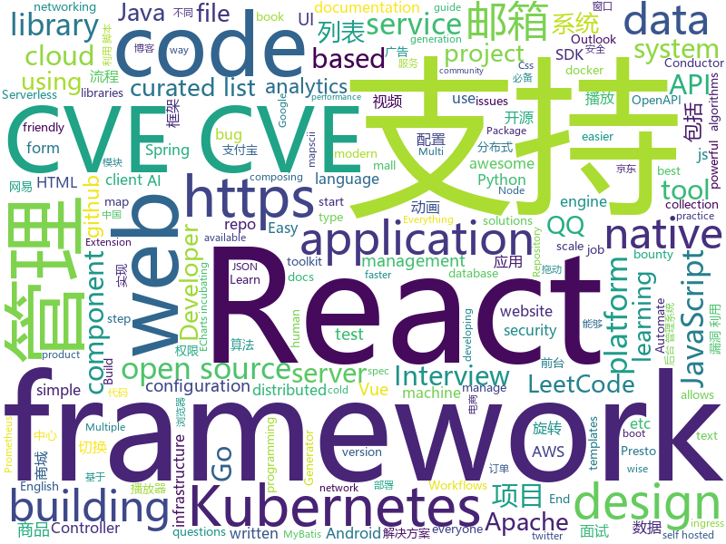

# 2020-08-21
See what the GitHub community is most excited about.

## python
+ [libra](https://github.com/Palashio/libra)(**406 stars today**): Ergonomic machine learning for everyone.
+ [d2l-en](https://github.com/d2l-ai/d2l-en)(**48 stars today**): Interactive deep learning book with code, math, and discussions. Available in multi-frameworks.
+ [InfoSpider](https://github.com/kangvcar/InfoSpider)(**71 stars today**): INFO-SPIDER 是一个集众多数据源于一身的爬虫工具箱🧰，旨在安全快捷的帮助用户拿回自己的数据，工具代码开源，流程透明。支持数据源包括GitHub、QQ邮箱、网易邮箱、阿里邮箱、新浪邮箱、Hotmail邮箱、Outlook邮箱、京东、淘宝、支付宝、中国移动、中国联通、中国电信、知乎、哔哩哔哩、网易云音乐、QQ好友、QQ群、生成朋友圈相册、浏览器浏览历史、12306、博客园、CSDN博客、开源中国博客、简书。
+ [insight](https://github.com/abhimishra91/insight)(**16 stars today**): Repository for Project Insight: NLP as a Service
+ [posthog](https://github.com/PostHog/posthog)(**27 stars today**): 🦔PostHog is developer-friendly, open-source product analytics.
+ [system-design-primer](https://github.com/donnemartin/system-design-primer)(**107 stars today**): Learn how to design large-scale systems. Prep for the system design interview. Includes Anki flashcards.
+ [horovod](https://github.com/horovod/horovod)(**13 stars today**): Distributed training framework for TensorFlow, Keras, PyTorch, and Apache MXNet.
+ [gym](https://github.com/openai/gym)(**12 stars today**): A toolkit for developing and comparing reinforcement learning algorithms.
+ [h1st](https://github.com/h1st-ai/h1st)(**88 stars today**): Human-First AI solves the “cold-start” problem of Industrial AI: encoding human expertise to augment the lack of data, while bridging to powerful ML—based on experience building AI solutions at Panasonic: robotics predictive maintenance, cold-chain energy optimization, Gigafactory battery mfg, avionics, automotive cybersecurity, and more.
+ [syllabus](https://github.com/IIC2233/syllabus)(**4 stars today**): Repositorio oficial del curso IIC2233 Programación Avanzada🎉🎊
+ [PaddleDetection](https://github.com/PaddlePaddle/PaddleDetection)(**38 stars today**): Object detection and instance segmentation toolkit based on PaddlePaddle.
+ [exphub](https://github.com/zhzyker/exphub)(**14 stars today**): Exphub[漏洞利用脚本库] 包括Webloigc、Struts2、Tomcat、Nexus、Solr、Jboss、Drupal的漏洞利用脚本，最新添加CVE-2020-5902、CVE-2020-11444、CVE-2020-10204、CVE-2020-10199、CVE-2020-1938、CVE-2020-2551、CVE-2020-2555、CVE-2020-2883、CVE-2019-17558、CVE-2019-6340
+ [serverless-application-model](https://github.com/awslabs/serverless-application-model)(**5 stars today**): AWS Serverless Application Model (SAM) is an open-source framework for building serverless applications
+ [ansible](https://github.com/ansible/ansible)(**21 stars today**): Ansible is a radically simple IT automation platform that makes your applications and systems easier to deploy and maintain. Automate everything from code deployment to network configuration to cloud management, in a language that approaches plain English, using SSH, with no agents to install on remote systems. https://docs.ansible.com.
+ [airflow](https://github.com/apache/airflow)(**14 stars today**): Apache Airflow - A platform to programmatically author, schedule, and monitor workflows
+ [SeleniumBase](https://github.com/seleniumbase/SeleniumBase)(**4 stars today**): ✅Automate & test 16x faster with Selenium & pytest. Batteries included.
+ [Awesome-Bugbounty-Writeups](https://github.com/devanshbatham/Awesome-Bugbounty-Writeups)(**7 stars today**): A curated list of bugbounty writeups (Bug type wise) , inspired from https://github.com/ngalongc/bug-bounty-reference
+ [moto](https://github.com/spulec/moto)(**12 stars today**): A library that allows you to easily mock out tests based on AWS infrastructure.
+ [jupyterhub](https://github.com/jupyterhub/jupyterhub)(**4 stars today**): Multi-user server for Jupyter notebooks
+ [pydantic](https://github.com/samuelcolvin/pydantic)(**13 stars today**): Data parsing and validation using Python type hints
+ [QUANTAXIS](https://github.com/QUANTAXIS/QUANTAXIS)(**13 stars today**): QUANTAXIS 支持任务调度 分布式部署的 股票/期货/期权/港股/虚拟货币 数据/回测/模拟/交易/可视化/多账户 纯本地量化解决方案
+ [mypy](https://github.com/python/mypy)(**11 stars today**): Optional static typing for Python 3 and 2 (PEP 484)
+ [recommenders](https://github.com/microsoft/recommenders)(**17 stars today**): Best Practices on Recommendation Systems
+ [IntelOwl](https://github.com/intelowlproject/IntelOwl)(**28 stars today**): Intel Owl: analyze files, domains, IPs in multiple ways from a single API at scale
+ [pipelines](https://github.com/kubeflow/pipelines)(**3 stars today**): Machine Learning Pipelines for Kubeflow

## java
+ [hello-algorithm](https://github.com/geekxh/hello-algorithm)(**1,013 stars today**): 🌍🌎东半球最酷的学习项目 | 包括：1、我写的三十万字图解算法题典 2、100 张各语言思维导图 和 1000 本编程电子📚3、100 篇大厂面经下载 | English version supported !!! 国人项目上榜不易，右上角助力一波🚀🚀！干就对了，奥利给 ！💪💪💪
+ [labs_campaigns](https://github.com/guardicore/labs_campaigns)(**34 stars today**): 
+ [CS-Notes](https://github.com/CyC2018/CS-Notes)(**138 stars today**): 📚技术面试必备基础知识、Leetcode、计算机操作系统、计算机网络、系统设计、Java、Python、C++
+ [conductor](https://github.com/Netflix/conductor)(**84 stars today**): Conductor is a microservices orchestration engine - https://netflix.github.io/conductor/
+ [antlr4](https://github.com/antlr/antlr4)(**8 stars today**): ANTLR (ANother Tool for Language Recognition) is a powerful parser generator for reading, processing, executing, or translating structured text or binary files.
+ [mall](https://github.com/macrozheng/mall)(**59 stars today**): mall项目是一套电商系统，包括前台商城系统及后台管理系统，基于SpringBoot+MyBatis实现，采用Docker容器化部署。 前台商城系统包含首页门户、商品推荐、商品搜索、商品展示、购物车、订单流程、会员中心、客户服务、帮助中心等模块。 后台管理系统包含商品管理、订单管理、会员管理、促销管理、运营管理、内容管理、统计报表、财务管理、权限管理、设置等模块。
+ [seata-samples](https://github.com/seata/seata-samples)(**2 stars today**): seata-samples
+ [nacos](https://github.com/alibaba/nacos)(**26 stars today**): an easy-to-use dynamic service discovery, configuration and service management platform for building cloud native applications.
+ [interviews](https://github.com/kdn251/interviews)(**134 stars today**): Everything you need to know to get the job.
+ [presto](https://github.com/prestosql/presto)(**3 stars today**): Home of the community managed version of Presto, the distributed SQL query engine for big data, under the auspices of the Presto Software Foundation.
+ [GSYVideoPlayer](https://github.com/CarGuo/GSYVideoPlayer)(**9 stars today**): 视频播放器（IJKplayer、ExoPlayer、MediaPlayer），HTTPS，支持弹幕，外挂字幕，支持滤镜、水印、gif截图，片头广告、中间广告，多个同时播放，支持基本的拖动，声音、亮度调节，支持边播边缓存，支持视频自带rotation的旋转（90,270之类），重力旋转与手动旋转的同步支持，支持列表播放 ，列表全屏动画，视频加载速度，列表小窗口支持拖动，动画效果，调整比例，多分辨率切换，支持切换播放器，进度条小窗口预览，列表切换详情页面无缝播放，rtsp、concat、mpeg。
+ [android-interview-questions](https://github.com/MindorksOpenSource/android-interview-questions)(**5 stars today**): Your Cheat Sheet For Android Interview - Android Interview Questions
+ [druid](https://github.com/apache/druid)(**13 stars today**): Apache Druid: a high performance real-time analytics database.
+ [spring-boot-admin](https://github.com/codecentric/spring-boot-admin)(**9 stars today**): Admin UI for administration of spring boot applications
+ [onemall](https://github.com/YunaiV/onemall)(**29 stars today**): 芋道 mall 商城，基于微服务的思想，构建在 B2C 电商场景下的项目实战。核心技术栈，是 Spring Boot + Dubbo 。未来，会重构成 Spring Cloud Alibaba 。
+ [jjwt](https://github.com/jwtk/jjwt)(**6 stars today**): Java JWT: JSON Web Token for Java and Android
+ [LeetCodeAnimation](https://github.com/MisterBooo/LeetCodeAnimation)(**101 stars today**): Demonstrate all the questions on LeetCode in the form of animation.（用动画的形式呈现解LeetCode题目的思路）
+ [apollo](https://github.com/ctripcorp/apollo)(**23 stars today**): Apollo（阿波罗）是携程框架部门研发的分布式配置中心，能够集中化管理应用不同环境、不同集群的配置，配置修改后能够实时推送到应用端，并且具备规范的权限、流程治理等特性，适用于微服务配置管理场景。
+ [debezium](https://github.com/debezium/debezium)(**4 stars today**): Change data capture for a variety of databases. Please log issues at https://issues.redhat.com/browse/DBZ.
+ [configuration-as-code-plugin](https://github.com/jenkinsci/configuration-as-code-plugin)(**3 stars today**): Jenkins Configuration as Code Plugin
+ [jmx_exporter](https://github.com/prometheus/jmx_exporter)(**3 stars today**): A process for exposing JMX Beans via HTTP for Prometheus consumption
+ [openapi-generator](https://github.com/OpenAPITools/openapi-generator)(**12 stars today**): OpenAPI Generator allows generation of API client libraries (SDK generation), server stubs, documentation and configuration automatically given an OpenAPI Spec (v2, v3)
+ [code-examples](https://github.com/thombergs/code-examples)(**4 stars today**): A collection of code examples from blog posts etc.
+ [Mapper](https://github.com/abel533/Mapper)(**8 stars today**): Mybatis Common Mapper - Easy to use
+ [RxJava](https://github.com/ReactiveX/RxJava)(**10 stars today**): RxJava – Reactive Extensions for the JVM – a library for composing asynchronous and event-based programs using observable sequences for the Java VM.

## unknown
+ [design-resources-for-developers](https://github.com/bradtraversy/design-resources-for-developers)(**395 stars today**): Curated list of design and UI resources from stock photos, web templates, CSS frameworks, UI libraries, tools and much more
+ [chinese-programmer-wrong-pronunciation](https://github.com/shimohq/chinese-programmer-wrong-pronunciation)(**195 stars today**): 中国程序员容易发音错误的单词
+ [awesome-hpp](https://github.com/p-ranav/awesome-hpp)(**118 stars today**): A curated list of awesome header-only C++ libraries
+ [bootcamp-gostack-desafios](https://github.com/rocketseat-education/bootcamp-gostack-desafios)(**33 stars today**): Repositório contendo todos os desafios dos módulos do Bootcamp Gostack
+ [awesome-react](https://github.com/enaqx/awesome-react)(**20 stars today**): A collection of awesome things regarding React ecosystem
+ [awesome-lowcode](https://github.com/taowen/awesome-lowcode)(**28 stars today**): 国内低代码平台从业者交流
+ [android-developer-roadmap](https://github.com/mobile-roadmap/android-developer-roadmap)(**3 stars today**): Android Developer Roadmap 2020
+ [bounty-targets-data](https://github.com/arkadiyt/bounty-targets-data)(**81 stars today**): This repo contains hourly-updated data dumps of bug bounty platform scopes (like Hackerone/Bugcrowd/Intigriti/etc) that are eligible for reports
+ [COVID-19](https://github.com/pcm-dpc/COVID-19)(**3 stars today**): COVID-19 Italia - Monitoraggio situazione
+ [Clash_Chinese_Patch](https://github.com/BoyceLig/Clash_Chinese_Patch)(**17 stars today**): 
+ [Interview_Question_for_Beginner](https://github.com/JaeYeopHan/Interview_Question_for_Beginner)(**25 stars today**): 👦👧Technical-Interview guidelines written for those who started studying programming. I wish you all the best.👾
+ [proposals](https://github.com/tc39/proposals)(**14 stars today**): Tracking ECMAScript Proposals
+ [leetcode_company_wise_questions](https://github.com/MysteryVaibhav/leetcode_company_wise_questions)(**29 stars today**): This is a repository containing the list of company wise questions available on leetcode premium
+ [sre-interview-prep-guide](https://github.com/mxssl/sre-interview-prep-guide)(**23 stars today**): Site Reliability Engineer Interview Preparation Guide
+ [cs-video-courses](https://github.com/Developer-Y/cs-video-courses)(**10 stars today**): List of Computer Science courses with video lectures.
+ [DAFTAR-API-LOKAL-INDONESIA](https://github.com/farizdotid/DAFTAR-API-LOKAL-INDONESIA)(**5 stars today**): Berisi API tentang Data Indonesia
+ [awesome-algorithms](https://github.com/tayllan/awesome-algorithms)(**19 stars today**): A curated list of awesome places to learn and/or practice algorithms.
+ [frontend-challenges](https://github.com/felipefialho/frontend-challenges)(**7 stars today**): 💥Listing some playful open-source's challenges of jobs to test your knowledge
+ [prometheus](https://github.com/vegasbrianc/prometheus)(**3 stars today**): A docker-compose stack for Prometheus monitoring
+ [perf-workshop](https://github.com/kkbjs/perf-workshop)(**6 stars today**): 性能优化训练营
+ [fe-news](https://github.com/naver/fe-news)(**7 stars today**): FE 기술 소식 큐레이션 뉴스레터
+ [You-Dont-Know-JS](https://github.com/getify/You-Dont-Know-JS)(**36 stars today**): A book series on JavaScript. @YDKJS on twitter.
+ [chromium](https://github.com/chromium/chromium)(**20 stars today**): The official GitHub mirror of the Chromium source
+ [api-guidelines](https://github.com/microsoft/api-guidelines)(**14 stars today**): Microsoft REST API Guidelines
+ [CKAD-exercises](https://github.com/dgkanatsios/CKAD-exercises)(**7 stars today**): A set of exercises to prepare for Certified Kubernetes Application Developer exam by Cloud Native Computing Foundation

## javascript
+ [omatsuri](https://github.com/rtivital/omatsuri)(**57 stars today**): Browser application with 9 open source frontend focused tools
+ [anti-honeypot](https://github.com/cnrstar/anti-honeypot)(**29 stars today**): 一款可以检测WEB蜜罐并阻断请求的Chrome插件
+ [FE-Interview](https://github.com/lgwebdream/FE-Interview)(**106 stars today**): 前端面试必备题库，1000+面试真题，Html、Css、JavaScript、Vue、React、Node、TypeScript、Webpack、算法、网络与安全、浏览器
+ [react-native](https://github.com/facebook/react-native)(**37 stars today**): A framework for building native apps with React.
+ [baseweb](https://github.com/uber/baseweb)(**10 stars today**): A React Component library implementing the Base design language
+ [howler.js](https://github.com/goldfire/howler.js)(**46 stars today**): Javascript audio library for the modern web.
+ [react-native-website](https://github.com/facebook/react-native-website)(**2 stars today**): The site and docs for React Native
+ [OpenAPI-Specification](https://github.com/OAI/OpenAPI-Specification)(**12 stars today**): The OpenAPI Specification Repository
+ [pdfmake](https://github.com/bpampuch/pdfmake)(**8 stars today**): Client/server side PDF printing in pure JavaScript
+ [Viewers](https://github.com/OHIF/Viewers)(**3 stars today**): OHIF zero-footprint DICOM viewer and oncology specific Lesion Tracker, plus shared extension packages
+ [vuex](https://github.com/vuejs/vuex)(**13 stars today**): 🗃️Centralized State Management for Vue.js.
+ [vue](https://github.com/vuejs/vue)(**87 stars today**): 🖖Vue.js is a progressive, incrementally-adoptable JavaScript framework for building UI on the web.
+ [mapscii](https://github.com/rastapasta/mapscii)(**13 stars today**): 🗺MapSCII is a Braille & ASCII world map renderer for your console - enter => telnet mapscii.me <= on Mac and Linux, connect with PuTTY on Windows
+ [umami](https://github.com/mikecao/umami)(**363 stars today**): Umami is a simple, fast, website analytics alternative to Google Analytics.
+ [echarts-for-react](https://github.com/hustcc/echarts-for-react)(**11 stars today**): 📈Apache ECharts (incubating) components for React wrapper. 一个简单的 Apache echarts (incubating) 的 React 封装。
+ [next.js](https://github.com/vercel/next.js)(**39 stars today**): The React Framework
+ [async-validator](https://github.com/yiminghe/async-validator)(**12 stars today**): validate form asynchronous
+ [react-jsonschema-form](https://github.com/rjsf-team/react-jsonschema-form)(**4 stars today**): A React component for building Web forms from JSON Schema.
+ [taro](https://github.com/NervJS/taro)(**15 stars today**): 开放式跨端跨框架解决方案，支持使用 React/Vue/Nerv 等框架来开发微信/京东/百度/支付宝/字节跳动/ QQ 小程序/H5 等应用。 https://taro.jd.com/
+ [CodeceptJS](https://github.com/codeceptjs/CodeceptJS)(**3 stars today**): Supercharged End 2 End Testing Framework for NodeJS
+ [d3](https://github.com/d3/d3)(**19 stars today**): Bring data to life with SVG, Canvas and HTML.📊📈🎉
+ [alpine](https://github.com/alpinejs/alpine)(**23 stars today**): A rugged, minimal framework for composing JavaScript behavior in your markup.
+ [jszip](https://github.com/Stuk/jszip)(**3 stars today**): Create, read and edit .zip files with Javascript
+ [material-ui](https://github.com/mui-org/material-ui)(**41 stars today**): React components for faster and easier web development. Build your own design system, or start with Material Design.
+ [the-super-tiny-compiler](https://github.com/jamiebuilds/the-super-tiny-compiler)(**16 stars today**): ⛄Possibly the smallest compiler ever

## html
+ [calico](https://github.com/projectcalico/calico)(**7 stars today**): Cloud native networking and network security
+ [100knocks-preprocess](https://github.com/The-Japan-DataScientist-Society/100knocks-preprocess)(**1 stars today**): データサイエンス100本ノック（構造化データ加工編）
+ [wpt](https://github.com/web-platform-tests/wpt)(**0 stars today**): Test suites for Web platform specs — including WHATWG, W3C, and others
+ [zh.javascript.info](https://github.com/javascript-tutorial/zh.javascript.info)(**12 stars today**): 现代 JavaScript 教程（The Modern JavaScript Tutorial）
+ [speedtest](https://github.com/librespeed/speedtest)(**10 stars today**): Self-hosted Speedtest for HTML5 and more. Easy setup, examples, configurable, mobile friendly. Supports PHP, Node, Multiple servers, and more
+ [awebp](https://github.com/dac-2020/awebp)(**0 stars today**): 
+ [styleguide](https://github.com/google/styleguide)(**10 stars today**): Style guides for Google-originated open-source projects
+ [openshift-docs](https://github.com/openshift/openshift-docs)(**0 stars today**): OpenShift 3 and 4 product and community documentation
+ [RestApiTutorial.com](https://github.com/tfredrich/RestApiTutorial.com)(**2 stars today**): HTML Source code for www.RestApiTutorial.com
+ [text-to-handwriting](https://github.com/saurabhdaware/text-to-handwriting)(**8 stars today**): So your teacher asked you to upload written assignments? Hate writing assigments? This tool will help you convert your text to handwriting xD
+ [msteams-docs](https://github.com/MicrosoftDocs/msteams-docs)(**1 stars today**): Source for the Microsoft Teams developer platform documentation.
+ [infinite-scroll](https://github.com/metafizzy/infinite-scroll)(**2 stars today**): 📜Automatically add next page
+ [keycloak-documentation](https://github.com/keycloak/keycloak-documentation)(**1 stars today**): 
+ [JavaScript30](https://github.com/wesbos/JavaScript30)(**8 stars today**): 30 Day Vanilla JS Challenge
+ [website](https://github.com/kubernetes/website)(**5 stars today**): Kubernetes website and documentation repo:
+ [Server](https://github.com/PanDownloadServer/Server)(**9 stars today**): 
+ [indigo](https://github.com/sergiokopplin/indigo)(**3 stars today**): 🍜Minimalist Jekyll Template
+ [ML-notes](https://github.com/Sakura-gh/ML-notes)(**8 stars today**): notes about machine learning
+ [polyfill-service](https://github.com/Financial-Times/polyfill-service)(**2 stars today**): Automatic polyfill service.
+ [twemoji](https://github.com/twitter/twemoji)(**8 stars today**): Emoji for everyone. https://twemoji.twitter.com/
+ [Article](https://github.com/HelloGitHub-Team/Article)(**59 stars today**): 讲解开源项目系列文章库
+ [intro.js](https://github.com/usablica/intro.js)(**5 stars today**): A better way for new feature introduction and step-by-step users guide for your website and project.
+ [repo-badges](https://github.com/dwyl/repo-badges)(**3 stars today**): ⭐Use repo badges (build passing, coverage, etc) in your readme/markdown file to signal code quality in a project.
+ [Cerberus](https://github.com/TedGoas/Cerberus)(**2 stars today**): A few simple, but solid patterns for responsive HTML email templates and newsletters. Even in Outlook and Gmail.
+ [web-moderno](https://github.com/cod3rcursos/web-moderno)(**3 stars today**): 

## go
+ [aws-controllers-k8s](https://github.com/aws/aws-controllers-k8s)(**128 stars today**): AWS Controllers for Kubernetes (ACK) is a project enabling you to manage AWS services from Kubernetes
+ [autoscaler](https://github.com/kubernetes/autoscaler)(**10 stars today**): Autoscaling components for Kubernetes
+ [fabric](https://github.com/hyperledger/fabric)(**8 stars today**): Hyperledger Fabric is an enterprise-grade permissioned distributed ledger framework for developing solutions and applications. Its modular and versatile design satisfies a broad range of industry use cases. It offers a unique approach to consensus that enables performance at scale while preserving privacy.
+ [sourcegraph](https://github.com/sourcegraph/sourcegraph)(**18 stars today**): Universal code search (self-hosted)
+ [terrascan](https://github.com/accurics/terrascan)(**7 stars today**): Detect compliance and security violations across Infrastructure as Code to mitigate risk before provisioning cloud native infrastructure.
+ [ent](https://github.com/facebook/ent)(**114 stars today**): An entity framework for Go
+ [cilium](https://github.com/cilium/cilium)(**32 stars today**): eBPF-based Networking, Security, and Observability
+ [go-safeweb](https://github.com/google/go-safeweb)(**26 stars today**): Secure-by-default HTTP servers in Go.
+ [mongo-go-driver](https://github.com/mongodb/mongo-go-driver)(**6 stars today**): The Go driver for MongoDB
+ [aws-sdk-go](https://github.com/aws/aws-sdk-go)(**4 stars today**): AWS SDK for the Go programming language.
+ [kubevirt](https://github.com/kubevirt/kubevirt)(**4 stars today**): Kubernetes Virtualization API and runtime in order to define and manage virtual machines.
+ [kustomize](https://github.com/kubernetes-sigs/kustomize)(**8 stars today**): Customization of kubernetes YAML configurations
+ [argo](https://github.com/argoproj/argo)(**18 stars today**): Argo Workflows: Get stuff done with Kubernetes.
+ [opa](https://github.com/open-policy-agent/opa)(**8 stars today**): An open source, general-purpose policy engine.
+ [lotus](https://github.com/filecoin-project/lotus)(**3 stars today**): Implementation of the Filecoin protocol, written in Go
+ [helm](https://github.com/helm/helm)(**11 stars today**): The Kubernetes Package Manager
+ [mapstructure](https://github.com/mitchellh/mapstructure)(**6 stars today**): Go library for decoding generic map values into native Go structures and vice versa.
+ [vault](https://github.com/hashicorp/vault)(**11 stars today**): A tool for secrets management, encryption as a service, and privileged access management
+ [client_golang](https://github.com/prometheus/client_golang)(**1 stars today**): Prometheus instrumentation library for Go applications
+ [aws-alb-ingress-controller](https://github.com/kubernetes-sigs/aws-alb-ingress-controller)(**4 stars today**): AWS ALB Ingress Controller for Kubernetes
+ [redis](https://github.com/go-redis/redis)(**10 stars today**): Type-safe Redis client for Golang
+ [kapow](https://github.com/BBVA/kapow)(**28 stars today**): Kapow! If you can script it, you can HTTP it.
+ [minio-go](https://github.com/minio/minio-go)(**6 stars today**): MinIO Client SDK for Go
+ [contour](https://github.com/projectcontour/contour)(**6 stars today**): Contour is a Kubernetes ingress controller using Envoy proxy.
+ [go-cqhttp](https://github.com/Mrs4s/go-cqhttp)(**10 stars today**): cqhttp的golang实现，轻量、原生跨平台.

## WordCloud

