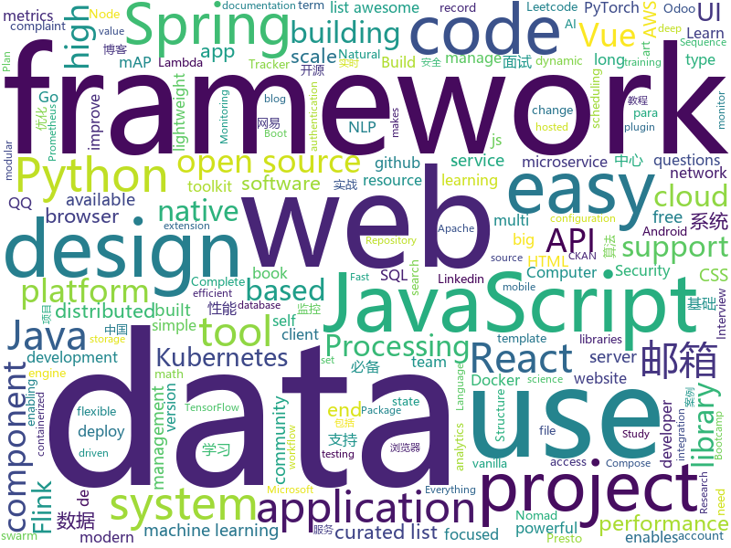

# 2020-08-22
See what the GitHub community is most excited about.

## python
+ [flair](https://github.com/flairNLP/flair)(**26 stars today**): A very simple framework for state-of-the-art Natural Language Processing (NLP)
+ [posthog](https://github.com/PostHog/posthog)(**58 stars today**): 🦔PostHog is developer-friendly, open-source product analytics.
+ [InfoSpider](https://github.com/kangvcar/InfoSpider)(**271 stars today**): INFO-SPIDER 是一个集众多数据源于一身的爬虫工具箱🧰，旨在安全快捷的帮助用户拿回自己的数据，工具代码开源，流程透明。支持数据源包括GitHub、QQ邮箱、网易邮箱、阿里邮箱、新浪邮箱、Hotmail邮箱、Outlook邮箱、京东、淘宝、支付宝、中国移动、中国联通、中国电信、知乎、哔哩哔哩、网易云音乐、QQ好友、QQ群、生成朋友圈相册、浏览器浏览历史、12306、博客园、CSDN博客、开源中国博客、简书。
+ [pytorch-lightning](https://github.com/PyTorchLightning/pytorch-lightning)(**36 stars today**): The lightweight PyTorch wrapper for high-performance AI research. Scale your models, not the boilerplate.
+ [vaex](https://github.com/vaexio/vaex)(**78 stars today**): Out-of-Core DataFrames for Python, ML, visualize and explore big tabular data at a billion rows per second🚀
+ [system-design-primer](https://github.com/donnemartin/system-design-primer)(**86 stars today**): Learn how to design large-scale systems. Prep for the system design interview. Includes Anki flashcards.
+ [PaddleDetection](https://github.com/PaddlePaddle/PaddleDetection)(**32 stars today**): Object detection and instance segmentation toolkit based on PaddlePaddle.
+ [cvat](https://github.com/opencv/cvat)(**11 stars today**): Powerful and efficient Computer Vision Annotation Tool (CVAT)
+ [transformers](https://github.com/huggingface/transformers)(**75 stars today**): 🤗Transformers: State-of-the-art Natural Language Processing for Pytorch and TensorFlow 2.0.
+ [insight](https://github.com/abhimishra91/insight)(**33 stars today**): Repository for Project Insight: NLP as a Service
+ [horovod](https://github.com/horovod/horovod)(**11 stars today**): Distributed training framework for TensorFlow, Keras, PyTorch, and Apache MXNet.
+ [DeepFaceLab](https://github.com/iperov/DeepFaceLab)(**47 stars today**): DeepFaceLab is the leading software for creating deepfakes.
+ [recommenders](https://github.com/microsoft/recommenders)(**20 stars today**): Best Practices on Recommendation Systems
+ [d2l-en](https://github.com/d2l-ai/d2l-en)(**87 stars today**): Interactive deep learning book with code, math, and discussions. Available in multi-frameworks.
+ [aws-lambda-powertools-python](https://github.com/awslabs/aws-lambda-powertools-python)(**5 stars today**): A suite of utilities for AWS Lambda Functions that makes tracing with AWS X-Ray, structured logging and creating custom metrics asynchronously easier
+ [airflow](https://github.com/apache/airflow)(**17 stars today**): Apache Airflow - A platform to programmatically author, schedule, and monitor workflows
+ [optuna](https://github.com/optuna/optuna)(**7 stars today**): A hyperparameter optimization framework
+ [scikit-learn](https://github.com/scikit-learn/scikit-learn)(**16 stars today**): scikit-learn: machine learning in Python
+ [catalyst](https://github.com/catalyst-team/catalyst)(**6 stars today**): Accelerated DL R&D
+ [ungoogled-chromium](https://github.com/Eloston/ungoogled-chromium)(**42 stars today**): Google Chromium, sans integration with Google
+ [fairseq](https://github.com/pytorch/fairseq)(**10 stars today**): Facebook AI Research Sequence-to-Sequence Toolkit written in Python.
+ [ckan](https://github.com/ckan/ckan)(**2 stars today**): CKAN is an open-source DMS (data management system) for powering data hubs and data portals. CKAN makes it easy to publish, share and use data. It powers catalog.data.gov, europeandataportal.eu/data, data.humdata.org among many other sites.
+ [eat_tensorflow2_in_30_days](https://github.com/lyhue1991/eat_tensorflow2_in_30_days)(**41 stars today**): Tensorflow2.0🍎🍊is delicious, just eat it!😋😋
+ [django-allauth](https://github.com/pennersr/django-allauth)(**9 stars today**): Integrated set of Django applications addressing authentication, registration, account management as well as 3rd party (social) account authentication.
+ [Keras-YOLOv4](https://github.com/miemie2013/Keras-YOLOv4)(**4 stars today**): supports training, at least 41.1% mAP.支持训练，至少41.1%mAP。少数的给出精度的复现。

## java
+ [spring-authorization-server](https://github.com/spring-projects-experimental/spring-authorization-server)(**17 stars today**): A community-driven project led by the Spring Security team and is focused on delivering Authorization Server support to the Spring community
+ [hello-algorithm](https://github.com/geekxh/hello-algorithm)(**899 stars today**): 🌍🌎东半球最酷的学习项目 | 包括：1、我写的三十万字图解算法题典 2、100 张各语言思维导图 和 1000 本编程电子📚3、100 篇大厂面经下载 | English version supported !!! 国人项目上榜不易，右上角助力一波🚀🚀！干就对了，奥利给 ！💪💪💪
+ [tsunami-security-scanner](https://github.com/google/tsunami-security-scanner)(**43 stars today**): Tsunami is a general purpose network security scanner with an extensible plugin system for detecting high severity vulnerabilities with high confidence.
+ [react-native-video](https://github.com/react-native-community/react-native-video)(**2 stars today**): A <Video /> component for react-native
+ [mall-swarm](https://github.com/macrozheng/mall-swarm)(**72 stars today**): mall-swarm是一套微服务商城系统，采用了 Spring Cloud Hoxton & Alibaba、Spring Boot 2.3、Oauth2、MyBatis、Docker、Elasticsearch等核心技术，同时提供了基于Vue的管理后台方便快速搭建系统。mall-swarm在电商业务的基础集成了注册中心、配置中心、监控中心、网关等系统功能。文档齐全，附带全套Spring Cloud教程。
+ [labs_campaigns](https://github.com/guardicore/labs_campaigns)(**41 stars today**): 
+ [CS-Notes](https://github.com/CyC2018/CS-Notes)(**100 stars today**): 📚技术面试必备基础知识、Leetcode、计算机操作系统、计算机网络、系统设计、Java、Python、C++
+ [hudi](https://github.com/apache/hudi)(**3 stars today**): Upserts, Deletes And Incremental Processing on Big Data.
+ [sodium-fabric](https://github.com/jellysquid3/sodium-fabric)(**10 stars today**): A Fabric mod designed to improve frame rates and reduce micro-stutter
+ [cassandra](https://github.com/apache/cassandra)(**7 stars today**): Mirror of Apache Cassandra
+ [Sentinel](https://github.com/alibaba/Sentinel)(**29 stars today**): A powerful flow control component enabling reliability, resilience and monitoring for microservices. (面向云原生微服务的高可用流控防护组件)
+ [grpc-java](https://github.com/grpc/grpc-java)(**6 stars today**): The Java gRPC implementation. HTTP/2 based RPC
+ [skywalking](https://github.com/apache/skywalking)(**15 stars today**): APM, Application Performance Monitoring System
+ [elasticsearch](https://github.com/elastic/elasticsearch)(**38 stars today**): Open Source, Distributed, RESTful Search Engine
+ [conductor](https://github.com/Netflix/conductor)(**29 stars today**): Conductor is a microservices orchestration engine - https://netflix.github.io/conductor/
+ [RePlugin](https://github.com/Qihoo360/RePlugin)(**2 stars today**): RePlugin - A flexible, stable, easy-to-use Android Plug-in Framework
+ [presto](https://github.com/prestosql/presto)(**4 stars today**): Home of the community managed version of Presto, the distributed SQL query engine for big data, under the auspices of the Presto Software Foundation.
+ [nacos](https://github.com/alibaba/nacos)(**28 stars today**): an easy-to-use dynamic service discovery, configuration and service management platform for building cloud native applications.
+ [fastjson](https://github.com/alibaba/fastjson)(**14 stars today**): A fast JSON parser/generator for Java.
+ [spring-cloud-gateway](https://github.com/spring-cloud/spring-cloud-gateway)(**3 stars today**): A Gateway built on Spring Framework 5.x and Spring Boot 2.x providing routing and more.
+ [incubator-dolphinscheduler](https://github.com/apache/incubator-dolphinscheduler)(**7 stars today**): Dolphin Scheduler is a distributed and easy-to-extend visual workflow scheduling platform, dedicated to solving the complex dependencies in data processing, making the scheduling system out of the box for data processing.(分布式易扩展的可视化工作流任务调度)
+ [flink-learning](https://github.com/zhisheng17/flink-learning)(**22 stars today**): flink learning blog. http://www.54tianzhisheng.cn 含 Flink 入门、概念、原理、实战、性能调优、源码解析等内容。涉及 Flink Connector、Metrics、Library、DataStream API、Table API & SQL 等内容的学习案例，还有 Flink 落地应用的大型项目案例（PVUV、日志存储、百亿数据实时去重、监控告警）分享。欢迎大家支持我的专栏《大数据实时计算引擎 Flink 实战与性能优化》
+ [quarkus-quickstarts](https://github.com/quarkusio/quarkus-quickstarts)(**3 stars today**): Quarkus quickstart code
+ [druid](https://github.com/apache/druid)(**10 stars today**): Apache Druid: a high performance real-time analytics database.
+ [interviews](https://github.com/kdn251/interviews)(**67 stars today**): Everything you need to know to get the job.

## unknown
+ [machine-learning-interview](https://github.com/khangich/machine-learning-interview)(**306 stars today**): Minimum Viable Study Plan for Machine Learning Interviews from FAAG, Snapchat, LinkedIn.
+ [Deep-learning-books](https://github.com/loveunk/Deep-learning-books)(**93 stars today**): Books for machine learning, deep learning, math, NLP, CV, RL, etc
+ [design-resources-for-developers](https://github.com/bradtraversy/design-resources-for-developers)(**391 stars today**): Curated list of design and UI resources from stock photos, web templates, CSS frameworks, UI libraries, tools and much more
+ [javascript-questions](https://github.com/lydiahallie/javascript-questions)(**45 stars today**): A long list of (advanced) JavaScript questions, and their explanations✨
+ [Front-End-Checklist](https://github.com/thedaviddias/Front-End-Checklist)(**42 stars today**): 🗂The perfect Front-End Checklist for modern websites and meticulous developers
+ [NYPD-Misconduct-Complaint-Database](https://github.com/new-york-civil-liberties-union/NYPD-Misconduct-Complaint-Database)(**33 stars today**): This database is a record of NYPD misconduct complaints made by the public to the Civilian Complaint Review Board (CCRB).
+ [chinese-programmer-wrong-pronunciation](https://github.com/shimohq/chinese-programmer-wrong-pronunciation)(**105 stars today**): 中国程序员容易发音错误的单词
+ [computer-science](https://github.com/ossu/computer-science)(**66 stars today**): 🎓Path to a free self-taught education in Computer Science!
+ [leetcode_company_wise_questions](https://github.com/MysteryVaibhav/leetcode_company_wise_questions)(**62 stars today**): This is a repository containing the list of company wise questions available on leetcode premium
+ [FS2020-Liveries](https://github.com/MoritzT/FS2020-Liveries)(**11 stars today**): Collection of liveries for Microsoft Flight Simulator 2020
+ [COVID-19](https://github.com/pcm-dpc/COVID-19)(**4 stars today**): COVID-19 Italia - Monitoraggio situazione
+ [awesome-mlops](https://github.com/visenger/awesome-mlops)(**26 stars today**): A curated list of references for MLOps
+ [content-type-research](https://github.com/BlackFan/content-type-research)(**45 stars today**): Content-Type Research
+ [You-Dont-Know-JS](https://github.com/getify/You-Dont-Know-JS)(**41 stars today**): A book series on JavaScript. @YDKJS on twitter.
+ [3y](https://github.com/ZhongFuCheng3y/3y)(**50 stars today**): 📓从Java基础、JavaWeb基础到常用的框架再到面试题都有完整的教程，几乎涵盖了Java后端必备的知识点
+ [clash_for_windows_pkg](https://github.com/Fndroid/clash_for_windows_pkg)(**60 stars today**): A Windows/macOS GUI based on Clash
+ [build-your-own-x](https://github.com/danistefanovic/build-your-own-x)(**61 stars today**): 🤓Build your own (insert technology here)
+ [perf-workshop](https://github.com/kkbjs/perf-workshop)(**7 stars today**): 性能优化训练营
+ [Flutter-Course-Resources](https://github.com/londonappbrewery/Flutter-Course-Resources)(**12 stars today**): Learn to Code While Building Apps - The Complete Flutter Development Bootcamp
+ [TrackersListCollection](https://github.com/XIU2/TrackersListCollection)(**18 stars today**): 🎈Updated daily! A list of popular BitTorrent Trackers. / 每天更新！全网热门 BT Tracker 列表！
+ [awesome-android-ui](https://github.com/wasabeef/awesome-android-ui)(**17 stars today**): A curated list of awesome Android UI/UX libraries
+ [python_for_data_analysis_2nd_chinese_version](https://github.com/iamseancheney/python_for_data_analysis_2nd_chinese_version)(**7 stars today**): 《利用Python进行数据分析·第2版》
+ [coding-interview-university](https://github.com/jwasham/coding-interview-university)(**83 stars today**): A complete computer science study plan to become a software engineer.
+ [awesome-vue](https://github.com/vuejs/awesome-vue)(**21 stars today**): 🎉A curated list of awesome things related to Vue.js
+ [How-To-Practice](https://github.com/ShahjalalShohag/How-To-Practice)(**24 stars today**): 

## javascript
+ [metamask-extension](https://github.com/MetaMask/metamask-extension)(**8 stars today**): 🌐🔌The MetaMask browser extension enables browsing Ethereum blockchain enabled websites
+ [RSSHub](https://github.com/DIYgod/RSSHub)(**411 stars today**): 🍰Everything is RSSible
+ [baiduwp](https://github.com/TkzcM/baiduwp)(**31 stars today**): PanDownload Web, built with CloudFlare Workers
+ [omatsuri](https://github.com/rtivital/omatsuri)(**61 stars today**): Browser application with 9 open source frontend focused tools
+ [vue](https://github.com/vuejs/vue)(**79 stars today**): 🖖Vue.js is a progressive, incrementally-adoptable JavaScript framework for building UI on the web.
+ [in-quiz-questions](https://github.com/Ebazhanov/in-quiz-questions)(**10 stars today**): Skill Linkedin quiz Assessment, answers and questions (aws-lambda, rest-api, javascript, react, git, html, jquery, maven, mongodb, xml, java, css, python ...) ответы на квиз
+ [carbon](https://github.com/carbon-design-system/carbon)(**7 stars today**): A design system built by IBM
+ [react-native](https://github.com/facebook/react-native)(**35 stars today**): A framework for building native apps with React.
+ [baseweb](https://github.com/uber/baseweb)(**13 stars today**): A React Component library implementing the Base design language
+ [howler.js](https://github.com/goldfire/howler.js)(**47 stars today**): Javascript audio library for the modern web.
+ [FE-Interview](https://github.com/lgwebdream/FE-Interview)(**53 stars today**): 前端面试必备题库，1000+面试真题，Html、Css、JavaScript、Vue、React、Node、TypeScript、Webpack、算法、网络与安全、浏览器
+ [cypress](https://github.com/cypress-io/cypress)(**44 stars today**): Fast, easy and reliable testing for anything that runs in a browser.
+ [RSSHub-Radar](https://github.com/DIYgod/RSSHub-Radar)(**9 stars today**): 🍰Browser extension that simplifies finding and subscribing RSS and RSSHub
+ [QuickDesk](https://github.com/saineshwar/QuickDesk)(**9 stars today**): The help desk software for small companies which are into customer support. Developed in ASP.NET MVC | SQL Server.
+ [Detox](https://github.com/wix/Detox)(**11 stars today**): Gray box end-to-end testing and automation framework for mobile apps
+ [japanese-addresses](https://github.com/geolonia/japanese-addresses)(**66 stars today**): 全国の町丁目レベル（189,540件）の住所データのオープンデータ
+ [sheetjs](https://github.com/SheetJS/sheetjs)(**22 stars today**): 📗SheetJS Community Edition -- Spreadsheet Data Toolkit
+ [axios](https://github.com/axios/axios)(**48 stars today**): Promise based HTTP client for the browser and node.js
+ [udemy-docker-mastery](https://github.com/BretFisher/udemy-docker-mastery)(**5 stars today**): Udemy Course to build, compose, deploy, and manage containers from local development to high-availability in the cloud
+ [thelounge](https://github.com/thelounge/thelounge)(**3 stars today**): 💬Modern, responsive, cross-platform, self-hosted web IRC client
+ [ccxt](https://github.com/ccxt/ccxt)(**9 stars today**): A JavaScript / Python / PHP cryptocurrency trading API with support for more than 120 bitcoin/altcoin exchanges
+ [material-ui](https://github.com/mui-org/material-ui)(**38 stars today**): React components for faster and easier web development. Build your own design system, or start with Material Design.
+ [nuxt.js](https://github.com/nuxt/nuxt.js)(**37 stars today**): The Intuitive Vue Framework
+ [openlayers](https://github.com/openlayers/openlayers)(**3 stars today**): OpenLayers
+ [localForage](https://github.com/localForage/localForage)(**11 stars today**): 💾Offline storage, improved. Wraps IndexedDB, WebSQL, or localStorage using a simple but powerful API.

## html
+ [Mobile-app-landingpage-template](https://github.com/sandoche/Mobile-app-landingpage-template)(**40 stars today**): 📱Free to use static generated website template for your mobile app
+ [en.javascript.info](https://github.com/javascript-tutorial/en.javascript.info)(**17 stars today**): Modern JavaScript Tutorial
+ [python](https://github.com/Show-Me-the-Code/python)(**3 stars today**): Show Me the Code Python version.
+ [csswg-drafts](https://github.com/w3c/csswg-drafts)(**5 stars today**): CSS Working Group Editor Drafts
+ [material-de-apoio-btc-2020](https://github.com/joelschutz/material-de-apoio-btc-2020)(**7 stars today**): Este repositório contém materiais de apoio para a Maratona Behind The Code 2020
+ [tabler-icons](https://github.com/tabler/tabler-icons)(**21 stars today**): A set of over 600 free MIT-licensed high-quality SVG icons for you to use in your web projects.
+ [Coursera-ML-AndrewNg-Notes](https://github.com/fengdu78/Coursera-ML-AndrewNg-Notes)(**22 stars today**): 吴恩达老师的机器学习课程个人笔记
+ [hyperblog](https://github.com/freddier/hyperblog)(**14 stars today**): Un blog increíble para el curso de Git y Github de Platzi
+ [proposal-record-tuple](https://github.com/tc39/proposal-record-tuple)(**8 stars today**): ECMAScript proposal for the Record and Tuple value types. | Stage 2: it will change!
+ [tabler](https://github.com/tabler/tabler)(**15 stars today**): Tabler is free and open-source HTML Dashboard UI Kit built on Bootstrap
+ [webdevbootcamp](https://github.com/nax3t/webdevbootcamp)(**6 stars today**): All source code for back-end projects from the Web Developer Bootcamp
+ [sal](https://github.com/mciastek/sal)(**7 stars today**): 🚀Performance focused, lightweight scroll animation library🚀
+ [web-moderno](https://github.com/cod3rcursos/web-moderno)(**6 stars today**): 
+ [1-pixel-wealth](https://github.com/MKorostoff/1-pixel-wealth)(**4 stars today**): 
+ [chatcord](https://github.com/bradtraversy/chatcord)(**5 stars today**): Realtime chat app with rooms
+ [tagify](https://github.com/yairEO/tagify)(**4 stars today**): 🔖lightweight, efficient Tags input component in Vanilla JS / React / Angular / Vue
+ [awesome-competitive-programming](https://github.com/lnishan/awesome-competitive-programming)(**8 stars today**): 💎A curated list of awesome Competitive Programming, Algorithm and Data Structure resources
+ [glTF](https://github.com/KhronosGroup/glTF)(**6 stars today**): glTF – Runtime 3D Asset Delivery
+ [hugo-book](https://github.com/alex-shpak/hugo-book)(**3 stars today**): Hugo documentation theme as simple as plain book
+ [rellax](https://github.com/dixonandmoe/rellax)(**1 stars today**): Lightweight, vanilla javascript parallax library
+ [msteams-docs](https://github.com/MicrosoftDocs/msteams-docs)(**1 stars today**): Source for the Microsoft Teams developer platform documentation.
+ [server-tools](https://github.com/OCA/server-tools)(**0 stars today**): Tools for Odoo Administrators to improve some technical features on Odoo.
+ [seldon-core](https://github.com/SeldonIO/seldon-core)(**4 stars today**): An MLOps framework to package, deploy, monitor and manage thousands of production machine learning models
+ [awesome-compose](https://github.com/docker/awesome-compose)(**13 stars today**): Awesome Docker Compose samples
+ [element-web](https://github.com/vector-im/element-web)(**3 stars today**): A glossy Matrix collaboration client for the web.

## go
+ [ent](https://github.com/facebook/ent)(**219 stars today**): An entity framework for Go
+ [thanos](https://github.com/thanos-io/thanos)(**8 stars today**): Highly available Prometheus setup with long term storage capabilities. CNCF Sandbox project.
+ [fabric](https://github.com/hyperledger/fabric)(**84 stars today**): Hyperledger Fabric is an enterprise-grade permissioned distributed ledger framework for developing solutions and applications. Its modular and versatile design satisfies a broad range of industry use cases. It offers a unique approach to consensus that enables performance at scale while preserving privacy.
+ [argo](https://github.com/argoproj/argo)(**11 stars today**): Argo Workflows: Get stuff done with Kubernetes.
+ [autoscaler](https://github.com/kubernetes/autoscaler)(**22 stars today**): Autoscaling components for Kubernetes
+ [helm](https://github.com/helm/helm)(**15 stars today**): The Kubernetes Package Manager
+ [infracost](https://github.com/aliscott/infracost)(**70 stars today**): Get cost estimates from a Terraform project
+ [aws-controllers-k8s](https://github.com/aws/aws-controllers-k8s)(**110 stars today**): AWS Controllers for Kubernetes (ACK) is a project enabling you to manage AWS services from Kubernetes
+ [cortex](https://github.com/cortexproject/cortex)(**15 stars today**): A horizontally scalable, highly available, multi-tenant, long term Prometheus.
+ [go-elasticsearch](https://github.com/elastic/go-elasticsearch)(**7 stars today**): The official Go client for Elasticsearch
+ [vault](https://github.com/hashicorp/vault)(**16 stars today**): A tool for secrets management, encryption as a service, and privileged access management
+ [horcrux](https://github.com/jesseduffield/horcrux)(**287 stars today**): Split your file into encrypted fragments so that you don't need to remember a passcode
+ [mapstructure](https://github.com/mitchellh/mapstructure)(**4 stars today**): Go library for decoding generic map values into native Go structures and vice versa.
+ [mpb](https://github.com/vbauerster/mpb)(**16 stars today**): multi progress bar for Go cli applications
+ [charts](https://github.com/helm/charts)(**18 stars today**): Curated applications for Kubernetes
+ [terraform](https://github.com/hashicorp/terraform)(**16 stars today**): Terraform enables you to safely and predictably create, change, and improve infrastructure. It is an open source tool that codifies APIs into declarative configuration files that can be shared amongst team members, treated as code, edited, reviewed, and versioned.
+ [cli](https://github.com/docker/cli)(**4 stars today**): The Docker CLI
+ [harbor](https://github.com/goharbor/harbor)(**12 stars today**): An open source trusted cloud native registry project that stores, signs, and scans content.
+ [nomad](https://github.com/hashicorp/nomad)(**6 stars today**): Nomad is an easy-to-use, flexible, and performant workload orchestrator that can deploy a mix of microservice, batch, containerized, and non-containerized applications. Nomad is easy to operate and scale and has native Consul and Vault integrations.
+ [pgx](https://github.com/jackc/pgx)(**8 stars today**): PostgreSQL driver and toolkit for Go
+ [terraform-provider-kubernetes-alpha](https://github.com/hashicorp/terraform-provider-kubernetes-alpha)(**4 stars today**): A Terraform provider for Kubernetes that uses dynamic resource types and server-side apply. Supports all Kubernetes resources.
+ [sourcegraph](https://github.com/sourcegraph/sourcegraph)(**11 stars today**): Universal code search (self-hosted)
+ [magma](https://github.com/magma/magma)(**1 stars today**): Platform for building access networks and modular network services
+ [cilium](https://github.com/cilium/cilium)(**17 stars today**): eBPF-based Networking, Security, and Observability
+ [telegraf](https://github.com/influxdata/telegraf)(**8 stars today**): The plugin-driven server agent for collecting & reporting metrics.

## WordCloud

