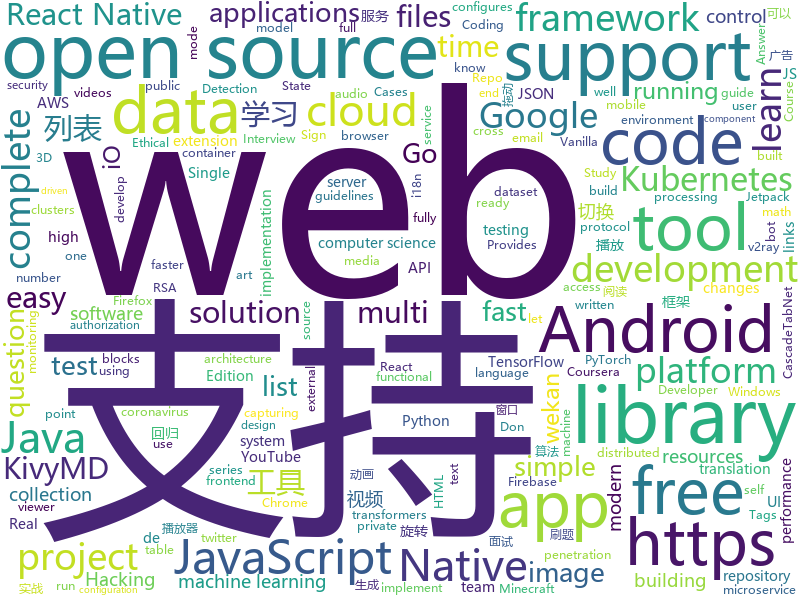

# 2020-08-25
See what the GitHub community is most excited about.

## python
+ [CascadeTabNet](https://github.com/DevashishPrasad/CascadeTabNet)(**60 stars today**): This repository contains the code and implementation details of the CascadeTabNet paper "CascadeTabNet: An approach for end to end table detection and structure recognition from image-based documents"
+ [sudoku-solver](https://github.com/remi2257/sudoku-solver)(**98 stars today**): Smart solution to solve sudoku in VR
+ [CS-Notes](https://github.com/huangrt01/CS-Notes)(**60 stars today**): 我的自学笔记，在学习shell和MLSys，整理C++、算法、操作系统，后续学习分布式系统，终身更新。
+ [YouTube-Livestream-Botter](https://github.com/KevinLage/YouTube-Livestream-Botter)(**7 stars today**): Simple tool to bot viewers to a YouTube Livestream!
+ [TensorFlowTTS](https://github.com/TensorSpeech/TensorFlowTTS)(**116 stars today**): 😝TensorFlowTTS: Real-Time State-of-the-art Speech Synthesis for Tensorflow 2 (supported including English, Korean, Chinese and Easy to adapt for other languages)
+ [scikit-learn](https://github.com/scikit-learn/scikit-learn)(**17 stars today**): scikit-learn: machine learning in Python
+ [hackingtool](https://github.com/Z4nzu/hackingtool)(**23 stars today**): ALL IN ONE Hacking Tool For Hackers
+ [text](https://github.com/pytorch/text)(**9 stars today**): Data loaders and abstractions for text and NLP
+ [manim](https://github.com/3b1b/manim)(**97 stars today**): Animation engine for explanatory math videos
+ [transformers](https://github.com/huggingface/transformers)(**77 stars today**): 🤗Transformers: State-of-the-art Natural Language Processing for Pytorch and TensorFlow 2.0.
+ [optuna](https://github.com/optuna/optuna)(**66 stars today**): A hyperparameter optimization framework
+ [luminaire](https://github.com/zillow/luminaire)(**12 stars today**): Luminaire is a python package that provides ML driven solutions for monitoring time series data.
+ [yfinance](https://github.com/ranaroussi/yfinance)(**107 stars today**): Yahoo! Finance market data downloader (+faster Pandas Datareader)
+ [kivy](https://github.com/kivy/kivy)(**7 stars today**): Open source UI framework written in Python, running on Windows, Linux, macOS, Android and iOS
+ [pyTelegramBotAPI](https://github.com/eternnoir/pyTelegramBotAPI)(**14 stars today**): Python Telegram bot api.
+ [compose](https://github.com/docker/compose)(**14 stars today**): Define and run multi-container applications with Docker
+ [audioset_tagging_cnn](https://github.com/qiuqiangkong/audioset_tagging_cnn)(**7 stars today**): 
+ [bert4keras](https://github.com/bojone/bert4keras)(**15 stars today**): keras implement of transformers for humans
+ [scan-for-webcams](https://github.com/JettChenT/scan-for-webcams)(**9 stars today**): scan for webcams on the internet
+ [CppCoreGuidelines](https://github.com/isocpp/CppCoreGuidelines)(**13 stars today**): The C++ Core Guidelines are a set of tried-and-true guidelines, rules, and best practices about coding in C++
+ [KivyMD](https://github.com/kivymd/KivyMD)(**6 stars today**): KivyMD is a collection of Material Design compliant widgets for use with Kivy, a framework for cross-platform, touch-enabled graphical applications. https://youtube.com/c/KivyMD https://twitter.com/KivyMD https://habr.com/ru/users/kivymd https://stackoverflow.com/tags/kivymd
+ [InterHand2.6M](https://github.com/facebookresearch/InterHand2.6M)(**28 stars today**): Official PyTorch implementation of "InterHand2.6M: A Dataset and Baseline for 3D Interacting Hand Pose Estimation from a Single RGB Image", ECCV 2020
+ [NudeNet](https://github.com/notAI-tech/NudeNet)(**20 stars today**): Neural Nets for Nudity Detection and Censoring
+ [fastapi](https://github.com/tiangolo/fastapi)(**66 stars today**): FastAPI framework, high performance, easy to learn, fast to code, ready for production
+ [localstack](https://github.com/localstack/localstack)(**22 stars today**): 💻A fully functional local AWS cloud stack. Develop and test your cloud & Serverless apps offline!

## java
+ [JavaGuide](https://github.com/Snailclimb/JavaGuide)(**94 stars today**): 「Java学习+面试指南」一份涵盖大部分Java程序员所需要掌握的核心知识。
+ [spring-authorization-server](https://github.com/spring-projects-experimental/spring-authorization-server)(**47 stars today**): A community-driven project led by the Spring Security team and is focused on delivering Authorization Server support to the Spring community
+ [sqli](https://github.com/x-ream/sqli)(**80 stars today**): Simple sql interface, Criteria, CriteriaBuilder
+ [keycloak](https://github.com/keycloak/keycloak)(**16 stars today**): Open Source Identity and Access Management For Modern Applications and Services
+ [beam](https://github.com/apache/beam)(**5 stars today**): Apache Beam is a unified programming model for Batch and Streaming
+ [serve](https://github.com/pytorch/serve)(**6 stars today**): Model Serving on PyTorch
+ [phonegap-plugin-push](https://github.com/phonegap/phonegap-plugin-push)(**0 stars today**): Register and receive push notifications
+ [HikariCP](https://github.com/brettwooldridge/HikariCP)(**14 stars today**): 光 HikariCP・A solid, high-performance, JDBC connection pool at last.
+ [Geyser](https://github.com/GeyserMC/Geyser)(**6 stars today**): A bridge/proxy allowing you to connect to Minecraft: Java Edition servers with Minecraft: Bedrock edition.
+ [Signal-Android](https://github.com/signalapp/Signal-Android)(**6 stars today**): A private messenger for Android.
+ [fastjson](https://github.com/alibaba/fastjson)(**14 stars today**): A fast JSON parser/generator for Java.
+ [resilience4j](https://github.com/resilience4j/resilience4j)(**7 stars today**): Resilience4j is a fault tolerance library designed for Java8 and functional programming
+ [react-native-navigation](https://github.com/wix/react-native-navigation)(**4 stars today**): A complete native navigation solution for React Native
+ [CameraView](https://github.com/natario1/CameraView)(**6 stars today**): 📸A well documented, high-level Android interface that makes capturing pictures and videos easy, addressing all of the common issues and needs. Real-time filters, gestures, watermarks, frame processing, RAW, output of any size.
+ [Sentinel](https://github.com/alibaba/Sentinel)(**28 stars today**): A powerful flow control component enabling reliability, resilience and monitoring for microservices. (面向云原生微服务的高可用流控防护组件)
+ [ExoPlayer](https://github.com/google/ExoPlayer)(**10 stars today**): An extensible media player for Android
+ [react-native-svg](https://github.com/react-native-community/react-native-svg)(**4 stars today**): SVG library for React Native, React Native Web, and plain React web projects.
+ [GSYVideoPlayer](https://github.com/CarGuo/GSYVideoPlayer)(**14 stars today**): 视频播放器（IJKplayer、ExoPlayer、MediaPlayer），HTTPS，支持弹幕，外挂字幕，支持滤镜、水印、gif截图，片头广告、中间广告，多个同时播放，支持基本的拖动，声音、亮度调节，支持边播边缓存，支持视频自带rotation的旋转（90,270之类），重力旋转与手动旋转的同步支持，支持列表播放 ，列表全屏动画，视频加载速度，列表小窗口支持拖动，动画效果，调整比例，多分辨率切换，支持切换播放器，进度条小窗口预览，列表切换详情页面无缝播放，rtsp、concat、mpeg。
+ [RIBs](https://github.com/uber/RIBs)(**7 stars today**): Uber's cross-platform mobile architecture framework.
+ [cordova-plugin-inappbrowser](https://github.com/apache/cordova-plugin-inappbrowser)(**0 stars today**): Apache Cordova Plugin inappbrowser
+ [flink](https://github.com/apache/flink)(**17 stars today**): Apache Flink
+ [react-native-track-player](https://github.com/react-native-kit/react-native-track-player)(**5 stars today**): A fully fledged audio module created for music apps. Provides audio playback, external media controls, chromecast support, background mode and more!
+ [MyBookshelf](https://github.com/gedoor/MyBookshelf)(**18 stars today**): 阅读是一款可以自定义来源阅读网络内容的工具，为广大网络文学爱好者提供一种方便、快捷舒适的试读体验。
+ [androidx](https://github.com/androidx/androidx)(**19 stars today**): Development environment for Jetpack Android extension libraries. Synchronized with Jetpack's primary development branch on AOSP.
+ [elasticsearch](https://github.com/elastic/elasticsearch)(**25 stars today**): Open Source, Distributed, RESTful Search Engine

## unknown
+ [PENTESTING-BIBLE](https://github.com/blaCCkHatHacEEkr/PENTESTING-BIBLE)(**83 stars today**): Updates to this repository will continue to arrive until the number of links reaches 10000 links & 10000 pdf files .Learn Ethical Hacking and penetration testing .hundreds of ethical hacking & penetration testing & red team & cyber security & computer science resources.
+ [mit-15-003-data-science-tools](https://github.com/shervinea/mit-15-003-data-science-tools)(**122 stars today**): Study guides for MIT's 15.003 Data Science Tools
+ [Deep-learning-books](https://github.com/loveunk/Deep-learning-books)(**232 stars today**): Books for machine learning, deep learning, math, NLP, CV, RL, etc
+ [desafio-4-2020](https://github.com/maratonadev-br/desafio-4-2020)(**13 stars today**): 
+ [awesome-made-by-brazilians](https://github.com/felipefialho/awesome-made-by-brazilians)(**156 stars today**): 🇧🇷A collection of amazing open source projects built by brazilian developers
+ [desafio-3-2020](https://github.com/maratonadev-br/desafio-3-2020)(**12 stars today**): 
+ [open-source-cs](https://github.com/ForrestKnight/open-source-cs)(**41 stars today**): Video discussing this curriculum:
+ [coding-interview-university](https://github.com/jwasham/coding-interview-university)(**168 stars today**): A complete computer science study plan to become a software engineer.
+ [rpi-wifi](https://github.com/lukicdarkoo/rpi-wifi)(**52 stars today**): Configures simultaneous AP and Managed Mode Wifi on Raspberry Pi
+ [osw-fs-windows](https://github.com/Wenzel/osw-fs-windows)(**15 stars today**): A git history of Windows filesystems
+ [what-happens-when](https://github.com/alex/what-happens-when)(**26 stars today**): An attempt to answer the age old interview question "What happens when you type google.com into your browser and press enter?"
+ [covid-19-data](https://github.com/nytimes/covid-19-data)(**6 stars today**): An ongoing repository of data on coronavirus cases and deaths in the U.S.
+ [Flutter-Course-Resources](https://github.com/londonappbrewery/Flutter-Course-Resources)(**8 stars today**): Learn to Code While Building Apps - The Complete Flutter Development Bootcamp
+ [COVID-19](https://github.com/CSSEGISandData/COVID-19)(**9 stars today**): Novel Coronavirus (COVID-19) Cases, provided by JHU CSSE
+ [you-dont-know-js-ru](https://github.com/azat-io/you-dont-know-js-ru)(**7 stars today**): 📚Russian translation of "You Don't Know JS" book series
+ [tutoriais-tecnologia](https://github.com/Grupo-OpenCV-BR/tutoriais-tecnologia)(**10 stars today**): Guia rápido de estudo Visão computacional e processamento de imagens.
+ [bootcamp-2020](https://github.com/panacloud/bootcamp-2020)(**2 stars today**): 
+ [iPhoneOSDeviceSupport](https://github.com/filsv/iPhoneOSDeviceSupport)(**3 stars today**): Xcode iPhoneOS DeviceSupport files (6.0 - 14.0)
+ [api-guidelines](https://github.com/microsoft/api-guidelines)(**11 stars today**): Microsoft REST API Guidelines
+ [NewGrad-2021](https://github.com/Pitt-CSC/NewGrad-2021)(**17 stars today**): A collection of New Grad full time roles in SWE, Quant, and PM.
+ [Micro8](https://github.com/Micropoor/Micro8)(**5 stars today**): Gitbook
+ [datasharing](https://github.com/jtleek/datasharing)(**2 stars today**): The Leek group guide to data sharing
+ [computer-science](https://github.com/ossu/computer-science)(**46 stars today**): 🎓Path to a free self-taught education in Computer Science!
+ [You-Dont-Know-JS](https://github.com/getify/You-Dont-Know-JS)(**43 stars today**): A book series on JavaScript. @YDKJS on twitter.
+ [awesome-distributed-systems](https://github.com/theanalyst/awesome-distributed-systems)(**7 stars today**): A curated list to learn about distributed systems

## javascript
+ [nsfw-filter](https://github.com/nsfw-filter/nsfw-filter)(**74 stars today**): A Google Chrome / Firefox extension that blocks NSFW images from the web pages that you load using TensorFlow JS.
+ [fullstack-course4](https://github.com/jhu-ep-coursera/fullstack-course4)(**17 stars today**): Example code for HTML, CSS, and Javascript for Web Developers Coursera Course
+ [shapez.io](https://github.com/tobspr/shapez.io)(**122 stars today**): shapez.io is an open source base building game inspired by factorio! Available on web & desktop
+ [three.js](https://github.com/mrdoob/three.js)(**43 stars today**): JavaScript 3D library.
+ [plyr](https://github.com/sampotts/plyr)(**33 stars today**): A simple HTML5, YouTube and Vimeo player
+ [Rocket.Chat](https://github.com/RocketChat/Rocket.Chat)(**29 stars today**): The ultimate Free Open Source Solution for team communications.
+ [generator-jhipster](https://github.com/jhipster/generator-jhipster)(**15 stars today**): JHipster is a development platform to quickly generate, develop, & deploy modern web applications & microservice architectures.
+ [snowpack](https://github.com/pikapkg/snowpack)(**41 stars today**): The faster frontend build tool. Unbundled web development✌️
+ [react-native-firebase](https://github.com/invertase/react-native-firebase)(**16 stars today**): 🔥A well-tested feature-rich modular Firebase implementation for React Native. Supports both iOS & Android platforms for all Firebase services.
+ [home-assistant-config](https://github.com/basnijholt/home-assistant-config)(**75 stars today**): My Home Assistant config files and AppDaemon apps🏠🤖
+ [wekan](https://github.com/wekan/wekan)(**8 stars today**): The open-source kanban (built with Meteor). Keep variable/table/field names camelCase. For translations, only add Pull Request changes to wekan/i18n/en.i18n.json , other translations are done at https://transifex.com/wekan/wekan only.
+ [hiring-without-whiteboards](https://github.com/poteto/hiring-without-whiteboards)(**98 stars today**): ⭐️Companies that don't have a broken hiring process
+ [odoo](https://github.com/odoo/odoo)(**15 stars today**): Odoo. Open Source Apps To Grow Your Business.
+ [markdown-here](https://github.com/adam-p/markdown-here)(**24 stars today**): Google Chrome, Firefox, and Thunderbird extension that lets you write email in Markdown and render it before sending.
+ [cypress](https://github.com/cypress-io/cypress)(**44 stars today**): Fast, easy and reliable testing for anything that runs in a browser.
+ [reactjs-interview-questions](https://github.com/sudheerj/reactjs-interview-questions)(**20 stars today**): List of top 500 ReactJS Interview Questions & Answers....Coding exercise questions are coming soon!!
+ [tailblocks](https://github.com/mertJF/tailblocks)(**29 stars today**): 🎉Ready-to-use Tailwind CSS blocks.
+ [complete-javascript-course](https://github.com/jonasschmedtmann/complete-javascript-course)(**8 stars today**): Starter files, final projects and FAQ for my Complete JavaScript course
+ [microsoft-authentication-library-for-js](https://github.com/AzureAD/microsoft-authentication-library-for-js)(**2 stars today**): Microsoft Authentication Library (MSAL) for JS
+ [potree](https://github.com/potree/potree)(**6 stars today**): WebGL point cloud viewer for large datasets
+ [egua](https://github.com/eguatech/egua)(**60 stars today**): 🦄Linguagem de programação simples e moderna em português
+ [create-react-app](https://github.com/facebook/create-react-app)(**41 stars today**): Set up a modern web app by running one command.
+ [cube-ui](https://github.com/didi/cube-ui)(**5 stars today**): 🔶A fantastic mobile ui lib implement by Vue
+ [degoogle](https://github.com/tycrek/degoogle)(**61 stars today**): A huge list of alternatives to Google products. Privacy tips, tricks, and links.
+ [awx](https://github.com/ansible/awx)(**10 stars today**): AWX Project

## html
+ [msfs-a320neo](https://github.com/wpine215/msfs-a320neo)(**100 stars today**): 
+ [lectures](https://github.com/uo-ec607/lectures)(**14 stars today**): Lecture notes for EC 607
+ [laravel-ui-adminlte](https://github.com/InfyOmLabs/laravel-ui-adminlte)(**10 stars today**): Laravel UI Frontend Preset for AdminLTE
+ [machine-learning-systems-design](https://github.com/chiphuyen/machine-learning-systems-design)(**10 stars today**): A booklet on machine learning systems design with exercises
+ [fastText](https://github.com/facebookresearch/fastText)(**7 stars today**): Library for fast text representation and classification.
+ [electron-api-demos](https://github.com/electron/electron-api-demos)(**6 stars today**): Explore the Electron APIs
+ [keep-a-changelog](https://github.com/olivierlacan/keep-a-changelog)(**3 stars today**): If you build software, keep a changelog.
+ [phpstan](https://github.com/phpstan/phpstan)(**12 stars today**): PHP Static Analysis Tool - discover bugs in your code without running it!
+ [Java-Interview-Advanced](https://github.com/shishan100/Java-Interview-Advanced)(**10 stars today**): 中华石杉--互联网Java进阶面试训练营
+ [pcc_2e](https://github.com/ehmatthes/pcc_2e)(**3 stars today**): Online resources for Python Crash Course (Second Edition), from No Starch Press
+ [responsive-html-email-template](https://github.com/leemunroe/responsive-html-email-template)(**4 stars today**): A free simple responsive HTML email template
+ [datasciencecoursera](https://github.com/mGalarnyk/datasciencecoursera)(**1 stars today**): Data Science Repo and blog for John Hopkins Coursera Courses. Please let me know if you have any questions.
+ [volt-bootstrap-5-dashboard](https://github.com/themesberg/volt-bootstrap-5-dashboard)(**116 stars today**): ⚡️Volt is a free and open-source Bootstrap 5 Admin Dashboard using only Vanilla Javascript
+ [from-docker-to-kubernetes](https://github.com/DevOps-Girls/from-docker-to-kubernetes)(****): A self-paced workshop from Docker basics to Kubernetes
+ [jsrsasign](https://github.com/kjur/jsrsasign)(**3 stars today**): The 'jsrsasign' (RSA-Sign JavaScript Library) is an opensource free cryptography library supporting RSA/RSAPSS/ECDSA/DSA signing/validation, ASN.1, PKCS#1/5/8 private/public key, X.509 certificate, CRL, OCSP, CMS SignedData, TimeStamp, CAdES JSON Web Signature/Token in pure JavaScript.
+ [Machine-Learning](https://github.com/Jack-Cherish/Machine-Learning)(**6 stars today**): ⚡机器学习实战（Python3）：kNN、决策树、贝叶斯、逻辑回归、SVM、线性回归、树回归
+ [zju-icicles](https://github.com/QSCTech/zju-icicles)(**24 stars today**): 浙江大学课程攻略共享计划
+ [va.gov-team](https://github.com/department-of-veterans-affairs/va.gov-team)(**0 stars today**): Public resources for building on and in support of VA.gov. Visit complete Knowledge Hub:
+ [free-for-dev](https://github.com/ripienaar/free-for-dev)(**32 stars today**): A list of SaaS, PaaS and IaaS offerings that have free tiers of interest to devops and infradev
+ [personal-website](https://github.com/github/personal-website)(**7 stars today**): Code that'll help you kickstart a personal website that showcases your work as a software developer.
+ [tagify](https://github.com/yairEO/tagify)(**3 stars today**): 🔖lightweight, efficient Tags input component in Vanilla JS / React / Angular / Vue
+ [boost](https://github.com/boostorg/boost)(**3 stars today**): Super-project for modularized Boost
+ [v2-ui](https://github.com/sprov065/v2-ui)(**9 stars today**): 支持多协议多用户的 v2ray 面板，Support multi-protocol multi-user v2ray panel
+ [tidytuesday](https://github.com/rfordatascience/tidytuesday)(**12 stars today**): Official repo for the #tidytuesday project
+ [calico](https://github.com/projectcalico/calico)(**6 stars today**): Cloud native networking and network security

## go
+ [packer](https://github.com/hashicorp/packer)(**7 stars today**): Packer is a tool for creating identical machine images for multiple platforms from a single source configuration.
+ [Amass](https://github.com/OWASP/Amass)(**24 stars today**): In-depth Attack Surface Mapping and Asset Discovery
+ [traefik](https://github.com/containous/traefik)(**29 stars today**): The Cloud Native Edge Router
+ [lotus](https://github.com/filecoin-project/lotus)(**6 stars today**): Implementation of the Filecoin protocol, written in Go
+ [go-zero](https://github.com/tal-tech/go-zero)(**92 stars today**): go-zero是一个集成了各种工程实践的web和rpc框架。通过弹性设计保障了大并发服务端的稳定性，经受了充分的实战检验。包含极简的API定义和生成工具，可以一键生成Go, iOS, Android, Dart, TypeScript, JavaScript代码，并可直接运行。
+ [ksubdomain](https://github.com/knownsec/ksubdomain)(**110 stars today**): 无状态子域名爆破工具
+ [go-micro](https://github.com/micro/go-micro)(**25 stars today**): A Go standard library for microservices
+ [prometheus-operator](https://github.com/prometheus-operator/prometheus-operator)(**6 stars today**): Prometheus Operator creates/configures/manages Prometheus clusters atop Kubernetes
+ [ent](https://github.com/facebook/ent)(**283 stars today**): An entity framework for Go
+ [authelia](https://github.com/authelia/authelia)(**24 stars today**): The Single Sign-On Multi-Factor portal for web apps
+ [decimal](https://github.com/shopspring/decimal)(**4 stars today**): Arbitrary-precision fixed-point decimal numbers in go
+ [external-dns](https://github.com/kubernetes-sigs/external-dns)(**3 stars today**): Configure external DNS servers (AWS Route53, Google CloudDNS and others) for Kubernetes Ingresses and Services
+ [client_golang](https://github.com/prometheus/client_golang)(**5 stars today**): Prometheus instrumentation library for Go applications
+ [gardener](https://github.com/gardener/gardener)(**2 stars today**): Kubernetes-native system managing the full lifecycle of conformant Kubernetes clusters as a service on Alicloud, AWS, Azure, GCP, OpenStack, Packet, MetalStack, and vSphere with minimal TCO.
+ [kubernetes](https://github.com/kubernetes/kubernetes)(**55 stars today**): Production-Grade Container Scheduling and Management
+ [cloud-on-k8s](https://github.com/elastic/cloud-on-k8s)(**4 stars today**): Elastic Cloud on Kubernetes
+ [minio](https://github.com/minio/minio)(**32 stars today**): High Performance, Kubernetes Native Object Storage
+ [algorithm-pattern](https://github.com/greyireland/algorithm-pattern)(**104 stars today**): 算法模板，最科学的刷题方式，最快速的刷题路径，你值得拥有~
+ [node_exporter](https://github.com/prometheus/node_exporter)(**7 stars today**): Exporter for machine metrics
+ [origin](https://github.com/openshift/origin)(**3 stars today**): Conformance test suite for OpenShift
+ [kratos](https://github.com/go-kratos/kratos)(**18 stars today**): Kratos是bilibili开源的一套Go微服务框架，包含大量微服务相关框架及工具。
+ [casbin](https://github.com/casbin/casbin)(**9 stars today**): An authorization library that supports access control models like ACL, RBAC, ABAC in Golang
+ [vault-k8s](https://github.com/hashicorp/vault-k8s)(**3 stars today**): First-class support for Vault and Kubernetes.
+ [argo-cd](https://github.com/argoproj/argo-cd)(**10 stars today**): Declarative continuous deployment for Kubernetes.
+ [goreplay](https://github.com/buger/goreplay)(**10 stars today**): GoReplay is an open-source tool for capturing and replaying live HTTP traffic into a test environment in order to continuously test your system with real data. It can be used to increase confidence in code deployments, configuration changes and infrastructure changes.

## WordCloud

