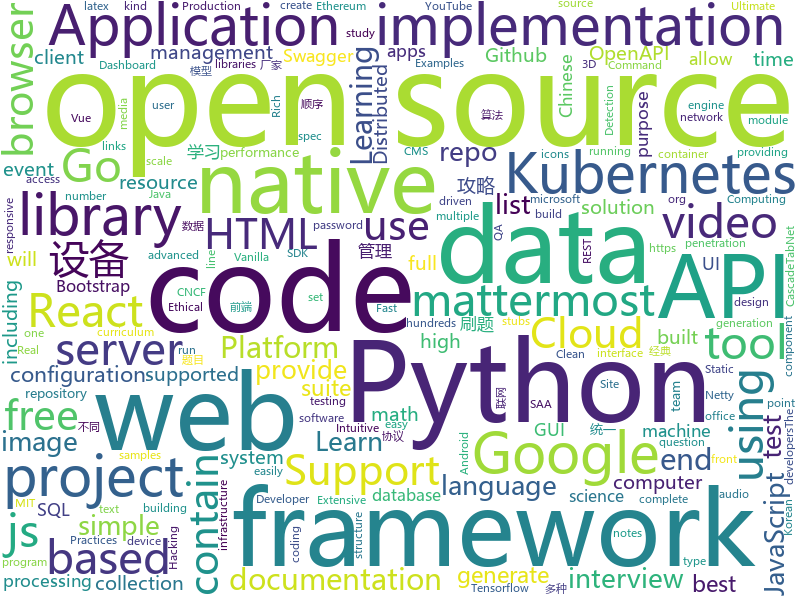

# 2020-08-26
See what the GitHub community is most excited about.

## python
+ [RAFT](https://github.com/princeton-vl/RAFT)(**51 stars today**): 
+ [latexify_py](https://github.com/google/latexify_py)(**116 stars today**): Generates LaTeX math description from Python functions.
+ [Gooey](https://github.com/chriskiehl/Gooey)(**61 stars today**): Turn (almost) any Python command line program into a full GUI application with one line
+ [YouTube-Livestream-Botter](https://github.com/KevinLage/YouTube-Livestream-Botter)(**38 stars today**): Simple tool to bot viewers to a YouTube Livestream!
+ [CascadeTabNet](https://github.com/DevashishPrasad/CascadeTabNet)(**53 stars today**): This repository contains the code and implementation details of the CascadeTabNet paper "CascadeTabNet: An approach for end to end table detection and structure recognition from image-based documents"
+ [CS-Notes](https://github.com/huangrt01/CS-Notes)(**109 stars today**): 我的自学笔记，在学习shell和MLSys，整理C++、算法、操作系统，后续学习分布式系统，终身更新。
+ [l5kit](https://github.com/lyft/l5kit)(**19 stars today**): L5Kit - level5.lyft.com
+ [manim](https://github.com/3b1b/manim)(**89 stars today**): Animation engine for explanatory math videos
+ [TecoGAN](https://github.com/thunil/TecoGAN)(**187 stars today**): This repo will contain source code and materials for the TecoGAN project, i.e. code for a TEmporally COherent GAN
+ [Super-Fast-Accurate-3D-Object-Detection](https://github.com/maudzung/Super-Fast-Accurate-3D-Object-Detection)(**77 stars today**): Super Fast and Accurate 3D Object Detection based on 3D LiDAR Point Clouds (The PyTorch implementation)
+ [black](https://github.com/psf/black)(**16 stars today**): The uncompromising Python code formatter
+ [nlp-recipes](https://github.com/microsoft/nlp-recipes)(**11 stars today**): Natural Language Processing Best Practices & Examples
+ [Ball-Balancing-PID-System](https://github.com/JohanLink/Ball-Balancing-PID-System)(**5 stars today**): 
+ [salt](https://github.com/saltstack/salt)(**5 stars today**): Software to automate the management and configuration of any infrastructure or application at scale. Get access to the Salt software package repository here:
+ [EasyOCR](https://github.com/JaidedAI/EasyOCR)(**59 stars today**): Ready-to-use OCR with 40+ languages supported including Chinese, Japanese, Korean and Thai
+ [video2x](https://github.com/k4yt3x/video2x)(**19 stars today**): A lossless video/GIF/image upscaler achieved with waifu2x, Anime4K, SRMD and RealSR. Started in Hack the Valley 2, 2018.
+ [handcalcs](https://github.com/connorferster/handcalcs)(**59 stars today**): Python library for converting Python calculations into rendered latex.
+ [TensorFlowTTS](https://github.com/TensorSpeech/TensorFlowTTS)(**117 stars today**): 😝TensorFlowTTS: Real-Time State-of-the-art Speech Synthesis for Tensorflow 2 (supported including English, Korean, Chinese and Easy to adapt for other languages)
+ [scan-for-webcams](https://github.com/JettChenT/scan-for-webcams)(**9 stars today**): scan for webcams on the internet
+ [azure-cli](https://github.com/Azure/azure-cli)(**5 stars today**): Azure Command-Line Interface
+ [redis-py](https://github.com/andymccurdy/redis-py)(**3 stars today**): Redis Python Client
+ [PaddleHub](https://github.com/PaddlePaddle/PaddleHub)(**37 stars today**): Toolkit for Pre-trained Model Application of PaddlePaddle（『飞桨』预训练模型应用工具 ）
+ [PySimpleGUI](https://github.com/PySimpleGUI/PySimpleGUI)(**17 stars today**): Launched in 2018 Actively developed and supported. Supports tkinter, Qt, WxPython, Remi (in browser). Create custom layout GUI's simply. Python 2.7 & 3 Support. 200+ Demo programs & Cookbook for rapid start. Extensive documentation. Examples using Machine Learning(GUI, OpenCV Integration, Chatterbot), Floating Desktop Widgets, Matplotlib + Pyplo…
+ [system-design-primer](https://github.com/donnemartin/system-design-primer)(**78 stars today**): Learn how to design large-scale systems. Prep for the system design interview. Includes Anki flashcards.
+ [rich](https://github.com/willmcgugan/rich)(**27 stars today**): Rich is a Python library for rich text and beautiful formatting in the terminal.

## java
+ [react-native-navigation](https://github.com/wix/react-native-navigation)(**7 stars today**): A complete native navigation solution for React Native
+ [user-interface-samples](https://github.com/android/user-interface-samples)(**6 stars today**): Multiple samples showing the best practices in the user interface on Android.
+ [selenium](https://github.com/SeleniumHQ/selenium)(**17 stars today**): A browser automation framework and ecosystem.
+ [sqli](https://github.com/x-ream/sqli)(**80 stars today**): Simple sql interface, Criteria, CriteriaBuilder
+ [spring-boot](https://github.com/spring-projects/spring-boot)(**35 stars today**): Spring Boot
+ [BurpSuiteLoader](https://github.com/x-Ai/BurpSuiteLoader)(**16 stars today**): Burp Suite loader version --> ∞
+ [keycloak](https://github.com/keycloak/keycloak)(**11 stars today**): Open Source Identity and Access Management For Modern Applications and Services
+ [spring-framework](https://github.com/spring-projects/spring-framework)(**26 stars today**): Spring Framework
+ [jitsi-videobridge](https://github.com/jitsi/jitsi-videobridge)(**3 stars today**): Jitsi Videobridge is a WebRTC compatible video router or SFU that lets build highly scalable video conferencing infrastructure (i.e., up to hundreds of conferences per server).
+ [kafka](https://github.com/apache/kafka)(**14 stars today**): Mirror of Apache Kafka
+ [canal](https://github.com/alibaba/canal)(**17 stars today**): 阿里巴巴 MySQL binlog 增量订阅&消费组件
+ [openapi-generator](https://github.com/OpenAPITools/openapi-generator)(**14 stars today**): OpenAPI Generator allows generation of API client libraries (SDK generation), server stubs, documentation and configuration automatically given an OpenAPI Spec (v2, v3)
+ [hazelcast](https://github.com/hazelcast/hazelcast)(**3 stars today**): Open Source In-Memory Data Grid
+ [testcontainers-java](https://github.com/testcontainers/testcontainers-java)(**4 stars today**): Testcontainers is a Java library that supports JUnit tests, providing lightweight, throwaway instances of common databases, Selenium web browsers, or anything else that can run in a Docker container.
+ [guava](https://github.com/google/guava)(**14 stars today**): Google core libraries for Java
+ [react-native-video](https://github.com/react-native-community/react-native-video)(**2 stars today**): A <Video /> component for react-native
+ [retrofit](https://github.com/square/retrofit)(**11 stars today**): A type-safe HTTP client for Android and the JVM
+ [dbeaver](https://github.com/dbeaver/dbeaver)(**21 stars today**): Free universal database tool and SQL client
+ [react-native-track-player](https://github.com/react-native-kit/react-native-track-player)(**5 stars today**): A fully fledged audio module created for music apps. Provides audio playback, external media controls, chromecast support, background mode and more!
+ [ksql](https://github.com/confluentinc/ksql)(**3 stars today**): The event streaming database purpose-built for stream processing applications
+ [dubbo](https://github.com/apache/dubbo)(**16 stars today**): Apache Dubbo is a high-performance, java based, open source RPC framework.
+ [react-native-image-picker](https://github.com/react-native-community/react-native-image-picker)(**5 stars today**): 🌄A React Native module that allows you to use native UI to select media from the device library or directly from the camera.
+ [netty](https://github.com/netty/netty)(**14 stars today**): Netty project - an event-driven asynchronous network application framework
+ [jetlinks-community](https://github.com/jetlinks/jetlinks-community)(**5 stars today**): JetLinks 基于Java8,Spring Boot 2.x ,WebFlux,Netty,Vert.x,Reactor等开发, 是一个全响应式的物联网平台。支持统一物模型管理,多种设备,多种厂家,统一管理。统一设备连接管理,多协议适配(TCP,MQTT,UDP,CoAP,HTTP等),屏蔽网络编程复杂性,灵活接入不同厂家不同协议等设备。实时数据处理,设备告警,消息通知,数据转发。地理位置,数据可视化等。能帮助你快速建立物联网相关业务系统。
+ [mybatis-3](https://github.com/mybatis/mybatis-3)(**12 stars today**): MyBatis SQL mapper framework for Java

## unknown
+ [open-source-cs-python](https://github.com/ForrestKnight/open-source-cs-python)(**167 stars today**): 
+ [mit-15-003-data-science-tools](https://github.com/shervinea/mit-15-003-data-science-tools)(**110 stars today**): Study guides for MIT's 15.003 Data Science Tools
+ [PENTESTING-BIBLE](https://github.com/blaCCkHatHacEEkr/PENTESTING-BIBLE)(**193 stars today**): Updates to this repository will continue to arrive until the number of links reaches 10000 links & 10000 pdf files .Learn Ethical Hacking and penetration testing .hundreds of ethical hacking & penetration testing & red team & cyber security & computer science resources.
+ [open-source-cs](https://github.com/ForrestKnight/open-source-cs)(**58 stars today**): Video discussing this curriculum:
+ [coding-interview-university](https://github.com/jwasham/coding-interview-university)(**360 stars today**): A complete computer science study plan to become a software engineer.
+ [AWS-SAA-C02-Course](https://github.com/alozano-77/AWS-SAA-C02-Course)(**11 stars today**): Personal notes for SAA-C02 test from: https://learn.cantrill.io
+ [kubernetes-examples](https://github.com/ContainerSolutions/kubernetes-examples)(**39 stars today**): Minimal self-contained examples of standard Kubernetes features and patterns in YAML
+ [Deep-learning-books](https://github.com/loveunk/Deep-learning-books)(**179 stars today**): Books for machine learning, deep learning, math, NLP, CV, RL, etc
+ [NewGrad-2021](https://github.com/Pitt-CSC/NewGrad-2021)(**19 stars today**): A collection of New Grad full time roles in SWE, Quant, and PM.
+ [free-books](https://github.com/ruanyf/free-books)(**27 stars today**): 互联网上的免费书籍
+ [CKAD-exercises](https://github.com/dgkanatsios/CKAD-exercises)(**9 stars today**): A set of exercises to prepare for Certified Kubernetes Application Developer exam by Cloud Native Computing Foundation
+ [deadmatterdedisetup](https://github.com/johnnyguitarFP/deadmatterdedisetup)(**2 stars today**): 
+ [reverse-interview](https://github.com/viraptor/reverse-interview)(**47 stars today**): Questions to ask the company during your interview
+ [QA_bible](https://github.com/Vladislav610/QA_bible)(**3 stars today**): Библия QA/тестировщика это 200++ страниц обновляемой смеси ответов на вопросы с реальных собеседований на QA, перевода интересного контента с зарубежных ресурсов и агрегации материала с отечественных.
+ [awesome-made-by-brazilians](https://github.com/felipefialho/awesome-made-by-brazilians)(**160 stars today**): 🇧🇷A collection of amazing open source projects built by brazilian developers
+ [Specs](https://github.com/CocoaPods/Specs)(**1 stars today**): The CocoaPods Master Repo
+ [QuantumultX](https://github.com/nzw9314/QuantumultX)(**4 stars today**): QuantumultX
+ [leetcode-master](https://github.com/youngyangyang04/leetcode-master)(**9 stars today**): LeetCode 刷题攻略：配思维导图，各个类型的经典题目刷题顺序、经典算法模板，以及详细图解和视频题解。这里精选的题目都不是孤立的，而是由浅入深一脉相承的，相信只要按照刷题攻略上的顺序来学习，一定会有所收获！
+ [leetcode](https://github.com/grandyang/leetcode)(**16 stars today**): Provide all my solutions and explanations in Chinese for all the Leetcode coding problems.
+ [desafio-4-2020](https://github.com/maratonadev-br/desafio-4-2020)(**14 stars today**): 
+ [awesome](https://github.com/sindresorhus/awesome)(**119 stars today**): 😎Awesome lists about all kinds of interesting topics
+ [kubernetes-the-hard-way](https://github.com/kelseyhightower/kubernetes-the-hard-way)(**24 stars today**): Bootstrap Kubernetes the hard way on Google Cloud Platform. No scripts.
+ [what-happens-when](https://github.com/alex/what-happens-when)(**40 stars today**): An attempt to answer the age old interview question "What happens when you type google.com into your browser and press enter?"
+ [msgpack-c](https://github.com/msgpack/msgpack-c)(**3 stars today**): MessagePack implementation for C and C++ / msgpack.org[C/C++]
+ [awesome-made-by-russians](https://github.com/igoradamenko/awesome-made-by-russians)(**30 stars today**): 🇷🇺The best open source projects that were made and mainly contributed by Russian developers

## javascript
+ [Rocket.Chat](https://github.com/RocketChat/Rocket.Chat)(**19 stars today**): The ultimate Free Open Source Solution for team communications.
+ [json-server](https://github.com/typicode/json-server)(**27 stars today**): Get a full fake REST API with zero coding in less than 30 seconds (seriously)
+ [plyr](https://github.com/sampotts/plyr)(**57 stars today**): A simple HTML5, YouTube and Vimeo player
+ [wtfjs](https://github.com/denysdovhan/wtfjs)(**53 stars today**): 🤪A list of funny and tricky JavaScript examples
+ [heroicons](https://github.com/tailwindlabs/heroicons)(**236 stars today**): A set of free MIT-licensed high-quality SVG icons for UI development.
+ [Daily-Interview-Question](https://github.com/Advanced-Frontend/Daily-Interview-Question)(**29 stars today**): 我是木易杨，公众号「高级前端进阶」作者，每天搞定一道前端大厂面试题，祝大家天天进步，一年后会看到不一样的自己。
+ [nuxt.js](https://github.com/nuxt/nuxt.js)(**27 stars today**): The Intuitive Vue Framework
+ [office-docs-powershell](https://github.com/MicrosoftDocs/office-docs-powershell)(**0 stars today**): PowerShell Reference for Office Products - Short URL: aka.ms/office-powershell
+ [next.js](https://github.com/vercel/next.js)(**53 stars today**): The React Framework
+ [fullstack-course4](https://github.com/jhu-ep-coursera/fullstack-course4)(**19 stars today**): Example code for HTML, CSS, and Javascript for Web Developers Coursera Course
+ [danfojs](https://github.com/opensource9ja/danfojs)(**52 stars today**): danfo.js is an open source, JavaScript library providing high performance, intuitive, and easy to use data structures for manipulating and processing structured data.
+ [password-manager-resources](https://github.com/apple/password-manager-resources)(**19 stars today**): A place for creators and users of password managers to collaborate on resources to make password management better.
+ [fall-2020](https://github.com/OU-PhD-Econometrics/fall-2020)(**9 stars today**): 
+ [amphtml](https://github.com/ampproject/amphtml)(**5 stars today**): The AMP web component framework.
+ [bootstrap-datepicker](https://github.com/uxsolutions/bootstrap-datepicker)(**4 stars today**): A datepicker for twitter bootstrap (@twbs)
+ [react-native](https://github.com/facebook/react-native)(**33 stars today**): A framework for building native apps with React.
+ [clean-code-javascript](https://github.com/ryanmcdermott/clean-code-javascript)(**61 stars today**): 🛁Clean Code concepts adapted for JavaScript
+ [strapi](https://github.com/strapi/strapi)(**30 stars today**): 🚀Open source Node.js Headless CMS to easily build customisable APIs
+ [hiring-without-whiteboards](https://github.com/poteto/hiring-without-whiteboards)(**67 stars today**): ⭐️Companies that don't have a broken hiring process
+ [netlify-cms](https://github.com/netlify/netlify-cms)(**4 stars today**): A Git-based CMS for Static Site Generators
+ [bootstrap-vue](https://github.com/bootstrap-vue/bootstrap-vue)(**7 stars today**): BootstrapVue provides one of the most comprehensive implementations of Bootstrap v4 for Vue.js. With extensive and automated WAI-ARIA accessibility markup.
+ [nsfw-filter](https://github.com/nsfw-filter/nsfw-filter)(**83 stars today**): A Google Chrome / Firefox extension that blocks NSFW images from the web pages that you load using TensorFlow JS.
+ [freeCodeCamp](https://github.com/freeCodeCamp/freeCodeCamp)(**61 stars today**): freeCodeCamp.org's open source codebase and curriculum. Learn to code at home.
+ [angular.js](https://github.com/angular/angular.js)(**6 stars today**): AngularJS - HTML enhanced for web apps!
+ [mattermost-webapp](https://github.com/mattermost/mattermost-webapp)(**1 stars today**): Webapp of Mattermost server: https://github.com/mattermost/mattermost-server

## html
+ [msfs-a320neo](https://github.com/wpine215/msfs-a320neo)(**90 stars today**): 
+ [volt-bootstrap-5-dashboard](https://github.com/themesberg/volt-bootstrap-5-dashboard)(**153 stars today**): ⚡️Volt Bootstrap 5 Admin Dashboard Template with vanilla Javascript
+ [calico](https://github.com/projectcalico/calico)(**5 stars today**): Cloud native networking and network security
+ [Spoon-Knife](https://github.com/octocat/Spoon-Knife)(**2 stars today**): This repo is for demonstration purposes only.
+ [swagger-codegen](https://github.com/swagger-api/swagger-codegen)(**5 stars today**): swagger-codegen contains a template-driven engine to generate documentation, API clients and server stubs in different languages by parsing your OpenAPI / Swagger definition.
+ [chinese-ig](https://github.com/w3c/chinese-ig)(**2 stars today**): Web中文兴趣组
+ [twinspark-js](https://github.com/kasta-ua/twinspark-js)(**11 stars today**): Declarative enhancement for HTML: simple, composable, lean.
+ [phpstan](https://github.com/phpstan/phpstan)(**6 stars today**): PHP Static Analysis Tool - discover bugs in your code without running it!
+ [quickstart-js](https://github.com/firebase/quickstart-js)(**3 stars today**): Firebase Quickstart Samples for Web
+ [wpt](https://github.com/web-platform-tests/wpt)(**1 stars today**): Test suites for Web platform specs — including WHATWG, W3C, and others
+ [text-to-handwriting](https://github.com/saurabhdaware/text-to-handwriting)(**6 stars today**): So your teacher asked you to upload written assignments? Hate writing assigments? This tool will help you convert your text to handwriting xD
+ [simple-icons](https://github.com/simple-icons/simple-icons)(**12 stars today**): SVG icons for popular brands
+ [Front-end-Developer-Interview-Questions](https://github.com/h5bp/Front-end-Developer-Interview-Questions)(**16 stars today**): A list of helpful front-end related questions you can use to interview potential candidates, test yourself or completely ignore.
+ [skill-map](https://github.com/TeamStuQ/skill-map)(**4 stars today**): 程序员技能图谱
+ [learning-area](https://github.com/mdn/learning-area)(**3 stars today**): Github repo for the MDN Learning Area.
+ [zju-icicles](https://github.com/QSCTech/zju-icicles)(**9 stars today**): 浙江大学课程攻略共享计划
+ [free-for-dev](https://github.com/ripienaar/free-for-dev)(**56 stars today**): A list of SaaS, PaaS and IaaS offerings that have free tiers of interest to devops and infradev
+ [foundation-sites](https://github.com/foundation/foundation-sites)(**2 stars today**): The most advanced responsive front-end framework in the world. Quickly create prototypes and production code for sites that work on any kind of device.
+ [Mainroad](https://github.com/Vimux/Mainroad)(**2 stars today**): Responsive, simple, clean and content-focused Hugo theme based on the MH Magazine lite WordPress theme
+ [skill-board](https://github.com/devscollab/skill-board)(**1 stars today**): A listing board where students of PCCOE can showcase their skills and experience for the Faculty to easily find opportunities for them.
+ [curso-algebra-lineal](https://github.com/joanby/curso-algebra-lineal)(**2 stars today**): Curso de Álgebra Lineal
+ [geektime-ELK](https://github.com/onebirdrocks/geektime-ELK)(**3 stars today**): ELK Training
+ [tabler](https://github.com/tabler/tabler)(**10 stars today**): Tabler is free and open-source HTML Dashboard UI Kit built on Bootstrap
+ [keycloak-documentation](https://github.com/keycloak/keycloak-documentation)(**0 stars today**): 
+ [JavaScript30](https://github.com/wesbos/JavaScript30)(**4 stars today**): 30 Day Vanilla JS Challenge

## go
+ [packer](https://github.com/hashicorp/packer)(**80 stars today**): Packer is a tool for creating identical machine images for multiple platforms from a single source configuration.
+ [ultimate-go](https://github.com/hoanhan101/ultimate-go)(**367 stars today**): Ultimate Go study guide
+ [go](https://github.com/golang/go)(**64 stars today**): The Go programming language
+ [aws-controllers-k8s](https://github.com/aws/aws-controllers-k8s)(**156 stars today**): AWS Controllers for Kubernetes (ACK) is a project enabling you to manage AWS services from Kubernetes
+ [loki](https://github.com/grafana/loki)(**12 stars today**): Like Prometheus, but for logs.
+ [ultimate-go](https://github.com/betty200744/ultimate-go)(**108 stars today**): This repo contains my notes on working with Go and computer systems.
+ [oauth2-proxy](https://github.com/oauth2-proxy/oauth2-proxy)(**17 stars today**): A reverse proxy that provides authentication with Google, Github or other providers.
+ [origin](https://github.com/openshift/origin)(**3 stars today**): Conformance test suite for OpenShift
+ [eventnative](https://github.com/ksensehq/eventnative)(**12 stars today**): EventNative is an open-source data collection framework
+ [msfs2020-go](https://github.com/lian/msfs2020-go)(**7 stars today**): connect to microsoft flight simulator 2020 using golang
+ [quorum](https://github.com/ConsenSys/quorum)(**2 stars today**): A permissioned implementation of Ethereum supporting data privacy
+ [influxdb](https://github.com/influxdata/influxdb)(**9 stars today**): Scalable datastore for metrics, events, and real-time analytics
+ [prysm](https://github.com/prysmaticlabs/prysm)(**5 stars today**): Go implementation of the Ethereum 2.0 blockchain
+ [decimal](https://github.com/shopspring/decimal)(**6 stars today**): Arbitrary-precision fixed-point decimal numbers in go
+ [kubeedge](https://github.com/kubeedge/kubeedge)(**6 stars today**): Kubernetes Native Edge Computing Framework (project under CNCF)
+ [jaeger](https://github.com/jaegertracing/jaeger)(**7 stars today**): CNCF Jaeger, a Distributed Tracing Platform
+ [terraform-provider-google](https://github.com/hashicorp/terraform-provider-google)(**2 stars today**): Terraform Google Cloud Platform provider
+ [matterbridge](https://github.com/42wim/matterbridge)(**5 stars today**): bridge between mattermost, IRC, gitter, xmpp, slack, discord, telegram, rocketchat, steam, twitch, ssh-chat, zulip, whatsapp, keybase, matrix, microsoft teams, nextcloud and more with REST API (mattermost not required!)
+ [kubebuilder](https://github.com/kubernetes-sigs/kubebuilder)(**7 stars today**): Kubebuilder - SDK for building Kubernetes APIs using CRDs
+ [cadvisor](https://github.com/google/cadvisor)(**6 stars today**): Analyzes resource usage and performance characteristics of running containers.
+ [etcd](https://github.com/etcd-io/etcd)(**19 stars today**): Distributed reliable key-value store for the most critical data of a distributed system
+ [go-tools](https://github.com/dominikh/go-tools)(**12 stars today**): Staticcheck - The advanced Go linter
+ [swag](https://github.com/swaggo/swag)(**6 stars today**): Automatically generate RESTful API documentation with Swagger 2.0 for Go.
+ [kops](https://github.com/kubernetes/kops)(**7 stars today**): Kubernetes Operations (kops) - Production Grade K8s Installation, Upgrades, and Management
+ [httpx](https://github.com/projectdiscovery/httpx)(**2 stars today**): httpx is a fast and multi-purpose HTTP toolkit allow to run multiple probers using retryablehttp library, it is designed to maintain the result reliability with increased threads.

## WordCloud

