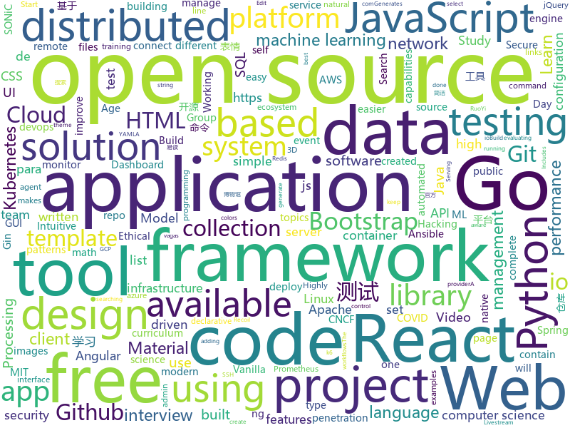

# 2020-08-27
See what the GitHub community is most excited about.

## python
+ [Gooey](https://github.com/chriskiehl/Gooey)(**155 stars today**): Turn (almost) any Python command line program into a full GUI application with one line
+ [CS-Notes](https://github.com/huangrt01/CS-Notes)(**214 stars today**): 我的自学笔记，在学习shell和MLSys，整理C++、算法、操作系统，后续学习分布式系统，终身更新。
+ [present](https://github.com/vinayak-mehta/present)(**86 stars today**): A terminal-based presentation tool with colors and effects.
+ [TecoGAN](https://github.com/thunil/TecoGAN)(**131 stars today**): This repo will contain source code and materials for the TecoGAN project, i.e. code for a TEmporally COherent GAN
+ [YouTube-Livestream-Botter](https://github.com/KevinLage/YouTube-Livestream-Botter)(**73 stars today**): Simple tool to bot viewers to a YouTube Livestream!
+ [airflow](https://github.com/apache/airflow)(**21 stars today**): Apache Airflow - A platform to programmatically author, schedule, and monitor workflows
+ [black](https://github.com/psf/black)(**20 stars today**): The uncompromising Python code formatter
+ [system-design-primer](https://github.com/donnemartin/system-design-primer)(**105 stars today**): Learn how to design large-scale systems. Prep for the system design interview. Includes Anki flashcards.
+ [spaCy](https://github.com/explosion/spaCy)(**13 stars today**): 💫Industrial-strength Natural Language Processing (NLP) with Python and Cython
+ [manim](https://github.com/3b1b/manim)(**82 stars today**): Animation engine for explanatory math videos
+ [aiohttp](https://github.com/aio-libs/aiohttp)(**6 stars today**): Asynchronous HTTP client/server framework for asyncio and Python
+ [ParlAI](https://github.com/facebookresearch/ParlAI)(**7 stars today**): A framework for training and evaluating AI models on a variety of openly available dialogue datasets.
+ [erpnext](https://github.com/frappe/erpnext)(**12 stars today**): Open Source Alternative to SAP
+ [l5kit](https://github.com/lyft/l5kit)(**12 stars today**): L5Kit - level5.lyft.com
+ [latexify_py](https://github.com/google/latexify_py)(**82 stars today**): Generates LaTeX math description from Python functions.
+ [Super-Fast-Accurate-3D-Object-Detection](https://github.com/maudzung/Super-Fast-Accurate-3D-Object-Detection)(**36 stars today**): Super Fast and Accurate 3D Object Detection based on 3D LiDAR Point Clouds (The PyTorch implementation)
+ [deepface](https://github.com/serengil/deepface)(**4 stars today**): A Lightweight Deep Face Recognition and Facial Attribute Analysis (Age, Gender, Emotion and Race) Framework for Python
+ [scikit-learn](https://github.com/scikit-learn/scikit-learn)(**16 stars today**): scikit-learn: machine learning in Python
+ [TcloudServer](https://github.com/JunManYuanLong/TcloudServer)(**79 stars today**): Tcloud服务端
+ [devops-exercises](https://github.com/bregman-arie/devops-exercises)(**38 stars today**): Linux, Jenkins, AWS, SRE, Prometheus, Docker, Python, Ansible, Git, Kubernetes, Terraform, OpenStack, SQL, NoSQL, Azure, GCP, DNS, Elastic, Network, Virtualization. DevOps Interview Questions
+ [espnet](https://github.com/espnet/espnet)(**8 stars today**): End-to-End Speech Processing Toolkit
+ [ansible](https://github.com/ansible/ansible)(**19 stars today**): Ansible is a radically simple IT automation platform that makes your applications and systems easier to deploy and maintain. Automate everything from code deployment to network configuration to cloud management, in a language that approaches plain English, using SSH, with no agents to install on remote systems. https://docs.ansible.com.
+ [impacket](https://github.com/SecureAuthCorp/impacket)(**9 stars today**): Impacket is a collection of Python classes for working with network protocols.
+ [Archery](https://github.com/hhyo/Archery)(**17 stars today**): SQL 审核查询平台
+ [models](https://github.com/tensorflow/models)(**31 stars today**): Models and examples built with TensorFlow

## java
+ [jib](https://github.com/GoogleContainerTools/jib)(**22 stars today**): 🏗Build container images for your Java applications.
+ [quarkus-quickstarts](https://github.com/quarkusio/quarkus-quickstarts)(**3 stars today**): Quarkus quickstart code
+ [quarkus](https://github.com/quarkusio/quarkus)(**15 stars today**): Quarkus: Supersonic Subatomic Java.
+ [java-design-patterns](https://github.com/iluwatar/java-design-patterns)(**46 stars today**): Design patterns implemented in Java
+ [sqli](https://github.com/x-ream/sqli)(**81 stars today**): Simple sql interface, Criteria, CriteriaBuilder
+ [tutorials](https://github.com/eugenp/tutorials)(**17 stars today**): Just Announced - "Learn Spring Security OAuth":
+ [ExoPlayer](https://github.com/google/ExoPlayer)(**12 stars today**): An extensible media player for Android
+ [react-native-navigation](https://github.com/wix/react-native-navigation)(**20 stars today**): A complete native navigation solution for React Native
+ [spring-boot](https://github.com/spring-projects/spring-boot)(**28 stars today**): Spring Boot
+ [serve](https://github.com/pytorch/serve)(**4 stars today**): Model Serving on PyTorch
+ [hbase](https://github.com/apache/hbase)(**3 stars today**): Apache HBase
+ [guava](https://github.com/google/guava)(**14 stars today**): Google core libraries for Java
+ [mockito](https://github.com/mockito/mockito)(**7 stars today**): Most popular Mocking framework for unit tests written in Java
+ [flink](https://github.com/apache/flink)(**15 stars today**): Apache Flink
+ [metersphere](https://github.com/metersphere/metersphere)(**50 stars today**): An open source continuous testing platform. MeterSphere 是一站式的开源企业级持续测试平台，涵盖测试跟踪、接口测试、性能测试、团队协作等功能，全面兼容 JMeter、Postman 等开源、主流标准。
+ [Summer2020_B20](https://github.com/CybertekSchool/Summer2020_B20)(**0 stars today**): B20_Java Class
+ [kafka](https://github.com/apache/kafka)(**13 stars today**): Mirror of Apache Kafka
+ [akhq](https://github.com/tchiotludo/akhq)(**3 stars today**): Kafka GUI for Apache Kafka to manage topics, topics data, consumers group, schema registry, connect and more...
+ [modeldb](https://github.com/VertaAI/modeldb)(**8 stars today**): Open Source ML Model Versioning, Metadata, and Experiment Management
+ [testing-samples](https://github.com/android/testing-samples)(**5 stars today**): A collection of samples demonstrating different frameworks and techniques for automated testing
+ [flinkx](https://github.com/DTStack/flinkx)(**4 stars today**): 基于flink的分布式数据同步工具
+ [elasticsearch](https://github.com/elastic/elasticsearch)(**34 stars today**): Open Source, Distributed, RESTful Search Engine
+ [janusgraph](https://github.com/JanusGraph/janusgraph)(**5 stars today**): JanusGraph: an open-source, distributed graph database
+ [seata](https://github.com/seata/seata)(**21 stars today**): 🔥Seata is an easy-to-use, high-performance, open source distributed transaction solution.
+ [netty](https://github.com/netty/netty)(**12 stars today**): Netty project - an event-driven asynchronous network application framework

## unknown
+ [coding-interview-university](https://github.com/jwasham/coding-interview-university)(**355 stars today**): A complete computer science study plan to become a software engineer.
+ [open-source-cs-python](https://github.com/ForrestKnight/open-source-cs-python)(**187 stars today**): 
+ [kubernetes-examples](https://github.com/ContainerSolutions/kubernetes-examples)(**64 stars today**): Minimal self-contained examples of standard Kubernetes features and patterns in YAML
+ [gitignore](https://github.com/github/gitignore)(**70 stars today**): A collection of useful .gitignore templates
+ [open-source-cs](https://github.com/ForrestKnight/open-source-cs)(**94 stars today**): Video discussing this curriculum:
+ [mit-15-003-data-science-tools](https://github.com/shervinea/mit-15-003-data-science-tools)(**102 stars today**): Study guides for MIT's 15.003 Data Science Tools
+ [what-happens-when](https://github.com/alex/what-happens-when)(**117 stars today**): An attempt to answer the age old interview question "What happens when you type google.com into your browser and press enter?"
+ [app-ideas](https://github.com/florinpop17/app-ideas)(**92 stars today**): A Collection of application ideas which can be used to improve your coding skills.
+ [COVID-19](https://github.com/pcm-dpc/COVID-19)(**8 stars today**): COVID-19 Italia - Monitoraggio situazione
+ [computer-science](https://github.com/ossu/computer-science)(**55 stars today**): 🎓Path to a free self-taught education in Computer Science!
+ [PENTESTING-BIBLE](https://github.com/blaCCkHatHacEEkr/PENTESTING-BIBLE)(**190 stars today**): Updates to this repository will continue to arrive until the number of links reaches 10000 links & 10000 pdf files .Learn Ethical Hacking and penetration testing .hundreds of ethical hacking & penetration testing & red team & cyber security & computer science resources.
+ [COVID-19](https://github.com/CSSEGISandData/COVID-19)(**13 stars today**): Novel Coronavirus (COVID-19) Cases, provided by JHU CSSE
+ [reverse-interview](https://github.com/viraptor/reverse-interview)(**26 stars today**): Questions to ask the company during your interview
+ [renaming](https://github.com/github/renaming)(**25 stars today**): Guidance for changing the default branch name for GitHub repositories
+ [free-programming-books](https://github.com/EbookFoundation/free-programming-books)(**70 stars today**): 📚Freely available programming books
+ [100-Days-Of-ML-Code](https://github.com/Avik-Jain/100-Days-Of-ML-Code)(**15 stars today**): 100 Days of ML Coding
+ [roadmap](https://github.com/github/roadmap)(**33 stars today**): GitHub public roadmap
+ [trackerslist](https://github.com/ngosang/trackerslist)(**22 stars today**): Updated list of public BitTorrent trackers
+ [system-design-interview](https://github.com/checkcheckzz/system-design-interview)(**16 stars today**): System design interview for IT companies
+ [jquery-ui-touch-punch](https://github.com/furf/jquery-ui-touch-punch)(**0 stars today**): A duck punch for adding touch events to jQuery UI
+ [security-onion](https://github.com/Security-Onion-Solutions/security-onion)(**2 stars today**): Security Onion 16.04 - Linux distro for threat hunting, enterprise security monitoring, and log management
+ [vagas](https://github.com/frontendbr/vagas)(**11 stars today**): 🔬Espaço para divulgação de vagas para front-enders.
+ [webrtc-for-the-curious](https://github.com/webrtc-for-the-curious/webrtc-for-the-curious)(**24 stars today**): WebRTC for the Curious: Go beyond the APIs
+ [100-days-of-angular](https://github.com/angular-vietnam/100-days-of-angular)(**2 stars today**): Series độc quyền cung cấp bởi thành viên của Angular Vietnam về các chủ đề liên quan tới Angular trong vòng 100 ngày.
+ [applied-ml](https://github.com/eugeneyan/applied-ml)(**9 stars today**): 📚Papers & articles of companies sharing their work on applied data science & machine learning.

## javascript
+ [Rocket.Chat](https://github.com/RocketChat/Rocket.Chat)(**66 stars today**): The ultimate Free Open Source Solution for team communications.
+ [shift-ctrl-f](https://github.com/model-zoo/shift-ctrl-f)(**220 stars today**): 🔎Search the information available on a webpage using natural language instead of an exact string match.
+ [Recoil](https://github.com/facebookexperimental/Recoil)(**32 stars today**): Recoil is an experimental state management library for React apps. It provides several capabilities that are difficult to achieve with React alone, while being compatible with the newest features of React.
+ [material-table](https://github.com/mbrn/material-table)(**6 stars today**): Datatable for React based on material-ui's table with additional features
+ [fullstack-course4](https://github.com/jhu-ep-coursera/fullstack-course4)(**47 stars today**): Example code for HTML, CSS, and Javascript for Web Developers Coursera Course
+ [react-i18next](https://github.com/i18next/react-i18next)(**8 stars today**): Internationalization for react done right. Using the i18next i18n ecosystem.
+ [Scriptable](https://github.com/GideonSenku/Scriptable)(**14 stars today**): A iOS app named Scriptable's scripts
+ [realworld](https://github.com/gothinkster/realworld)(**77 stars today**): "The mother of all demo apps" — Exemplary fullstack Medium.com clone powered by React, Angular, Node, Django, and many more🏅
+ [freeCodeCamp](https://github.com/freeCodeCamp/freeCodeCamp)(**64 stars today**): freeCodeCamp.org's open source codebase and curriculum. Learn to code at home.
+ [danfojs](https://github.com/opensource9ja/danfojs)(**53 stars today**): danfo.js is an open source, JavaScript library providing high performance, intuitive, and easy to use data structures for manipulating and processing structured data.
+ [wtfjs](https://github.com/denysdovhan/wtfjs)(**50 stars today**): 🤪A list of funny and tricky JavaScript examples
+ [javascript](https://github.com/airbnb/javascript)(**38 stars today**): JavaScript Style Guide
+ [heroicons](https://github.com/tailwindlabs/heroicons)(**151 stars today**): A set of free MIT-licensed high-quality SVG icons for UI development.
+ [grapesjs](https://github.com/artf/grapesjs)(**7 stars today**): Free and Open source Web Builder Framework. Next generation tool for building templates without coding
+ [create-react-app](https://github.com/facebook/create-react-app)(**30 stars today**): Set up a modern web app by running one command.
+ [jitsi-meet](https://github.com/jitsi/jitsi-meet)(**15 stars today**): Jitsi Meet - Secure, Simple and Scalable Video Conferences that you use as a standalone app or embed in your web application.
+ [nuxt.js](https://github.com/nuxt/nuxt.js)(**34 stars today**): The Intuitive Vue Framework
+ [summernote](https://github.com/summernote/summernote)(**6 stars today**): Super simple WYSIWYG editor
+ [select2](https://github.com/select2/select2)(**5 stars today**): Select2 is a jQuery based replacement for select boxes. It supports searching, remote data sets, and infinite scrolling of results.
+ [ChineseBQB](https://github.com/zhaoolee/ChineseBQB)(**56 stars today**): 🇨🇳Chinese sticker pack,More joy / 表情包的博物馆, Github最有毒的仓库, 中国表情包大集合, 聚欢乐~
+ [carbon](https://github.com/carbon-design-system/carbon)(**7 stars today**): A design system built by IBM
+ [remember](https://github.com/manikandanraji/remember)(**19 stars today**): Capture, Edit and Save
+ [react](https://github.com/facebook/react)(**63 stars today**): A declarative, efficient, and flexible JavaScript library for building user interfaces.
+ [video.js](https://github.com/videojs/video.js)(**19 stars today**): Video.js - open source HTML5 & Flash video player
+ [project-guidelines](https://github.com/elsewhencode/project-guidelines)(**13 stars today**): A set of best practices for JavaScript projects

## html
+ [msfs-a320neo](https://github.com/wpine215/msfs-a320neo)(**89 stars today**): 
+ [volt-bootstrap-5-dashboard](https://github.com/themesberg/volt-bootstrap-5-dashboard)(**377 stars today**): ⚡️Volt Bootstrap 5 Admin Dashboard Template with vanilla Javascript
+ [free-for-dev](https://github.com/ripienaar/free-for-dev)(**42 stars today**): A list of SaaS, PaaS and IaaS offerings that have free tiers of interest to devops and infradev
+ [maratona-fullcycle-4](https://github.com/codeedu/maratona-fullcycle-4)(**12 stars today**): 
+ [Spoon-Knife](https://github.com/octocat/Spoon-Knife)(**3 stars today**): This repo is for demonstration purposes only.
+ [hyperblog](https://github.com/freddier/hyperblog)(**10 stars today**): Un blog increíble para el curso de Git y Github de Platzi
+ [linux-command](https://github.com/jaywcjlove/linux-command)(**15 stars today**): Linux命令大全搜索工具，内容包含Linux命令手册、详解、学习、搜集。https://git.io/linux
+ [startbootstrap-sb-admin-2](https://github.com/StartBootstrap/startbootstrap-sb-admin-2)(**3 stars today**): A free, open source, Bootstrap admin theme created by Start Bootstrap
+ [istio.io](https://github.com/istio/istio.io)(**0 stars today**): Source for the istio.io site
+ [web-moderno](https://github.com/cod3rcursos/web-moderno)(**2 stars today**): 
+ [masonry](https://github.com/desandro/masonry)(**4 stars today**): 🏩Cascading grid layout plugin
+ [swagger-codegen](https://github.com/swagger-api/swagger-codegen)(**8 stars today**): swagger-codegen contains a template-driven engine to generate documentation, API clients and server stubs in different languages by parsing your OpenAPI / Swagger definition.
+ [seldon-core](https://github.com/SeldonIO/seldon-core)(**0 stars today**): An MLOps framework to package, deploy, monitor and manage thousands of production machine learning models
+ [tabler](https://github.com/tabler/tabler)(**13 stars today**): Tabler is free and open-source HTML Dashboard UI Kit built on Bootstrap
+ [turndown](https://github.com/domchristie/turndown)(**27 stars today**): 🛏An HTML to Markdown converter written in JavaScript
+ [keep-a-changelog](https://github.com/olivierlacan/keep-a-changelog)(**1 stars today**): If you build software, keep a changelog.
+ [wpt](https://github.com/web-platform-tests/wpt)(**1 stars today**): Test suites for Web platform specs — including WHATWG, W3C, and others
+ [startbootstrap-landing-page](https://github.com/StartBootstrap/startbootstrap-landing-page)(**3 stars today**): A responsive, Bootstrap landing page template created by Start Bootstrap
+ [CLRS](https://github.com/walkccc/CLRS)(**2 stars today**): 📚Solutions to Introduction to Algorithms Third Edition
+ [JavaScript30](https://github.com/wesbos/JavaScript30)(**10 stars today**): 30 Day Vanilla JS Challenge
+ [SONiC](https://github.com/Azure/SONiC)(**0 stars today**): Landing page for Software for Open Networking in the Cloud (SONiC) - http://azure.github.io/SONiC/
+ [RuoYi](https://github.com/yangzongzhuan/RuoYi)(**2 stars today**): (RuoYi)官方仓库 基于SpringBoot的权限管理系统 易读易懂、界面简洁美观。 核心技术采用Spring、MyBatis、Shiro没有任何其它重度依赖。直接运行即可用
+ [material-design-lite](https://github.com/google/material-design-lite)(**7 stars today**): Material Design Components in HTML/CSS/JS
+ [patchwork](https://github.com/jlord/patchwork)(**0 stars today**): All the Git-it Workshop completers!
+ [csswg-drafts](https://github.com/w3c/csswg-drafts)(**2 stars today**): CSS Working Group Editor Drafts

## go
+ [ultimate-go](https://github.com/hoanhan101/ultimate-go)(**153 stars today**): Ultimate Go Study Guide
+ [packer](https://github.com/hashicorp/packer)(**236 stars today**): Packer is a tool for creating identical machine images for multiple platforms from a single source configuration.
+ [traefik](https://github.com/containous/traefik)(**20 stars today**): The Cloud Native Edge Router
+ [terraform](https://github.com/hashicorp/terraform)(**23 stars today**): Terraform enables you to safely and predictably create, change, and improve infrastructure. It is an open source tool that codifies APIs into declarative configuration files that can be shared amongst team members, treated as code, edited, reviewed, and versioned.
+ [thanos](https://github.com/thanos-io/thanos)(**14 stars today**): Highly available Prometheus setup with long term storage capabilities. CNCF Sandbox project.
+ [redis](https://github.com/go-redis/redis)(**13 stars today**): Type-safe Redis client for Golang
+ [terraform-provider-aws](https://github.com/terraform-providers/terraform-provider-aws)(**3 stars today**): Terraform AWS provider
+ [k6](https://github.com/loadimpact/k6)(**4 stars today**): A modern load testing tool, using Go and JavaScript - https://k6.io
+ [cortex](https://github.com/cortexlabs/cortex)(**18 stars today**): Build machine learning APIs
+ [velero](https://github.com/vmware-tanzu/velero)(**8 stars today**): Backup and migrate Kubernetes applications and their persistent volumes
+ [terratest](https://github.com/gruntwork-io/terratest)(**4 stars today**): Terratest is a Go library that makes it easier to write automated tests for your infrastructure code.
+ [telegraf](https://github.com/influxdata/telegraf)(**6 stars today**): The plugin-driven server agent for collecting & reporting metrics.
+ [gotraining](https://github.com/ardanlabs/gotraining)(**8 stars today**): Go Training Class Material :
+ [gin](https://github.com/gin-gonic/gin)(**41 stars today**): Gin is a HTTP web framework written in Go (Golang). It features a Martini-like API with much better performance -- up to 40 times faster. If you need smashing performance, get yourself some Gin.
+ [moby](https://github.com/moby/moby)(**13 stars today**): Moby Project - a collaborative project for the container ecosystem to assemble container-based systems
+ [msfs2020-go](https://github.com/lian/msfs2020-go)(**9 stars today**): connect to microsoft flight simulator 2020 using golang
+ [consul](https://github.com/hashicorp/consul)(**11 stars today**): Consul is a distributed, highly available, and data center aware solution to connect and configure applications across dynamic, distributed infrastructure.
+ [jaeger](https://github.com/jaegertracing/jaeger)(**11 stars today**): CNCF Jaeger, a Distributed Tracing Platform
+ [datadog-agent](https://github.com/DataDog/datadog-agent)(**4 stars today**): Datadog Agent
+ [vault](https://github.com/hashicorp/vault)(**9 stars today**): A tool for secrets management, encryption as a service, and privileged access management
+ [client_golang](https://github.com/prometheus/client_golang)(**5 stars today**): Prometheus instrumentation library for Go applications
+ [istio](https://github.com/istio/istio)(**17 stars today**): Connect, secure, control, and observe services.
+ [redigo](https://github.com/gomodule/redigo)(**5 stars today**): Go client for Redis
+ [go](https://github.com/golang/go)(**58 stars today**): The Go programming language
+ [charts](https://github.com/helm/charts)(**13 stars today**): Curated applications for Kubernetes

## WordCloud

