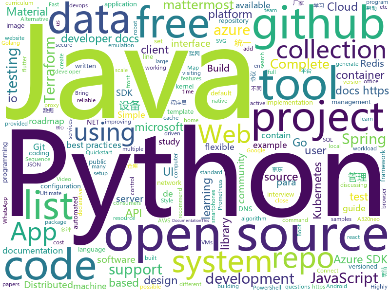

# 2020-08-28
See what the GitHub community is most excited about.

## python
+ [speakeasy](https://github.com/fireeye/speakeasy)(**93 stars today**): Windows kernel and user mode emulation.
+ [black](https://github.com/psf/black)(**86 stars today**): The uncompromising Python code formatter
+ [present](https://github.com/vinayak-mehta/present)(**116 stars today**): A terminal-based presentation tool with colors and effects.
+ [Python](https://github.com/TheAlgorithms/Python)(**114 stars today**): All Algorithms implemented in Python
+ [system-design-primer](https://github.com/donnemartin/system-design-primer)(**134 stars today**): Learn how to design large-scale systems. Prep for the system design interview. Includes Anki flashcards.
+ [byob](https://github.com/malwaredllc/byob)(**11 stars today**): BYOB (Build Your Own Botnet)
+ [TecoGAN](https://github.com/thunil/TecoGAN)(**119 stars today**): This repo will contain source code and materials for the TecoGAN project, i.e. code for a TEmporally COherent GAN
+ [devops-exercises](https://github.com/bregman-arie/devops-exercises)(**25 stars today**): Linux, Jenkins, AWS, SRE, Prometheus, Docker, Python, Ansible, Git, Kubernetes, Terraform, OpenStack, SQL, NoSQL, Azure, GCP, DNS, Elastic, Network, Virtualization. DevOps Interview Questions
+ [CS-Notes](https://github.com/huangrt01/CS-Notes)(**107 stars today**): 我的自学笔记，在学习ML System，整理C++、算法、操作系统，后续学习分布式系统，终身更新。
+ [YouTube-Livestream-Botter](https://github.com/KevinLage/YouTube-Livestream-Botter)(**64 stars today**): Simple tool to bot viewers to a YouTube Livestream!
+ [models](https://github.com/tensorflow/models)(**31 stars today**): Models and examples built with TensorFlow
+ [learn-python](https://github.com/trekhleb/learn-python)(**64 stars today**): 📚Playground and cheatsheet for learning Python. Collection of Python scripts that are split by topics and contain code examples with explanations.
+ [Gooey](https://github.com/chriskiehl/Gooey)(**239 stars today**): Turn (almost) any Python command line program into a full GUI application with one line
+ [b0mb3r](https://github.com/crinny/b0mb3r)(**7 stars today**): 💣Открытый СМС бомбер
+ [prefect](https://github.com/PrefectHQ/prefect)(**20 stars today**): The easiest way to automate your data
+ [Archery](https://github.com/hhyo/Archery)(**20 stars today**): SQL 审核查询平台
+ [linux-kernel-module-cheat](https://github.com/cirosantilli/linux-kernel-module-cheat)(**8 stars today**): The perfect emulation setup to study and develop the Linux kernel v5.4.3, kernel modules, QEMU, gem5 and x86_64, ARMv7 and ARMv8 userland and baremetal assembly, ANSI C, C++ and POSIX. GDB step debug and KGDB just work. Powered by Buildroot and crosstool-NG. Highly automated. Thoroughly documented. Automated tests. "Tested" in an Ubuntu 19.10 host.
+ [fairseq](https://github.com/pytorch/fairseq)(**17 stars today**): Facebook AI Research Sequence-to-Sequence Toolkit written in Python.
+ [BayesianOptimization](https://github.com/fmfn/BayesianOptimization)(**6 stars today**): A Python implementation of global optimization with gaussian processes.
+ [isort](https://github.com/PyCQA/isort)(**6 stars today**): A Python utility / library to sort imports.
+ [erpnext](https://github.com/frappe/erpnext)(**10 stars today**): Open Source Alternative to SAP
+ [core](https://github.com/home-assistant/core)(**19 stars today**): 🏡Open source home automation that puts local control and privacy first
+ [spack](https://github.com/spack/spack)(**0 stars today**): A flexible package manager that supports multiple versions, configurations, platforms, and compilers.
+ [azure-sdk-for-python](https://github.com/Azure/azure-sdk-for-python)(**1 stars today**): This repository is for active development of the Azure SDK for Python. For consumers of the SDK we recommend visiting our public developer docs at https://docs.microsoft.com/en-us/python/azure/ or our versioned developer docs at https://azure.github.io/azure-sdk-for-python.
+ [locust](https://github.com/locustio/locust)(**18 stars today**): Scalable user load testing tool written in Python

## java
+ [fastjson](https://github.com/alibaba/fastjson)(**15 stars today**): A fast JSON parser/generator for Java.
+ [sqli](https://github.com/x-ream/sqli)(**78 stars today**): Simple sql interface, Criteria, CriteriaBuilder
+ [ExoPlayer](https://github.com/google/ExoPlayer)(**11 stars today**): An extensible media player for Android
+ [quarkus](https://github.com/quarkusio/quarkus)(**14 stars today**): Quarkus: Supersonic Subatomic Java.
+ [flink](https://github.com/apache/flink)(**16 stars today**): Apache Flink
+ [lucene-solr](https://github.com/apache/lucene-solr)(**7 stars today**): Apache Lucene and Solr open-source search software
+ [azure-sdk-for-java](https://github.com/Azure/azure-sdk-for-java)(**1 stars today**): This repository is for active development of the Azure SDK for Java. For consumers of the SDK we recommend visiting our public developer docs at https://docs.microsoft.com/en-us/java/azure/ or our versioned developer docs at https://azure.github.io/azure-sdk-for-java.
+ [Java-Tutorial](https://github.com/h2pl/Java-Tutorial)(**11 stars today**): 【Java工程师面试复习指南】本仓库涵盖大部分Java程序员所需要掌握的核心知识，整合了互联网上的很多优质Java技术文章，力求打造为最完整最实用的Java开发者学习指南，如果对你有帮助，给个star告诉我吧，谢谢！
+ [piggymetrics](https://github.com/sqshq/piggymetrics)(**12 stars today**): Microservice Architecture with Spring Boot, Spring Cloud and Docker
+ [testing-samples](https://github.com/android/testing-samples)(**7 stars today**): A collection of samples demonstrating different frameworks and techniques for automated testing
+ [jib](https://github.com/GoogleContainerTools/jib)(**23 stars today**): 🏗Build container images for your Java applications.
+ [checkstyle](https://github.com/checkstyle/checkstyle)(**4 stars today**): Checkstyle is a development tool to help programmers write Java code that adheres to a coding standard. By default it supports the Google Java Style Guide and Sun Code Conventions, but is highly configurable. It can be invoked with an ANT task and a command line program.
+ [jetlinks-community](https://github.com/jetlinks/jetlinks-community)(**6 stars today**): JetLinks 基于Java8,Spring Boot 2.x ,WebFlux,Netty,Vert.x,Reactor等开发, 是一个全响应式的物联网平台。支持统一物模型管理,多种设备,多种厂家,统一管理。统一设备连接管理,多协议适配(TCP,MQTT,UDP,CoAP,HTTP等),屏蔽网络编程复杂性,灵活接入不同厂家不同协议等设备。实时数据处理,设备告警,消息通知,数据转发。地理位置,数据可视化等。能帮助你快速建立物联网相关业务系统。
+ [pinpoint](https://github.com/naver/pinpoint)(**6 stars today**): APM, (Application Performance Management) tool for large-scale distributed systems.
+ [shardingsphere](https://github.com/apache/shardingsphere)(**10 stars today**): Distributed database middleware
+ [DataflowTemplates](https://github.com/GoogleCloudPlatform/DataflowTemplates)(**1 stars today**): Google-provided Cloud Dataflow template pipelines for solving simple in-Cloud data tasks
+ [material-components-android](https://github.com/material-components/material-components-android)(**22 stars today**): Modular and customizable Material Design UI components for Android
+ [redisson](https://github.com/redisson/redisson)(**18 stars today**): Redisson - Redis Java client with features of In-Memory Data Grid. Over 50 Redis based Java objects and services: Set, Multimap, SortedSet, Map, List, Queue, Deque, Semaphore, Lock, AtomicLong, Map Reduce, Publish / Subscribe, Bloom filter, Spring Cache, Tomcat, Scheduler, JCache API, Hibernate, MyBatis, RPC, local cache ...
+ [thingsboard](https://github.com/thingsboard/thingsboard)(**10 stars today**): Open-source IoT Platform - Device management, data collection, processing and visualization.
+ [Luban](https://github.com/Curzibn/Luban)(**8 stars today**): Luban(鲁班)—Image compression with efficiency very close to WeChat Moments/可能是最接近微信朋友圈的图片压缩算法
+ [quarkus-quickstarts](https://github.com/quarkusio/quarkus-quickstarts)(**4 stars today**): Quarkus quickstart code
+ [mockito](https://github.com/mockito/mockito)(**6 stars today**): Most popular Mocking framework for unit tests written in Java
+ [junit5](https://github.com/junit-team/junit5)(**4 stars today**): The next generation of JUnit.
+ [spring-boot](https://github.com/spring-projects/spring-boot)(**33 stars today**): Spring Boot
+ [OpenRefine](https://github.com/OpenRefine/OpenRefine)(**3 stars today**): OpenRefine is a free, open source power tool for working with messy data and improving it

## unknown
+ [Learn-Vim](https://github.com/iggredible/Learn-Vim)(**590 stars today**): A book for learning the Vim editor
+ [OpenBot](https://github.com/intel-isl/OpenBot)(**115 stars today**): OpenBot leverages smartphones as brains for low-cost robots. We have designed a small electric vehicle that costs about $50 and serves as a robot body. Our software stack for Android smartphones supports advanced robotics workloads such as person following and real-time autonomous navigation.
+ [coding-interview-university](https://github.com/jwasham/coding-interview-university)(**399 stars today**): A complete computer science study plan to become a software engineer.
+ [free-programming-books](https://github.com/EbookFoundation/free-programming-books)(**131 stars today**): 📚Freely available programming books
+ [open-source-cs-python](https://github.com/ForrestKnight/open-source-cs-python)(**187 stars today**): Video discussing this curriculum:
+ [project-based-learning](https://github.com/tuvtran/project-based-learning)(**60 stars today**): Curated list of project-based tutorials
+ [GNNPapers](https://github.com/thunlp/GNNPapers)(**17 stars today**): Must-read papers on graph neural networks (GNN)
+ [Cookbook](https://github.com/andkret/Cookbook)(**5 stars today**): The Data Engineering Cookbook
+ [COVID-19](https://github.com/CSSEGISandData/COVID-19)(**14 stars today**): Novel Coronavirus (COVID-19) Cases, provided by JHU CSSE
+ [gitignore](https://github.com/github/gitignore)(**136 stars today**): A collection of useful .gitignore templates
+ [Free-Certifications](https://github.com/cloudcommunity/Free-Certifications)(**21 stars today**): Curated list of free courses & certifications
+ [flutter-development-roadmap](https://github.com/Tarikul711/flutter-development-roadmap)(**50 stars today**): Flutter App Developer Roadmap - A complete roadmap to learn Flutter App Development. I tried to learn flutter using this roadmap. If you want to add something please contribute to the project. Happy Learning
+ [Python-programming-exercises](https://github.com/zhiwehu/Python-programming-exercises)(**81 stars today**): 100+ Python challenging programming exercises
+ [Specs](https://github.com/CocoaPods/Specs)(**1 stars today**): The CocoaPods Master Repo
+ [ml-surveys](https://github.com/eugeneyan/ml-surveys)(**30 stars today**): 📋Survey papers summarizing advances in machine learning.
+ [lesson01](https://github.com/java-group-blr/lesson01)(**2 stars today**): 
+ [renaming](https://github.com/github/renaming)(**85 stars today**): Guidance for changing the default branch name for GitHub repositories
+ [clean-code-persian](https://github.com/Noah1001000/clean-code-persian)(**8 stars today**): ترجمه گروهی کتاب کدتمیز
+ [open-source-cs](https://github.com/ForrestKnight/open-source-cs)(**38 stars today**): Video discussing this curriculum:
+ [open-source-android-apps](https://github.com/pcqpcq/open-source-android-apps)(**2 stars today**): Open-Source Android Apps
+ [awesome](https://github.com/sindresorhus/awesome)(**90 stars today**): 😎Awesome lists about all kinds of interesting topics
+ [NewGrad-2021](https://github.com/Pitt-CSC/NewGrad-2021)(**28 stars today**): A collection of New Grad full time roles in SWE, Quant, and PM.
+ [Python](https://github.com/TwoWater/Python)(**31 stars today**): 最良心的 Python 教程：
+ [desafio-4-2020](https://github.com/maratonadev-br/desafio-4-2020)(**7 stars today**): 
+ [vagas](https://github.com/frontendbr/vagas)(**8 stars today**): 🔬Espaço para divulgação de vagas para front-enders.

## javascript
+ [arwes](https://github.com/arwes/arwes)(**564 stars today**): Futuristic Sci-Fi and Cyberpunk Graphical User Interface Framework for Web Apps
+ [nodebestpractices](https://github.com/goldbergyoni/nodebestpractices)(**239 stars today**): ✅The Node.js best practices list (August 2020)
+ [d3](https://github.com/d3/d3)(**78 stars today**): Bring data to life with SVG, Canvas and HTML.📊📈🎉
+ [mern-course-bootcamp](https://github.com/jeanrauwers/mern-course-bootcamp)(**41 stars today**): Complete Free Coding Bootcamp 2020 MERN Stack
+ [project-guidelines](https://github.com/elsewhencode/project-guidelines)(**28 stars today**): A set of best practices for JavaScript projects
+ [heroicons](https://github.com/tailwindlabs/heroicons)(**101 stars today**): A set of free MIT-licensed high-quality SVG icons for UI development.
+ [shift-ctrl-f](https://github.com/model-zoo/shift-ctrl-f)(**172 stars today**): 🔎Search the information available on a webpage using natural language instead of an exact string match.
+ [github-profile-readme-generator](https://github.com/rahuldkjain/github-profile-readme-generator)(**85 stars today**): 🚀Generate github profile README easily with latest add-ons like visitors count, github stats, etc using minimal UI.
+ [three.js](https://github.com/mrdoob/three.js)(**31 stars today**): JavaScript 3D library.
+ [Rocket.Chat](https://github.com/RocketChat/Rocket.Chat)(**104 stars today**): The ultimate Free Open Source Solution for team communications.
+ [whatsapp-web.js](https://github.com/pedroslopez/whatsapp-web.js)(**10 stars today**): A WhatsApp client library for javascript that connects through the WhatsApp Web browser app
+ [react-i18next](https://github.com/i18next/react-i18next)(**8 stars today**): Internationalization for react done right. Using the i18next i18n ecosystem.
+ [exploits](https://github.com/r4j0x00/exploits)(**39 stars today**): 
+ [thelounge](https://github.com/thelounge/thelounge)(**188 stars today**): 💬Modern, responsive, cross-platform, self-hosted web IRC client
+ [carbon](https://github.com/carbon-design-system/carbon)(**5 stars today**): A design system built by IBM
+ [cypress](https://github.com/cypress-io/cypress)(**44 stars today**): Fast, easy and reliable testing for anything that runs in a browser.
+ [ChineseBQB](https://github.com/zhaoolee/ChineseBQB)(**63 stars today**): 🇨🇳Chinese sticker pack,More joy / 表情包的博物馆, Github最有毒的仓库, 中国表情包大集合, 聚欢乐~
+ [office-docs-powershell](https://github.com/MicrosoftDocs/office-docs-powershell)(**0 stars today**): PowerShell Reference for Office Products - Short URL: aka.ms/office-powershell
+ [yarn](https://github.com/yarnpkg/yarn)(**15 stars today**): 📦🐈Fast, reliable, and secure dependency management.
+ [mattermost-webapp](https://github.com/mattermost/mattermost-webapp)(**3 stars today**): Webapp of Mattermost server: https://github.com/mattermost/mattermost-server
+ [scripts](https://github.com/lxk0301/scripts)(**12 stars today**): 京东薅羊毛工具（活动入口：京东app->我的->游戏与互动->查看更多）
+ [react](https://github.com/facebook/react)(**59 stars today**): A declarative, efficient, and flexible JavaScript library for building user interfaces.
+ [jsmpeg](https://github.com/phoboslab/jsmpeg)(**15 stars today**): MPEG1 Video Decoder in JavaScript
+ [mostly-adequate-guide](https://github.com/MostlyAdequate/mostly-adequate-guide)(**10 stars today**): Mostly adequate guide to FP (in javascript)
+ [bigbluebutton](https://github.com/bigbluebutton/bigbluebutton)(**11 stars today**): Complete open source web conferencing system.

## html
+ [maratona-fullcycle-4](https://github.com/codeedu/maratona-fullcycle-4)(**12 stars today**): 
+ [msfs-a320neo](https://github.com/wpine215/msfs-a320neo)(**167 stars today**): The A32NX Project is a community driven open source project to create a free Airbus A320neo in Microsoft Flight Simulator that is as close to reality as possible. It aims to enhance the default A320neo by improving the systems depth and functionality to bring it up to payware-level, all for free.
+ [volt-bootstrap-5-dashboard](https://github.com/themesberg/volt-bootstrap-5-dashboard)(**394 stars today**): ⚡️Volt - Bootstrap 5 Admin Dashboard Template with vanilla Javascript
+ [free-for-dev](https://github.com/ripienaar/free-for-dev)(**76 stars today**): A list of SaaS, PaaS and IaaS offerings that have free tiers of interest to devops and infradev
+ [hyperblog](https://github.com/freddier/hyperblog)(**18 stars today**): Un blog increíble para el curso de Git y Github de Platzi
+ [website](https://github.com/kubernetes/website)(**6 stars today**): Kubernetes website and documentation repo:
+ [phpstan](https://github.com/phpstan/phpstan)(**9 stars today**): PHP Static Analysis Tool - discover bugs in your code without running it!
+ [re0-web](https://github.com/lyy289065406/re0-web)(**3 stars today**): RE0：从零开始的异世界生活 （WEB版）
+ [styleguide](https://github.com/google/styleguide)(**13 stars today**): Style guides for Google-originated open-source projects
+ [training-kit](https://github.com/github/training-kit)(**2 stars today**): Open source cheat sheets for Git and GitHub
+ [howtheytest](https://github.com/abhivaikar/howtheytest)(**32 stars today**): A collection of public resources about how software companies test their software
+ [learning-area](https://github.com/mdn/learning-area)(**4 stars today**): Github repo for the MDN Learning Area.
+ [quickstart-js](https://github.com/firebase/quickstart-js)(**6 stars today**): Firebase Quickstart Samples for Web
+ [calico](https://github.com/projectcalico/calico)(**5 stars today**): Cloud native networking and network security
+ [chinese-ig](https://github.com/w3c/chinese-ig)(**0 stars today**): Web中文兴趣组
+ [dotnet](https://github.com/microsoft/dotnet)(**4 stars today**): This repo is the official home of .NET on GitHub. It's a great starting point to find many .NET OSS projects from Microsoft and the community, including many that are part of the .NET Foundation.
+ [skill-map](https://github.com/TeamStuQ/skill-map)(**14 stars today**): 程序员技能图谱
+ [devdocs](https://github.com/magento/devdocs)(**0 stars today**): Magento Developer Documentation
+ [cypress-example-kitchensink](https://github.com/cypress-io/cypress-example-kitchensink)(**0 stars today**): This is an example app used to showcase Cypress.io testing.
+ [computer-science-flash-cards](https://github.com/jwasham/computer-science-flash-cards)(**12 stars today**): Mini website for testing both general CS knowledge and enforce coding practice and common algorithm/data structure memorization.
+ [svelte-material-ui](https://github.com/hperrin/svelte-material-ui)(**6 stars today**): Svelte Material UI Components
+ [Front-end-Developer-Interview-Questions](https://github.com/h5bp/Front-end-Developer-Interview-Questions)(**20 stars today**): A list of helpful front-end related questions you can use to interview potential candidates, test yourself or completely ignore.
+ [moveit_tutorials](https://github.com/ros-planning/moveit_tutorials)(**0 stars today**): A sphinx-based centralized documentation repo for MoveIt
+ [beginner-javascript](https://github.com/wesbos/beginner-javascript)(**5 stars today**): Slam Dunk JavaScript
+ [swagger-codegen](https://github.com/swagger-api/swagger-codegen)(**9 stars today**): swagger-codegen contains a template-driven engine to generate documentation, API clients and server stubs in different languages by parsing your OpenAPI / Swagger definition.

## go
+ [ultimate-go](https://github.com/hoanhan101/ultimate-go)(**302 stars today**): The Ultimate Go Study Guide
+ [thanos](https://github.com/thanos-io/thanos)(**15 stars today**): Highly available Prometheus setup with long term storage capabilities. CNCF Sandbox project.
+ [traefik](https://github.com/containous/traefik)(**63 stars today**): The Cloud Native Edge Router
+ [packer](https://github.com/hashicorp/packer)(**217 stars today**): Packer is a tool for creating identical machine images for multiple platforms from a single source configuration.
+ [istio](https://github.com/istio/istio)(**16 stars today**): Connect, secure, control, and observe services.
+ [gocv](https://github.com/hybridgroup/gocv)(**6 stars today**): Go package for computer vision using OpenCV 4 and beyond.
+ [go](https://github.com/golang/go)(**42 stars today**): The Go programming language
+ [jwt-go](https://github.com/dgrijalva/jwt-go)(**8 stars today**): Golang implementation of JSON Web Tokens (JWT)
+ [terraform-provider-aws](https://github.com/terraform-providers/terraform-provider-aws)(**2 stars today**): Terraform AWS provider
+ [jaeger](https://github.com/jaegertracing/jaeger)(**12 stars today**): CNCF Jaeger, a Distributed Tracing Platform
+ [gotraining](https://github.com/ardanlabs/gotraining)(**11 stars today**): Go Training Class Material :
+ [terraform](https://github.com/hashicorp/terraform)(**20 stars today**): Terraform enables you to safely and predictably create, change, and improve infrastructure. It is an open source tool that codifies APIs into declarative configuration files that can be shared amongst team members, treated as code, edited, reviewed, and versioned.
+ [pg](https://github.com/go-pg/pg)(**6 stars today**): Golang ORM with focus on PostgreSQL features and performance
+ [opentelemetry-collector](https://github.com/open-telemetry/opentelemetry-collector)(**7 stars today**): OpenTelemetry Collector
+ [yaml](https://github.com/go-yaml/yaml)(**3 stars today**): YAML support for the Go language.
+ [tflint](https://github.com/terraform-linters/tflint)(**7 stars today**): TFLint is a Terraform linter focused on possible errors, best practices, etc. (Terraform >= 0.12)
+ [kubebuilder](https://github.com/kubernetes-sigs/kubebuilder)(**3 stars today**): Kubebuilder - SDK for building Kubernetes APIs using CRDs
+ [dnscrypt-proxy](https://github.com/DNSCrypt/dnscrypt-proxy)(**9 stars today**): dnscrypt-proxy 2 - A flexible DNS proxy, with support for encrypted DNS protocols.
+ [redis](https://github.com/go-redis/redis)(**6 stars today**): Type-safe Redis client for Golang
+ [helmfile](https://github.com/roboll/helmfile)(**3 stars today**): Deploy Kubernetes Helm Charts
+ [metrics-server](https://github.com/kubernetes-sigs/metrics-server)(**5 stars today**): Cluster-wide aggregator of resource usage data.
+ [ingress-nginx](https://github.com/kubernetes/ingress-nginx)(**10 stars today**): NGINX Ingress Controller for Kubernetes
+ [kata-containers](https://github.com/kata-containers/kata-containers)(**3 stars today**): Kata Containers version 2.x repository. Kata Containers is an open source project and community working to build a standard implementation of lightweight Virtual Machines (VMs) that feel and perform like containers, but provide the workload isolation and security advantages of VMs. https://katacontainers.io/
+ [kops](https://github.com/kubernetes/kops)(**8 stars today**): Kubernetes Operations (kops) - Production Grade K8s Installation, Upgrades, and Management
+ [mattermost-server](https://github.com/mattermost/mattermost-server)(**8 stars today**): Open source Slack-alternative in Golang and React - Mattermost

## WordCloud

