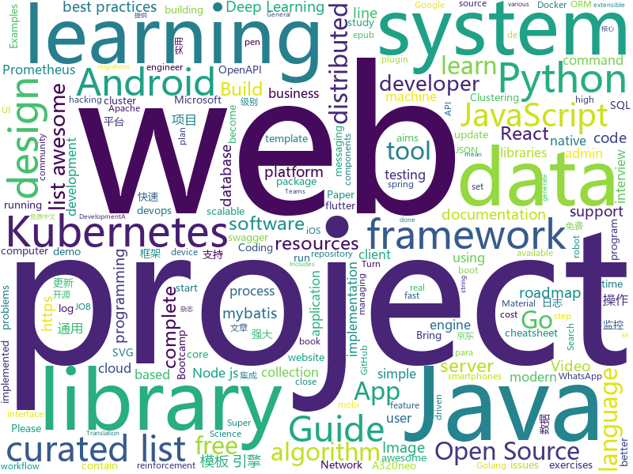

# 2020-08-29
See what the GitHub community is most excited about.

## python
+ [learn-python3](https://github.com/jerry-git/learn-python3)(**101 stars today**): Jupyter notebooks for teaching/learning Python 3
+ [learn-python](https://github.com/trekhleb/learn-python)(**86 stars today**): 📚Playground and cheatsheet for learning Python. Collection of Python scripts that are split by topics and contain code examples with explanations.
+ [Gooey](https://github.com/chriskiehl/Gooey)(**189 stars today**): Turn (almost) any Python command line program into a full GUI application with one line
+ [Python](https://github.com/TheAlgorithms/Python)(**135 stars today**): All Algorithms implemented in Python
+ [black](https://github.com/psf/black)(**197 stars today**): The uncompromising Python code formatter
+ [hopfield-layers](https://github.com/ml-jku/hopfield-layers)(**38 stars today**): Hopfield Networks is All You Need
+ [incubator-superset](https://github.com/apache/incubator-superset)(**22 stars today**): Apache Superset is a Data Visualization and Data Exploration Platform
+ [youtube-dl](https://github.com/ytdl-org/youtube-dl)(**64 stars today**): Command-line program to download videos from YouTube.com and other video sites
+ [iOS-DeviceSupport](https://github.com/iGhibli/iOS-DeviceSupport)(**15 stars today**): This repository holds the device support files for the iOS, and I will update it regularly.
+ [ray](https://github.com/ray-project/ray)(**19 stars today**): A fast and simple framework for building and running distributed applications. Ray is packaged with RLlib, a scalable reinforcement learning library, and Tune, a scalable hyperparameter tuning library.
+ [system-design-primer](https://github.com/donnemartin/system-design-primer)(**143 stars today**): Learn how to design large-scale systems. Prep for the system design interview. Includes Anki flashcards.
+ [DeepLearningExamples](https://github.com/NVIDIA/DeepLearningExamples)(**12 stars today**): Deep Learning Examples
+ [objax](https://github.com/google/objax)(**151 stars today**): 
+ [speakeasy](https://github.com/fireeye/speakeasy)(**79 stars today**): Windows kernel and user mode emulation.
+ [ML-From-Scratch](https://github.com/eriklindernoren/ML-From-Scratch)(**18 stars today**): Machine Learning From Scratch. Bare bones NumPy implementations of machine learning models and algorithms with a focus on accessibility. Aims to cover everything from linear regression to deep learning.
+ [StockAlgorithm](https://github.com/Ncohen10/StockAlgorithm)(**26 stars today**): A profitable mean reversion stock trading algorithm
+ [genrl](https://github.com/SforAiDl/genrl)(**50 stars today**): A PyTorch reinforcement learning library for generalizable and reproducible algorithm implementations
+ [coding-problems](https://github.com/MTrajK/coding-problems)(**81 stars today**): Solutions for various coding/algorithmic problems and many useful resources for learning algorithms and data structures
+ [devops-exercises](https://github.com/bregman-arie/devops-exercises)(**21 stars today**): Linux, Jenkins, AWS, SRE, Prometheus, Docker, Python, Ansible, Git, Kubernetes, Terraform, OpenStack, SQL, NoSQL, Azure, GCP, DNS, Elastic, Network, Virtualization. DevOps Interview Questions
+ [albumentations](https://github.com/albumentations-team/albumentations)(**16 stars today**): Fast image augmentation library and easy to use wrapper around other libraries. Documentation: https://albumentations.ai/docs/ Paper about library: https://www.mdpi.com/2078-2489/11/2/125
+ [Deep-Learning-Papers-Reading-Roadmap](https://github.com/floodsung/Deep-Learning-Papers-Reading-Roadmap)(**20 stars today**): Deep Learning papers reading roadmap for anyone who are eager to learn this amazing tech!
+ [paramiko](https://github.com/paramiko/paramiko)(**7 stars today**): The leading native Python SSHv2 protocol library.
+ [pytorch-CycleGAN-and-pix2pix](https://github.com/junyanz/pytorch-CycleGAN-and-pix2pix)(**20 stars today**): Image-to-Image Translation in PyTorch
+ [byob](https://github.com/malwaredllc/byob)(**15 stars today**): BYOB (Build Your Own Botnet)
+ [keras](https://github.com/keras-team/keras)(**18 stars today**): Deep Learning for humans

## java
+ [OpenBot](https://github.com/intel-isl/OpenBot)(**267 stars today**): OpenBot leverages smartphones as brains for low-cost robots. We have designed a small electric vehicle that costs about $50 and serves as a robot body. Our software stack for Android smartphones supports advanced robotics workloads such as person following and real-time autonomous navigation.
+ [sqli](https://github.com/x-ream/sqli)(**82 stars today**): Simple sql interface, Criteria, CriteriaBuilder
+ [quarkus](https://github.com/quarkusio/quarkus)(**19 stars today**): Quarkus: Supersonic Subatomic Java.
+ [guice](https://github.com/google/guice)(**5 stars today**): Guice (pronounced 'juice') is a lightweight dependency injection framework for Java 6 and above, brought to you by Google.
+ [Java-Tutorial](https://github.com/h2pl/Java-Tutorial)(**18 stars today**): 【Java工程师面试复习指南】本仓库涵盖大部分Java程序员所需要掌握的核心知识，整合了互联网上的很多优质Java技术文章，力求打造为最完整最实用的Java开发者学习指南，如果对你有帮助，给个star告诉我吧，谢谢！
+ [material-components-android](https://github.com/material-components/material-components-android)(**20 stars today**): Modular and customizable Material Design UI components for Android
+ [Luban](https://github.com/Curzibn/Luban)(**8 stars today**): Luban(鲁班)—Image compression with efficiency very close to WeChat Moments/可能是最接近微信朋友圈的图片压缩算法
+ [jackson-databind](https://github.com/FasterXML/jackson-databind)(**7 stars today**): General data-binding package for Jackson (2.x): works on streaming API (core) implementation(s)
+ [lottie-android](https://github.com/airbnb/lottie-android)(**15 stars today**): Render After Effects animations natively on Android and iOS, Web, and React Native
+ [hive](https://github.com/apache/hive)(**4 stars today**): Apache Hive
+ [spring-boot-demo](https://github.com/xkcoding/spring-boot-demo)(**44 stars today**): spring boot demo 是一个用来深度学习并实战 spring boot 的项目，目前总共包含 65 个集成demo，已经完成 53 个。 该项目已成功集成 actuator(监控)、admin(可视化监控)、logback(日志)、aopLog(通过AOP记录web请求日志)、统一异常处理(json级别和页面级别)、freemarker(模板引擎)、thymeleaf(模板引擎)、Beetl(模板引擎)、Enjoy(模板引擎)、JdbcTemplate(通用JDBC操作数据库)、JPA(强大的ORM框架)、mybatis(强大的ORM框架)、通用Mapper(快速操作Mybatis)、PageHelper(通用的Mybatis分页插件)、mybatis-plus(快速操作M…
+ [pulsar](https://github.com/apache/pulsar)(**10 stars today**): Apache Pulsar - distributed pub-sub messaging system
+ [java8-tutorial](https://github.com/winterbe/java8-tutorial)(**29 stars today**): Modern Java - A Guide to Java 8
+ [xxl-job](https://github.com/xuxueli/xxl-job)(**36 stars today**): A distributed task scheduling framework.（分布式任务调度平台XXL-JOB）
+ [epoxy](https://github.com/airbnb/epoxy)(**6 stars today**): Epoxy is an Android library for building complex screens in a RecyclerView
+ [spring-cloud-sleuth](https://github.com/spring-cloud/spring-cloud-sleuth)(**1 stars today**): Distributed tracing for spring cloud
+ [serve](https://github.com/pytorch/serve)(**7 stars today**): Model Serving on PyTorch
+ [VirtualApp](https://github.com/asLody/VirtualApp)(**8 stars today**): Virtual Engine for Android(Support 10.0 in business version)
+ [elasticsearch](https://github.com/elastic/elasticsearch)(**39 stars today**): Open Source, Distributed, RESTful Search Engine
+ [kubernetes-plugin](https://github.com/jenkinsci/kubernetes-plugin)(**2 stars today**): Jenkins plugin to run dynamic agents in a Kubernetes/Docker environment
+ [react-native-twilio-video-webrtc](https://github.com/blackuy/react-native-twilio-video-webrtc)(**0 stars today**): Twilio Video (WebRTC) for React Native
+ [AgentWeb](https://github.com/Justson/AgentWeb)(**4 stars today**): AgentWeb is a powerful library based on Android WebView.
+ [java-design-patterns](https://github.com/iluwatar/java-design-patterns)(**49 stars today**): Design patterns implemented in Java
+ [Activiti](https://github.com/Activiti/Activiti)(**9 stars today**): Activiti is a light-weight workflow and Business Process Management (BPM) Platform targeted at business people, developers and system admins. Its core is a super-fast and rock-solid BPMN 2 process engine for Java. It's open-source and distributed under the Apache license. Activiti runs in any Java application, on a server, on a cluster or in the…
+ [debezium](https://github.com/debezium/debezium)(**8 stars today**): Change data capture for a variety of databases. Please log issues at https://issues.redhat.com/browse/DBZ.

## unknown
+ [Learn-Vim](https://github.com/iggredible/Learn-Vim)(**439 stars today**): A book for learning the Vim editor
+ [Python-programming-exercises](https://github.com/zhiwehu/Python-programming-exercises)(**91 stars today**): 100+ Python challenging programming exercises
+ [free-programming-books](https://github.com/EbookFoundation/free-programming-books)(**169 stars today**): 📚Freely available programming books
+ [coding-interview-university](https://github.com/jwasham/coding-interview-university)(**495 stars today**): A complete computer science study plan to become a software engineer.
+ [open-source-cs-python](https://github.com/ForrestKnight/open-source-cs-python)(**165 stars today**): Video discussing this curriculum:
+ [machine-learning-for-software-engineers](https://github.com/ZuzooVn/machine-learning-for-software-engineers)(**27 stars today**): A complete daily plan for studying to become a machine learning engineer.
+ [awesome](https://github.com/sindresorhus/awesome)(**100 stars today**): 😎Awesome lists about all kinds of interesting topics
+ [project-based-learning](https://github.com/tuvtran/project-based-learning)(**52 stars today**): Curated list of project-based tutorials
+ [flutter-development-roadmap](https://github.com/Tarikul711/flutter-development-roadmap)(**21 stars today**): Flutter App Developer Roadmap - A complete roadmap to learn Flutter App Development. I tried to learn flutter using this roadmap. If you want to add something please contribute to the project. Happy Learning
+ [awesome-reMarkable](https://github.com/reHackable/awesome-reMarkable)(**211 stars today**): A curated list of projects related to the reMarkable tablet
+ [SS-Rule-Snippet](https://github.com/Hackl0us/SS-Rule-Snippet)(**15 stars today**): 搜集、整理、维护 Surge / Quantumult / Shadowrocket / Surfboard / clash(X) 实用规则。
+ [awesome-deep-learning](https://github.com/ChristosChristofidis/awesome-deep-learning)(**21 stars today**): A curated list of awesome Deep Learning tutorials, projects and communities.
+ [awesome-computer-vision](https://github.com/jbhuang0604/awesome-computer-vision)(**21 stars today**): A curated list of awesome computer vision resources
+ [awesome-datascience](https://github.com/academic/awesome-datascience)(**9 stars today**): 📝An awesome Data Science repository to learn and apply for real world problems.
+ [PoC-in-GitHub](https://github.com/nomi-sec/PoC-in-GitHub)(**30 stars today**): 📡PoC auto collect from GitHub.
+ [Cyber-Security-Essentials](https://github.com/LetsUpgrade/Cyber-Security-Essentials)(**4 stars today**): 
+ [awesome-java](https://github.com/akullpp/awesome-java)(**17 stars today**): A curated list of awesome frameworks, libraries and software for the Java programming language.
+ [clean-code-persian](https://github.com/Noah1001000/clean-code-persian)(**7 stars today**): ترجمه گروهی کتاب کدتمیز
+ [vagas](https://github.com/backend-br/vagas)(**10 stars today**): ✌️Espaço para divulgação de vagas para backenders
+ [the-economist-ebooks](https://github.com/hehonghui/the-economist-ebooks)(**6 stars today**): The Economist ebooks(epub, mobi format), update weekly. 经济学人、纽约客杂志电子版下载、免费订阅(kindle推送),支持epub、mobi、pdf格式, 每周更新
+ [system-design-interview](https://github.com/checkcheckzz/system-design-interview)(**19 stars today**): System design interview for IT companies
+ [modern-cpp-features](https://github.com/AnthonyCalandra/modern-cpp-features)(**12 stars today**): A cheatsheet of modern C++ language and library features.
+ [data-police-shootings](https://github.com/washingtonpost/data-police-shootings)(**3 stars today**): The Washington Post is compiling a database of every fatal shooting in the United States by a police officer in the line of duty since 2015.
+ [hacker-roadmap](https://github.com/sundowndev/hacker-roadmap)(**7 stars today**): 📌Your beginner pen-testing start guide. A guide for amateur pen testers and a collection of hacking tools, resources and references to practice ethical hacking and web security.
+ [ClashForAndroid](https://github.com/Kr328/ClashForAndroid)(**31 stars today**): A rule-based tunnel for Android.

## javascript
+ [d3](https://github.com/d3/d3)(**87 stars today**): Bring data to life with SVG, Canvas and HTML.📊📈🎉
+ [mern-course-bootcamp](https://github.com/jeanrauwers/mern-course-bootcamp)(**47 stars today**): Complete Free Coding Bootcamp 2020 MERN Stack
+ [arwes](https://github.com/arwes/arwes)(**458 stars today**): Futuristic Sci-Fi and Cyberpunk Graphical User Interface Framework for Web Apps
+ [nodebestpractices](https://github.com/goldbergyoni/nodebestpractices)(**192 stars today**): ✅The Node.js best practices list (August 2020)
+ [project-guidelines](https://github.com/elsewhencode/project-guidelines)(**95 stars today**): A set of best practices for JavaScript projects
+ [strapi](https://github.com/strapi/strapi)(**34 stars today**): 🚀Open source Node.js Headless CMS to easily build customisable APIs
+ [heroicons](https://github.com/tailwindlabs/heroicons)(**326 stars today**): A set of free MIT-licensed high-quality SVG icons for UI development.
+ [javascript](https://github.com/airbnb/javascript)(**48 stars today**): JavaScript Style Guide
+ [lerna](https://github.com/lerna/lerna)(**24 stars today**): 🐉A tool for managing JavaScript projects with multiple packages.
+ [OpenAPI-Specification](https://github.com/OAI/OpenAPI-Specification)(**11 stars today**): The OpenAPI Specification Repository
+ [carbon](https://github.com/carbon-design-system/carbon)(**14 stars today**): A design system built by IBM
+ [hacker-scripts](https://github.com/NARKOZ/hacker-scripts)(**46 stars today**): Based on a true story
+ [javascript-testing-best-practices](https://github.com/goldbergyoni/javascript-testing-best-practices)(**34 stars today**): 📗🌐🚢Comprehensive and exhaustive JavaScript & Node.js testing best practices (July 2020)
+ [cube.js](https://github.com/cube-js/cube.js)(**11 stars today**): 📊Cube.js - Open Source Analytics Framework
+ [whatsapp-web.js](https://github.com/pedroslopez/whatsapp-web.js)(**13 stars today**): A WhatsApp client library for javascript that connects through the WhatsApp Web browser app
+ [next.js](https://github.com/vercel/next.js)(**63 stars today**): The React Framework
+ [plexus](https://github.com/techlore-official/plexus)(**9 stars today**): Remove the fear of Android app compatibility on de-Googled devices.
+ [scripts](https://github.com/lxk0301/scripts)(**13 stars today**): 京东薅羊毛工具（活动入口：京东app->我的->游戏与互动->查看更多）
+ [shift-ctrl-f](https://github.com/model-zoo/shift-ctrl-f)(**277 stars today**): 🔎Search the information available on a webpage using natural language instead of an exact string match.
+ [material-ui](https://github.com/mui-org/material-ui)(**47 stars today**): React components for faster and easier web development. Build your own design system, or start with Material Design.
+ [react-navigation-v5-mix](https://github.com/itzpradip/react-navigation-v5-mix)(**3 stars today**): 
+ [Leaflet.markercluster](https://github.com/Leaflet/Leaflet.markercluster)(**4 stars today**): Marker Clustering plugin for Leaflet
+ [sheetjs](https://github.com/SheetJS/sheetjs)(**20 stars today**): 📗SheetJS Community Edition -- Spreadsheet Data Toolkit
+ [kuboard-press](https://github.com/eip-work/kuboard-press)(**32 stars today**): Kuboard 是基于 Kubernetes 的微服务管理界面。同时提供 Kubernetes 免费中文教程，入门教程，最新版本的 Kubernetes v1.18 安装手册，(k8s install) 在线答疑，持续更新。
+ [yup](https://github.com/jquense/yup)(**21 stars today**): Dead simple Object schema validation

## html
+ [free-for-dev](https://github.com/ripienaar/free-for-dev)(**192 stars today**): A list of SaaS, PaaS and IaaS offerings that have free tiers of interest to devops and infradev
+ [bennett](https://github.com/bennettfeely/bennett)(**188 stars today**): My websites
+ [msfs-a320neo](https://github.com/wpine215/msfs-a320neo)(**122 stars today**): The A32NX Project is a community driven open source project to create a free Airbus A320neo in Microsoft Flight Simulator that is as close to reality as possible. It aims to enhance the default A320neo by improving the systems depth and functionality to bring it up to payware-level, all for free.
+ [Article](https://github.com/HelloGitHub-Team/Article)(**187 stars today**): 讲解开源项目系列文章库
+ [maratona-fullcycle-4](https://github.com/codeedu/maratona-fullcycle-4)(**20 stars today**): 
+ [webdevbootcamp](https://github.com/nax3t/webdevbootcamp)(**3 stars today**): All source code for back-end projects from the Web Developer Bootcamp
+ [volt-bootstrap-5-dashboard](https://github.com/themesberg/volt-bootstrap-5-dashboard)(**277 stars today**): ⚡️Volt - Bootstrap 5 Admin Dashboard Template with vanilla Javascript
+ [ecma262](https://github.com/tc39/ecma262)(**9 stars today**): Status, process, and documents for ECMA-262
+ [re0-web](https://github.com/lyy289065406/re0-web)(**6 stars today**): RE0：从零开始的异世界生活 （WEB版）
+ [qcloud-documents](https://github.com/tencentyun/qcloud-documents)(**2 stars today**): 腾讯云官方文档
+ [phpstan](https://github.com/phpstan/phpstan)(**3 stars today**): PHP Static Analysis Tool - discover bugs in your code without running it!
+ [FAANG](https://github.com/neerazz/FAANG)(**11 stars today**): Facebook, Amazon, Apple, Netflix and Google (FAANG) Job preparation.
+ [RateMySupervisor](https://github.com/kgco/RateMySupervisor)(**75 stars today**): 永久免费开源的导师评价数据、数据爬虫、无需编程基础的展示网页以及新信息补充平台
+ [CVE-2019-17026-Exploit](https://github.com/maxpl0it/CVE-2019-17026-Exploit)(**17 stars today**): An exploit for CVE-2019-17026. It pops xcalc and was tested on Ubuntu (x64).
+ [swagger-codegen](https://github.com/swagger-api/swagger-codegen)(**3 stars today**): swagger-codegen contains a template-driven engine to generate documentation, API clients and server stubs in different languages by parsing your OpenAPI / Swagger definition.
+ [web-moderno](https://github.com/cod3rcursos/web-moderno)(**3 stars today**): 
+ [WebFundamentals](https://github.com/google/WebFundamentals)(**6 stars today**): Best practices for modern web development
+ [embeddedsw](https://github.com/Xilinx/embeddedsw)(**1 stars today**): Xilinx Embedded Software (embeddedsw) Development
+ [intro.js](https://github.com/usablica/intro.js)(**7 stars today**): A better way for new feature introduction and step-by-step users guide for your website and project.
+ [msteams-docs](https://github.com/MicrosoftDocs/msteams-docs)(**0 stars today**): Source for the Microsoft Teams developer platform documentation.
+ [awesome-competitive-programming](https://github.com/lnishan/awesome-competitive-programming)(**11 stars today**): 💎A curated list of awesome Competitive Programming, Algorithm and Data Structure resources
+ [BigBookofR](https://github.com/oscarbaruffa/BigBookofR)(**4 stars today**): The biggest collection of R books (and maybe later some other resources too)
+ [website](https://github.com/kubernetes/website)(**4 stars today**): Kubernetes website and documentation repo:
+ [boost](https://github.com/boostorg/boost)(**5 stars today**): Super-project for modularized Boost
+ [yi-hack-Allwinner](https://github.com/roleoroleo/yi-hack-Allwinner)(**2 stars today**): 

## go
+ [ultimate-go](https://github.com/hoanhan101/ultimate-go)(**291 stars today**): The Ultimate Go Study Guide
+ [Cloudreve](https://github.com/cloudreve/Cloudreve)(**70 stars today**): 🌩支持多家云存储的云盘系统 (A project helps you build your own cloud in minutes)
+ [podman](https://github.com/containers/podman)(**15 stars today**): Podman: A tool for managing OCI containers and pods
+ [colly](https://github.com/gocolly/colly)(**42 stars today**): Elegant Scraper and Crawler Framework for Golang
+ [traefik](https://github.com/containous/traefik)(**74 stars today**): The Cloud Native Edge Router
+ [prometheus](https://github.com/prometheus/prometheus)(**22 stars today**): The Prometheus monitoring system and time series database.
+ [argo-cd](https://github.com/argoproj/argo-cd)(**7 stars today**): Declarative continuous deployment for Kubernetes.
+ [jwt-go](https://github.com/dgrijalva/jwt-go)(**6 stars today**): Golang implementation of JSON Web Tokens (JWT)
+ [nats-server](https://github.com/nats-io/nats-server)(**12 stars today**): High-Performance server for NATS, the cloud native messaging system.
+ [webify](https://github.com/beefsack/webify)(**97 stars today**): Turn shell commands into web services
+ [vitess](https://github.com/vitessio/vitess)(**15 stars today**): Vitess is a database clustering system for horizontal scaling of MySQL.
+ [cli](https://github.com/cli/cli)(**36 stars today**): GitHub’s official command line tool
+ [redigo](https://github.com/gomodule/redigo)(**8 stars today**): Go client for Redis
+ [migrate](https://github.com/golang-migrate/migrate)(**7 stars today**): Database migrations. CLI and Golang library.
+ [argo](https://github.com/argoproj/argo)(**13 stars today**): Argo Workflows: Get stuff done with Kubernetes.
+ [evilginx2](https://github.com/kgretzky/evilginx2)(**21 stars today**): Standalone man-in-the-middle attack framework used for phishing login credentials along with session cookies, allowing for the bypass of 2-factor authentication
+ [k6](https://github.com/loadimpact/k6)(**12 stars today**): A modern load testing tool, using Go and JavaScript - https://k6.io
+ [monsoon](https://github.com/RedTeamPentesting/monsoon)(**23 stars today**): Fast HTTP enumerator
+ [caddy](https://github.com/caddyserver/caddy)(**15 stars today**): Fast, multi-platform web server with automatic HTTPS
+ [awesome-go](https://github.com/avelino/awesome-go)(**44 stars today**): A curated list of awesome Go frameworks, libraries and software
+ [yaml](https://github.com/go-yaml/yaml)(**2 stars today**): YAML support for the Go language.
+ [octant](https://github.com/vmware-tanzu/octant)(**7 stars today**): Highly extensible platform for developers to better understand the complexity of Kubernetes clusters.
+ [loki](https://github.com/grafana/loki)(**15 stars today**): Like Prometheus, but for logs.
+ [learngo](https://github.com/inancgumus/learngo)(**6 stars today**): 1000+ Hand-Crafted Go Examples, Exercises, and Quizzes
+ [consul-template](https://github.com/hashicorp/consul-template)(**1 stars today**): Template rendering, notifier, and supervisor for @hashicorp Consul and Vault data.

## WordCloud

