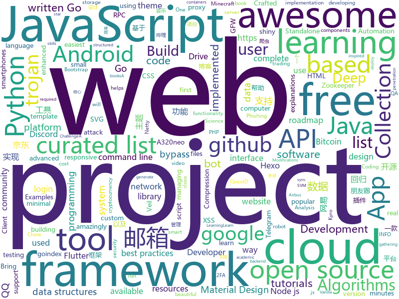

# 2020-08-30
See what the GitHub community is most excited about.

## python
+ [Python](https://github.com/TheAlgorithms/Python)(**135 stars today**): All Algorithms implemented in Python
+ [learn-python3](https://github.com/jerry-git/learn-python3)(**81 stars today**): Jupyter notebooks for teaching/learning Python 3
+ [learn-python](https://github.com/trekhleb/learn-python)(**181 stars today**): 📚Playground and cheatsheet for learning Python. Collection of Python scripts that are split by topics and contain code examples with explanations.
+ [InfoSpider](https://github.com/kangvcar/InfoSpider)(**189 stars today**): INFO-SPIDER 是一个集众多数据源于一身的爬虫工具箱🧰，旨在安全快捷的帮助用户拿回自己的数据，工具代码开源，流程透明。支持数据源包括GitHub、QQ邮箱、网易邮箱、阿里邮箱、新浪邮箱、Hotmail邮箱、Outlook邮箱、京东、淘宝、支付宝、中国移动、中国联通、中国电信、知乎、哔哩哔哩、网易云音乐、QQ好友、QQ群、生成朋友圈相册、浏览器浏览历史、12306、博客园、CSDN博客、开源中国博客、简书。
+ [objax](https://github.com/google/objax)(**83 stars today**): 
+ [discord.py](https://github.com/Rapptz/discord.py)(**16 stars today**): An API wrapper for Discord written in Python.
+ [d2l-en](https://github.com/d2l-ai/d2l-en)(**48 stars today**): Interactive deep learning book with code, math, and discussions. Available in multi-frameworks.
+ [Real-Time-Voice-Cloning](https://github.com/CorentinJ/Real-Time-Voice-Cloning)(**34 stars today**): Clone a voice in 5 seconds to generate arbitrary speech in real-time
+ [XX-Net](https://github.com/XX-net/XX-Net)(**6 stars today**): A proxy tool to bypass GFW.
+ [tensorflow-coder](https://github.com/google-research/tensorflow-coder)(**35 stars today**): 
+ [faceswap](https://github.com/deepfakes/faceswap)(**18 stars today**): Deepfakes Software For All
+ [gibMacOS](https://github.com/corpnewt/gibMacOS)(**5 stars today**): Py2/py3 script that can download macOS components direct from Apple
+ [public-apis](https://github.com/public-apis/public-apis)(**118 stars today**): A collective list of free APIs for use in software and web development.
+ [DeepCreamPy](https://github.com/deeppomf/DeepCreamPy)(**8 stars today**): Decensoring Hentai with Deep Neural Networks
+ [Instagram](https://github.com/Pure-L0G1C/Instagram)(**6 stars today**): Bruteforce attack for Instagram
+ [binwalk](https://github.com/ReFirmLabs/binwalk)(**8 stars today**): Firmware Analysis Tool
+ [Python](https://github.com/geekcomputers/Python)(**16 stars today**): My Python Examples
+ [model_compression](https://github.com/j-marple-dev/model_compression)(**28 stars today**): PyTorch Model Compression
+ [core](https://github.com/home-assistant/core)(**25 stars today**): 🏡Open source home automation that puts local control and privacy first
+ [AutoRclone](https://github.com/xyou365/AutoRclone)(**6 stars today**): AutoRclone: rclone copy/move/sync (automatically) with thousands of service accounts
+ [python-docs-samples](https://github.com/GoogleCloudPlatform/python-docs-samples)(**4 stars today**): Code samples used on cloud.google.com
+ [pyTelegramBotAPI](https://github.com/eternnoir/pyTelegramBotAPI)(**8 stars today**): Python Telegram bot api.
+ [prefect](https://github.com/PrefectHQ/prefect)(**20 stars today**): The easiest way to automate your data
+ [b0mb3r](https://github.com/crinny/b0mb3r)(**3 stars today**): 💣Открытый СМС бомбер
+ [Veil](https://github.com/Veil-Framework/Veil)(**5 stars today**): Veil 3.1.X (Check version info in Veil at runtime)

## java
+ [Mindustry](https://github.com/Anuken/Mindustry)(**14 stars today**): A sandbox tower defense game
+ [OpenBot](https://github.com/intel-isl/OpenBot)(**195 stars today**): OpenBot leverages smartphones as brains for low-cost robots. We have designed a small electric vehicle that costs about $50 and serves as a robot body. Our software stack for Android smartphones supports advanced robotics workloads such as person following and real-time autonomous navigation.
+ [Manage_iT](https://github.com/Anuj-Kumar-Sharma/Manage_iT)(**4 stars today**): A photo Managing Android App.
+ [sqli](https://github.com/x-ream/sqli)(**81 stars today**): Simple sql interface, Criteria, CriteriaBuilder
+ [Java-Tutorial](https://github.com/h2pl/Java-Tutorial)(**22 stars today**): 【Java工程师面试复习指南】本仓库涵盖大部分Java程序员所需要掌握的核心知识，整合了互联网上的很多优质Java技术文章，力求打造为最完整最实用的Java开发者学习指南，如果对你有帮助，给个star告诉我吧，谢谢！
+ [guide-rpc-framework](https://github.com/Snailclimb/guide-rpc-framework)(**15 stars today**): A custom RPC framework implemented by Netty+Kyro+Zookeeper.（一款基于 Netty+Kyro+Zookeeper 实现的自定义 RPC 框架-附详细实现过程和相关教程。）
+ [FunTester](https://github.com/JunManYuanLong/FunTester)(**6 stars today**): FunTester测试框架，接口功能、自动化、性能、单元测试，moco API、工具类等等。
+ [MinecraftForge](https://github.com/MinecraftForge/MinecraftForge)(**8 stars today**): Modifications to the Minecraft base files to assist in compatibility between mods.
+ [Arduino](https://github.com/arduino/Arduino)(**5 stars today**): open-source electronics platform
+ [Tiktok](https://github.com/18380438200/Tiktok)(**15 stars today**): 高仿抖音APP
+ [algos](https://github.com/iiitv/algos)(**5 stars today**): Popular Algorithms and Data Structures implemented in popular languages
+ [community](https://github.com/GoogleCloudPlatform/community)(**2 stars today**): This repository holds the content submitted to https://cloud.google.com/community. Files added to the tutorials/ will appear at https://cloud.google.com/community/tutorials.
+ [Algorithms](https://github.com/williamfiset/Algorithms)(**14 stars today**): A collection of algorithms and data structures
+ [MCinaBox](https://github.com/longjunyu2/MCinaBox)(**1 stars today**): MCinaBox - A Minecraft Java Edition Launcher on Android
+ [igniter](https://github.com/trojan-gfw/igniter)(**5 stars today**): A trojan client for Android (UNDER CONSTRUCTION).
+ [android_packages_apps_GmsCore](https://github.com/microg/android_packages_apps_GmsCore)(**4 stars today**): Free implementation of Play Services
+ [Signal-Android](https://github.com/signalapp/Signal-Android)(**7 stars today**): A private messenger for Android.
+ [QNotified](https://github.com/cinit/QNotified)(**6 stars today**): QQ辅助性功能增强
+ [easy163](https://github.com/ndroi/easy163)(**10 stars today**): 安卓端一键解锁网易云音乐，无须 ROOT
+ [DS-Algo](https://github.com/Anuj-Kumar-Sharma/DS-Algo)(**4 stars today**): Implementation of Data structures and Algorithms at Apni Kaksha Java Placement Course
+ [baritone](https://github.com/cabaletta/baritone)(**6 stars today**): google maps for block game
+ [ud851-Exercises](https://github.com/udacity/ud851-Exercises)(**0 stars today**): 
+ [CircleImageView](https://github.com/hdodenhof/CircleImageView)(**6 stars today**): A circular ImageView for Android
+ [Luban](https://github.com/Curzibn/Luban)(**10 stars today**): Luban(鲁班)—Image compression with efficiency very close to WeChat Moments/可能是最接近微信朋友圈的图片压缩算法
+ [bitcoin-wallet](https://github.com/bitcoin-wallet/bitcoin-wallet)(**1 stars today**): Bitcoin Wallet app for your Android device. Standalone Bitcoin node, no centralized backend required.

## unknown
+ [free-programming-books](https://github.com/EbookFoundation/free-programming-books)(**270 stars today**): 📚Freely available programming books
+ [Learn-Vim](https://github.com/iggredible/Learn-Vim)(**368 stars today**): A book for learning the Vim editor the smart way.
+ [project-based-learning](https://github.com/tuvtran/project-based-learning)(**56 stars today**): Curated list of project-based tutorials
+ [flutter-development-roadmap](https://github.com/Tarikul711/flutter-development-roadmap)(**30 stars today**): Flutter App Developer Roadmap - A complete roadmap to learn Flutter App Development. I tried to learn flutter using this roadmap. If you want to add something please contribute to the project. Happy Learning
+ [Flutter-Course-Resources](https://github.com/londonappbrewery/Flutter-Course-Resources)(**13 stars today**): Learn to Code While Building Apps - The Complete Flutter Development Bootcamp
+ [Python-programming-exercises](https://github.com/zhiwehu/Python-programming-exercises)(**128 stars today**): 100+ Python challenging programming exercises
+ [developer-roadmap](https://github.com/kamranahmedse/developer-roadmap)(**152 stars today**): Roadmap to becoming a web developer in 2020
+ [KingOfBugBountyTips](https://github.com/OfJAAH/KingOfBugBountyTips)(**59 stars today**): 
+ [app-ideas](https://github.com/florinpop17/app-ideas)(**84 stars today**): A Collection of application ideas which can be used to improve your coding skills.
+ [QA_bible](https://github.com/Vladislav610/QA_bible)(**4 stars today**): Библия QA/тестировщика это 200++ страниц обновляемой смеси ответов на вопросы с реальных собеседований на QA, перевода интересного контента с зарубежных ресурсов и агрегации материала с отечественных.
+ [COVID-19](https://github.com/CSSEGISandData/COVID-19)(**17 stars today**): Novel Coronavirus (COVID-19) Cases, provided by JHU CSSE
+ [coding-interview-university](https://github.com/jwasham/coding-interview-university)(**495 stars today**): A complete computer science study plan to become a software engineer.
+ [interview-question-data-science-](https://github.com/iNeuronai/interview-question-data-science-)(**7 stars today**): 
+ [awesome-osint](https://github.com/jivoi/awesome-osint)(**9 stars today**): 😱A curated list of amazingly awesome OSINT
+ [AI_Jesus](https://github.com/GeorgeDavila/AI_Jesus)(**7 stars today**): AI Clone of Jesus
+ [awesome-deep-learning](https://github.com/ChristosChristofidis/awesome-deep-learning)(**19 stars today**): A curated list of awesome Deep Learning tutorials, projects and communities.
+ [fancyss_history_package](https://github.com/hq450/fancyss_history_package)(**12 stars today**): 科学上网插件的离线安装包储存在这里
+ [awesome-laravel](https://github.com/chiraggude/awesome-laravel)(**6 stars today**): A curated list of bookmarks, packages, tutorials, videos and other cool resources from the Laravel ecosystem
+ [awesome-for-beginners](https://github.com/MunGell/awesome-for-beginners)(**45 stars today**): A list of awesome beginners-friendly projects.
+ [how-to-contribute-to-open-source](https://github.com/freeCodeCamp/how-to-contribute-to-open-source)(**26 stars today**): A guide to contributing to open source
+ [eloquente-javascript](https://github.com/braziljs/eloquente-javascript)(**4 stars today**): Tradução do livro Eloquent JavaScript - 2ª edição.
+ [awesome](https://github.com/sindresorhus/awesome)(**70 stars today**): 😎Awesome lists about all kinds of interesting topics
+ [QuantumultX](https://github.com/nzw9314/QuantumultX)(**5 stars today**): QuantumultX
+ [awesome-pentest](https://github.com/enaqx/awesome-pentest)(**9 stars today**): A collection of awesome penetration testing resources, tools and other shiny things
+ [awesome-php](https://github.com/ziadoz/awesome-php)(**13 stars today**): A curated list of amazingly awesome PHP libraries, resources and shiny things.

## javascript
+ [project-guidelines](https://github.com/elsewhencode/project-guidelines)(**180 stars today**): A set of best practices for JavaScript projects
+ [discord.js](https://github.com/discordjs/discord.js)(**16 stars today**): A powerful JavaScript library for interacting with the Discord API
+ [arwes](https://github.com/arwes/arwes)(**453 stars today**): Futuristic Sci-Fi and Cyberpunk Graphical User Interface Framework for Web Apps
+ [icons](https://github.com/twbs/icons)(**53 stars today**): Official open source SVG icon library for Bootstrap.
+ [d3](https://github.com/d3/d3)(**154 stars today**): Bring data to life with SVG, Canvas and HTML.📊📈🎉
+ [danfojs](https://github.com/opensource9ja/danfojs)(**60 stars today**): danfo.js is an open source, JavaScript library providing high performance, intuitive, and easy to use data structures for manipulating and processing structured data.
+ [hacker-scripts](https://github.com/NARKOZ/hacker-scripts)(**20 stars today**): Based on a true story
+ [mern-course-bootcamp](https://github.com/jeanrauwers/mern-course-bootcamp)(**73 stars today**): Complete Free Coding Bootcamp 2020 MERN Stack
+ [bootstrap](https://github.com/twbs/bootstrap)(**36 stars today**): The most popular HTML, CSS, and JavaScript framework for developing responsive, mobile first projects on the web.
+ [remember](https://github.com/manikandanraji/remember)(**45 stars today**): Capture, Edit and Save
+ [scripts](https://github.com/lxk0301/scripts)(**15 stars today**): 京东薅羊毛工具（活动入口：京东app->我的->游戏与互动->查看更多）
+ [nodebestpractices](https://github.com/goldbergyoni/nodebestpractices)(**229 stars today**): ✅The Node.js best practices list (August 2020)
+ [javascript-testing-best-practices](https://github.com/goldbergyoni/javascript-testing-best-practices)(**29 stars today**): 📗🌐🚢Comprehensive and exhaustive JavaScript & Node.js testing best practices (July 2020)
+ [javascript-algorithms](https://github.com/trekhleb/javascript-algorithms)(**84 stars today**): 📝Algorithms and data structures implemented in JavaScript with explanations and links to further readings
+ [material-ui](https://github.com/mui-org/material-ui)(**30 stars today**): React components for faster and easier web development. Build your own design system, or start with Material Design.
+ [gh-proxy](https://github.com/hunshcn/gh-proxy)(**16 stars today**): github release、archive以及项目文件的加速项目
+ [serum-dex-ui](https://github.com/project-serum/serum-dex-ui)(**8 stars today**): An implementation of a UI for the Serum DEX
+ [svelte](https://github.com/sveltejs/svelte)(**31 stars today**): Cybernetically enhanced web apps
+ [goindex-theme-acrou](https://github.com/Aicirou/goindex-theme-acrou)(**18 stars today**): This is a goindex theme.一个goindex的扩展主题。
+ [iptv](https://github.com/iptv-org/iptv)(**143 stars today**): Collection of 8000+ publicly available IPTV channels from all over the world
+ [ccxt](https://github.com/ccxt/ccxt)(**13 stars today**): A JavaScript / Python / PHP cryptocurrency trading API with support for more than 120 bitcoin/altcoin exchanges
+ [AdminLTE](https://github.com/ColorlibHQ/AdminLTE)(**13 stars today**): AdminLTE - Free admin dashboard template based on Bootstrap 4
+ [pwnagotchi](https://github.com/evilsocket/pwnagotchi)(**9 stars today**): (⌐■_■) - Deep Reinforcement Learning instrumenting bettercap for WiFi pwning.
+ [academicpages.github.io](https://github.com/academicpages/academicpages.github.io)(**9 stars today**): Github Pages template for academic personal websites, forked from mmistakes/minimal-mistakes
+ [truffle](https://github.com/trufflesuite/truffle)(**6 stars today**): A tool for developing smart contracts. Crafted with the finest cacaos.

## html
+ [free-for-dev](https://github.com/ripienaar/free-for-dev)(**168 stars today**): A list of SaaS, PaaS and IaaS offerings that have free tiers of interest to devops and infradev
+ [RateMySupervisor](https://github.com/kgco/RateMySupervisor)(**37 stars today**): 永久免费开源的导师评价数据、数据爬虫、无需编程基础的展示网页以及新信息补充平台
+ [JavaScript30](https://github.com/wesbos/JavaScript30)(**14 stars today**): 30 Day Vanilla JS Challenge
+ [machine-learning-systems-design](https://github.com/chiphuyen/machine-learning-systems-design)(**7 stars today**): A booklet on machine learning systems design with exercises
+ [zphisher](https://github.com/htr-tech/zphisher)(**8 stars today**): Automated Phishing Tool
+ [github-markdown-css](https://github.com/sindresorhus/github-markdown-css)(**4 stars today**): The minimal amount of CSS to replicate the GitHub Markdown style
+ [shellphish](https://github.com/suljot/shellphish)(**4 stars today**): Phishing Tool for Instagram, Facebook, Twitter, Snapchat, Github
+ [node-ytdl-core](https://github.com/fent/node-ytdl-core)(**3 stars today**): YouTube video downloader in javascript.
+ [hexo-theme-matery](https://github.com/blinkfox/hexo-theme-matery)(**8 stars today**): A beautiful hexo blog theme with material design and responsive design.一个基于材料设计和响应式设计而成的全面、美观的Hexo主题。国内访问：http://blinkfox.com
+ [zenbot](https://github.com/DeviaVir/zenbot)(**7 stars today**): Zenbot is a command-line cryptocurrency trading bot using Node.js and MongoDB.
+ [fluxion](https://github.com/FluxionNetwork/fluxion)(**2 stars today**): Fluxion is a remake of linset by vk496 with enhanced functionality.
+ [openwrt-packages](https://github.com/kenzok8/openwrt-packages)(**7 stars today**): openwet常用软件包
+ [Machine-Learning](https://github.com/Jack-Cherish/Machine-Learning)(**6 stars today**): ⚡机器学习实战（Python3）：kNN、决策树、贝叶斯、逻辑回归、SVM、线性回归、树回归
+ [webdevbootcamp](https://github.com/nax3t/webdevbootcamp)(**2 stars today**): All source code for back-end projects from the Web Developer Bootcamp
+ [novos_caminhos](https://github.com/iurygdeoliveira/novos_caminhos)(**3 stars today**): Repositório destinado ao conteúdo a ser disponibilizado para o programa novos caminhos
+ [msfs-a320neo](https://github.com/wpine215/msfs-a320neo)(**62 stars today**): The A32NX Project is a community driven open source project to create a free Airbus A320neo in Microsoft Flight Simulator that is as close to reality as possible. It aims to enhance the default A320neo by improving the systems depth and functionality to bring it up to payware-level, all for free.
+ [REKCARC-TSC-UHT](https://github.com/PKUanonym/REKCARC-TSC-UHT)(**11 stars today**): 清华大学计算机系课程攻略 Guidance for courses in Department of Computer Science and Technology, Tsinghua University
+ [wpt](https://github.com/web-platform-tests/wpt)(**1 stars today**): Test suites for Web platform specs — including WHATWG, W3C, and others
+ [OpenClash](https://github.com/vernesong/OpenClash)(**12 stars today**): A Clash Client For OpenWrt
+ [hexo-theme-fluid](https://github.com/fluid-dev/hexo-theme-fluid)(**10 stars today**): 🌊一款 Material Design 风格的 Hexo 主题 / An elegant Material-Design theme for Hexo
+ [jok3r](https://github.com/koutto/jok3r)(**4 stars today**): Jok3r v3 BETA 2 - Network and Web Pentest Automation Framework
+ [hugo-academic](https://github.com/gcushen/hugo-academic)(**3 stars today**): 📝The website builder for Hugo. Build and deploy a beautiful website in minutes!
+ [discord-bot-client](https://github.com/Flam3rboy/discord-bot-client)(**5 stars today**): A custom version of discord, with bot login support
+ [proposal-record-tuple](https://github.com/tc39/proposal-record-tuple)(**0 stars today**): ECMAScript proposal for the Record and Tuple value types. | Stage 2: it will change!
+ [awesome-angular](https://github.com/PatrickJS/awesome-angular)(**4 stars today**): 📄A curated list of awesome Angular resources

## go
+ [learngo](https://github.com/inancgumus/learngo)(**9 stars today**): 1000+ Hand-Crafted Go Examples, Exercises, and Quizzes
+ [Cloudreve](https://github.com/cloudreve/Cloudreve)(**54 stars today**): 🌩支持多家云存储的云盘系统 (A project helps you build your own cloud in minutes)
+ [fzf](https://github.com/junegunn/fzf)(**31 stars today**): 🌸A command-line fuzzy finder
+ [go](https://github.com/golang/go)(**49 stars today**): The Go programming language
+ [v2ray-core](https://github.com/v2ray/v2ray-core)(**31 stars today**): A platform for building proxies to bypass network restrictions.
+ [rclone](https://github.com/rclone/rclone)(**23 stars today**): "rsync for cloud storage" - Google Drive, Amazon Drive, S3, Dropbox, Backblaze B2, One Drive, Swift, Hubic, Cloudfiles, Google Cloud Storage, Yandex Files
+ [tailscale](https://github.com/tailscale/tailscale)(**13 stars today**): The easiest, most secure way to use WireGuard and 2FA.
+ [fiber](https://github.com/gofiber/fiber)(**35 stars today**): ⚡️Fiber is an Express inspired web framework written in Go with☕️
+ [monsoon](https://github.com/RedTeamPentesting/monsoon)(**22 stars today**): Fast HTTP enumerator
+ [hydra](https://github.com/ory/hydra)(**11 stars today**): OAuth2 Server and OpenID Certified™ OpenID Connect Provider written in Go - cloud native, security-first, open source API security for your infrastructure. SDKs for any language.
+ [trojan](https://github.com/Jrohy/trojan)(**6 stars today**): trojan多用户管理部署程序, 支持web页面管理
+ [kratos](https://github.com/ory/kratos)(**7 stars today**): Never build user login, user registration, 2fa, profile management ever again! Works on any operating system, cloud, with any programming language, user interface, and user experience! Written in Go.
+ [progressbar](https://github.com/schollz/progressbar)(**24 stars today**): A really basic thread-safe progress bar for Golang applications
+ [tidb](https://github.com/pingcap/tidb)(**25 stars today**): TiDB is an open source distributed HTAP database compatible with the MySQL protocol
+ [fyne](https://github.com/fyne-io/fyne)(**18 stars today**): Cross platform GUI in Go based on Material Design
+ [telegram-bot-api](https://github.com/go-telegram-bot-api/telegram-bot-api)(**3 stars today**): Golang bindings for the Telegram Bot API
+ [dalfox](https://github.com/hahwul/dalfox)(**4 stars today**): 🌘🦊DalFox(Finder Of XSS) / Parameter Analysis and XSS Scanning tool based on golang
+ [chainlink](https://github.com/smartcontractkit/chainlink)(**3 stars today**): node of the decentralized oracle network, bridging on and off-chain computation
+ [trojan-go](https://github.com/p4gefau1t/trojan-go)(**2 stars today**): Go实现的Trojan代理，支持多路复用/路由功能/CDN中转/Shadowsocks混淆插件，多平台，无依赖。A Trojan proxy written in Go. An unidentifiable mechanism that helps you bypass GFW. https://p4gefau1t.github.io/trojan-go/
+ [evilginx2](https://github.com/kgretzky/evilginx2)(**15 stars today**): Standalone man-in-the-middle attack framework used for phishing login credentials along with session cookies, allowing for the bypass of 2-factor authentication
+ [tinygo](https://github.com/tinygo-org/tinygo)(**6 stars today**): Go compiler for small places. Microcontrollers, WebAssembly, and command-line tools. Based on LLVM.
+ [PhoneInfoga](https://github.com/sundowndev/PhoneInfoga)(**6 stars today**): Advanced information gathering & OSINT framework for phone numbers
+ [maddy](https://github.com/foxcpp/maddy)(**74 stars today**): ✉️Composable all-in-one mail server.
+ [podman](https://github.com/containers/podman)(**12 stars today**): Podman: A tool for managing OCI containers and pods
+ [minify](https://github.com/tdewolff/minify)(**12 stars today**): Go minifiers for web formats

## WordCloud

