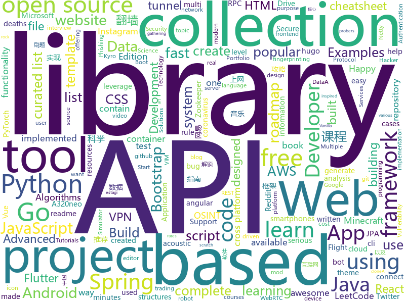

# 2020-08-31
See what the GitHub community is most excited about.

## python
+ [present](https://github.com/vinayak-mehta/present)(**957 stars today**): A terminal-based presentation tool with colors and effects.
+ [Python](https://github.com/TheAlgorithms/Python)(**255 stars today**): All Algorithms implemented in Python
+ [learn-python](https://github.com/trekhleb/learn-python)(**295 stars today**): 📚Playground and cheatsheet for learning Python. Collection of Python scripts that are split by topics and contain code examples with explanations.
+ [handcalcs](https://github.com/connorferster/handcalcs)(**128 stars today**): Python library for converting Python calculations into rendered latex.
+ [learn-python3](https://github.com/jerry-git/learn-python3)(**224 stars today**): Jupyter notebooks for teaching/learning Python 3
+ [ranger](https://github.com/ranger/ranger)(**85 stars today**): A VIM-inspired filemanager for the console
+ [freqtrade](https://github.com/freqtrade/freqtrade)(**8 stars today**): Free, open source crypto trading bot
+ [covid-19-data](https://github.com/owid/covid-19-data)(**4 stars today**): Data on COVID-19 (coronavirus) confirmed cases, deaths, and tests • All countries • Updated daily by Our World in Data
+ [tuya-convert](https://github.com/ct-Open-Source/tuya-convert)(**3 stars today**): A collection of scripts to flash Tuya IoT devices to alternative firmwares
+ [streamlink](https://github.com/streamlink/streamlink)(**5 stars today**): Streamlink is a CLI utility which pipes video streams from various services into a video player
+ [GenSMBIOS](https://github.com/corpnewt/GenSMBIOS)(**2 stars today**): Py script that uses acidanthera's macserial to generate SMBIOS and optionally saves them to a plist.
+ [Userge](https://github.com/UsergeTeam/Userge)(**15 stars today**): Userge, Durable as a Serge
+ [objax](https://github.com/google/objax)(**117 stars today**): 
+ [Top2Vec](https://github.com/ddangelov/Top2Vec)(**28 stars today**): Top2Vec learns jointly embedded topic, document and word vectors.
+ [wifite2](https://github.com/derv82/wifite2)(**2 stars today**): Rewrite of the popular wireless network auditor, "wifite"
+ [Osintgram](https://github.com/Datalux/Osintgram)(**13 stars today**): Osintgram is a OSINT tool on Instagram. It offers an interactive shell to perform analysis on Instagram account of any users by its nickname
+ [Real-Time-Voice-Cloning](https://github.com/CorentinJ/Real-Time-Voice-Cloning)(**47 stars today**): Clone a voice in 5 seconds to generate arbitrary speech in real-time
+ [asciimatics](https://github.com/peterbrittain/asciimatics)(**127 stars today**): A cross platform package to do curses-like operations, plus higher level APIs and widgets to create text UIs and ASCII art animations
+ [HiddenEye](https://github.com/DarkSecDevelopers/HiddenEye)(**7 stars today**): Modern Phishing Tool With Advanced Functionality And Multiple Tunnelling Services [ Android-Support-Available ]
+ [python-telegram-bot](https://github.com/python-telegram-bot/python-telegram-bot)(**14 stars today**): We have made you a wrapper you can't refuse
+ [Zoom_Automation](https://github.com/Mizan-Ali/Zoom_Automation)(**5 stars today**): A python script that automatically joins a zoom meeting based on your timetable.
+ [pyrogram](https://github.com/pyrogram/pyrogram)(**10 stars today**): Telegram MTProto API Client Library and Framework for Python
+ [youtube-dl-gui](https://github.com/MrS0m30n3/youtube-dl-gui)(**5 stars today**): A cross platform front-end GUI of the popular youtube-dl written in wxPython.
+ [backtrader](https://github.com/mementum/backtrader)(**12 stars today**): Python Backtesting library for trading strategies
+ [pwntools](https://github.com/Gallopsled/pwntools)(**6 stars today**): CTF framework and exploit development library

## java
+ [Java-Tutorial](https://github.com/h2pl/Java-Tutorial)(**40 stars today**): 【Java工程师面试复习指南】本仓库涵盖大部分Java程序员所需要掌握的核心知识，整合了互联网上的很多优质Java技术文章，力求打造为最完整最实用的Java开发者学习指南，如果对你有帮助，给个star告诉我吧，谢谢！
+ [Geyser](https://github.com/GeyserMC/Geyser)(**6 stars today**): A bridge/proxy allowing you to connect to Minecraft: Java Edition servers with Minecraft: Bedrock edition.
+ [Mindustry](https://github.com/Anuken/Mindustry)(**97 stars today**): A sandbox tower defense game
+ [guide-rpc-framework](https://github.com/Snailclimb/guide-rpc-framework)(**24 stars today**): A custom RPC framework implemented by Netty+Kyro+Zookeeper.（一款基于 Netty+Kyro+Zookeeper 实现的自定义 RPC 框架-附详细实现过程和相关教程。）
+ [OpenBot](https://github.com/intel-isl/OpenBot)(**182 stars today**): OpenBot leverages smartphones as brains for low-cost robots. We have designed a small electric vehicle that costs about $50 and serves as a robot body. Our software stack for Android smartphones supports advanced robotics workloads such as person following and real-time autonomous navigation.
+ [Algorithms](https://github.com/williamfiset/Algorithms)(**25 stars today**): A collection of algorithms and data structures
+ [easy163](https://github.com/ndroi/easy163)(**25 stars today**): 安卓端一键解锁网易云音乐，无须 ROOT
+ [FizzBuzzEnterpriseEdition](https://github.com/EnterpriseQualityCoding/FizzBuzzEnterpriseEdition)(**12 stars today**): FizzBuzz Enterprise Edition is a no-nonsense implementation of FizzBuzz made by serious businessmen for serious business purposes.
+ [tink](https://github.com/google/tink)(**15 stars today**): Tink is a multi-language, cross-platform, open source library that provides cryptographic APIs that are secure, easy to use correctly, and hard(er) to misuse.
+ [tutorials](https://github.com/eugenp/tutorials)(**20 stars today**): Just Announced - "Learn Spring Security OAuth":
+ [spring-reddit-clone](https://github.com/SaiUpadhyayula/spring-reddit-clone)(**1 stars today**): Reddit clone built using Spring Boot, Spring Security with JPA Authentication, Spring Data JPA with MySQL, Spring MVC. The frontend is built using Angular - You can find the frontend source code here - https://github.com/SaiUpadhyayula/angular-reddit-clone
+ [spring-petclinic](https://github.com/spring-projects/spring-petclinic)(**5 stars today**): A sample Spring-based application
+ [InternetArchitect](https://github.com/bjmashibing/InternetArchitect)(**7 stars today**): 年薪百万互联网架构师课程文档及源码(公开部分)
+ [android-developer-roadmap](https://github.com/MindorksOpenSource/android-developer-roadmap)(**4 stars today**): Android Developer Roadmap - A complete roadmap to learn Android App Development
+ [HackerRank_solutions](https://github.com/RodneyShag/HackerRank_solutions)(**3 stars today**): 317 efficient solutions to HackerRank problems
+ [FunTester](https://github.com/JunManYuanLong/FunTester)(**14 stars today**): FunTester测试框架，接口功能、自动化、性能、单元测试，moco API、工具类等等。
+ [sodium-fabric](https://github.com/jellysquid3/sodium-fabric)(**5 stars today**): A Fabric mod designed to improve frame rates and reduce micro-stutter
+ [baritone](https://github.com/cabaletta/baritone)(**6 stars today**): google maps for block game
+ [spring-boot-spring-security-jwt-authentication](https://github.com/bezkoder/spring-boot-spring-security-jwt-authentication)(**0 stars today**): Spring Boot Demo Application for JWT Authentication with Spring Security
+ [BCSC1002Assignment1](https://github.com/dbc2201/BCSC1002Assignment1)(****): 
+ [exam-plantform](https://github.com/DDD-Bootcamp/exam-plantform)(**0 stars today**): 
+ [Signal-Server](https://github.com/signalapp/Signal-Server)(**8 stars today**): 
+ [MinecraftForge](https://github.com/MinecraftForge/MinecraftForge)(**8 stars today**): Modifications to the Minecraft base files to assist in compatibility between mods.
+ [algos](https://github.com/iiitv/algos)(**9 stars today**): Popular Algorithms and Data Structures implemented in popular languages
+ [aws-doc-sdk-examples](https://github.com/awsdocs/aws-doc-sdk-examples)(**14 stars today**): Welcome to the AWS Code Examples Repository. This repo contains code examples used in the AWS documentation, AWS SDK Developer Guides, and more. For more information, see the Readme.rst file below.

## unknown
+ [webrtc-for-the-curious](https://github.com/webrtc-for-the-curious/webrtc-for-the-curious)(**238 stars today**): WebRTC for the Curious: Go beyond the APIs
+ [free-programming-books](https://github.com/EbookFoundation/free-programming-books)(**586 stars today**): 📚Freely available programming books
+ [developer-roadmap](https://github.com/kamranahmedse/developer-roadmap)(**167 stars today**): Roadmap to becoming a web developer in 2020
+ [KingOfBugBountyTips](https://github.com/OfJAAH/KingOfBugBountyTips)(**43 stars today**): 
+ [HowToHunt](https://github.com/KathanP19/HowToHunt)(**13 stars today**): Some Tutorials and Things to Do while Hunting That Vulnerability.
+ [project-based-learning](https://github.com/tuvtran/project-based-learning)(**174 stars today**): Curated list of project-based tutorials
+ [Flutter-Course-Resources](https://github.com/londonappbrewery/Flutter-Course-Resources)(**62 stars today**): Learn to Code While Building Apps - The Complete Flutter Development Bootcamp
+ [CloudPentestCheatsheets](https://github.com/dafthack/CloudPentestCheatsheets)(**36 stars today**): This repository contains a collection of cheatsheets I have put together for tools related to pentesting organizations that leverage cloud providers.
+ [You-Dont-Know-JS](https://github.com/getify/You-Dont-Know-JS)(**39 stars today**): A book series on JavaScript. @YDKJS on twitter.
+ [the-incredible-pytorch](https://github.com/ritchieng/the-incredible-pytorch)(**19 stars today**): The Incredible PyTorch: a curated list of tutorials, papers, projects, communities and more relating to PyTorch.
+ [desafio-5-2020](https://github.com/maratonadev-br/desafio-5-2020)(**9 stars today**): 
+ [the-book-of-secret-knowledge](https://github.com/trimstray/the-book-of-secret-knowledge)(**21 stars today**): A collection of inspiring lists, manuals, cheatsheets, blogs, hacks, one-liners, cli/web tools and more.
+ [vagas-junior-estagio](https://github.com/alinebastos/vagas-junior-estagio)(**24 stars today**): Empresas que constantemente oferecem vagas para junior e estagiários
+ [Resources-for-Beginner-Bug-Bounty-Hunters](https://github.com/nahamsec/Resources-for-Beginner-Bug-Bounty-Hunters)(**25 stars today**): A list of resources for those interested in getting started in bug bounties
+ [covid-19-data](https://github.com/nytimes/covid-19-data)(**5 stars today**): An ongoing repository of data on coronavirus cases and deaths in the U.S.
+ [build-your-own-x](https://github.com/danistefanovic/build-your-own-x)(**45 stars today**): 🤓Build your own (insert technology here)
+ [rfcs](https://github.com/vuejs/rfcs)(**4 stars today**): RFCs for substantial changes / feature additions to Vue core
+ [system-design-interview](https://github.com/checkcheckzz/system-design-interview)(**12 stars today**): System design interview for IT companies
+ [flutter-development-roadmap](https://github.com/Tarikul711/flutter-development-roadmap)(**95 stars today**): Flutter App Developer Roadmap - A complete roadmap to learn Flutter App Development. I tried to learn flutter using this roadmap. If you want to add something please contribute to the project. Happy Learning
+ [awesome-osint](https://github.com/jivoi/awesome-osint)(**6 stars today**): 😱A curated list of amazingly awesome OSINT
+ [Profiles](https://github.com/DivineEngine/Profiles)(**7 stars today**): 🌐Dial-up Internet access
+ [Free-Certifications](https://github.com/cloudcommunity/Free-Certifications)(**6 stars today**): Curated list of free courses & certifications
+ [Learn-Vim](https://github.com/iggredible/Learn-Vim)(**384 stars today**): A book for learning the Vim editor the smart way.
+ [ClashForAndroid](https://github.com/Kr328/ClashForAndroid)(**20 stars today**): A rule-based tunnel for Android.
+ [data-science](https://github.com/ossu/data-science)(**6 stars today**): 📊Path to a free self-taught education in Data Science!

## javascript
+ [icons](https://github.com/twbs/icons)(**304 stars today**): Official open source SVG icon library for Bootstrap.
+ [Javascript-Essentials](https://github.com/LetsUpgrade/Javascript-Essentials)(**12 stars today**): 
+ [project-guidelines](https://github.com/elsewhencode/project-guidelines)(**404 stars today**): A set of best practices for JavaScript projects
+ [Hack-Tools](https://github.com/LasCC/Hack-Tools)(**39 stars today**): The all-in-one Red Team extension for Web Pentester🛠
+ [iptv](https://github.com/iptv-org/iptv)(**98 stars today**): Collection of 8000+ publicly available IPTV channels from all over the world
+ [pipedream](https://github.com/PipedreamHQ/pipedream)(**5 stars today**): Serverless integration and compute platform. Free for developers.
+ [google-interview-preparation-problems](https://github.com/mgechev/google-interview-preparation-problems)(**35 stars today**): leetcode problems I solved during my Google interview preparation.
+ [discord.js](https://github.com/discordjs/discord.js)(**42 stars today**): A powerful JavaScript library for interacting with the Discord API
+ [gatsby](https://github.com/gatsbyjs/gatsby)(**23 stars today**): Build blazing fast, modern apps and websites with React
+ [freeCodeCamp](https://github.com/freeCodeCamp/freeCodeCamp)(**45 stars today**): freeCodeCamp.org's open source codebase and curriculum. Learn to code at home.
+ [nodejs-zoom-clone](https://github.com/CleverProgrammers/nodejs-zoom-clone)(**3 stars today**): 
+ [vault](https://github.com/yfii/vault)(**4 stars today**): 
+ [arwes](https://github.com/arwes/arwes)(**314 stars today**): Futuristic Sci-Fi and Cyberpunk Graphical User Interface Framework for Web Apps
+ [Olaf](https://github.com/JorenSix/Olaf)(**40 stars today**): Olaf: Overly lightweight acoustic fingerprinting is a portable acoustic fingerprinting system.
+ [alpine](https://github.com/alpinejs/alpine)(**25 stars today**): A rugged, minimal framework for composing JavaScript behavior in your markup.
+ [brahmos](https://github.com/brahmosjs/brahmos)(**19 stars today**): Super charged JavaScript library with modern React API and native templates.
+ [iearn-finance](https://github.com/iearn-finance/iearn-finance)(**4 stars today**): Web repository
+ [in-quiz-questions](https://github.com/Ebazhanov/in-quiz-questions)(**5 stars today**): Skill Linkedin quiz Assessment, answers and questions (aws-lambda, rest-api, javascript, react, git, html, jquery, maven, mongodb, xml, java, css, python ...) ответы на квиз
+ [Awesome-Profile-README-templates](https://github.com/kautukkundan/Awesome-Profile-README-templates)(**22 stars today**): A collection of awesome readme templates to display on your profile
+ [tech-interview-handbook](https://github.com/yangshun/tech-interview-handbook)(**27 stars today**): 💯Materials to help you rock your next coding interview
+ [next.js](https://github.com/vercel/next.js)(**37 stars today**): The React Framework
+ [nlp.js](https://github.com/axa-group/nlp.js)(**9 stars today**): An NLP library for building bots, with entity extraction, sentiment analysis, automatic language identify, and so more
+ [node-telegram-bot-api](https://github.com/yagop/node-telegram-bot-api)(**6 stars today**): Telegram Bot API for NodeJS
+ [Unlock-netease-cloud-music](https://github.com/meng-chuan/Unlock-netease-cloud-music)(**12 stars today**): 解锁网易云音乐客户端变灰歌曲
+ [SpaceX-API](https://github.com/r-spacex/SpaceX-API)(**7 stars today**): 🚀Open Source REST API for rocket, core, capsule, pad, and launch data

## html
+ [free-for-dev](https://github.com/ripienaar/free-for-dev)(**230 stars today**): A list of SaaS, PaaS and IaaS offerings that have free tiers of interest to devops and infradev
+ [JavaScript30](https://github.com/wesbos/JavaScript30)(**7 stars today**): 30 Day Vanilla JS Challenge
+ [startbootstrap-sb-admin-2](https://github.com/StartBootstrap/startbootstrap-sb-admin-2)(**3 stars today**): A free, open source, Bootstrap admin theme created by Start Bootstrap
+ [hugo-coder](https://github.com/luizdepra/hugo-coder)(**2 stars today**): A minimalist blog theme for hugo.
+ [ESPEasy](https://github.com/letscontrolit/ESPEasy)(**3 stars today**): Easy MultiSensor device based on ESP8266
+ [fluxion](https://github.com/FluxionNetwork/fluxion)(**4 stars today**): Fluxion is a remake of linset by vk496 with enhanced functionality.
+ [REKCARC-TSC-UHT](https://github.com/PKUanonym/REKCARC-TSC-UHT)(**7 stars today**): 清华大学计算机系课程攻略 Guidance for courses in Department of Computer Science and Technology, Tsinghua University
+ [Coursera-ML-AndrewNg-Notes](https://github.com/fengdu78/Coursera-ML-AndrewNg-Notes)(**12 stars today**): 吴恩达老师的机器学习课程个人笔记
+ [aave-protocol](https://github.com/aave/aave-protocol)(**5 stars today**): Aave Protocol Version 1.0 - Decentralized Lending Pools
+ [zphisher](https://github.com/htr-tech/zphisher)(**1 stars today**): Automated Phishing Tool
+ [zju-icicles](https://github.com/QSCTech/zju-icicles)(**13 stars today**): 浙江大学课程攻略共享计划
+ [RateMySupervisor](https://github.com/kgco/RateMySupervisor)(**63 stars today**): 永久免费开源的导师评价数据、数据爬虫、无需编程基础的展示网页以及新信息补充平台
+ [GDIndex](https://github.com/maple3142/GDIndex)(**6 stars today**): A Google Drive Index built with Vue Running on CloudFlare Workers
+ [msfs-a320neo](https://github.com/wpine215/msfs-a320neo)(**42 stars today**): The A32NX Project is a community driven open source project to create a free Airbus A320neo in Microsoft Flight Simulator that is as close to reality as possible. It aims to enhance the default A320neo by improving the systems depth and functionality to bring it up to payware-level, all for free.
+ [Hacktoberfest2020](https://github.com/OpenSouceCode/Hacktoberfest2020)(**10 stars today**): Make your first Pull Request and earn a free tee from GitHub!
+ [FakeLocation](https://github.com/Lerist/FakeLocation)(**3 stars today**): Fake Location
+ [startbootstrap-landing-page](https://github.com/StartBootstrap/startbootstrap-landing-page)(**2 stars today**): A responsive, Bootstrap landing page template created by Start Bootstrap
+ [shellphish](https://github.com/suljot/shellphish)(**6 stars today**): Phishing Tool for Instagram, Facebook, Twitter, Snapchat, Github
+ [vpncn.github.io](https://github.com/vpncn/vpncn.github.io)(**5 stars today**): 2020中国翻墙软件VPN推荐指南，以及对比SSR、蓝灯、WireGuard、V2ray、老王VPN等科学上网软件与翻墙方法的优缺点，中国最新科学上网翻墙VPN梯子推荐，稳定好用。
+ [csswg-drafts](https://github.com/w3c/csswg-drafts)(**3 stars today**): CSS Working Group Editor Drafts
+ [hugo-academic](https://github.com/gcushen/hugo-academic)(**3 stars today**): 📝The website builder for Hugo. Build and deploy a beautiful website in minutes!
+ [training-kit](https://github.com/github/training-kit)(**1 stars today**): Open source cheat sheets for Git and GitHub
+ [PortFolio_Website](https://github.com/akashyap2013/PortFolio_Website)(**0 stars today**): Complete Portfolio Website with Bootstrap - HTML/CSS In this project, we are going to learn and build how to create a complete portfolio website with bootstrap using HTML and CSS. We will understand everything from scratch.
+ [system-uicons](https://github.com/CoreyGinnivan/system-uicons)(**7 stars today**): System UIcons is an icon library design for systems and products. Use how you want, without attribution.
+ [BigBookofR](https://github.com/oscarbaruffa/BigBookofR)(**5 stars today**): The biggest collection of R books (and maybe later some other resources too)

## go
+ [LeetCode-Go](https://github.com/halfrost/LeetCode-Go)(**278 stars today**): ✅Solutions to LeetCode by Go, 100% test coverage, runtime beats 100% / LeetCode 题解
+ [algorithm-pattern](https://github.com/greyireland/algorithm-pattern)(**185 stars today**): 算法模板，最科学的刷题方式，最快速的刷题路径，你值得拥有~
+ [webrtc](https://github.com/pion/webrtc)(**26 stars today**): Pure Go implementation of the WebRTC API
+ [Cloudreve](https://github.com/cloudreve/Cloudreve)(**56 stars today**): 🌩支持多家云存储的云盘系统 (A project helps you build your own cloud in minutes)
+ [nuclei](https://github.com/projectdiscovery/nuclei)(**13 stars today**): Nuclei is a fast tool for configurable targeted scanning based on templates offering massive extensibility and ease of use.
+ [learngo](https://github.com/inancgumus/learngo)(**31 stars today**): 1000+ Hand-Crafted Go Examples, Exercises, and Quizzes
+ [maddy](https://github.com/foxcpp/maddy)(**106 stars today**): ✉️Composable all-in-one mail server.
+ [wails](https://github.com/wailsapp/wails)(**15 stars today**): Create desktop apps using Go and Web Technologies.
+ [msfs2020-go](https://github.com/lian/msfs2020-go)(**13 stars today**): connect to microsoft flight simulator 2020 using golang
+ [moby](https://github.com/moby/moby)(**10 stars today**): Moby Project - a collaborative project for the container ecosystem to assemble container-based systems
+ [httpx](https://github.com/projectdiscovery/httpx)(**15 stars today**): httpx is a fast and multi-purpose HTTP toolkit allow to run multiple probers using retryablehttp library, it is designed to maintain the result reliability with increased threads.
+ [v2ray-core](https://github.com/v2ray/v2ray-core)(**43 stars today**): A platform for building proxies to bypass network restrictions.
+ [teleport](https://github.com/gravitational/teleport)(**7 stars today**): Secure Access for Developers that doesn't get in the way.
+ [clash](https://github.com/Dreamacro/clash)(**22 stars today**): A rule-based tunnel in Go.
+ [go](https://github.com/golang/go)(**74 stars today**): The Go programming language
+ [syncthing](https://github.com/syncthing/syncthing)(**17 stars today**): Open Source Continuous File Synchronization
+ [awesome-go](https://github.com/avelino/awesome-go)(**38 stars today**): A curated list of awesome Go frameworks, libraries and software
+ [trivy](https://github.com/aquasecurity/trivy)(**9 stars today**): A Simple and Comprehensive Vulnerability Scanner for Containers, Suitable for CI
+ [WebHackersWeapons](https://github.com/hahwul/WebHackersWeapons)(**4 stars today**): ⚔️Web Hacker's Weapons / A collection of cool tools used by Web hackers. Happy hacking , Happy bug-hunting
+ [gospider](https://github.com/jaeles-project/gospider)(**13 stars today**): Gospider - Fast web spider written in Go
+ [learn-go-with-tests](https://github.com/quii/learn-go-with-tests)(**14 stars today**): Learn Go with test-driven development
+ [chromedp](https://github.com/chromedp/chromedp)(**10 stars today**): A faster, simpler way to drive browsers supporting the Chrome DevTools Protocol.
+ [PhoneInfoga](https://github.com/sundowndev/PhoneInfoga)(**7 stars today**): Advanced information gathering & OSINT framework for phone numbers
+ [chisel](https://github.com/jpillora/chisel)(**4 stars today**): A fast TCP tunnel over HTTP
+ [webpackage](https://github.com/WICG/webpackage)(**5 stars today**): Web packaging format

## WordCloud

