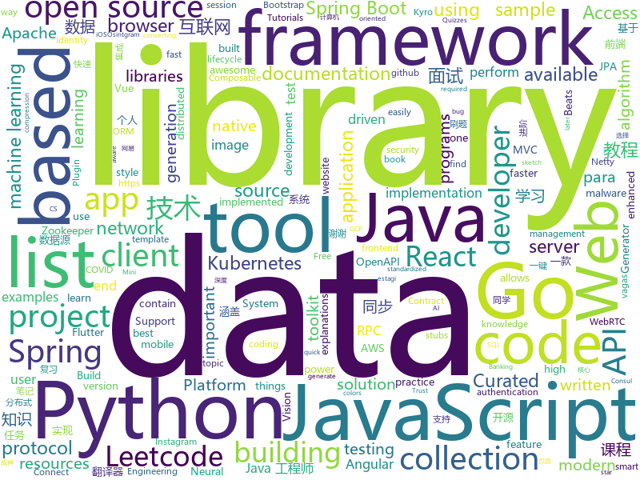

# 2020-09-01
See what the GitHub community is most excited about.

## python
+ [present](https://github.com/vinayak-mehta/present)(**1,317 stars today**): A terminal-based presentation tool with colors and effects.
+ [Python](https://github.com/TheAlgorithms/Python)(**283 stars today**): All Algorithms implemented in Python
+ [NeMo](https://github.com/NVIDIA/NeMo)(**27 stars today**): NeMo: a toolkit for conversational AI
+ [12306](https://github.com/testerSunshine/12306)(**12 stars today**): 12306智能刷票，订票
+ [jax](https://github.com/google/jax)(**19 stars today**): Composable transformations of Python+NumPy programs: differentiate, vectorize, JIT to GPU/TPU, and more
+ [yolov5](https://github.com/ultralytics/yolov5)(**26 stars today**): YOLOv5 in PyTorch > ONNX > CoreML > iOS
+ [Osintgram](https://github.com/Datalux/Osintgram)(**16 stars today**): Osintgram is a OSINT tool on Instagram. It offers an interactive shell to perform analysis on Instagram account of any users by its nickname
+ [handcalcs](https://github.com/connorferster/handcalcs)(**207 stars today**): Python library for converting Python calculations into rendered latex.
+ [Dango-Translator](https://github.com/PantsuDango/Dango-Translator)(**19 stars today**): 团子翻译器 —— 个人兴趣制作的一款基于OCR技术的翻译器
+ [learn-python](https://github.com/trekhleb/learn-python)(**317 stars today**): 📚Playground and cheatsheet for learning Python. Collection of Python scripts that are split by topics and contain code examples with explanations.
+ [python-patterns](https://github.com/faif/python-patterns)(**17 stars today**): A collection of design patterns/idioms in Python
+ [Hands-On-Artificial-Intelligence-for-Banking](https://github.com/PacktPublishing/Hands-On-Artificial-Intelligence-for-Banking)(**14 stars today**): Hands-On Artificial Intelligence for Banking, published by Packt
+ [hummingbot](https://github.com/CoinAlpha/hummingbot)(**4 stars today**): Hummingbot: a client for crypto market making
+ [howdy](https://github.com/boltgolt/howdy)(**48 stars today**): 🛡️Windows Hello™ style facial authentication for Linux
+ [Userge](https://github.com/UsergeTeam/Userge)(**15 stars today**): Userge, Durable as a Serge
+ [mmdetection](https://github.com/open-mmlab/mmdetection)(**22 stars today**): OpenMMLab Detection Toolbox and Benchmark
+ [Top2Vec](https://github.com/ddangelov/Top2Vec)(**34 stars today**): Top2Vec learns jointly embedded topic, document and word vectors.
+ [malwoverview](https://github.com/alexandreborges/malwoverview)(**14 stars today**): Malwoverview is a first response tool to perform an initial and quick triage in a directory containing malware samples, specific malware sample, suspect URL and domains. Additionally, it allows to download and send samples to main online sandboxes.
+ [dagster](https://github.com/dagster-io/dagster)(**11 stars today**): A data orchestrator for machine learning, analytics, and ETL.
+ [MONAI](https://github.com/Project-MONAI/MONAI)(**7 stars today**): AI Toolkit for Healthcare Imaging
+ [nni](https://github.com/microsoft/nni)(**8 stars today**): An open source AutoML toolkit for automate machine learning lifecycle, including feature engineering, neural architecture search, model compression and hyper-parameter tuning.
+ [incubator-superset](https://github.com/apache/incubator-superset)(**7 stars today**): Apache Superset is a Data Visualization and Data Exploration Platform
+ [pyinstaller](https://github.com/pyinstaller/pyinstaller)(**5 stars today**): Freeze (package) Python programs into stand-alone executables
+ [awesome-python](https://github.com/vinta/awesome-python)(**65 stars today**): A curated list of awesome Python frameworks, libraries, software and resources
+ [Pytorch-UNet](https://github.com/milesial/Pytorch-UNet)(**6 stars today**): PyTorch implementation of the U-Net for image semantic segmentation with high quality images

## java
+ [Java-Tutorial](https://github.com/h2pl/Java-Tutorial)(**69 stars today**): 【Java工程师面试复习指南】本仓库涵盖大部分Java程序员所需要掌握的核心知识，整合了互联网上的很多优质Java技术文章，力求打造为最完整最实用的Java开发者学习指南，如果对你有帮助，给个star告诉我吧，谢谢！
+ [guide-rpc-framework](https://github.com/Snailclimb/guide-rpc-framework)(**36 stars today**): A custom RPC framework implemented by Netty+Kyro+Zookeeper.（一款基于 Netty+Kyro+Zookeeper 实现的自定义 RPC 框架-附详细实现过程和相关教程。）
+ [toBeTopJavaer](https://github.com/hollischuang/toBeTopJavaer)(**24 stars today**): To Be Top Javaer - Java工程师成神之路
+ [halo](https://github.com/halo-dev/halo)(**50 stars today**): ✍An excellent open source blog publishing application. | 一个优秀的开源博客发布应用。
+ [easy163](https://github.com/ndroi/easy163)(**52 stars today**): 安卓端一键解锁网易云音乐，无须 ROOT
+ [openapi-generator](https://github.com/OpenAPITools/openapi-generator)(**10 stars today**): OpenAPI Generator allows generation of API client libraries (SDK generation), server stubs, documentation and configuration automatically given an OpenAPI Spec (v2, v3)
+ [InternetArchitect](https://github.com/bjmashibing/InternetArchitect)(**8 stars today**): 年薪百万互联网架构师课程文档及源码(公开部分)
+ [dubbo](https://github.com/apache/dubbo)(**19 stars today**): Apache Dubbo is a high-performance, java based, open source RPC framework.
+ [CS-Notes](https://github.com/CyC2018/CS-Notes)(**81 stars today**): 📚技术面试必备基础知识、Leetcode、计算机操作系统、计算机网络、系统设计、Java、Python、C++
+ [thumbnailator](https://github.com/coobird/thumbnailator)(**5 stars today**): Thumbnailator - a thumbnail generation library for Java
+ [hazelcast](https://github.com/hazelcast/hazelcast)(**2 stars today**): Open Source In-Memory Data Grid
+ [koronavilkku-backend](https://github.com/THLfi/koronavilkku-backend)(**14 stars today**): 
+ [spring-reddit-clone](https://github.com/SaiUpadhyayula/spring-reddit-clone)(**3 stars today**): Reddit clone built using Spring Boot, Spring Security with JPA Authentication, Spring Data JPA with MySQL, Spring MVC. The frontend is built using Angular - You can find the frontend source code here - https://github.com/SaiUpadhyayula/angular-reddit-clone
+ [keycloak](https://github.com/keycloak/keycloak)(**10 stars today**): Open Source Identity and Access Management For Modern Applications and Services
+ [Algorithms](https://github.com/williamfiset/Algorithms)(**14 stars today**): A collection of algorithms and data structures
+ [graal](https://github.com/oracle/graal)(**15 stars today**): GraalVM: Run Programs Faster Anywhere🚀
+ [hive](https://github.com/apache/hive)(**0 stars today**): Apache Hive
+ [COLA](https://github.com/alibaba/COLA)(**6 stars today**): Clean Object-oriented & Layered Architecture
+ [spring-framework](https://github.com/spring-projects/spring-framework)(**24 stars today**): Spring Framework
+ [cordova-plugin-inappbrowser](https://github.com/apache/cordova-plugin-inappbrowser)(**0 stars today**): Apache Cordova Plugin inappbrowser
+ [springboot-guide](https://github.com/Snailclimb/springboot-guide)(**12 stars today**): Not only Spring Boot but also important knowledge of Spring（不只是SpringBoot还有Spring重要知识点）
+ [advanced-java](https://github.com/doocs/advanced-java)(**27 stars today**): 😮互联网 Java 工程师进阶知识完全扫盲：涵盖高并发、分布式、高可用、微服务、海量数据处理等领域知识，后端同学必看，前端同学也可学习
+ [spring-boot-examples](https://github.com/ityouknow/spring-boot-examples)(**16 stars today**): about learning Spring Boot via examples. Spring Boot 教程、技术栈示例代码，快速简单上手教程。
+ [dbeaver](https://github.com/dbeaver/dbeaver)(**27 stars today**): Free universal database tool and SQL client
+ [datax-web](https://github.com/WeiYe-Jing/datax-web)(**4 stars today**): DataX集成可视化页面，选择数据源即可一键生成数据同步任务，支持批量创建RDBMS数据同步任务，集成开源调度系统，支持分布式、增量同步数据、实时查看运行日志、监控执行器资源、KILL运行进程、数据源信息加密等。

## unknown
+ [webrtc-for-the-curious](https://github.com/webrtc-for-the-curious/webrtc-for-the-curious)(**364 stars today**): WebRTC for the Curious: Go beyond the APIs
+ [free-programming-books](https://github.com/EbookFoundation/free-programming-books)(**442 stars today**): 📚Freely available programming books
+ [Flutter-Course-Resources](https://github.com/londonappbrewery/Flutter-Course-Resources)(**140 stars today**): Learn to Code While Building Apps - The Complete Flutter Development Bootcamp
+ [developer-roadmap](https://github.com/kamranahmedse/developer-roadmap)(**353 stars today**): Roadmap to becoming a web developer in 2020
+ [SuperPower](https://github.com/SensorsIot/SuperPower)(**36 stars today**): Here you should find the best power supplies for your low-power projects
+ [project-based-learning](https://github.com/tuvtran/project-based-learning)(**189 stars today**): Curated list of project-based tutorials
+ [KingOfBugBountyTips](https://github.com/OfJAAH/KingOfBugBountyTips)(**60 stars today**): 
+ [build-your-own-x](https://github.com/danistefanovic/build-your-own-x)(**69 stars today**): 🤓Build your own (insert technology here)
+ [machine-learning-roadmap](https://github.com/mrdbourke/machine-learning-roadmap)(**21 stars today**): A roadmap connecting many of the most important concepts in machine learning, how to learn them and what tools to use to perform them.
+ [HowToHunt](https://github.com/KathanP19/HowToHunt)(**42 stars today**): Some Tutorials and Things to Do while Hunting That Vulnerability.
+ [Python](https://github.com/TwoWater/Python)(**10 stars today**): 最良心的 Python 教程：
+ [unmaintainable-code](https://github.com/Droogans/unmaintainable-code)(**137 stars today**): A more maintainable, easier to share version of the infamous http://mindprod.com/jgloss/unmain.html
+ [vagas-junior-estagio](https://github.com/alinebastos/vagas-junior-estagio)(**42 stars today**): Empresas que constantemente oferecem vagas para junior e estagiários
+ [desafio-5-2020](https://github.com/maratonadev-br/desafio-5-2020)(**8 stars today**): 
+ [kubernetes-network-policy-recipes](https://github.com/ahmetb/kubernetes-network-policy-recipes)(**7 stars today**): Example recipes for Kubernetes Network Policies that you can just copy paste
+ [Resources-for-Beginner-Bug-Bounty-Hunters](https://github.com/nahamsec/Resources-for-Beginner-Bug-Bounty-Hunters)(**26 stars today**): A list of resources for those interested in getting started in bug bounties
+ [Learn-Vim](https://github.com/iggredible/Learn-Vim)(**350 stars today**): A book for learning the Vim editor the smart way.
+ [awesome-project-ideas](https://github.com/NirantK/awesome-project-ideas)(**18 stars today**): Curated list of Machine Learning, NLP, Vision, Recommender Systems Project Ideas
+ [vagas](https://github.com/frontendbr/vagas)(**12 stars today**): 🔬Espaço para divulgação de vagas para front-enders.
+ [leetcode](https://github.com/grandyang/leetcode)(**14 stars today**): Provide all my solutions and explanations in Chinese for all the Leetcode coding problems.
+ [awesome-php](https://github.com/ziadoz/awesome-php)(**11 stars today**): A curated list of amazingly awesome PHP libraries, resources and shiny things.
+ [API-Security-Checklist](https://github.com/shieldfy/API-Security-Checklist)(**4 stars today**): Checklist of the most important security countermeasures when designing, testing, and releasing your API
+ [HoloLens2ForCV](https://github.com/microsoft/HoloLens2ForCV)(**7 stars today**): Sample code and documentation for using the Microsoft HoloLens 2 for Computer Vision research.
+ [Front-End-Interview-Notebook](https://github.com/CavsZhouyou/Front-End-Interview-Notebook)(**6 stars today**): 🐜前端面试复习笔记

## javascript
+ [project-guidelines](https://github.com/elsewhencode/project-guidelines)(**281 stars today**): A set of best practices for JavaScript projects
+ [Javascript-Essentials](https://github.com/LetsUpgrade/Javascript-Essentials)(**18 stars today**): 
+ [portainer](https://github.com/portainer/portainer)(**21 stars today**): Making Docker management easy.
+ [Hack-Tools](https://github.com/LasCC/Hack-Tools)(**95 stars today**): The all-in-one Red Team extension for Web Pentester🛠
+ [svelte](https://github.com/sveltejs/svelte)(**28 stars today**): Cybernetically enhanced web apps
+ [react-pdf](https://github.com/wojtekmaj/react-pdf)(**71 stars today**): Display PDFs in your React app as easily as if they were images.
+ [iptv](https://github.com/iptv-org/iptv)(**148 stars today**): Collection of 8000+ publicly available IPTV channels from all over the world
+ [icons](https://github.com/twbs/icons)(**356 stars today**): Official open source SVG icon library for Bootstrap.
+ [react-native](https://github.com/facebook/react-native)(**43 stars today**): A framework for building native apps with React.
+ [core-js](https://github.com/zloirock/core-js)(**10 stars today**): Standard Library
+ [gatsby](https://github.com/gatsbyjs/gatsby)(**31 stars today**): Build blazing fast, modern apps and websites with React
+ [cnvalues.github.io](https://github.com/CNValues/cnvalues.github.io)(**12 stars today**): 
+ [pipedream](https://github.com/PipedreamHQ/pipedream)(**5 stars today**): Serverless integration and compute platform. Free for developers.
+ [csgo_bugs](https://github.com/kkthxbye-code/csgo_bugs)(**5 stars today**): Random CSGO stuff
+ [strapi](https://github.com/strapi/strapi)(**40 stars today**): 🚀Open source Node.js Headless CMS to easily build customisable APIs
+ [openzeppelin-contracts](https://github.com/OpenZeppelin/openzeppelin-contracts)(**4 stars today**): OpenZeppelin Contracts is a library for secure smart contract development.
+ [style2paints](https://github.com/lllyasviel/style2paints)(**12 stars today**): sketch + style = paints🎨(TOG2018/SIGGRAPH2018ASIA)
+ [Detox](https://github.com/wix/Detox)(**6 stars today**): Gray box end-to-end testing and automation framework for mobile apps
+ [stayaway-app](https://github.com/stayawayinesctec/stayaway-app)(**13 stars today**): Official repository for the STAYAWAY COVID mobile application
+ [react](https://github.com/facebook/react)(**61 stars today**): A declarative, efficient, and flexible JavaScript library for building user interfaces.
+ [handsontable](https://github.com/handsontable/handsontable)(**4 stars today**): Handsontable is a JavaScript/HTML5 data grid with spreadsheet look & feel. Available for React, Vue and Angular.
+ [oidc-client-js](https://github.com/IdentityModel/oidc-client-js)(**3 stars today**): OpenID Connect (OIDC) and OAuth2 protocol support for browser-based JavaScript applications
+ [monaco-editor](https://github.com/microsoft/monaco-editor)(**23 stars today**): A browser based code editor
+ [discord.js](https://github.com/discordjs/discord.js)(**93 stars today**): A powerful JavaScript library for interacting with the Discord API
+ [Sortable](https://github.com/SortableJS/Sortable)(**5 stars today**): Sortable — is a JavaScript library for reorderable drag-and-drop lists on modern browsers and touch devices. No jQuery required. Supports Meteor, AngularJS, React, Polymer, Vue, Ember, Knockout and any CSS library, e.g. Bootstrap.

## html
+ [Server](https://github.com/PanDownloadServer/Server)(**37 stars today**): PanDownload的个人维护版本
+ [typedoc](https://github.com/TypeStrong/typedoc)(**4 stars today**): Documentation generator for TypeScript projects.
+ [computer-science-flash-cards](https://github.com/jwasham/computer-science-flash-cards)(**14 stars today**): Mini website for testing both general CS knowledge and enforce coding practice and common algorithm/data structure memorization.
+ [Java-Interview-Advanced](https://github.com/shishan100/Java-Interview-Advanced)(**7 stars today**): 中华石杉--互联网Java进阶面试训练营
+ [home-assistant.io](https://github.com/home-assistant/home-assistant.io)(**3 stars today**): 📘Home Assistant User documentation
+ [fluxion](https://github.com/FluxionNetwork/fluxion)(**4 stars today**): Fluxion is a remake of linset by vk496 with enhanced functionality.
+ [aave-protocol](https://github.com/aave/aave-protocol)(**2 stars today**): Aave Protocol Version 1.0 - Decentralized Lending Pools
+ [EIPs](https://github.com/ethereum/EIPs)(**7 stars today**): The Ethereum Improvement Proposal repository
+ [covid19-forecast-hub](https://github.com/reichlab/covid19-forecast-hub)(**0 stars today**): Projections of COVID-19, in standardized format
+ [swagger-codegen](https://github.com/swagger-api/swagger-codegen)(**2 stars today**): swagger-codegen contains a template-driven engine to generate documentation, API clients and server stubs in different languages by parsing your OpenAPI / Swagger definition.
+ [keycloak-documentation](https://github.com/keycloak/keycloak-documentation)(**0 stars today**): 
+ [mxgraph](https://github.com/jgraph/mxgraph)(**8 stars today**): mxGraph is a fully client side JavaScript diagramming library
+ [BigBookofR](https://github.com/oscarbaruffa/BigBookofR)(**6 stars today**): The biggest collection of R books (and maybe later some other resources too)
+ [flutter-in-action](https://github.com/flutterchina/flutter-in-action)(**3 stars today**): 《Flutter实战》电子书
+ [text-to-handwriting](https://github.com/saurabhdaware/text-to-handwriting)(**6 stars today**): So your teacher asked you to upload written assignments? Hate writing assigments? This tool will help you convert your text to handwriting xD
+ [quickstart-js](https://github.com/firebase/quickstart-js)(**8 stars today**): Firebase Quickstart Samples for Web
+ [TinDog-Start](https://github.com/londonappbrewery/TinDog-Start)(**4 stars today**): 
+ [beginner-javascript](https://github.com/wesbos/beginner-javascript)(**5 stars today**): Slam Dunk JavaScript
+ [Coursera-ML-AndrewNg-Notes](https://github.com/fengdu78/Coursera-ML-AndrewNg-Notes)(**15 stars today**): 吴恩达老师的机器学习课程个人笔记
+ [portfolio-website](https://github.com/divanov11/portfolio-website)(**2 stars today**): 
+ [nndl.github.io](https://github.com/nndl/nndl.github.io)(**8 stars today**): 《神经网络与深度学习》 邱锡鹏著 Neural Network and Deep Learning
+ [webdevbootcamp](https://github.com/nax3t/webdevbootcamp)(**4 stars today**): All source code for back-end projects from the Web Developer Bootcamp
+ [zju-icicles](https://github.com/QSCTech/zju-icicles)(**12 stars today**): 浙江大学课程攻略共享计划
+ [tidytuesday](https://github.com/rfordatascience/tidytuesday)(**9 stars today**): Official repo for the #tidytuesday project
+ [windmill-dashboard](https://github.com/estevanmaito/windmill-dashboard)(**6 stars today**): 📊A multi theme, completely accessible, ready for production dashboard.

## go
+ [LeetCode-Go](https://github.com/halfrost/LeetCode-Go)(**300 stars today**): ✅Solutions to LeetCode by Go, 100% test coverage, runtime beats 100% / LeetCode 题解
+ [algorithm-pattern](https://github.com/greyireland/algorithm-pattern)(**201 stars today**): 算法模板，最科学的刷题方式，最快速的刷题路径，你值得拥有~
+ [gorm](https://github.com/go-gorm/gorm)(**94 stars today**): The fantastic ORM library for Golang, aims to be developer friendly
+ [learn-go-with-tests](https://github.com/quii/learn-go-with-tests)(**15 stars today**): Learn Go with test-driven development
+ [telegraf](https://github.com/influxdata/telegraf)(**7 stars today**): The plugin-driven server agent for collecting & reporting metrics.
+ [consul](https://github.com/hashicorp/consul)(**10 stars today**): Consul is a distributed, highly available, and data center aware solution to connect and configure applications across dynamic, distributed infrastructure.
+ [nuclei](https://github.com/projectdiscovery/nuclei)(**17 stars today**): Nuclei is a fast tool for configurable targeted scanning based on templates offering massive extensibility and ease of use.
+ [helmfile](https://github.com/roboll/helmfile)(**7 stars today**): Deploy Kubernetes Helm Charts
+ [evilginx2](https://github.com/kgretzky/evilginx2)(**27 stars today**): Standalone man-in-the-middle attack framework used for phishing login credentials along with session cookies, allowing for the bypass of 2-factor authentication
+ [iris](https://github.com/kataras/iris)(**12 stars today**): The fastest HTTP/2 Go Web Framework. AWS Lambda, gRPC, MVC, Unique Router, Websockets, Sessions, Test suite, Dependency Injection and more. A true successor of expressjs and laravel | 谢谢 https://github.com/kataras/iris/issues/1329 |
+ [charts](https://github.com/helm/charts)(**18 stars today**): Curated applications for Kubernetes
+ [chromedp](https://github.com/chromedp/chromedp)(**12 stars today**): A faster, simpler way to drive browsers supporting the Chrome DevTools Protocol.
+ [oathkeeper](https://github.com/ory/oathkeeper)(**1 stars today**): A cloud native Identity & Access Proxy / API (IAP) and Access Control Decision API that authenticates, authorizes, and mutates incoming HTTP(s) requests. Inspired by the BeyondCorp / Zero Trust white paper. Written in Go.
+ [lotus](https://github.com/filecoin-project/lotus)(**10 stars today**): Implementation of the Filecoin protocol, written in Go
+ [webrtc](https://github.com/pion/webrtc)(**37 stars today**): Pure Go implementation of the WebRTC API
+ [go-retryablehttp](https://github.com/hashicorp/go-retryablehttp)(**4 stars today**): Retryable HTTP client in Go
+ [loki](https://github.com/grafana/loki)(**11 stars today**): Like Prometheus, but for logs.
+ [magma](https://github.com/magma/magma)(**0 stars today**): Platform for building access networks and modular network services
+ [pg](https://github.com/go-pg/pg)(**6 stars today**): Golang ORM with focus on PostgreSQL features and performance
+ [gardener](https://github.com/gardener/gardener)(**1 stars today**): Kubernetes-native system managing the full lifecycle of conformant Kubernetes clusters as a service on Alicloud, AWS, Azure, GCP, OpenStack, Packet, MetalStack, and vSphere with minimal TCO.
+ [wails](https://github.com/wailsapp/wails)(**18 stars today**): Create desktop apps using Go and Web Technologies.
+ [learngo](https://github.com/inancgumus/learngo)(**29 stars today**): 1000+ Hand-Crafted Go Examples, Exercises, and Quizzes
+ [maddy](https://github.com/foxcpp/maddy)(**52 stars today**): ✉️Composable all-in-one mail server.
+ [chaos-mesh](https://github.com/chaos-mesh/chaos-mesh)(**4 stars today**): A Chaos Engineering Platform for Kubernetes.
+ [beats](https://github.com/elastic/beats)(**9 stars today**): 🐠Beats - Lightweight shippers for Elasticsearch & Logstash

## WordCloud

