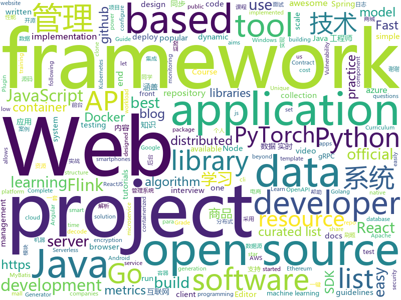

# 2020-09-02
See what the GitHub community is most excited about.

## python
+ [Python](https://github.com/TheAlgorithms/Python)(**311 stars today**): All Algorithms implemented in Python
+ [setuptools](https://github.com/pypa/setuptools)(**5 stars today**): Official project repository for the Setuptools build system
+ [3DDFA_V2](https://github.com/cleardusk/3DDFA_V2)(**157 stars today**): The official PyTorch implementation of Towards Fast, Accurate and Stable 3D Dense Face Alignment, ECCV, 2020
+ [12306](https://github.com/testerSunshine/12306)(**13 stars today**): 12306智能刷票，订票
+ [opacus](https://github.com/pytorch/opacus)(**99 stars today**): Training PyTorch models with differential privacy
+ [present](https://github.com/vinayak-mehta/present)(**629 stars today**): A terminal-based presentation tool with colors and effects.
+ [awesome-machine-learning](https://github.com/josephmisiti/awesome-machine-learning)(**34 stars today**): A curated list of awesome Machine Learning frameworks, libraries and software.
+ [system-design-primer](https://github.com/donnemartin/system-design-primer)(**139 stars today**): Learn how to design large-scale systems. Prep for the system design interview. Includes Anki flashcards.
+ [awesome-python](https://github.com/vinta/awesome-python)(**72 stars today**): A curated list of awesome Python frameworks, libraries, software and resources
+ [serverless-application-model](https://github.com/aws/serverless-application-model)(**4 stars today**): AWS Serverless Application Model (SAM) is an open-source framework for building serverless applications
+ [Userge](https://github.com/UsergeTeam/Userge)(**7 stars today**): Userge, Durable as a Serge
+ [howdy](https://github.com/boltgolt/howdy)(**67 stars today**): 🛡️Windows Hello™ style facial authentication for Linux
+ [ML-From-Scratch](https://github.com/eriklindernoren/ML-From-Scratch)(**46 stars today**): Machine Learning From Scratch. Bare bones NumPy implementations of machine learning models and algorithms with a focus on accessibility. Aims to cover everything from linear regression to deep learning.
+ [Ciphey](https://github.com/Ciphey/Ciphey)(**129 stars today**): Automatically decode encryptions without a key, decode encodings, and crack hashes
+ [allenact](https://github.com/allenai/allenact)(**14 stars today**): An open source framework for research in Embodied-AI from AI2.
+ [autoscraper](https://github.com/alirezamika/autoscraper)(**12 stars today**): A Smart, Fast and Lightweight Automatic Web Scraper for Python
+ [kitsune](https://github.com/evilsocket/kitsune)(**27 stars today**): 🧠🔎🤖Kitsune is an artificial neural network designed to detect and correlate Twitter profiles with similar behaviours.
+ [docker-stacks](https://github.com/jupyter/docker-stacks)(**5 stars today**): Ready-to-run Docker images containing Jupyter applications
+ [IntelOwl](https://github.com/intelowlproject/IntelOwl)(**25 stars today**): Intel Owl: analyze files, domains, IPs in multiple ways from a single API at scale
+ [CppCoreGuidelines](https://github.com/isocpp/CppCoreGuidelines)(**16 stars today**): The C++ Core Guidelines are a set of tried-and-true guidelines, rules, and best practices about coding in C++
+ [youtube-dl-gui](https://github.com/MrS0m30n3/youtube-dl-gui)(**8 stars today**): A cross platform front-end GUI of the popular youtube-dl written in wxPython.
+ [handcalcs](https://github.com/connorferster/handcalcs)(**187 stars today**): Python library for converting Python calculations into rendered latex.
+ [cpython](https://github.com/python/cpython)(**27 stars today**): The Python programming language
+ [cloud-init](https://github.com/canonical/cloud-init)(**5 stars today**): Official upstream for the cloud-init: cloud instance initialization
+ [horovod](https://github.com/horovod/horovod)(**14 stars today**): Distributed training framework for TensorFlow, Keras, PyTorch, and Apache MXNet.

## java
+ [Java-Tutorial](https://github.com/h2pl/Java-Tutorial)(**101 stars today**): 【Java工程师面试复习指南】本仓库涵盖大部分Java程序员所需要掌握的核心知识，整合了互联网上的很多优质Java技术文章，力求打造为最完整最实用的Java开发者学习指南，如果对你有帮助，给个star告诉我吧，谢谢！
+ [toBeTopJavaer](https://github.com/hollischuang/toBeTopJavaer)(**36 stars today**): To Be Top Javaer - Java工程师成神之路
+ [datax-web](https://github.com/WeiYe-Jing/datax-web)(**14 stars today**): DataX集成可视化页面，选择数据源即可一键生成数据同步任务，支持批量创建RDBMS数据同步任务，集成开源调度系统，支持分布式、增量同步数据、实时查看运行日志、监控执行器资源、KILL运行进程、数据源信息加密等。
+ [halo](https://github.com/halo-dev/halo)(**43 stars today**): ✍An excellent open source blog publishing application. | 一个优秀的开源博客发布应用。
+ [InternetArchitect](https://github.com/bjmashibing/InternetArchitect)(**39 stars today**): 年薪百万互联网架构师课程文档及源码(公开部分)
+ [openapi-generator](https://github.com/OpenAPITools/openapi-generator)(**12 stars today**): OpenAPI Generator allows generation of API client libraries (SDK generation), server stubs, documentation and configuration automatically given an OpenAPI Spec (v2, v3)
+ [easy163](https://github.com/ndroi/easy163)(**77 stars today**): 安卓端一键解锁网易云音乐，无须 ROOT
+ [flink-learning](https://github.com/zhisheng17/flink-learning)(**20 stars today**): flink learning blog. http://www.flink-learning.com 含 Flink 入门、概念、原理、实战、性能调优、源码解析等内容。涉及 Flink Connector、Metrics、Library、DataStream API、Table API & SQL 等内容的学习案例，还有 Flink 落地应用的大型项目案例（PVUV、日志存储、百亿数据实时去重、监控告警）分享。欢迎大家支持我的专栏《大数据实时计算引擎 Flink 实战与性能优化》
+ [azure-sdk-for-java](https://github.com/Azure/azure-sdk-for-java)(**4 stars today**): This repository is for active development of the Azure SDK for Java. For consumers of the SDK we recommend visiting our public developer docs at https://docs.microsoft.com/en-us/java/azure/ or our versioned developer docs at https://azure.github.io/azure-sdk-for-java.
+ [OpenBot](https://github.com/intel-isl/OpenBot)(**127 stars today**): OpenBot leverages smartphones as brains for low-cost robots. We have designed a small electric vehicle that costs about $50 and serves as a robot body. Our software stack for Android smartphones supports advanced robotics workloads such as person following and real-time autonomous navigation.
+ [hazelcast](https://github.com/hazelcast/hazelcast)(**2 stars today**): Open Source In-Memory Data Grid
+ [mall](https://github.com/macrozheng/mall)(**52 stars today**): mall项目是一套电商系统，包括前台商城系统及后台管理系统，基于SpringBoot+MyBatis实现，采用Docker容器化部署。 前台商城系统包含首页门户、商品推荐、商品搜索、商品展示、购物车、订单流程、会员中心、客户服务、帮助中心等模块。 后台管理系统包含商品管理、订单管理、会员管理、促销管理、运营管理、内容管理、统计报表、财务管理、权限管理、设置等模块。
+ [elasticsearch](https://github.com/elastic/elasticsearch)(**31 stars today**): Open Source, Distributed, RESTful Search Engine
+ [dubbo-spring-boot-project](https://github.com/apache/dubbo-spring-boot-project)(**3 stars today**): Spring Boot Project for Apache Dubbo
+ [AntennaPod](https://github.com/AntennaPod/AntennaPod)(**3 stars today**): A podcast manager for Android
+ [strimzi-kafka-operator](https://github.com/strimzi/strimzi-kafka-operator)(**4 stars today**): Apache Kafka running on Kubernetes
+ [tutorials](https://github.com/eugenp/tutorials)(**18 stars today**): Just Announced - "Learn Spring Security OAuth":
+ [spring-boot](https://github.com/spring-projects/spring-boot)(**33 stars today**): Spring Boot
+ [FastHub](https://github.com/k0shk0sh/FastHub)(**4 stars today**): FastHub the ultimate GitHub client for Android.
+ [micrometer](https://github.com/micrometer-metrics/micrometer)(**7 stars today**): An application metrics facade for the most popular monitoring tools. Think SLF4J, but for metrics.
+ [CS-Notes](https://github.com/CyC2018/CS-Notes)(**88 stars today**): 📚技术面试必备基础知识、Leetcode、计算机操作系统、计算机网络、系统设计、Java、Python、C++
+ [HikariCP](https://github.com/brettwooldridge/HikariCP)(**12 stars today**): 光 HikariCP・A solid, high-performance, JDBC connection pool at last.
+ [mall-learning](https://github.com/macrozheng/mall-learning)(**15 stars today**): mall学习教程，架构、业务、技术要点全方位解析。mall项目（39k+star）是一套电商系统，使用现阶段主流技术实现。涵盖了SpringBoot 2.3.0、MyBatis 3.4.6、Elasticsearch 7.6.2、RabbitMQ 3.7.15、Redis 5.0、MongoDB 4.2.5、Mysql5.7等技术，采用Docker容器化部署。
+ [advanced-java](https://github.com/doocs/advanced-java)(**37 stars today**): 😮互联网 Java 工程师进阶知识完全扫盲：涵盖高并发、分布式、高可用、微服务、海量数据处理等领域知识，后端同学必看，前端同学也可学习
+ [spring-framework](https://github.com/spring-projects/spring-framework)(**22 stars today**): Spring Framework

## unknown
+ [the-incredible-pytorch](https://github.com/ritchieng/the-incredible-pytorch)(**199 stars today**): The Incredible PyTorch: a curated list of tutorials, papers, projects, communities and more relating to PyTorch.
+ [companies-sponsoring-visas](https://github.com/shubheksha/companies-sponsoring-visas)(**85 stars today**): A list of companies that sponsor employees from other countries.
+ [developer-roadmap](https://github.com/kamranahmedse/developer-roadmap)(**536 stars today**): Roadmap to becoming a web developer in 2020
+ [build-your-own-x](https://github.com/danistefanovic/build-your-own-x)(**97 stars today**): 🤓Build your own (insert technology here)
+ [awesome](https://github.com/sindresorhus/awesome)(**156 stars today**): 😎Awesome lists about all kinds of interesting topics
+ [KingOfBugBountyTips](https://github.com/OfJAAH/KingOfBugBountyTips)(**96 stars today**): 
+ [the-book-of-secret-knowledge](https://github.com/trimstray/the-book-of-secret-knowledge)(**21 stars today**): A collection of inspiring lists, manuals, cheatsheets, blogs, hacks, one-liners, cli/web tools and more.
+ [curriculum](https://github.com/cncf/curriculum)(**10 stars today**): 📚Open Source Curriculum for CNCF Certification Courses
+ [awesome-cpp-cn](https://github.com/jobbole/awesome-cpp-cn)(**51 stars today**): C++ 资源大全中文版，标准库、Web应用框架、人工智能、数据库、图片处理、机器学习、日志、代码分析等
+ [WindowsExploitationResources](https://github.com/FULLSHADE/WindowsExploitationResources)(**26 stars today**): Resources for Windows exploit development
+ [webrtc-for-the-curious](https://github.com/webrtc-for-the-curious/webrtc-for-the-curious)(**255 stars today**): WebRTC for the Curious: Go beyond the APIs
+ [bitcoin](https://github.com/100trillionUSD/bitcoin)(**7 stars today**): 
+ [Flutter-Course-Resources](https://github.com/londonappbrewery/Flutter-Course-Resources)(**150 stars today**): Learn to Code While Building Apps - The Complete Flutter Development Bootcamp
+ [IntelliJ-IDEA-2020.2.1-solve](https://github.com/shipofsea/IntelliJ-IDEA-2020.2.1-solve)(**7 stars today**): 
+ [EmotionLib](https://github.com/EmotionEngineer/EmotionLib)(**28 stars today**): Simple dynamic library for video sentiment recognition
+ [HowToHunt](https://github.com/KathanP19/HowToHunt)(**60 stars today**): Some Tutorials and Things to Do while Hunting That Vulnerability.
+ [kubernetes-certified-administrator-prep-guide](https://github.com/leandrocostam/kubernetes-certified-administrator-prep-guide)(**18 stars today**): Certified Kubernetes Administrator (CKA) Preparation Guide - Curriculum V1.19
+ [unmaintainable-code](https://github.com/Droogans/unmaintainable-code)(**77 stars today**): A more maintainable, easier to share version of the infamous http://mindprod.com/jgloss/unmain.html
+ [SuperPower](https://github.com/SensorsIot/SuperPower)(**31 stars today**): Here you should find the best power supplies for your low-power projects
+ [DAFTAR-API-LOKAL-INDONESIA](https://github.com/farizdotid/DAFTAR-API-LOKAL-INDONESIA)(**16 stars today**): Berisi API tentang Data Indonesia
+ [project-based-learning](https://github.com/tuvtran/project-based-learning)(**188 stars today**): Curated list of project-based tutorials
+ [Interview_Question_for_Beginner](https://github.com/JaeYeopHan/Interview_Question_for_Beginner)(**10 stars today**): 👦👧Technical-Interview guidelines written for those who started studying programming. I wish you all the best.👾
+ [vagas](https://github.com/frontendbr/vagas)(**13 stars today**): 🔬Espaço para divulgação de vagas para front-enders.
+ [eng-practices](https://github.com/google/eng-practices)(**16 stars today**): Google's Engineering Practices documentation
+ [Resources-for-Beginner-Bug-Bounty-Hunters](https://github.com/nahamsec/Resources-for-Beginner-Bug-Bounty-Hunters)(**24 stars today**): A list of resources for those interested in getting started in bug bounties

## javascript
+ [portainer](https://github.com/portainer/portainer)(**51 stars today**): Making Docker management easy.
+ [30-seconds-of-code](https://github.com/30-seconds/30-seconds-of-code)(**55 stars today**): Short JavaScript code snippets for all your development needs
+ [pdf.js](https://github.com/mozilla/pdf.js)(**16 stars today**): PDF Reader in JavaScript
+ [openzeppelin-contracts](https://github.com/OpenZeppelin/openzeppelin-contracts)(**5 stars today**): OpenZeppelin Contracts is a library for secure smart contract development.
+ [javascript-algorithms](https://github.com/trekhleb/javascript-algorithms)(**82 stars today**): 📝Algorithms and data structures implemented in JavaScript with explanations and links to further readings
+ [project-guidelines](https://github.com/elsewhencode/project-guidelines)(**219 stars today**): A set of best practices for JavaScript projects
+ [strapi](https://github.com/strapi/strapi)(**41 stars today**): 🚀Open source Node.js Headless CMS to easily build customisable APIs
+ [plugins](https://github.com/rollup/plugins)(**3 stars today**): 🍣The one-stop shop for official Rollup plugins
+ [Hack-Tools](https://github.com/LasCC/Hack-Tools)(**138 stars today**): The all-in-one Red Team extension for Web Pentester🛠
+ [spotify-clone-client](https://github.com/JL978/spotify-clone-client)(**36 stars today**): A ReactJS clone application of the popular Spotify music streaming service.
+ [cypress](https://github.com/cypress-io/cypress)(**27 stars today**): Fast, easy and reliable testing for anything that runs in a browser.
+ [generator-jhipster](https://github.com/jhipster/generator-jhipster)(**10 stars today**): JHipster is a development platform to quickly generate, develop, & deploy modern web applications & microservice architectures.
+ [axios](https://github.com/axios/axios)(**38 stars today**): Promise based HTTP client for the browser and node.js
+ [Javascript-Essentials](https://github.com/LetsUpgrade/Javascript-Essentials)(**61 stars today**): 
+ [gutenberg](https://github.com/WordPress/gutenberg)(**5 stars today**): The Block Editor project for WordPress and beyond. Plugin is available from the official repository.
+ [handsontable](https://github.com/handsontable/handsontable)(**9 stars today**): Handsontable is a JavaScript/HTML5 data grid with spreadsheet look & feel. Available for React, Vue and Angular.
+ [react-select](https://github.com/JedWatson/react-select)(**16 stars today**): The Select Component for React.js
+ [react-leaflet](https://github.com/PaulLeCam/react-leaflet)(**17 stars today**): ⚛️React components for🍃Leaflet maps
+ [vault](https://github.com/yfii/vault)(**11 stars today**): 
+ [realworld](https://github.com/gothinkster/realworld)(**42 stars today**): "The mother of all demo apps" — Exemplary fullstack Medium.com clone powered by React, Angular, Node, Django, and many more🏅
+ [iearn-finance](https://github.com/iearn-finance/iearn-finance)(**4 stars today**): Web repository
+ [masterPortfolio](https://github.com/ashutosh1919/masterPortfolio)(**4 stars today**): 🔥The Complete Customizable Software Developer Portfolio Template which lets you showcase your work and provides each and every detail about you as Software Developer.
+ [monaco-editor](https://github.com/microsoft/monaco-editor)(**26 stars today**): A browser based code editor
+ [junior-recruit-scheduler](https://github.com/jojoldu/junior-recruit-scheduler)(**11 stars today**): 주니어 개발자 채용 정보
+ [Detox](https://github.com/wix/Detox)(**7 stars today**): Gray box end-to-end testing and automation framework for mobile apps

## html
+ [howtheytest](https://github.com/abhivaikar/howtheytest)(**30 stars today**): A collection of public resources about how software companies test their software
+ [responsive-html-email-template](https://github.com/leemunroe/responsive-html-email-template)(**6 stars today**): A free simple responsive HTML email template
+ [us-potus-model](https://github.com/TheEconomist/us-potus-model)(**9 stars today**): Code for a dynamic multilevel Bayesian model to predict US presidential elections. Written in R and Stan.
+ [tiktok-downloader-and-rehoster](https://github.com/antiops/tiktok-downloader-and-rehoster)(**33 stars today**): A simple webapp that allows users to easily download TikTok videos and share them as all videos are rehosted on our servers.
+ [Server](https://github.com/PanDownloadServer/Server)(**29 stars today**): PanDownload的个人维护版本
+ [excalibur](https://github.com/camelot-dev/excalibur)(**3 stars today**): A web interface to extract tabular data from PDFs
+ [tidytuesday](https://github.com/rfordatascience/tidytuesday)(**14 stars today**): Official repo for the #tidytuesday project
+ [beautiful-jekyll](https://github.com/daattali/beautiful-jekyll)(**5 stars today**): ✨Build a beautiful and simple website in literally minutes. Demo at https://beautifuljekyll.com
+ [beginners-guide-to-react](https://github.com/kentcdodds/beginners-guide-to-react)(**3 stars today**): The Beginner's Guide To ReactJS
+ [Coursera-ML-AndrewNg-Notes](https://github.com/fengdu78/Coursera-ML-AndrewNg-Notes)(**15 stars today**): 吴恩达老师的机器学习课程个人笔记
+ [Front-end-Developer-Interview-Questions](https://github.com/h5bp/Front-end-Developer-Interview-Questions)(**21 stars today**): A list of helpful front-end related questions you can use to interview potential candidates, test yourself or completely ignore.
+ [18S191](https://github.com/mitmath/18S191)(**146 stars today**): Course 18.S191 at MIT, fall 2020 - Introduction to computational thinking with Julia
+ [ru.javascript.info](https://github.com/javascript-tutorial/ru.javascript.info)(**2 stars today**): Современный учебник JavaScript
+ [devdocs](https://github.com/magento/devdocs)(**0 stars today**): Magento Developer Documentation
+ [www-project-top-ten](https://github.com/OWASP/www-project-top-ten)(**3 stars today**): OWASP Foundation Web Respository
+ [django-DefectDojo](https://github.com/DefectDojo/django-DefectDojo)(**2 stars today**): DefectDojo is an open-source application vulnerability correlation and security orchestration tool.
+ [datasciencecoursera](https://github.com/mGalarnyk/datasciencecoursera)(**3 stars today**): Data Science Repo and blog for John Hopkins Coursera Courses. Please let me know if you have any questions.
+ [EIPs](https://github.com/ethereum/EIPs)(**10 stars today**): The Ethereum Improvement Proposal repository
+ [BigBookofR](https://github.com/oscarbaruffa/BigBookofR)(**17 stars today**): The biggest collection of R books (and maybe later some other resources too)
+ [tiny-slider](https://github.com/ganlanyuan/tiny-slider)(**7 stars today**): Vanilla javascript slider for all purposes.
+ [training-kit](https://github.com/github/training-kit)(**3 stars today**): Open source cheat sheets for Git and GitHub
+ [seldon-core](https://github.com/SeldonIO/seldon-core)(**4 stars today**): An MLOps framework to package, deploy, monitor and manage thousands of production machine learning models
+ [csswg-drafts](https://github.com/w3c/csswg-drafts)(**3 stars today**): CSS Working Group Editor Drafts
+ [Web-Development](https://github.com/Internshala-Online-Trainings/Web-Development)(**0 stars today**): 
+ [computer-science-flash-cards](https://github.com/jwasham/computer-science-flash-cards)(**8 stars today**): Mini website for testing both general CS knowledge and enforce coding practice and common algorithm/data structure memorization.

## go
+ [gorm](https://github.com/go-gorm/gorm)(**99 stars today**): The fantastic ORM library for Golang, aims to be developer friendly
+ [go-ethereum](https://github.com/ethereum/go-ethereum)(**16 stars today**): Official Go implementation of the Ethereum protocol
+ [nuclei](https://github.com/projectdiscovery/nuclei)(**20 stars today**): Nuclei is a fast tool for configurable targeted scanning based on templates offering massive extensibility and ease of use.
+ [telegraf](https://github.com/influxdata/telegraf)(**7 stars today**): The plugin-driven server agent for collecting & reporting metrics.
+ [prometheus](https://github.com/prometheus/prometheus)(**24 stars today**): The Prometheus monitoring system and time series database.
+ [mongo-go-driver](https://github.com/mongodb/mongo-go-driver)(**8 stars today**): The Go driver for MongoDB
+ [consul](https://github.com/hashicorp/consul)(**9 stars today**): Consul is a distributed, highly available, and data center aware solution to connect and configure applications across dynamic, distributed infrastructure.
+ [migrate](https://github.com/golang-migrate/migrate)(**6 stars today**): Database migrations. CLI and Golang library.
+ [external-dns](https://github.com/kubernetes-sigs/external-dns)(**4 stars today**): Configure external DNS servers (AWS Route53, Google CloudDNS and others) for Kubernetes Ingresses and Services
+ [alertmanager](https://github.com/prometheus/alertmanager)(**5 stars today**): Prometheus Alertmanager
+ [podman](https://github.com/containers/podman)(**10 stars today**): Podman: A tool for managing OCI containers and pods
+ [cli](https://github.com/cli/cli)(**30 stars today**): GitHub’s official command line tool
+ [kubernetes](https://github.com/kubernetes/kubernetes)(**50 stars today**): Production-Grade Container Scheduling and Management
+ [algorithm-pattern](https://github.com/greyireland/algorithm-pattern)(**180 stars today**): 算法模板，最科学的刷题方式，最快速的刷题路径，你值得拥有~
+ [moby](https://github.com/moby/moby)(**15 stars today**): Moby Project - a collaborative project for the container ecosystem to assemble container-based systems
+ [grpc-go](https://github.com/grpc/grpc-go)(**8 stars today**): The Go language implementation of gRPC. HTTP/2 based RPC
+ [grpc-gateway](https://github.com/grpc-ecosystem/grpc-gateway)(**8 stars today**): gRPC to JSON proxy generator following the gRPC HTTP spec
+ [vault](https://github.com/hashicorp/vault)(**10 stars today**): A tool for secrets management, encryption as a service, and privileged access management
+ [iris](https://github.com/kataras/iris)(**20 stars today**): The fastest HTTP/2 Go Web Framework. AWS Lambda, gRPC, MVC, Unique Router, Websockets, Sessions, Test suite, Dependency Injection and more. A true successor of expressjs and laravel | 谢谢 https://github.com/kataras/iris/issues/1329 |
+ [act](https://github.com/nektos/act)(**29 stars today**): Run your GitHub Actions locally🚀
+ [pipeline](https://github.com/tektoncd/pipeline)(**10 stars today**): A K8s-native Pipeline resource.
+ [lumberjack](https://github.com/natefinch/lumberjack)(**6 stars today**): lumberjack is a log rolling package for Go
+ [awesome-go](https://github.com/avelino/awesome-go)(**39 stars today**): A curated list of awesome Go frameworks, libraries and software
+ [nomad](https://github.com/hashicorp/nomad)(**6 stars today**): Nomad is an easy-to-use, flexible, and performant workload orchestrator that can deploy a mix of microservice, batch, containerized, and non-containerized applications. Nomad is easy to operate and scale and has native Consul and Vault integrations.
+ [fabric](https://github.com/hyperledger/fabric)(**8 stars today**): Hyperledger Fabric is an enterprise-grade permissioned distributed ledger framework for developing solutions and applications. Its modular and versatile design satisfies a broad range of industry use cases. It offers a unique approach to consensus that enables performance at scale while preserving privacy.

## WordCloud

