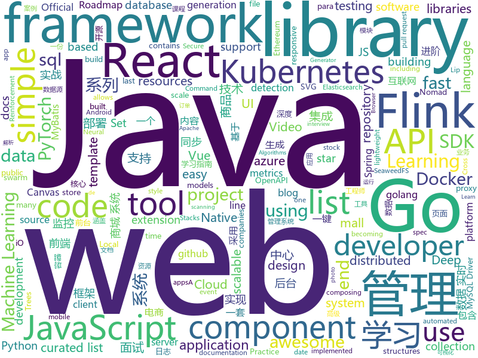

# 2020-09-03
See what the GitHub community is most excited about.

## python
+ [12306](https://github.com/testerSunshine/12306)(**36 stars today**): 12306智能刷票，订票
+ [surpriver](https://github.com/tradytics/surpriver)(**64 stars today**): Find big moving stocks before they move using machine learning and anomaly detection
+ [handcalcs](https://github.com/connorferster/handcalcs)(**579 stars today**): Python library for converting Python calculations into rendered latex.
+ [setuptools](https://github.com/pypa/setuptools)(**24 stars today**): Official project repository for the Setuptools build system
+ [horovod](https://github.com/horovod/horovod)(**10 stars today**): Distributed training framework for TensorFlow, Keras, PyTorch, and Apache MXNet.
+ [quark-engine](https://github.com/quark-engine/quark-engine)(**13 stars today**): Malware (Analysis | Scoring System)
+ [Python](https://github.com/TheAlgorithms/Python)(**300 stars today**): All Algorithms implemented in Python
+ [aws-cli](https://github.com/aws/aws-cli)(**7 stars today**): Universal Command Line Interface for Amazon Web Services
+ [awesome-machine-learning](https://github.com/josephmisiti/awesome-machine-learning)(**40 stars today**): A curated list of awesome Machine Learning frameworks, libraries and software.
+ [transformers](https://github.com/huggingface/transformers)(**46 stars today**): 🤗Transformers: State-of-the-art Natural Language Processing for Pytorch and TensorFlow 2.0.
+ [opacus](https://github.com/pytorch/opacus)(**72 stars today**): Training PyTorch models with differential privacy
+ [Wav2Lip](https://github.com/Rudrabha/Wav2Lip)(**39 stars today**): This repository contains the codes of "A Lip Sync Expert Is All You Need for Speech to Lip Generation In the Wild", published at ACM Multimedia 2020.
+ [system-design-primer](https://github.com/donnemartin/system-design-primer)(**154 stars today**): Learn how to design large-scale systems. Prep for the system design interview. Includes Anki flashcards.
+ [DeepCreamPy](https://github.com/deeppomf/DeepCreamPy)(**26 stars today**): Decensoring Hentai with Deep Neural Networks
+ [bert](https://github.com/google-research/bert)(**16 stars today**): TensorFlow code and pre-trained models for BERT
+ [Summer2021-Internships](https://github.com/Pitt-CSC/Summer2021-Internships)(**42 stars today**): Collection of Summer 2021 tech internships!
+ [ray](https://github.com/ray-project/ray)(**20 stars today**): A fast and simple framework for building and running distributed applications. Ray is packaged with RLlib, a scalable reinforcement learning library, and Tune, a scalable hyperparameter tuning library.
+ [oneliners](https://github.com/tjf801/oneliners)(**9 stars today**): one line of python code to impliment algorithms
+ [awesome-python](https://github.com/vinta/awesome-python)(**65 stars today**): A curated list of awesome Python frameworks, libraries, software and resources
+ [insightface](https://github.com/deepinsight/insightface)(**13 stars today**): Face Analysis Project on MXNet
+ [CenterNet](https://github.com/xingyizhou/CenterNet)(**11 stars today**): Object detection, 3D detection, and pose estimation using center point detection:
+ [autoscraper](https://github.com/alirezamika/autoscraper)(**27 stars today**): A Smart, Automatic, Fast and Lightweight Web Scraper for Python
+ [Paddle](https://github.com/PaddlePaddle/Paddle)(**12 stars today**): PArallel Distributed Deep LEarning: Machine Learning Framework from Industrial Practice （『飞桨』核心框架，深度学习&机器学习高性能单机、分布式训练和跨平台部署）
+ [InstaPy](https://github.com/timgrossmann/InstaPy)(**10 stars today**): 📷Instagram Bot - Tool for automated Instagram interactions
+ [howdy](https://github.com/boltgolt/howdy)(**33 stars today**): 🛡️Windows Hello™ style facial authentication for Linux

## java
+ [Java-Tutorial](https://github.com/h2pl/Java-Tutorial)(**169 stars today**): 【Java工程师面试复习指南】本仓库涵盖大部分Java程序员所需要掌握的核心知识，整合了互联网上的很多优质Java技术文章，力求打造为最完整最实用的Java开发者学习指南，如果对你有帮助，给个star告诉我吧，谢谢！
+ [flink-learning](https://github.com/zhisheng17/flink-learning)(**28 stars today**): flink learning blog. http://www.flink-learning.com 含 Flink 入门、概念、原理、实战、性能调优、源码解析等内容。涉及 Flink Connector、Metrics、Library、DataStream API、Table API & SQL 等内容的学习案例，还有 Flink 落地应用的大型项目案例（PVUV、日志存储、百亿数据实时去重、监控告警）分享。欢迎大家支持我的专栏《大数据实时计算引擎 Flink 实战与性能优化》
+ [mall](https://github.com/macrozheng/mall)(**63 stars today**): mall项目是一套电商系统，包括前台商城系统及后台管理系统，基于SpringBoot+MyBatis实现，采用Docker容器化部署。 前台商城系统包含首页门户、商品推荐、商品搜索、商品展示、购物车、订单流程、会员中心、客户服务、帮助中心等模块。 后台管理系统包含商品管理、订单管理、会员管理、促销管理、运营管理、内容管理、统计报表、财务管理、权限管理、设置等模块。
+ [mall-learning](https://github.com/macrozheng/mall-learning)(**16 stars today**): mall学习教程，架构、业务、技术要点全方位解析。mall项目（39k+star）是一套电商系统，使用现阶段主流技术实现。涵盖了SpringBoot 2.3.0、MyBatis 3.4.6、Elasticsearch 7.6.2、RabbitMQ 3.7.15、Redis 5.0、MongoDB 4.2.5、Mysql5.7等技术，采用Docker容器化部署。
+ [toBeTopJavaer](https://github.com/hollischuang/toBeTopJavaer)(**51 stars today**): To Be Top Javaer - Java工程师成神之路
+ [datax-web](https://github.com/WeiYe-Jing/datax-web)(**29 stars today**): DataX集成可视化页面，选择数据源即可一键生成数据同步任务，支持批量创建RDBMS数据同步任务，集成开源调度系统，支持分布式、增量同步数据、实时查看运行日志、监控执行器资源、KILL运行进程、数据源信息加密等。
+ [InternetArchitect](https://github.com/bjmashibing/InternetArchitect)(**38 stars today**): 年薪百万互联网架构师课程文档及源码(公开部分)
+ [aws-sdk-java](https://github.com/aws/aws-sdk-java)(**4 stars today**): The official AWS SDK for Java.
+ [sqli](https://github.com/x-ream/sqli)(**76 stars today**): Simple sql interface, Criteria, CriteriaBuilder
+ [mall-swarm](https://github.com/macrozheng/mall-swarm)(**49 stars today**): mall-swarm是一套微服务商城系统，采用了 Spring Cloud Hoxton & Alibaba、Spring Boot 2.3、Oauth2、MyBatis、Docker、Elasticsearch等核心技术，同时提供了基于Vue的管理后台方便快速搭建系统。mall-swarm在电商业务的基础集成了注册中心、配置中心、监控中心、网关等系统功能。文档齐全，附带全套Spring Cloud教程。
+ [micrometer](https://github.com/micrometer-metrics/micrometer)(**5 stars today**): An application metrics facade for the most popular monitoring tools. Think SLF4J, but for metrics.
+ [koronavilkku-backend](https://github.com/THLfi/koronavilkku-backend)(**9 stars today**): 
+ [Leetcode](https://github.com/fishercoder1534/Leetcode)(**8 stars today**): Solutions to LeetCode problems; updated daily. Subscribe to my YouTube channel for more.
+ [druid](https://github.com/apache/druid)(**6 stars today**): Apache Druid: a high performance real-time analytics database.
+ [flinkStreamSQL](https://github.com/DTStack/flinkStreamSQL)(**4 stars today**): 基于开源的flink，对其实时sql进行扩展；主要实现了流与维表的join，支持原生flink SQL所有的语法
+ [easy163](https://github.com/ndroi/easy163)(**40 stars today**): 安卓端一键解锁网易云音乐，无须 ROOT
+ [openapi-generator](https://github.com/OpenAPITools/openapi-generator)(**13 stars today**): OpenAPI Generator allows generation of API client libraries (SDK generation), server stubs, documentation and configuration automatically given an OpenAPI Spec (v2, v3)
+ [react-native-video](https://github.com/react-native-community/react-native-video)(**4 stars today**): A <Video /> component for react-native
+ [azure-sdk-for-java](https://github.com/Azure/azure-sdk-for-java)(**2 stars today**): This repository is for active development of the Azure SDK for Java. For consumers of the SDK we recommend visiting our public developer docs at https://docs.microsoft.com/en-us/java/azure/ or our versioned developer docs at https://azure.github.io/azure-sdk-for-java.
+ [react-native-push-notification](https://github.com/zo0r/react-native-push-notification)(**6 stars today**): React Native Local and Remote Notifications
+ [RxJava](https://github.com/ReactiveX/RxJava)(**8 stars today**): RxJava – Reactive Extensions for the JVM – a library for composing asynchronous and event-based programs using observable sequences for the Java VM.
+ [hutool](https://github.com/looly/hutool)(**57 stars today**): A set of tools that keep Java sweet.
+ [tink](https://github.com/google/tink)(**11 stars today**): Tink is a multi-language, cross-platform, open source library that provides cryptographic APIs that are secure, easy to use correctly, and hard(er) to misuse.
+ [zxing](https://github.com/zxing/zxing)(**13 stars today**): ZXing ("Zebra Crossing") barcode scanning library for Java, Android
+ [pulsar](https://github.com/apache/pulsar)(**5 stars today**): Apache Pulsar - distributed pub-sub messaging system

## unknown
+ [the-incredible-pytorch](https://github.com/ritchieng/the-incredible-pytorch)(**290 stars today**): The Incredible PyTorch: a curated list of tutorials, papers, projects, communities and more relating to PyTorch.
+ [build-your-own-x](https://github.com/danistefanovic/build-your-own-x)(**130 stars today**): 🤓Build your own (insert technology here)
+ [developer-roadmap](https://github.com/kamranahmedse/developer-roadmap)(**592 stars today**): Roadmap to becoming a web developer in 2020
+ [awesome](https://github.com/sindresorhus/awesome)(**184 stars today**): 😎Awesome lists about all kinds of interesting topics
+ [KingOfBugBountyTips](https://github.com/OfJAAH/KingOfBugBountyTips)(**108 stars today**): 
+ [IntelliJ-IDEA-2020.2.1-solve](https://github.com/shipofsea/IntelliJ-IDEA-2020.2.1-solve)(**6 stars today**): 
+ [awesome-cpp-cn](https://github.com/jobbole/awesome-cpp-cn)(**51 stars today**): C++ 资源大全中文版，标准库、Web应用框架、人工智能、数据库、图片处理、机器学习、日志、代码分析等
+ [you-dont-know-js-ru](https://github.com/azat-io/you-dont-know-js-ru)(**7 stars today**): 📚Russian translation of "You Don't Know JS" book series
+ [Resources-for-Beginner-Bug-Bounty-Hunters](https://github.com/nahamsec/Resources-for-Beginner-Bug-Bounty-Hunters)(**20 stars today**): A list of resources for those interested in getting started in bug bounties
+ [book](https://github.com/qyuhen/book)(**6 stars today**): 学习笔记
+ [download](https://github.com/getlantern/download)(**8 stars today**): Lantern官方版本下载 蓝灯 翻墙 代理 科学上网 外网 加速器 梯子 路由 proxy vpn circumvention gfw
+ [fe-news](https://github.com/naver/fe-news)(**21 stars today**): FE 기술 소식 큐레이션 뉴스레터
+ [design-resources-for-developers](https://github.com/bradtraversy/design-resources-for-developers)(**57 stars today**): Curated list of design and UI resources from stock photos, web templates, CSS frameworks, UI libraries, tools and much more
+ [the-art-of-command-line](https://github.com/jlevy/the-art-of-command-line)(**32 stars today**): Master the command line, in one page
+ [Blog](https://github.com/mqyqingfeng/Blog)(**14 stars today**): 冴羽写博客的地方，预计写四个系列：JavaScript深入系列、JavaScript专题系列、ES6系列、React系列。
+ [golang-developer-roadmap](https://github.com/Alikhll/golang-developer-roadmap)(**22 stars today**): Roadmap to becoming a Go developer in 2020
+ [Kubernetes-Certified-Administrator](https://github.com/walidshaari/Kubernetes-Certified-Administrator)(**7 stars today**): Online resources that will help you prepare for taking the CNCF CKA "Kubernetes Certified Administrator" Certification exam. with time, This is not likely the comprehensive up to date list - please make a pull request if there something that should be added here.
+ [companies-sponsoring-visas](https://github.com/shubheksha/companies-sponsoring-visas)(**75 stars today**): A list of companies that sponsor employees from other countries.
+ [blog](https://github.com/yygmind/blog)(**7 stars today**): 我是木易杨，公众号「高级前端进阶」作者，跟着我每周重点攻克一个前端面试重难点。接下来让我带你走进高级前端的世界，在进阶的路上，共勉！
+ [machine-learning-roadmap](https://github.com/mrdbourke/machine-learning-roadmap)(**20 stars today**): A roadmap connecting many of the most important concepts in machine learning, how to learn them and what tools to use to perform them.
+ [vagas-junior-estagio](https://github.com/alinebastos/vagas-junior-estagio)(**21 stars today**): Empresas que constantemente oferecem vagas para junior e estagiários
+ [awesome-semantic-segmentation](https://github.com/mrgloom/awesome-semantic-segmentation)(**14 stars today**): 🤘awesome-semantic-segmentation
+ [landscape](https://github.com/cncf/landscape)(**3 stars today**): 🌄The Cloud Native Interactive Landscape filters and sorts hundreds of projects and products, and shows details including GitHub stars, funding or market cap, first and last commits, contributor counts, headquarters location, and recent tweets.
+ [src](https://github.com/kiwibrowser/src)(**6 stars today**): Source-code used in Kiwi Browser for Android (up to date)
+ [JavaHome](https://github.com/whx123/JavaHome)(**4 stars today**): 一份超级详细的Java面试题【大厂面试真题+Java学习指南+工作总结】

## javascript
+ [30-seconds-of-code](https://github.com/30-seconds/30-seconds-of-code)(**121 stars today**): Short JavaScript code snippets for all your development needs
+ [portainer](https://github.com/portainer/portainer)(**141 stars today**): Making Docker management easy.
+ [Awesome-Profile-README-templates](https://github.com/kautukkundan/Awesome-Profile-README-templates)(**143 stars today**): A collection of awesome readme templates to display on your profile
+ [csgo_bugs](https://github.com/kkthxbye-code/csgo_bugs)(**6 stars today**): Random CSGO stuff
+ [fabric.js](https://github.com/fabricjs/fabric.js)(**12 stars today**): Javascript Canvas Library, SVG-to-Canvas (& canvas-to-SVG) Parser
+ [realworld](https://github.com/gothinkster/realworld)(**55 stars today**): "The mother of all demo apps" — Exemplary fullstack Medium.com clone powered by React, Angular, Node, Django, and many more🏅
+ [stayaway-app](https://github.com/stayawayinesctec/stayaway-app)(**9 stars today**): Official repository for the STAYAWAY COVID mobile application
+ [10-projects-10-hours](https://github.com/florinpop17/10-projects-10-hours)(**28 stars today**): 
+ [Detox](https://github.com/wix/Detox)(**11 stars today**): Gray box end-to-end testing and automation framework for mobile apps
+ [responsively-app](https://github.com/responsively-org/responsively-app)(**96 stars today**): A modified web browser that helps in responsive web development. A web developer's must have dev-tool.
+ [form-create](https://github.com/xaboy/form-create)(**15 stars today**): 🔥🔥🔥强大的表单生成器|Form builder with dynamic rendering, data collection, validation and submission capabilities, built-in 17 common form components, support for two-way data binding, event extension, and support for building built-in components and any vue components using json.
+ [jitsi-meet](https://github.com/jitsi/jitsi-meet)(**19 stars today**): Jitsi Meet - Secure, Simple and Scalable Video Conferences that you use as a standalone app or embed in your web application.
+ [pdf.js](https://github.com/mozilla/pdf.js)(**17 stars today**): PDF Reader in JavaScript
+ [vue](https://github.com/vuejs/vue)(**94 stars today**): 🖖Vue.js is a progressive, incrementally-adoptable JavaScript framework for building UI on the web.
+ [react-native-elements](https://github.com/react-native-elements/react-native-elements)(**9 stars today**): Cross Platform React Native UI Toolkit
+ [javascript-algorithms](https://github.com/trekhleb/javascript-algorithms)(**99 stars today**): 📝Algorithms and data structures implemented in JavaScript with explanations and links to further readings
+ [yapi](https://github.com/YMFE/yapi)(**51 stars today**): YApi 是一个可本地部署的、打通前后端及QA的、可视化的接口管理平台
+ [next.js](https://github.com/vercel/next.js)(**54 stars today**): The React Framework
+ [google-meet-grid-view](https://github.com/Fugiman/google-meet-grid-view)(**0 stars today**): Userscript to offer a grid-view layout in Google Meets
+ [alpine](https://github.com/alpinejs/alpine)(**32 stars today**): A rugged, minimal framework for composing JavaScript behavior in your markup.
+ [slick](https://github.com/kenwheeler/slick)(**3 stars today**): the last carousel you'll ever need
+ [harvest](https://github.com/harvest-finance/harvest)(**3 stars today**): Bread for the people!
+ [pwnagotchi](https://github.com/evilsocket/pwnagotchi)(**17 stars today**): (⌐■_■) - Deep Reinforcement Learning instrumenting bettercap for WiFi pwning.
+ [react-testing-library](https://github.com/testing-library/react-testing-library)(**11 stars today**): 🐐Simple and complete React DOM testing utilities that encourage good testing practices.
+ [svelte](https://github.com/sveltejs/svelte)(**30 stars today**): Cybernetically enhanced web apps

## html
+ [howtheytest](https://github.com/abhivaikar/howtheytest)(**103 stars today**): A collection of public resources about how software companies test their software
+ [18S191](https://github.com/mitmath/18S191)(**148 stars today**): Course 18.S191 at MIT, fall 2020 - Introduction to computational thinking with Julia
+ [nndl.github.io](https://github.com/nndl/nndl.github.io)(**16 stars today**): 《神经网络与深度学习》 邱锡鹏著 Neural Network and Deep Learning
+ [3d-force-graph](https://github.com/vasturiano/3d-force-graph)(**6 stars today**): 3D force-directed graph component using ThreeJS/WebGL
+ [hyperblog](https://github.com/freddier/hyperblog)(**14 stars today**): Un blog increíble para el curso de Git y Github de Platzi
+ [electron-api-demos](https://github.com/electron/electron-api-demos)(**8 stars today**): Explore the Electron APIs
+ [wpt](https://github.com/web-platform-tests/wpt)(**2 stars today**): Test suites for Web platform specs — including WHATWG, W3C, and others
+ [Front-end-Developer-Interview-Questions](https://github.com/h5bp/Front-end-Developer-Interview-Questions)(**20 stars today**): A list of helpful front-end related questions you can use to interview potential candidates, test yourself or completely ignore.
+ [tiktok-downloader-and-rehoster](https://github.com/antiops/tiktok-downloader-and-rehoster)(**21 stars today**): A simple webapp that allows users to easily download TikTok videos and share them as all videos are rehosted on our servers.
+ [dataviz](https://github.com/clauswilke/dataviz)(**3 stars today**): A book covering the fundamentals of data visualization
+ [webdevbootcamp](https://github.com/nax3t/webdevbootcamp)(**6 stars today**): All source code for back-end projects from the Web Developer Bootcamp
+ [learning-area](https://github.com/mdn/learning-area)(**3 stars today**): Github repo for the MDN Learning Area.
+ [EIPs](https://github.com/ethereum/EIPs)(**7 stars today**): The Ethereum Improvement Proposal repository
+ [swagger-codegen](https://github.com/swagger-api/swagger-codegen)(**8 stars today**): swagger-codegen contains a template-driven engine to generate documentation, API clients and server stubs in different languages by parsing your OpenAPI / Swagger definition.
+ [foundation-sites](https://github.com/foundation/foundation-sites)(**6 stars today**): The most advanced responsive front-end framework in the world. Quickly create prototypes and production code for sites that work on any kind of device.
+ [18337](https://github.com/mitmath/18337)(**6 stars today**): 18.337 - Parallel Computing and Scientific Machine Learning
+ [zju-icicles](https://github.com/QSCTech/zju-icicles)(**17 stars today**): 浙江大学课程攻略共享计划
+ [fastText](https://github.com/facebookresearch/fastText)(**12 stars today**): Library for fast text representation and classification.
+ [pandownload.com_Pages_Backup](https://github.com/Womsxd/pandownload.com_Pages_Backup)(**3 stars today**): pandownload页面的备份，应该是比较完全的一份
+ [swppfall2020](https://github.com/swsnu/swppfall2020)(**7 stars today**): 
+ [photo-stream](https://github.com/maxvoltar/photo-stream)(**2 stars today**): Self-hosted, super simple photo stream
+ [MatBlazor](https://github.com/SamProf/MatBlazor)(**5 stars today**): Material Design components for Blazor and Razor Components
+ [hugo-coder](https://github.com/luizdepra/hugo-coder)(**3 stars today**): A minimalist blog theme for hugo.
+ [tagify](https://github.com/yairEO/tagify)(**2 stars today**): 🔖lightweight, efficient Tags input component in Vanilla JS / React / Angular / Vue
+ [Java-Interview-Advanced](https://github.com/shishan100/Java-Interview-Advanced)(**7 stars today**): 中华石杉--互联网Java进阶面试训练营

## go
+ [go-zero](https://github.com/tal-tech/go-zero)(**60 stars today**): go-zero是一个集成了各种工程实践的web和rpc框架。通过弹性设计保障了大并发服务端的稳定性，经受了充分的实战检验。包含极简的API定义和生成工具，可以一键生成Go, iOS, Android, Dart, TypeScript, JavaScript代码，并可直接运行。
+ [argo-cd](https://github.com/argoproj/argo-cd)(**15 stars today**): Declarative continuous deployment for Kubernetes.
+ [grpc-gateway](https://github.com/grpc-ecosystem/grpc-gateway)(**10 stars today**): gRPC to JSON proxy generator following the gRPC HTTP spec
+ [MailHog](https://github.com/mailhog/MailHog)(**5 stars today**): Web and API based SMTP testing
+ [elastic](https://github.com/olivere/elastic)(**6 stars today**): Elasticsearch client for Go.
+ [gorm](https://github.com/go-gorm/gorm)(**147 stars today**): The fantastic ORM library for Golang, aims to be developer friendly
+ [go-ethereum](https://github.com/ethereum/go-ethereum)(**17 stars today**): Official Go implementation of the Ethereum protocol
+ [jaeles](https://github.com/jaeles-project/jaeles)(**8 stars today**): The Swiss Army knife for automated Web Application Testing
+ [seaweedfs](https://github.com/chrislusf/seaweedfs)(**8 stars today**): SeaweedFS is a simple and highly scalable distributed file system to store and serve billions of files fast! SeaweedFS object store has O(1) disk seek, transparent cloud integration, and SeaweedFS Filer supports Kubernetes, POSIX, S3 API, encryption, Erasure Coding for warm storage, FUSE mount, Hadoop, WebDAV.
+ [ksubdomain](https://github.com/knownsec/ksubdomain)(**84 stars today**): 无状态子域名爆破工具
+ [terraform-provider-aws](https://github.com/terraform-providers/terraform-provider-aws)(**6 stars today**): Terraform AWS provider
+ [cert-manager](https://github.com/jetstack/cert-manager)(**9 stars today**): Automatically provision and manage TLS certificates in Kubernetes
+ [k9s](https://github.com/derailed/k9s)(**25 stars today**): 🐶Kubernetes CLI To Manage Your Clusters In Style!
+ [minikube](https://github.com/kubernetes/minikube)(**10 stars today**): Run Kubernetes locally
+ [client_golang](https://github.com/prometheus/client_golang)(**3 stars today**): Prometheus instrumentation library for Go applications
+ [rook](https://github.com/rook/rook)(**2 stars today**): Storage Orchestration for Kubernetes
+ [aws-sdk-go](https://github.com/aws/aws-sdk-go)(**6 stars today**): AWS SDK for the Go programming language.
+ [sqlx](https://github.com/jmoiron/sqlx)(**9 stars today**): general purpose extensions to golang's database/sql
+ [atlantis](https://github.com/runatlantis/atlantis)(**2 stars today**): Terraform Pull Request Automation
+ [nuclei](https://github.com/projectdiscovery/nuclei)(**15 stars today**): Nuclei is a fast tool for configurable targeted scanning based on templates offering massive extensibility and ease of use.
+ [nomad](https://github.com/hashicorp/nomad)(**6 stars today**): Nomad is an easy-to-use, flexible, and performant workload orchestrator that can deploy a mix of microservice, batch, containerized, and non-containerized applications. Nomad is easy to operate and scale and has native Consul and Vault integrations.
+ [kind](https://github.com/kubernetes-sigs/kind)(**13 stars today**): Kubernetes IN Docker - local clusters for testing Kubernetes
+ [gods](https://github.com/emirpasic/gods)(**3 stars today**): GoDS (Go Data Structures). Containers (Sets, Lists, Stacks, Maps, Trees), Sets (HashSet, TreeSet, LinkedHashSet), Lists (ArrayList, SinglyLinkedList, DoublyLinkedList), Stacks (LinkedListStack, ArrayStack), Maps (HashMap, TreeMap, HashBidiMap, TreeBidiMap, LinkedHashMap), Trees (RedBlackTree, AVLTree, BTree, BinaryHeap), Comparators, Iterators, …
+ [logrus](https://github.com/sirupsen/logrus)(**14 stars today**): Structured, pluggable logging for Go.
+ [mysql](https://github.com/go-sql-driver/mysql)(**12 stars today**): Go MySQL Driver is a MySQL driver for Go's (golang) database/sql package

## WordCloud

