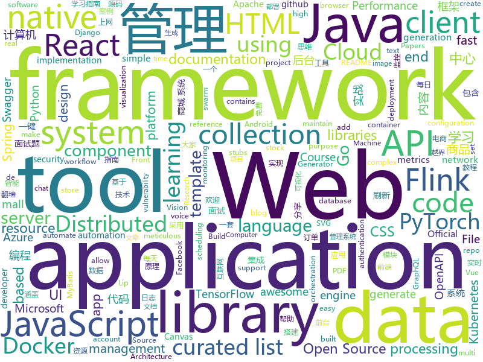

# 2020-09-04
See what the GitHub community is most excited about.

## python
+ [12306](https://github.com/testerSunshine/12306)(**67 stars today**): 12306智能刷票，订票
+ [autoscraper](https://github.com/alirezamika/autoscraper)(**44 stars today**): A Smart, Automatic, Fast and Lightweight Web Scraper for Python
+ [Wav2Lip](https://github.com/Rudrabha/Wav2Lip)(**45 stars today**): This repository contains the codes of "A Lip Sync Expert Is All You Need for Speech to Lip Generation In the Wild", published at ACM Multimedia 2020.
+ [yolov5](https://github.com/ultralytics/yolov5)(**33 stars today**): YOLOv5 in PyTorch > ONNX > CoreML > iOS
+ [hydra](https://github.com/facebookresearch/hydra)(**13 stars today**): Hydra is a framework for elegantly configuring complex applications
+ [redis-py](https://github.com/andymccurdy/redis-py)(**3 stars today**): Redis Python Client
+ [models](https://github.com/tensorflow/models)(**32 stars today**): Models and examples built with TensorFlow
+ [system-design-primer](https://github.com/donnemartin/system-design-primer)(**135 stars today**): Learn how to design large-scale systems. Prep for the system design interview. Includes Anki flashcards.
+ [awesome-machine-learning](https://github.com/josephmisiti/awesome-machine-learning)(**48 stars today**): A curated list of awesome Machine Learning frameworks, libraries and software.
+ [transformers](https://github.com/huggingface/transformers)(**46 stars today**): 🤗Transformers: State-of-the-art Natural Language Processing for Pytorch and TensorFlow 2.0.
+ [eat_tensorflow2_in_30_days](https://github.com/lyhue1991/eat_tensorflow2_in_30_days)(**18 stars today**): Tensorflow2.0🍎🍊is delicious, just eat it!😋😋
+ [wtfpython](https://github.com/satwikkansal/wtfpython)(**83 stars today**): What the f*ck Python?
+ [seaborn](https://github.com/mwaskom/seaborn)(**14 stars today**): Statistical data visualization using matplotlib
+ [kornia](https://github.com/kornia/kornia)(**6 stars today**): Open Source Differentiable Computer Vision Library for PyTorch
+ [kubespray](https://github.com/kubernetes-sigs/kubespray)(**12 stars today**): Deploy a Production Ready Kubernetes Cluster
+ [algo](https://github.com/wangzheng0822/algo)(**10 stars today**): 数据结构和算法必知必会的50个代码实现
+ [horovod](https://github.com/horovod/horovod)(**13 stars today**): Distributed training framework for TensorFlow, Keras, PyTorch, and Apache MXNet.
+ [stylegan2](https://github.com/NVlabs/stylegan2)(**11 stars today**): StyleGAN2 - Official TensorFlow Implementation
+ [sentence-transformers](https://github.com/UKPLab/sentence-transformers)(**12 stars today**): Sentence Embeddings with BERT & XLNet
+ [mmf](https://github.com/facebookresearch/mmf)(**3 stars today**): A modular framework for vision & language multimodal research from Facebook AI Research (FAIR)
+ [django-allauth](https://github.com/pennersr/django-allauth)(**5 stars today**): Integrated set of Django applications addressing authentication, registration, account management as well as 3rd party (social) account authentication.
+ [rasa](https://github.com/RasaHQ/rasa)(**20 stars today**): 💬Open source machine learning framework to automate text- and voice-based conversations: NLU, dialogue management, connect to Slack, Facebook, and more - Create chatbots and voice assistants
+ [ansible](https://github.com/ansible/ansible)(**14 stars today**): Ansible is a radically simple IT automation platform that makes your applications and systems easier to deploy and maintain. Automate everything from code deployment to network configuration to cloud management, in a language that approaches plain English, using SSH, with no agents to install on remote systems. https://docs.ansible.com.
+ [python](https://github.com/kubernetes-client/python)(**3 stars today**): Official Python client library for kubernetes
+ [django-rest-framework](https://github.com/encode/django-rest-framework)(**17 stars today**): Web APIs for Django.🎸

## java
+ [flink-learning](https://github.com/zhisheng17/flink-learning)(**57 stars today**): flink learning blog. http://www.flink-learning.com 含 Flink 入门、概念、原理、实战、性能调优、源码解析等内容。涉及 Flink Connector、Metrics、Library、DataStream API、Table API & SQL 等内容的学习案例，还有 Flink 落地应用的大型项目案例（PVUV、日志存储、百亿数据实时去重、监控告警）分享。欢迎大家支持我的专栏《大数据实时计算引擎 Flink 实战与性能优化》
+ [tutorials](https://github.com/eugenp/tutorials)(**24 stars today**): Just Announced - "Learn Spring Security OAuth":
+ [incubator-dolphinscheduler](https://github.com/apache/incubator-dolphinscheduler)(**13 stars today**): Dolphin Scheduler is a distributed and easy-to-extend visual workflow scheduling platform, dedicated to solving the complex dependencies in data processing, making the scheduling system out of the box for data processing.(分布式易扩展的可视化工作流任务调度)
+ [Java-Tutorial](https://github.com/h2pl/Java-Tutorial)(**104 stars today**): 【Java工程师面试复习指南】本仓库涵盖大部分Java程序员所需要掌握的核心知识，整合了互联网上的很多优质Java技术文章，力求打造为最完整最实用的Java开发者学习指南，如果对你有帮助，给个star告诉我吧，谢谢！
+ [selenium](https://github.com/SeleniumHQ/selenium)(**13 stars today**): A browser automation framework and ecosystem.
+ [mall](https://github.com/macrozheng/mall)(**71 stars today**): mall项目是一套电商系统，包括前台商城系统及后台管理系统，基于SpringBoot+MyBatis实现，采用Docker容器化部署。 前台商城系统包含首页门户、商品推荐、商品搜索、商品展示、购物车、订单流程、会员中心、客户服务、帮助中心等模块。 后台管理系统包含商品管理、订单管理、会员管理、促销管理、运营管理、内容管理、统计报表、财务管理、权限管理、设置等模块。
+ [canal](https://github.com/alibaba/canal)(**44 stars today**): 阿里巴巴 MySQL binlog 增量订阅&消费组件
+ [elasticsearch](https://github.com/elastic/elasticsearch)(**25 stars today**): Open Source, Distributed, RESTful Search Engine
+ [hutool](https://github.com/looly/hutool)(**68 stars today**): A set of tools that keep Java sweet.
+ [ksql](https://github.com/confluentinc/ksql)(**4 stars today**): The event streaming database purpose-built for stream processing applications
+ [hazelcast](https://github.com/hazelcast/hazelcast)(**7 stars today**): Open Source In-Memory Data Grid
+ [micronaut-core](https://github.com/micronaut-projects/micronaut-core)(**6 stars today**): Micronaut Application Framework
+ [react-native-share](https://github.com/react-native-community/react-native-share)(**3 stars today**): Social share, sending simple data to other apps.
+ [strimzi-kafka-operator](https://github.com/strimzi/strimzi-kafka-operator)(**3 stars today**): Apache Kafka running on Kubernetes
+ [micrometer](https://github.com/micrometer-metrics/micrometer)(**8 stars today**): An application metrics facade for the most popular monitoring tools. Think SLF4J, but for metrics.
+ [okhttp](https://github.com/square/okhttp)(**10 stars today**): Square’s meticulous HTTP client for Java and Kotlin.
+ [InternetArchitect](https://github.com/bjmashibing/InternetArchitect)(**37 stars today**): 年薪百万互联网架构师课程文档及源码(公开部分)
+ [druid](https://github.com/apache/druid)(**4 stars today**): Apache Druid: a high performance real-time analytics database.
+ [react-native-camera](https://github.com/react-native-community/react-native-camera)(**4 stars today**): A Camera component for React Native. Also supports barcode scanning!
+ [openapi-generator](https://github.com/OpenAPITools/openapi-generator)(**11 stars today**): OpenAPI Generator allows generation of API client libraries (SDK generation), server stubs, documentation and configuration automatically given an OpenAPI Spec (v2, v3)
+ [zeebe](https://github.com/zeebe-io/zeebe)(**5 stars today**): Distributed Workflow Engine for Microservices Orchestration
+ [jib](https://github.com/GoogleContainerTools/jib)(**13 stars today**): 🏗Build container images for your Java applications.
+ [mall-swarm](https://github.com/macrozheng/mall-swarm)(**47 stars today**): mall-swarm是一套微服务商城系统，采用了 Spring Cloud Hoxton & Alibaba、Spring Boot 2.3、Oauth2、MyBatis、Docker、Elasticsearch等核心技术，同时提供了基于Vue的管理后台方便快速搭建系统。mall-swarm在电商业务的基础集成了注册中心、配置中心、监控中心、网关等系统功能。文档齐全，附带全套Spring Cloud教程。
+ [react-native-video](https://github.com/react-native-community/react-native-video)(**5 stars today**): A <Video /> component for react-native
+ [SmartRefreshLayout](https://github.com/scwang90/SmartRefreshLayout)(**8 stars today**): 🔥下拉刷新、上拉加载、二级刷新、淘宝二楼、RefreshLayout、OverScroll，Android智能下拉刷新框架，支持越界回弹、越界拖动，具有极强的扩展性，集成了几十种炫酷的Header和 Footer。

## unknown
+ [the-incredible-pytorch](https://github.com/ritchieng/the-incredible-pytorch)(**241 stars today**): The Incredible PyTorch: a curated list of tutorials, papers, projects, communities and more relating to PyTorch.
+ [100-nlp-papers](https://github.com/mhagiwara/100-nlp-papers)(**139 stars today**): 100 Must-Read NLP Papers
+ [build-your-own-x](https://github.com/danistefanovic/build-your-own-x)(**283 stars today**): 🤓Build your own (insert technology here)
+ [KingOfBugBountyTips](https://github.com/KingOfBugbounty/KingOfBugBountyTips)(**102 stars today**): 
+ [nuclei-templates](https://github.com/projectdiscovery/nuclei-templates)(**11 stars today**): Community curated list of template files for the nuclei engine to find security vulnerability and fingerprinting the targets.
+ [JavaCollection](https://github.com/hansonwang99/JavaCollection)(**13 stars today**): Java开源项目之「自学编程之路」：学习指南+面试指南+资源分享+技术文章
+ [awesome-cpp-cn](https://github.com/jobbole/awesome-cpp-cn)(**86 stars today**): C++ 资源大全中文版，标准库、Web应用框架、人工智能、数据库、图片处理、机器学习、日志、代码分析等
+ [CS-Xmind-Note](https://github.com/SSHeRun/CS-Xmind-Note)(**10 stars today**): 计算机专业课（408）思维导图和笔记：计算机组成原理（第五版 王爱英），数据结构（王道），计算机网络（第七版 谢希仁），操作系统（第四版 汤小丹）
+ [IntelliJ-IDEA-2020.2.1-solve](https://github.com/shipofsea/IntelliJ-IDEA-2020.2.1-solve)(**9 stars today**): 
+ [pikvm](https://github.com/pikvm/pikvm)(**24 stars today**): Open and cheap DIY IP-KVM based on Raspberry Pi
+ [fe-news](https://github.com/naver/fe-news)(**22 stars today**): FE 기술 소식 큐레이션 뉴스레터
+ [developer-roadmap](https://github.com/kamranahmedse/developer-roadmap)(**479 stars today**): Roadmap to becoming a web developer in 2020
+ [Front-End-Checklist](https://github.com/thedaviddias/Front-End-Checklist)(**29 stars today**): 🗂The perfect Front-End Checklist for modern websites and meticulous developers
+ [app-ideas](https://github.com/florinpop17/app-ideas)(**77 stars today**): A Collection of application ideas which can be used to improve your coding skills.
+ [awesome-gpt3](https://github.com/elyase/awesome-gpt3)(**40 stars today**): 
+ [my-mac-os](https://github.com/nikitavoloboev/my-mac-os)(**29 stars today**): List of applications and tools that make my macOS experience even more amazing
+ [dockprom](https://github.com/stefanprodan/dockprom)(**3 stars today**): Docker hosts and containers monitoring with Prometheus, Grafana, cAdvisor, NodeExporter and AlertManager
+ [magisk_files](https://github.com/topjohnwu/magisk_files)(**1 stars today**): Magisk File Host
+ [free-programming-books-zh_CN](https://github.com/justjavac/free-programming-books-zh_CN)(**34 stars today**): 📚免费的计算机编程类中文书籍，欢迎投稿
+ [covid-19-data](https://github.com/nytimes/covid-19-data)(**3 stars today**): An ongoing repository of data on coronavirus cases and deaths in the U.S.
+ [market-toolkit](https://github.com/ckz8780/market-toolkit)(**8 stars today**): A collection of stock market resources and tools
+ [new-pac](https://github.com/Alvin9999/new-pac)(**17 stars today**): 科学上网/自由上网/翻墙/软件/方法，一键翻墙浏览器，免费shadowsocks/ss/ssr/v2ray/goflyway账号，vps一键搭建脚本/教程
+ [one-python-craftsman](https://github.com/piglei/one-python-craftsman)(**10 stars today**): 来自一位 Pythonista 的编程经验分享，内容涵盖编码技巧、最佳实践与思维模式等方面。
+ [design-resources-for-developers](https://github.com/bradtraversy/design-resources-for-developers)(**43 stars today**): Curated list of design and UI resources from stock photos, web templates, CSS frameworks, UI libraries, tools and much more
+ [WSL](https://github.com/microsoft/WSL)(**16 stars today**): Issues found on WSL

## javascript
+ [30-seconds-of-code](https://github.com/30-seconds/30-seconds-of-code)(**565 stars today**): Short JavaScript code snippets for all your development needs
+ [fullstack-course4](https://github.com/jhu-ep-coursera/fullstack-course4)(**13 stars today**): Example code for HTML, CSS, and Javascript for Web Developers Coursera Course
+ [portainer](https://github.com/portainer/portainer)(**131 stars today**): Making Docker management easy.
+ [graphql-js](https://github.com/graphql/graphql-js)(**8 stars today**): A reference implementation of GraphQL for JavaScript
+ [yapi](https://github.com/YMFE/yapi)(**57 stars today**): YApi 是一个可本地部署的、打通前后端及QA的、可视化的接口管理平台
+ [pdf.js](https://github.com/mozilla/pdf.js)(**31 stars today**): PDF Reader in JavaScript
+ [next.js](https://github.com/vercel/next.js)(**62 stars today**): The React Framework
+ [chatify](https://github.com/munafio/chatify)(**11 stars today**): A package for Laravel PHP Framework to add a complete real-time chat system to your app by only a few steps.
+ [lofi-player](https://github.com/magenta/lofi-player)(**27 stars today**): 🔥Virtual room in your browser that lets you play with the Lo-Fi VIBE and relax
+ [Detox](https://github.com/wix/Detox)(**13 stars today**): Gray box end-to-end testing and automation framework for mobile apps
+ [samples](https://github.com/webrtc/samples)(**7 stars today**): WebRTC Web demos and samples
+ [javascript-algorithms](https://github.com/trekhleb/javascript-algorithms)(**105 stars today**): 📝Algorithms and data structures implemented in JavaScript with explanations and links to further readings
+ [github-profile-readme-generator](https://github.com/rahuldkjain/github-profile-readme-generator)(**105 stars today**): 🚀Generate github profile README easily with latest add-ons like visitors count, github stats, etc using minimal UI.
+ [insomnia](https://github.com/Kong/insomnia)(**13 stars today**): The Open Source API Client and Design Platform for GraphQL and REST ->
+ [fabric.js](https://github.com/fabricjs/fabric.js)(**13 stars today**): Javascript Canvas Library, SVG-to-Canvas (& canvas-to-SVG) Parser
+ [10-projects-10-hours](https://github.com/florinpop17/10-projects-10-hours)(**20 stars today**): 
+ [react-native](https://github.com/facebook/react-native)(**37 stars today**): A framework for building native apps with React.
+ [three.js](https://github.com/mrdoob/three.js)(**37 stars today**): JavaScript 3D library.
+ [Awesome-Profile-README-templates](https://github.com/kautukkundan/Awesome-Profile-README-templates)(**85 stars today**): A collection of awesome readme templates to display on your profile
+ [label-studio](https://github.com/heartexlabs/label-studio)(**8 stars today**): Label Studio is a multi-type data labeling and annotation tool with standardized output format
+ [incubator-echarts](https://github.com/apache/incubator-echarts)(**23 stars today**): A powerful, interactive charting and visualization library for browser
+ [pdfmake](https://github.com/bpampuch/pdfmake)(**7 stars today**): Client/server side PDF printing in pure JavaScript
+ [swagger-ui](https://github.com/swagger-api/swagger-ui)(**13 stars today**): Swagger UI is a collection of HTML, JavaScript, and CSS assets that dynamically generate beautiful documentation from a Swagger-compliant API.
+ [react-native-calendars](https://github.com/wix/react-native-calendars)(**7 stars today**): React Native Calendar Components🗓️📆
+ [fe-interview](https://github.com/haizlin/fe-interview)(**21 stars today**): 前端面试每日 3+1，以面试题来驱动学习，提倡每日学习与思考，每天进步一点！每天早上5点纯手工发布面试题（死磕自己，愉悦大家），3000+道前端面试题全面覆盖，HTML/CSS/JavaScript/Vue/React/Nodejs/TypeScript/ECMAScritpt/Webpack/Jquery/小程序/软技能……

## html
+ [18S191](https://github.com/mitmath/18S191)(**126 stars today**): Course 18.S191 at MIT, fall 2020 - Introduction to computational thinking with Julia:
+ [howtheytest](https://github.com/abhivaikar/howtheytest)(**416 stars today**): A collection of public resources about how software companies test their software
+ [JavaScript30](https://github.com/wesbos/JavaScript30)(**25 stars today**): 30 Day Vanilla JS Challenge
+ [tidytuesday](https://github.com/rfordatascience/tidytuesday)(**14 stars today**): Official repo for the #tidytuesday project
+ [element-web](https://github.com/vector-im/element-web)(**5 stars today**): A glossy Matrix collaboration client for the web.
+ [fastText](https://github.com/facebookresearch/fastText)(**11 stars today**): Library for fast text representation and classification.
+ [html](https://github.com/whatwg/html)(**4 stars today**): HTML Standard
+ [msteams-docs](https://github.com/MicrosoftDocs/msteams-docs)(**0 stars today**): Source for the Microsoft Teams developer platform documentation.
+ [foundation-sites](https://github.com/foundation/foundation-sites)(**7 stars today**): The most advanced responsive front-end framework in the world. Quickly create prototypes and production code for sites that work on any kind of device.
+ [swagger-codegen](https://github.com/swagger-api/swagger-codegen)(**8 stars today**): swagger-codegen contains a template-driven engine to generate documentation, API clients and server stubs in different languages by parsing your OpenAPI / Swagger definition.
+ [polymer](https://github.com/Polymer/polymer)(**3 stars today**): Our original Web Component library.
+ [web-moderno](https://github.com/cod3rcursos/web-moderno)(**5 stars today**): 
+ [calico](https://github.com/projectcalico/calico)(**5 stars today**): Cloud native networking and network security
+ [aks-secure-baseline](https://github.com/mspnp/aks-secure-baseline)(**7 stars today**): This is the Azure Kubernetes Service (AKS) Secure Baseline reference implementation as produced by the Microsoft Azure Architecture Center.
+ [twinspark-js](https://github.com/kasta-ua/twinspark-js)(**9 stars today**): Declarative enhancement for HTML: simple, composable, lean.
+ [B787-XE](https://github.com/lmk02/B787-XE)(**16 stars today**): A modification of the Microsoft Flightsimulator 2020 787-10
+ [chatcord](https://github.com/bradtraversy/chatcord)(**1 stars today**): Realtime chat app with rooms
+ [hyperblog](https://github.com/freddier/hyperblog)(**11 stars today**): Un blog increíble para el curso de Git y Github de Platzi
+ [Server](https://github.com/PanDownloadServer/Server)(**21 stars today**): PanDownload的个人维护版本
+ [laravel-notify](https://github.com/mckenziearts/laravel-notify)(**13 stars today**): Flexible Flash notifications for Laravel
+ [learning-area](https://github.com/mdn/learning-area)(**1 stars today**): Github repo for the MDN Learning Area.
+ [aws-sa-associate-saac02](https://github.com/acantril/aws-sa-associate-saac02)(**3 stars today**): Course Files for AWS Certified Solutions Architect Certification Course (SAAC02) - Adrian Cantrill
+ [yi-hack-Allwinner](https://github.com/roleoroleo/yi-hack-Allwinner)(**1 stars today**): 
+ [django-DefectDojo](https://github.com/DefectDojo/django-DefectDojo)(**3 stars today**): DefectDojo is an open-source application vulnerability correlation and security orchestration tool.
+ [3d-force-graph](https://github.com/vasturiano/3d-force-graph)(**5 stars today**): 3D force-directed graph component using ThreeJS/WebGL

## go
+ [croc](https://github.com/schollz/croc)(**73 stars today**): Easily and securely send things from one computer to another🐊📦
+ [protobuf](https://github.com/golang/protobuf)(**7 stars today**): Go support for Google's protocol buffers
+ [go-zero](https://github.com/tal-tech/go-zero)(**82 stars today**): go-zero是一个集成了各种工程实践的web和rpc框架。通过弹性设计保障了大并发服务端的稳定性，经受了充分的实战检验。包含极简的API定义和生成工具，可以一键生成Go, iOS, Android, Dart, TypeScript, JavaScript代码，并可直接运行。
+ [terraform-provider-azurerm](https://github.com/terraform-providers/terraform-provider-azurerm)(**3 stars today**): Terraform provider for Azure Resource Manager
+ [opentelemetry-collector](https://github.com/open-telemetry/opentelemetry-collector)(**2 stars today**): OpenTelemetry Collector
+ [grpc-gateway](https://github.com/grpc-ecosystem/grpc-gateway)(**13 stars today**): gRPC to JSON proxy generator following the gRPC HTTP spec
+ [distribution](https://github.com/docker/distribution)(**3 stars today**): The Docker toolset to pack, ship, store, and deliver content
+ [argo-cd](https://github.com/argoproj/argo-cd)(**12 stars today**): Declarative continuous deployment for Kubernetes.
+ [dive](https://github.com/wagoodman/dive)(**20 stars today**): A tool for exploring each layer in a docker image
+ [nuclei](https://github.com/projectdiscovery/nuclei)(**19 stars today**): Nuclei is a fast tool for configurable targeted scanning based on templates offering massive extensibility and ease of use.
+ [ksubdomain](https://github.com/knownsec/ksubdomain)(**65 stars today**): 无状态子域名爆破工具
+ [minio](https://github.com/minio/minio)(**18 stars today**): High Performance, Kubernetes Native Object Storage
+ [grpc-go](https://github.com/grpc/grpc-go)(**5 stars today**): The Go language implementation of gRPC. HTTP/2 based RPC
+ [httpx](https://github.com/projectdiscovery/httpx)(**27 stars today**): httpx is a fast and multi-purpose HTTP toolkit allow to run multiple probers using retryablehttp library, it is designed to maintain the result reliability with increased threads.
+ [chainlink](https://github.com/smartcontractkit/chainlink)(**9 stars today**): node of the decentralized oracle network, bridging on and off-chain computation
+ [ffuf](https://github.com/ffuf/ffuf)(**19 stars today**): Fast web fuzzer written in Go
+ [etcd](https://github.com/etcd-io/etcd)(**22 stars today**): Distributed reliable key-value store for the most critical data of a distributed system
+ [community](https://github.com/istio/community)(**4 stars today**): Istio governance material.
+ [jaeles](https://github.com/jaeles-project/jaeles)(**8 stars today**): The Swiss Army knife for automated Web Application Testing
+ [nats-server](https://github.com/nats-io/nats-server)(**7 stars today**): High-Performance server for NATS, the cloud native messaging system.
+ [coredns](https://github.com/coredns/coredns)(**5 stars today**): CoreDNS is a DNS server that chains plugins
+ [awesome-go](https://github.com/avelino/awesome-go)(**34 stars today**): A curated list of awesome Go frameworks, libraries and software
+ [image-spec](https://github.com/opencontainers/image-spec)(**1 stars today**): OCI Image Format
+ [wild-workouts-go-ddd-example](https://github.com/ThreeDotsLabs/wild-workouts-go-ddd-example)(**23 stars today**): Complete serverless application to show how to apply DDD, Clean Architecture, and CQRS by practical refactoring of a Go project.
+ [eksctl](https://github.com/weaveworks/eksctl)(**3 stars today**): The official CLI for Amazon EKS

## WordCloud

