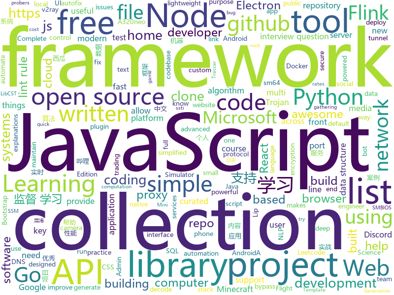

# 2020-09-06
See what the GitHub community is most excited about.

## python
+ [Ciphey](https://github.com/Ciphey/Ciphey)(**114 stars today**): Automatically decode encryptions without a key, decode encodings, and crack hashes
+ [autoscraper](https://github.com/alirezamika/autoscraper)(**349 stars today**): A Smart, Automatic, Fast and Lightweight Web Scraper for Python
+ [hivemind](https://github.com/learning-at-home/hivemind)(**136 stars today**): Decentralized deep learning framework in pytorch. Built to train models on thousands of volunteers across the world.
+ [keras](https://github.com/keras-team/keras)(**46 stars today**): Deep Learning for humans
+ [Wav2Lip](https://github.com/Rudrabha/Wav2Lip)(**157 stars today**): This repository contains the codes of "A Lip Sync Expert Is All You Need for Speech to Lip Generation In the Wild", published at ACM Multimedia 2020.
+ [hydra](https://github.com/facebookresearch/hydra)(**27 stars today**): Hydra is a framework for elegantly configuring complex applications
+ [hammer](https://github.com/cyweb/hammer)(**3 stars today**): Hammer DDos Script - Python 3
+ [rich](https://github.com/willmcgugan/rich)(**36 stars today**): Rich is a Python library for rich text and beautiful formatting in the terminal.
+ [wifiphisher](https://github.com/wifiphisher/wifiphisher)(**5 stars today**): The Rogue Access Point Framework
+ [sherlock](https://github.com/sherlock-project/sherlock)(**28 stars today**): 🔎Hunt down social media accounts by username across social networks
+ [prefect](https://github.com/PrefectHQ/prefect)(**17 stars today**): The easiest way to automate your data
+ [discord.py](https://github.com/Rapptz/discord.py)(**13 stars today**): An API wrapper for Discord written in Python.
+ [oneliners](https://github.com/tjf801/oneliners)(**10 stars today**): one line of python code to impliment algorithms
+ [capa](https://github.com/fireeye/capa)(**12 stars today**): The FLARE team's open-source tool to identify capabilities in executable files.
+ [core](https://github.com/home-assistant/core)(**12 stars today**): 🏡Open source home automation that puts local control and privacy first
+ [DOGECICS](https://github.com/mainframed/DOGECICS)(**42 stars today**): Doge bank expensive new COBOL front end. The retail branches are gonna love this!
+ [manim](https://github.com/3b1b/manim)(**55 stars today**): Animation engine for explanatory math videos
+ [Bombers](https://github.com/bhattsameer/Bombers)(**3 stars today**): SMS/Email/Whatsapp bombers Collection💣💣💣💥
+ [GenSMBIOS](https://github.com/corpnewt/GenSMBIOS)(**3 stars today**): Py script that uses acidanthera's macserial to generate SMBIOS and optionally saves them to a plist.
+ [dask](https://github.com/dask/dask)(**5 stars today**): Parallel computing with task scheduling
+ [ansible](https://github.com/ansible/ansible)(**17 stars today**): Ansible is a radically simple IT automation platform that makes your applications and systems easier to deploy and maintain. Automate everything from code deployment to network configuration to cloud management, in a language that approaches plain English, using SSH, with no agents to install on remote systems. https://docs.ansible.com.
+ [flask-admin](https://github.com/flask-admin/flask-admin)(**2 stars today**): Simple and extensible administrative interface framework for Flask
+ [Fixit](https://github.com/Instagram/Fixit)(**20 stars today**): Fixit is a Python Lint Framework based on LibCST. It comes with useful default lint rules for coding convention, performance and security issues. It makes custom lint rule easy to build, test and configure. It empowers lint rule to provide autofix to fix the issues for developers. It also provide tools to run autofix across codebase to fix exist…
+ [freqtrade](https://github.com/freqtrade/freqtrade)(**4 stars today**): Free, open source crypto trading bot
+ [reinforcement-learning-an-introduction](https://github.com/ShangtongZhang/reinforcement-learning-an-introduction)(**9 stars today**): Python Implementation of Reinforcement Learning: An Introduction

## java
+ [jdk](https://github.com/openjdk/jdk)(**163 stars today**): JDK main-line development
+ [CtCI-6th-Edition](https://github.com/careercup/CtCI-6th-Edition)(**8 stars today**): Cracking the Coding Interview 6th Ed. Solutions
+ [baritone](https://github.com/cabaletta/baritone)(**6 stars today**): google maps for block game
+ [AngryGhidra](https://github.com/Nalen98/AngryGhidra)(**22 stars today**): Angr plugin for Ghdira
+ [Algorithms](https://github.com/williamfiset/Algorithms)(**11 stars today**): A collection of algorithms and data structures
+ [flink-learning](https://github.com/zhisheng17/flink-learning)(**181 stars today**): flink learning blog. http://www.flink-learning.com 含 Flink 入门、概念、原理、实战、性能调优、源码解析等内容。涉及 Flink Connector、Metrics、Library、DataStream API、Table API & SQL 等内容的学习案例，还有 Flink 落地应用的大型项目案例（PVUV、日志存储、百亿数据实时去重、监控告警）分享。欢迎大家支持我的专栏《大数据实时计算引擎 Flink 实战与性能优化》
+ [sodium-fabric](https://github.com/jellysquid3/sodium-fabric)(**7 stars today**): A Fabric mod designed to improve frame rates and reduce micro-stutter
+ [react-native-image-picker](https://github.com/react-native-community/react-native-image-picker)(**3 stars today**): 🌄A React Native module that allows you to use native UI to select media from the device library or directly from the camera.
+ [EhViewer](https://github.com/seven332/EhViewer)(**5 stars today**): [DEPRECATED] An Unofficial E-Hentai Application for Android
+ [NewPipe](https://github.com/TeamNewPipe/NewPipe)(**5 stars today**): A libre lightweight streaming front-end for Android.
+ [data-structures](https://github.com/williamfiset/data-structures)(**6 stars today**): A collection of powerful data structures
+ [CS-Notes](https://github.com/CyC2018/CS-Notes)(**64 stars today**): 📚技术面试必备基础知识、Leetcode、计算机操作系统、计算机网络、系统设计、Java、Python、C++
+ [spring-view-manipulation](https://github.com/veracode-research/spring-view-manipulation)(**49 stars today**): When MVC magic turns black
+ [GitHub-Chinese-Top-Charts](https://github.com/kon9chunkit/GitHub-Chinese-Top-Charts)(**14 stars today**): 🇨🇳GitHub中文排行榜，帮助你发现高分优秀中文项目、更高效地吸收国人的优秀经验成果；榜单每周更新一次，敬请关注！
+ [sm64-port-android-base](https://github.com/VDavid003/sm64-port-android-base)(**1 stars today**): A port of https://github.com/sm64-port/sm64-port for Android.
+ [ForestBlog](https://github.com/saysky/ForestBlog)(**5 stars today**): 一个简单漂亮的SSM(Spring+SpringMVC+Mybatis)博客系统
+ [quickstart-android](https://github.com/firebase/quickstart-android)(**2 stars today**): Firebase Quickstart Samples for Android
+ [Intra](https://github.com/Jigsaw-Code/Intra)(**1 stars today**): An experimental tool that allows you to test new DNS-over-HTTPS services on Android
+ [interviews](https://github.com/kdn251/interviews)(**23 stars today**): Everything you need to know to get the job.
+ [AntennaPod](https://github.com/AntennaPod/AntennaPod)(**1 stars today**): A podcast manager for Android
+ [Geyser](https://github.com/GeyserMC/Geyser)(**7 stars today**): A bridge/proxy allowing you to connect to Minecraft: Java Edition servers with Minecraft: Bedrock edition.
+ [DeepVision](https://github.com/peng-zhihui/DeepVision)(**11 stars today**): 在我很多项目中用到的CV算法推理框架应用。
+ [sqli](https://github.com/x-ream/sqli)(**72 stars today**): Simple sql interface, Criteria, CriteriaBuilder
+ [Essentials](https://github.com/EssentialsX/Essentials)(**0 stars today**): The essential plugin suite for Minecraft servers.
+ [traccar](https://github.com/traccar/traccar)(**1 stars today**): Traccar GPS Tracking System

## unknown
+ [data-engineer-roadmap](https://github.com/datastacktv/data-engineer-roadmap)(**419 stars today**): Roadmap to becoming a data engineer in 2020
+ [100-nlp-papers](https://github.com/mhagiwara/100-nlp-papers)(**450 stars today**): 100 Must-Read NLP Papers
+ [build-your-own-x](https://github.com/danistefanovic/build-your-own-x)(**308 stars today**): 🤓Build your own (insert technology here)
+ [awesome-interview-questions](https://github.com/MaximAbramchuck/awesome-interview-questions)(**193 stars today**): A curated awesome list of lists of interview questions. Feel free to contribute!🎓
+ [awesome-project-ideas](https://github.com/NirantK/awesome-project-ideas)(**26 stars today**): Curated list of Machine Learning, NLP, Vision, Recommender Systems Project Ideas
+ [LeetcodeTop](https://github.com/afatcoder/LeetcodeTop)(**54 stars today**): 汇总各大互联网公司容易考察的高频leetcode题🔥
+ [javascript-questions](https://github.com/lydiahallie/javascript-questions)(**21 stars today**): A long list of (advanced) JavaScript questions, and their explanations✨
+ [what-happens-when](https://github.com/alex/what-happens-when)(**26 stars today**): An attempt to answer the age old interview question "What happens when you type google.com into your browser and press enter?"
+ [Red-Teaming-Toolkit](https://github.com/infosecn1nja/Red-Teaming-Toolkit)(**42 stars today**): A collection of open source and commercial tools that aid in red team operations.
+ [gitignore](https://github.com/github/gitignore)(**57 stars today**): A collection of useful .gitignore templates
+ [coding-interview-university](https://github.com/jwasham/coding-interview-university)(**140 stars today**): A complete computer science study plan to become a software engineer.
+ [api-guidelines](https://github.com/microsoft/api-guidelines)(**26 stars today**): Microsoft REST API Guidelines
+ [Best-websites-a-programmer-should-visit](https://github.com/sdmg15/Best-websites-a-programmer-should-visit)(**11 stars today**): 🔗Some useful websites for programmers.
+ [Machine-learning-learning-notes](https://github.com/Vay-keen/Machine-learning-learning-notes)(**4 stars today**): 周志华《机器学习》又称西瓜书是一本较为全面的书籍，书中详细介绍了机器学习领域不同类型的算法(例如：监督学习、无监督学习、半监督学习、强化学习、集成降维、特征选择等)，记录了本人在学习过程中的理解思路与扩展知识点，希望对新人阅读西瓜书有所帮助！
+ [COVID-19](https://github.com/CSSEGISandData/COVID-19)(**14 stars today**): Novel Coronavirus (COVID-19) Cases, provided by JHU CSSE
+ [awesome-domain-adaptation](https://github.com/zhaoxin94/awesome-domain-adaptation)(**15 stars today**): A collection of AWESOME things about domian adaptation
+ [keyhacks](https://github.com/streaak/keyhacks)(**5 stars today**): Keyhacks is a repository which shows quick ways in which API keys leaked by a bug bounty program can be checked to see if they're valid.
+ [pikvm](https://github.com/pikvm/pikvm)(**63 stars today**): Open and cheap DIY IP-KVM based on Raspberry Pi
+ [Projects](https://github.com/karan/Projects)(**18 stars today**): 📃A list of practical projects that anyone can solve in any programming language.
+ [every-programmer-should-know](https://github.com/mtdvio/every-programmer-should-know)(**19 stars today**): A collection of (mostly) technical things every software developer should know about
+ [computer-science](https://github.com/ossu/computer-science)(**45 stars today**): 🎓Path to a free self-taught education in Computer Science!
+ [Gf-Patterns](https://github.com/1ndianl33t/Gf-Patterns)(**5 stars today**): GF Paterns For (ssrf,RCE,Lfi,sqli,ssti,idor,url redirection,debug_logic, interesting Subs) parameters grep
+ [flutter-beginners-tutorial](https://github.com/iamshaunjp/flutter-beginners-tutorial)(**3 stars today**): All course files for the Flutter Beginners playlist on The Net Ninja YouTube channel.
+ [docker-traefik](https://github.com/htpcBeginner/docker-traefik)(**2 stars today**): Docker media and home server stack with Docker Compose, Traefik, Swarm Mode, Google OAuth2/Authelia, and LetsEncrypt
+ [NewGrad-2021](https://github.com/Pitt-CSC/NewGrad-2021)(**13 stars today**): A collection of New Grad full time roles in SWE, Quant, and PM.

## javascript
+ [a32nx](https://github.com/flybywiresim/a32nx)(**58 stars today**): The A32NX Project is a community driven open source project to create a free Airbus A320neo in Microsoft Flight Simulator that is as close to reality as possible. It aims to enhance the default A320neo by improving the systems depth and functionality to bring it up to payware-level, all for free.
+ [30-seconds-of-code](https://github.com/30-seconds/30-seconds-of-code)(**502 stars today**): Short JavaScript code snippets for all your development needs
+ [moon](https://github.com/kbrsh/moon)(**42 stars today**): 🌙The minimal & fast library for functional user interfaces
+ [fullstack-course4](https://github.com/jhu-ep-coursera/fullstack-course4)(**16 stars today**): Example code for HTML, CSS, and Javascript for Web Developers Coursera Course
+ [livewire-devtools](https://github.com/beyondcode/livewire-devtools)(**17 stars today**): Chrome and Firefox DevTools extension for debugging Livewire applications
+ [stackoverflow-clone](https://github.com/salihozdemir/stackoverflow-clone)(**101 stars today**): This project is a simplified a full stack clone of Stackoverflow.
+ [vue](https://github.com/vuejs/vue)(**57 stars today**): 🖖Vue.js is a progressive, incrementally-adoptable JavaScript framework for building UI on the web.
+ [unlock-music](https://github.com/ix64/unlock-music)(**22 stars today**): Unlock encrypted music file in browser. 在浏览器中解锁加密的音乐文件。
+ [vanillawebprojects](https://github.com/bradtraversy/vanillawebprojects)(**90 stars today**): Mini projects built with HTML5, CSS & JavaScript. No frameworks or libraries
+ [discord.js](https://github.com/discordjs/discord.js)(**8 stars today**): A powerful JavaScript library for interacting with the Discord API
+ [jira_clone](https://github.com/oldboyxx/jira_clone)(**33 stars today**): A simplified Jira clone built with React/Babel (Client), and Node/TypeScript (API). Auto formatted with Prettier, tested with Cypress.
+ [nodebestpractices](https://github.com/goldbergyoni/nodebestpractices)(**87 stars today**): ✅The Node.js best practices list (August 2020)
+ [complete-javascript-course](https://github.com/jonasschmedtmann/complete-javascript-course)(**6 stars today**): Starter files, final projects and FAQ for my Complete JavaScript course
+ [Bilibili-Evolved](https://github.com/the1812/Bilibili-Evolved)(**13 stars today**): 强大的哔哩哔哩增强脚本: 下载视频, 音乐, 封面, 弹幕 / 简化直播间, 评论区, 首页 / 自定义顶栏, 删除广告, 夜间模式 / 触屏设备支持
+ [10-projects-10-hours](https://github.com/florinpop17/10-projects-10-hours)(**23 stars today**): 
+ [electron-quick-start](https://github.com/electron/electron-quick-start)(**7 stars today**): Clone to try a simple Electron app
+ [lowdb](https://github.com/typicode/lowdb)(**11 stars today**): ⚡️lowdb is a small local JSON database powered by Lodash (supports Node, Electron and the browser)
+ [javascript-interview-questions](https://github.com/sudheerj/javascript-interview-questions)(**9 stars today**): List of 1000 JavaScript Interview Questions
+ [tech-interview-handbook](https://github.com/yangshun/tech-interview-handbook)(**34 stars today**): 💯Materials to help you rock your next coding interview
+ [generator-jhipster](https://github.com/jhipster/generator-jhipster)(**7 stars today**): JHipster is a development platform to quickly generate, develop, & deploy modern web applications & microservice architectures.
+ [strapi](https://github.com/strapi/strapi)(**30 stars today**): 🚀Open source Node.js Headless CMS to easily build customisable APIs
+ [javascript-algorithms](https://github.com/trekhleb/javascript-algorithms)(**76 stars today**): 📝Algorithms and data structures implemented in JavaScript with explanations and links to further readings
+ [realworld](https://github.com/gothinkster/realworld)(**67 stars today**): "The mother of all demo apps" — Exemplary fullstack Medium.com clone powered by React, Angular, Node, Django, and many more🏅
+ [freeCodeCamp](https://github.com/freeCodeCamp/freeCodeCamp)(**57 stars today**): freeCodeCamp.org's open source codebase and curriculum. Learn to code at home.
+ [brain.js](https://github.com/BrainJS/brain.js)(**4 stars today**): 🤖Neural networks in JavaScript

## html
+ [Server](https://github.com/PanDownloadServer/Server)(**115 stars today**): PanDownload的个人维护版本
+ [18S191](https://github.com/mitmath/18S191)(**228 stars today**): Course 18.S191 at MIT, fall 2020 - Introduction to computational thinking with Julia:
+ [howtheytest](https://github.com/abhivaikar/howtheytest)(**267 stars today**): A collection of public resources about how software companies test their software
+ [gohugo-theme-ananke](https://github.com/theNewDynamic/gohugo-theme-ananke)(**2 stars today**): Ananke: A theme for Hugo Sites
+ [learning-area](https://github.com/mdn/learning-area)(**3 stars today**): Github repo for the MDN Learning Area.
+ [awesome-piracy](https://github.com/Igglybuff/awesome-piracy)(**7 stars today**): A curated list of awesome warez and piracy links
+ [computer-science-flash-cards](https://github.com/jwasham/computer-science-flash-cards)(**9 stars today**): Mini website for testing both general CS knowledge and enforce coding practice and common algorithm/data structure memorization.
+ [zenbot](https://github.com/DeviaVir/zenbot)(**2 stars today**): Zenbot is a command-line cryptocurrency trading bot using Node.js and MongoDB.
+ [v2-ui](https://github.com/sprov065/v2-ui)(**4 stars today**): 支持多协议多用户的 v2ray 面板，Support multi-protocol multi-user v2ray panel
+ [coreui-free-laravel-admin-template](https://github.com/coreui/coreui-free-laravel-admin-template)(**3 stars today**): CoreUI Free Laravel Bootstrap Admin Template
+ [electron-api-demos](https://github.com/electron/electron-api-demos)(**7 stars today**): Explore the Electron APIs
+ [volt-bootstrap-5-dashboard](https://github.com/themesberg/volt-bootstrap-5-dashboard)(**42 stars today**): ⚡️Volt - Bootstrap 5 Admin Dashboard Template with vanilla Javascript
+ [Hacktoberfest2020](https://github.com/OpenSouceCode/Hacktoberfest2020)(**15 stars today**): Make your first Pull Request and earn a free tee from GitHub!
+ [B787-XE](https://github.com/lmk02/B787-XE)(**8 stars today**): A modification of the Microsoft Flightsimulator 2020 787-10
+ [Spoon-Knife](https://github.com/octocat/Spoon-Knife)(**4 stars today**): This repo is for demonstration purposes only.
+ [en.javascript.info](https://github.com/javascript-tutorial/en.javascript.info)(**10 stars today**): Modern JavaScript Tutorial
+ [text-to-handwriting](https://github.com/saurabhdaware/text-to-handwriting)(**29 stars today**): So your teacher asked you to upload written assignments? Hate writing assigments? This tool will help you convert your text to handwriting xD
+ [discord-bot-client](https://github.com/Flam3rboy/discord-bot-client)(**1 stars today**): A custom version of discord, with bot login support
+ [peng-zhihui.github.io](https://github.com/peng-zhihui/peng-zhihui.github.io)(**16 stars today**): 稚晖的个人站
+ [CamPhish](https://github.com/techchipnet/CamPhish)(**3 stars today**): Grab cam shots from target's phone front camera or PC webcam just sending a link.
+ [home-assistant.io](https://github.com/home-assistant/home-assistant.io)(**3 stars today**): 📘Home Assistant User documentation
+ [beginner-javascript](https://github.com/wesbos/beginner-javascript)(**2 stars today**): Slam Dunk JavaScript
+ [boost](https://github.com/boostorg/boost)(**2 stars today**): Super-project for modularized Boost
+ [rust-gamedev.github.io](https://github.com/rust-gamedev/rust-gamedev.github.io)(**2 stars today**): The repository for rust-gamedev.github.io
+ [ecma262](https://github.com/tc39/ecma262)(**5 stars today**): Status, process, and documents for ECMA-262

## go
+ [croc](https://github.com/schollz/croc)(**325 stars today**): Easily and securely send things from one computer to another🐊📦
+ [infracost](https://github.com/infracost/infracost)(**41 stars today**): Cloud cost estimation for Terraform
+ [arktos](https://github.com/futurewei-cloud/arktos)(**27 stars today**): Arktos for large-scale cloud platform
+ [go-zero](https://github.com/tal-tech/go-zero)(**196 stars today**): go-zero is a web and rpc framework written in Go. It's born to ensure the stability of the busy sites with resilient design. Builtin goctl greatly improves the development productivity.
+ [age](https://github.com/FiloSottile/age)(**37 stars today**): A simple, modern and secure encryption tool (and Go library) with small explicit keys, no config options, and UNIX-style composability.
+ [trojan-go](https://github.com/p4gefau1t/trojan-go)(**10 stars today**): Go实现的Trojan代理，支持多路复用/路由功能/CDN中转/Shadowsocks混淆插件，多平台，无依赖。A Trojan proxy written in Go. An unidentifiable mechanism that helps you bypass GFW. https://p4gefau1t.github.io/trojan-go/
+ [faas](https://github.com/openfaas/faas)(**11 stars today**): OpenFaaS - Serverless Functions Made Simple
+ [istio](https://github.com/istio/istio)(**18 stars today**): Connect, secure, control, and observe services.
+ [eksctl](https://github.com/weaveworks/eksctl)(**6 stars today**): The official CLI for Amazon EKS
+ [gobuster](https://github.com/OJ/gobuster)(**7 stars today**): Directory/File, DNS and VHost busting tool written in Go
+ [bettercap](https://github.com/bettercap/bettercap)(**7 stars today**): The Swiss Army knife for 802.11, BLE and Ethernet networks reconnaissance and MITM attacks.
+ [httpx](https://github.com/projectdiscovery/httpx)(**24 stars today**): httpx is a fast and multi-purpose HTTP toolkit allow to run multiple probers using retryablehttp library, it is designed to maintain the result reliability with increased threads.
+ [v2ray-core](https://github.com/v2ray/v2ray-core)(**27 stars today**): A platform for building proxies to bypass network restrictions.
+ [oauth2-proxy](https://github.com/oauth2-proxy/oauth2-proxy)(**9 stars today**): A reverse proxy that provides authentication with Google, Github or other providers.
+ [ngrok](https://github.com/inconshreveable/ngrok)(**11 stars today**): Introspected tunnels to localhost
+ [ebiten](https://github.com/hajimehoshi/ebiten)(**5 stars today**): A dead simple 2D game library for Go
+ [msfs2020-go](https://github.com/lian/msfs2020-go)(**4 stars today**): connect to microsoft flight simulator 2020 using golang
+ [gitleaks](https://github.com/zricethezav/gitleaks)(**29 stars today**): Scan git repos for secrets using regex and entropy🔑
+ [cosmos-sdk](https://github.com/cosmos/cosmos-sdk)(**0 stars today**): ⛓️A Framework for Building High Value Public Blockchains✨
+ [buffalo](https://github.com/gobuffalo/buffalo)(**5 stars today**): Rapid Web Development w/ Go
+ [lotus](https://github.com/filecoin-project/lotus)(**3 stars today**): Implementation of the Filecoin protocol, written in Go
+ [jupiter](https://github.com/douyu/jupiter)(**5 stars today**): Jupiter是斗鱼开源的面向服务治理的Golang微服务框架
+ [PhoneInfoga](https://github.com/sundowndev/PhoneInfoga)(**2 stars today**): Advanced information gathering & OSINT framework for phone numbers
+ [clash](https://github.com/Dreamacro/clash)(**18 stars today**): A rule-based tunnel in Go.
+ [chainlink](https://github.com/smartcontractkit/chainlink)(**5 stars today**): node of the decentralized oracle network, bridging on and off-chain computation

## WordCloud

