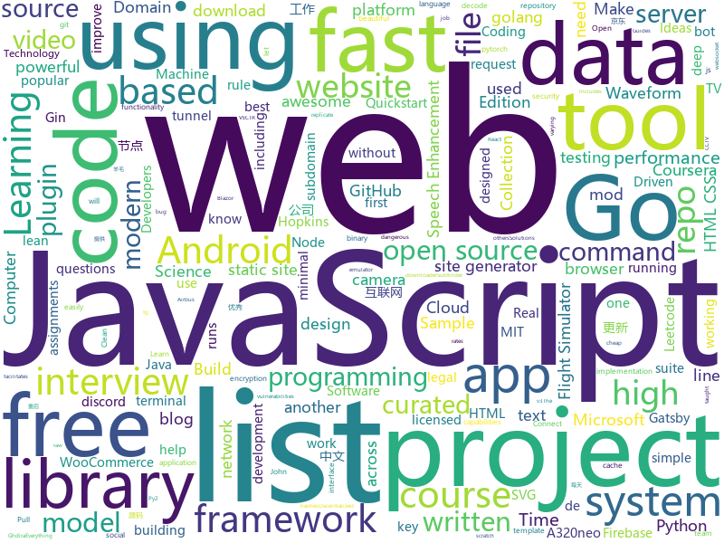

# 2020-09-07
See what the GitHub community is most excited about.

## python
+ [Ciphey](https://github.com/Ciphey/Ciphey)(**165 stars today**): Automatically decode encryptions without a key, decode encodings, and crack hashes
+ [hivemind](https://github.com/learning-at-home/hivemind)(**168 stars today**): Decentralized deep learning framework in pytorch. Built to train models on thousands of volunteers across the world.
+ [autoscraper](https://github.com/alirezamika/autoscraper)(**528 stars today**): A Smart, Automatic, Fast and Lightweight Web Scraper for Python
+ [spleeter](https://github.com/deezer/spleeter)(**10 stars today**): Deezer source separation library including pretrained models.
+ [youtube-dl](https://github.com/ytdl-org/youtube-dl)(**35 stars today**): Command-line program to download videos from YouTube.com and other video sites
+ [bitcoinbook](https://github.com/bitcoinbook/bitcoinbook)(**5 stars today**): Mastering Bitcoin 2nd Edition - Programming the Open Blockchain
+ [qiling](https://github.com/qilingframework/qiling)(**17 stars today**): Qiling Advanced Binary Emulation Framework
+ [rich](https://github.com/willmcgugan/rich)(**43 stars today**): Rich is a Python library for rich text and beautiful formatting in the terminal.
+ [gibMacOS](https://github.com/corpnewt/gibMacOS)(**8 stars today**): Py2/py3 script that can download macOS components direct from Apple
+ [OctoPrint](https://github.com/OctoPrint/OctoPrint)(**5 stars today**): OctoPrint is the snappy web interface for your 3D printer!
+ [keras](https://github.com/keras-team/keras)(**120 stars today**): Deep Learning for humans
+ [meshroom](https://github.com/alicevision/meshroom)(**7 stars today**): 3D Reconstruction Software
+ [capa](https://github.com/fireeye/capa)(**21 stars today**): The FLARE team's open-source tool to identify capabilities in executable files.
+ [Python](https://github.com/geekcomputers/Python)(**11 stars today**): My Python Examples
+ [scikit-learn](https://github.com/scikit-learn/scikit-learn)(**12 stars today**): scikit-learn: machine learning in Python
+ [awesome-honeypots](https://github.com/paralax/awesome-honeypots)(**11 stars today**): an awesome list of honeypot resources
+ [denoiser](https://github.com/facebookresearch/denoiser)(**17 stars today**): Real Time Speech Enhancement in the Waveform Domain (Interspeech 2020)We provide a PyTorch implementation of the paper Real Time Speech Enhancement in the Waveform Domain. In which, we present a causal speech enhancement model working on the raw waveform that runs in real-time on a laptop CPU. The proposed model is based on an encoder-decoder ar…
+ [system-design-primer](https://github.com/donnemartin/system-design-primer)(**82 stars today**): Learn how to design large-scale systems. Prep for the system design interview. Includes Anki flashcards.
+ [Cam-Hackers](https://github.com/AngelSecurityTeam/Cam-Hackers)(**3 stars today**): Hack Cameras CCTV FREE
+ [SpotiByeBye](https://github.com/SakDev/SpotiByeBye)(**9 stars today**): 
+ [wp-file-manager-0day](https://github.com/w4fz5uck5/wp-file-manager-0day)(**16 stars today**): wp-file-manager 6.7 (Aug 2020) Wordpress Plugin 0day - Remote Code Execution
+ [prefect](https://github.com/PrefectHQ/prefect)(**25 stars today**): The easiest way to automate your data
+ [sherlock](https://github.com/sherlock-project/sherlock)(**32 stars today**): 🔎Hunt down social media accounts by username across social networks
+ [faceswap](https://github.com/deepfakes/faceswap)(**25 stars today**): Deepfakes Software For All
+ [TecoGAN](https://github.com/thunil/TecoGAN)(**16 stars today**): This repo will contain source code and materials for the TecoGAN project, i.e. code for a TEmporally COherent GAN

## java
+ [jdk](https://github.com/openjdk/jdk)(**250 stars today**): JDK main-line development
+ [GitHub-Chinese-Top-Charts](https://github.com/kon9chunkit/GitHub-Chinese-Top-Charts)(**26 stars today**): 🇨🇳GitHub中文排行榜，帮助你发现高分优秀中文项目、更高效地吸收国人的优秀经验成果；榜单每周更新一次，敬请关注！
+ [Algorithms](https://github.com/williamfiset/Algorithms)(**16 stars today**): A collection of algorithms and data structures
+ [termux-app](https://github.com/termux/termux-app)(**7 stars today**): Android terminal and Linux environment - app repository.
+ [QNotified](https://github.com/cinit/QNotified)(**5 stars today**): QQ辅助性功能增强
+ [sodium-fabric](https://github.com/jellysquid3/sodium-fabric)(**10 stars today**): A Fabric mod designed to improve frame rates and reduce micro-stutter
+ [hydrogen-fabric](https://github.com/jellysquid3/hydrogen-fabric)(**5 stars today**): Things of which are too dangerous to put in Lithium.
+ [Signal-Android](https://github.com/signalapp/Signal-Android)(**4 stars today**): A private messenger for Android.
+ [FairEmail](https://github.com/M66B/FairEmail)(**3 stars today**): Fully featured, open source, privacy friendly email app for Android
+ [springBoot](https://github.com/527515025/springBoot)(**2 stars today**): springboot 框架与其它组件结合如 jpa、mybatis、websocket、security、shiro、cache等
+ [AngryGhidra](https://github.com/Nalen98/AngryGhidra)(**30 stars today**): Angr plugin for Ghdira
+ [interviews](https://github.com/kdn251/interviews)(**30 stars today**): Everything you need to know to get the job.
+ [quickstart-android](https://github.com/firebase/quickstart-android)(**3 stars today**): Firebase Quickstart Samples for Android
+ [MockLocationDetector](https://github.com/smarques84/MockLocationDetector)(**2 stars today**): An android library to help detect mock locations
+ [tsunami-security-scanner](https://github.com/google/tsunami-security-scanner)(**6 stars today**): Tsunami is a general purpose network security scanner with an extensible plugin system for detecting high severity vulnerabilities with high confidence.
+ [androrat](https://github.com/wszf/androrat)(**0 stars today**): androrat
+ [ripme](https://github.com/RipMeApp/ripme)(**2 stars today**): Downloads albums in bulk
+ [CS-Notes](https://github.com/CyC2018/CS-Notes)(**116 stars today**): 📚技术面试必备基础知识、Leetcode、计算机操作系统、计算机网络、系统设计、Java、Python、C++
+ [Anistream-Mobile](https://github.com/Anistream/Anistream-Mobile)(**2 stars today**): This app lets you watch anime with no ads
+ [CtCI-6th-Edition](https://github.com/careercup/CtCI-6th-Edition)(**10 stars today**): Cracking the Coding Interview 6th Ed. Solutions
+ [sqli](https://github.com/x-ream/sqli)(**108 stars today**): Simple sql interface, Criteria, CriteriaBuilder
+ [MCreator](https://github.com/MCreator/MCreator)(**5 stars today**): MCreator is a software used to make Minecraft Java Edition mods, Bedrock Edition Add-Ons, and data packs using visual graphical programming or integrated IDE.
+ [megabasterd](https://github.com/tonikelope/megabasterd)(**1 stars today**): Yet another unofficial (and ugly) cross-platform MEGA downloader/uploader/streaming suite.
+ [tech-interview-for-developer](https://github.com/gyoogle/tech-interview-for-developer)(**7 stars today**): 👶🏻 신입 개발자 전공 지식 & 기술 면접 백과사전📖
+ [antlr4](https://github.com/antlr/antlr4)(**5 stars today**): ANTLR (ANother Tool for Language Recognition) is a powerful parser generator for reading, processing, executing, or translating structured text or binary files.

## unknown
+ [awesome-project-ideas](https://github.com/NirantK/awesome-project-ideas)(**76 stars today**): Curated list of Machine Learning, NLP, Vision, Recommender Systems Project Ideas
+ [free](https://github.com/du5/free)(**11 stars today**): 
+ [Interview_Question_for_Beginner](https://github.com/JaeYeopHan/Interview_Question_for_Beginner)(**20 stars today**): 👦👧Technical-Interview guidelines written for those who started studying programming. I wish you all the best.👾
+ [data-engineer-roadmap](https://github.com/datastacktv/data-engineer-roadmap)(**436 stars today**): Roadmap to becoming a data engineer in 2020
+ [computer-science](https://github.com/ossu/computer-science)(**47 stars today**): 🎓Path to a free self-taught education in Computer Science!
+ [awesome-interview-questions](https://github.com/MaximAbramchuck/awesome-interview-questions)(**162 stars today**): A curated awesome list of lists of interview questions. Feel free to contribute!🎓
+ [BUPT-SCS-Courses](https://github.com/Oneliey/BUPT-SCS-Courses)(**17 stars today**): 巴普特计院选修课指北
+ [VECTR](https://github.com/SecurityRiskAdvisors/VECTR)(**10 stars today**): VECTR is a tool that facilitates tracking of your red and blue team testing activities to measure detection and prevention capabilities across different attack scenarios
+ [src](https://github.com/kiwibrowser/src)(**7 stars today**): Source-code used in Kiwi Browser for Android (up to date)
+ [Projects](https://github.com/karan/Projects)(**22 stars today**): 📃A list of practical projects that anyone can solve in any programming language.
+ [system-design-interview](https://github.com/checkcheckzz/system-design-interview)(**18 stars today**): System design interview for IT companies
+ [955.WLB](https://github.com/formulahendry/955.WLB)(**27 stars today**): 955 不加班的公司名单 - 工作 955，work–life balance (工作与生活的平衡)
+ [build-your-own-x](https://github.com/danistefanovic/build-your-own-x)(**203 stars today**): 🤓Build your own (insert technology here)
+ [LeetcodeTop](https://github.com/afatcoder/LeetcodeTop)(**64 stars today**): 汇总各大互联网公司容易考察的高频leetcode题🔥
+ [C152X](https://github.com/DRF30q/C152X)(**15 stars today**): C152 Realism Mod for Flight Simulator 2020
+ [Free-Certifications](https://github.com/cloudcommunity/Free-Certifications)(**7 stars today**): Curated list of free courses & certifications
+ [1](https://github.com/1XNM/1)(**6 stars today**): 直播平台回家页
+ [You-Dont-Know-JS](https://github.com/getify/You-Dont-Know-JS)(**34 stars today**): A book series on JavaScript. @YDKJS on twitter.
+ [android_guides](https://github.com/codepath/android_guides)(**4 stars today**): Extensive Open-Source Guides for Android Developers
+ [awesome-blazor](https://github.com/AdrienTorris/awesome-blazor)(**10 stars today**): Resources for Blazor, a .NET web framework using C#/Razor and HTML that runs in the browser with WebAssembly.
+ [TDTChannels](https://github.com/LaQuay/TDTChannels)(**2 stars today**): Listado de Canales de TV (TDT) en abierto, 100% legal, 100% gratuito // Spanish TV Channels, 100% legal, 100% free
+ [awesome-mlops](https://github.com/visenger/awesome-mlops)(**9 stars today**): A curated list of references for MLOps
+ [ClashForAndroid](https://github.com/Kr328/ClashForAndroid)(**15 stars today**): A rule-based tunnel for Android.
+ [app-ideas](https://github.com/florinpop17/app-ideas)(**44 stars today**): A Collection of application ideas which can be used to improve your coding skills.
+ [pikvm](https://github.com/pikvm/pikvm)(**46 stars today**): Open and cheap DIY IP-KVM based on Raspberry Pi

## javascript
+ [eleventy-high-performance-blog](https://github.com/google/eleventy-high-performance-blog)(**72 stars today**): A high performance blog template for the 11ty static site generator.
+ [a32nx](https://github.com/flybywiresim/a32nx)(**108 stars today**): The A32NX Project is a community driven open source project to create a free Airbus A320neo in Microsoft Flight Simulator that is as close to reality as possible. It aims to enhance the default A320neo by improving the systems depth and functionality to bring it up to payware-level, all for free.
+ [30-seconds-of-code](https://github.com/30-seconds/30-seconds-of-code)(**538 stars today**): Short JavaScript code snippets for all your development needs
+ [javascript-testing-best-practices](https://github.com/goldbergyoni/javascript-testing-best-practices)(**58 stars today**): 📗🌐🚢Comprehensive and exhaustive JavaScript & Node.js testing best practices (July 2020)
+ [talk](https://github.com/vasanthv/talk)(**92 stars today**): A group video call for the web. No signups. No downloads.
+ [uBlock](https://github.com/gorhill/uBlock)(**16 stars today**): uBlock Origin - An efficient blocker for Chromium and Firefox. Fast and lean.
+ [clean-code-javascript](https://github.com/ryanmcdermott/clean-code-javascript)(**20 stars today**): 🛁Clean Code concepts adapted for JavaScript
+ [moon](https://github.com/kbrsh/moon)(**110 stars today**): 🌙The minimal & fast library for functional user interfaces
+ [gbajs2](https://github.com/andychase/gbajs2)(**25 stars today**): gbajs2 is a Game Boy Advance emulator written in Javascript from scratch using HTML5 technologies like Canvas and Web Audio. It is freely licensed and works in any modern browser without plugins.
+ [gatsby-woocommerce-themes](https://github.com/imranhsayed/gatsby-woocommerce-themes)(**13 stars today**): A Gatsby Theme for WooCommerce E-commerce site Gatsby WooCommerce WordPress
+ [create-react-app](https://github.com/facebook/create-react-app)(**29 stars today**): Set up a modern web app by running one command.
+ [gatsby](https://github.com/gatsbyjs/gatsby)(**18 stars today**): Build blazing fast, modern apps and websites with React
+ [fullstack-course4](https://github.com/jhu-ep-coursera/fullstack-course4)(**21 stars today**): Example code for HTML, CSS, and Javascript for Web Developers Coursera Course
+ [stackoverflow-clone](https://github.com/salihozdemir/stackoverflow-clone)(**114 stars today**): This project is a simplified a full stack clone of Stackoverflow.
+ [functions-samples](https://github.com/firebase/functions-samples)(**5 stars today**): Collection of sample apps showcasing popular use cases using Cloud Functions for Firebase
+ [eleventy](https://github.com/11ty/eleventy)(**18 stars today**): A simpler static site generator. An alternative to Jekyll. Transforms a directory of templates (of varying types) into HTML.
+ [bootstrap](https://github.com/twbs/bootstrap)(**25 stars today**): The most popular HTML, CSS, and JavaScript framework for developing responsive, mobile first projects on the web.
+ [webogram](https://github.com/zhukov/webogram)(**6 stars today**): Telegram web application, GPL v3
+ [Face-Detection-JavaScript](https://github.com/WebDevSimplified/Face-Detection-JavaScript)(**7 stars today**): 
+ [next.js](https://github.com/vercel/next.js)(**47 stars today**): The React Framework
+ [web3.js](https://github.com/ethereum/web3.js)(**3 stars today**): Ethereum JavaScript API
+ [discord.js](https://github.com/discordjs/discord.js)(**13 stars today**): A powerful JavaScript library for interacting with the Discord API
+ [shields](https://github.com/badges/shields)(**12 stars today**): Concise, consistent, and legible badges in SVG and raster format
+ [scripts](https://github.com/lxk0301/scripts)(**7 stars today**): 京东薅羊毛工具（活动入口：京东app->我的->游戏与互动->查看更多）
+ [redash](https://github.com/getredash/redash)(**6 stars today**): Make Your Company Data Driven. Connect to any data source, easily visualize, dashboard and share your data.

## html
+ [Server](https://github.com/PanDownloadServer/Server)(**172 stars today**): PanDownload的个人维护版本
+ [wowchemy-hugo-modules](https://github.com/wowchemy/wowchemy-hugo-modules)(**8 stars today**): 📝The website builder for Hugo. Build and deploy a beautiful website in minutes!
+ [zphisher](https://github.com/htr-tech/zphisher)(**6 stars today**): Automated Phishing Tool
+ [learning-area](https://github.com/mdn/learning-area)(**2 stars today**): Github repo for the MDN Learning Area.
+ [eleventy-base-blog](https://github.com/11ty/eleventy-base-blog)(**2 stars today**): A starter repository for a blog web site using the Eleventy static site generator.
+ [18S191](https://github.com/mitmath/18S191)(**165 stars today**): Course 18.S191 at MIT, fall 2020 - Introduction to computational thinking with Julia:
+ [Hacktoberfest2020](https://github.com/OpenSouceCode/Hacktoberfest2020)(**20 stars today**): Make your first Pull Request and earn a free tee from GitHub!
+ [REKCARC-TSC-UHT](https://github.com/PKUanonym/REKCARC-TSC-UHT)(**9 stars today**): 清华大学计算机系课程攻略 Guidance for courses in Department of Computer Science and Technology, Tsinghua University
+ [github-markdown-css](https://github.com/sindresorhus/github-markdown-css)(**5 stars today**): The minimal amount of CSS to replicate the GitHub Markdown style
+ [datasciencecoursera](https://github.com/mGalarnyk/datasciencecoursera)(**4 stars today**): Data Science Repo and blog for John Hopkins Coursera Courses. Please let me know if you have any questions.
+ [tabler-icons](https://github.com/tabler/tabler-icons)(**9 stars today**): A set of over 700 free MIT-licensed high-quality SVG icons for you to use in your web projects.
+ [B787-XE](https://github.com/lmk02/B787-XE)(**6 stars today**): A modification of the Microsoft Flightsimulator 2020 787-10
+ [docker-development-youtube-series](https://github.com/marcel-dempers/docker-development-youtube-series)(**2 stars today**): 
+ [CamPhish](https://github.com/techchipnet/CamPhish)(**3 stars today**): Grab cam shots from target's phone front camera or PC webcam just sending a link.
+ [fluxion](https://github.com/FluxionNetwork/fluxion)(**1 stars today**): Fluxion is a remake of linset by vk496 with enhanced functionality.
+ [awesome-piracy](https://github.com/Igglybuff/awesome-piracy)(**8 stars today**): A curated list of awesome warez and piracy links
+ [yi-hack-MStar](https://github.com/roleoroleo/yi-hack-MStar)(**3 stars today**): Custom firmware for Yi 1080p camera based on MStar platform
+ [zenbot](https://github.com/DeviaVir/zenbot)(**1 stars today**): Zenbot is a command-line cryptocurrency trading bot using Node.js and MongoDB.
+ [openwrt-packages](https://github.com/liuran001/openwrt-packages)(**3 stars today**): 国内常用OpenWrt软件包源码合集，每天自动更新，建议使用lean源码
+ [text-to-handwriting](https://github.com/saurabhdaware/text-to-handwriting)(**25 stars today**): So your teacher asked you to upload written assignments? Hate writing assigments? This tool will help you convert your text to handwriting xD
+ [wpt](https://github.com/web-platform-tests/wpt)(**1 stars today**): Test suites for Web platform specs — including WHATWG, W3C, and others
+ [Coursera_HTML-CSS-Javascript-for-Web-Developers](https://github.com/goggle/Coursera_HTML-CSS-Javascript-for-Web-Developers)(**0 stars today**): Solutions to the assignments of the Coursera course "HTML, CSS, and Javascript for Web Developers" by Johns Hopkins University.
+ [discord-bot-client](https://github.com/Flam3rboy/discord-bot-client)(**5 stars today**): A custom version of discord, with bot login support
+ [patchwork](https://github.com/jlord/patchwork)(**1 stars today**): All the Git-it Workshop completers!
+ [quickstart-js](https://github.com/firebase/quickstart-js)(**2 stars today**): Firebase Quickstart Samples for Web

## go
+ [croc](https://github.com/schollz/croc)(**481 stars today**): Easily and securely send things from one computer to another🐊📦
+ [clash](https://github.com/Dreamacro/clash)(**29 stars today**): A rule-based tunnel in Go.
+ [goreleaser](https://github.com/goreleaser/goreleaser)(**7 stars today**): Deliver Go binaries as fast and easily as possible
+ [nats-server](https://github.com/nats-io/nats-server)(**5 stars today**): High-Performance server for NATS, the cloud native messaging system.
+ [v2ray-core](https://github.com/v2ray/v2ray-core)(**37 stars today**): A platform for building proxies to bypass network restrictions.
+ [go-cqhttp](https://github.com/Mrs4s/go-cqhttp)(**6 stars today**): cqhttp的golang实现，轻量、原生跨平台.
+ [gin](https://github.com/gin-gonic/gin)(**34 stars today**): Gin is a HTTP web framework written in Go (Golang). It features a Martini-like API with much better performance -- up to 40 times faster. If you need smashing performance, get yourself some Gin.
+ [gops](https://github.com/google/gops)(**23 stars today**): A tool to list and diagnose Go processes currently running on your system
+ [syncthing](https://github.com/syncthing/syncthing)(**24 stars today**): Open Source Continuous File Synchronization
+ [httprobe](https://github.com/tomnomnom/httprobe)(**4 stars today**): Take a list of domains and probe for working HTTP and HTTPS servers
+ [proxypool](https://github.com/zu1k/proxypool)(**13 stars today**): 自动抓取tg频道、订阅地址、公开互联网上的ss、ssr、vmess、trojan节点信息，聚合去重后提供节点列表，每15分钟更新
+ [prysm](https://github.com/prysmaticlabs/prysm)(**2 stars today**): Go implementation of the Ethereum 2.0 blockchain
+ [esbuild](https://github.com/evanw/esbuild)(**19 stars today**): An extremely fast JavaScript bundler and minifier
+ [webify](https://github.com/beefsack/webify)(**116 stars today**): Turn shell commands into web services
+ [age](https://github.com/FiloSottile/age)(**61 stars today**): A simple, modern and secure encryption tool (and Go library) with small explicit keys, no config options, and UNIX-style composability.
+ [gitleaks](https://github.com/zricethezav/gitleaks)(**58 stars today**): Scan git repos for secrets using regex and entropy🔑
+ [isucon9-qualify](https://github.com/isucon/isucon9-qualify)(**0 stars today**): ISUCON9予選
+ [AdGuardHome](https://github.com/AdguardTeam/AdGuardHome)(**7 stars today**): Network-wide ads & trackers blocking DNS server
+ [annie](https://github.com/iawia002/annie)(**10 stars today**): 👾Fast, simple and clean video downloader
+ [subfinder](https://github.com/projectdiscovery/subfinder)(**5 stars today**): Subfinder is a subdomain discovery tool that discovers valid subdomains for websites. Designed as a passive framework to be useful for bug bounties and safe for penetration testing.
+ [freecache](https://github.com/coocood/freecache)(**4 stars today**): A cache library for Go with zero GC overhead.
+ [infracost](https://github.com/infracost/infracost)(**49 stars today**): Cloud cost estimates for Terraform in your CLI and pull requests💰📉
+ [f1viewer](https://github.com/SoMuchForSubtlety/f1viewer)(**3 stars today**): 🏎️TUI for F1TV
+ [mux](https://github.com/gorilla/mux)(**10 stars today**): A powerful HTTP router and URL matcher for building Go web servers with🦍
+ [msfs2020-go](https://github.com/lian/msfs2020-go)(**8 stars today**): connect to microsoft flight simulator 2020 using golang

## WordCloud

