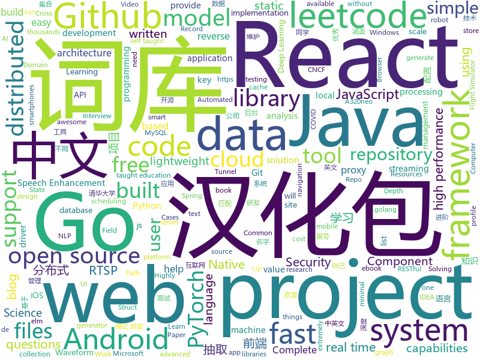

# 2020-09-08
See what the GitHub community is most excited about.

## python
+ [pytorch-lightning](https://github.com/PyTorchLightning/pytorch-lightning)(**60 stars today**): The lightweight PyTorch wrapper for high-performance AI research. Scale your models, not the boilerplate.
+ [ultimate-python](https://github.com/huangsam/ultimate-python)(**605 stars today**): Ultimate Python study guide for newcomers and professionals alike.🐍🐍🐍
+ [diagrams](https://github.com/mingrammer/diagrams)(**9 stars today**): 🎨Diagram as Code for prototyping cloud system architectures
+ [funNLP](https://github.com/fighting41love/funNLP)(**114 stars today**): 中英文敏感词、语言检测、中外手机/电话归属地/运营商查询、名字推断性别、手机号抽取、身份证抽取、邮箱抽取、中日文人名库、中文缩写库、拆字词典、词汇情感值、停用词、反动词表、暴恐词表、繁简体转换、英文模拟中文发音、汪峰歌词生成器、职业名称词库、同义词库、反义词库、否定词库、汽车品牌词库、汽车零件词库、连续英文切割、各种中文词向量、公司名字大全、古诗词库、IT词库、财经词库、成语词库、地名词库、历史名人词库、诗词词库、医学词库、饮食词库、法律词库、汽车词库、动物词库、中文聊天语料、中文谣言数据、百度中文问答数据集、句子相似度匹配算法集合、bert资源、文本生成&摘要相关工具、cocoNLP信息抽取工具、国内电话号码正则匹配、清华大学XLORE:中英文跨语言百科知识图谱、清华大学人工智能技术…
+ [autoscraper](https://github.com/alirezamika/autoscraper)(**287 stars today**): A Smart, Automatic, Fast and Lightweight Web Scraper for Python
+ [iOS-DeviceSupport](https://github.com/iGhibli/iOS-DeviceSupport)(**16 stars today**): This repository holds the device support files for the iOS, and I will update it regularly.
+ [AiLearning](https://github.com/apachecn/AiLearning)(**16 stars today**): AiLearning: 机器学习 - MachineLearning - ML、深度学习 - DeepLearning - DL、自然语言处理 NLP
+ [Ciphey](https://github.com/Ciphey/Ciphey)(**357 stars today**): ⚡Automatically decrypt encryptions without knowing the key or cipher, decode encodings, and crack hashes⚡
+ [keras](https://github.com/keras-team/keras)(**81 stars today**): Deep Learning for humans
+ [hivemind](https://github.com/learning-at-home/hivemind)(**144 stars today**): Decentralized deep learning framework in pytorch. Built to train models on thousands of volunteers across the world.
+ [PyTorch-BigGraph](https://github.com/facebookresearch/PyTorch-BigGraph)(**32 stars today**): Generate embeddings from large-scale graph-structured data.
+ [DAIN](https://github.com/baowenbo/DAIN)(**42 stars today**): Depth-Aware Video Frame Interpolation (CVPR 2019)
+ [celery](https://github.com/celery/celery)(**21 stars today**): Distributed Task Queue (development branch)
+ [capa](https://github.com/fireeye/capa)(**46 stars today**): The FLARE team's open-source tool to identify capabilities in executable files.
+ [core](https://github.com/home-assistant/core)(**33 stars today**): 🏡Open source home automation that puts local control and privacy first
+ [Wav2Lip](https://github.com/Rudrabha/Wav2Lip)(**134 stars today**): This repository contains the codes of "A Lip Sync Expert Is All You Need for Speech to Lip Generation In the Wild", published at ACM Multimedia 2020.
+ [h4cker](https://github.com/The-Art-of-Hacking/h4cker)(**18 stars today**): This repository is primarily maintained by Omar Santos and includes thousands of resources related to ethical hacking / penetration testing, digital forensics and incident response (DFIR), vulnerability research, exploit development, reverse engineering, and more.
+ [proxy_pool](https://github.com/jhao104/proxy_pool)(**15 stars today**): Python爬虫代理IP池(proxy pool)
+ [denoiser](https://github.com/facebookresearch/denoiser)(**23 stars today**): Real Time Speech Enhancement in the Waveform Domain (Interspeech 2020)We provide a PyTorch implementation of the paper Real Time Speech Enhancement in the Waveform Domain. In which, we present a causal speech enhancement model working on the raw waveform that runs in real-time on a laptop CPU. The proposed model is based on an encoder-decoder ar…
+ [transformers](https://github.com/huggingface/transformers)(**78 stars today**): 🤗Transformers: State-of-the-art Natural Language Processing for Pytorch and TensorFlow 2.0.
+ [open_model_zoo](https://github.com/openvinotoolkit/open_model_zoo)(**5 stars today**): Pre-trained Deep Learning models and samples (high quality and extremely fast)
+ [PyTorch_YOLOv4](https://github.com/WongKinYiu/PyTorch_YOLOv4)(**10 stars today**): PyTorch implementation of YOLOv4
+ [Mobile-Security-Framework-MobSF](https://github.com/MobSF/Mobile-Security-Framework-MobSF)(**13 stars today**): Mobile Security Framework (MobSF) is an automated, all-in-one mobile application (Android/iOS/Windows) pen-testing, malware analysis and security assessment framework capable of performing static and dynamic analysis.
+ [qiling](https://github.com/qilingframework/qiling)(**22 stars today**): Qiling Advanced Binary Emulation Framework
+ [python-for-coding-test](https://github.com/ndb796/python-for-coding-test)(**2 stars today**): [한빛미디어] "이것이 취업을 위한 코딩 테스트다 with 파이썬" 전체 소스코드 저장소입니다.

## java
+ [jdk](https://github.com/openjdk/jdk)(**384 stars today**): JDK main-line development
+ [Algorithms](https://github.com/williamfiset/Algorithms)(**26 stars today**): A collection of algorithms and data structures
+ [incubator-dolphinscheduler](https://github.com/apache/incubator-dolphinscheduler)(**24 stars today**): Dolphin Scheduler is a distributed and easy-to-extend visual workflow scheduling platform, dedicated to solving the complex dependencies in data processing, making the scheduling system out of the box for data processing.(分布式易扩展的可视化工作流任务调度)
+ [LeetCodeAnimation](https://github.com/MisterBooo/LeetCodeAnimation)(**59 stars today**): Demonstrate all the questions on LeetCode in the form of animation.（用动画的形式呈现解LeetCode题目的思路）
+ [CS-Notes](https://github.com/CyC2018/CS-Notes)(**103 stars today**): 📚技术面试必备基础知识、Leetcode、计算机操作系统、计算机网络、系统设计、Java、Python、C++
+ [GitHub-Chinese-Top-Charts](https://github.com/kon9chunkit/GitHub-Chinese-Top-Charts)(**58 stars today**): 🇨🇳GitHub中文排行榜，帮助你发现高分优秀中文项目、更高效地吸收国人的优秀经验成果；榜单每周更新一次，敬请关注！
+ [springfox](https://github.com/springfox/springfox)(**3 stars today**): Automated JSON API documentation for API's built with Spring
+ [Mapper](https://github.com/abel533/Mapper)(**13 stars today**): Mybatis Common Mapper - Easy to use
+ [flink](https://github.com/apache/flink)(**28 stars today**): Apache Flink
+ [advanced-java](https://github.com/doocs/advanced-java)(**76 stars today**): 😮互联网 Java 工程师进阶知识完全扫盲：涵盖高并发、分布式、高可用、微服务、海量数据处理等领域知识，后端同学必看，前端同学也可学习
+ [traccar](https://github.com/traccar/traccar)(**4 stars today**): Traccar GPS Tracking System
+ [SpringCloudLearning](https://github.com/forezp/SpringCloudLearning)(**15 stars today**): 《史上最简单的Spring Cloud教程源码》
+ [OpenBot](https://github.com/intel-isl/OpenBot)(**61 stars today**): OpenBot leverages smartphones as brains for low-cost robots. We have designed a small electric vehicle that costs about $50 and serves as a robot body. Our software stack for Android smartphones supports advanced robotics workloads such as person following and real-time autonomous navigation.
+ [tutorials](https://github.com/eugenp/tutorials)(**24 stars today**): Just Announced - "Learn Spring Security OAuth":
+ [apollo](https://github.com/ctripcorp/apollo)(**29 stars today**): Apollo（阿波罗）是携程框架部门研发的分布式配置中心，能够集中化管理应用不同环境、不同集群的配置，配置修改后能够实时推送到应用端，并且具备规范的权限、流程治理等特性，适用于微服务配置管理场景。
+ [react-native-push-notification](https://github.com/zo0r/react-native-push-notification)(**4 stars today**): React Native Local and Remote Notifications
+ [testcontainers-java](https://github.com/testcontainers/testcontainers-java)(**5 stars today**): Testcontainers is a Java library that supports JUnit tests, providing lightweight, throwaway instances of common databases, Selenium web browsers, or anything else that can run in a Docker container.
+ [react-native-navigation](https://github.com/wix/react-native-navigation)(**2 stars today**): A complete native navigation solution for React Native
+ [maven](https://github.com/apache/maven)(**0 stars today**): Apache Maven core
+ [DataX](https://github.com/alibaba/DataX)(**21 stars today**): 
+ [seata](https://github.com/seata/seata)(**23 stars today**): 🔥Seata is an easy-to-use, high-performance, open source distributed transaction solution.
+ [Signal-Android](https://github.com/signalapp/Signal-Android)(**10 stars today**): A private messenger for Android.
+ [server](https://github.com/wildfirechat/server)(**7 stars today**): 即时通讯(IM)系统
+ [react-native-keychain](https://github.com/oblador/react-native-keychain)(**4 stars today**): 🔑Keychain Access for React Native
+ [spring-framework](https://github.com/spring-projects/spring-framework)(**25 stars today**): Spring Framework

## unknown
+ [applied-ml](https://github.com/eugeneyan/applied-ml)(**182 stars today**): 📚Papers & articles of companies sharing their work on applied data science & machine learning.
+ [DescomplicandoKubernetes](https://github.com/badtuxx/DescomplicandoKubernetes)(**79 stars today**): 
+ [computer-science](https://github.com/ossu/computer-science)(**185 stars today**): 🎓Path to a free self-taught education in Computer Science!
+ [awesome-production-machine-learning](https://github.com/EthicalML/awesome-production-machine-learning)(**67 stars today**): A curated list of awesome open source libraries to deploy, monitor, version and scale your machine learning
+ [awesome-project-ideas](https://github.com/NirantK/awesome-project-ideas)(**240 stars today**): Curated list of Machine Learning, NLP, Vision, Recommender Systems Project Ideas
+ [LeetcodeTop](https://github.com/afatcoder/LeetcodeTop)(**68 stars today**): 汇总各大互联网公司容易考察的高频leetcode题🔥
+ [Interview_Question_for_Beginner](https://github.com/JaeYeopHan/Interview_Question_for_Beginner)(**87 stars today**): 👦👧Technical-Interview guidelines written for those who started studying programming. I wish you all the best.👾
+ [free](https://github.com/du5/free)(**15 stars today**): 
+ [data-science](https://github.com/ossu/data-science)(**17 stars today**): 📊Path to a free self-taught education in Data Science!
+ [Learn-Vim](https://github.com/iggredible/Learn-Vim)(**273 stars today**): A book for learning the Vim editor the smart way.
+ [Dictionary-Of-Pentesting](https://github.com/insightglacier/Dictionary-Of-Pentesting)(**75 stars today**): 渗透测试、SRC漏洞挖掘、爆破、Fuzzing等字典收集项目
+ [systems-design](https://github.com/OpesanyaAdebayo/systems-design)(**55 stars today**): All things systems design. Resources, Interview questions, e.t.c
+ [C152X](https://github.com/DRF30q/C152X)(**18 stars today**): C152 Realism Mod for Flight Simulator 2020
+ [awesome-java](https://github.com/Snailclimb/awesome-java)(**13 stars today**): Collection of awesome Java project on Github(Github 上非常棒的 Java 开源项目集合).
+ [gdshare](https://github.com/iwestlin/gdshare)(**27 stars today**): 
+ [JavaFamily](https://github.com/AobingJava/JavaFamily)(**70 stars today**): 【Java面试+Java学习指南】 一份涵盖大部分Java程序员所需要掌握的核心知识。
+ [COVID-19](https://github.com/CSSEGISandData/COVID-19)(**14 stars today**): Novel Coronavirus (COVID-19) Cases, provided by JHU CSSE
+ [leetcode_company_wise_questions](https://github.com/MysteryVaibhav/leetcode_company_wise_questions)(**71 stars today**): This is a repository containing the list of company wise questions available on leetcode premium
+ [src](https://github.com/kiwibrowser/src)(**9 stars today**): Source-code used in Kiwi Browser for Android (up to date)
+ [NewGrad-2021](https://github.com/Pitt-CSC/NewGrad-2021)(**27 stars today**): A collection of New Grad full time roles in SWE, Quant, and PM.
+ [IntelliJ-IDEA-2020.2.1-solve](https://github.com/shipofsea/IntelliJ-IDEA-2020.2.1-solve)(**14 stars today**): 
+ [iPhoneOSDeviceSupport](https://github.com/filsv/iPhoneOSDeviceSupport)(**20 stars today**): Xcode iPhoneOS DeviceSupport files (6.0 - 14.0)
+ [mentoring](https://github.com/cncf/mentoring)(**3 stars today**): 👩🏿‍🎓👨🏽‍🎓👩🏻‍🎓CNCF Mentoring + CommunityBridge + Summer of Code
+ [ue4-style-guide](https://github.com/Allar/ue4-style-guide)(**7 stars today**): An attempt to make Unreal Engine 4 projects more consistent
+ [tessdata](https://github.com/tesseract-ocr/tessdata)(**10 stars today**): Trained models with support for legacy and LSTM OCR engine

## javascript
+ [eleventy-high-performance-blog](https://github.com/google/eleventy-high-performance-blog)(**119 stars today**): A high performance blog template for the 11ty static site generator.
+ [a32nx](https://github.com/flybywiresim/a32nx)(**112 stars today**): The A32NX Project is a community driven open source project to create a free Airbus A320neo in Microsoft Flight Simulator that is as close to reality as possible. It aims to enhance the default A320neo by improving the systems depth and functionality to bring it up to payware-level, all for free.
+ [moon](https://github.com/kbrsh/moon)(**257 stars today**): 🌙The minimal & fast library for functional user interfaces
+ [leetcode](https://github.com/azl397985856/leetcode)(**39 stars today**): LeetCode Solutions: A Record of My Problem Solving Journey.( leetcode题解，记录自己的leetcode解题之路。)
+ [vue-admin-template](https://github.com/PanJiaChen/vue-admin-template)(**23 stars today**): a vue2.0 minimal admin template
+ [joplin](https://github.com/laurent22/joplin)(**16 stars today**): Joplin - an open source note taking and to-do application with synchronization capabilities for Windows, macOS, Linux, Android and iOS. Forum: https://discourse.joplinapp.org/
+ [next.js](https://github.com/vercel/next.js)(**56 stars today**): The React Framework
+ [complete-javascript-course](https://github.com/jonasschmedtmann/complete-javascript-course)(**8 stars today**): Starter files, final projects and FAQ for my Complete JavaScript course
+ [vanillawebprojects](https://github.com/bradtraversy/vanillawebprojects)(**87 stars today**): Mini projects built with HTML5, CSS & JavaScript. No frameworks or libraries
+ [brain.js](https://github.com/BrainJS/brain.js)(**24 stars today**): 🤖Neural networks in JavaScript
+ [talk](https://github.com/vasanthv/talk)(**123 stars today**): A group video call for the web. No signups. No downloads.
+ [junior-recruit-scheduler](https://github.com/jojoldu/junior-recruit-scheduler)(**17 stars today**): 주니어 개발자 채용 정보
+ [Recoil](https://github.com/facebookexperimental/Recoil)(**41 stars today**): Recoil is an experimental state management library for React apps. It provides several capabilities that are difficult to achieve with React alone, while being compatible with the newest features of React.
+ [duofolio](https://github.com/farshed/duofolio)(**95 stars today**): A simple ebook reader that helps you learn languages📖
+ [react-native-calendars](https://github.com/wix/react-native-calendars)(**7 stars today**): React Native Calendar Components🗓️📆
+ [apexcharts.js](https://github.com/apexcharts/apexcharts.js)(**8 stars today**): 📊Interactive JavaScript Charts built on SVG
+ [vant](https://github.com/youzan/vant)(**22 stars today**): Lightweight Mobile UI Components built on Vue
+ [30-seconds-of-code](https://github.com/30-seconds/30-seconds-of-code)(**273 stars today**): Short JavaScript code snippets for all your development needs
+ [vue-cli](https://github.com/vuejs/vue-cli)(**17 stars today**): 🛠️Standard Tooling for Vue.js Development
+ [airbnb-clone](https://github.com/CleverProgrammer/airbnb-clone)(**4 stars today**): Building the AIRBNB Clone app with REACT JS!
+ [amis-admin](https://github.com/fex-team/amis-admin)(**14 stars today**): 基于 amis 的后台项目前端模板
+ [dva](https://github.com/dvajs/dva)(**12 stars today**): 🌱React and redux based, lightweight and elm-style framework. (Inspired by elm and choo)
+ [github-profile-summary-cards](https://github.com/vn7n24fzkq/github-profile-summary-cards)(**56 stars today**): A tool to generate your github summary card for profile README
+ [Daily-Interview-Question](https://github.com/Advanced-Frontend/Daily-Interview-Question)(**35 stars today**): 我是木易杨，公众号「高级前端进阶」作者，每天搞定一道前端大厂面试题，祝大家天天进步，一年后会看到不一样的自己。
+ [ethereumbook](https://github.com/ethereumbook/ethereumbook)(**10 stars today**): Mastering Ethereum, by Andreas M. Antonopoulos, Gavin Wood

## html
+ [Server](https://github.com/PanDownloadServer/Server)(**244 stars today**): PanDownload的个人维护版本
+ [proposal-decorators](https://github.com/tc39/proposal-decorators)(**9 stars today**): Decorators for ES6 classes
+ [hyperblog](https://github.com/freddier/hyperblog)(**15 stars today**): Un blog increíble para el curso de Git y Github de Platzi
+ [webdevbootcamp](https://github.com/nax3t/webdevbootcamp)(**5 stars today**): All source code for back-end projects from the Web Developer Bootcamp
+ [phpstan](https://github.com/phpstan/phpstan)(**13 stars today**): PHP Static Analysis Tool - discover bugs in your code without running it!
+ [COVIDModel](https://github.com/JTHooker/COVIDModel)(**8 stars today**): 
+ [go101](https://github.com/go101/go101)(**9 stars today**): An online book focusing on Go syntax/semantics.
+ [fastText](https://github.com/facebookresearch/fastText)(**9 stars today**): Library for fast text representation and classification.
+ [charts](https://github.com/bitnami/charts)(**8 stars today**): Helm Charts
+ [deeplearning_ai_books](https://github.com/fengdu78/deeplearning_ai_books)(**11 stars today**): deeplearning.ai（吴恩达老师的深度学习课程笔记及资源）
+ [3d-force-graph](https://github.com/vasturiano/3d-force-graph)(**5 stars today**): 3D force-directed graph component using ThreeJS/WebGL
+ [docker-development-youtube-series](https://github.com/marcel-dempers/docker-development-youtube-series)(**4 stars today**): 
+ [beautiful-jekyll](https://github.com/daattali/beautiful-jekyll)(**4 stars today**): ✨Build a beautiful and simple website in literally minutes. Demo at https://beautifuljekyll.com
+ [eleventy-base-blog](https://github.com/11ty/eleventy-base-blog)(**6 stars today**): A starter repository for a blog web site using the Eleventy static site generator.
+ [msis-triage-2020](https://github.com/tag/msis-triage-2020)(**0 stars today**): The in-class example for MSIS 2020
+ [text-to-handwriting](https://github.com/saurabhdaware/text-to-handwriting)(**17 stars today**): So your teacher asked you to upload written assignments? Hate writing assigments? This tool will help you convert your text to handwriting xD
+ [mrphish](https://github.com/noob-hackers/mrphish)(**3 stars today**): A Tool For Instagram Phishing From Termux No Root
+ [volt-bootstrap-5-dashboard](https://github.com/themesberg/volt-bootstrap-5-dashboard)(**41 stars today**): ⚡️Volt - Bootstrap 5 Admin Dashboard Template with vanilla Javascript
+ [Hacktoberfest2020](https://github.com/OpenSouceCode/Hacktoberfest2020)(**26 stars today**): Make your first Pull Request and earn a free tee from GitHub!
+ [datasciencecoursera](https://github.com/mGalarnyk/datasciencecoursera)(**4 stars today**): Data Science Repo and blog for John Hopkins Coursera Courses. Please let me know if you have any questions.
+ [proposal-record-tuple](https://github.com/tc39/proposal-record-tuple)(**8 stars today**): ECMAScript proposal for the Record and Tuple value types. | Stage 2: it will change!
+ [TranslatorX](https://github.com/pingfangx/TranslatorX)(**6 stars today**): JetBrains 系列软件汉化包 关键字: Android Studio 3.5 汉化包 CLion 2019.3 汉化包 DataGrip 2019.3 汉化包 GoLand 2019.3 汉化包 IntelliJ IDEA 2019.3 汉化包 PhpStorm 2019.3 汉化包 PyCharm 2019.3 汉化包 Rider 2019.3 汉化包 RubyMine 2019.3 汉化包 WebStorm 2019.3 汉化包
+ [covid19-forecast-hub](https://github.com/reichlab/covid19-forecast-hub)(**2 stars today**): Projections of COVID-19, in standardized format
+ [zenbot](https://github.com/DeviaVir/zenbot)(**1 stars today**): Zenbot is a command-line cryptocurrency trading bot using Node.js and MongoDB.
+ [MatBlazor](https://github.com/SamProf/MatBlazor)(**7 stars today**): Material Design components for Blazor and Razor Components

## go
+ [croc](https://github.com/schollz/croc)(**365 stars today**): Easily and securely send things from one computer to another🐊📦
+ [frp](https://github.com/fatedier/frp)(**66 stars today**): A fast reverse proxy to help you expose a local server behind a NAT or firewall to the internet.
+ [wild-workouts-go-ddd-example](https://github.com/ThreeDotsLabs/wild-workouts-go-ddd-example)(**21 stars today**): Complete serverless application to show how to apply DDD, Clean Architecture, and CQRS by practical refactoring of a Go project.
+ [opentelemetry-go](https://github.com/open-telemetry/opentelemetry-go)(**13 stars today**): OpenTelemetry Go API and SDK
+ [build-web-application-with-golang](https://github.com/astaxie/build-web-application-with-golang)(**18 stars today**): A golang ebook intro how to build a web with golang
+ [gost](https://github.com/ginuerzh/gost)(**11 stars today**): GO Simple Tunnel - a simple tunnel written in golang
+ [dashboard](https://github.com/kubernetes/dashboard)(**10 stars today**): General-purpose web UI for Kubernetes clusters
+ [EasyDarwin](https://github.com/EasyDarwin/EasyDarwin)(**15 stars today**): open source、high performance、industrial rtsp streaming server,a lot of optimization on streaming relay,KeyFrame cache,RESTful,and web management,also EasyDarwin support distributed load balancing,a simple streaming media cloud platform architecture.高性能开源RTSP流媒体服务器，基于go语言研发，维护和优化：RTSP推模式转发、RTSP拉模式转发、录像、检索、回放、关键帧缓存、秒开画面、RESTful接口、WEB后台管理、分布式负载均衡，基…
+ [thanos](https://github.com/thanos-io/thanos)(**8 stars today**): Highly available Prometheus setup with long term storage capabilities. CNCF Sandbox project.
+ [ldap](https://github.com/go-ldap/ldap)(**5 stars today**): Basic LDAP v3 functionality for the GO programming language.
+ [graviton](https://github.com/deroproject/graviton)(**112 stars today**): Graviton Database: ZFS for key-value stores.
+ [etcd](https://github.com/etcd-io/etcd)(**31 stars today**): Distributed reliable key-value store for the most critical data of a distributed system
+ [traefik](https://github.com/containous/traefik)(**34 stars today**): The Cloud Native Edge Router
+ [esbuild](https://github.com/evanw/esbuild)(**23 stars today**): An extremely fast JavaScript bundler and minifier
+ [groupcache](https://github.com/golang/groupcache)(**6 stars today**): groupcache is a caching and cache-filling library, intended as a replacement for memcached in many cases.
+ [ingress-nginx](https://github.com/kubernetes/ingress-nginx)(**18 stars today**): NGINX Ingress Controller for Kubernetes
+ [go-git](https://github.com/go-git/go-git)(**11 stars today**): A highly extensible Git implementation in pure Go.
+ [validator](https://github.com/go-playground/validator)(**18 stars today**): 💯Go Struct and Field validation, including Cross Field, Cross Struct, Map, Slice and Array diving
+ [excelize](https://github.com/360EntSecGroup-Skylar/excelize)(**13 stars today**): Golang library for reading and writing Microsoft Excel™ (XLSX) files.
+ [gitleaks](https://github.com/zricethezav/gitleaks)(**60 stars today**): Scan git repos for secrets using regex and entropy🔑
+ [mysql](https://github.com/go-sql-driver/mysql)(**7 stars today**): Go MySQL Driver is a MySQL driver for Go's (golang) database/sql package
+ [pgx](https://github.com/jackc/pgx)(**7 stars today**): PostgreSQL driver and toolkit for Go
+ [cilium](https://github.com/cilium/cilium)(**17 stars today**): eBPF-based Networking, Security, and Observability
+ [kratos](https://github.com/ory/kratos)(**10 stars today**): Never build user login, user registration, 2fa, profile management ever again! Works on any operating system, cloud, with any programming language, user interface, and user experience! Written in Go.
+ [oauth2-proxy](https://github.com/oauth2-proxy/oauth2-proxy)(**9 stars today**): A reverse proxy that provides authentication with Google, Github or other providers.

## WordCloud

