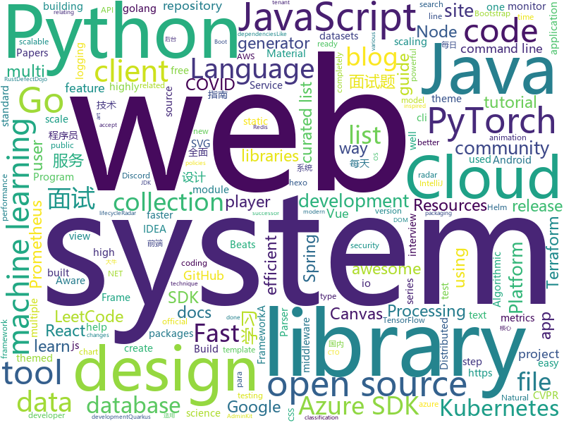

# 2020-09-11
See what the GitHub community is most excited about.

## python
+ [azure-sdk-for-python](https://github.com/Azure/azure-sdk-for-python)(**66 stars today**): This repository is for active development of the Azure SDK for Python. For consumers of the SDK we recommend visiting our public developer docs at https://docs.microsoft.com/en-us/python/azure/ or our versioned developer docs at https://azure.github.io/azure-sdk-for-python.
+ [eiten](https://github.com/tradytics/eiten)(**728 stars today**): Statistical and Algorithmic Investing Strategies for Everyone
+ [diagrams](https://github.com/mingrammer/diagrams)(**501 stars today**): 🎨Diagram as Code for prototyping cloud system architectures
+ [Fantasy-Premier-League](https://github.com/vaastav/Fantasy-Premier-League)(**5 stars today**): Creates a .csv file of all players in the English Player League with their respective team and total fantasy points
+ [fastapi](https://github.com/tiangolo/fastapi)(**57 stars today**): FastAPI framework, high performance, easy to learn, fast to code, ready for production
+ [zipline](https://github.com/quantopian/zipline)(**46 stars today**): Zipline, a Pythonic Algorithmic Trading Library
+ [IntelOwl](https://github.com/intelowlproject/IntelOwl)(**35 stars today**): Intel Owl: analyze files, domains, IPs in multiple ways from a single API at scale
+ [ultimate-python](https://github.com/huangsam/ultimate-python)(**246 stars today**): Ultimate Python study guide for newcomers and professionals alike.🐍🐍🐍
+ [datasets](https://github.com/huggingface/datasets)(**13 stars today**): 🤗Fast, efficient, open-access datasets and evaluation metrics for Natural Language Processing in PyTorch, TensorFlow, NumPy and Pandas
+ [airflow](https://github.com/apache/airflow)(**18 stars today**): Apache Airflow - A platform to programmatically author, schedule, and monitor workflows
+ [public-apis](https://github.com/public-apis/public-apis)(**115 stars today**): A collective list of free APIs for use in software and web development.
+ [django](https://github.com/django/django)(**30 stars today**): The Web framework for perfectionists with deadlines.
+ [pycharm-guide](https://github.com/iswbm/pycharm-guide)(**122 stars today**): PyCharm 中文指南：安装 | 破解 | 效率 | 技巧
+ [KILT](https://github.com/facebookresearch/KILT)(**30 stars today**): Library for Knowledge Intensive Language Tasks
+ [dagster](https://github.com/dagster-io/dagster)(**6 stars today**): A data orchestrator for machine learning, analytics, and ETL.
+ [poetry](https://github.com/python-poetry/poetry)(**35 stars today**): Python dependency management and packaging made easy.
+ [DAIN](https://github.com/baowenbo/DAIN)(**35 stars today**): Depth-Aware Video Frame Interpolation (CVPR 2019)
+ [pytorch-lightning-bolts](https://github.com/PyTorchLightning/pytorch-lightning-bolts)(**45 stars today**): PyTorch Lightning Bolts is a toolbox of models, callbacks, and datasets for AI/ML researchers.
+ [pydantic](https://github.com/samuelcolvin/pydantic)(**8 stars today**): Data parsing and validation using Python type hints
+ [scikit-learn](https://github.com/scikit-learn/scikit-learn)(**38 stars today**): scikit-learn: machine learning in Python
+ [DeepFaceDrawing-Jittor](https://github.com/IGLICT/DeepFaceDrawing-Jittor)(**15 stars today**): 
+ [cvat](https://github.com/openvinotoolkit/cvat)(**11 stars today**): Powerful and efficient Computer Vision Annotation Tool (CVAT)
+ [PyTorch-YOLOv3](https://github.com/eriklindernoren/PyTorch-YOLOv3)(**9 stars today**): Minimal PyTorch implementation of YOLOv3
+ [transformers](https://github.com/huggingface/transformers)(**73 stars today**): 🤗Transformers: State-of-the-art Natural Language Processing for Pytorch and TensorFlow 2.0.
+ [mlflow](https://github.com/mlflow/mlflow)(**13 stars today**): Open source platform for the machine learning lifecycle

## java
+ [radar-covid-backend-verification-server](https://github.com/RadarCOVID/radar-covid-backend-verification-server)(**23 stars today**): Radar COVID Verification Service
+ [radar-covid-backend-dp3t-server](https://github.com/RadarCOVID/radar-covid-backend-dp3t-server)(**21 stars today**): DP^3T Radar COVID fork
+ [radar-covid-backend-configuration-server](https://github.com/RadarCOVID/radar-covid-backend-configuration-server)(**18 stars today**): Radar COVID Configuration Service
+ [cim](https://github.com/crossoverJie/cim)(**115 stars today**): 📲cim(cross IM) 适用于开发者的分布式即时通讯系统
+ [serve](https://github.com/pytorch/serve)(**5 stars today**): Model Serving on PyTorch
+ [CS-Notes](https://github.com/CyC2018/CS-Notes)(**138 stars today**): 📚技术面试必备基础知识、Leetcode、计算机操作系统、计算机网络、系统设计、Java、Python、C++
+ [Algorithms](https://github.com/williamfiset/Algorithms)(**154 stars today**): A collection of algorithms and data structures
+ [graal](https://github.com/oracle/graal)(**11 stars today**): GraalVM: Run Programs Faster Anywhere🚀
+ [SpringCloudLearning](https://github.com/forezp/SpringCloudLearning)(**26 stars today**): 《史上最简单的Spring Cloud教程源码》
+ [spring-boot](https://github.com/spring-projects/spring-boot)(**32 stars today**): Spring Boot
+ [fullstack-tutorial](https://github.com/frank-lam/fullstack-tutorial)(**8 stars today**): 🚀fullstack tutorial 2020，后台技术栈/架构师之路/全栈开发社区，春招/秋招/校招/面试
+ [shardingsphere](https://github.com/apache/shardingsphere)(**14 stars today**): Distributed database middleware
+ [JavaGuide](https://github.com/Snailclimb/JavaGuide)(**96 stars today**): 「Java学习+面试指南」一份涵盖大部分Java程序员所需要掌握的核心知识。
+ [elasticsearch](https://github.com/elastic/elasticsearch)(**14 stars today**): Open Source, Distributed, RESTful Search Engine
+ [web3j](https://github.com/web3j/web3j)(**2 stars today**): Lightweight Java and Android library for integration with Ethereum clients
+ [spring-framework](https://github.com/spring-projects/spring-framework)(**30 stars today**): Spring Framework
+ [MPAndroidChart](https://github.com/PhilJay/MPAndroidChart)(**28 stars today**): A powerful🚀Android chart view / graph view library, supporting line- bar- pie- radar- bubble- and candlestick charts as well as scaling, panning and animations.
+ [jdk](https://github.com/openjdk/jdk)(**178 stars today**): JDK main-line development
+ [quarkus](https://github.com/quarkusio/quarkus)(**16 stars today**): Quarkus: Supersonic Subatomic Java.
+ [feast](https://github.com/feast-dev/feast)(**8 stars today**): Feature Store for Machine Learning
+ [lucene-solr](https://github.com/apache/lucene-solr)(**4 stars today**): Apache Lucene and Solr open-source search software
+ [checkstyle](https://github.com/checkstyle/checkstyle)(**6 stars today**): Checkstyle is a development tool to help programmers write Java code that adheres to a coding standard. By default it supports the Google Java Style Guide and Sun Code Conventions, but is highly configurable. It can be invoked with an ANT task and a command line program.
+ [spring-cloud-examples](https://github.com/ityouknow/spring-cloud-examples)(**10 stars today**): Spring Cloud 学习案例，服务发现、服务治理、链路追踪、服务监控等
+ [flink](https://github.com/apache/flink)(**15 stars today**): Apache Flink
+ [antlr4](https://github.com/antlr/antlr4)(**10 stars today**): ANTLR (ANother Tool for Language Recognition) is a powerful parser generator for reading, processing, executing, or translating structured text or binary files.

## unknown
+ [awesome-nodejs](https://github.com/sindresorhus/awesome-nodejs)(**194 stars today**): ⚡Delightful Node.js packages and resources
+ [mem-doc](https://github.com/Maoni0/mem-doc)(**251 stars today**): This is a document to help with .NET memory analysis and diagnostics.
+ [wirehole](https://github.com/IAmStoxe/wirehole)(**211 stars today**): 
+ [learning](https://github.com/amitness/learning)(**57 stars today**): Becoming 1% better at data science everyday
+ [the-incredible-pytorch](https://github.com/ritchieng/the-incredible-pytorch)(**122 stars today**): The Incredible PyTorch: a curated list of tutorials, papers, projects, communities and more relating to PyTorch.
+ [awesome-react](https://github.com/enaqx/awesome-react)(**142 stars today**): A collection of awesome things regarding React ecosystem
+ [awesome-lowcode](https://github.com/taowen/awesome-lowcode)(**120 stars today**): 国内低代码平台从业者交流
+ [You-Dont-Know-JS](https://github.com/getify/You-Dont-Know-JS)(**145 stars today**): A book series on JavaScript. @YDKJS on twitter.
+ [applied-ml](https://github.com/eugeneyan/applied-ml)(**296 stars today**): 📚Papers of companies sharing their work on applied data science & machine learning.
+ [Awesome-Microservices-NetCore](https://github.com/mjebrahimi/Awesome-Microservices-NetCore)(**20 stars today**): The Best Resources for Microservices in .NET Core - Tutorials, Source Code Samples, ...
+ [android](https://github.com/LineageOS/android)(**3 stars today**): 
+ [intellij-community](https://github.com/JetBrains/intellij-community)(**26 stars today**): IntelliJ IDEA Community Edition & IntelliJ Platform
+ [awesome-production-machine-learning](https://github.com/EthicalML/awesome-production-machine-learning)(**121 stars today**): A curated list of awesome open source libraries to deploy, monitor, version and scale your machine learning
+ [SSR](https://github.com/DuyaoSS/SSR)(**5 stars today**): 毒药笔记
+ [awesome-quant](https://github.com/wilsonfreitas/awesome-quant)(**32 stars today**): A curated list of insanely awesome libraries, packages and resources for Quants (Quantitative Finance)
+ [vagas](https://github.com/frontendbr/vagas)(**11 stars today**): 🔬Espaço para divulgação de vagas para front-enders.
+ [low-level-design-primer](https://github.com/prasadgujar/low-level-design-primer)(**15 stars today**): Dedicated Resources for the Low-Level System Design. Learn how to design and implement large-scale systems. Prep for the system design interview.
+ [from_coder_to_expert](https://github.com/0voice/from_coder_to_expert)(**35 stars today**): 2020年最新总结，从程序员到CTO，从专业走向卓越，分享大牛企业内部pdf与PPT
+ [ganhacks](https://github.com/soumith/ganhacks)(**10 stars today**): starter from "How to Train a GAN?" at NIPS2016
+ [app-ideas](https://github.com/florinpop17/app-ideas)(**74 stars today**): A Collection of application ideas which can be used to improve your coding skills.
+ [CVPR2020-Code](https://github.com/amusi/CVPR2020-Code)(**8 stars today**): CVPR 2020 论文开源项目合集
+ [the-book-of-secret-knowledge](https://github.com/trimstray/the-book-of-secret-knowledge)(**14 stars today**): A collection of inspiring lists, manuals, cheatsheets, blogs, hacks, one-liners, cli/web tools and more.
+ [kubernetes-the-hard-way](https://github.com/kelseyhightower/kubernetes-the-hard-way)(**25 stars today**): Bootstrap Kubernetes the hard way on Google Cloud Platform. No scripts.
+ [Back-End-Developer-Interview-Questions](https://github.com/arialdomartini/Back-End-Developer-Interview-Questions)(**14 stars today**): A list of back-end related questions you can be inspired from to interview potential candidates, test yourself or completely ignore
+ [gndx-challenges](https://github.com/gndx/gndx-challenges)(**10 stars today**): 10 Projects for Web developers

## javascript
+ [react-challenge-amazon-clone](https://github.com/CleverProgrammers/react-challenge-amazon-clone)(**75 stars today**): 
+ [nuxt.js](https://github.com/nuxt/nuxt.js)(**43 stars today**): The Intuitive Vue Framework
+ [minecraft-react](https://github.com/satansdeer/minecraft-react)(**65 stars today**): 
+ [eleventy-high-performance-blog](https://github.com/google/eleventy-high-performance-blog)(**255 stars today**): A high performance blog template for the 11ty static site generator.
+ [material-ui](https://github.com/mui-org/material-ui)(**38 stars today**): React components for faster and easier web development. Build your own design system, or start with Material Design.
+ [yargs](https://github.com/yargs/yargs)(**5 stars today**): yargs the modern, pirate-themed successor to optimist.
+ [fabric.js](https://github.com/fabricjs/fabric.js)(**26 stars today**): Javascript Canvas Library, SVG-to-Canvas (& canvas-to-SVG) Parser
+ [workbox](https://github.com/GoogleChrome/workbox)(**7 stars today**): 📦Workbox: JavaScript libraries for Progressive Web Apps
+ [react](https://github.com/facebook/react)(**82 stars today**): A declarative, efficient, and flexible JavaScript library for building user interfaces.
+ [react-flip-move](https://github.com/joshwcomeau/react-flip-move)(**11 stars today**): Effortless animation between DOM changes (eg. list reordering) using the FLIP technique.
+ [create-release](https://github.com/actions/create-release)(**3 stars today**): An Action to create releases via the GitHub Release API
+ [bigbluebutton](https://github.com/bigbluebutton/bigbluebutton)(**10 stars today**): Complete open source web conferencing system.
+ [vue-test-utils](https://github.com/vuejs/vue-test-utils)(**2 stars today**): 🔬Utilities for testing Vue components
+ [hubs](https://github.com/mozilla/hubs)(**5 stars today**): Duck-themed multi-user virtual spaces in WebVR. Built with A-Frame.
+ [three.js](https://github.com/mrdoob/three.js)(**44 stars today**): JavaScript 3D library.
+ [strapi](https://github.com/strapi/strapi)(**63 stars today**): 🚀Open source Node.js Headless CMS to easily build customisable APIs
+ [cropperjs](https://github.com/fengyuanchen/cropperjs)(**16 stars today**): JavaScript image cropper.
+ [fe-interview](https://github.com/haizlin/fe-interview)(**39 stars today**): 前端面试每日 3+1，以面试题来驱动学习，提倡每日学习与思考，每天进步一点！每天早上5点纯手工发布面试题（死磕自己，愉悦大家），3000+道前端面试题全面覆盖，HTML/CSS/JavaScript/Vue/React/Nodejs/TypeScript/ECMAScritpt/Webpack/Jquery/小程序/软技能……
+ [jszip](https://github.com/Stuk/jszip)(**14 stars today**): Create, read and edit .zip files with Javascript
+ [shaka-player](https://github.com/google/shaka-player)(**8 stars today**): JavaScript player library / DASH & HLS client / MSE-EME player
+ [highlight.js](https://github.com/highlightjs/highlight.js)(**15 stars today**): Javascript syntax highlighter
+ [BetterDiscordApp](https://github.com/rauenzi/BetterDiscordApp)(**7 stars today**): Better Discord App enhances Discord desktop app with new features.
+ [winston](https://github.com/winstonjs/winston)(**11 stars today**): A logger for just about everything.
+ [LazyStudy](https://github.com/lolisaikou/LazyStudy)(**7 stars today**): 
+ [aws-sdk-js](https://github.com/aws/aws-sdk-js)(**4 stars today**): AWS SDK for JavaScript in the browser and Node.js

## html
+ [helm-charts](https://github.com/prometheus-community/helm-charts)(**21 stars today**): Prometheus community Helm charts
+ [charts](https://github.com/bitnami/charts)(**8 stars today**): Helm Charts
+ [learning-area](https://github.com/mdn/learning-area)(**7 stars today**): Github repo for the MDN Learning Area.
+ [Server](https://github.com/PanDownloadServer/Server)(**225 stars today**): PanDownload的个人维护版本
+ [eleventy-base-blog](https://github.com/11ty/eleventy-base-blog)(**6 stars today**): A starter repository for a blog web site using the Eleventy static site generator.
+ [azure-sdk](https://github.com/Azure/azure-sdk)(**0 stars today**): This is the Azure SDK parent repository and mostly contains documentation around guidelines and policies as well as the releases for the various languages supported by the Azure SDK.
+ [OpenClash](https://github.com/vernesong/OpenClash)(**9 stars today**): A Clash Client For OpenWrt
+ [windmill-dashboard](https://github.com/estevanmaito/windmill-dashboard)(**6 stars today**): 📊A multi theme, completely accessible, ready for production dashboard.
+ [intro.js](https://github.com/usablica/intro.js)(**4 stars today**): A better way for new feature introduction and step-by-step users guide for your website and project.
+ [adminkit](https://github.com/adminkit/adminkit)(**9 stars today**): 🧰AdminKit - Bootstrap 5 Admin Template
+ [fastText](https://github.com/facebookresearch/fastText)(**5 stars today**): Library for fast text representation and classification.
+ [bulma-templates](https://github.com/BulmaTemplates/bulma-templates)(**1 stars today**): free flexbox templates built with the bulma css framework
+ [docker-development-youtube-series](https://github.com/marcel-dempers/docker-development-youtube-series)(**3 stars today**): 
+ [sicp](https://github.com/sarabander/sicp)(**2 stars today**): HTML5/EPUB3 version of SICP
+ [cypress-example-kitchensink](https://github.com/cypress-io/cypress-example-kitchensink)(**1 stars today**): This is an example app used to showcase Cypress.io testing.
+ [blog_os](https://github.com/phil-opp/blog_os)(**17 stars today**): Writing an OS in Rust
+ [django-DefectDojo](https://github.com/DefectDojo/django-DefectDojo)(**2 stars today**): DefectDojo is an open-source application vulnerability correlation and security orchestration tool.
+ [hexo-theme-matery](https://github.com/blinkfox/hexo-theme-matery)(**3 stars today**): A beautiful hexo blog theme with material design and responsive design.一个基于材料设计和响应式设计而成的全面、美观的Hexo主题。国内访问：http://blinkfox.com
+ [www-community](https://github.com/OWASP/www-community)(**1 stars today**): OWASP Community Pages are a place where OWASP can accept community contributions for security-related content.
+ [py4e](https://github.com/csev/py4e)(**5 stars today**): Web site for www.py4e.com and source to the Python 3.0 textbook
+ [argo-helm](https://github.com/argoproj/argo-helm)(**0 stars today**): ArgoProj Helm Charts
+ [goproxy.cn](https://github.com/goproxy/goproxy.cn)(**7 stars today**): The most trusted Go module proxy in China.
+ [website](https://github.com/kubeflow/website)(**0 stars today**): Kubeflow's public website
+ [element-web](https://github.com/vector-im/element-web)(**6 stars today**): A glossy Matrix collaboration client for the web.
+ [all-contributors](https://github.com/all-contributors/all-contributors)(**5 stars today**): ✨Recognize all contributors, not just the ones who push code✨

## go
+ [LeetCode-Go](https://github.com/halfrost/LeetCode-Go)(**219 stars today**): ✅Solutions to LeetCode by Go, 100% test coverage, runtime beats 100% / LeetCode 题解
+ [go-github](https://github.com/google/go-github)(**6 stars today**): Go library for accessing the GitHub API
+ [terragrunt](https://github.com/gruntwork-io/terragrunt)(**8 stars today**): Terragrunt is a thin wrapper for Terraform that provides extra tools for working with multiple Terraform modules.
+ [redis](https://github.com/go-redis/redis)(**12 stars today**): Type-safe Redis client for Golang
+ [cli](https://github.com/cli/cli)(**310 stars today**): GitHub’s official command line tool
+ [depaware](https://github.com/tailscale/depaware)(**65 stars today**): depaware makes you aware of your Go dependencies
+ [loki](https://github.com/grafana/loki)(**17 stars today**): Like Prometheus, but for logs.
+ [infracost](https://github.com/infracost/infracost)(**72 stars today**): Cloud cost estimates for Terraform in your CLI and pull requests💰📉
+ [vitess](https://github.com/vitessio/vitess)(**16 stars today**): Vitess is a database clustering system for horizontal scaling of MySQL.
+ [go-grpc-middleware](https://github.com/grpc-ecosystem/go-grpc-middleware)(**9 stars today**): Golang gRPC Middlewares: interceptor chaining, auth, logging, retries and more.
+ [cortex](https://github.com/cortexproject/cortex)(**4 stars today**): A horizontally scalable, highly available, multi-tenant, long term Prometheus.
+ [external-dns](https://github.com/kubernetes-sigs/external-dns)(**3 stars today**): Configure external DNS servers (AWS Route53, Google CloudDNS and others) for Kubernetes Ingresses and Services
+ [logrus](https://github.com/sirupsen/logrus)(**15 stars today**): Structured, pluggable logging for Go.
+ [go](https://github.com/golang/go)(**60 stars today**): The Go programming language
+ [sqlx](https://github.com/jmoiron/sqlx)(**11 stars today**): general purpose extensions to golang's database/sql
+ [prometheus](https://github.com/prometheus/prometheus)(**29 stars today**): The Prometheus monitoring system and time series database.
+ [beats](https://github.com/elastic/beats)(**10 stars today**): 🐠Beats - Lightweight shippers for Elasticsearch & Logstash
+ [chaos-mesh](https://github.com/chaos-mesh/chaos-mesh)(**19 stars today**): A Chaos Engineering Platform for Kubernetes.
+ [influxdb](https://github.com/influxdata/influxdb)(**9 stars today**): Scalable datastore for metrics, events, and real-time analytics
+ [testify](https://github.com/stretchr/testify)(**16 stars today**): A toolkit with common assertions and mocks that plays nicely with the standard library
+ [alibaba-cloud-sdk-go](https://github.com/aliyun/alibaba-cloud-sdk-go)(**0 stars today**): Alibaba Cloud SDK for Go
+ [argo](https://github.com/argoproj/argo)(**18 stars today**): Argo Workflows: Get stuff done with Kubernetes.
+ [golangci-lint](https://github.com/golangci/golangci-lint)(**12 stars today**): Fast linters Runner for Go
+ [cli](https://github.com/cloudfoundry/cli)(**0 stars today**): The official command line client for Cloud Foundry
+ [chi](https://github.com/go-chi/chi)(**14 stars today**): lightweight, idiomatic and composable router for building Go HTTP services

## WordCloud

