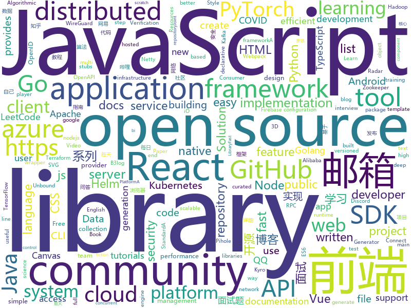

# 2020-09-12
See what the GitHub community is most excited about.

## python
+ [diagrams](https://github.com/mingrammer/diagrams)(**320 stars today**): 🎨Diagram as Code for prototyping cloud system architectures
+ [DeepSpeed](https://github.com/microsoft/DeepSpeed)(**84 stars today**): DeepSpeed is a deep learning optimization library that makes distributed training easy, efficient, and effective.
+ [Fantasy-Premier-League](https://github.com/vaastav/Fantasy-Premier-League)(**18 stars today**): Creates a .csv file of all players in the English Player League with their respective team and total fantasy points
+ [horovod](https://github.com/horovod/horovod)(**15 stars today**): Distributed training framework for TensorFlow, Keras, PyTorch, and Apache MXNet.
+ [azure-sdk-for-python](https://github.com/Azure/azure-sdk-for-python)(**136 stars today**): This repository is for active development of the Azure SDK for Python. For consumers of the SDK we recommend visiting our public developer docs at https://docs.microsoft.com/en-us/python/azure/ or our versioned developer docs at https://azure.github.io/azure-sdk-for-python.
+ [datasets](https://github.com/huggingface/datasets)(**77 stars today**): 🤗Fast, efficient, open-access datasets and evaluation metrics for Natural Language Processing and more in PyTorch, TensorFlow, NumPy and Pandas
+ [fastapi](https://github.com/tiangolo/fastapi)(**54 stars today**): FastAPI framework, high performance, easy to learn, fast to code, ready for production
+ [eiten](https://github.com/tradytics/eiten)(**351 stars today**): Statistical and Algorithmic Investing Strategies for Everyone
+ [Top-Deep-Learning](https://github.com/mbadry1/Top-Deep-Learning)(**18 stars today**): Top 200 deep learning Github repositories sorted by the number of stars.
+ [public-apis](https://github.com/public-apis/public-apis)(**100 stars today**): A collective list of free APIs for use in software and web development.
+ [tafferugli](https://github.com/sowdust/tafferugli)(**117 stars today**): Tafferugli is a Twitter Analysis Framework
+ [PyTorch-GAN](https://github.com/eriklindernoren/PyTorch-GAN)(**19 stars today**): PyTorch implementations of Generative Adversarial Networks.
+ [prefect](https://github.com/PrefectHQ/prefect)(**23 stars today**): The easiest way to automate your data
+ [scipy](https://github.com/scipy/scipy)(**4 stars today**): Scipy library main repository
+ [Towards-Realtime-MOT](https://github.com/Zhongdao/Towards-Realtime-MOT)(**6 stars today**): Joint Detection and Embedding for fast multi-object tracking
+ [ray](https://github.com/ray-project/ray)(**25 stars today**): An open source framework that provides a simple, universal API for building distributed applications. Ray is packaged with RLlib, a scalable reinforcement learning library, and Tune, a scalable hyperparameter tuning library.
+ [pycharm-guide](https://github.com/iswbm/pycharm-guide)(**115 stars today**): PyCharm 中文指南：安装 | 破解 | 效率 | 技巧
+ [azure-cli-extensions](https://github.com/Azure/azure-cli-extensions)(**1 stars today**): Public Repository for Extensions of Azure CLI.
+ [PyTorch-YOLOv3](https://github.com/eriklindernoren/PyTorch-YOLOv3)(**7 stars today**): Minimal PyTorch implementation of YOLOv3
+ [poetry](https://github.com/python-poetry/poetry)(**25 stars today**): Python dependency management and packaging made easy.
+ [InfoSpider](https://github.com/kangvcar/InfoSpider)(**144 stars today**): INFO-SPIDER 是一个集众多数据源于一身的爬虫工具箱🧰，旨在安全快捷的帮助用户拿回自己的数据，工具代码开源，流程透明。支持数据源包括GitHub、QQ邮箱、网易邮箱、阿里邮箱、新浪邮箱、Hotmail邮箱、Outlook邮箱、京东、淘宝、支付宝、中国移动、中国联通、中国电信、知乎、哔哩哔哩、网易云音乐、QQ好友、QQ群、生成朋友圈相册、浏览器浏览历史、12306、博客园、CSDN博客、开源中国博客、简书。
+ [zipline](https://github.com/quantopian/zipline)(**43 stars today**): Zipline, a Pythonic Algorithmic Trading Library
+ [albumentations](https://github.com/albumentations-team/albumentations)(**17 stars today**): Fast image augmentation library and easy to use wrapper around other libraries. Documentation: https://albumentations.ai/docs/ Paper about library: https://www.mdpi.com/2078-2489/11/2/125
+ [models](https://github.com/tensorflow/models)(**25 stars today**): Models and examples built with TensorFlow
+ [incubator-superset](https://github.com/apache/incubator-superset)(**26 stars today**): Apache Superset is a Data Visualization and Data Exploration Platform

## java
+ [guide-rpc-framework](https://github.com/Snailclimb/guide-rpc-framework)(**31 stars today**): A custom RPC framework implemented by Netty+Kyro+Zookeeper.（一款基于 Netty+Kyro+Zookeeper 实现的自定义 RPC 框架-附详细实现过程和相关教程。）
+ [graal](https://github.com/oracle/graal)(**14 stars today**): GraalVM: Run Programs Faster Anywhere🚀
+ [fastjson](https://github.com/alibaba/fastjson)(**15 stars today**): A fast JSON parser/generator for Java.
+ [shardingsphere-elasticjob](https://github.com/apache/shardingsphere-elasticjob)(**6 stars today**): Distributed scheduled job framework
+ [zookeeper](https://github.com/apache/zookeeper)(**10 stars today**): Mirror of Apache Hadoop ZooKeeper
+ [openapi-generator](https://github.com/OpenAPITools/openapi-generator)(**11 stars today**): OpenAPI Generator allows generation of API client libraries (SDK generation), server stubs, documentation and configuration automatically given an OpenAPI Spec (v2, v3)
+ [AppAuth-Android](https://github.com/openid/AppAuth-Android)(**6 stars today**): Android client SDK for communicating with OAuth 2.0 and OpenID Connect providers.
+ [community](https://github.com/GoogleCloudPlatform/community)(**2 stars today**): This repository holds the content submitted to https://cloud.google.com/community. Files added to the tutorials/ will appear at https://cloud.google.com/community/tutorials.
+ [spring-boot](https://github.com/spring-projects/spring-boot)(**27 stars today**): Spring Boot
+ [radar-covid-backend-dp3t-server](https://github.com/RadarCOVID/radar-covid-backend-dp3t-server)(**17 stars today**): DP^3T Radar COVID fork
+ [android_packages_apps_GmsCore](https://github.com/microg/android_packages_apps_GmsCore)(**11 stars today**): Free implementation of Play Services
+ [hive](https://github.com/apache/hive)(**4 stars today**): Apache Hive
+ [liferay-portal](https://github.com/liferay/liferay-portal)(**1 stars today**): 
+ [hadoop](https://github.com/apache/hadoop)(**10 stars today**): Apache Hadoop
+ [JavaGuide](https://github.com/Snailclimb/JavaGuide)(**92 stars today**): 「Java学习+面试指南」一份涵盖大部分Java程序员所需要掌握的核心知识。
+ [radar-covid-backend-verification-server](https://github.com/RadarCOVID/radar-covid-backend-verification-server)(**17 stars today**): Radar COVID Verification Service
+ [JCSprout](https://github.com/crossoverJie/JCSprout)(**16 stars today**): 👨‍🎓Java Core Sprout : basic, concurrent, algorithm
+ [spring-cloud-alibaba](https://github.com/alibaba/spring-cloud-alibaba)(**26 stars today**): Spring Cloud Alibaba provides a one-stop solution for application development for the distributed solutions of Alibaba middleware.
+ [solo](https://github.com/88250/solo)(**5 stars today**): 🎸B3log 分布式社区的 Java 博客端节点系统，欢迎加入下一代社区网络。B3log distributed community blog-end node system, welcome to join the next generation community network.
+ [react-native-twilio-video-webrtc](https://github.com/blackuy/react-native-twilio-video-webrtc)(**2 stars today**): Twilio Video (WebRTC) for React Native
+ [selenium](https://github.com/SeleniumHQ/selenium)(**12 stars today**): A browser automation framework and ecosystem.
+ [sa-token](https://github.com/click33/sa-token)(**22 stars today**): 一个JavaWeb权限认证框架，强大、简单、好用
+ [HikariCP](https://github.com/brettwooldridge/HikariCP)(**14 stars today**): 光 HikariCP・A solid, high-performance, JDBC connection pool at last.
+ [Arduino](https://github.com/arduino/Arduino)(**9 stars today**): open-source electronics platform
+ [AlphaPlayer](https://github.com/bytedance/AlphaPlayer)(**41 stars today**): AlphaPlayer is a video animation engine.

## unknown
+ [COVID-19](https://github.com/CSSEGISandData/COVID-19)(**17 stars today**): Novel Coronavirus (COVID-19) Cases, provided by JHU CSSE
+ [learning](https://github.com/amitness/learning)(**99 stars today**): Becoming 1% better at data science everyday
+ [awesome-nodejs](https://github.com/sindresorhus/awesome-nodejs)(**199 stars today**): ⚡Delightful Node.js packages and resources
+ [understand-nodejs](https://github.com/theanarkh/understand-nodejs)(**37 stars today**): 通过源码分析nodejs原理
+ [the-incredible-pytorch](https://github.com/ritchieng/the-incredible-pytorch)(**110 stars today**): The Incredible PyTorch: a curated list of tutorials, papers, projects, communities and more relating to PyTorch.
+ [low-level-design-primer](https://github.com/prasadgujar/low-level-design-primer)(**12 stars today**): Dedicated Resources for the Low-Level System Design. Learn how to design and implement large-scale systems. Prep for the system design interview.
+ [fucking-algorithm](https://github.com/labuladong/fucking-algorithm)(**448 stars today**): 刷算法全靠套路，认准 labuladong 就够了！English version supported! Crack LeetCode, not only how, but also why.
+ [roadmap](https://github.com/github/roadmap)(**30 stars today**): GitHub public roadmap
+ [surface-duo-oss](https://github.com/microsoft/surface-duo-oss)(**24 stars today**): Surface Duo OSS
+ [weekly](https://github.com/ruanyf/weekly)(**18 stars today**): 科技爱好者周刊，每周五发布
+ [aks-gbb-officehours](https://github.com/Azure/aks-gbb-officehours)(**4 stars today**): Used to host information regarding the GBB-hosted, bi-weekly Public AKS Office Hours
+ [Android](https://github.com/open-android/Android)(**10 stars today**): GitHub上最火的Android开源项目,所有开源项目都有详细资料和配套视频
+ [wirehole](https://github.com/IAmStoxe/wirehole)(**152 stars today**): Wirehole is a combination of WireGuard, Pihole, and Unbound in a docker-compose project with the intent of enabling users to quickly and easily create a personally managed full or split-tunnel WireGuard VPN with ad blocking capabilities thanks to Pihole, and DNS caching, additional privacy options, and upstream providers via Unbound.
+ [you-dont-know-js-ru](https://github.com/azat-io/you-dont-know-js-ru)(**4 stars today**): 📚Russian translation of "You Don't Know JS" book series
+ [NewGrad-2021](https://github.com/Pitt-CSC/NewGrad-2021)(**25 stars today**): A collection of New Grad full time roles in SWE, Quant, and PM.
+ [github-issue-templates](https://github.com/stevemao/github-issue-templates)(**6 stars today**): 🔣A collection of GitHub issue and pull request templates
+ [gitignore](https://github.com/github/gitignore)(**53 stars today**): A collection of useful .gitignore templates
+ [intellij-community](https://github.com/JetBrains/intellij-community)(**26 stars today**): IntelliJ IDEA Community Edition & IntelliJ Platform
+ [first-contributions](https://github.com/firstcontributions/first-contributions)(**23 stars today**): 🚀✨Help beginners to contribute to open source projects
+ [financial-machine-learning](https://github.com/firmai/financial-machine-learning)(**5 stars today**): A curated list of practical financial machine learning (FinML) tools and applications in Python (by @firmai)
+ [msfs_g36_project](https://github.com/TheFrett/msfs_g36_project)(**4 stars today**): Improvement project for the MSFS default G36.
+ [golang-open-source-projects](https://github.com/hackstoic/golang-open-source-projects)(**12 stars today**): 为互联网IT人打造的中文版awesome-go
+ [awesome-lowcode](https://github.com/taowen/awesome-lowcode)(**63 stars today**): 国内低代码平台从业者交流
+ [Blog](https://github.com/mqyqingfeng/Blog)(**14 stars today**): 冴羽写博客的地方，预计写四个系列：JavaScript深入系列、JavaScript专题系列、ES6系列、React系列。
+ [modern-cpp-features](https://github.com/AnthonyCalandra/modern-cpp-features)(**14 stars today**): A cheatsheet of modern C++ language and library features.

## javascript
+ [react-challenge-amazon-clone](https://github.com/CleverProgrammers/react-challenge-amazon-clone)(**87 stars today**): 
+ [nuxt.js](https://github.com/nuxt/nuxt.js)(**129 stars today**): The Intuitive Vue Framework
+ [minecraft-react](https://github.com/satansdeer/minecraft-react)(**51 stars today**): 
+ [Rocket.Chat](https://github.com/RocketChat/Rocket.Chat)(**19 stars today**): The ultimate Free Open Source Solution for team communications.
+ [FE-Interview](https://github.com/lgwebdream/FE-Interview)(**17 stars today**): 前端面试必备题库，1000+面试真题，Html、Css、JavaScript、Vue、React、Node、TypeScript、Webpack、算法、网络与安全、浏览器
+ [three.js](https://github.com/mrdoob/three.js)(**29 stars today**): JavaScript 3D library.
+ [500lines](https://github.com/aosabook/500lines)(**16 stars today**): 500 Lines or Less
+ [highlight.js](https://github.com/highlightjs/highlight.js)(**18 stars today**): Javascript syntax highlighter
+ [Web](https://github.com/qianguyihao/Web)(**22 stars today**): 前端入门到进阶图文教程，超详细的Web前端学习笔记。从零开始学前端，做一名精致优雅的前端工程师。公众号「千古壹号」作者。
+ [github-readme-stats](https://github.com/anuraghazra/github-readme-stats)(**87 stars today**): ⚡Dynamically generated stats for your github readmes
+ [BetterDiscordApp](https://github.com/rauenzi/BetterDiscordApp)(**13 stars today**): Better Discord App enhances Discord desktop app with new features.
+ [fabric.js](https://github.com/fabricjs/fabric.js)(**17 stars today**): Javascript Canvas Library, SVG-to-Canvas (& canvas-to-SVG) Parser
+ [pipedream](https://github.com/PipedreamHQ/pipedream)(**5 stars today**): Serverless integration and compute platform. Free for developers.
+ [react-native-firebase](https://github.com/invertase/react-native-firebase)(**11 stars today**): 🔥A well-tested feature-rich modular Firebase implementation for React Native. Supports both iOS & Android platforms for all Firebase services.
+ [cube.js](https://github.com/cube-js/cube.js)(**7 stars today**): 📊Cube.js - Open Source Analytics Framework
+ [edex-ui](https://github.com/GitSquared/edex-ui)(**15 stars today**): A cross-platform, customizable science fiction terminal emulator with advanced monitoring & touchscreen support.
+ [LazyStudy](https://github.com/lolisaikou/LazyStudy)(**9 stars today**): 
+ [tsdx](https://github.com/formium/tsdx)(**21 stars today**): Zero-config CLI for TypeScript package development
+ [vue-select](https://github.com/sagalbot/vue-select)(**3 stars today**): Everything you wish the HTML <select> element could do, wrapped up into a lightweight, extensible Vue component.
+ [plotly.js](https://github.com/plotly/plotly.js)(**6 stars today**): Open-source JavaScript charting library behind Plotly and Dash
+ [react-native](https://github.com/facebook/react-native)(**36 stars today**): A framework for building native apps with React.
+ [react](https://github.com/facebook/react)(**84 stars today**): A declarative, efficient, and flexible JavaScript library for building user interfaces.
+ [javascript](https://github.com/airbnb/javascript)(**41 stars today**): JavaScript Style Guide
+ [undici](https://github.com/nodejs/undici)(**70 stars today**): An HTTP/1.1 client, written from scratch for Node.js
+ [fe-interview](https://github.com/haizlin/fe-interview)(**56 stars today**): 前端面试每日 3+1，以面试题来驱动学习，提倡每日学习与思考，每天进步一点！每天早上5点纯手工发布面试题（死磕自己，愉悦大家），3000+道前端面试题全面覆盖，HTML/CSS/JavaScript/Vue/React/Nodejs/TypeScript/ECMAScritpt/Webpack/Jquery/小程序/软技能……

## html
+ [helm-charts](https://github.com/prometheus-community/helm-charts)(**25 stars today**): Prometheus community Helm charts
+ [swagger-codegen](https://github.com/swagger-api/swagger-codegen)(**9 stars today**): swagger-codegen contains a template-driven engine to generate documentation, API clients and server stubs in different languages by parsing your OpenAPI / Swagger definition.
+ [helm-charts](https://github.com/jenkinsci/helm-charts)(**2 stars today**): Jenkins community Helm charts
+ [learning-area](https://github.com/mdn/learning-area)(**6 stars today**): Github repo for the MDN Learning Area.
+ [Server](https://github.com/PanDownloadServer/Server)(**258 stars today**): PanDownload的个人维护版本
+ [Front-end-Developer-Interview-Questions](https://github.com/h5bp/Front-end-Developer-Interview-Questions)(**28 stars today**): A list of helpful front-end related questions you can use to interview potential candidates, test yourself or completely ignore.
+ [raytracing.github.io](https://github.com/RayTracing/raytracing.github.io)(**7 stars today**): Main Web Site (Online Books)
+ [fastText](https://github.com/facebookresearch/fastText)(**5 stars today**): Library for fast text representation and classification.
+ [proposal-decorators](https://github.com/tc39/proposal-decorators)(**11 stars today**): Decorators for ES6 classes
+ [django-DefectDojo](https://github.com/DefectDojo/django-DefectDojo)(**2 stars today**): DefectDojo is an open-source application vulnerability correlation and security orchestration tool.
+ [pdf2htmlEX](https://github.com/coolwanglu/pdf2htmlEX)(**1 stars today**): Convert PDF to HTML without losing text or format.
+ [charts](https://github.com/bitnami/charts)(**8 stars today**): Helm Charts
+ [html](https://github.com/whatwg/html)(**4 stars today**): HTML Standard
+ [hugo-clarity](https://github.com/chipzoller/hugo-clarity)(**2 stars today**): A theme for Hugo based on VMware Clarity
+ [liva-hugo](https://github.com/themefisher/liva-hugo)(**1 stars today**): Hugo personal blog template
+ [OpenClash](https://github.com/vernesong/OpenClash)(**6 stars today**): A Clash Client For OpenWrt
+ [quickstart-js](https://github.com/firebase/quickstart-js)(**5 stars today**): Firebase Quickstart Samples for Web
+ [devdocs](https://github.com/magento/devdocs)(**1 stars today**): Magento Developer Documentation
+ [bulma-templates](https://github.com/BulmaTemplates/bulma-templates)(**1 stars today**): free flexbox templates built with the bulma css framework
+ [intro.js](https://github.com/usablica/intro.js)(**4 stars today**): A better way for new feature introduction and step-by-step users guide for your website and project.
+ [glTF](https://github.com/KhronosGroup/glTF)(**2 stars today**): glTF – Runtime 3D Asset Delivery
+ [openwrt-packages](https://github.com/kenzok8/openwrt-packages)(**4 stars today**): openwet常用软件包
+ [ASVS](https://github.com/OWASP/ASVS)(**2 stars today**): Application Security Verification Standard
+ [222-responsive-icon-nav-css](https://github.com/fireship-io/222-responsive-icon-nav-css)(**2 stars today**): A Simple Responsive Animated CSS Icon Navbar
+ [proposal-pipeline-operator](https://github.com/tc39/proposal-pipeline-operator)(**3 stars today**): A proposal for adding the simple-but-useful pipeline operator to JavaScript.

## go
+ [gopsutil](https://github.com/shirou/gopsutil)(**7 stars today**): psutil for golang
+ [cli](https://github.com/cli/cli)(**141 stars today**): GitHub’s official command line tool
+ [LeetCode-Go](https://github.com/halfrost/LeetCode-Go)(**376 stars today**): ✅Solutions to LeetCode by Go, 100% test coverage, runtime beats 100% / LeetCode 题解
+ [kubernetes](https://github.com/kubernetes/kubernetes)(**60 stars today**): Production-Grade Container Scheduling and Management
+ [caddy](https://github.com/caddyserver/caddy)(**38 stars today**): Fast, multi-platform web server with automatic HTTPS
+ [go-cqhttp](https://github.com/Mrs4s/go-cqhttp)(**10 stars today**): cqhttp的golang实现，轻量、原生跨平台.
+ [jaeger](https://github.com/jaegertracing/jaeger)(**14 stars today**): CNCF Jaeger, a Distributed Tracing Platform
+ [hydra](https://github.com/ory/hydra)(**11 stars today**): OAuth2 Server and OpenID Certified™ OpenID Connect Provider written in Go - cloud native, security-first, open source API security for your infrastructure. SDKs for any language.
+ [shentu](https://github.com/certikfoundation/shentu)(**293 stars today**): CertiK Shentu chain implementation
+ [terraform-provider-aws](https://github.com/terraform-providers/terraform-provider-aws)(**4 stars today**): Terraform AWS provider
+ [terraform](https://github.com/hashicorp/terraform)(**12 stars today**): Terraform enables you to safely and predictably create, change, and improve infrastructure. It is an open source tool that codifies APIs into declarative configuration files that can be shared amongst team members, treated as code, edited, reviewed, and versioned.
+ [k9s](https://github.com/derailed/k9s)(**28 stars today**): 🐶Kubernetes CLI To Manage Your Clusters In Style!
+ [CBL-Mariner](https://github.com/microsoft/CBL-Mariner)(**23 stars today**): Linux OS for Azure 1P services and edge appliances
+ [sarama](https://github.com/Shopify/sarama)(**8 stars today**): Sarama is a Go library for Apache Kafka 0.8, and up.
+ [lotus](https://github.com/filecoin-project/lotus)(**4 stars today**): Implementation of the Filecoin protocol, written in Go
+ [casbin](https://github.com/casbin/casbin)(**11 stars today**): An authorization library that supports access control models like ACL, RBAC, ABAC in Golang
+ [guora](https://github.com/meloalright/guora)(**84 stars today**): 🖖🏻 A self-hosted Quora like web application written in Go 基于 Golang 类似知乎的私有部署问答应用 包含问答、评论、点赞、管理后台等功能
+ [terragrunt](https://github.com/gruntwork-io/terragrunt)(**7 stars today**): Terragrunt is a thin wrapper for Terraform that provides extra tools for working with multiple Terraform modules.
+ [Burrow](https://github.com/linkedin/Burrow)(**1 stars today**): Kafka Consumer Lag Checking
+ [minio](https://github.com/minio/minio)(**19 stars today**): High Performance, Kubernetes Native Object Storage
+ [helmfile](https://github.com/roboll/helmfile)(**2 stars today**): Deploy Kubernetes Helm Charts
+ [opentelemetry-collector-contrib](https://github.com/open-telemetry/opentelemetry-collector-contrib)(**2 stars today**): Contrib repository for the OpenTelemetry Collector
+ [gqlgen](https://github.com/99designs/gqlgen)(**6 stars today**): go generate based graphql server library
+ [go](https://github.com/golang/go)(**44 stars today**): The Go programming language
+ [vault](https://github.com/hashicorp/vault)(**12 stars today**): A tool for secrets management, encryption as a service, and privileged access management

## WordCloud

