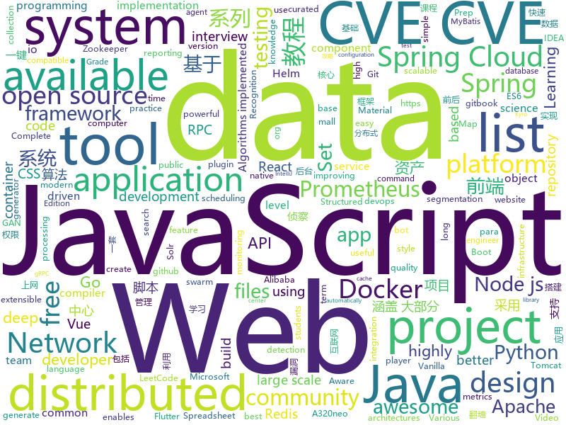

# 2020-09-15
See what the GitHub community is most excited about.

## python
+ [CVE-2020-1472](https://github.com/SecuraBV/CVE-2020-1472)(**307 stars today**): Test tool for CVE-2020-1472
+ [Python](https://github.com/TheAlgorithms/Python)(**379 stars today**): All Algorithms implemented in Python
+ [exphub](https://github.com/zhzyker/exphub)(**71 stars today**): Exphub[漏洞利用脚本库] 包括Webloigc、Struts2、Tomcat、Nexus、Solr、Jboss、Drupal的漏洞利用脚本，最新添加CVE-2020-5902、CVE-2020-11444、CVE-2020-10204、CVE-2020-10199、CVE-2020-1938、CVE-2020-2551、CVE-2020-2555、CVE-2020-2883、CVE-2019-17558、CVE-2019-6340
+ [pytorch-gans](https://github.com/gordicaleksa/pytorch-gans)(**37 stars today**): My implementation of various GAN (generative adversarial networks) architectures like vanilla GAN, cGAN, DCGAN, etc.
+ [yolov5](https://github.com/ultralytics/yolov5)(**31 stars today**): YOLOv5 in PyTorch > ONNX > CoreML > iOS
+ [DeepSpeed](https://github.com/microsoft/DeepSpeed)(**58 stars today**): DeepSpeed is a deep learning optimization library that makes distributed training easy, efficient, and effective.
+ [incubator-superset](https://github.com/apache/incubator-superset)(**30 stars today**): Apache Superset is a Data Visualization and Data Exploration Platform
+ [devops-exercises](https://github.com/bregman-arie/devops-exercises)(**14 stars today**): Linux, Jenkins, AWS, SRE, Prometheus, Docker, Python, Ansible, Git, Kubernetes, Terraform, OpenStack, SQL, NoSQL, Azure, GCP, DNS, Elastic, Network, Virtualization. DevOps Interview Questions
+ [eat_tensorflow2_in_30_days](https://github.com/lyhue1991/eat_tensorflow2_in_30_days)(**37 stars today**): Tensorflow2.0🍎🍊is delicious, just eat it!😋😋
+ [pytorch-CycleGAN-and-pix2pix](https://github.com/junyanz/pytorch-CycleGAN-and-pix2pix)(**14 stars today**): Image-to-Image Translation in PyTorch
+ [CVE-Reverse](https://github.com/iamnoooob/CVE-Reverse)(**42 stars today**): 
+ [system-design-primer](https://github.com/donnemartin/system-design-primer)(**113 stars today**): Learn how to design large-scale systems. Prep for the system design interview. Includes Anki flashcards.
+ [jupyter-book](https://github.com/executablebooks/jupyter-book)(**21 stars today**): Build interactive, publication-quality documents from Jupyter Notebooks
+ [DAIN](https://github.com/baowenbo/DAIN)(**80 stars today**): Depth-Aware Video Frame Interpolation (CVPR 2019)
+ [opentelemetry-python](https://github.com/open-telemetry/opentelemetry-python)(**0 stars today**): The OpenTelemetry Python Client
+ [espnet](https://github.com/espnet/espnet)(**10 stars today**): End-to-End Speech Processing Toolkit
+ [Mask_RCNN](https://github.com/matterport/Mask_RCNN)(**10 stars today**): Mask R-CNN for object detection and instance segmentation on Keras and TensorFlow
+ [smuggler](https://github.com/defparam/smuggler)(**6 stars today**): Smuggler - An HTTP Request Smuggling / Desync testing tool written in Python 3
+ [CenterTrack](https://github.com/xingyizhou/CenterTrack)(**5 stars today**): Simultaneous object detection and tracking using center points.
+ [spack](https://github.com/spack/spack)(**1 stars today**): A flexible package manager that supports multiple versions, configurations, platforms, and compilers.
+ [incubator-tvm](https://github.com/apache/incubator-tvm)(**3 stars today**): Open deep learning compiler stack for cpu, gpu and specialized accelerators
+ [sentry](https://github.com/getsentry/sentry)(**15 stars today**): Sentry is cross-platform application monitoring, with a focus on error reporting.
+ [HRNet-Semantic-Segmentation](https://github.com/HRNet/HRNet-Semantic-Segmentation)(**3 stars today**): This is an official implementation of semantic segmentation for our TPAMI paper "Deep High-Resolution Representation Learning for Visual Recognition". https://arxiv.org/abs/1908.07919
+ [networkx](https://github.com/networkx/networkx)(**7 stars today**): Network Analysis in Python
+ [ARL](https://github.com/TophantTechnology/ARL)(**51 stars today**): ARL(Asset Reconnaissance Lighthouse)资产侦察灯塔系统旨在快速侦察与目标关联的互联网资产，构建基础资产信息库。 协助甲方安全团队或者渗透测试人员有效侦察和检索资产，发现存在的薄弱点和攻击面。

## java
+ [mall-swarm](https://github.com/macrozheng/mall-swarm)(**80 stars today**): mall-swarm是一套微服务商城系统，采用了 Spring Cloud Hoxton & Alibaba、Spring Boot 2.3、Oauth2、MyBatis、Docker、Elasticsearch等核心技术，同时提供了基于Vue的管理后台方便快速搭建系统。mall-swarm在电商业务的基础集成了注册中心、配置中心、监控中心、网关等系统功能。文档齐全，附带全套Spring Cloud教程。
+ [DeepVision](https://github.com/peng-zhihui/DeepVision)(**115 stars today**): 在我很多项目中用到的CV算法推理框架应用。
+ [lucene-solr](https://github.com/apache/lucene-solr)(**7 stars today**): Apache Lucene and Solr open-source search software
+ [Java](https://github.com/TheAlgorithms/Java)(**35 stars today**): All Algorithms implemented in Java
+ [elasticsearch](https://github.com/elastic/elasticsearch)(**32 stars today**): Open Source, Distributed, RESTful Search Engine
+ [ExoPlayer](https://github.com/google/ExoPlayer)(**8 stars today**): An extensible media player for Android
+ [spring5webapp](https://github.com/springframeworkguru/spring5webapp)(**6 stars today**): Example Spring 5 Web Application
+ [springcloud-learning](https://github.com/macrozheng/springcloud-learning)(**20 stars today**): 一套涵盖大部分核心组件使用的Spring Cloud教程，包括Spring Cloud Alibaba及分布式事务Seata，基于Spring Cloud Greenwich及SpringBoot 2.1.7。21篇文章，篇篇精华，32个Demo，涵盖大部分应用场景。
+ [robolectric](https://github.com/robolectric/robolectric)(**2 stars today**): Android Unit Testing Framework
+ [opentelemetry-java](https://github.com/open-telemetry/opentelemetry-java)(**2 stars today**): OpenTelemetry Java SDK
+ [guide-rpc-framework](https://github.com/Snailclimb/guide-rpc-framework)(**34 stars today**): A custom RPC framework implemented by Netty+Kyro+Zookeeper.（一款基于 Netty+Kyro+Zookeeper 实现的自定义 RPC 框架-附详细实现过程和相关教程。）
+ [wiremock](https://github.com/tomakehurst/wiremock)(**8 stars today**): A tool for mocking HTTP services
+ [eladmin](https://github.com/elunez/eladmin)(**15 stars today**): 项目基于 Spring Boot 2.1.0 、 Jpa、 Spring Security、redis、Vue的前后端分离的后台管理系统，项目采用分模块开发方式， 权限控制采用 RBAC，支持数据字典与数据权限管理，支持一键生成前后端代码，支持动态路由
+ [redisson](https://github.com/redisson/redisson)(**18 stars today**): Redisson - Redis Java client with features of In-Memory Data Grid. Over 50 Redis based Java objects and services: Set, Multimap, SortedSet, Map, List, Queue, Deque, Semaphore, Lock, AtomicLong, Map Reduce, Publish / Subscribe, Bloom filter, Spring Cache, Tomcat, Scheduler, JCache API, Hibernate, MyBatis, RPC, local cache ...
+ [quarkus](https://github.com/quarkusio/quarkus)(**9 stars today**): Quarkus: Supersonic Subatomic Java.
+ [open2share](https://github.com/linesoft2/open2share)(**8 stars today**): Convert open files to share files
+ [xxl-job](https://github.com/xuxueli/xxl-job)(**28 stars today**): A distributed task scheduling framework.（分布式任务调度平台XXL-JOB）
+ [aem-core-wcm-components](https://github.com/adobe/aem-core-wcm-components)(**1 stars today**): Set of standardized components to build websites on AEM.
+ [react-native-video](https://github.com/react-native-community/react-native-video)(**1 stars today**): A <Video /> component for react-native
+ [spring-boot](https://github.com/spring-projects/spring-boot)(**33 stars today**): Spring Boot
+ [kafka-streams-examples](https://github.com/confluentinc/kafka-streams-examples)(**2 stars today**): Demo applications and code examples for Apache Kafka's Streams API.
+ [beam](https://github.com/apache/beam)(**6 stars today**): Apache Beam is a unified programming model for Batch and Streaming
+ [client_java](https://github.com/prometheus/client_java)(**2 stars today**): Prometheus instrumentation library for JVM applications
+ [antlr4](https://github.com/antlr/antlr4)(**6 stars today**): ANTLR (ANother Tool for Language Recognition) is a powerful parser generator for reading, processing, executing, or translating structured text or binary files.
+ [flutter_boost](https://github.com/alibaba/flutter_boost)(**6 stars today**): FlutterBoost is a Flutter plugin which enables hybrid integration of Flutter for your existing native apps with minimum efforts

## unknown
+ [COVID-19](https://github.com/CSSEGISandData/COVID-19)(**68 stars today**): Novel Coronavirus (COVID-19) Cases, provided by JHU CSSE
+ [learning](https://github.com/amitness/learning)(**472 stars today**): Becoming 1% better at data science everyday
+ [coding-interview-university](https://github.com/jwasham/coding-interview-university)(**691 stars today**): A complete computer science study plan to become a software engineer.
+ [low-level-design-primer](https://github.com/prasadgujar/low-level-design-primer)(**189 stars today**): Dedicated Resources for the Low-Level System Design. Learn how to design and implement large-scale systems. Prep for the system design interview.
+ [developer-roadmap](https://github.com/kamranahmedse/developer-roadmap)(**199 stars today**): Roadmap to becoming a web developer in 2020
+ [fucking-algorithm](https://github.com/labuladong/fucking-algorithm)(**588 stars today**): 刷算法全靠套路，认准 labuladong 就够了！English version supported! Crack LeetCode, not only how, but also why.
+ [leetcode_company_wise_questions](https://github.com/MysteryVaibhav/leetcode_company_wise_questions)(**264 stars today**): This is a repository containing the list of company wise questions available on leetcode premium
+ [stats-illustrations](https://github.com/allisonhorst/stats-illustrations)(**39 stars today**): R & stats illustrations by @allison_horst
+ [awesome-tailwindcss](https://github.com/aniftyco/awesome-tailwindcss)(**16 stars today**): 😎Awesome things related to Tailwind CSS
+ [JavaFamily](https://github.com/AobingJava/JavaFamily)(**56 stars today**): 【Java面试+Java学习指南】 一份涵盖大部分Java程序员所需要掌握的核心知识。
+ [Blog](https://github.com/mqyqingfeng/Blog)(**21 stars today**): 冴羽写博客的地方，预计写四个系列：JavaScript深入系列、JavaScript专题系列、ES6系列、React系列。
+ [show-me-the-code](https://github.com/Yixiaohan/show-me-the-code)(**12 stars today**): Python 练习册，每天一个小程序
+ [Reflection_Summary](https://github.com/sladesha/Reflection_Summary)(**20 stars today**): 算法理论基础知识应知应会
+ [awesome-self-supervised-learning](https://github.com/jason718/awesome-self-supervised-learning)(**8 stars today**): A curated list of awesome self-supervised methods
+ [renzhengfei](https://github.com/debitCrossBlockchain/renzhengfei)(**6 stars today**): https://github.com/benmahr/RenZhengfei
+ [NewGrad-2021](https://github.com/Pitt-CSC/NewGrad-2021)(**11 stars today**): A collection of New Grad full time roles in SWE, Quant, and PM.
+ [vagas](https://github.com/backend-br/vagas)(**4 stars today**): ✌️Espaço para divulgação de vagas para backenders
+ [new-pac](https://github.com/Alvin9999/new-pac)(**22 stars today**): 科学上网/自由上网/翻墙/软件/方法，一键翻墙浏览器，免费shadowsocks/ss/ssr/v2ray/goflyway账号，vps一键搭建脚本/教程
+ [SurviveSJTUManual](https://github.com/SurviveSJTU/SurviveSJTUManual)(**26 stars today**): 更新2008年版本的《上海交通大学生存手册》gitbook发布于https://liankeqin.gitbook.io/survivesjtumanual/
+ [WSL](https://github.com/microsoft/WSL)(**12 stars today**): Issues found on WSL
+ [roadmap](https://github.com/github/roadmap)(**10 stars today**): GitHub public roadmap
+ [awesome-scalability](https://github.com/binhnguyennus/awesome-scalability)(**14 stars today**): The Patterns of Scalable, Reliable, and Performant Large-Scale Systems
+ [gitignore](https://github.com/github/gitignore)(**46 stars today**): A collection of useful .gitignore templates
+ [intellij-idea-tutorial](https://github.com/guobinhit/intellij-idea-tutorial)(**2 stars today**): 🌻This is a tutorial of IntelliJ IDEA, you can know how to use IntelliJ IDEA better and better.
+ [everyones-guide-for-starting-up-on-wechat-network](https://github.com/xiaolai/everyones-guide-for-starting-up-on-wechat-network)(**5 stars today**): 微信互联网平民创业

## javascript
+ [generator-jhipster](https://github.com/jhipster/generator-jhipster)(**15 stars today**): JHipster is a development platform to quickly generate, develop, & deploy modern web applications & microservice architectures.
+ [pipedream](https://github.com/PipedreamHQ/pipedream)(**62 stars today**): Serverless integration and compute platform. Free for developers.
+ [Javascript](https://github.com/TheAlgorithms/Javascript)(**30 stars today**): A repository for All algorithms implemented in Javascript (for educational purposes only)
+ [Web](https://github.com/qianguyihao/Web)(**24 stars today**): 前端入门到进阶图文教程，超详细的Web前端学习笔记。从零开始学前端，做一名精致优雅的前端工程师。公众号「千古壹号」作者。
+ [rumin-web-clipper](https://github.com/jhlyeung/rumin-web-clipper)(**48 stars today**): Web clipper browser extension for saving highlights, screenshots, and automatically extracting content from web pages.
+ [nodebestpractices](https://github.com/goldbergyoni/nodebestpractices)(**58 stars today**): ✅The Node.js best practices list (September 2020)
+ [create-react-app](https://github.com/facebook/create-react-app)(**37 stars today**): Set up a modern web app by running one command.
+ [cypress-example-recipes](https://github.com/cypress-io/cypress-example-recipes)(**8 stars today**): Various recipes for testing common scenarios with Cypress
+ [tasks](https://github.com/rolling-scopes-school/tasks)(**4 stars today**): 
+ [jsPDF](https://github.com/MrRio/jsPDF)(**11 stars today**): Client-side JavaScript PDF generation for everyone.
+ [javascript](https://github.com/airbnb/javascript)(**41 stars today**): JavaScript Style Guide
+ [fullstack-course4](https://github.com/jhu-ep-coursera/fullstack-course4)(**15 stars today**): Example code for HTML, CSS, and Javascript for Web Developers Coursera Course
+ [moment](https://github.com/moment/moment)(**20 stars today**): Parse, validate, manipulate, and display dates in javascript.
+ [hexo](https://github.com/hexojs/hexo)(**33 stars today**): A fast, simple & powerful blog framework, powered by Node.js.
+ [outline](https://github.com/outline/outline)(**9 stars today**): The fastest wiki and knowledge base for growing teams. Beautiful, feature rich, and markdown compatible.
+ [shapez.io](https://github.com/tobspr/shapez.io)(**13 stars today**): shapez.io is an open source base building game inspired by factorio! Available on web & desktop
+ [js.org](https://github.com/js-org/js.org)(**5 stars today**): Dedicated to JavaScript and its awesome community since 2015
+ [ace](https://github.com/ajaxorg/ace)(**15 stars today**): Ace (Ajax.org Cloud9 Editor)
+ [sheetjs](https://github.com/SheetJS/sheetjs)(**20 stars today**): 📗SheetJS Community Edition -- Spreadsheet Data Toolkit
+ [single-spa](https://github.com/single-spa/single-spa)(**16 stars today**): The router for easy microfrontends
+ [handsontable](https://github.com/handsontable/handsontable)(**30 stars today**): Handsontable is a JavaScript/HTML5 data grid with spreadsheet look & feel. Available for React, Vue and Angular.
+ [styled-components](https://github.com/styled-components/styled-components)(**25 stars today**): Visual primitives for the component age. Use the best bits of ES6 and CSS to style your apps without stress💅
+ [complete-node-bootcamp](https://github.com/jonasschmedtmann/complete-node-bootcamp)(**4 stars today**): Starter files, final projects and FAQ for my Complete Node.js Bootcamp
+ [a32nx](https://github.com/flybywiresim/a32nx)(**35 stars today**): The A32NX Project is a community driven open source project to create a free Airbus A320neo in Microsoft Flight Simulator that is as close to reality as possible. It aims to enhance the default A320neo by improving the systems depth and functionality to bring it up to payware-level, all for free.
+ [heroicons](https://github.com/tailwindlabs/heroicons)(**36 stars today**): A set of free MIT-licensed high-quality SVG icons for UI development.

## html
+ [JavaScript30](https://github.com/wesbos/JavaScript30)(**20 stars today**): 30 Day Vanilla JS Challenge
+ [zju-icicles](https://github.com/QSCTech/zju-icicles)(**15 stars today**): 浙江大学课程攻略共享计划
+ [dragon-book-exercise-answers](https://github.com/fool2fish/dragon-book-exercise-answers)(**5 stars today**): Compilers Principles, Techniques, & Tools (purple dragon book) second edition exercise answers. 编译原理（紫龙书）第2版习题答案。
+ [awesome-piracy](https://github.com/Igglybuff/awesome-piracy)(**8 stars today**): A curated list of awesome warez and piracy links
+ [zenbot](https://github.com/DeviaVir/zenbot)(**44 stars today**): Zenbot is a command-line cryptocurrency trading bot using Node.js and MongoDB.
+ [charts](https://github.com/bitnami/charts)(**6 stars today**): Helm Charts
+ [nndl.github.io](https://github.com/nndl/nndl.github.io)(**11 stars today**): 《神经网络与深度学习》 邱锡鹏著 Neural Network and Deep Learning
+ [docker-development-youtube-series](https://github.com/marcel-dempers/docker-development-youtube-series)(**3 stars today**): 
+ [calico](https://github.com/projectcalico/calico)(**5 stars today**): Cloud native networking and network security
+ [istio.io](https://github.com/istio/istio.io)(**1 stars today**): Source for the istio.io site
+ [msteams-docs](https://github.com/MicrosoftDocs/msteams-docs)(**0 stars today**): Source for the Microsoft Teams developer platform documentation.
+ [REKCARC-TSC-UHT](https://github.com/PKUanonym/REKCARC-TSC-UHT)(**11 stars today**): 清华大学计算机系课程攻略 Guidance for courses in Department of Computer Science and Technology, Tsinghua University
+ [gd-efc](https://github.com/anadius/gd-efc)(**7 stars today**): Google Drive - encrypted folder copy
+ [Actions-OpenWrt](https://github.com/garypang13/Actions-OpenWrt)(**4 stars today**): Automatic unattended weekly builds of the current OpenWrt development master branch
+ [stacked-card-list](https://github.com/fireship-io/stacked-card-list)(**12 stars today**): Stacked Card List Demo
+ [learning-library](https://github.com/oracle/learning-library)(**0 stars today**): Learning Material for Oracle Technologies
+ [helm-charts](https://github.com/jenkinsci/helm-charts)(**3 stars today**): Jenkins community Helm charts
+ [amundsen](https://github.com/amundsen-io/amundsen)(**4 stars today**): Amundsen is a metadata driven application for improving the productivity of data analysts, data scientists and engineers when interacting with data.
+ [computer-science-flash-cards](https://github.com/jwasham/computer-science-flash-cards)(**11 stars today**): Mini website for testing both general CS knowledge and enforce coding practice and common algorithm/data structure memorization.
+ [helm-charts](https://github.com/prometheus-community/helm-charts)(**12 stars today**): Prometheus community Helm charts
+ [proposal-pipeline-operator](https://github.com/tc39/proposal-pipeline-operator)(**2 stars today**): A proposal for adding the simple-but-useful pipeline operator to JavaScript.
+ [ai-edu](https://github.com/microsoft/ai-edu)(**3 stars today**): AI education materials for Chinese students, teachers and IT professionals.
+ [learning-area](https://github.com/mdn/learning-area)(**2 stars today**): Github repo for the MDN Learning Area.
+ [KETE-HS20-WORK](https://github.com/sawubona-gmbh/KETE-HS20-WORK)(**1 stars today**): Public Repository for WINF KETE (HS20) Students and their Programming Projects
+ [free-for-dev](https://github.com/ripienaar/free-for-dev)(**13 stars today**): A list of SaaS, PaaS and IaaS offerings that have free tiers of interest to devops and infradev

## go
+ [vault](https://github.com/hashicorp/vault)(**9 stars today**): A tool for secrets management, encryption as a service, and privileged access management
+ [MailHog](https://github.com/mailhog/MailHog)(**6 stars today**): Web and API based SMTP testing
+ [origin](https://github.com/openshift/origin)(**2 stars today**): Conformance test suite for OpenShift
+ [wails](https://github.com/wailsapp/wails)(**15 stars today**): Create desktop apps using Go and Web Technologies.
+ [evilginx2](https://github.com/kgretzky/evilginx2)(**26 stars today**): Standalone man-in-the-middle attack framework used for phishing login credentials along with session cookies, allowing for the bypass of 2-factor authentication
+ [moby](https://github.com/moby/moby)(**11 stars today**): Moby Project - a collaborative project for the container ecosystem to assemble container-based systems
+ [aws-sdk-go](https://github.com/aws/aws-sdk-go)(**5 stars today**): AWS SDK for the Go programming language.
+ [thanos](https://github.com/thanos-io/thanos)(**5 stars today**): Highly available Prometheus setup with long term storage capabilities. CNCF Sandbox project.
+ [distribution](https://github.com/docker/distribution)(**3 stars today**): The Docker toolset to pack, ship, store, and deliver content
+ [kops](https://github.com/kubernetes/kops)(**8 stars today**): Kubernetes Operations (kops) - Production Grade K8s Installation, Upgrades, and Management
+ [dive](https://github.com/wagoodman/dive)(**178 stars today**): A tool for exploring each layer in a docker image
+ [tidb](https://github.com/pingcap/tidb)(**15 stars today**): TiDB is an open source distributed HTAP database compatible with the MySQL protocol
+ [testify](https://github.com/stretchr/testify)(**17 stars today**): A toolkit with common assertions and mocks that plays nicely with the standard library
+ [amongusdiscord](https://github.com/denverquane/amongusdiscord)(**18 stars today**): Discord Bot to scrape Among Us on-screen data and automatically mute players between rounds
+ [go-git](https://github.com/go-git/go-git)(**9 stars today**): A highly extensible Git implementation in pure Go.
+ [logrus](https://github.com/sirupsen/logrus)(**22 stars today**): Structured, pluggable logging for Go.
+ [kubernetes](https://github.com/kubernetes/kubernetes)(**38 stars today**): Production-Grade Container Scheduling and Management
+ [consul](https://github.com/hashicorp/consul)(**10 stars today**): Consul is a distributed, highly available, and data center aware solution to connect and configure applications across dynamic, distributed infrastructure.
+ [cortex](https://github.com/cortexproject/cortex)(**6 stars today**): A horizontally scalable, highly available, multi-tenant, long term Prometheus.
+ [docker-ce](https://github.com/docker/docker-ce)(**6 stars today**): Docker CE
+ [kube-state-metrics](https://github.com/kubernetes/kube-state-metrics)(**2 stars today**): Add-on agent to generate and expose cluster-level metrics.
+ [prometheus](https://github.com/prometheus/prometheus)(**21 stars today**): The Prometheus monitoring system and time series database.
+ [grpc-gateway](https://github.com/grpc-ecosystem/grpc-gateway)(**7 stars today**): gRPC to JSON proxy generator following the gRPC HTTP spec
+ [terraform](https://github.com/hashicorp/terraform)(**18 stars today**): Terraform enables you to safely and predictably create, change, and improve infrastructure. It is an open source tool that codifies APIs into declarative configuration files that can be shared amongst team members, treated as code, edited, reviewed, and versioned.
+ [telegraf](https://github.com/influxdata/telegraf)(**3 stars today**): The plugin-driven server agent for collecting & reporting metrics.

## WordCloud

