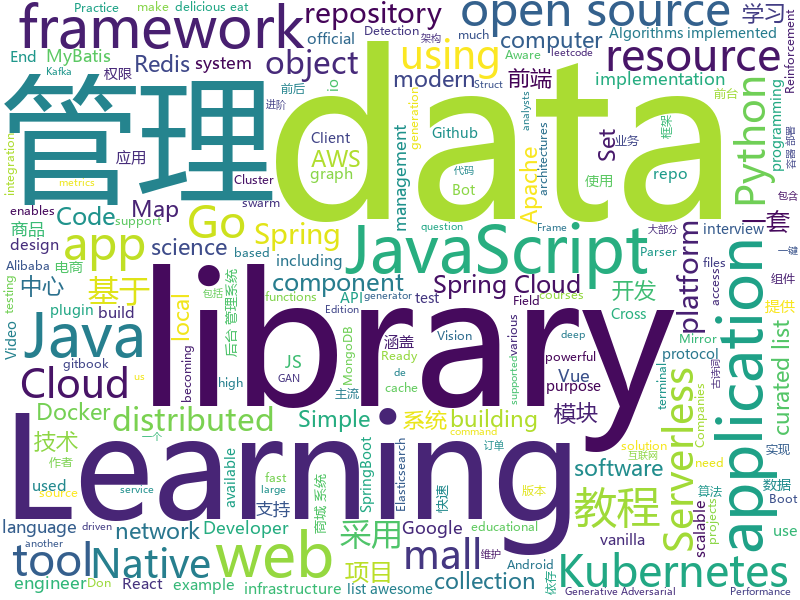

# 2020-09-16
See what the GitHub community is most excited about.

## python
+ [CVE-2020-1472](https://github.com/SecuraBV/CVE-2020-1472)(**202 stars today**): Test tool for CVE-2020-1472
+ [CVE-2020-1472](https://github.com/dirkjanm/CVE-2020-1472)(**152 stars today**): PoC for Zerologon - all research credits go to Tom Tervoort of Secura
+ [eat_tensorflow2_in_30_days](https://github.com/lyhue1991/eat_tensorflow2_in_30_days)(**38 stars today**): Tensorflow2.0🍎🍊is delicious, just eat it!😋😋
+ [DAIN](https://github.com/baowenbo/DAIN)(**202 stars today**): Depth-Aware Video Frame Interpolation (CVPR 2019)
+ [EasyOCR](https://github.com/JaidedAI/EasyOCR)(**27 stars today**): Ready-to-use OCR with 40+ languages supported including Chinese, Japanese, Korean and Thai
+ [Python](https://github.com/TheAlgorithms/Python)(**255 stars today**): All Algorithms implemented in Python
+ [PyTorch-GAN](https://github.com/eriklindernoren/PyTorch-GAN)(**27 stars today**): PyTorch implementations of Generative Adversarial Networks.
+ [pandas](https://github.com/pandas-dev/pandas)(**20 stars today**): Flexible and powerful data analysis / manipulation library for Python, providing labeled data structures similar to R data.frame objects, statistical functions, and much more
+ [pytorch-gans](https://github.com/gordicaleksa/pytorch-gans)(**53 stars today**): My implementation of various GAN (generative adversarial networks) architectures like vanilla GAN, cGAN, DCGAN, etc.
+ [redteam-research](https://github.com/blackarrowsec/redteam-research)(**53 stars today**): Collection of PoC and offensive techniques used by the BlackArrow Red Team
+ [whapa](https://github.com/B16f00t/whapa)(**14 stars today**): WhatsApp Parser Toolset v1.20
+ [eat_pytorch_in_20_days](https://github.com/lyhue1991/eat_pytorch_in_20_days)(**67 stars today**): Pytorch🍊🍉is delicious, just eat it!😋😋
+ [HanLP](https://github.com/hankcs/HanLP)(**12 stars today**): 中文分词 词性标注 命名实体识别 依存句法分析 语义依存分析 新词发现 关键词短语提取 自动摘要 文本分类聚类 拼音简繁转换 自然语言处理
+ [detr](https://github.com/facebookresearch/detr)(**8 stars today**): End-to-End Object Detection with Transformers
+ [ml-road](https://github.com/yanshengjia/ml-road)(**5 stars today**): Machine Learning Resources, Practice and Research
+ [impacket](https://github.com/SecureAuthCorp/impacket)(**21 stars today**): Impacket is a collection of Python classes for working with network protocols.
+ [synapse](https://github.com/matrix-org/synapse)(**11 stars today**): Synapse: Matrix reference homeserver
+ [dbt](https://github.com/fishtown-analytics/dbt)(**13 stars today**): dbt (data build tool) enables data analysts and engineers to transform their data using the same practices that software engineers use to build applications.
+ [opentelemetry-python](https://github.com/open-telemetry/opentelemetry-python)(**1 stars today**): The OpenTelemetry Python Client
+ [localstack](https://github.com/localstack/localstack)(**18 stars today**): 💻A fully functional local AWS cloud stack. Develop and test your cloud & Serverless apps offline!
+ [airflow](https://github.com/apache/airflow)(**20 stars today**): Apache Airflow - A platform to programmatically author, schedule, and monitor workflows
+ [detectron2](https://github.com/facebookresearch/detectron2)(**27 stars today**): Detectron2 is FAIR's next-generation platform for object detection and segmentation.
+ [requests](https://github.com/psf/requests)(**7 stars today**): A simple, yet elegant HTTP library.
+ [DeepSpeed](https://github.com/microsoft/DeepSpeed)(**49 stars today**): DeepSpeed is a deep learning optimization library that makes distributed training easy, efficient, and effective.
+ [ray](https://github.com/ray-project/ray)(**18 stars today**): An open source framework that provides a simple, universal API for building distributed applications. Ray is packaged with RLlib, a scalable reinforcement learning library, and Tune, a scalable hyperparameter tuning library.

## java
+ [mall-swarm](https://github.com/macrozheng/mall-swarm)(**94 stars today**): mall-swarm是一套微服务商城系统，采用了 Spring Cloud Hoxton & Alibaba、Spring Boot 2.3、Oauth2、MyBatis、Docker、Elasticsearch等核心技术，同时提供了基于Vue的管理后台方便快速搭建系统。mall-swarm在电商业务的基础集成了注册中心、配置中心、监控中心、网关等系统功能。文档齐全，附带全套Spring Cloud教程。
+ [elasticsearch](https://github.com/elastic/elasticsearch)(**24 stars today**): Open Source, Distributed, RESTful Search Engine
+ [DeepVision](https://github.com/peng-zhihui/DeepVision)(**64 stars today**): 在我很多项目中用到的CV算法推理框架应用。
+ [springcloud-learning](https://github.com/macrozheng/springcloud-learning)(**41 stars today**): 一套涵盖大部分核心组件使用的Spring Cloud教程，包括Spring Cloud Alibaba及分布式事务Seata，基于Spring Cloud Greenwich及SpringBoot 2.1.7。21篇文章，篇篇精华，32个Demo，涵盖大部分应用场景。
+ [react-native-video](https://github.com/react-native-community/react-native-video)(**7 stars today**): A <Video /> component for react-native
+ [Adapt-Stage-2-Java](https://github.com/iamsomraj/Adapt-Stage-2-Java)(**6 stars today**): This is a repository, containing the solutions of Adapt. I have made this repo for only educational purpose of mine.
+ [mall-learning](https://github.com/macrozheng/mall-learning)(**20 stars today**): mall学习教程，架构、业务、技术要点全方位解析。mall项目（39k+star）是一套电商系统，使用现阶段主流技术实现。涵盖了SpringBoot 2.3.0、MyBatis 3.4.6、Elasticsearch 7.6.2、RabbitMQ 3.7.15、Redis 5.0、MongoDB 4.2.5、Mysql5.7等技术，采用Docker容器化部署。
+ [termux-app](https://github.com/termux/termux-app)(**15 stars today**): Android terminal and Linux environment - app repository.
+ [QR-Code-generator](https://github.com/nayuki/QR-Code-generator)(**1 stars today**): High-quality QR Code generator library in Java, TypeScript/JavaScript, Python, C++, C, Rust.
+ [antlr4](https://github.com/antlr/antlr4)(**10 stars today**): ANTLR (ANother Tool for Language Recognition) is a powerful parser generator for reading, processing, executing, or translating structured text or binary files.
+ [mall](https://github.com/macrozheng/mall)(**57 stars today**): mall项目是一套电商系统，包括前台商城系统及后台管理系统，基于SpringBoot+MyBatis实现，采用Docker容器化部署。 前台商城系统包含首页门户、商品推荐、商品搜索、商品展示、购物车、订单流程、会员中心、客户服务、帮助中心等模块。 后台管理系统包含商品管理、订单管理、会员管理、促销管理、运营管理、内容管理、统计报表、财务管理、权限管理、设置等模块。
+ [easy163](https://github.com/ndroi/easy163)(**30 stars today**): 安卓端一键解锁网易云音乐，无须 ROOT
+ [canal](https://github.com/alibaba/canal)(**15 stars today**): 阿里巴巴 MySQL binlog 增量订阅&消费组件
+ [neo4j](https://github.com/neo4j/neo4j)(**7 stars today**): Graphs for Everyone
+ [react-native-push-notification](https://github.com/zo0r/react-native-push-notification)(**3 stars today**): React Native Local and Remote Notifications
+ [Java](https://github.com/TheAlgorithms/Java)(**27 stars today**): All Algorithms implemented in Java
+ [keycloak](https://github.com/keycloak/keycloak)(**11 stars today**): Open Source Identity and Access Management For Modern Applications and Services
+ [MCreator](https://github.com/MCreator/MCreator)(**2 stars today**): MCreator is a software used to make Minecraft Java Edition mods, Bedrock Edition Add-Ons, and data packs using visual graphical programming or integrated IDE.
+ [redisson](https://github.com/redisson/redisson)(**19 stars today**): Redisson - Redis Java client with features of In-Memory Data Grid. Over 50 Redis based Java objects and services: Set, Multimap, SortedSet, Map, List, Queue, Deque, Semaphore, Lock, AtomicLong, Map Reduce, Publish / Subscribe, Bloom filter, Spring Cache, Tomcat, Scheduler, JCache API, Hibernate, MyBatis, RPC, local cache ...
+ [eladmin](https://github.com/elunez/eladmin)(**26 stars today**): 项目基于 Spring Boot 2.1.0 、 Jpa、 Spring Security、redis、Vue的前后端分离的后台管理系统，项目采用分模块开发方式， 权限控制采用 RBAC，支持数据字典与数据权限管理，支持一键生成前后端代码，支持动态路由
+ [kafka](https://github.com/apache/kafka)(**11 stars today**): Mirror of Apache Kafka
+ [MVVMHabit](https://github.com/goldze/MVVMHabit)(**5 stars today**): 👕基于谷歌最新AAC架构，MVVM设计模式的一套快速开发库，整合Okhttp+RxJava+Retrofit+Glide等主流模块，满足日常开发需求。使用该框架可以快速开发一个高质量、易维护的Android应用。
+ [camel](https://github.com/apache/camel)(**2 stars today**): Apache Camel is an open source integration framework that empowers you to quickly and easily integrate various systems consuming or producing data.
+ [tech-interview-for-developer](https://github.com/gyoogle/tech-interview-for-developer)(**11 stars today**): 👶🏻 신입 개발자 전공 지식 & 기술 면접 백과사전📖
+ [caffeine](https://github.com/ben-manes/caffeine)(**12 stars today**): A high performance caching library for Java 8

## unknown
+ [low-level-design-primer](https://github.com/prasadgujar/low-level-design-primer)(**224 stars today**): Dedicated Resources for the Low-Level System Design. Learn how to design and implement large-scale systems. Prep for the system design interview.
+ [developer-roadmap](https://github.com/kamranahmedse/developer-roadmap)(**370 stars today**): Roadmap to becoming a web developer in 2020
+ [coding-interview-university](https://github.com/jwasham/coding-interview-university)(**352 stars today**): A complete computer science study plan to become a software engineer.
+ [learning](https://github.com/amitness/learning)(**198 stars today**): Becoming 1% better at data science everyday
+ [you-dont-know-js-ru](https://github.com/azat-io/you-dont-know-js-ru)(**6 stars today**): 📚Russian translation of "You Don't Know JS" book series
+ [leetcode_company_wise_questions](https://github.com/MysteryVaibhav/leetcode_company_wise_questions)(**132 stars today**): This is a repository containing the list of company wise questions available on leetcode premium
+ [deep-learning-drizzle](https://github.com/kmario23/deep-learning-drizzle)(**63 stars today**): Drench yourself in Deep Learning, Reinforcement Learning, Machine Learning, Computer Vision, and NLP by learning from these exciting lectures!!
+ [SurviveSJTUManual](https://github.com/SurviveSJTU/SurviveSJTUManual)(**27 stars today**): 更新2008年版本的《上海交通大学生存手册》gitbook发布于https://liankeqin.gitbook.io/survivesjtumanual/
+ [xiaobaiyang](https://github.com/liupan1890/xiaobaiyang)(**17 stars today**): 
+ [CodeGuide](https://github.com/fuzhengwei/CodeGuide)(**27 stars today**): 📚本代码库是作者小傅哥多年从事一线互联网 Java 开发的学习历程技术汇总，旨在为大家提供一个清晰详细的学习教程，侧重点更倾向编写Java核心内容。如果本仓库能为您提供帮助，请给予支持(关注、点赞、分享)！
+ [Specs](https://github.com/CocoaPods/Specs)(**4 stars today**): The CocoaPods Master Repo
+ [machine-learning-interview](https://github.com/khangich/machine-learning-interview)(**17 stars today**): Machine Learning Interviews from FAAG, Snapchat, LinkedIn.
+ [chromium](https://github.com/chromium/chromium)(**16 stars today**): The official GitHub mirror of the Chromium source
+ [what-happens-when](https://github.com/alex/what-happens-when)(**17 stars today**): An attempt to answer the age old interview question "What happens when you type google.com into your browser and press enter?"
+ [Poetry](https://github.com/Werneror/Poetry)(**50 stars today**): 非常全的古诗词数据，收录了从先秦到现代的共计85万余首古诗词。
+ [curso-intro-javascript](https://github.com/makeitrealcamp/curso-intro-javascript)(**9 stars today**): 
+ [fucking-algorithm](https://github.com/labuladong/fucking-algorithm)(**189 stars today**): 刷算法全靠套路，认准 labuladong 就够了！English version supported! Crack LeetCode, not only how, but also why.
+ [Python](https://github.com/TwoWater/Python)(**13 stars today**): 最良心的 Python 教程：
+ [awesome-k8s-resources](https://github.com/tomhuang12/awesome-k8s-resources)(**12 stars today**): A curated list of awesome Kubernetes tools and resources.
+ [stats-illustrations](https://github.com/allisonhorst/stats-illustrations)(**54 stars today**): R & stats illustrations by @allison_horst
+ [awesome-spring](https://github.com/ThomasVitale/awesome-spring)(**6 stars today**): A curated list of awesome books, tutorials, courses, and resources for the Spring framework ecosystem.
+ [open-product-management](https://github.com/ProductHired/open-product-management)(**4 stars today**): A curated list of product management advice for technical people.
+ [awesome-computer-vision](https://github.com/jbhuang0604/awesome-computer-vision)(**13 stars today**): A curated list of awesome computer vision resources
+ [CKAD-exercises](https://github.com/dgkanatsios/CKAD-exercises)(**12 stars today**): A set of exercises to prepare for Certified Kubernetes Application Developer exam by Cloud Native Computing Foundation
+ [GNNPapers](https://github.com/thunlp/GNNPapers)(**15 stars today**): Must-read papers on graph neural networks (GNN)

## javascript
+ [moment](https://github.com/moment/moment)(**31 stars today**): Parse, validate, manipulate, and display dates in javascript.
+ [react-native](https://github.com/facebook/react-native)(**31 stars today**): A framework for building native apps with React.
+ [jsPDF](https://github.com/MrRio/jsPDF)(**19 stars today**): Client-side JavaScript PDF generation for everyone.
+ [Javascript](https://github.com/TheAlgorithms/Javascript)(**38 stars today**): A repository for All algorithms implemented in Javascript (for educational purposes only)
+ [create-react-app](https://github.com/facebook/create-react-app)(**37 stars today**): Set up a modern web app by running one command.
+ [gatsby](https://github.com/gatsbyjs/gatsby)(**19 stars today**): Build blazing fast, modern apps and websites with React
+ [examples](https://github.com/serverless/examples)(**6 stars today**): Serverless Examples – A collection of boilerplates and examples of serverless architectures built with the Serverless Framework on AWS Lambda, Microsoft Azure, Google Cloud Functions, and more.
+ [jitsi-meet](https://github.com/jitsi/jitsi-meet)(**15 stars today**): Jitsi Meet - Secure, Simple and Scalable Video Conferences that you use as a standalone app or embed in your web application.
+ [react-native-keyboard-aware-scroll-view](https://github.com/APSL/react-native-keyboard-aware-scroll-view)(**8 stars today**): A ScrollView component that handles keyboard appearance and automatically scrolls to focused TextInput.
+ [edex-ui](https://github.com/GitSquared/edex-ui)(**24 stars today**): A cross-platform, customizable science fiction terminal emulator with advanced monitoring & touchscreen support.
+ [aws-serverless-workshops](https://github.com/aws-samples/aws-serverless-workshops)(**9 stars today**): Code and walkthrough labs to set up serverless applications for Wild Rydes workshops
+ [Inputmask](https://github.com/RobinHerbots/Inputmask)(**3 stars today**): Input Mask plugin
+ [hiring-without-whiteboards](https://github.com/poteto/hiring-without-whiteboards)(**18 stars today**): ⭐️Companies that don't have a broken hiring process
+ [vue](https://github.com/vuejs/vue)(**91 stars today**): 🖖Vue.js is a progressive, incrementally-adoptable JavaScript framework for building UI on the web.
+ [Web](https://github.com/qianguyihao/Web)(**39 stars today**): 前端入门到进阶图文教程，超详细的Web前端学习笔记。从零开始学前端，做一名精致优雅的前端工程师。公众号「千古壹号」作者。
+ [shapez.io](https://github.com/tobspr/shapez.io)(**17 stars today**): shapez.io is an open source base building game inspired by factorio! Available on web & desktop
+ [react-virtualized](https://github.com/bvaughn/react-virtualized)(**13 stars today**): React components for efficiently rendering large lists and tabular data
+ [cesium](https://github.com/CesiumGS/cesium)(**6 stars today**): An open-source JavaScript library for world-class 3D globes and maps🌎
+ [tasks](https://github.com/rolling-scopes-school/tasks)(**4 stars today**): 
+ [pipedream](https://github.com/PipedreamHQ/pipedream)(**112 stars today**): Serverless integration and compute platform. Free for developers.
+ [Vue.Draggable](https://github.com/SortableJS/Vue.Draggable)(**18 stars today**): Vue drag-and-drop component based on Sortable.js
+ [react-slack-clone](https://github.com/aakash-cr7/react-slack-clone)(**5 stars today**): A slack clone using React and Firebase.
+ [slick](https://github.com/kenwheeler/slick)(**6 stars today**): the last carousel you'll ever need
+ [bootstrap-select](https://github.com/snapappointments/bootstrap-select)(**3 stars today**): 🚀The jQuery plugin that brings select elements into the 21st century with intuitive multiselection, searching, and much more.
+ [imageToSticker](https://github.com/YogaSakti/imageToSticker)(**3 stars today**): Whatsapp Bot - sticker creator

## html
+ [JavaScript30](https://github.com/wesbos/JavaScript30)(**19 stars today**): 30 Day Vanilla JS Challenge
+ [tools](https://github.com/googlecodelabs/tools)(**52 stars today**): Codelabs management & hosting tools
+ [zenbot](https://github.com/DeviaVir/zenbot)(**21 stars today**): Zenbot is a command-line cryptocurrency trading bot using Node.js and MongoDB.
+ [learning-area](https://github.com/mdn/learning-area)(**4 stars today**): Github repo for the MDN Learning Area.
+ [hyperblog](https://github.com/freddier/hyperblog)(**13 stars today**): Un blog increíble para el curso de Git y Github de Platzi
+ [wpt](https://github.com/web-platform-tests/wpt)(**3 stars today**): Test suites for Web platform specs — including WHATWG, W3C, and others
+ [styleguide](https://github.com/google/styleguide)(**11 stars today**): Style guides for Google-originated open-source projects
+ [docker-development-youtube-series](https://github.com/marcel-dempers/docker-development-youtube-series)(**4 stars today**): 
+ [Java-Interview-Advanced](https://github.com/shishan100/Java-Interview-Advanced)(**4 stars today**): 中华石杉--互联网Java进阶面试训练营
+ [webdevbootcamp](https://github.com/nax3t/webdevbootcamp)(**7 stars today**): All source code for back-end projects from the Web Developer Bootcamp
+ [edge-developer](https://github.com/MicrosoftDocs/edge-developer)(**0 stars today**): Developer documentation for Edge.
+ [3d-force-graph](https://github.com/vasturiano/3d-force-graph)(**3 stars today**): 3D force-directed graph component using ThreeJS/WebGL
+ [amundsen](https://github.com/amundsen-io/amundsen)(**2 stars today**): Amundsen is a metadata driven application for improving the productivity of data analysts, data scientists and engineers when interacting with data.
+ [ctf-wiki](https://github.com/ctf-wiki/ctf-wiki)(**13 stars today**): CTF Wiki Online. Come and join us, we need you!
+ [Server](https://github.com/PanDownloadServer/Server)(**204 stars today**): PanDownload的个人维护版本
+ [cypress-example-kitchensink](https://github.com/cypress-io/cypress-example-kitchensink)(**1 stars today**): This is an example app used to showcase Cypress.io testing.
+ [charts](https://github.com/bitnami/charts)(**10 stars today**): Helm Charts
+ [howtheytest](https://github.com/abhivaikar/howtheytest)(**28 stars today**): A collection of public resources about how software companies test their software
+ [KETE-HS20-WORK](https://github.com/sawubona-gmbh/KETE-HS20-WORK)(**3 stars today**): Public Repository for WINF KETE (HS20) Students and their Programming Projects
+ [mermaid-live-editor](https://github.com/mermaid-js/mermaid-live-editor)(**3 stars today**): New implementation of the live editor
+ [tidytuesday](https://github.com/rfordatascience/tidytuesday)(**2 stars today**): Official repo for the #tidytuesday project
+ [kubespray](https://github.com/kubernetes-sigs/kubespray)(**3 stars today**): Deploy a Production Ready Kubernetes Cluster
+ [REKCARC-TSC-UHT](https://github.com/PKUanonym/REKCARC-TSC-UHT)(**6 stars today**): 清华大学计算机系课程攻略 Guidance for courses in Department of Computer Science and Technology, Tsinghua University
+ [tiny-slider](https://github.com/ganlanyuan/tiny-slider)(**3 stars today**): Vanilla javascript slider for all purposes.
+ [rellax](https://github.com/dixonandmoe/rellax)(**3 stars today**): Lightweight, vanilla javascript parallax library

## go
+ [vault](https://github.com/hashicorp/vault)(**110 stars today**): A tool for secrets management, encryption as a service, and privileged access management
+ [trivy](https://github.com/aquasecurity/trivy)(**13 stars today**): A Simple and Comprehensive Vulnerability Scanner for Containers, Suitable for CI
+ [telegraf](https://github.com/influxdata/telegraf)(**14 stars today**): The plugin-driven server agent for collecting & reporting metrics.
+ [go-ethereum](https://github.com/ethereum/go-ethereum)(**14 stars today**): Official Go implementation of the Ethereum protocol
+ [validator](https://github.com/go-playground/validator)(**11 stars today**): 💯Go Struct and Field validation, including Cross Field, Cross Struct, Map, Slice and Array diving
+ [ent](https://github.com/facebook/ent)(**20 stars today**): An entity framework for Go
+ [terraform-provider-aws](https://github.com/terraform-providers/terraform-provider-aws)(**7 stars today**): Terraform AWS provider
+ [consul](https://github.com/hashicorp/consul)(**13 stars today**): Consul is a distributed, highly available, and data center aware solution to connect and configure applications across dynamic, distributed infrastructure.
+ [amongusdiscord](https://github.com/denverquane/amongusdiscord)(**20 stars today**): Discord Bot to scrape Among Us on-screen data and automatically mute players between rounds
+ [aws-sdk-go](https://github.com/aws/aws-sdk-go)(**5 stars today**): AWS SDK for the Go programming language.
+ [pipeline](https://github.com/tektoncd/pipeline)(**8 stars today**): A K8s-native Pipeline resource.
+ [kind](https://github.com/kubernetes-sigs/kind)(**16 stars today**): Kubernetes IN Docker - local clusters for testing Kubernetes
+ [yarr](https://github.com/nkanaev/yarr)(**49 stars today**): yet another rss reader
+ [minio](https://github.com/minio/minio)(**29 stars today**): High Performance, Kubernetes Native Object Storage
+ [argo-cd](https://github.com/argoproj/argo-cd)(**12 stars today**): Declarative continuous deployment for Kubernetes.
+ [eksctl](https://github.com/weaveworks/eksctl)(**5 stars today**): The official CLI for Amazon EKS
+ [influxdb](https://github.com/influxdata/influxdb)(**37 stars today**): Scalable datastore for metrics, events, and real-time analytics
+ [govmomi](https://github.com/vmware/govmomi)(**2 stars today**): Go library for the VMware vSphere API
+ [logrus](https://github.com/sirupsen/logrus)(**20 stars today**): Structured, pluggable logging for Go.
+ [terraform](https://github.com/hashicorp/terraform)(**16 stars today**): Terraform enables you to safely and predictably create, change, and improve infrastructure. It is an open source tool that codifies APIs into declarative configuration files that can be shared amongst team members, treated as code, edited, reviewed, and versioned.
+ [protobuf](https://github.com/golang/protobuf)(**1 stars today**): Go support for Google's protocol buffers
+ [pulumi](https://github.com/pulumi/pulumi)(**10 stars today**): Pulumi - Modern Infrastructure as Code. Any cloud, any language🚀
+ [aws-alb-ingress-controller](https://github.com/kubernetes-sigs/aws-alb-ingress-controller)(**2 stars today**): AWS ALB Ingress Controller for Kubernetes
+ [confluent-kafka-go](https://github.com/confluentinc/confluent-kafka-go)(**5 stars today**): Confluent's Apache Kafka Golang client
+ [esbuild](https://github.com/evanw/esbuild)(**28 stars today**): An extremely fast JavaScript bundler and minifier

## WordCloud

