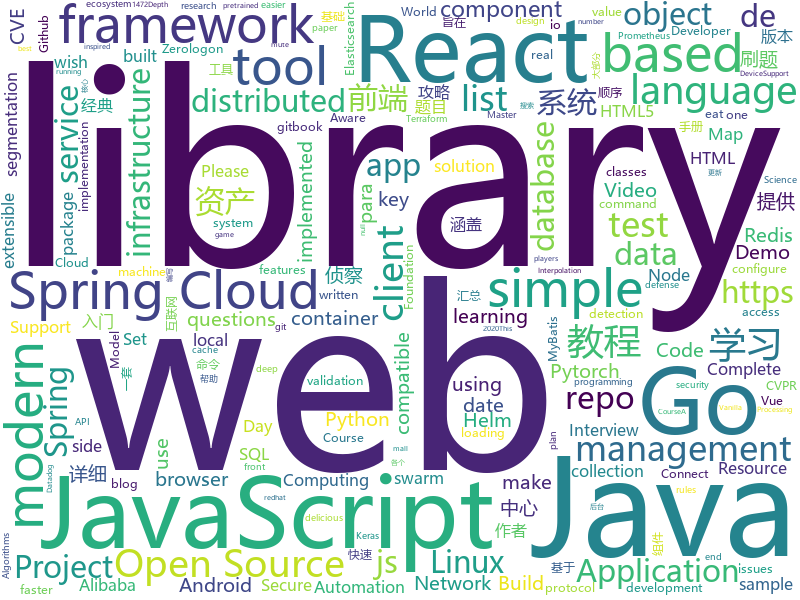

# 2020-09-17
See what the GitHub community is most excited about.

## python
+ [CVE-2020-1472](https://github.com/SecuraBV/CVE-2020-1472)(**153 stars today**): Test tool for CVE-2020-1472
+ [DAIN](https://github.com/baowenbo/DAIN)(**310 stars today**): Depth-Aware Video Frame Interpolation (CVPR 2019)
+ [jazzit](https://github.com/Sangarshanan/jazzit)(**146 stars today**): Laughs at your expense
+ [EasyOCR](https://github.com/JaidedAI/EasyOCR)(**101 stars today**): Ready-to-use OCR with 40+ languages supported including Chinese, Japanese, Korean and Thai
+ [CVE-2020-1472](https://github.com/dirkjanm/CVE-2020-1472)(**109 stars today**): PoC for Zerologon - all research credits go to Tom Tervoort of Secura
+ [ARL](https://github.com/TophantTechnology/ARL)(**98 stars today**): ARL(Asset Reconnaissance Lighthouse)资产侦察灯塔系统旨在快速侦察与目标关联的互联网资产，构建基础资产信息库。 协助甲方安全团队或者渗透测试人员有效侦察和检索资产，发现存在的薄弱点和攻击面。
+ [eat_tensorflow2_in_30_days](https://github.com/lyhue1991/eat_tensorflow2_in_30_days)(**106 stars today**): Tensorflow2.0🍎🍊is delicious, just eat it!😋😋
+ [generative_inpainting](https://github.com/JiahuiYu/generative_inpainting)(**25 stars today**): DeepFill v1/v2 with Contextual Attention and Gated Convolution, CVPR 2018, and ICCV 2019 Oral
+ [Background-Matting](https://github.com/senguptaumd/Background-Matting)(**24 stars today**): Background Matting: The World is Your Green Screen
+ [Mask_RCNN](https://github.com/matterport/Mask_RCNN)(**12 stars today**): Mask R-CNN for object detection and instance segmentation on Keras and TensorFlow
+ [numpy](https://github.com/numpy/numpy)(**19 stars today**): The fundamental package for scientific computing with Python.
+ [horovod](https://github.com/horovod/horovod)(**7 stars today**): Distributed training framework for TensorFlow, Keras, PyTorch, and Apache MXNet.
+ [mmsegmentation](https://github.com/open-mmlab/mmsegmentation)(**11 stars today**): OpenMMLab Semantic Segmentation Toolbox and Benchmark.
+ [eat_pytorch_in_20_days](https://github.com/lyhue1991/eat_pytorch_in_20_days)(**73 stars today**): Pytorch🍊🍉is delicious, just eat it!😋😋
+ [rex-gym](https://github.com/nicrusso7/rex-gym)(**30 stars today**): OpenAI Gym environments for an open-source quadruped robot (SpotMicro)
+ [zer0dump](https://github.com/bb00/zer0dump)(**22 stars today**): Abuse CVE-2020-1472 (Zerologon) to take over a domain and then repair the local stored machine account password.
+ [rewriting](https://github.com/davidbau/rewriting)(**17 stars today**): Rewriting a Deep Generative Model, ECCV 2020 (oral). Interactive tool to directly edit the rules of a GAN to synthesize scenes with objects added, removed, or altered. Change StyleGANv2 to make extravagant eyebrows, or horses wearing hats.
+ [Yet-Another-EfficientDet-Pytorch](https://github.com/zylo117/Yet-Another-EfficientDet-Pytorch)(**4 stars today**): The pytorch re-implement of the official efficientdet with SOTA performance in real time and pretrained weights.
+ [adversary_emulation_library](https://github.com/center-for-threat-informed-defense/adversary_emulation_library)(**42 stars today**): An open library of adversary emulation plans designed to empower organizations to test their defenses based on real-world TTPs.
+ [CVE-2020-1472](https://github.com/VoidSec/CVE-2020-1472)(**12 stars today**): Exploit Code for CVE-2020-1472 aka Zerologon
+ [sudoku-solver](https://github.com/remi2257/sudoku-solver)(**13 stars today**): Smart solution to solve sudoku in VR
+ [espnet](https://github.com/espnet/espnet)(**7 stars today**): End-to-End Speech Processing Toolkit
+ [hue](https://github.com/cloudera/hue)(**2 stars today**): Open source SQL Query Assistant for Databases/Warehouses
+ [impacket](https://github.com/SecureAuthCorp/impacket)(**13 stars today**): Impacket is a collection of Python classes for working with network protocols.
+ [models](https://github.com/tensorflow/models)(**27 stars today**): Models and examples built with TensorFlow

## java
+ [tribuo](https://github.com/oracle/tribuo)(**59 stars today**): Tribuo - A Java machine learning library
+ [spring-framework](https://github.com/spring-projects/spring-framework)(**25 stars today**): Spring Framework
+ [quarkus](https://github.com/quarkusio/quarkus)(**10 stars today**): Quarkus: Supersonic Subatomic Java.
+ [elasticsearch](https://github.com/elastic/elasticsearch)(**60 stars today**): Open Source, Distributed, RESTful Search Engine
+ [java-design-patterns](https://github.com/iluwatar/java-design-patterns)(**34 stars today**): Design patterns implemented in Java
+ [mall-swarm](https://github.com/macrozheng/mall-swarm)(**117 stars today**): mall-swarm是一套微服务商城系统，采用了 Spring Cloud Hoxton & Alibaba、Spring Boot 2.3、Oauth2、MyBatis、Docker、Elasticsearch等核心技术，同时提供了基于Vue的管理后台方便快速搭建系统。mall-swarm在电商业务的基础集成了注册中心、配置中心、监控中心、网关等系统功能。文档齐全，附带全套Spring Cloud教程。
+ [spring-petclinic](https://github.com/spring-projects/spring-petclinic)(**6 stars today**): A sample Spring-based application
+ [tutorials](https://github.com/eugenp/tutorials)(**17 stars today**): Just Announced - "Learn Spring Security OAuth":
+ [Mindustry](https://github.com/Anuken/Mindustry)(**5 stars today**): A sandbox tower defense game
+ [Java](https://github.com/TheAlgorithms/Java)(**26 stars today**): All Algorithms implemented in Java
+ [redisson](https://github.com/redisson/redisson)(**27 stars today**): Redisson - Redis Java client with features of In-Memory Data Grid. Over 50 Redis based Java objects and services: Set, Multimap, SortedSet, Map, List, Queue, Deque, Semaphore, Lock, AtomicLong, Map Reduce, Publish / Subscribe, Bloom filter, Spring Cache, Tomcat, Scheduler, JCache API, Hibernate, MyBatis, RPC, local cache ...
+ [keycloak](https://github.com/keycloak/keycloak)(**14 stars today**): Open Source Identity and Access Management For Modern Applications and Services
+ [selenium](https://github.com/SeleniumHQ/selenium)(**12 stars today**): A browser automation framework and ecosystem.
+ [Java](https://github.com/DuGuQiuBai/Java)(**13 stars today**): 27天成为Java大神
+ [springcloud-learning](https://github.com/macrozheng/springcloud-learning)(**45 stars today**): 一套涵盖大部分核心组件使用的Spring Cloud教程，包括Spring Cloud Alibaba及分布式事务Seata，基于Spring Cloud Greenwich及SpringBoot 2.1.7。21篇文章，篇篇精华，32个Demo，涵盖大部分应用场景。
+ [zxing-android-embedded](https://github.com/journeyapps/zxing-android-embedded)(**4 stars today**): Barcode scanner library for Android, based on the ZXing decoder
+ [debezium](https://github.com/debezium/debezium)(**7 stars today**): Change data capture for a variety of databases. Please log issues at https://issues.redhat.com/browse/DBZ.
+ [kafka-connect-jdbc](https://github.com/confluentinc/kafka-connect-jdbc)(**1 stars today**): Kafka Connect connector for JDBC-compatible databases
+ [reactor-core](https://github.com/reactor/reactor-core)(**4 stars today**): Non-Blocking Reactive Foundation for the JVM
+ [spring-cloud-commons](https://github.com/spring-cloud/spring-cloud-commons)(**0 stars today**): Common classes used in different Spring Cloud implementations
+ [dbeaver](https://github.com/dbeaver/dbeaver)(**19 stars today**): Free universal database tool and SQL client
+ [ARouter](https://github.com/alibaba/ARouter)(**5 stars today**): 💪A framework for assisting in the renovation of Android componentization (帮助 Android App 进行组件化改造的路由框架)
+ [react-native-video](https://github.com/react-native-community/react-native-video)(**8 stars today**): A <Video /> component for react-native
+ [mockito](https://github.com/mockito/mockito)(**7 stars today**): Most popular Mocking framework for unit tests written in Java
+ [BigData-Notes](https://github.com/heibaiying/BigData-Notes)(**14 stars today**): 大数据入门指南⭐

## unknown
+ [onefuzz](https://github.com/microsoft/onefuzz)(**296 stars today**): A self-hosted Fuzzing-As-A-Service platform
+ [developer-roadmap](https://github.com/kamranahmedse/developer-roadmap)(**466 stars today**): Roadmap to becoming a web developer in 2020
+ [leetcode-master](https://github.com/youngyangyang04/leetcode-master)(**15 stars today**): LeetCode 刷题攻略：配思维导图，各个类型的经典题目刷题顺序、经典算法模板，以及详细图解和视频题解。这里精选的题目都不是孤立的，而是由浅入深一脉相承的，相信只要按照刷题攻略上的顺序来学习，一定会有所收获！
+ [CodeGuide](https://github.com/fuzhengwei/CodeGuide)(**11 stars today**): 📚本代码库是作者小傅哥多年从事一线互联网 Java 开发的学习历程技术汇总，旨在为大家提供一个清晰详细的学习教程，侧重点更倾向编写Java核心内容。如果本仓库能为您提供帮助，请给予支持(关注、点赞、分享)！
+ [iPhoneOSDeviceSupport](https://github.com/filsv/iPhoneOSDeviceSupport)(**19 stars today**): Xcode iPhoneOS DeviceSupport files (6.0 - 14.0)
+ [awesome-blazor](https://github.com/AdrienTorris/awesome-blazor)(**9 stars today**): Resources for Blazor, a .NET web framework using C#/Razor and HTML that runs in the browser with WebAssembly.
+ [coding-interview-university](https://github.com/jwasham/coding-interview-university)(**309 stars today**): A complete computer science study plan to become a software engineer.
+ [personal-security-checklist](https://github.com/Lissy93/personal-security-checklist)(**10 stars today**): 🔒A curated checklist of 300+ tips for protecting digital security and privacy in 2020
+ [annotated_research_papers](https://github.com/AakashKumarNain/annotated_research_papers)(**33 stars today**): This repo contains annotated research papers that I found really good and useful
+ [IntelliJ-IDEA-2020.2.1-solve](https://github.com/shipofsea/IntelliJ-IDEA-2020.2.1-solve)(**4 stars today**): 
+ [Specs](https://github.com/CocoaPods/Specs)(**3 stars today**): The CocoaPods Master Repo
+ [desafio-8-2020](https://github.com/maratonadev-br/desafio-8-2020)(**4 stars today**): 
+ [xiaobaiyang](https://github.com/liupan1890/xiaobaiyang)(**15 stars today**): 
+ [awesome-github-vue](https://github.com/opendigg/awesome-github-vue)(**6 stars today**): Vue相关开源项目库汇总
+ [javascript-questions](https://github.com/lydiahallie/javascript-questions)(**24 stars today**): A long list of (advanced) JavaScript questions, and their explanations✨
+ [SurviveSJTUManual](https://github.com/SurviveSJTU/SurviveSJTUManual)(**9 stars today**): 更新2008年版本的《上海交通大学生存手册》gitbook发布于https://liankeqin.gitbook.io/survivesjtumanual/
+ [deep_learning_object_detection](https://github.com/hoya012/deep_learning_object_detection)(**11 stars today**): A paper list of object detection using deep learning.
+ [awesome](https://github.com/sindresorhus/awesome)(**58 stars today**): 😎Awesome lists about all kinds of interesting topics
+ [vagas](https://github.com/frontendbr/vagas)(**6 stars today**): 🔬Espaço para divulgação de vagas para front-enders.
+ [Interview_Question_for_Beginner](https://github.com/JaeYeopHan/Interview_Question_for_Beginner)(**11 stars today**): 👦👧Technical-Interview guidelines written for those who started studying programming. I wish you all the best.👾
+ [Network-Activation-Code](https://github.com/potatogm/Network-Activation-Code)(**1 stars today**): Potato Network Activation Code
+ [Beginner-Network-Pentesting](https://github.com/hmaverickadams/Beginner-Network-Pentesting)(**9 stars today**): Notes for Beginner Network Pentesting Course
+ [CKAD-exercises](https://github.com/dgkanatsios/CKAD-exercises)(**5 stars today**): A set of exercises to prepare for Certified Kubernetes Application Developer exam by Cloud Native Computing Foundation
+ [Python](https://github.com/TwoWater/Python)(**16 stars today**): 最良心的 Python 教程：
+ [the-art-of-command-line](https://github.com/jlevy/the-art-of-command-line)(**26 stars today**): Master the command line, in one page

## javascript
+ [create-react-app](https://github.com/facebook/create-react-app)(**37 stars today**): Set up a modern web app by running one command.
+ [javascript](https://github.com/airbnb/javascript)(**42 stars today**): JavaScript Style Guide
+ [date-fns](https://github.com/date-fns/date-fns)(**55 stars today**): ⏳Modern JavaScript date utility library⌛️
+ [jsPDF](https://github.com/MrRio/jsPDF)(**16 stars today**): Client-side JavaScript PDF generation for everyone.
+ [moment](https://github.com/moment/moment)(**83 stars today**): Parse, validate, manipulate, and display dates in javascript.
+ [Recoil](https://github.com/facebookexperimental/Recoil)(**38 stars today**): Recoil is an experimental state management library for React apps. It provides several capabilities that are difficult to achieve with React alone, while being compatible with the newest features of React.
+ [AnotherRedisDesktopManager](https://github.com/qishibo/AnotherRedisDesktopManager)(**73 stars today**): 🚀🚀🚀A faster, better and more stable redis desktop manager, compatible with Linux, windows, mac. What's more, it won't crash when loading a large number of keys.
+ [next.js](https://github.com/vercel/next.js)(**60 stars today**): The React Framework
+ [react](https://github.com/facebook/react)(**73 stars today**): A declarative, efficient, and flexible JavaScript library for building user interfaces.
+ [react-nil](https://github.com/pmndrs/react-nil)(**121 stars today**): ⃝ A react null renderer
+ [jitsi-meet](https://github.com/jitsi/jitsi-meet)(**15 stars today**): Jitsi Meet - Secure, Simple and Scalable Video Conferences that you use as a standalone app or embed in your web application.
+ [bigbluebutton](https://github.com/bigbluebutton/bigbluebutton)(**14 stars today**): Complete open source web conferencing system.
+ [awx](https://github.com/ansible/awx)(**10 stars today**): AWX Project
+ [tasks](https://github.com/rolling-scopes-school/tasks)(**4 stars today**): 
+ [dayjs](https://github.com/iamkun/dayjs)(**206 stars today**): ⏰Day.js 2KB immutable date library alternative to Moment.js with the same modern API
+ [Javascript](https://github.com/TheAlgorithms/Javascript)(**31 stars today**): A repository for All algorithms implemented in Javascript (for educational purposes only)
+ [react-demos](https://github.com/ruanyf/react-demos)(**4 stars today**): a collection of simple demos of React.js
+ [vue-select](https://github.com/sagalbot/vue-select)(**7 stars today**): Everything you wish the HTML <select> element could do, wrapped up into a lightweight, extensible Vue component.
+ [strapi](https://github.com/strapi/strapi)(**37 stars today**): 🚀Open source Node.js Headless CMS to easily build customisable APIs
+ [Web](https://github.com/qianguyihao/Web)(**53 stars today**): 前端入门到进阶图文教程，超详细的Web前端学习笔记。从零开始学前端，做一名精致优雅的前端工程师。公众号「千古壹号」作者。
+ [amphtml](https://github.com/ampproject/amphtml)(**5 stars today**): The AMP web component framework.
+ [plyr](https://github.com/sampotts/plyr)(**13 stars today**): A simple HTML5, YouTube and Vimeo player
+ [elasticsearch-js](https://github.com/elastic/elasticsearch-js)(**4 stars today**): Official Elasticsearch client library for Node.js
+ [microsoft-authentication-library-for-js](https://github.com/AzureAD/microsoft-authentication-library-for-js)(**2 stars today**): Microsoft Authentication Library (MSAL) for JS
+ [material-ui](https://github.com/mui-org/material-ui)(**35 stars today**): React components for faster and easier web development. Build your own design system, or start with Material Design.

## html
+ [linux-command](https://github.com/jaywcjlove/linux-command)(**101 stars today**): Linux命令大全搜索工具，内容包含Linux命令手册、详解、学习、搜集。https://git.io/linux
+ [WechatMomentScreenshot](https://github.com/TransparentLC/WechatMomentScreenshot)(**25 stars today**): 朋友圈转发截图生成工具
+ [tools](https://github.com/googlecodelabs/tools)(**15 stars today**): Codelabs management & hosting tools
+ [tidytuesday](https://github.com/rfordatascience/tidytuesday)(**13 stars today**): Official repo for the #tidytuesday project
+ [workshops](https://github.com/ansible/workshops)(**4 stars today**): Training Course for Ansible Automation Platform
+ [mxgraph](https://github.com/jgraph/mxgraph)(**6 stars today**): mxGraph is a fully client side JavaScript diagramming library
+ [Front-end-Developer-Interview-Questions](https://github.com/h5bp/Front-end-Developer-Interview-Questions)(**16 stars today**): A list of helpful front-end related questions you can use to interview potential candidates, test yourself or completely ignore.
+ [charts](https://github.com/bitnami/charts)(**4 stars today**): Helm Charts
+ [WebFundamentals](https://github.com/google/WebFundamentals)(**9 stars today**): Best practices for modern web development
+ [hyperblog](https://github.com/freddier/hyperblog)(**11 stars today**): Un blog increíble para el curso de Git y Github de Platzi
+ [datasciencecoursera](https://github.com/mGalarnyk/datasciencecoursera)(**4 stars today**): Data Science Repo and blog for John Hopkins Coursera Courses. Please let me know if you have any questions.
+ [boost](https://github.com/boostorg/boost)(**1 stars today**): Super-project for modularized Boost
+ [helm-charts](https://github.com/prometheus-community/helm-charts)(**7 stars today**): Prometheus community Helm charts
+ [JavaScript30](https://github.com/wesbos/JavaScript30)(**18 stars today**): 30 Day Vanilla JS Challenge
+ [html](https://github.com/whatwg/html)(**4 stars today**): HTML Standard
+ [beautiful-jekyll](https://github.com/daattali/beautiful-jekyll)(**2 stars today**): ✨Build a beautiful and simple website in literally minutes. Demo at https://beautifuljekyll.com
+ [web-moderno](https://github.com/cod3rcursos/web-moderno)(**2 stars today**): 
+ [remark](https://github.com/gnab/remark)(**6 stars today**): A simple, in-browser, markdown-driven slideshow tool.
+ [quickstart-js](https://github.com/firebase/quickstart-js)(**6 stars today**): Firebase Quickstart Samples for Web
+ [spotMicro](https://github.com/mike4192/spotMicro)(**8 stars today**): Spot Micro Quadripeg Project
+ [Server](https://github.com/PanDownloadServer/Server)(**155 stars today**): PanDownload的个人维护版本
+ [SVG-Loaders](https://github.com/SamHerbert/SVG-Loaders)(**2 stars today**): Loading icons and small animations built with pure SVG.
+ [learning-area](https://github.com/mdn/learning-area)(**6 stars today**): Github repo for the MDN Learning Area.
+ [helm-charts](https://github.com/DataDog/helm-charts)(**0 stars today**): Helm charts for Datadog products
+ [html-css](https://github.com/gustavoguanabara/html-css)(**4 stars today**): Curso de HTML5 e CSS3

## go
+ [cortex](https://github.com/cortexlabs/cortex)(**160 stars today**): Model serving infrastructure for developers
+ [pebble](https://github.com/cockroachdb/pebble)(**84 stars today**): RocksDB/LevelDB inspired key-value database in Go
+ [vault](https://github.com/hashicorp/vault)(**214 stars today**): A tool for secrets management, encryption as a service, and privileged access management
+ [istio](https://github.com/istio/istio)(**18 stars today**): Connect, secure, control, and observe services.
+ [terraform-provider-aws](https://github.com/terraform-providers/terraform-provider-aws)(**7 stars today**): Terraform AWS provider
+ [aws-sdk-go](https://github.com/aws/aws-sdk-go)(**6 stars today**): AWS SDK for the Go programming language.
+ [terraform-provider-azurerm](https://github.com/terraform-providers/terraform-provider-azurerm)(**2 stars today**): Terraform provider for Azure Resource Manager
+ [terratest](https://github.com/gruntwork-io/terratest)(**2 stars today**): Terratest is a Go library that makes it easier to write automated tests for your infrastructure code.
+ [grpc-go](https://github.com/grpc/grpc-go)(**10 stars today**): The Go language implementation of gRPC. HTTP/2 based RPC
+ [protobuf](https://github.com/golang/protobuf)(**4 stars today**): Go support for Google's protocol buffers
+ [pulumi](https://github.com/pulumi/pulumi)(**14 stars today**): Pulumi - Modern Infrastructure as Code. Any cloud, any language🚀
+ [prometheus-operator](https://github.com/prometheus-operator/prometheus-operator)(**7 stars today**): Prometheus Operator creates/configures/manages Prometheus clusters atop Kubernetes
+ [badger](https://github.com/dgraph-io/badger)(**14 stars today**): Fast key-value DB in Go.
+ [blackbox_exporter](https://github.com/prometheus/blackbox_exporter)(**1 stars today**): Blackbox prober exporter
+ [tools](https://github.com/golang/tools)(**11 stars today**): [mirror] Go Tools
+ [mkcert](https://github.com/FiloSottile/mkcert)(**24 stars today**): A simple zero-config tool to make locally trusted development certificates with any names you'd like.
+ [amongusdiscord](https://github.com/denverquane/amongusdiscord)(**15 stars today**): Discord Bot to scrape Among Us on-screen data and automatically mute players between rounds
+ [moby](https://github.com/moby/moby)(**15 stars today**): Moby Project - a collaborative project for the container ecosystem to assemble container-based systems
+ [opentelemetry-collector](https://github.com/open-telemetry/opentelemetry-collector)(**5 stars today**): OpenTelemetry Collector
+ [govmomi](https://github.com/vmware/govmomi)(**5 stars today**): Go library for the VMware vSphere API
+ [ozzo-validation](https://github.com/go-ozzo/ozzo-validation)(**4 stars today**): An idiomatic Go (golang) validation package. Supports configurable and extensible validation rules (validators) using normal language constructs instead of error-prone struct tags.
+ [pongo2](https://github.com/flosch/pongo2)(**6 stars today**): Django-syntax like template-engine for Go
+ [consul](https://github.com/hashicorp/consul)(**10 stars today**): Consul is a distributed, highly available, and data center aware solution to connect and configure applications across dynamic, distributed infrastructure.
+ [2048](https://github.com/chhabraamit/2048)(**13 stars today**): A cli implementation of 2048 game in golang
+ [kubernetes](https://github.com/kubernetes/kubernetes)(**45 stars today**): Production-Grade Container Scheduling and Management

## WordCloud

