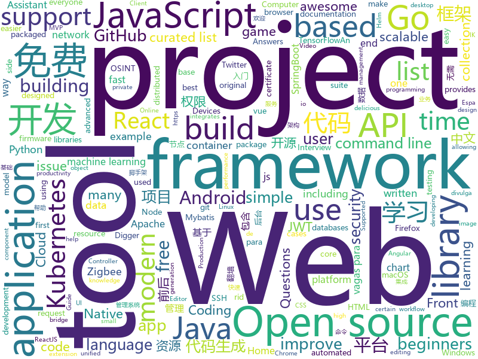

# 2020-09-25
See what the GitHub community is most excited about.

## python
+ [kb](https://github.com/gnebbia/kb)(**177 stars today**): A minimalist command line knowledge base manager
+ [Mask_RCNN](https://github.com/matterport/Mask_RCNN)(**93 stars today**): Mask R-CNN for object detection and instance segmentation on Keras and TensorFlow
+ [twint](https://github.com/twintproject/twint)(**112 stars today**): An advanced Twitter scraping & OSINT tool written in Python that doesn't use Twitter's API, allowing you to scrape a user's followers, following, Tweets and more while evading most API limitations.
+ [eat_tensorflow2_in_30_days](https://github.com/lyhue1991/eat_tensorflow2_in_30_days)(**117 stars today**): Tensorflow2.0🍎🍊is delicious, just eat it!😋😋
+ [PayloadsAllTheThings](https://github.com/swisskyrepo/PayloadsAllTheThings)(**211 stars today**): A list of useful payloads and bypass for Web Application Security and Pentest/CTF
+ [DAIN](https://github.com/baowenbo/DAIN)(**66 stars today**): Depth-Aware Video Frame Interpolation (CVPR 2019)
+ [XiaomiGateway3](https://github.com/AlexxIT/XiaomiGateway3)(**6 stars today**): Control Zigbee and BLE devices from Home Assistant with Xiaomi Gateway 3 (ZNDMWG03LM) on original firmware
+ [transformers](https://github.com/huggingface/transformers)(**89 stars today**): 🤗Transformers: State-of-the-art Natural Language Processing for Pytorch and TensorFlow 2.0.
+ [checkov](https://github.com/bridgecrewio/checkov)(**6 stars today**): Prevent cloud misconfigurations during build-time for Terraform, Cloudformation, Kubernetes, Serverless framework and other infrastructure-as-code-languages with Checkov by Bridgecrew.
+ [streamlit](https://github.com/streamlit/streamlit)(**29 stars today**): Streamlit — The fastest way to build data apps in Python
+ [norfair](https://github.com/tryolabs/norfair)(**33 stars today**): Lightweight Python library for adding real-time 2D object tracking to any detector.
+ [All-Programming-E-Books-PDF](https://github.com/trumpowen/All-Programming-E-Books-PDF)(**16 stars today**): A Curated List Of Programming Books For C, C++ , Python, JavaScript, NodeJs, ReactJs, Web, JQuery, Flask, Dom, Angular, CSS, HTML for beginners, intermediate, advanced and experts
+ [EasyOCR](https://github.com/JaidedAI/EasyOCR)(**29 stars today**): Ready-to-use OCR with 40+ languages supported including Chinese, Japanese, Korean and Thai
+ [REPL](https://github.com/world-class/REPL)(**4 stars today**): The Learning Hub for UoL's Online CS Students
+ [Cat_Prey_Analyzer](https://github.com/niciBume/Cat_Prey_Analyzer)(**1 stars today**): Cat Prey Image-Classification with deeplearning
+ [eat_pytorch_in_20_days](https://github.com/lyhue1991/eat_pytorch_in_20_days)(**25 stars today**): Pytorch🍊🍉is delicious, just eat it!😋😋
+ [bird-bot](https://github.com/natewong1313/bird-bot)(**8 stars today**): A Nintendo Switch checkout bot. Currently supports Walmart and Best buy
+ [hue](https://github.com/cloudera/hue)(**10 stars today**): Hue Editor: Open source SQL Query Assistant for Databases/Warehouses
+ [sktime](https://github.com/alan-turing-institute/sktime)(**48 stars today**): A unified toolbox for machine learning with time series
+ [macadmin-scripts](https://github.com/munki/macadmin-scripts)(**5 stars today**): Scripts of possible interest to macOS admins
+ [SonoffLAN](https://github.com/AlexxIT/SonoffLAN)(**0 stars today**): Control Sonoff Devices with eWeLink (original) firmware over LAN and/or Cloud from Home Assistant
+ [matplotlib](https://github.com/matplotlib/matplotlib)(**13 stars today**): matplotlib: plotting with Python
+ [facenet](https://github.com/davidsandberg/facenet)(**11 stars today**): Face recognition using Tensorflow
+ [ray](https://github.com/ray-project/ray)(**24 stars today**): An open source framework that provides a simple, universal API for building distributed applications. Ray is packaged with RLlib, a scalable reinforcement learning library, and Tune, a scalable hyperparameter tuning library.
+ [python-telegram-bot](https://github.com/python-telegram-bot/python-telegram-bot)(**24 stars today**): We have made you a wrapper you can't refuse

## java
+ [hello-algorithm](https://github.com/geekxh/hello-algorithm)(**160 stars today**): 🌍东半球最酷的学习项目 | 1、我写的三十万字算法图解 2、千本开源电子书 3、100 张思维导图 4、100 篇大厂面经 5、30 个学习专题🚀🚀🚀右上角点个 star，加入我们万人学习群！English Supported！
+ [tribuo](https://github.com/oracle/tribuo)(**37 stars today**): Tribuo - A Java machine learning library
+ [kafdrop](https://github.com/obsidiandynamics/kafdrop)(**17 stars today**): Kafka Web UI
+ [java-design-patterns](https://github.com/iluwatar/java-design-patterns)(**43 stars today**): Design patterns implemented in Java
+ [spring-boot](https://github.com/spring-projects/spring-boot)(**40 stars today**): Spring Boot
+ [MVPArms](https://github.com/JessYanCoding/MVPArms)(**4 stars today**): ⚔️A common architecture for Android applications developing based on MVP, integrates many open source projects, to make your developing quicker and easier (一个整合了大量主流开源项目高度可配置化的 Android MVP 快速集成框架).
+ [debezium](https://github.com/debezium/debezium)(**7 stars today**): Change data capture for a variety of databases. Please log issues at https://issues.redhat.com/browse/DBZ.
+ [jeecg-boot](https://github.com/zhangdaiscott/jeecg-boot)(**52 stars today**): 基于代码生成器的低代码平台，超越传统商业平台！前后端分离架构：SpringBoot 2.x，Ant Design&Vue，Mybatis-plus，Shiro，JWT。强大的代码生成器让前后端代码一键生成，无需写任何代码! 引领新开发模式(OnlineCoding-> 代码生成-> 手工MERGE)，帮助Java项目解决70%重复工作，让开发更关注业务逻辑，既能快速提高开发效率，帮助公司节省成本，同时又不失灵活性。
+ [java8-tutorial](https://github.com/winterbe/java8-tutorial)(**7 stars today**): Modern Java - A Guide to Java 8
+ [PhotoEditor](https://github.com/burhanrashid52/PhotoEditor)(**7 stars today**): A Photo Editor library with simple, easy support for image editing using paints,text,filters,emoji and Sticker like stories.
+ [beam](https://github.com/apache/beam)(**2 stars today**): Apache Beam is a unified programming model for Batch and Streaming
+ [CoreNLP](https://github.com/stanfordnlp/CoreNLP)(**7 stars today**): Stanford CoreNLP: A Java suite of core NLP tools.
+ [elasticsearch](https://github.com/elastic/elasticsearch)(**30 stars today**): Open Source, Distributed, RESTful Search Engine
+ [elasticsearch-analysis-ik](https://github.com/medcl/elasticsearch-analysis-ik)(**14 stars today**): The IK Analysis plugin integrates Lucene IK analyzer into elasticsearch, support customized dictionary.
+ [hadoop](https://github.com/apache/hadoop)(**5 stars today**): Apache Hadoop
+ [react-native-camera](https://github.com/react-native-community/react-native-camera)(**5 stars today**): A Camera component for React Native. Also supports barcode scanning!
+ [zuihou-admin-cloud](https://github.com/zuihou/zuihou-admin-cloud)(**35 stars today**): 基于SpringCloud(Hoxton.SR7) + SpringBoot(2.2.9.RELEASE) 的SaaS 微服务脚手架，具有统一授权、认证后台管理系统，其中包含具备用户管理、资源权限管理、网关API、分布式事务、大文件断点分片续传等多个模块，支持多业务系统并行开发，可以作为后端服务的开发脚手架。代码简洁，架构清晰，适合学习和直接项目中使用。核心技术采用Nacos、Fegin、Ribbon、Zuul、Hystrix、JWT Token、Mybatis、SpringBoot、Redis、RibbitMQ等主要框架和中间件。
+ [bazel](https://github.com/bazelbuild/bazel)(**14 stars today**): a fast, scalable, multi-language and extensible build system
+ [tutorials](https://github.com/eugenp/tutorials)(**26 stars today**): Just Announced - "Learn Spring Security OAuth":
+ [testing-samples](https://github.com/android/testing-samples)(**6 stars today**): A collection of samples demonstrating different frameworks and techniques for automated testing
+ [IIS-ShortName-Scanner](https://github.com/irsdl/IIS-ShortName-Scanner)(**19 stars today**): latest version of scanners for IIS short filename (8.3) disclosure vulnerability
+ [JsonPath](https://github.com/json-path/JsonPath)(**6 stars today**): Java JsonPath implementation
+ [strimzi-kafka-operator](https://github.com/strimzi/strimzi-kafka-operator)(**6 stars today**): Apache Kafka running on Kubernetes
+ [storm](https://github.com/apache/storm)(**0 stars today**): Mirror of Apache Storm

## unknown
+ [free](https://github.com/freefq/free)(**13 stars today**): 免费科学上网,免费翻墙,免费ssr,免费v2ray,免费vmess节点,免费节点,翻墙,蓝灯,谷歌商店
+ [IntelliJ-IDEA-2020.2.1-solve](https://github.com/shipofsea/IntelliJ-IDEA-2020.2.1-solve)(**2 stars today**): 
+ [app-ideas](https://github.com/florinpop17/app-ideas)(**39 stars today**): A Collection of application ideas which can be used to improve your coding skills.
+ [covid-19-data](https://github.com/nytimes/covid-19-data)(**4 stars today**): An ongoing repository of data on coronavirus cases and deaths in the U.S.
+ [Tvlist-awesome-m3u-m3u8](https://github.com/imDazui/Tvlist-awesome-m3u-m3u8)(**15 stars today**): 直播源相关资源汇总📺💯IPTV、M3U —— 勤洗手、戴口罩，祝愿所有人百毒不侵
+ [vagas](https://github.com/frontendbr/vagas)(**14 stars today**): 🔬Espaço para divulgação de vagas para front-enders.
+ [Specs](https://github.com/CocoaPods/Specs)(**2 stars today**): The CocoaPods Master Repo
+ [vagas-junior-estagio](https://github.com/alinebastos/vagas-junior-estagio)(**21 stars today**): Empresas que constantemente oferecem vagas para junior e estagiários
+ [clash_for_windows_pkg](https://github.com/Fndroid/clash_for_windows_pkg)(**20 stars today**): A Windows/macOS GUI based on Clash
+ [android_guides](https://github.com/codepath/android_guides)(**2 stars today**): Extensive Open-Source Guides for Android Developers
+ [CCXDigger](https://github.com/CCXLabs/CCXDigger)(**1 stars today**): The CyberCX Digger project is designed to help Australian organisations determine if they have been impacted by certain high profile cyber security incidents. Digger provides threat hunting functionality packaged in a simple-to-use tool, allowing users to detect certain attacker activities; all for free.
+ [awesome-quant](https://github.com/wilsonfreitas/awesome-quant)(**7 stars today**): A curated list of insanely awesome libraries, packages and resources for Quants (Quantitative Finance)
+ [vagas](https://github.com/backend-br/vagas)(**8 stars today**): ✌️Espaço para divulgação de vagas para backenders
+ [computer-science](https://github.com/ossu/computer-science)(**90 stars today**): 🎓Path to a free self-taught education in Computer Science!
+ [weekly](https://github.com/ruanyf/weekly)(**17 stars today**): 科技爱好者周刊，每周五发布
+ [Clash_Chinese_Patch](https://github.com/BoyceLig/Clash_Chinese_Patch)(**11 stars today**): 
+ [Front-End-Checklist](https://github.com/thedaviddias/Front-End-Checklist)(**13 stars today**): 🗂The perfect Front-End Checklist for modern websites and meticulous developers
+ [awesome-public-datasets](https://github.com/awesomedata/awesome-public-datasets)(**21 stars today**): A topic-centric list of HQ open datasets.
+ [Privilege-Escalation](https://github.com/Ignitetechnologies/Privilege-Escalation)(**3 stars today**): This cheasheet is aimed at the CTF Players and Beginners to help them understand the fundamentals of Privilege Escalation with examples.
+ [free-programming-books-zh_CN](https://github.com/justjavac/free-programming-books-zh_CN)(**29 stars today**): 📚免费的计算机编程类中文书籍，欢迎投稿
+ [ClashForAndroid](https://github.com/Kr328/ClashForAndroid)(**16 stars today**): A rule-based tunnel for Android.
+ [modern-js-cheatsheet](https://github.com/mbeaudru/modern-js-cheatsheet)(**3 stars today**): Cheatsheet for the JavaScript knowledge you will frequently encounter in modern projects.
+ [awesome-for-beginners](https://github.com/MunGell/awesome-for-beginners)(**49 stars today**): A list of awesome beginners-friendly projects.
+ [awesome-ai-residency](https://github.com/dangkhoasdc/awesome-ai-residency)(**2 stars today**): List of AI Residency Programs
+ [event-based_vision_resources](https://github.com/uzh-rpg/event-based_vision_resources)(**0 stars today**): 

## javascript
+ [bypass-paywalls-chrome](https://github.com/iamadamdev/bypass-paywalls-chrome)(**143 stars today**): Bypass Paywalls web browser extension for Chrome and Firefox.
+ [send](https://github.com/mozilla/send)(**327 stars today**): Simple, private file sharing from the makers of Firefox
+ [material-shell](https://github.com/material-shell/material-shell)(**169 stars today**): A modern desktop interface for Linux. Improve your user experience and get rid of the anarchy of traditional desktop workflows. Designed to simplify navigation and reduce the need to manipulate windows in order to improve productivity. It's meant to be 100% predictable and bring the benefits of tools coveted by professionals to everyone.
+ [dayjs](https://github.com/iamkun/dayjs)(**156 stars today**): ⏰Day.js 2KB immutable date-time library alternative to Moment.js with the same modern API
+ [swagger-ui](https://github.com/swagger-api/swagger-ui)(**23 stars today**): Swagger UI is a collection of HTML, JavaScript, and CSS assets that dynamically generate beautiful documentation from a Swagger-compliant API.
+ [realworld](https://github.com/gothinkster/realworld)(**79 stars today**): "The mother of all demo apps" — Exemplary fullstack Medium.com clone powered by React, Angular, Node, Django, and many more🏅
+ [cypress](https://github.com/cypress-io/cypress)(**44 stars today**): Fast, easy and reliable testing for anything that runs in a browser.
+ [react-native](https://github.com/facebook/react-native)(**30 stars today**): A framework for building native apps with React.
+ [zigbee2mqtt](https://github.com/Koenkk/zigbee2mqtt)(**11 stars today**): Zigbee🐝to MQTT bridge🌉, get rid of your proprietary Zigbee bridges🔨
+ [vue-lit](https://github.com/yyx990803/vue-lit)(**22 stars today**): Proof of concept custom elements "framework"
+ [front-end-interview-handbook](https://github.com/yangshun/front-end-interview-handbook)(**39 stars today**): 🕸No-bullshit answers to the famous h5bp "Front-end Job Interview Questions"
+ [jsPDF](https://github.com/MrRio/jsPDF)(**20 stars today**): Client-side JavaScript PDF generation for everyone.
+ [grapesjs](https://github.com/artf/grapesjs)(**39 stars today**): Free and Open source Web Builder Framework. Next generation tool for building templates without coding
+ [aws-extend-switch-roles](https://github.com/tilfin/aws-extend-switch-roles)(**90 stars today**): Extend your AWS IAM switching roles by Chrome extension or Firefox add-on
+ [engine](https://github.com/cocos-creator/engine)(**5 stars today**): Cocos Creator is a complete package of game development tools and workflow, including a game engine, resource management, scene editing, game preview, debug and publish one project to multiple platforms.
+ [microsoft-authentication-library-for-js](https://github.com/AzureAD/microsoft-authentication-library-for-js)(**4 stars today**): Microsoft Authentication Library (MSAL) for JS
+ [reactjs-interview-questions](https://github.com/sudheerj/reactjs-interview-questions)(**28 stars today**): List of top 500 ReactJS Interview Questions & Answers....Coding exercise questions are coming soon!!
+ [uPlot](https://github.com/leeoniya/uPlot)(**20 stars today**): 📈A small, fast chart for time series, lines, areas, ohlc & bars
+ [real-live](https://github.com/parzulpan/real-live)(**17 stars today**): A cross-platform network media aggregation application that supports online viewing or listening of live video, HD TV and radio stations.
+ [uniswap-org](https://github.com/Uniswap/uniswap-org)(**0 stars today**): 🌐Protocol site
+ [react-beautiful-dnd](https://github.com/atlassian/react-beautiful-dnd)(**25 stars today**): Beautiful and accessible drag and drop for lists with React
+ [lighthouse](https://github.com/GoogleChrome/lighthouse)(**11 stars today**): Automated auditing, performance metrics, and best practices for the web.
+ [react-jsonschema-form](https://github.com/rjsf-team/react-jsonschema-form)(**14 stars today**): A React component for building Web forms from JSON Schema.
+ [jsdoc](https://github.com/jsdoc/jsdoc)(**12 stars today**): An API documentation generator for JavaScript.
+ [strapi](https://github.com/strapi/strapi)(**90 stars today**): 🚀Open source Node.js Headless CMS to easily build customisable APIs

## html
+ [linux-command](https://github.com/jaywcjlove/linux-command)(**114 stars today**): Linux命令大全搜索工具，内容包含Linux命令手册、详解、学习、搜集。https://git.io/linux
+ [ML-notes](https://github.com/Sakura-gh/ML-notes)(**14 stars today**): notes about machine learning
+ [home-assistant.io](https://github.com/home-assistant/home-assistant.io)(**1 stars today**): 📘Home Assistant User documentation
+ [helm-charts](https://github.com/jenkinsci/helm-charts)(**1 stars today**): Jenkins community Helm charts
+ [RateMySupervisor](https://github.com/kgco/RateMySupervisor)(**8 stars today**): 永久免费开源的导师评价数据、数据爬虫、无需编程基础的展示网页以及新信息补充平台
+ [keep-a-changelog](https://github.com/olivierlacan/keep-a-changelog)(**1 stars today**): If you build software, keep a changelog.
+ [webdevbootcamp](https://github.com/nax3t/webdevbootcamp)(**1 stars today**): All source code for back-end projects from the Web Developer Bootcamp
+ [Introduction-to-Web-Development](https://github.com/WebDevSimplified/Introduction-to-Web-Development)(**0 stars today**): 
+ [re0-web](https://github.com/lyy289065406/re0-web)(**4 stars today**): Re0：从零开始的异世界生活 （WEB版）
+ [svelte-material-ui](https://github.com/hperrin/svelte-material-ui)(**4 stars today**): Svelte Material UI Components
+ [kubespray](https://github.com/kubernetes-sigs/kubespray)(**9 stars today**): Deploy a Production Ready Kubernetes Cluster
+ [Fur](https://github.com/MonkSoul/Fur)(**3 stars today**): 🐮Fur 是 .NET 5 平台下极易入门、极速开发的 Web 应用框架。（v1.0.0-rc.1）
+ [blog_os](https://github.com/phil-opp/blog_os)(**12 stars today**): Writing an OS in Rust
+ [wpt](https://github.com/web-platform-tests/wpt)(**1 stars today**): Test suites for Web platform specs — including WHATWG, W3C, and others
+ [charts](https://github.com/bitnami/charts)(**16 stars today**): Helm Charts
+ [Hacktoberfest-2020](https://github.com/Ishaan28malik/Hacktoberfest-2020)(**18 stars today**): For beginners who are going to start with there first PR
+ [cypress-example-kitchensink](https://github.com/cypress-io/cypress-example-kitchensink)(**0 stars today**): This is an example app used to showcase Cypress.io testing.
+ [harbor-helm](https://github.com/goharbor/harbor-helm)(**3 stars today**): The helm chart to deploy Harbor
+ [Hacktoberfest2020](https://github.com/OpenSouceCode/Hacktoberfest2020)(**14 stars today**): Make your first Pull Request and earn a free tee from GitHub!
+ [us-potus-model](https://github.com/TheEconomist/us-potus-model)(**4 stars today**): Code for a dynamic multilevel Bayesian model to predict US presidential elections. Written in R and Stan.
+ [django-DefectDojo](https://github.com/DefectDojo/django-DefectDojo)(**1 stars today**): DefectDojo is an open-source application vulnerability correlation and security orchestration tool.
+ [10-projects-1-hour](https://github.com/florinpop17/10-projects-1-hour)(**1 stars today**): The projects from the "10 JavaScript Projects in 1 Hour" Coding Challenge
+ [account-payment](https://github.com/OCA/account-payment)(**0 stars today**): Project supervised by the Banking PSC
+ [mxgraph](https://github.com/jgraph/mxgraph)(**9 stars today**): mxGraph is a fully client side JavaScript diagramming library
+ [elements-examples](https://github.com/stripe/elements-examples)(**1 stars today**): Stripe Elements examples.

## go
+ [cli](https://github.com/cli/cli)(**620 stars today**): GitHub’s official command line tool
+ [croc](https://github.com/schollz/croc)(**413 stars today**): Easily and securely send things from one computer to another🐊📦
+ [moby](https://github.com/moby/moby)(**48 stars today**): Moby Project - a collaborative project for the container ecosystem to assemble container-based systems
+ [awesome-go](https://github.com/avelino/awesome-go)(**60 stars today**): A curated list of awesome Go frameworks, libraries and software
+ [traefik](https://github.com/traefik/traefik)(**31 stars today**): The Cloud Native Application Proxy
+ [determined](https://github.com/determined-ai/determined)(**14 stars today**): Determined: Deep Learning Training Platform
+ [modgv](https://github.com/lucasepe/modgv)(**18 stars today**): Converts 'go mod graph' output into Graphviz's DOT language
+ [go-zero](https://github.com/tal-tech/go-zero)(**38 stars today**): go-zero is a web and rpc framework written in Go. It's born to ensure the stability of the busy sites with resilient design. Builtin goctl greatly improves the development productivity.
+ [gin-vue-admin](https://github.com/flipped-aurora/gin-vue-admin)(**30 stars today**): 基于gin+vue搭建的后台管理系统框架，集成jwt鉴权，权限管理，动态路由，分页封装，多点登录拦截，资源权限，上传下载，代码生成器，表单生成器等基础功能，五分钟一套CURD前后端代码包含数据库的快感你不要体验一下吗~,更多功能正在开发中，欢迎issue和pr~
+ [kubernetes](https://github.com/kubernetes/kubernetes)(**50 stars today**): Production-Grade Container Scheduling and Management
+ [cortex](https://github.com/cortexlabs/cortex)(**14 stars today**): Model serving for developers
+ [velero](https://github.com/vmware-tanzu/velero)(**7 stars today**): Backup and migrate Kubernetes applications and their persistent volumes
+ [gatekeeper](https://github.com/open-policy-agent/gatekeeper)(**4 stars today**): Gatekeeper - Policy Controller for Kubernetes
+ [the-way-to-go_ZH_CN](https://github.com/unknwon/the-way-to-go_ZH_CN)(**21 stars today**): 《The Way to Go》中文译本，中文正式名《Go 入门指南》
+ [httprouter](https://github.com/julienschmidt/httprouter)(**11 stars today**): A high performance HTTP request router that scales well
+ [hub](https://github.com/github/hub)(**10 stars today**): A command-line tool that makes git easier to use with GitHub.
+ [tinygo](https://github.com/tinygo-org/tinygo)(**13 stars today**): Go compiler for small places. Microcontrollers, WebAssembly, and command-line tools. Based on LLVM.
+ [groupcache](https://github.com/golang/groupcache)(**16 stars today**): groupcache is a caching and cache-filling library, intended as a replacement for memcached in many cases.
+ [sealed-secrets](https://github.com/bitnami-labs/sealed-secrets)(**9 stars today**): A Kubernetes controller and tool for one-way encrypted Secrets
+ [PhoneInfoga](https://github.com/sundowndev/PhoneInfoga)(**3 stars today**): Advanced information gathering & OSINT framework for phone numbers
+ [chainlink](https://github.com/smartcontractkit/chainlink)(**4 stars today**): node of the decentralized oracle network, bridging on and off-chain computation
+ [act](https://github.com/nektos/act)(**31 stars today**): Run your GitHub Actions locally🚀
+ [certificates](https://github.com/smallstep/certificates)(**7 stars today**): 🛡️A private certificate authority (X.509 & SSH) & ACME server for secure automated certificate management, so you can use TLS everywhere & SSO for SSH.
+ [golang-web-dev](https://github.com/GoesToEleven/golang-web-dev)(**5 stars today**): 
+ [free5gc](https://github.com/free5gc/free5gc)(**11 stars today**): Open source 5G core network base on 3GPP R15

## WordCloud

