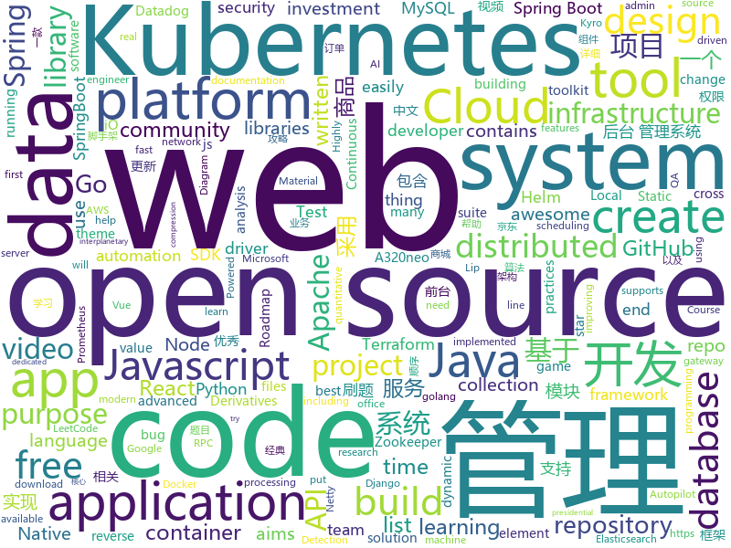

# 2020-09-30
See what the GitHub community is most excited about.

## python
+ [Real_Time_Image_Animation](https://github.com/anandpawara/Real_Time_Image_Animation)(**107 stars today**): The Project is real time application in opencv using first order model
+ [DeDRM_tools](https://github.com/apprenticeharper/DeDRM_tools)(**62 stars today**): DeDRM tools for ebooks
+ [system-design-primer](https://github.com/donnemartin/system-design-primer)(**152 stars today**): Learn how to design large-scale systems. Prep for the system design interview. Includes Anki flashcards.
+ [diagrams](https://github.com/mingrammer/diagrams)(**289 stars today**): 🎨Diagram as Code for prototyping cloud system architectures
+ [detr](https://github.com/facebookresearch/detr)(**8 stars today**): End-to-End Object Detection with Transformers
+ [football](https://github.com/google-research/football)(**28 stars today**): Check out the new game server:
+ [FinancePy](https://github.com/domokane/FinancePy)(**30 stars today**): A Python Finance Library that focuses on the pricing and risk-management of Financial Derivatives, including fixed-income, equity, FX and credit derivatives.
+ [qxresearch-event-1](https://github.com/qxresearch/qxresearch-event-1)(**6 stars today**): 10 Python Application🦾| 10 lines of code👽
+ [ostep-homework](https://github.com/remzi-arpacidusseau/ostep-homework)(**3 stars today**): 
+ [imaginaire](https://github.com/NVlabs/imaginaire)(**207 stars today**): NVIDIA PyTorch GAN library with distributed and mixed precision support
+ [checkov](https://github.com/bridgecrewio/checkov)(**5 stars today**): Prevent cloud misconfigurations during build-time for Terraform, Cloudformation, Kubernetes, Serverless framework and other infrastructure-as-code-languages with Checkov by Bridgecrew.
+ [rotate](https://github.com/rvizzz/rotate)(**53 stars today**): Create recursive image rotation animations
+ [core](https://github.com/home-assistant/core)(**187 stars today**): 🏡Open source home automation that puts local control and privacy first
+ [youtube-dl](https://github.com/ytdl-org/youtube-dl)(**88 stars today**): Command-line program to download videos from YouTube.com and other video sites
+ [RTC2020_EfficientSR](https://github.com/zdyshine/RTC2020_EfficientSR)(**42 stars today**): 
+ [FGVC](https://github.com/vt-vl-lab/FGVC)(**36 stars today**): [ECCV 2020] Flow-edge Guided Video Completion
+ [qlib](https://github.com/microsoft/qlib)(**72 stars today**): Qlib is an AI-oriented quantitative investment platform, which aims to realize the potential, empower the research, and create the value of AI technologies in quantitative investment. With Qlib, you can easily try your ideas to create better Quant investment strategies.
+ [integrations-core](https://github.com/DataDog/integrations-core)(**0 stars today**): Core integrations of the Datadog Agent
+ [Wav2Lip](https://github.com/Rudrabha/Wav2Lip)(**22 stars today**): This repository contains the codes of "A Lip Sync Expert Is All You Need for Speech to Lip Generation In the Wild", published at ACM Multimedia 2020.
+ [real-live](https://github.com/parzulpan/real-live)(**49 stars today**): A cross-platform network media aggregation application that supports online viewing or listening of live video, HD TV and radio stations. 一个跨平台的网络媒体聚合应用，支持直播视频，高清电视和广播电台的在线观看或收听。
+ [DjangoBlog](https://github.com/liangliangyy/DjangoBlog)(**4 stars today**): 🍺基于Django的博客系统
+ [boto3](https://github.com/boto/boto3)(**6 stars today**): AWS SDK for Python
+ [MEDUZA](https://github.com/kov4l3nko/MEDUZA)(**20 stars today**): A more or less universal SSL unpinning tool for iOS
+ [discord.py](https://github.com/Rapptz/discord.py)(**23 stars today**): An API wrapper for Discord written in Python.
+ [airflow](https://github.com/apache/airflow)(**24 stars today**): Apache Airflow - A platform to programmatically author, schedule, and monitor workflows

## java
+ [serve](https://github.com/pytorch/serve)(**4 stars today**): Model Serving on PyTorch
+ [ghidra](https://github.com/NationalSecurityAgency/ghidra)(**15 stars today**): Ghidra is a software reverse engineering (SRE) framework
+ [rocketmq](https://github.com/apache/rocketmq)(**57 stars today**): Mirror of Apache RocketMQ
+ [GitHub-Chinese-Top-Charts](https://github.com/kon9chunkit/GitHub-Chinese-Top-Charts)(**32 stars today**): 🇨🇳GitHub中文排行榜，帮助你发现高分优秀中文项目、更高效地吸收国人的优秀经验成果；榜单每周更新一次，敬请关注！
+ [flink](https://github.com/apache/flink)(**14 stars today**): Apache Flink
+ [graphhopper](https://github.com/graphhopper/graphhopper)(**4 stars today**): Open source routing engine for OpenStreetMap. Use it as Java library or server.
+ [AntennaPod](https://github.com/AntennaPod/AntennaPod)(**4 stars today**): A podcast manager for Android
+ [mall](https://github.com/macrozheng/mall)(**97 stars today**): mall项目是一套电商系统，包括前台商城系统及后台管理系统，基于SpringBoot+MyBatis实现，采用Docker容器化部署。 前台商城系统包含首页门户、商品推荐、商品搜索、商品展示、购物车、订单流程、会员中心、客户服务、帮助中心等模块。 后台管理系统包含商品管理、订单管理、会员管理、促销管理、运营管理、内容管理、统计报表、财务管理、权限管理、设置等模块。
+ [Spring-Cloud-Platform](https://github.com/wxiaoqi/Spring-Cloud-Platform)(**13 stars today**): Cloud-Platform是国内首个基于Spring Cloud的微服务开发平台，具有统一授权、认证后台管理系统，其中包含具备用户管理、资源权限管理、网关API管理等多个模块，支持多业务系统并行开发，可以作为后端服务的开发脚手架。代码简洁，架构清晰，适合学习和直接项目中使用。核心技术采用Spring Boot2以及Spring Cloud Gateway相关核心组件，前端采用vue-element-admin组件。
+ [JAVA](https://github.com/akshitagit/JAVA)(**9 stars today**): Repository for Java codes and algos.Star the repo too.
+ [SpringCloud](https://github.com/zhoutaoo/SpringCloud)(**6 stars today**): 基于SpringCloud2.1的微服务开发脚手架，整合了spring-security-oauth2、nacos、feign、sentinel、springcloud-gateway等。服务治理方面引入elasticsearch、skywalking、springboot-admin、zipkin等，让项目开发快速进入业务开发，而不需过多时间花费在架构搭建上。持续更新中
+ [MCinaBox](https://github.com/AOF-Dev/MCinaBox)(**4 stars today**): MCinaBox - A Minecraft Java Edition Launcher on Android
+ [xdm](https://github.com/subhra74/xdm)(**8 stars today**): Powerfull download accelerator and video downloader
+ [vhr](https://github.com/lenve/vhr)(**28 stars today**): 微人事是一个前后端分离的人力资源管理系统，项目采用SpringBoot+Vue开发。
+ [karate](https://github.com/intuit/karate)(**5 stars today**): Test Automation Made Simple
+ [guide-rpc-framework](https://github.com/Snailclimb/guide-rpc-framework)(**19 stars today**): A custom RPC framework implemented by Netty+Kyro+Zookeeper.（一款基于 Netty+Kyro+Zookeeper 实现的自定义 RPC 框架-附详细实现过程和相关教程。）
+ [capacitor](https://github.com/ionic-team/capacitor)(**6 stars today**): Build cross-platform Native Progressive Web Apps for iOS, Android, and the Web⚡️
+ [elasticsearch-hadoop](https://github.com/elastic/elasticsearch-hadoop)(**1 stars today**): 🐘Elasticsearch real-time search and analytics natively integrated with Hadoop
+ [testcontainers-java](https://github.com/testcontainers/testcontainers-java)(**9 stars today**): Testcontainers is a Java library that supports JUnit tests, providing lightweight, throwaway instances of common databases, Selenium web browsers, or anything else that can run in a Docker container.
+ [calcite](https://github.com/apache/calcite)(**3 stars today**): Apache Calcite
+ [react-native-push-notification](https://github.com/zo0r/react-native-push-notification)(**2 stars today**): React Native Local and Remote Notifications
+ [incubator-dolphinscheduler](https://github.com/apache/incubator-dolphinscheduler)(**7 stars today**): Dolphin Scheduler is a distributed and easy-to-extend visual workflow scheduling platform, dedicated to solving the complex dependencies in data processing, making the scheduling system out of the box for data processing.(分布式易扩展的可视化工作流任务调度)
+ [jsoncat](https://github.com/Snailclimb/jsoncat)(**38 stars today**): 仿 Spring Boot 但不同于 Spring Boot 的一个轻量级的 HTTP 框架
+ [FtcRobotController](https://github.com/FIRST-Tech-Challenge/FtcRobotController)(**3 stars today**): 
+ [piggymetrics](https://github.com/sqshq/piggymetrics)(**7 stars today**): Microservice Architecture with Spring Boot, Spring Cloud and Docker

## unknown
+ [data-engineer-roadmap](https://github.com/datastacktv/data-engineer-roadmap)(**21 stars today**): Roadmap to becoming a data engineer in 2020
+ [fucking-algorithm](https://github.com/labuladong/fucking-algorithm)(**220 stars today**): 刷算法全靠套路，认准 labuladong 就够了！English version supported! Crack LeetCode, not only how, but also why.
+ [CKSS-Certified-Kubernetes-Security-Specialist](https://github.com/ijelliti/CKSS-Certified-Kubernetes-Security-Specialist)(**18 stars today**): This repository is a collection of resources to prepare for the Certified Kubernetes Security Specialist (CKSS) exam.
+ [QA_bible](https://github.com/Vladislav610/QA_bible)(**3 stars today**): Библия QA/тестировщика это 200++ страниц обновляемой смеси ответов на вопросы с реальных собеседований на QA, перевода интересного контента с зарубежных ресурсов и агрегации материала с отечественных.
+ [GNNPapers](https://github.com/thunlp/GNNPapers)(**26 stars today**): Must-read papers on graph neural networks (GNN)
+ [awesome-react](https://github.com/enaqx/awesome-react)(**85 stars today**): A collection of awesome things regarding React ecosystem
+ [HowToHunt](https://github.com/KathanP19/HowToHunt)(**13 stars today**): Tutorials and Things to Do while Hunting Vulnerability.
+ [javascript-questions](https://github.com/lydiahallie/javascript-questions)(**15 stars today**): A long list of (advanced) JavaScript questions, and their explanations✨
+ [developers-roadmap](https://github.com/fullstack-development/developers-roadmap)(**5 stars today**): How to learn front-end or back-end development
+ [COVID-19](https://github.com/CSSEGISandData/COVID-19)(**16 stars today**): Novel Coronavirus (COVID-19) Cases, provided by JHU CSSE
+ [PoC-in-GitHub](https://github.com/nomi-sec/PoC-in-GitHub)(**16 stars today**): 📡PoC auto collect from GitHub.
+ [mem-doc](https://github.com/Maoni0/mem-doc)(**6 stars today**): This is a document to help with .NET memory analysis and diagnostics.
+ [rtb-experimental](https://github.com/google/rtb-experimental)(**2 stars today**): 
+ [selling-partner-api-docs](https://github.com/amzn/selling-partner-api-docs)(**4 stars today**): This repository contains documentation for developers to use to call Selling Partner APIs.
+ [awesome-deep-learning](https://github.com/ChristosChristofidis/awesome-deep-learning)(**14 stars today**): A curated list of awesome Deep Learning tutorials, projects and communities.
+ [leetcode-master](https://github.com/youngyangyang04/leetcode-master)(**12 stars today**): LeetCode 刷题攻略：配思维导图，各个类型的经典题目刷题顺序、经典算法模板，以及详细图解和视频题解。这里精选的题目都不是孤立的，而是由浅入深一脉相承的，相信只要按照刷题攻略上的顺序来学习，一定会有所收获！给个star支持一下吧！
+ [OnJava8](https://github.com/LingCoder/OnJava8)(**22 stars today**): 《On Java 8》中文版，又名《Java编程思想》 第5版
+ [machine-learning-roadmap](https://github.com/mrdbourke/machine-learning-roadmap)(**10 stars today**): A roadmap connecting many of the most important concepts in machine learning, how to learn them and what tools to use to perform them.
+ [flutter_roadmap](https://github.com/olexale/flutter_roadmap)(**31 stars today**): Highly Subjective Roadmap to Flutter Development
+ [DU-Orbital-Hud](https://github.com/Dimencia/DU-Orbital-Hud)(**4 stars today**): Dual Universe HUD and Autopilot, with Atmospheric and Space features, and automatic interplanetary autopilot that will put you in a safe orbit for when you wake up
+ [proposals](https://github.com/tc39/proposals)(**11 stars today**): Tracking ECMAScript Proposals
+ [webkit](https://github.com/WebKit/webkit)(**2 stars today**): Unofficial mirror of the WebKit SVN repository
+ [idiomatic.js](https://github.com/rwaldron/idiomatic.js)(**8 stars today**): Principles of Writing Consistent, Idiomatic JavaScript
+ [laravel-best-practices](https://github.com/alexeymezenin/laravel-best-practices)(**7 stars today**): Laravel best practices
+ [awesome-courses](https://github.com/prakhar1989/awesome-courses)(**12 stars today**): 📚List of awesome university courses for learning Computer Science!

## javascript
+ [Javascript](https://github.com/TheAlgorithms/Javascript)(**259 stars today**): A repository for All algorithms implemented in Javascript (for educational purposes only)
+ [realworld](https://github.com/gothinkster/realworld)(**57 stars today**): "The mother of all demo apps" — Exemplary fullstack Medium.com clone powered by React, Angular, Node, Django, and many more🏅
+ [shapez.io](https://github.com/tobspr/shapez.io)(**11 stars today**): shapez.io is an open source base building game inspired by factorio! Available on web & desktop
+ [fullstack-course4](https://github.com/jhu-ep-coursera/fullstack-course4)(**95 stars today**): Example code for HTML, CSS, and Javascript for Web Developers Coursera Course
+ [zhaopp](https://github.com/gdtool/zhaopp)(**19 stars today**): 一个Google Drive搜索引擎 https://zhao.pp.ua/
+ [strapi](https://github.com/strapi/strapi)(**117 stars today**): 🚀Open source Node.js Headless CMS to easily build customisable APIs
+ [bookshelf](https://github.com/kentcdodds/bookshelf)(**14 stars today**): Build a ReactJS App workshop
+ [create-react-app](https://github.com/facebook/create-react-app)(**40 stars today**): Set up a modern web app by running one command.
+ [react-spectrum](https://github.com/adobe/react-spectrum)(**8 stars today**): A collection of libraries and tools that help you build adaptive, accessible, and robust user experiences.
+ [intl-tel-input](https://github.com/jackocnr/intl-tel-input)(**6 stars today**): A JavaScript plugin for entering and validating international telephone numbers
+ [react-fundamentals](https://github.com/kentcdodds/react-fundamentals)(**74 stars today**): Material for my React Fundamentals Workshop
+ [locomotive-scroll](https://github.com/locomotivemtl/locomotive-scroll)(**54 stars today**): 🛤Detection of elements in viewport & smooth scrolling with parallax.
+ [scripts](https://github.com/lxk0301/scripts)(**28 stars today**): 京东薅羊毛工具（活动入口：京东app->我的->游戏与互动->查看更多）讨论组：https://t.me/JD_fruit_pet
+ [nodebestpractices](https://github.com/goldbergyoni/nodebestpractices)(**58 stars today**): ✅The Node.js best practices list (September 2020)
+ [CyberChef](https://github.com/gchq/CyberChef)(**85 stars today**): The Cyber Swiss Army Knife - a web app for encryption, encoding, compression and data analysis
+ [workers-chat-demo](https://github.com/cloudflare/workers-chat-demo)(**18 stars today**): 
+ [svelte](https://github.com/sveltejs/svelte)(**21 stars today**): Cybernetically enhanced web apps
+ [odoo](https://github.com/odoo/odoo)(**18 stars today**): Odoo. Open Source Apps To Grow Your Business.
+ [Rocket.Chat](https://github.com/RocketChat/Rocket.Chat)(**14 stars today**): The ultimate Free Open Source Solution for team communications.
+ [overreacted.io](https://github.com/gaearon/overreacted.io)(**5 stars today**): Personal blog by Dan Abramov.
+ [office-docs-powershell](https://github.com/MicrosoftDocs/office-docs-powershell)(**0 stars today**): PowerShell Reference for Office Products - Short URL: aka.ms/office-powershell
+ [amphtml](https://github.com/ampproject/amphtml)(**5 stars today**): The AMP web component framework.
+ [basic-js](https://github.com/AlreadyBored/basic-js)(**3 stars today**): 
+ [exceljs](https://github.com/exceljs/exceljs)(**20 stars today**): Excel Workbook Manager
+ [advanced-react-patterns](https://github.com/kentcdodds/advanced-react-patterns)(**10 stars today**): This is the latest advanced react patterns workshop

## html
+ [a32nx](https://github.com/flybywiresim/a32nx)(**23 stars today**): The A32NX Project is a community driven open source project to create a free Airbus A320neo in Microsoft Flight Simulator that is as close to reality as possible. It aims to enhance the default A320neo by improving the systems depth and functionality to bring it up to payware-level, all for free.
+ [phpstan](https://github.com/phpstan/phpstan)(**10 stars today**): PHP Static Analysis Tool - discover bugs in your code without running it!
+ [salty-747](https://github.com/saltysimulations/salty-747)(**12 stars today**): 
+ [helm-charts](https://github.com/jenkinsci/helm-charts)(**1 stars today**): Jenkins community Helm charts
+ [kubespray](https://github.com/kubernetes-sigs/kubespray)(**9 stars today**): Deploy a Production Ready Kubernetes Cluster
+ [web-moderno](https://github.com/cod3rcursos/web-moderno)(**3 stars today**): 
+ [tidytuesday](https://github.com/rfordatascience/tidytuesday)(**7 stars today**): Official repo for the #tidytuesday project
+ [charts](https://github.com/bitnami/charts)(**13 stars today**): Helm Charts
+ [Hacktoberfest2020](https://github.com/OpenSouceCode/Hacktoberfest2020)(**17 stars today**): Make your first Pull Request and earn a free tee from GitHub!
+ [wpt](https://github.com/web-platform-tests/wpt)(**2 stars today**): Test suites for Web platform specs — including WHATWG, W3C, and others
+ [amundsen](https://github.com/amundsen-io/amundsen)(**6 stars today**): Amundsen is a metadata driven application for improving the productivity of data analysts, data scientists and engineers when interacting with data.
+ [lectures](https://github.com/lse-my470/lectures)(**6 stars today**): 
+ [machine-learning-systems-design](https://github.com/chiphuyen/machine-learning-systems-design)(**21 stars today**): A booklet on machine learning systems design with exercises
+ [eks-charts](https://github.com/aws/eks-charts)(**1 stars today**): Amazon EKS Helm chart repository
+ [modern-resume-theme](https://github.com/sproogen/modern-resume-theme)(**4 stars today**): A modern static resume template and theme. Powered by Jekyll and GitHub pages.
+ [helm-charts](https://github.com/prometheus-community/helm-charts)(**3 stars today**): Prometheus community Helm charts
+ [Spoon-Knife](https://github.com/octocat/Spoon-Knife)(**1 stars today**): This repo is for demonstration purposes only.
+ [us-potus-model](https://github.com/TheEconomist/us-potus-model)(**9 stars today**): Code for a dynamic multilevel Bayesian model to predict US presidential elections. Written in R and Stan.
+ [msteams-docs](https://github.com/MicrosoftDocs/msteams-docs)(**0 stars today**): Source for the Microsoft Teams developer platform documentation.
+ [Markdown-Resume](https://github.com/CyC2018/Markdown-Resume)(**15 stars today**): ⭐️Markdown 简历模版
+ [ru.javascript.info](https://github.com/javascript-tutorial/ru.javascript.info)(**5 stars today**): Современный учебник JavaScript
+ [proposal-record-tuple](https://github.com/tc39/proposal-record-tuple)(**1 stars today**): ECMAScript proposal for the Record and Tuple value types. | Stage 2: it will change!
+ [styleguide](https://github.com/google/styleguide)(**13 stars today**): Style guides for Google-originated open-source projects
+ [hexo-theme-fluid](https://github.com/fluid-dev/hexo-theme-fluid)(**4 stars today**): 🌊一款 Material Design 风格的 Hexo 主题 / An elegant Material-Design theme for Hexo
+ [tiny-slider](https://github.com/ganlanyuan/tiny-slider)(**2 stars today**): Vanilla javascript slider for all purposes.

## go
+ [duf](https://github.com/muesli/duf)(**712 stars today**): Disk Usage/Free Utility
+ [elsa](https://github.com/elsaland/elsa)(**464 stars today**): ❄️Elsa is a minimal, fast and secure runtime for Javascript and Typescript written in Go
+ [kubebuilder](https://github.com/kubernetes-sigs/kubebuilder)(**8 stars today**): Kubebuilder - SDK for building Kubernetes APIs using CRDs
+ [tidb](https://github.com/pingcap/tidb)(**18 stars today**): TiDB is an open source distributed HTAP database compatible with the MySQL protocol
+ [gonum](https://github.com/gonum/gonum)(**9 stars today**): Gonum is a set of numeric libraries for the Go programming language. It contains libraries for matrices, statistics, optimization, and more
+ [pgx](https://github.com/jackc/pgx)(**7 stars today**): PostgreSQL driver and toolkit for Go
+ [hetty](https://github.com/dstotijn/hetty)(**120 stars today**): Hetty is an HTTP toolkit for security research. It aims to become an open source alternative to commercial software like Burp Suite Pro, with powerful features tailored to the needs of the infosec and bug bounty community.
+ [go-diagrams](https://github.com/blushft/go-diagrams)(**306 stars today**): Create beautiful system diagrams with Go
+ [drone](https://github.com/drone/drone)(**11 stars today**): Drone is a Container-Native, Continuous Delivery Platform
+ [mysql](https://github.com/go-sql-driver/mysql)(**6 stars today**): Go MySQL Driver is a MySQL driver for Go's (golang) database/sql package
+ [prometheus](https://github.com/prometheus/prometheus)(**34 stars today**): The Prometheus monitoring system and time series database.
+ [earthly](https://github.com/earthly/earthly)(**36 stars today**): Build automation for the post-container era
+ [terraform](https://github.com/hashicorp/terraform)(**15 stars today**): Terraform enables you to safely and predictably create, change, and improve infrastructure. It is an open source tool that codifies APIs into declarative configuration files that can be shared amongst team members, treated as code, edited, reviewed, and versioned.
+ [sqlx](https://github.com/jmoiron/sqlx)(**8 stars today**): general purpose extensions to golang's database/sql
+ [goreleaser](https://github.com/goreleaser/goreleaser)(**7 stars today**): Deliver Go binaries as fast and easily as possible
+ [dashboard](https://github.com/kubernetes/dashboard)(**10 stars today**): General-purpose web UI for Kubernetes clusters
+ [terraformer](https://github.com/GoogleCloudPlatform/terraformer)(**6 stars today**): CLI tool to generate terraform files from existing infrastructure (reverse Terraform). Infrastructure to Code
+ [consul](https://github.com/hashicorp/consul)(**10 stars today**): Consul is a distributed, highly available, and data center aware solution to connect and configure applications across dynamic, distributed infrastructure.
+ [concourse](https://github.com/concourse/concourse)(**3 stars today**): Concourse is a container-based continuous thing-doer written in Go and Elm.
+ [aws-sdk-go](https://github.com/aws/aws-sdk-go)(**0 stars today**): AWS SDK for the Go programming language.
+ [kafka-go](https://github.com/segmentio/kafka-go)(**7 stars today**): Kafka library in Go
+ [client-go](https://github.com/kubernetes/client-go)(**3 stars today**): Go client for Kubernetes.
+ [spark-on-k8s-operator](https://github.com/GoogleCloudPlatform/spark-on-k8s-operator)(**4 stars today**): Kubernetes operator for managing the lifecycle of Apache Spark applications on Kubernetes.
+ [datadog-agent](https://github.com/DataDog/datadog-agent)(**0 stars today**): Datadog Agent
+ [charts](https://github.com/helm/charts)(**10 stars today**): Curated applications for Kubernetes

## WordCloud

