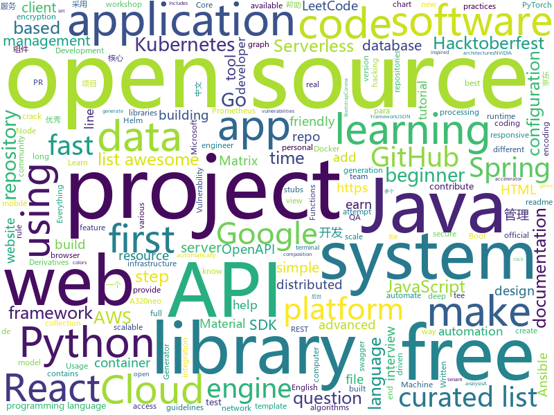

# 2020-10-01
See what the GitHub community is most excited about.

## python
+ [datasets](https://github.com/huggingface/datasets)(**13 stars today**): 🤗Fast, efficient, open-access datasets and evaluation metrics for Natural Language Processing and more in PyTorch, TensorFlow, NumPy and Pandas
+ [Real_Time_Image_Animation](https://github.com/anandpawara/Real_Time_Image_Animation)(**143 stars today**): The Project is real time application in opencv using first order model
+ [diagrams](https://github.com/mingrammer/diagrams)(**208 stars today**): 🎨Diagram as Code for prototyping cloud system architectures
+ [imaginaire](https://github.com/NVlabs/imaginaire)(**192 stars today**): NVIDIA PyTorch GAN library with distributed and mixed precision support
+ [PySyft](https://github.com/OpenMined/PySyft)(**37 stars today**): A library for answering questions using data you cannot see
+ [qxresearch-event-1](https://github.com/qxresearch/qxresearch-event-1)(**5 stars today**): 10 Python Application🦾| 10 lines of code👽
+ [system-design-primer](https://github.com/donnemartin/system-design-primer)(**154 stars today**): Learn how to design large-scale systems. Prep for the system design interview. Includes Anki flashcards.
+ [ansible](https://github.com/ansible/ansible)(**15 stars today**): Ansible is a radically simple IT automation platform that makes your applications and systems easier to deploy and maintain. Automate everything from code deployment to network configuration to cloud management, in a language that approaches plain English, using SSH, with no agents to install on remote systems. https://docs.ansible.com.
+ [Python-For-Kids](https://github.com/mytechnotalent/Python-For-Kids)(**90 stars today**): A comprehensive Python Development tutorial FOR KIDS utilizing an official BBC micro:bit Development Board going step-by-step into the world of Python for microcontrollers.
+ [nerve](https://github.com/PaytmLabs/nerve)(**14 stars today**): NERVE Continuous Vulnerability Scanner
+ [Summer2021-Internships](https://github.com/Pitt-CSC/Summer2021-Internships)(**16 stars today**): Collection of Summer 2021 tech internships!
+ [CppCoreGuidelines](https://github.com/isocpp/CppCoreGuidelines)(**13 stars today**): The C++ Core Guidelines are a set of tried-and-true guidelines, rules, and best practices about coding in C++
+ [FinancePy](https://github.com/domokane/FinancePy)(**26 stars today**): A Python Finance Library that focuses on the pricing and risk-management of Financial Derivatives, including fixed-income, equity, FX and credit derivatives.
+ [Ciphey](https://github.com/Ciphey/Ciphey)(**33 stars today**): ⚡Automatically decrypt encryptions without knowing the key or cipher, decode encodings, and crack hashes⚡
+ [frappe](https://github.com/frappe/frappe)(**8 stars today**): Low Code Open Source Framework in Python and JS
+ [present](https://github.com/vinayak-mehta/present)(**28 stars today**): A terminal-based presentation tool with colors and effects.
+ [salt](https://github.com/saltstack/salt)(**5 stars today**): Software to automate the management and configuration of any infrastructure or application at scale. Get access to the Salt software package repository here:
+ [Jarvis](https://github.com/sukeesh/Jarvis)(**6 stars today**): Personal Assistant for Linux and macOS
+ [great_expectations](https://github.com/great-expectations/great_expectations)(**9 stars today**): Always know what to expect from your data.
+ [CheatSheetSeries](https://github.com/OWASP/CheatSheetSeries)(**6 stars today**): The OWASP Cheat Sheet Series was created to provide a concise collection of high value information on specific application security topics.
+ [DeepPavlov](https://github.com/deepmipt/DeepPavlov)(**14 stars today**): An open source library for deep learning end-to-end dialog systems and chatbots.
+ [Python](https://github.com/geekcomputers/Python)(**12 stars today**): My Python Examples
+ [kitty](https://github.com/kovidgoyal/kitty)(**65 stars today**): A cross-platform, fast, feature full, GPU based terminal emulator
+ [l5kit](https://github.com/lyft/l5kit)(**4 stars today**): L5Kit - level5.lyft.com
+ [synapse](https://github.com/matrix-org/synapse)(**10 stars today**): Synapse: Matrix reference homeserver

## java
+ [DependencyCheck](https://github.com/jeremylong/DependencyCheck)(**7 stars today**): OWASP dependency-check is a software composition analysis utility that detects publicly disclosed vulnerabilities in application dependencies.
+ [jdk](https://github.com/openjdk/jdk)(**233 stars today**): JDK main-line development
+ [AntennaPod](https://github.com/AntennaPod/AntennaPod)(**6 stars today**): A podcast manager for Android
+ [spring-boot](https://github.com/spring-projects/spring-boot)(**25 stars today**): Spring Boot
+ [testcontainers-java](https://github.com/testcontainers/testcontainers-java)(**5 stars today**): Testcontainers is a Java library that supports JUnit tests, providing lightweight, throwaway instances of common databases, Selenium web browsers, or anything else that can run in a Docker container.
+ [janusgraph](https://github.com/JanusGraph/janusgraph)(**2 stars today**): JanusGraph: an open-source, distributed graph database
+ [GitHub-Chinese-Top-Charts](https://github.com/kon9chunkit/GitHub-Chinese-Top-Charts)(**21 stars today**): 🇨🇳GitHub中文排行榜，帮助你发现高分优秀中文项目、更高效地吸收国人的优秀经验成果；榜单每周更新一次，敬请关注！
+ [Java-Tutorial](https://github.com/h2pl/Java-Tutorial)(**25 stars today**): 【Java工程师面试复习指南】本仓库涵盖大部分Java程序员所需要掌握的核心知识，整合了互联网上的很多优质Java技术文章，力求打造为最完整最实用的Java开发者学习指南，如果对你有帮助，给个star告诉我吧，谢谢！
+ [quarkus](https://github.com/quarkusio/quarkus)(**5 stars today**): Quarkus: Supersonic Subatomic Java.
+ [serve](https://github.com/pytorch/serve)(**3 stars today**): Model Serving on PyTorch
+ [Mindustry](https://github.com/Anuken/Mindustry)(**9 stars today**): A sandbox tower defense game
+ [xdm](https://github.com/subhra74/xdm)(**9 stars today**): Powerfull download accelerator and video downloader
+ [grakn](https://github.com/graknlabs/grakn)(**2 stars today**): Grakn Core: The Knowledge Graph
+ [loom](https://github.com/openjdk/loom)(**11 stars today**): https://openjdk.java.net/projects/loom/
+ [DS-Algo-Point](https://github.com/sukritishah15/DS-Algo-Point)(**18 stars today**): This repository contains codes for various data structures and algorithms in various programming languages.
+ [interviews](https://github.com/kdn251/interviews)(**65 stars today**): Everything you need to know to get the job.
+ [openapi-generator](https://github.com/OpenAPITools/openapi-generator)(**9 stars today**): OpenAPI Generator allows generation of API client libraries (SDK generation), server stubs, documentation and configuration automatically given an OpenAPI Spec (v2, v3)
+ [drools](https://github.com/kiegroup/drools)(**1 stars today**): Drools is a rule engine, DMN engine and complex event processing (CEP) engine for Java.
+ [Spring-Cloud-Platform](https://github.com/wxiaoqi/Spring-Cloud-Platform)(**2 stars today**): Cloud-Platform是国内首个基于Spring Cloud的微服务开发平台，具有统一授权、认证后台管理系统，其中包含具备用户管理、资源权限管理、网关API管理等多个模块，支持多业务系统并行开发，可以作为后端服务的开发脚手架。代码简洁，架构清晰，适合学习和直接项目中使用。核心技术采用Spring Boot2以及Spring Cloud Gateway相关核心组件，前端采用vue-element-admin组件。
+ [react-native-share](https://github.com/react-native-community/react-native-share)(**3 stars today**): Social share, sending simple data to other apps.
+ [jsoncat](https://github.com/Snailclimb/jsoncat)(**2 stars today**): 仿 Spring Boot 但不同于 Spring Boot 的一个轻量级的 HTTP 框架
+ [elasticsearch-hadoop](https://github.com/elastic/elasticsearch-hadoop)(**1 stars today**): 🐘Elasticsearch real-time search and analytics natively integrated with Hadoop
+ [MPAndroidChart](https://github.com/PhilJay/MPAndroidChart)(**7 stars today**): A powerful🚀Android chart view / graph view library, supporting line- bar- pie- radar- bubble- and candlestick charts as well as scaling, panning and animations.
+ [aws-sdk-java](https://github.com/aws/aws-sdk-java)(**4 stars today**): The official AWS SDK for Java.
+ [Hacktoberfest](https://github.com/wir-coders/Hacktoberfest)(**29 stars today**): Make your first PR! ~ A beginner-friendly repository made specifically for open source beginners. Add your profile, a blog, or any program under any language or update the existing one. Just make sure to add the file under the correct directory. Happy hacking!

## unknown
+ [data-engineer-roadmap](https://github.com/datastacktv/data-engineer-roadmap)(**301 stars today**): Roadmap to becoming a data engineer in 2020
+ [awesome-for-beginners](https://github.com/MunGell/awesome-for-beginners)(**85 stars today**): A list of awesome beginners-friendly projects.
+ [awesome-interview-questions](https://github.com/MaximAbramchuck/awesome-interview-questions)(**71 stars today**): A curated awesome list of lists of interview questions. Feel free to contribute!🎓
+ [kubernetes-the-hard-way](https://github.com/kelseyhightower/kubernetes-the-hard-way)(**20 stars today**): Bootstrap Kubernetes the hard way on Google Cloud Platform. No scripts.
+ [HowToHunt](https://github.com/KathanP19/HowToHunt)(**12 stars today**): Tutorials and Things to Do while Hunting Vulnerability.
+ [NewGrad-2021](https://github.com/Pitt-CSC/NewGrad-2021)(**14 stars today**): A collection of New Grad full time roles in SWE, Quant, and PM.
+ [first-contributions](https://github.com/firstcontributions/first-contributions)(**45 stars today**): 🚀✨Help beginners to contribute to open source projects
+ [fucking-algorithm](https://github.com/labuladong/fucking-algorithm)(**91 stars today**): 刷算法全靠套路，认准 labuladong 就够了！English version supported! Crack LeetCode, not only how, but also why.
+ [Hacktoberfest2020](https://github.com/vinitshahdeo/Hacktoberfest2020)(**38 stars today**): List of beginner-friendly | first-timers-only | up-for-grabs issues (repositories) for Hacktoberfest 2020 | Submit 4 PRs to earn a T-shirt
+ [A-to-Z-Resources-for-Students](https://github.com/dipakkr/A-to-Z-Resources-for-Students)(**61 stars today**): ✅Curated list of resources for college students
+ [readme-model](https://github.com/devgabrieldejesus/readme-model)(**16 stars today**): My handsome readme model
+ [awesome-hacktoberfest-2020](https://github.com/OtacilioN/awesome-hacktoberfest-2020)(**19 stars today**): A curated list of awesome Hacktoberfest 2020 repositories
+ [QA_bible](https://github.com/Vladislav610/QA_bible)(**7 stars today**): Библия QA/тестировщика это 200++ страниц обновляемой смеси ответов на вопросы с реальных собеседований на QA, перевода интересного контента с зарубежных ресурсов и агрегации материала с отечественных.
+ [pix-api](https://github.com/bacen/pix-api)(**12 stars today**): API Pix: o Arranjo de Pagamentos Instantâneos do Brasil.
+ [awesome-hacking](https://github.com/carpedm20/awesome-hacking)(**6 stars today**): A curated list of awesome Hacking tutorials, tools and resources
+ [coding-interview-university](https://github.com/jwasham/coding-interview-university)(**127 stars today**): A complete computer science study plan to become a software engineer.
+ [what-happens-when](https://github.com/alex/what-happens-when)(**23 stars today**): An attempt to answer the age old interview question "What happens when you type google.com into your browser and press enter?"
+ [javascript-questions](https://github.com/lydiahallie/javascript-questions)(**19 stars today**): A long list of (advanced) JavaScript questions, and their explanations✨
+ [deep-learning-drizzle](https://github.com/kmario23/deep-learning-drizzle)(**11 stars today**): Drench yourself in Deep Learning, Reinforcement Learning, Machine Learning, Computer Vision, and NLP by learning from these exciting lectures!!
+ [vagas](https://github.com/frontendbr/vagas)(**13 stars today**): 🔬Espaço para divulgação de vagas para front-enders.
+ [awesome-sre](https://github.com/dastergon/awesome-sre)(**11 stars today**): A curated list of Site Reliability and Production Engineering resources.
+ [ue4-style-guide](https://github.com/Allar/ue4-style-guide)(**3 stars today**): An attempt to make Unreal Engine 4 projects more consistent
+ [awesome-test-automation](https://github.com/atinfo/awesome-test-automation)(**4 stars today**): A curated list of awesome test automation frameworks, tools, libraries, and software for different programming languages. Sponsored by http://sdclabs.com
+ [api-guidelines](https://github.com/microsoft/api-guidelines)(**2 stars today**): Microsoft REST API Guidelines
+ [readme-template](https://github.com/dbader/readme-template)(**4 stars today**): README.md template for your open-source project

## javascript
+ [proshop_mern](https://github.com/bradtraversy/proshop_mern)(**74 stars today**): Shopping cart built with MERN & Redux
+ [advanced-react-patterns](https://github.com/kentcdodds/advanced-react-patterns)(**44 stars today**): This is the latest advanced react patterns workshop
+ [CyberChef](https://github.com/gchq/CyberChef)(**71 stars today**): The Cyber Swiss Army Knife - a web app for encryption, encoding, compression and data analysis
+ [Javascript](https://github.com/TheAlgorithms/Javascript)(**227 stars today**): A repository for All algorithms implemented in Javascript (for educational purposes only)
+ [react-fundamentals](https://github.com/kentcdodds/react-fundamentals)(**141 stars today**): Material for my React Fundamentals Workshop
+ [zhaopp](https://github.com/gdtool/zhaopp)(**109 stars today**): 一个Google Drive搜索引擎 https://zhao.pp.ua/
+ [advanced-react-hooks](https://github.com/kentcdodds/advanced-react-hooks)(**45 stars today**): Learn Advanced React Hooks workshop
+ [react-performance](https://github.com/kentcdodds/react-performance)(**40 stars today**): Let's make our apps fast⚡
+ [react-suspense](https://github.com/kentcdodds/react-suspense)(**33 stars today**): React Suspense workshop
+ [bookshelf](https://github.com/kentcdodds/bookshelf)(**45 stars today**): Build a ReactJS App workshop
+ [scripts](https://github.com/lxk0301/scripts)(**13 stars today**): 京东薅羊毛工具（活动入口：京东app->我的->游戏与互动->查看更多）讨论组：https://t.me/JD_fruit_pet
+ [bootstrap](https://github.com/twbs/bootstrap)(**30 stars today**): The most popular HTML, CSS, and JavaScript framework for developing responsive, mobile first projects on the web.
+ [realworld](https://github.com/gothinkster/realworld)(**163 stars today**): "The mother of all demo apps" — Exemplary fullstack Medium.com clone powered by React, Angular, Node, Django, and many more🏅
+ [next.js](https://github.com/vercel/next.js)(**45 stars today**): The React Framework
+ [json-editor](https://github.com/json-editor/json-editor)(**5 stars today**): JSON Schema Based Editor
+ [serverless](https://github.com/serverless/serverless)(**14 stars today**): ⚡Serverless Framework – Build web, mobile and IoT applications with serverless architectures using AWS Lambda, Azure Functions, Google CloudFunctions & more! –
+ [pipedream](https://github.com/PipedreamHQ/pipedream)(**6 stars today**): Serverless integration and compute platform. Free for developers.
+ [tech-interview-handbook](https://github.com/yangshun/tech-interview-handbook)(**67 stars today**): 💯Materials to help you rock your next coding interview
+ [mobx](https://github.com/mobxjs/mobx)(**9 stars today**): Simple, scalable state management.
+ [exceljs](https://github.com/exceljs/exceljs)(**12 stars today**): Excel Workbook Manager
+ [react-native-reanimated](https://github.com/software-mansion/react-native-reanimated)(**12 stars today**): React Native's Animated library reimplemented
+ [svelte](https://github.com/sveltejs/svelte)(**29 stars today**): Cybernetically enhanced web apps
+ [shapez.io](https://github.com/tobspr/shapez.io)(**104 stars today**): shapez.io is an open source base building game inspired by factorio! Available on web & desktop
+ [strapi](https://github.com/strapi/strapi)(**37 stars today**): 🚀Open source Node.js Headless CMS to easily build customisable APIs
+ [Hacktoberfest-2020](https://github.com/OpenSourceTogether/Hacktoberfest-2020)(**101 stars today**): Simply add your details to readme and stand a chance to earn a free tee!✅

## html
+ [Hacktoberfest2020](https://github.com/OpenSouceCode/Hacktoberfest2020)(**77 stars today**): Make your first Pull Request and earn a free tee from GitHub!
+ [python](https://github.com/Show-Me-the-Code/python)(**2 stars today**): Show Me the Code Python version.
+ [Hacktoberfest-2020](https://github.com/Ishaan28malik/Hacktoberfest-2020)(**36 stars today**): Make this Hacktoberfest a learning period and contribute to Great Open Source Projects.
+ [hacktoberfest](https://github.com/AliceWonderland/hacktoberfest)(**20 stars today**): Participate in Hacktoberfest by contributing to any Open Source project on GitHub! Here is a starter project for first time contributors. #hacktoberfest
+ [a32nx](https://github.com/flybywiresim/a32nx)(**27 stars today**): The A32NX Project is a community driven open source project to create a free Airbus A320neo in Microsoft Flight Simulator that is as close to reality as possible. It aims to enhance the default A320neo by improving the systems depth and functionality to bring it up to payware-level, all for free.
+ [matrix-docker-ansible-deploy](https://github.com/spantaleev/matrix-docker-ansible-deploy)(**3 stars today**): Matrix (An open network for secure, decentralized communication) server setup using Ansible and Docker
+ [element-web](https://github.com/vector-im/element-web)(**8 stars today**): A glossy Matrix collaboration client for the web.
+ [helm-charts](https://github.com/prometheus-community/helm-charts)(**8 stars today**): Prometheus community Helm charts
+ [html](https://github.com/whatwg/html)(**3 stars today**): HTML Standard
+ [responsive-html-email-template](https://github.com/leemunroe/responsive-html-email-template)(**5 stars today**): A free simple responsive HTML email template
+ [website](https://github.com/kubernetes/website)(**3 stars today**): Kubernetes website and documentation repo:
+ [machine-learning-systems-design](https://github.com/chiphuyen/machine-learning-systems-design)(**10 stars today**): A booklet on machine learning systems design with exercises
+ [apijam](https://github.com/apigee/apijam)(**3 stars today**): GitHub repo for API Jam Workshop
+ [msteams-docs](https://github.com/MicrosoftDocs/msteams-docs)(**0 stars today**): Source for the Microsoft Teams developer platform documentation.
+ [electron-api-demos](https://github.com/electron/electron-api-demos)(**4 stars today**): Explore the Electron APIs
+ [tabler](https://github.com/tabler/tabler)(**5 stars today**): Tabler is free and open-source HTML Dashboard UI Kit built on Bootstrap
+ [cwa-website](https://github.com/corona-warn-app/cwa-website)(**0 stars today**): Corona-Warn-App website
+ [personal-website](https://github.com/github/personal-website)(**7 stars today**): Code that'll help you kickstart a personal website that showcases your work as a software developer.
+ [intro.js](https://github.com/usablica/intro.js)(**0 stars today**): A better way for new feature introduction and step-by-step users guide for your website and project.
+ [WebFundamentals](https://github.com/google/WebFundamentals)(**5 stars today**): Best practices for modern web development
+ [website](https://github.com/kubeflow/website)(**1 stars today**): Kubeflow's public website
+ [argo-helm](https://github.com/argoproj/argo-helm)(**0 stars today**): ArgoProj Helm Charts
+ [ai-edu](https://github.com/microsoft/ai-edu)(**0 stars today**): AI education materials for Chinese students, teachers and IT professionals.
+ [keep-a-changelog](https://github.com/olivierlacan/keep-a-changelog)(**0 stars today**): If you build software, keep a changelog.
+ [swagger-codegen](https://github.com/swagger-api/swagger-codegen)(**4 stars today**): swagger-codegen contains a template-driven engine to generate documentation, API clients and server stubs in different languages by parsing your OpenAPI / Swagger definition.

## go
+ [elsa](https://github.com/elsaland/elsa)(**373 stars today**): ❄️Elsa is a minimal, fast and secure runtime for Javascript and Typescript written in Go
+ [LeetCode-Go](https://github.com/halfrost/LeetCode-Go)(**45 stars today**): ✅Solutions to LeetCode by Go, 100% test coverage, runtime beats 100% / LeetCode 题解
+ [aws-sdk-go](https://github.com/aws/aws-sdk-go)(**6 stars today**): AWS SDK for the Go programming language.
+ [terraform](https://github.com/hashicorp/terraform)(**15 stars today**): Terraform enables you to safely and predictably create, change, and improve infrastructure. It is an open source tool that codifies APIs into declarative configuration files that can be shared amongst team members, treated as code, edited, reviewed, and versioned.
+ [external-dns](https://github.com/kubernetes-sigs/external-dns)(**4 stars today**): Configure external DNS servers (AWS Route53, Google CloudDNS and others) for Kubernetes Ingresses and Services
+ [duf](https://github.com/muesli/duf)(**378 stars today**): Disk Usage/Free Utility
+ [kind](https://github.com/kubernetes-sigs/kind)(**9 stars today**): Kubernetes IN Docker - local clusters for testing Kubernetes
+ [metrics-server](https://github.com/kubernetes-sigs/metrics-server)(**7 stars today**): Cluster-wide aggregator of resource usage data.
+ [fission](https://github.com/fission/fission)(**6 stars today**): Fast and Simple Serverless Functions for Kubernetes
+ [MailHog](https://github.com/mailhog/MailHog)(**7 stars today**): Web and API based SMTP testing
+ [cortex](https://github.com/cortexproject/cortex)(**4 stars today**): A horizontally scalable, highly available, multi-tenant, long term Prometheus.
+ [kubebuilder](https://github.com/kubernetes-sigs/kubebuilder)(**57 stars today**): Kubebuilder - SDK for building Kubernetes APIs using CRDs
+ [kubernetes](https://github.com/kubernetes/kubernetes)(**21 stars today**): Production-Grade Container Scheduling and Management
+ [resty](https://github.com/go-resty/resty)(**4 stars today**): Simple HTTP and REST client library for Go
+ [tidb](https://github.com/pingcap/tidb)(**8 stars today**): TiDB is an open source distributed HTAP database compatible with the MySQL protocol
+ [enhancements](https://github.com/kubernetes/enhancements)(**2 stars today**): Enhancements tracking repo for Kubernetes
+ [chi](https://github.com/go-chi/chi)(**4 stars today**): lightweight, idiomatic and composable router for building Go HTTP services
+ [earthly](https://github.com/earthly/earthly)(**32 stars today**): Build automation for the post-container era
+ [hey](https://github.com/rakyll/hey)(**10 stars today**): HTTP load generator, ApacheBench (ab) replacement, formerly known as rakyll/boom
+ [logo-ls](https://github.com/Yash-Handa/logo-ls)(**14 stars today**): Modern ls command with vscode like File Icon and Git Integrations. Written in Golang
+ [act](https://github.com/nektos/act)(**27 stars today**): Run your GitHub Actions locally🚀
+ [spark-on-k8s-operator](https://github.com/GoogleCloudPlatform/spark-on-k8s-operator)(**0 stars today**): Kubernetes operator for managing the lifecycle of Apache Spark applications on Kubernetes.
+ [opentelemetry-collector-contrib](https://github.com/open-telemetry/opentelemetry-collector-contrib)(**0 stars today**): Contrib repository for the OpenTelemetry Collector
+ [oauth2-proxy](https://github.com/oauth2-proxy/oauth2-proxy)(**4 stars today**): A reverse proxy that provides authentication with Google, Github or other providers.
+ [pq](https://github.com/lib/pq)(**4 stars today**): Pure Go Postgres driver for database/sql

## WordCloud

