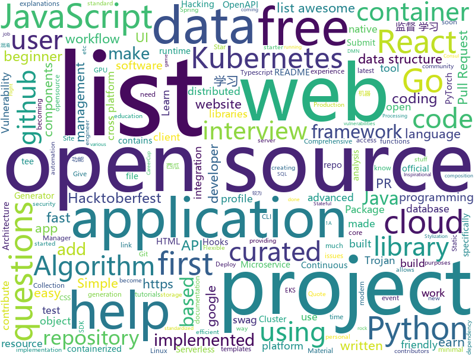

# 2020-10-02
See what the GitHub community is most excited about.

## python
+ [datasets](https://github.com/huggingface/datasets)(**124 stars today**): 🤗Fast, efficient, open-access datasets and evaluation metrics for Natural Language Processing and more in PyTorch, TensorFlow, NumPy and Pandas
+ [Few-Shot-Patch-Based-Training](https://github.com/OndrejTexler/Few-Shot-Patch-Based-Training)(**30 stars today**): The official implementation of our SIGGRAPH 2020 paper Interactive Video Stylization Using Few-Shot Patch-Based Training
+ [cockroachdb-todo-apps](https://github.com/cockroachdb/cockroachdb-todo-apps)(**5 stars today**): CockroachDB To-Do Apps
+ [Python](https://github.com/geekcomputers/Python)(**12 stars today**): My Python Examples
+ [Python](https://github.com/TheAlgorithms/Python)(**48 stars today**): All Algorithms implemented in Python
+ [nvidia-sniper](https://github.com/philippnormann/nvidia-sniper)(**14 stars today**): 🎯Autonomously buy Nvidia Founders Edition GPUs as soon as they become available
+ [mypy](https://github.com/python/mypy)(**6 stars today**): Optional static typing for Python 3 and 2 (PEP 484)
+ [Real_Time_Image_Animation](https://github.com/anandpawara/Real_Time_Image_Animation)(**94 stars today**): The Project is real time application in opencv using first order model
+ [football](https://github.com/google-research/football)(**10 stars today**): Check out the new game server:
+ [public-apis](https://github.com/public-apis/public-apis)(**86 stars today**): A collective list of free APIs for use in software and web development.
+ [prefect](https://github.com/PrefectHQ/prefect)(**14 stars today**): The easiest way to automate your data
+ [AlgorithmsAndDataStructure](https://github.com/Py-Contributors/AlgorithmsAndDataStructure)(**59 stars today**): Algorithms And DataStructure Implemented In Python & CPP, Give a Star🌟If it helps you
+ [PySyft](https://github.com/OpenMined/PySyft)(**63 stars today**): A library for answering questions using data you cannot see
+ [oppia](https://github.com/oppia/oppia)(**2 stars today**): A free, online learning platform to make quality education accessible for all.
+ [great_expectations](https://github.com/great-expectations/great_expectations)(**33 stars today**): Always know what to expect from your data.
+ [Jarvis](https://github.com/sukeesh/Jarvis)(**12 stars today**): Personal Assistant for Linux and macOS
+ [genforce](https://github.com/genforce/genforce)(**87 stars today**): GenForce: an efficient PyTorch library for deep generative modeling (StyleGANv1v2, PGGAN, etc)
+ [aws-cloudformation-templates](https://github.com/awslabs/aws-cloudformation-templates)(**2 stars today**): A collection of useful CloudFormation templates
+ [kitty](https://github.com/kovidgoyal/kitty)(**46 stars today**): A cross-platform, fast, feature full, GPU based terminal emulator
+ [poetry](https://github.com/python-poetry/poetry)(**16 stars today**): Python dependency management and packaging made easy.
+ [Hacktoberfest-2020](https://github.com/Py-Contributors/Hacktoberfest-2020)(**7 stars today**): Learn how to Open your First PR (Pull Request) and contribute towards Open Source
+ [ScoutSuite](https://github.com/nccgroup/ScoutSuite)(**9 stars today**): Multi-Cloud Security Auditing Tool
+ [pandas](https://github.com/pandas-dev/pandas)(**14 stars today**): Flexible and powerful data analysis / manipulation library for Python, providing labeled data structures similar to R data.frame objects, statistical functions, and much more
+ [nerve](https://github.com/PaytmLabs/nerve)(**9 stars today**): NERVE Continuous Vulnerability Scanner
+ [CodingInterviews](https://github.com/jayshah19949596/CodingInterviews)(**20 stars today**): This repository contains coding interviews that I have encountered in company interviews

## java
+ [DS-Algo-Point](https://github.com/sukritishah15/DS-Algo-Point)(**16 stars today**): This repository contains codes for various data structures and algorithms in C, C++, Java, Python.
+ [interviews](https://github.com/kdn251/interviews)(**36 stars today**): Everything you need to know to get the job.
+ [SDE-Interview-Questions](https://github.com/rishabh115/SDE-Interview-Questions)(**34 stars today**): Most comprehensive list📋of tech interview questions📘of companies scraped from Geeksforgeeks, CareerCup and Glassdoor.
+ [Java](https://github.com/TheAlgorithms/Java)(**20 stars today**): All Algorithms implemented in Java
+ [graphql-java](https://github.com/graphql-java/graphql-java)(**2 stars today**): GraphQL Java implementation
+ [DependencyCheck](https://github.com/jeremylong/DependencyCheck)(**37 stars today**): OWASP dependency-check is a software composition analysis utility that detects publicly disclosed vulnerabilities in application dependencies.
+ [testcontainers-java](https://github.com/testcontainers/testcontainers-java)(**14 stars today**): Testcontainers is a Java library that supports JUnit tests, providing lightweight, throwaway instances of common databases, Selenium web browsers, or anything else that can run in a Docker container.
+ [jdk](https://github.com/openjdk/jdk)(**110 stars today**): JDK main-line development
+ [JAVA](https://github.com/akshitagit/JAVA)(**5 stars today**): Repository for Java codes and algos.Star the repo too.
+ [RIBs](https://github.com/uber/RIBs)(**2 stars today**): Uber's cross-platform mobile architecture framework.
+ [zeebe](https://github.com/zeebe-io/zeebe)(**4 stars today**): Distributed Workflow Engine for Microservices Orchestration
+ [hibernate-orm](https://github.com/hibernate/hibernate-orm)(**3 stars today**): Hibernate's core Object/Relational Mapping functionality
+ [teammates](https://github.com/TEAMMATES/teammates)(**0 stars today**): This is the project website for the TEAMMATES feedback management tool for education
+ [QNotified](https://github.com/ferredoxin/QNotified)(**4 stars today**): QQ辅助性功能增强
+ [aem-core-wcm-components](https://github.com/adobe/aem-core-wcm-components)(**0 stars today**): Set of standardized components to build websites on AEM.
+ [flyway](https://github.com/flyway/flyway)(**4 stars today**): Flyway by Redgate • Database Migrations Made Easy.
+ [keycloak](https://github.com/keycloak/keycloak)(**10 stars today**): Open Source Identity and Access Management For Modern Applications and Services
+ [Java-A-Z](https://github.com/dubesar/Java-A-Z)(**0 stars today**): Java programming. Join the Discord link.
+ [jackson-databind](https://github.com/FasterXML/jackson-databind)(**1 stars today**): General data-binding package for Jackson (2.x): works on streaming API (core) implementation(s)
+ [openapi-generator](https://github.com/OpenAPITools/openapi-generator)(**9 stars today**): OpenAPI Generator allows generation of API client libraries (SDK generation), server stubs, documentation and configuration automatically given an OpenAPI Spec (v2, v3)
+ [strongbox](https://github.com/strongbox/strongbox)(**5 stars today**): Strongbox is an artifact repository manager.
+ [camunda-bpm-platform](https://github.com/camunda/camunda-bpm-platform)(**3 stars today**): Flexible framework for workflow and decision automation with BPMN and DMN. Integration with Spring, Spring Boot, CDI.
+ [jabref](https://github.com/JabRef/jabref)(**2 stars today**): Graphical Java application for managing BibTeX and biblatex (.bib) databases
+ [CtCI-6th-Edition](https://github.com/careercup/CtCI-6th-Edition)(**8 stars today**): Cracking the Coding Interview 6th Ed. Solutions
+ [community](https://github.com/GoogleCloudPlatform/community)(**1 stars today**): This repository holds the content submitted to https://cloud.google.com/community. Files added to the tutorials/ will appear at https://cloud.google.com/community/tutorials.

## unknown
+ [first-contributions](https://github.com/firstcontributions/first-contributions)(**38 stars today**): 🚀✨Help beginners to contribute to open source projects
+ [awesome-for-beginners](https://github.com/MunGell/awesome-for-beginners)(**86 stars today**): A list of awesome beginners-friendly projects.
+ [design-resources-for-developers](https://github.com/bradtraversy/design-resources-for-developers)(**46 stars today**): Curated list of design and UI resources from stock photos, web templates, CSS frameworks, UI libraries, tools and much more
+ [javascript-questions](https://github.com/lydiahallie/javascript-questions)(**23 stars today**): A long list of (advanced) JavaScript questions, and their explanations✨
+ [awesome-interview-questions](https://github.com/MaximAbramchuck/awesome-interview-questions)(**40 stars today**): A curated awesome list of lists of interview questions. Feel free to contribute!🎓
+ [build-your-own-x](https://github.com/danistefanovic/build-your-own-x)(**70 stars today**): 🤓Build your own (insert technology here)
+ [app-ideas](https://github.com/florinpop17/app-ideas)(**62 stars today**): A Collection of application ideas which can be used to improve your coding skills.
+ [hardware-hacking](https://github.com/koutto/hardware-hacking)(**207 stars today**): Some stuff about Hardware Hacking
+ [Machine-learning-learning-notes](https://github.com/Vay-keen/Machine-learning-learning-notes)(**111 stars today**): 周志华《机器学习》又称西瓜书是一本较为全面的书籍，书中详细介绍了机器学习领域不同类型的算法(例如：监督学习、无监督学习、半监督学习、强化学习、集成降维、特征选择等)，记录了本人在学习过程中的理解思路与扩展知识点，希望对新人阅读西瓜书有所帮助！
+ [openebs](https://github.com/openebs/openebs)(**27 stars today**): Leading Open Source Container Attached Storage, built using Cloud Native Architecture, simplifies running Stateful Applications on Kubernetes.
+ [data-engineer-roadmap](https://github.com/datastacktv/data-engineer-roadmap)(**353 stars today**): Roadmap to becoming a data engineer in 2020
+ [renaming](https://github.com/github/renaming)(**21 stars today**): Guidance for changing the default branch name for GitHub repositories
+ [WindowsXP](https://github.com/shaswata56/WindowsXP)(**25 stars today**): This is the leaked source code of Windows XP Service Pack 1
+ [awesome-hacktoberfest-2020](https://github.com/OtacilioN/awesome-hacktoberfest-2020)(**18 stars today**): A curated list of awesome Hacktoberfest 2020 repositories
+ [free-tshirts-stickers-and-swag-for-developers](https://github.com/Joonsang1994/free-tshirts-stickers-and-swag-for-developers)(**19 stars today**): List of free tshirts, stickers and swags available for developers
+ [coding-interview-university](https://github.com/jwasham/coding-interview-university)(**106 stars today**): A complete computer science study plan to become a software engineer.
+ [Hacktoberfest2020](https://github.com/vinitshahdeo/Hacktoberfest2020)(**23 stars today**): List of beginner-friendly | first-timers-only | up-for-grabs issues (repositories) for Hacktoberfest 2020 | Submit 4 PRs to earn a T-shirt
+ [developer-roadmap](https://github.com/kamranahmedse/developer-roadmap)(**127 stars today**): Roadmap to becoming a web developer in 2020
+ [A-to-Z-Resources-for-Students](https://github.com/dipakkr/A-to-Z-Resources-for-Students)(**27 stars today**): ✅Curated list of resources for college students
+ [interview](https://github.com/andreis/interview)(**16 stars today**): Everything you need to prepare for your technical interview
+ [start-here-guidelines](https://github.com/zero-to-mastery/start-here-guidelines)(**5 stars today**): Lets Git started in the world of opensource, starting in the Zero To Mastery's opensource playground. Especially designed for education and practical experience purposes.
+ [You-Dont-Know-JS](https://github.com/getify/You-Dont-Know-JS)(**47 stars today**): A book series on JavaScript. @YDKJS on twitter.
+ [awesome-app-ideas](https://github.com/tastejs/awesome-app-ideas)(**5 stars today**): List of awesome app ideas
+ [roadmap](https://github.com/github/roadmap)(**5 stars today**): GitHub public roadmap
+ [awesome-react-components](https://github.com/brillout/awesome-react-components)(**31 stars today**): Curated List of React Components & Libraries.

## javascript
+ [react-fundamentals](https://github.com/kentcdodds/react-fundamentals)(**136 stars today**): Material for my React Fundamentals Workshop
+ [advanced-react-hooks](https://github.com/kentcdodds/advanced-react-hooks)(**106 stars today**): Learn Advanced React Hooks workshop
+ [react-performance](https://github.com/kentcdodds/react-performance)(**136 stars today**): Let's make our apps fast⚡
+ [proshop_mern](https://github.com/bradtraversy/proshop_mern)(**116 stars today**): Shopping cart built with MERN & Redux
+ [advanced-react-patterns](https://github.com/kentcdodds/advanced-react-patterns)(**236 stars today**): This is the latest advanced react patterns workshop
+ [Javascript](https://github.com/TheAlgorithms/Javascript)(**186 stars today**): A repository for All algorithms implemented in Javascript (for educational purposes only)
+ [react-hooks](https://github.com/kentcdodds/react-hooks)(**9 stars today**): Learn React Hooks!🎣⚛
+ [Hacktoberfest-2020](https://github.com/OpenSourceTogether/Hacktoberfest-2020)(**95 stars today**): Simply add your details to readme and stand a chance to earn a free tee!✅
+ [tech-interview-handbook](https://github.com/yangshun/tech-interview-handbook)(**29 stars today**): 💯Materials to help you rock your next coding interview
+ [CyberChef](https://github.com/gchq/CyberChef)(**148 stars today**): The Cyber Swiss Army Knife - a web app for encryption, encoding, compression and data analysis
+ [react-suspense](https://github.com/kentcdodds/react-suspense)(**70 stars today**): React Suspense workshop
+ [javascript-algorithms](https://github.com/trekhleb/javascript-algorithms)(**55 stars today**): 📝Algorithms and data structures implemented in JavaScript with explanations and links to further readings
+ [reactjs-interview-questions](https://github.com/sudheerj/reactjs-interview-questions)(**37 stars today**): List of top 500 ReactJS Interview Questions & Answers....Coding exercise questions are coming soon!!
+ [freeCodeCamp](https://github.com/freeCodeCamp/freeCodeCamp)(**52 stars today**): freeCodeCamp.org's open source codebase and curriculum. Learn to code at home.
+ [jira_clone](https://github.com/oldboyxx/jira_clone)(**14 stars today**): A simplified Jira clone built with React/Babel (Client), and Node/TypeScript (API). Auto formatted with Prettier, tested with Cypress.
+ [swag-for-dev](https://github.com/swapagarwal/swag-for-dev)(**13 stars today**): 😎swag opportunities for developers
+ [Hacktoberfest2020-MovieDo](https://github.com/garimasingh128/Hacktoberfest2020-MovieDo)(**10 stars today**): 🤪🤨🧐🤓😎HACKTOBERFEST 2020 ALERT: Submit Just 4 PRs to earn SWAGS🤪🤨🧐🤓😎
+ [inspirational-quotes](https://github.com/vinitshahdeo/inspirational-quotes)(**6 stars today**): 💡A simple NPM Package which returns random Inspirational Quotes. Get your daily quote and stay motivated!✌️🌸
+ [github-profile-readme-generator](https://github.com/rahuldkjain/github-profile-readme-generator)(**51 stars today**): 🚀Generate github profile README easily with latest add-ons like visitors count, github stats, etc using minimal UI.
+ [pipedream](https://github.com/PipedreamHQ/pipedream)(**6 stars today**): Serverless integration and compute platform. Free for developers.
+ [netlify-cms](https://github.com/netlify/netlify-cms)(**7 stars today**): A Git-based CMS for Static Site Generators
+ [zhaopp](https://github.com/gdtool/zhaopp)(**48 stars today**): 一个Google Drive搜索引擎 https://zhao.pp.ua/
+ [NativeBase](https://github.com/GeekyAnts/NativeBase)(**6 stars today**): Essential cross-platform UI components for React Native
+ [ember.js](https://github.com/emberjs/ember.js)(**5 stars today**): Ember.js - A JavaScript framework for creating ambitious web applications
+ [up-for-grabs.net](https://github.com/up-for-grabs/up-for-grabs.net)(**6 stars today**): This is a list of projects which have curated tasks specifically for new contributors. These issues are a great way to get started with a project, or to help share the load of working on open source projects. Jump in!

## html
+ [python](https://github.com/Show-Me-the-Code/python)(**2 stars today**): Show Me the Code Python version.
+ [Hacktoberfest2020](https://github.com/OpenSouceCode/Hacktoberfest2020)(**82 stars today**): Make your first Pull Request and earn a free tee from GitHub!
+ [hacktoberfest](https://github.com/AliceWonderland/hacktoberfest)(**10 stars today**): Participate in Hacktoberfest by contributing to any Open Source project on GitHub! Here is a starter project for first time contributors. #hacktoberfest
+ [html](https://github.com/whatwg/html)(**13 stars today**): HTML Standard
+ [awesome-competitive-programming](https://github.com/lnishan/awesome-competitive-programming)(**12 stars today**): 💎A curated list of awesome Competitive Programming, Algorithm and Data Structure resources
+ [personal-website](https://github.com/github/personal-website)(**2 stars today**): Code that'll help you kickstart a personal website that showcases your work as a software developer.
+ [Front-end-Developer-Interview-Questions](https://github.com/h5bp/Front-end-Developer-Interview-Questions)(**10 stars today**): A list of helpful front-end related questions you can use to interview potential candidates, test yourself or completely ignore.
+ [responsive-html-email-template](https://github.com/leemunroe/responsive-html-email-template)(**7 stars today**): A free simple responsive HTML email template
+ [WebFundamentals](https://github.com/google/WebFundamentals)(**4 stars today**): Best practices for modern web development
+ [django-DefectDojo](https://github.com/DefectDojo/django-DefectDojo)(**2 stars today**): DefectDojo is an open-source application vulnerability correlation and security orchestration tool.
+ [simpl](https://github.com/samdutton/simpl)(**2 stars today**): Simplest possible examples of HTML, CSS and Javascript:
+ [html-css](https://github.com/gustavoguanabara/html-css)(**2 stars today**): Curso de HTML5 e CSS3
+ [en.javascript.info](https://github.com/javascript-tutorial/en.javascript.info)(**14 stars today**): Modern JavaScript Tutorial
+ [element-web](https://github.com/vector-im/element-web)(**6 stars today**): A glossy Matrix collaboration client for the web.
+ [Hack-Day](https://github.com/lugnitdgp/Hack-Day)(**10 stars today**): An event organised by GNU/Linux Users' Group, NIT Durgapur. Visit
+ [eks-charts](https://github.com/aws/eks-charts)(**2 stars today**): Amazon EKS Helm chart repository
+ [website](https://github.com/mono/website)(**2 stars today**): Mono's web site.
+ [B787-XE](https://github.com/lmk02/B787-XE)(**7 stars today**): A modification of the Microsoft Flight Simulator 2020 787-10
+ [Poke-Dex](https://github.com/AM1CODES/Poke-Dex)(**7 stars today**): This is a small webpage that allows user to add their favourite Pokémons! This project aims to help people in creating their first pull requests and participating in Hacktoberfest 2020.
+ [tails](https://github.com/thedevdojo/tails)(**4 stars today**): Tails is a (no-config) copy'n paste library of templates and components crafted using TailwindCSS
+ [website](https://github.com/kubernetes/website)(**1 stars today**): Kubernetes website and documentation repo:
+ [kubespray](https://github.com/kubernetes-sigs/kubespray)(**4 stars today**): Deploy a Production Ready Kubernetes Cluster
+ [web-starter-kit](https://github.com/google/web-starter-kit)(**0 stars today**): Web Starter Kit - a workflow for multi-device websites
+ [Hacktoberfest](https://github.com/wir-coders/Hacktoberfest)(**8 stars today**): Make your first PR! ~ A beginner-friendly repository made specifically for open source beginners. Add your profile, a blog, or any program under any language or update the existing one. Just make sure to add the file under the correct directory. Happy hacking!
+ [simple-icons](https://github.com/simple-icons/simple-icons)(**7 stars today**): SVG icons for popular brands

## go
+ [nomad](https://github.com/hashicorp/nomad)(**9 stars today**): Nomad is an easy-to-use, flexible, and performant workload orchestrator that can deploy a mix of microservice, batch, containerized, and non-containerized applications. Nomad is easy to operate and scale and has native Consul and Vault integrations.
+ [fission](https://github.com/fission/fission)(**11 stars today**): Fast and Simple Serverless Functions for Kubernetes
+ [earthly](https://github.com/earthly/earthly)(**58 stars today**): Build automation for the post-container era
+ [eksctl](https://github.com/weaveworks/eksctl)(**3 stars today**): The official CLI for Amazon EKS
+ [elsa](https://github.com/elsaland/elsa)(**121 stars today**): ❄️Elsa is a minimal, fast and secure runtime for Javascript and Typescript written in Go
+ [flux](https://github.com/fluxcd/flux)(**4 stars today**): The GitOps Kubernetes operator
+ [terraform-provider-azurerm](https://github.com/terraform-providers/terraform-provider-azurerm)(**3 stars today**): Terraform provider for Azure Resource Manager
+ [k9s](https://github.com/derailed/k9s)(**11 stars today**): 🐶Kubernetes CLI To Manage Your Clusters In Style!
+ [ent](https://github.com/facebook/ent)(**62 stars today**): An entity framework for Go
+ [trojan-go](https://github.com/p4gefau1t/trojan-go)(**39 stars today**): Go实现的Trojan代理，支持多路复用/路由功能/CDN中转/Shadowsocks混淆插件，多平台，无依赖。A Trojan proxy written in Go. An unidentifiable mechanism that helps you bypass GFW. https://p4gefau1t.github.io/trojan-go/
+ [kubernetes](https://github.com/kubernetes/kubernetes)(**31 stars today**): Production-Grade Container Scheduling and Management
+ [aws-sdk-go](https://github.com/aws/aws-sdk-go)(**4 stars today**): AWS SDK for the Go programming language.
+ [lakeFS](https://github.com/treeverse/lakeFS)(**4 stars today**): An open source platform that delivers resilience and manageability to object-storage based data lakes
+ [botkube](https://github.com/infracloudio/botkube)(**3 stars today**): An app that helps you monitor your Kubernetes cluster, debug critical deployments & gives recommendations for standard practices
+ [argo](https://github.com/argoproj/argo)(**12 stars today**): Argo Workflows: Get stuff done with Kubernetes.
+ [concourse](https://github.com/concourse/concourse)(**3 stars today**): Concourse is a container-based continuous thing-doer written in Go and Elm.
+ [atlantis](https://github.com/runatlantis/atlantis)(**1 stars today**): Terraform Pull Request Automation
+ [google-api-go-client](https://github.com/googleapis/google-api-go-client)(**1 stars today**): Auto-generated Google APIs for Go.
+ [helm](https://github.com/helm/helm)(**8 stars today**): The Kubernetes Package Manager
+ [dapr](https://github.com/dapr/dapr)(**25 stars today**): Dapr is a portable, event-driven, runtime for building distributed applications across cloud and edge.
+ [cockroach](https://github.com/cockroachdb/cockroach)(**4 stars today**): CockroachDB - the open source, cloud-native distributed SQL database.
+ [terratest](https://github.com/gruntwork-io/terratest)(**1 stars today**): Terratest is a Go library that makes it easier to write automated tests for your infrastructure code.
+ [trivy](https://github.com/aquasecurity/trivy)(**7 stars today**): A Simple and Comprehensive Vulnerability Scanner for Containers, Suitable for CI
+ [kratos](https://github.com/ory/kratos)(**6 stars today**): Never build user login, user registration, 2fa, profile management ever again! Works on any operating system, cloud, with any programming language, user interface, and user experience! Written in Go.
+ [blackbox_exporter](https://github.com/prometheus/blackbox_exporter)(**2 stars today**): Blackbox prober exporter

## WordCloud

