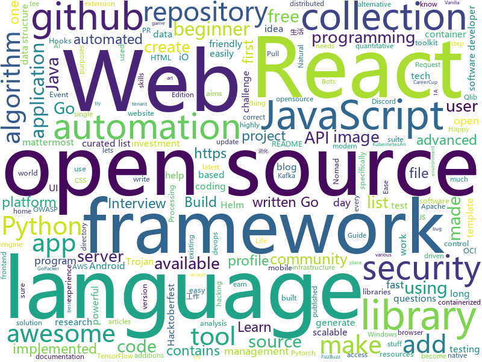

# 2020-10-03
See what the GitHub community is most excited about.

## python
+ [datasets](https://github.com/huggingface/datasets)(**174 stars today**): 🤗Fast, efficient, open-access datasets and evaluation metrics for Natural Language Processing and more in PyTorch, TensorFlow, NumPy and Pandas
+ [EssayKiller_V2](https://github.com/EssayKillerBrain/EssayKiller_V2)(**149 stars today**): 基于开源GPT2.0的初代创作型人工智能 | 可扩展、可进化
+ [NeMo](https://github.com/NVIDIA/NeMo)(**14 stars today**): NeMo: a toolkit for conversational AI
+ [Python](https://github.com/geekcomputers/Python)(**26 stars today**): My Python Examples
+ [rotate](https://github.com/rvizzz/rotate)(**66 stars today**): Create recursive image rotation animations
+ [Python](https://github.com/TheAlgorithms/Python)(**82 stars today**): All Algorithms implemented in Python
+ [playwright-python](https://github.com/microsoft/playwright-python)(**82 stars today**): Python version of the Playwright testing and automation library.
+ [nvidia-sniper](https://github.com/philippnormann/nvidia-sniper)(**16 stars today**): 🎯Autonomously buy Nvidia Founders Edition GPUs as soon as they become available
+ [Hacktoberfest-2020-FizzBuzz](https://github.com/NLDev/Hacktoberfest-2020-FizzBuzz)(**16 stars today**): 🎃Submit creative/abstract FizzBuzz solutions in any language you want!
+ [RushCoupon](https://github.com/pujie1216/RushCoupon)(**6 stars today**): No virus
+ [CodingInterviews](https://github.com/jayshah19949596/CodingInterviews)(**221 stars today**): This repository contains coding interviews that I have encountered in company interviews
+ [sample-programs](https://github.com/TheRenegadeCoder/sample-programs)(**13 stars today**): Sample Programs in Every Programming Language
+ [Python-Thunder](https://github.com/Py-Droid/Python-Thunder)(**25 stars today**): A curated list of Python applications
+ [archai](https://github.com/microsoft/archai)(**57 stars today**): Reproducible Rapid Research for Neural Architecture Search (NAS)
+ [qlib](https://github.com/microsoft/qlib)(**70 stars today**): Qlib is an AI-oriented quantitative investment platform, which aims to realize the potential, empower the research, and create the value of AI technologies in quantitative investment. With Qlib, you can easily try your ideas to create better Quant investment strategies.
+ [Hacktoberfest](https://github.com/Showndarya/Hacktoberfest)(**9 stars today**): A collection of words!⭐it if you👍it !
+ [awesomeScripts](https://github.com/Py-Contributors/awesomeScripts)(**21 stars today**): A Collection of Awesome Scripts in Python to Ease Daily-Life. Create an issue If you have some great idea to the new script
+ [esptool](https://github.com/espressif/esptool)(**4 stars today**): ESP8266 and ESP32 serial bootloader utility
+ [bokeh](https://github.com/bokeh/bokeh)(**10 stars today**): Interactive Data Visualization in the browser, from Python
+ [mne-python](https://github.com/mne-tools/mne-python)(**3 stars today**): MNE: Magnetoencephalography (MEG) and Electroencephalography (EEG) in Python
+ [transformers](https://github.com/huggingface/transformers)(**59 stars today**): 🤗Transformers: State-of-the-art Natural Language Processing for Pytorch and TensorFlow 2.0.
+ [implement-devops](https://github.com/rahullrajesh/implement-devops)(**4 stars today**): 
+ [Mobile-Security-Framework-MobSF](https://github.com/MobSF/Mobile-Security-Framework-MobSF)(**19 stars today**): Mobile Security Framework (MobSF) is an automated, all-in-one mobile application (Android/iOS/Windows) pen-testing, malware analysis and security assessment framework capable of performing static and dynamic analysis.
+ [core](https://github.com/home-assistant/core)(**30 stars today**): 🏡Open source home automation that puts local control and privacy first
+ [moto](https://github.com/spulec/moto)(**9 stars today**): A library that allows you to easily mock out tests based on AWS infrastructure.

## java
+ [DS-Algo-Point](https://github.com/sukritishah15/DS-Algo-Point)(**113 stars today**): This repository contains codes for various data structures and algorithms in C, C++, Java, Python.
+ [Java](https://github.com/TheAlgorithms/Java)(**43 stars today**): All Algorithms implemented in Java
+ [termux-app](https://github.com/termux/termux-app)(**19 stars today**): Android terminal and Linux environment - app repository.
+ [Hackerrank_30daysOFcode](https://github.com/rahulsain3000/Hackerrank_30daysOFcode)(**10 stars today**): 30 days of code solution in C++/JAVA/C/Python/JavaScript/C#
+ [pulsar](https://github.com/apache/pulsar)(**5 stars today**): Apache Pulsar - distributed pub-sub messaging system
+ [zerocode](https://github.com/authorjapps/zerocode)(**4 stars today**): A community-developed, free, open source, API automation and load testing framework built using JUnit core runners for Http REST, SOAP, Security, Database, Kafka and much more. Zerocode Open Source enables you to create, change, orchestrate and maintain your automated test cases declaratively with absolute ease.
+ [micronaut-core](https://github.com/micronaut-projects/micronaut-core)(**5 stars today**): Micronaut Application Framework
+ [teammates](https://github.com/TEAMMATES/teammates)(**2 stars today**): This is the project website for the TEAMMATES feedback management tool for education
+ [Images-to-PDF](https://github.com/Swati4star/Images-to-PDF)(**3 stars today**): An app to convert images to PDF file!
+ [quickstart-android](https://github.com/firebase/quickstart-android)(**5 stars today**): Firebase Quickstart Samples for Android
+ [TelegramBots](https://github.com/rubenlagus/TelegramBots)(**4 stars today**): Java library to create bots using Telegram Bots API
+ [tutorials](https://github.com/eugenp/tutorials)(**16 stars today**): Just Announced - "Learn Spring Security OAuth":
+ [keycloak](https://github.com/keycloak/keycloak)(**9 stars today**): Open Source Identity and Access Management For Modern Applications and Services
+ [lombok](https://github.com/rzwitserloot/lombok)(**6 stars today**): Very spicy additions to the Java programming language.
+ [SDE-Interview-Questions](https://github.com/rishabh115/SDE-Interview-Questions)(**28 stars today**): Most comprehensive list📋of tech interview questions📘of companies scraped from Geeksforgeeks, CareerCup and Glassdoor.
+ [CtCI-6th-Edition](https://github.com/careercup/CtCI-6th-Edition)(**8 stars today**): Cracking the Coding Interview 6th Ed. Solutions
+ [java-algorithms-implementation](https://github.com/phishman3579/java-algorithms-implementation)(**7 stars today**): Algorithms and Data Structures implemented in Java
+ [Algorithms](https://github.com/williamfiset/Algorithms)(**23 stars today**): A collection of algorithms and data structures
+ [quarkus](https://github.com/quarkusio/quarkus)(**12 stars today**): Quarkus: Supersonic Subatomic Java.
+ [capacitor](https://github.com/ionic-team/capacitor)(**12 stars today**): Build cross-platform Native Progressive Web Apps for iOS, Android, and the Web⚡️
+ [effective-java-3e-source-code](https://github.com/jbloch/effective-java-3e-source-code)(**5 stars today**): The source code from the third edition of Effective Java, with minor additions as necessary to make it runnable.
+ [glide](https://github.com/bumptech/glide)(**12 stars today**): An image loading and caching library for Android focused on smooth scrolling
+ [jenkins](https://github.com/jenkinsci/jenkins)(**10 stars today**): Jenkins automation server
+ [runelite](https://github.com/runelite/runelite)(**6 stars today**): Open source Old School RuneScape client
+ [karate](https://github.com/intuit/karate)(**6 stars today**): Test Automation Made Simple

## unknown
+ [30-Days-Of-React](https://github.com/Asabeneh/30-Days-Of-React)(**101 stars today**): 30 days of Reac.js challenge is a step by step guide to learn React in 30 days. This challenge needs an intermediate level JavaScript knowledge. It is recommended to feel good at in JavaScript before you start React. Check out 30DaysOfJavaScript
+ [javascript-questions](https://github.com/lydiahallie/javascript-questions)(**136 stars today**): A long list of (advanced) JavaScript questions, and their explanations✨
+ [design-resources-for-developers](https://github.com/bradtraversy/design-resources-for-developers)(**104 stars today**): Curated list of design and UI resources from stock photos, web templates, CSS frameworks, UI libraries, tools and much more
+ [app-ideas](https://github.com/florinpop17/app-ideas)(**67 stars today**): A Collection of application ideas which can be used to improve your coding skills.
+ [955.WLB](https://github.com/formulahendry/955.WLB)(**55 stars today**): 955 不加班的公司名单 - 工作 955，work–life balance (工作与生活的平衡)
+ [WindowsXP](https://github.com/shaswata56/WindowsXP)(**27 stars today**): This is the leaked source code of Windows XP Service Pack 1
+ [awesome-for-beginners](https://github.com/MunGell/awesome-for-beginners)(**155 stars today**): A list of awesome beginners-friendly projects.
+ [first-contributions](https://github.com/firstcontributions/first-contributions)(**261 stars today**): 🚀✨Help beginners to contribute to open source projects
+ [awesome-for-non-programmers](https://github.com/szabgab/awesome-for-non-programmers)(**2 stars today**): 
+ [Coding_Notes](https://github.com/ankitpriyarup/Coding_Notes)(**37 stars today**): 
+ [oscp_cheatsheet](https://github.com/CountablyInfinite/oscp_cheatsheet)(**25 stars today**): Commands, snippets, exploits, tools, lists, collections and techniques I used on my journey to becoming an OSCP.
+ [start-here-guidelines](https://github.com/zero-to-mastery/start-here-guidelines)(**5 stars today**): Lets Git started in the world of opensource, starting in the Zero To Mastery's opensource playground. Especially designed for education and practical experience purposes.
+ [renaming](https://github.com/github/renaming)(**12 stars today**): Guidance for changing the default branch name for GitHub repositories
+ [free-programming-books](https://github.com/EbookFoundation/free-programming-books)(**65 stars today**): 📚Freely available programming books
+ [every-programmer-should-know](https://github.com/mtdvio/every-programmer-should-know)(**15 stars today**): A collection of (mostly) technical things every software developer should know about
+ [free-tshirts-stickers-and-swag-for-developers](https://github.com/Joonsang1994/free-tshirts-stickers-and-swag-for-developers)(**12 stars today**): List of free tshirts, stickers and swags available for developers
+ [awesome-blazor](https://github.com/AdrienTorris/awesome-blazor)(**10 stars today**): Resources for Blazor, a .NET web framework using C#/Razor and HTML that runs in the browser with WebAssembly.
+ [hardware-hacking](https://github.com/koutto/hardware-hacking)(**44 stars today**): Some stuff about Hardware Hacking
+ [hacktoberfest-2020](https://github.com/workattech/hacktoberfest-2020)(**3 stars today**): Get your articles published on workat.tech and get goodies from DigitalOcean as part of Hacktoberfest 2020. The best articles on each of the topics get published if they meet the editorial criteria.
+ [build-your-own-x](https://github.com/danistefanovic/build-your-own-x)(**75 stars today**): 🤓Build your own (insert technology here)
+ [IntelliJ-IDEA-2020.2.1-solve](https://github.com/shipofsea/IntelliJ-IDEA-2020.2.1-solve)(**3 stars today**): 
+ [curriculum](https://github.com/TheOdinProject/curriculum)(**14 stars today**): The open curriculum for learning web development
+ [awesome-app-ideas](https://github.com/tastejs/awesome-app-ideas)(**8 stars today**): List of awesome app ideas
+ [selling-partner-api-docs](https://github.com/amzn/selling-partner-api-docs)(**5 stars today**): This repository contains documentation for developers to use to call Selling Partner APIs.
+ [awesome-security](https://github.com/sbilly/awesome-security)(**6 stars today**): A collection of awesome software, libraries, documents, books, resources and cools stuffs about security.

## javascript
+ [react-hooks](https://github.com/kentcdodds/react-hooks)(**66 stars today**): Learn React Hooks!🎣⚛
+ [react-fundamentals](https://github.com/kentcdodds/react-fundamentals)(**216 stars today**): Material for my React Fundamentals Workshop
+ [discord.js](https://github.com/discordjs/discord.js)(**11 stars today**): A powerful JavaScript library for interacting with the Discord API
+ [react-performance](https://github.com/kentcdodds/react-performance)(**153 stars today**): Let's make our apps fast⚡
+ [advanced-react-hooks](https://github.com/kentcdodds/advanced-react-hooks)(**178 stars today**): Learn Advanced React Hooks workshop
+ [proshop_mern](https://github.com/bradtraversy/proshop_mern)(**84 stars today**): Shopping cart built with MERN & Redux
+ [github-profile-readme-generator](https://github.com/rahuldkjain/github-profile-readme-generator)(**52 stars today**): 🚀Generate github profile README easily with latest add-ons like visitors count, github stats, etc using minimal UI.
+ [mattermost-webapp](https://github.com/mattermost/mattermost-webapp)(**3 stars today**): Webapp of Mattermost server: https://github.com/mattermost/mattermost-server
+ [Javascript](https://github.com/TheAlgorithms/Javascript)(**178 stars today**): A repository for All algorithms implemented in Javascript (for educational purposes only)
+ [advanced-react-patterns](https://github.com/kentcdodds/advanced-react-patterns)(**168 stars today**): This is the latest advanced react patterns workshop
+ [LazyStudy](https://github.com/lolisaikou/LazyStudy)(**4 stars today**): 
+ [gatsby](https://github.com/gatsbyjs/gatsby)(**24 stars today**): Build blazing fast, modern apps and websites with React
+ [awesome-cheatsheets](https://github.com/LeCoupa/awesome-cheatsheets)(**21 stars today**): 👩‍💻👨‍💻Awesome cheatsheets for popular programming languages, frameworks and development tools. They include everything you should know in one single file.
+ [Pacman-Game](https://github.com/RishabhDevbanshi/Pacman-Game)(**13 stars today**): This is a pacman game made using HTML, CSS and Javascript only.
+ [react-otp-input](https://github.com/devfolioco/react-otp-input)(**14 stars today**): ✔️OTP Input Component for React
+ [Hacktoberfest-2020](https://github.com/OpenSourceTogether/Hacktoberfest-2020)(**80 stars today**): Simply add your details to readme and stand a chance to earn a free tee!✅
+ [scrroll-in](https://github.com/devfolioco/scrroll-in)(**7 stars today**): An extension to save the scroll position of a webpage
+ [PiyushMehta.com](https://github.com/piyush97/PiyushMehta.com)(**8 stars today**): Piyush's HomePage https://piyushmehta.tech and
+ [Hacktoberfest](https://github.com/acmbvp/Hacktoberfest)(**9 stars today**): Make your first PR! ~ A beginner friendly repository made specifically for open source beginners. Add your profile, a blog or any program under any language (it can be anything from a hello-world program to a complex data structure algorithm) or update the existing one. Just make sure to add the file under the correct directory. Happy hacking!
+ [joi](https://github.com/sideway/joi)(**24 stars today**): The most powerful data validation library for JS
+ [open-event-frontend](https://github.com/fossasia/open-event-frontend)(**10 stars today**): The frontend for the Open Event API Server https://open-event-frontend.now.sh
+ [markdown-here](https://github.com/adam-p/markdown-here)(**25 stars today**): Google Chrome, Firefox, and Thunderbird extension that lets you write email in Markdown and render it before sending.
+ [react-suspense](https://github.com/kentcdodds/react-suspense)(**31 stars today**): React Suspense workshop
+ [developerFolio](https://github.com/saadpasta/developerFolio)(**9 stars today**): 🚀Software Developer Portfolio Template that helps you showcase your work and skills as a software developer.
+ [discord-api-docs](https://github.com/discord/discord-api-docs)(**4 stars today**): Official Discord API Documentation

## html
+ [Keiko-Corp](https://github.com/zero-to-mastery/Keiko-Corp)(**10 stars today**): HTML challenge for Hacktoberfest 2020
+ [Hacktoberfest2020](https://github.com/OpenSouceCode/Hacktoberfest2020)(**100 stars today**): Make your first Pull Request and earn a free tee from GitHub!
+ [DevOps-Guide](https://github.com/Tikam02/DevOps-Guide)(**7 stars today**): DevOps Guide from basic to advanced with Interview Questions and Notes🔥
+ [charts](https://github.com/bitnami/charts)(**7 stars today**): Helm Charts
+ [hacktoberfest](https://github.com/AliceWonderland/hacktoberfest)(**15 stars today**): Participate in Hacktoberfest by contributing to any Open Source project on GitHub! Here is a starter project for first time contributors. #hacktoberfest
+ [fluxion](https://github.com/FluxionNetwork/fluxion)(**5 stars today**): Fluxion is a remake of linset by vk496 with enhanced functionality.
+ [home-assistant.io](https://github.com/home-assistant/home-assistant.io)(**5 stars today**): 📘Home Assistant User documentation
+ [cloud_haiku](https://github.com/do-community/cloud_haiku)(**3 stars today**): Community-made poetry about infrastructure
+ [html](https://github.com/whatwg/html)(**12 stars today**): HTML Standard
+ [argo-helm](https://github.com/argoproj/argo-helm)(**1 stars today**): ArgoProj Helm Charts
+ [Development](https://github.com/C0D1NG/Development)(**3 stars today**): 
+ [hugo-coder](https://github.com/luizdepra/hugo-coder)(**3 stars today**): A minimalist blog theme for hugo.
+ [free-for-dev](https://github.com/ripienaar/free-for-dev)(**14 stars today**): A list of SaaS, PaaS and IaaS offerings that have free tiers of interest to devops and infradev
+ [tools](https://github.com/googlecodelabs/tools)(**5 stars today**): Codelabs management & hosting tools
+ [wpt](https://github.com/web-platform-tests/wpt)(**0 stars today**): Test suites for Web platform specs — including WHATWG, W3C, and others
+ [blog_os](https://github.com/phil-opp/blog_os)(**3 stars today**): Writing an OS in Rust
+ [awesome-piracy](https://github.com/Igglybuff/awesome-piracy)(**12 stars today**): A curated list of awesome warez and piracy links
+ [JavaScript30](https://github.com/wesbos/JavaScript30)(**7 stars today**): 30 Day Vanilla JS Challenge
+ [re0-web](https://github.com/lyy289065406/re0-web)(**7 stars today**): Re0：从零开始的异世界生活 （WEB版）
+ [sicp](https://github.com/sarabander/sicp)(**7 stars today**): HTML5/EPUB3 version of SICP
+ [charts](https://github.com/minio/charts)(**2 stars today**): MinIO Helm Charts
+ [openshift-docs](https://github.com/openshift/openshift-docs)(**0 stars today**): OpenShift 3 and 4 product and community documentation
+ [swagger-codegen](https://github.com/swagger-api/swagger-codegen)(**9 stars today**): swagger-codegen contains a template-driven engine to generate documentation, API clients and server stubs in different languages by parsing your OpenAPI / Swagger definition.
+ [Hacktoberfest](https://github.com/wir-coders/Hacktoberfest)(**9 stars today**): Make your first PR! ~ A beginner-friendly repository made specifically for open source beginners. Add your profile, a blog, or any program under any language or update the existing one. Just make sure to add the file under the correct directory. Happy hacking!
+ [www-community](https://github.com/OWASP/www-community)(**2 stars today**): OWASP Community Pages are a place where OWASP can accept community contributions for security-related content.

## go
+ [hetty](https://github.com/dstotijn/hetty)(**435 stars today**): Hetty is an HTTP toolkit for security research. It aims to become an open source alternative to commercial software like Burp Suite Pro, with powerful features tailored to the needs of the infosec and bug bounty community.
+ [trojan-go](https://github.com/p4gefau1t/trojan-go)(**50 stars today**): Go实现的Trojan代理，支持多路复用/路由功能/CDN中转/Shadowsocks混淆插件，多平台，无依赖。A Trojan proxy written in Go. An unidentifiable mechanism that helps you bypass GFW. https://p4gefau1t.github.io/trojan-go/
+ [cortex](https://github.com/cortexproject/cortex)(**7 stars today**): A horizontally scalable, highly available, multi-tenant, long term Prometheus.
+ [nomad](https://github.com/hashicorp/nomad)(**113 stars today**): Nomad is an easy-to-use, flexible, and performant workload orchestrator that can deploy a mix of microservice, batch, containerized, and non-containerized applications. Nomad is easy to operate and scale and has native Consul and Vault integrations.
+ [earthly](https://github.com/earthly/earthly)(**58 stars today**): Build automation for the post-container era
+ [keptn](https://github.com/keptn/keptn)(**6 stars today**): Keptn is a message-driven control-plane for application delivery and automated operations
+ [mattermost-server](https://github.com/mattermost/mattermost-server)(**10 stars today**): Open source Slack-alternative in Golang and React - Mattermost
+ [stashbox](https://github.com/zpeters/stashbox)(**9 stars today**): Your personal Internet Archive
+ [podman](https://github.com/containers/podman)(**13 stars today**): Podman: A tool for managing OCI containers and pods
+ [aws-alb-ingress-controller](https://github.com/kubernetes-sigs/aws-alb-ingress-controller)(**4 stars today**): AWS ALB Ingress Controller for Kubernetes
+ [esbuild](https://github.com/evanw/esbuild)(**207 stars today**): An extremely fast JavaScript bundler and minifier
+ [kratos](https://github.com/ory/kratos)(**18 stars today**): Never build user login, user registration, 2fa, profile management ever again! Works on any operating system, cloud, with any programming language, user interface, and user experience! Written in Go.
+ [ent](https://github.com/facebook/ent)(**28 stars today**): An entity framework for Go
+ [packer](https://github.com/hashicorp/packer)(**1 stars today**): Packer is a tool for creating identical machine images for multiple platforms from a single source configuration.
+ [cadence](https://github.com/uber/cadence)(**4 stars today**): Cadence is a distributed, scalable, durable, and highly available orchestration engine to execute asynchronous long-running business logic in a scalable and resilient way.
+ [concourse](https://github.com/concourse/concourse)(**4 stars today**): Concourse is a container-based continuous thing-doer written in Go and Elm.
+ [image-spec](https://github.com/opencontainers/image-spec)(**6 stars today**): OCI Image Format
+ [zerolog](https://github.com/rs/zerolog)(**9 stars today**): Zero Allocation JSON Logger
+ [go-whatsapp](https://github.com/Rhymen/go-whatsapp)(**12 stars today**): WhatsApp Web API
+ [terratest](https://github.com/gruntwork-io/terratest)(**4 stars today**): Terratest is a Go library that makes it easier to write automated tests for your infrastructure code.
+ [external-dns](https://github.com/kubernetes-sigs/external-dns)(**3 stars today**): Configure external DNS servers (AWS Route53, Google CloudDNS and others) for Kubernetes Ingresses and Services
+ [sarama](https://github.com/Shopify/sarama)(**7 stars today**): Sarama is a Go library for Apache Kafka 0.8, and up.
+ [fiber](https://github.com/gofiber/fiber)(**18 stars today**): ⚡️Fiber is an Express inspired web framework written in Go with☕️
+ [gqlgen](https://github.com/99designs/gqlgen)(**6 stars today**): go generate based graphql server library
+ [atlantis](https://github.com/runatlantis/atlantis)(**3 stars today**): Terraform Pull Request Automation

## WordCloud

