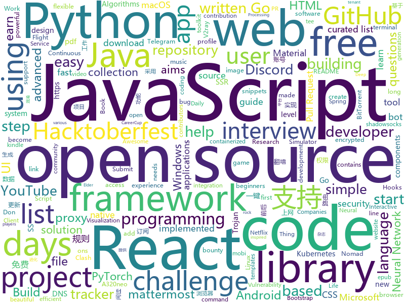

# 2020-10-04
See what the GitHub community is most excited about.

## python
+ [GHunt](https://github.com/mxrch/GHunt)(**881 stars today**): 🕵️‍♂️Investigate Google Accounts with emails.
+ [datasets](https://github.com/huggingface/datasets)(**383 stars today**): 🤗Fast, efficient, open-access datasets and evaluation metrics for Natural Language Processing and more in PyTorch, TensorFlow, NumPy and Pandas
+ [rotate](https://github.com/rvizzz/rotate)(**134 stars today**): Create recursive image rotation animations
+ [rich](https://github.com/willmcgugan/rich)(**39 stars today**): Rich is a Python library for rich text and beautiful formatting in the terminal.
+ [imaginaire](https://github.com/NVlabs/imaginaire)(**246 stars today**): NVIDIA PyTorch GAN library with distributed and mixed precision support
+ [EssayKiller_V2](https://github.com/EssayKillerBrain/EssayKiller_V2)(**206 stars today**): 基于开源GPT2.0的初代创作型人工智能 | 可扩展、可进化
+ [Python](https://github.com/TheAlgorithms/Python)(**130 stars today**): All Algorithms implemented in Python
+ [CodingInterviews](https://github.com/jayshah19949596/CodingInterviews)(**268 stars today**): This repository contains coding interviews that I have encountered in company interviews
+ [Python](https://github.com/geekcomputers/Python)(**139 stars today**): My Python Examples
+ [DeepCreamPy](https://github.com/deeppomf/DeepCreamPy)(**14 stars today**): Decensoring Hentai with Deep Neural Networks
+ [gibMacOS](https://github.com/corpnewt/gibMacOS)(**13 stars today**): Py2/py3 script that can download macOS components direct from Apple
+ [archai](https://github.com/microsoft/archai)(**68 stars today**): Reproducible Rapid Research for Neural Architecture Search (NAS)
+ [nerve](https://github.com/PaytmLabs/nerve)(**17 stars today**): NERVE Continuous Vulnerability Scanner
+ [byob](https://github.com/malwaredllc/byob)(**109 stars today**): An open-source post-exploitation framework for students, researchers and developers.
+ [NeMo](https://github.com/NVIDIA/NeMo)(**99 stars today**): NeMo: a toolkit for conversational AI
+ [Hacktoberfest-2020-FizzBuzz](https://github.com/NLDev/Hacktoberfest-2020-FizzBuzz)(**31 stars today**): 🎃Submit creative/abstract FizzBuzz solutions in any language you want!
+ [awesomeScripts](https://github.com/Py-Contributors/awesomeScripts)(**39 stars today**): A Collection of Awesome Scripts in Python to Ease Daily-Life. Create an issue If you have some great idea to the new script
+ [AutoRCCar](https://github.com/hamuchiwa/AutoRCCar)(**22 stars today**): OpenCV Python Neural Network Autonomous RC Car
+ [sample-programs](https://github.com/TheRenegadeCoder/sample-programs)(**23 stars today**): Sample Programs in Every Programming Language
+ [Hacktoberfest](https://github.com/Showndarya/Hacktoberfest)(**17 stars today**): A collection of words!⭐it if you👍it !
+ [spotify-downloader](https://github.com/spotDL/spotify-downloader)(**14 stars today**): Download Spotify playlists from YouTube with albumart and metadata
+ [binwalk](https://github.com/ReFirmLabs/binwalk)(**4 stars today**): Firmware Analysis Tool
+ [plugin.video.netflix](https://github.com/CastagnaIT/plugin.video.netflix)(**9 stars today**): InputStream based Netflix plugin for Kodi
+ [Python-Thunder](https://github.com/Py-Droid/Python-Thunder)(**32 stars today**): A curated list of Python applications
+ [ignite](https://github.com/pytorch/ignite)(**5 stars today**): High-level library to help with training and evaluating neural networks in PyTorch flexibly and transparently.

## java
+ [DS-Algo-Point](https://github.com/sukritishah15/DS-Algo-Point)(**438 stars today**): This repository contains codes for various data structures and algorithms in C, C++, Java, Python, C#, Go, JavaScript and PHP
+ [Hackerrank_30daysOFcode](https://github.com/rahulsain3000/Hackerrank_30daysOFcode)(**20 stars today**): 30 days of code solution in C++/JAVA/C/Python/JavaScript/C#
+ [Images-to-PDF](https://github.com/Swati4star/Images-to-PDF)(**6 stars today**): An app to convert images to PDF file!
+ [Java](https://github.com/TheAlgorithms/Java)(**74 stars today**): All Algorithms implemented in Java
+ [MinecraftForge](https://github.com/MinecraftForge/MinecraftForge)(**6 stars today**): Modifications to the Minecraft base files to assist in compatibility between mods.
+ [Hacktoberfest](https://github.com/ows-ali/Hacktoberfest)(**5 stars today**): Opportunity to start open source and PR experience
+ [MyBookshelf](https://github.com/gedoor/MyBookshelf)(**9 stars today**): 阅读是一款可以自定义来源阅读网络内容的工具，为广大网络文学爱好者提供一种方便、快捷舒适的试读体验。
+ [book-project](https://github.com/Project-Books/book-project)(**8 stars today**): Book tracker web app
+ [dropwizard](https://github.com/dropwizard/dropwizard)(**3 stars today**): A damn simple library for building production-ready RESTful web services.
+ [runelite](https://github.com/runelite/runelite)(**7 stars today**): Open source Old School RuneScape client
+ [MusicBot](https://github.com/jagrosh/MusicBot)(**5 stars today**): 🎶A Discord music bot that's easy to set up and run yourself!
+ [SDE-Interview-Questions](https://github.com/twowaits/SDE-Interview-Questions)(**44 stars today**): Most comprehensive list📋of tech interview questions📘of companies scraped from Geeksforgeeks, CareerCup and Glassdoor.
+ [Anki-Android](https://github.com/ankidroid/Anki-Android)(**5 stars today**): AnkiDroid: Anki on Android
+ [openhab-addons](https://github.com/openhab/openhab-addons)(**0 stars today**): Add-ons for openHAB
+ [eladmin](https://github.com/elunez/eladmin)(**71 stars today**): 项目基于 Spring Boot 2.1.0 、 Jpa、 Spring Security、redis、Vue的前后端分离的后台管理系统，项目采用分模块开发方式， 权限控制采用 RBAC，支持数据字典与数据权限管理，支持一键生成前后端代码，支持动态路由
+ [HackerRank_solutions](https://github.com/RodneyShag/HackerRank_solutions)(**8 stars today**): 317 efficient solutions to HackerRank problems
+ [Java-A-Z](https://github.com/dubesar/Java-A-Z)(**8 stars today**): Java programming. Join the Discord link.
+ [termux-app](https://github.com/termux/termux-app)(**26 stars today**): Android terminal and Linux environment - app repository.
+ [byte-buddy](https://github.com/raphw/byte-buddy)(**3 stars today**): Runtime code generation for the Java virtual machine.
+ [EdXposed](https://github.com/ElderDrivers/EdXposed)(**11 stars today**): Elder driver Xposed Framework.
+ [interview](https://github.com/mission-peace/interview)(**7 stars today**): Interview questions
+ [Hacktoberfest2020](https://github.com/Cullyege/Hacktoberfest2020)(**9 stars today**): Make your Hacktoberfest 2020 contribution here! Win stickers and a T-shirt on completing 4 pull requests. (Specially for beginners)! :D
+ [Mindustry](https://github.com/Anuken/Mindustry)(**17 stars today**): A sandbox tower defense game
+ [Hactoberfest2020](https://github.com/atyant-yadav/Hactoberfest2020)(**16 stars today**): A repo for new open source contributers to begin with open source contribution.
+ [QNotified](https://github.com/ferredoxin/QNotified)(**10 stars today**): QQ辅助性功能增强

## unknown
+ [design-resources-for-developers](https://github.com/bradtraversy/design-resources-for-developers)(**244 stars today**): Curated list of design and UI resources from stock photos, web templates, CSS frameworks, UI libraries, tools and much more
+ [HowToHunt](https://github.com/KathanP19/HowToHunt)(**23 stars today**): Tutorials and Things to Do while Hunting Vulnerability.
+ [WindowsXP](https://github.com/shaswata56/WindowsXP)(**47 stars today**): This is the leaked source code of Windows XP Service Pack 1
+ [javascript-questions](https://github.com/lydiahallie/javascript-questions)(**376 stars today**): A long list of (advanced) JavaScript questions, and their explanations✨
+ [TrackersListCollection](https://github.com/XIU2/TrackersListCollection)(**26 stars today**): 🎈Updated daily! A list of popular BitTorrent Trackers! / 每天更新！全网热门 BT Tracker 列表！
+ [first-contributions](https://github.com/firstcontributions/first-contributions)(**291 stars today**): 🚀✨Help beginners to contribute to open source projects
+ [COVID-19](https://github.com/CSSEGISandData/COVID-19)(**26 stars today**): Novel Coronavirus (COVID-19) Cases, provided by JHU CSSE
+ [Coding_Notes](https://github.com/ankitpriyarup/Coding_Notes)(**99 stars today**): 
+ [new-pac](https://github.com/Alvin9999/new-pac)(**33 stars today**): 科学上网/自由上网/翻墙/软件/方法，一键翻墙浏览器，免费shadowsocks/ss/ssr/v2ray/goflyway账号，vps一键搭建脚本/教程
+ [955.WLB](https://github.com/formulahendry/955.WLB)(**76 stars today**): 955 不加班的公司名单 - 工作 955，work–life balance (工作与生活的平衡)
+ [EmotionLib](https://github.com/EmotionEngineer/EmotionLib)(**54 stars today**): Simple dynamic library for video sentiment recognition
+ [bugbounty-cheatsheet](https://github.com/EdOverflow/bugbounty-cheatsheet)(**13 stars today**): A list of interesting payloads, tips and tricks for bug bounty hunters.
+ [OnJava8](https://github.com/LingCoder/OnJava8)(**57 stars today**): 《On Java 8》中文版，又名《Java编程思想》 第5版
+ [fucking-algorithm](https://github.com/labuladong/fucking-algorithm)(**274 stars today**): 刷算法全靠套路，认准 labuladong 就够了！English version supported! Crack LeetCode, not only how, but also why.
+ [coding-interview-university](https://github.com/jwasham/coding-interview-university)(**208 stars today**): A complete computer science study plan to become a software engineer.
+ [IntelliJ-IDEA-2020.2.1-solve](https://github.com/shipofsea/IntelliJ-IDEA-2020.2.1-solve)(**10 stars today**): 
+ [the-economist-ebooks](https://github.com/hehonghui/the-economist-ebooks)(**11 stars today**): The Economist 、New Yorker magazine, free download and subscription for kindle, mobi、epub、pdf format. 经济学人、纽约客杂志电子版下载、免费订阅(kindle推送),支持epub、mobi、pdf格式, 每周更新
+ [Share-SSR-V2ray](https://github.com/selierlin/Share-SSR-V2ray)(**15 stars today**): 🃏Free SS/SSR/V2ray 免费分享节点账号信息网站
+ [ctf-katana](https://github.com/JohnHammond/ctf-katana)(**12 stars today**): This repository aims to hold suggestions (and hopefully/eventually code) for CTF challenges. The "project" is nicknamed Katana.
+ [ACL4SSR](https://github.com/ACL4SSR/ACL4SSR)(**14 stars today**): SSR 去广告ACL规则/SS完整GFWList规则/Clash规则碎片，Telegram频道订阅地址
+ [clash_for_windows_pkg](https://github.com/Fndroid/clash_for_windows_pkg)(**57 stars today**): A Windows/macOS GUI based on Clash
+ [oscp_cheatsheet](https://github.com/CountablyInfinite/oscp_cheatsheet)(**32 stars today**): Commands, snippets, exploits, tools, lists, collections and techniques I used on my journey to becoming an OSCP.
+ [scientific-visualization-book](https://github.com/rougier/scientific-visualization-book)(**24 stars today**): ❗️WIP❗️An open access book on scientific visualization using python and matplotlib
+ [trackerslist](https://github.com/ngosang/trackerslist)(**28 stars today**): Updated list of public BitTorrent trackers
+ [ClashForAndroid](https://github.com/Kr328/ClashForAndroid)(**24 stars today**): A rule-based tunnel for Android.

## javascript
+ [react-hooks](https://github.com/kentcdodds/react-hooks)(**184 stars today**): Learn React Hooks!🎣⚛
+ [react-fundamentals](https://github.com/kentcdodds/react-fundamentals)(**288 stars today**): Material for my React Fundamentals Workshop
+ [30-Days-Of-React](https://github.com/Asabeneh/30-Days-Of-React)(**496 stars today**): 30 Days of React challenge is a step by step guide to learn React in 30 days. This challenge needs an intermediate level of HTML, CSS, and JavaScript knowledge. It is recommended to feel good at JavaScript before you start to React. If you are not comfortable with JavaScript check out 30DaysOfJavaScript. This is a continuation of 30 Days Of Java…
+ [FreeTube](https://github.com/FreeTubeApp/FreeTube)(**74 stars today**): An Open Source YouTube app for privacy
+ [discord.js](https://github.com/discordjs/discord.js)(**116 stars today**): A powerful JavaScript library for interacting with the Discord API
+ [advanced-react-hooks](https://github.com/kentcdodds/advanced-react-hooks)(**258 stars today**): Learn Advanced React Hooks workshop
+ [Canvas-Creations](https://github.com/zero-to-mastery/Canvas-Creations)(**5 stars today**): A ZTM Challenge for Hacktoberfest 2020
+ [material-ui](https://github.com/mui-org/material-ui)(**67 stars today**): React components for faster and easier web development. Build your own design system, or start with Material Design.
+ [next.js](https://github.com/vercel/next.js)(**77 stars today**): The React Framework
+ [svelte](https://github.com/sveltejs/svelte)(**62 stars today**): Cybernetically enhanced web apps
+ [cnn-explainer](https://github.com/poloclub/cnn-explainer)(**13 stars today**): Learning Convolutional Neural Networks with Interactive Visualization.
+ [react-performance](https://github.com/kentcdodds/react-performance)(**286 stars today**): Let's make our apps fast⚡
+ [30-seconds-of-code](https://github.com/30-seconds/30-seconds-of-code)(**97 stars today**): Short JavaScript code snippets for all your development needs
+ [30-Days-Of-JavaScript](https://github.com/Asabeneh/30-Days-Of-JavaScript)(**102 stars today**): 30 days of JavaScript programming challenge is a step by step guide to learn JavaScript programming language in 30 days
+ [tech-interview-handbook](https://github.com/yangshun/tech-interview-handbook)(**77 stars today**): 💯Materials to help you rock your next coding interview
+ [github-profile-readme-generator](https://github.com/rahuldkjain/github-profile-readme-generator)(**103 stars today**): 🚀Generate GitHub profile README easily with the latest add-ons like visitors count, GitHub stats, etc using minimal UI.
+ [unlock-music](https://github.com/ix64/unlock-music)(**22 stars today**): Unlock encrypted music file in browser. 在浏览器中解锁加密的音乐文件。
+ [Pacman-Game](https://github.com/RishabhDevbanshi/Pacman-Game)(**24 stars today**): This is a pacman game made using HTML, CSS and Javascript only.
+ [Hacktoberfest2020-MovieDo](https://github.com/garimasingh128/Hacktoberfest2020-MovieDo)(**16 stars today**): 🤪🤨🧐🤓😎HACKTOBERFEST 2020 ALERT: Submit Just 4 PRs to earn SWAGS🤪🤨🧐🤓😎
+ [react-native](https://github.com/facebook/react-native)(**61 stars today**): A framework for building native apps with React.
+ [Hacktoberfest-2020](https://github.com/OpenSourceTogether/Hacktoberfest-2020)(**100 stars today**): Simply add your details to readme and stand a chance to earn a free tee!✅
+ [netflix](https://github.com/karlhadwen/netflix)(**34 stars today**): Subscribe to my YouTube channel: https://bit.ly/CognitiveSurge - Building Netflix Using React
+ [pipedream](https://github.com/PipedreamHQ/pipedream)(**8 stars today**): Serverless integration and compute platform. Free for developers.
+ [hiring-without-whiteboards](https://github.com/poteto/hiring-without-whiteboards)(**18 stars today**): ⭐️Companies that don't have a broken hiring process
+ [brave-browser](https://github.com/brave/brave-browser)(**14 stars today**): Next generation Brave browser for macOS, Windows, Linux, Android.

## html
+ [Keiko-Corp](https://github.com/zero-to-mastery/Keiko-Corp)(**39 stars today**): HTML challenge for Hacktoberfest 2020
+ [Hacktoberfest2020](https://github.com/OpenSouceCode/Hacktoberfest2020)(**147 stars today**): Make your first Pull Request and earn a free tee from GitHub!
+ [home-assistant.io](https://github.com/home-assistant/home-assistant.io)(**10 stars today**): 📘Home Assistant User documentation
+ [OpenClash](https://github.com/vernesong/OpenClash)(**18 stars today**): A Clash Client For OpenWrt
+ [hacktoberfest](https://github.com/AliceWonderland/hacktoberfest)(**23 stars today**): Participate in Hacktoberfest by contributing to any Open Source project on GitHub! Here is a starter project for first time contributors. #hacktoberfest
+ [cloud_haiku](https://github.com/do-community/cloud_haiku)(**5 stars today**): Community-made poetry about infrastructure
+ [en.javascript.info](https://github.com/javascript-tutorial/en.javascript.info)(**22 stars today**): Modern JavaScript Tutorial
+ [a32nx](https://github.com/flybywiresim/a32nx)(**26 stars today**): The A32NX Project is a community driven open source project to create a free Airbus A320neo in Microsoft Flight Simulator that is as close to reality as possible. It aims to enhance the default A320neo by improving the systems depth and functionality to bring it up to payware-level, all for free.
+ [zphisher](https://github.com/htr-tech/zphisher)(**8 stars today**): Automated Phishing Tool
+ [webdevbootcamp](https://github.com/nax3t/webdevbootcamp)(**6 stars today**): All source code for back-end projects from the Web Developer Bootcamp
+ [DevOps-Guide](https://github.com/Tikam02/DevOps-Guide)(**9 stars today**): DevOps Guide from basic to advanced with Interview Questions and Notes🔥
+ [zenbot](https://github.com/DeviaVir/zenbot)(**3 stars today**): Zenbot is a command-line cryptocurrency trading bot using Node.js and MongoDB.
+ [node-ytdl-core](https://github.com/fent/node-ytdl-core)(**7 stars today**): YouTube video downloader in javascript.
+ [awesome-piracy](https://github.com/Igglybuff/awesome-piracy)(**18 stars today**): A curated list of awesome warez and piracy links
+ [beautiful-jekyll](https://github.com/daattali/beautiful-jekyll)(**4 stars today**): ✨Build a beautiful and simple website in literally minutes. Demo at https://beautifuljekyll.com
+ [training-kit](https://github.com/github/training-kit)(**6 stars today**): Open source cheat sheets for Git and GitHub
+ [tails](https://github.com/thedevdojo/tails)(**14 stars today**): Tails is a (no-config) copy'n paste library of templates and components crafted using TailwindCSS
+ [startbootstrap-resume](https://github.com/StartBootstrap/startbootstrap-resume)(**3 stars today**): A Bootstrap 4 resume/CV theme created by Start Bootstrap
+ [all-contributors](https://github.com/all-contributors/all-contributors)(**14 stars today**): ✨Recognize all contributors, not just the ones who push code✨
+ [B787-XE](https://github.com/lmk02/B787-XE)(**6 stars today**): A modification of the Microsoft Flight Simulator 2020 787-10
+ [Hacktoberfest-2020](https://github.com/Potential17/Hacktoberfest-2020)(**6 stars today**): Beginner friendly. Easy Pull Request!
+ [salty-747](https://github.com/saltysimulations/salty-747)(**10 stars today**): 
+ [mattermost-developer-documentation](https://github.com/mattermost/mattermost-developer-documentation)(**0 stars today**): Mattermost developer documentation.
+ [openwrt-packages](https://github.com/kenzok8/openwrt-packages)(**4 stars today**): openwet常用软件包
+ [Learn-Coding](https://github.com/SpooderManEXE/Learn-Coding)(**14 stars today**): Don't forget to give me a⭐️

## go
+ [cortex](https://github.com/cortexproject/cortex)(**68 stars today**): A horizontally scalable, highly available, multi-tenant, long term Prometheus.
+ [esbuild](https://github.com/evanw/esbuild)(**324 stars today**): An extremely fast JavaScript bundler and minifier
+ [trojan-go](https://github.com/p4gefau1t/trojan-go)(**114 stars today**): Go实现的Trojan代理，支持多路复用/路由功能/CDN中转/Shadowsocks混淆插件，多平台，无依赖。A Trojan proxy written in Go. An unidentifiable mechanism that helps you bypass GFW. https://p4gefau1t.github.io/trojan-go/
+ [hetty](https://github.com/dstotijn/hetty)(**948 stars today**): Hetty is an HTTP toolkit for security research. It aims to become an open source alternative to commercial software like Burp Suite Pro, with powerful features tailored to the needs of the infosec and bug bounty community.
+ [AdGuardHome](https://github.com/AdguardTeam/AdGuardHome)(**17 stars today**): Network-wide ads & trackers blocking DNS server
+ [minikube](https://github.com/kubernetes/minikube)(**18 stars today**): Run Kubernetes locally
+ [hugo](https://github.com/gohugoio/hugo)(**46 stars today**): The world’s fastest framework for building websites.
+ [kratos](https://github.com/ory/kratos)(**24 stars today**): Never build user login, user registration, 2fa, profile management ever again! Works on any operating system, cloud, with any programming language, user interface, and user experience! Written in Go.
+ [fiber](https://github.com/gofiber/fiber)(**39 stars today**): ⚡️Fiber is an Express inspired web framework written in Go with☕️
+ [go-cqhttp](https://github.com/Mrs4s/go-cqhttp)(**9 stars today**): cqhttp的golang实现，轻量、原生跨平台.
+ [nomad](https://github.com/hashicorp/nomad)(**120 stars today**): Nomad is an easy-to-use, flexible, and performant workload orchestrator that can deploy a mix of microservice, batch, containerized, and non-containerized applications. Nomad is easy to operate and scale and has native Consul and Vault integrations.
+ [spark-on-k8s-operator](https://github.com/GoogleCloudPlatform/spark-on-k8s-operator)(**7 stars today**): Kubernetes operator for managing the lifecycle of Apache Spark applications on Kubernetes.
+ [colly](https://github.com/gocolly/colly)(**17 stars today**): Elegant Scraper and Crawler Framework for Golang
+ [matterbridge](https://github.com/42wim/matterbridge)(**13 stars today**): bridge between mattermost, IRC, gitter, xmpp, slack, discord, telegram, rocketchat, steam, twitch, ssh-chat, zulip, whatsapp, keybase, matrix, microsoft teams, nextcloud and more with REST API (mattermost not required!)
+ [gotk3](https://github.com/gotk3/gotk3)(**22 stars today**): Go bindings for GTK3
+ [amongusdiscord](https://github.com/denverquane/amongusdiscord)(**20 stars today**): Discord Bot to automute Among Us players at round transitions, in conjunction with denverquane/amonguscapture
+ [Go](https://github.com/TheAlgorithms/Go)(**12 stars today**): Algorithms Implemented in GoLang
+ [stashbox](https://github.com/zpeters/stashbox)(**20 stars today**): Your personal Internet Archive
+ [go-whatsapp](https://github.com/Rhymen/go-whatsapp)(**24 stars today**): WhatsApp Web API
+ [starboard](https://github.com/aquasecurity/starboard)(**7 stars today**): Kubernetes-native security tool kit
+ [concourse](https://github.com/concourse/concourse)(**12 stars today**): Concourse is a container-based continuous thing-doer written in Go and Elm.
+ [xray-crack](https://github.com/zu1k/xray-crack)(**43 stars today**): xray社区高级版证书生成，仅供学习研究，正常使用请支持正版
+ [ebiten](https://github.com/hajimehoshi/ebiten)(**37 stars today**): A dead simple 2D game library for Go
+ [dnscrypt-proxy](https://github.com/DNSCrypt/dnscrypt-proxy)(**6 stars today**): dnscrypt-proxy 2 - A flexible DNS proxy, with support for encrypted DNS protocols.
+ [promptui](https://github.com/manifoldco/promptui)(**51 stars today**): Interactive prompt for command-line applications

## WordCloud

