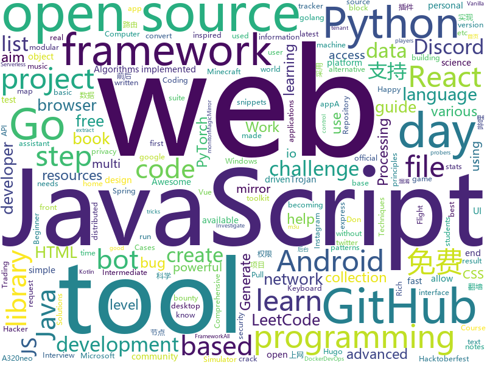

# 2020-10-05
See what the GitHub community is most excited about.

## python
+ [GHunt](https://github.com/mxrch/GHunt)(**968 stars today**): 🕵️‍♂️Investigate Google Accounts with emails.
+ [rich](https://github.com/willmcgugan/rich)(**274 stars today**): Rich is a Python library for rich text and beautiful formatting in the terminal.
+ [datasets](https://github.com/huggingface/datasets)(**178 stars today**): 🤗Fast, efficient, open-access datasets and evaluation metrics for Natural Language Processing and more in PyTorch, TensorFlow, NumPy and Pandas
+ [Python](https://github.com/TheAlgorithms/Python)(**239 stars today**): All Algorithms implemented in Python
+ [igel](https://github.com/nidhaloff/igel)(**291 stars today**): a machine learning tool that allows to train, test and use models without writing code
+ [30-Days-Of-Python](https://github.com/Asabeneh/30-Days-Of-Python)(**61 stars today**): 30 days of Python programming challenge is a step by step guide to learn Python programming language in 30 days.
+ [core](https://github.com/home-assistant/core)(**30 stars today**): 🏡Open source home automation that puts local control and privacy first
+ [Instagram](https://github.com/Pure-L0G1C/Instagram)(**4 stars today**): Bruteforce attack for Instagram
+ [imaginaire](https://github.com/NVlabs/imaginaire)(**268 stars today**): NVIDIA PyTorch GAN library with distributed and mixed precision support
+ [Anonymous](https://github.com/H1R0GH057/Anonymous)(**19 stars today**): 
+ [byob](https://github.com/malwaredllc/byob)(**30 stars today**): An open-source post-exploitation framework for students, researchers and developers.
+ [awesomeScripts](https://github.com/Py-Contributors/awesomeScripts)(**56 stars today**): A Collection of Awesome Scripts in Python to Ease Daily-Life. Create an issue If you have some great idea to the new script
+ [vision_blender](https://github.com/Cartucho/vision_blender)(**50 stars today**): A Blender addon for generating synthetic ground truth data for Computer Vision applications
+ [Ciphey](https://github.com/Ciphey/Ciphey)(**92 stars today**): ⚡Automatically decrypt encryptions without knowing the key or cipher, decode encodings, and crack hashes⚡
+ [wifiphisher](https://github.com/wifiphisher/wifiphisher)(**8 stars today**): The Rogue Access Point Framework
+ [PythonAlgorithms](https://github.com/vJechsmayr/PythonAlgorithms)(**14 stars today**): All Algorithms implemented in Python 3
+ [ignite](https://github.com/pytorch/ignite)(**8 stars today**): High-level library to help with training and evaluating neural networks in PyTorch flexibly and transparently.
+ [zipline](https://github.com/quantopian/zipline)(**7 stars today**): Zipline, a Pythonic Algorithmic Trading Library
+ [manim](https://github.com/3b1b/manim)(**31 stars today**): Animation engine for explanatory math videos
+ [anki](https://github.com/ankitects/anki)(**14 stars today**): Anki for desktop computers
+ [freqtrade](https://github.com/freqtrade/freqtrade)(**9 stars today**): Free, open source crypto trading bot
+ [InstaPy](https://github.com/timgrossmann/InstaPy)(**11 stars today**): 📷Instagram Bot - Tool for automated Instagram interactions
+ [AcurusTrack](https://github.com/AIHunters/AcurusTrack)(**15 stars today**): A multi-object tracking component. Works in the conditions where identification and classical object trackers don't (e.g. shaky/unstable camera footage, occlusions, motion blur, covered faces, etc.). Works on any object despite their nature.
+ [electricitymap-contrib](https://github.com/tmrowco/electricitymap-contrib)(**4 stars today**): A real-time visualisation of the CO2 emissions of electricity consumption
+ [python-telegram-bot](https://github.com/python-telegram-bot/python-telegram-bot)(**11 stars today**): We have made you a wrapper you can't refuse

## java
+ [Mindustry](https://github.com/Anuken/Mindustry)(**16 stars today**): A sandbox tower defense game
+ [Java](https://github.com/TheAlgorithms/Java)(**48 stars today**): All Algorithms implemented in Java
+ [DS-Algo-Point](https://github.com/sukritishah15/DS-Algo-Point)(**175 stars today**): This repository contains codes for various data structures and algorithms in C, C++, Java, Python, C#, Go, JavaScript, PHP, Kotlin and Scala
+ [eladmin](https://github.com/elunez/eladmin)(**56 stars today**): 项目基于 Spring Boot 2.1.0 、 Jpa、 Spring Security、redis、Vue的前后端分离的后台管理系统，项目采用分模块开发方式， 权限控制采用 RBAC，支持数据字典与数据权限管理，支持一键生成前后端代码，支持动态路由
+ [CtCI-6th-Edition](https://github.com/careercup/CtCI-6th-Edition)(**10 stars today**): Cracking the Coding Interview 6th Ed. Solutions
+ [NewPipe](https://github.com/TeamNewPipe/NewPipe)(**82 stars today**): A libre lightweight streaming front-end for Android.
+ [baritone](https://github.com/cabaletta/baritone)(**7 stars today**): google maps for block game
+ [Java-A-Z](https://github.com/dubesar/Java-A-Z)(**13 stars today**): Java programming. Join the Discord link.
+ [Anki-Android](https://github.com/ankidroid/Anki-Android)(**10 stars today**): AnkiDroid: Anki on Android
+ [libgdx](https://github.com/libgdx/libgdx)(**7 stars today**): Desktop/Android/HTML5/iOS Java game development framework
+ [hackerskeyboard](https://github.com/klausw/hackerskeyboard)(**3 stars today**): Hacker's Keyboard (official)
+ [book-project](https://github.com/Project-Books/book-project)(**6 stars today**): Book tracker web app
+ [NetGuard](https://github.com/M66B/NetGuard)(**3 stars today**): A simple way to block access to the internet per app
+ [library](https://github.com/ddd-by-examples/library)(**6 stars today**): A comprehensive Domain-Driven Design example with problem space strategic analysis and various tactical patterns.
+ [CS-Notes](https://github.com/CyC2018/CS-Notes)(**45 stars today**): 📚技术面试必备基础知识、Leetcode、计算机操作系统、计算机网络、系统设计、Java、Python、C++
+ [MusicBot](https://github.com/jagrosh/MusicBot)(**5 stars today**): 🎶A Discord music bot that's easy to set up and run yourself!
+ [WorldEdit](https://github.com/EngineHub/WorldEdit)(**4 stars today**): 🗺️Minecraft map editor and mod
+ [Apktool](https://github.com/iBotPeaches/Apktool)(**3 stars today**): A tool for reverse engineering Android apk files
+ [android_packages_apps_GmsCore](https://github.com/microg/android_packages_apps_GmsCore)(**3 stars today**): Free implementation of Play Services
+ [antlr4](https://github.com/antlr/antlr4)(**2 stars today**): ANTLR (ANother Tool for Language Recognition) is a powerful parser generator for reading, processing, executing, or translating structured text or binary files.
+ [Images-to-PDF](https://github.com/Swati4star/Images-to-PDF)(**9 stars today**): An app to convert images to PDF file!
+ [git-osp-for-beginners](https://github.com/aditya109/git-osp-for-beginners)(**14 stars today**): A GitHub Repository to encourage and involve beginners in Open Source Contributions
+ [user-interface-samples](https://github.com/android/user-interface-samples)(**4 stars today**): Multiple samples showing the best practices in the user interface on Android.
+ [openboard](https://github.com/dslul/openboard)(**8 stars today**): 100% FOSS keyboard, based on AOSP
+ [MinecraftForge](https://github.com/MinecraftForge/MinecraftForge)(**10 stars today**): Modifications to the Minecraft base files to assist in compatibility between mods.

## unknown
+ [You-Dont-Know-JS](https://github.com/getify/You-Dont-Know-JS)(**72 stars today**): A book series on JavaScript. @YDKJS on twitter.
+ [fucking-algorithm](https://github.com/labuladong/fucking-algorithm)(**285 stars today**): 刷算法全靠套路，认准 labuladong 就够了！English version supported! Crack LeetCode, not only how, but also why.
+ [COVID-19](https://github.com/CSSEGISandData/COVID-19)(**10 stars today**): Novel Coronavirus (COVID-19) Cases, provided by JHU CSSE
+ [WindowsXP](https://github.com/shaswata56/WindowsXP)(**38 stars today**): This is the leaked source code of Windows XP Service Pack 1
+ [100-Days-Of-ML-Code](https://github.com/Avik-Jain/100-Days-Of-ML-Code)(**10 stars today**): 100 Days of ML Coding
+ [applied-ml](https://github.com/eugeneyan/applied-ml)(**19 stars today**): 📚Papers by organizations sharing their work on applied data science & machine learning.
+ [developer-roadmap](https://github.com/kamranahmedse/developer-roadmap)(**92 stars today**): Roadmap to becoming a web developer in 2020
+ [design-resources-for-developers](https://github.com/bradtraversy/design-resources-for-developers)(**148 stars today**): Curated list of design and UI resources from stock photos, web templates, CSS frameworks, UI libraries, tools and much more
+ [chromium](https://github.com/chromium/chromium)(**9 stars today**): The official GitHub mirror of the Chromium source
+ [Rules](https://github.com/lhie1/Rules)(**4 stars today**): 
+ [free](https://github.com/freefq/free)(**15 stars today**): 免费科学上网,免费翻墙,免费ssr,免费v2ray,免费vmess节点,免费节点,翻墙,蓝灯,谷歌商店
+ [Network-Activation-Code](https://github.com/potatogm/Network-Activation-Code)(**1 stars today**): Potato Network Activation Code
+ [ClashForAndroid](https://github.com/Kr328/ClashForAndroid)(**11 stars today**): A rule-based tunnel for Android.
+ [you-dont-know-js-ru](https://github.com/azat-io/you-dont-know-js-ru)(**7 stars today**): 📚Russian translation of "You Don't Know JS" book series
+ [complete-web-developer-manual](https://github.com/zero-to-mastery/complete-web-developer-manual)(**3 stars today**): All resources and notes from the Complete Web Developer in 2018: Zero to Mastery course
+ [bugbounty-cheatsheet](https://github.com/EdOverflow/bugbounty-cheatsheet)(**8 stars today**): A list of interesting payloads, tips and tricks for bug bounty hunters.
+ [Countries](https://github.com/Free-IPTV/Countries)(**2 stars today**): Free legally receivable IPTV channels as .m3u for Kodi. :-)
+ [free-programming-books](https://github.com/EbookFoundation/free-programming-books)(**58 stars today**): 📚Freely available programming books
+ [developers-roadmap](https://github.com/fullstack-development/developers-roadmap)(**5 stars today**): How to learn front-end or back-end development
+ [fancyss_history_package](https://github.com/hq450/fancyss_history_package)(**7 stars today**): 科学上网插件的离线安装包储存在这里
+ [FlutterResources](https://github.com/FlutterTutorial/FlutterResources)(**28 stars today**): A list of Flutter resources that will help people get started with Flutter
+ [COVID-19](https://github.com/pcm-dpc/COVID-19)(**2 stars today**): COVID-19 Italia - Monitoraggio situazione
+ [IntelliJ-IDEA-2020.2.1-solve](https://github.com/shipofsea/IntelliJ-IDEA-2020.2.1-solve)(**4 stars today**): 
+ [oscp_cheatsheet](https://github.com/CountablyInfinite/oscp_cheatsheet)(**8 stars today**): Commands, snippets, exploits, tools, lists, collections and techniques I used on my journey to becoming an OSCP.
+ [IoT-Pentest-devices-and-purpose](https://github.com/IoTSecurity101/IoT-Pentest-devices-and-purpose)(**4 stars today**): 

## javascript
+ [30-Days-Of-React](https://github.com/Asabeneh/30-Days-Of-React)(**536 stars today**): 30 Days of React challenge is a step by step guide to learn React in 30 days. This challenge needs an intermediate level of HTML, CSS, and JavaScript knowledge. It is recommended to feel good at JavaScript before you start to React. If you are not comfortable with JavaScript check out 30DaysOfJavaScript. This is a continuation of 30 Days Of Java…
+ [react-hooks](https://github.com/kentcdodds/react-hooks)(**154 stars today**): Learn React Hooks!🎣⚛
+ [FreeTube](https://github.com/FreeTubeApp/FreeTube)(**248 stars today**): An Open Source YouTube app for privacy
+ [p5.js](https://github.com/processing/p5.js)(**13 stars today**): p5.js is a client-side JS platform that empowers artists, designers, students, and anyone to learn to code and express themselves creatively on the web. It is based on the core principles of Processing. http://twitter.com/p5xjs —
+ [30-seconds-of-code](https://github.com/30-seconds/30-seconds-of-code)(**91 stars today**): Short JavaScript code snippets for all your development needs
+ [30-Days-Of-JavaScript](https://github.com/Asabeneh/30-Days-Of-JavaScript)(**96 stars today**): 30 days of JavaScript programming challenge is a step by step guide to learn JavaScript programming language in 30 days
+ [awesome-cheatsheets](https://github.com/LeCoupa/awesome-cheatsheets)(**51 stars today**): 👩‍💻👨‍💻Awesome cheatsheets for popular programming languages, frameworks and development tools. They include everything you should know in one single file.
+ [shapez.io](https://github.com/tobspr/shapez.io)(**202 stars today**): shapez.io is an open source base building game inspired by factorio! Available on web & desktop
+ [github-profile-readme-generator](https://github.com/rahuldkjain/github-profile-readme-generator)(**38 stars today**): 🚀Generate GitHub profile README easily with the latest add-ons like visitors count, GitHub stats, etc using minimal UI.
+ [brave-browser](https://github.com/brave/brave-browser)(**16 stars today**): Next generation Brave browser for macOS, Windows, Linux, Android.
+ [advanced-react-patterns](https://github.com/kentcdodds/advanced-react-patterns)(**61 stars today**): This is the latest advanced react patterns workshop
+ [discord.js](https://github.com/discordjs/discord.js)(**15 stars today**): A powerful JavaScript library for interacting with the Discord API
+ [Bilibili-Evolved](https://github.com/the1812/Bilibili-Evolved)(**14 stars today**): 强大的哔哩哔哩增强脚本: 下载视频, 音乐, 封面, 弹幕 / 简化直播间, 评论区, 首页 / 自定义顶栏, 删除广告, 夜间模式 / 触屏设备支持
+ [webui-aria2](https://github.com/ziahamza/webui-aria2)(**5 stars today**): The aim for this project is to create the worlds best and hottest interface to interact with aria2. Very simple to use, just download and open index.html in any web browser.
+ [devconnector_2.0](https://github.com/bradtraversy/devconnector_2.0)(**6 stars today**): Social network for developers, built on the MERN stack
+ [junior-recruit-scheduler](https://github.com/jojoldu/junior-recruit-scheduler)(**8 stars today**): 주니어 개발자 채용 정보
+ [github-readme-stats](https://github.com/anuraghazra/github-readme-stats)(**56 stars today**): ⚡Dynamically generated stats for your github readmes
+ [name-suggestion-index](https://github.com/osmlab/name-suggestion-index)(**3 stars today**): Canonical common brand names for OpenStreetMap
+ [deck](https://github.com/nextcloud/deck)(**4 stars today**): 🗂Kanban-style project & personal management tool for Nextcloud, similar to Trello
+ [shields](https://github.com/badges/shields)(**13 stars today**): Concise, consistent, and legible badges in SVG and raster format
+ [cgm-remote-monitor](https://github.com/nightscout/cgm-remote-monitor)(**2 stars today**): nightscout web monitor
+ [MagicMirror](https://github.com/MichMich/MagicMirror)(**6 stars today**): MagicMirror² is an open source modular smart mirror platform. With a growing list of installable modules, the MagicMirror² allows you to convert your hallway or bathroom mirror into your personal assistant.
+ [LoveIt](https://github.com/dillonzq/LoveIt)(**6 stars today**): ❤️A clean, elegant but advanced blog theme for Hugo 一个简洁、优雅且高效的 Hugo 主题
+ [unlock-music](https://github.com/ix64/unlock-music)(**15 stars today**): Unlock encrypted music file in browser. 在浏览器中解锁加密的音乐文件。
+ [fspackages](https://github.com/Working-Title-MSFS-Mods/fspackages)(**10 stars today**): Working Title FS Packages

## html
+ [Hacktoberfest2020](https://github.com/OpenSouceCode/Hacktoberfest2020)(**133 stars today**): Make your first Pull Request and earn a free tee from GitHub!
+ [Keiko-Corp](https://github.com/zero-to-mastery/Keiko-Corp)(**75 stars today**): HTML challenge for Hacktoberfest 2020
+ [home-assistant.io](https://github.com/home-assistant/home-assistant.io)(**4 stars today**): 📘Home Assistant User documentation
+ [B787-XE](https://github.com/lmk02/B787-XE)(**18 stars today**): A modification of the Microsoft Flight Simulator 2020 787-10
+ [a32nx](https://github.com/flybywiresim/a32nx)(**23 stars today**): The A32NX Project is a community driven open source project to create a free Airbus A320neo in Microsoft Flight Simulator that is as close to reality as possible. It aims to enhance the default A320neo by improving the systems depth and functionality to bring it up to payware-level, all for free.
+ [matrix-docker-ansible-deploy](https://github.com/spantaleev/matrix-docker-ansible-deploy)(**4 stars today**): Matrix (An open network for secure, decentralized communication) server setup using Ansible and Docker
+ [DevOps-Guide](https://github.com/Tikam02/DevOps-Guide)(**8 stars today**): DevOps Guide from basic to advanced with Interview Questions and Notes🔥
+ [DataCamp](https://github.com/wblakecannon/DataCamp)(**3 stars today**): DataCamp data-science courses
+ [ESPEasy](https://github.com/letscontrolit/ESPEasy)(**3 stars today**): Easy MultiSensor device based on ESP8266
+ [discord-bot-client](https://github.com/Flam3rboy/discord-bot-client)(**4 stars today**): A custom version of discord, with bot login support
+ [k3s-ansible](https://github.com/rancher/k3s-ansible)(**2 stars today**): 
+ [salty-747](https://github.com/saltysimulations/salty-747)(**13 stars today**): 
+ [dragon-book-exercise-answers](https://github.com/fool2fish/dragon-book-exercise-answers)(**5 stars today**): Compilers Principles, Techniques, & Tools (purple dragon book) second edition exercise answers. 编译原理（紫龙书）第2版习题答案。
+ [18S191](https://github.com/mitmath/18S191)(**14 stars today**): Course 18.S191 at MIT, fall 2020 - Introduction to computational thinking with Julia:
+ [REKCARC-TSC-UHT](https://github.com/PKUanonym/REKCARC-TSC-UHT)(**5 stars today**): 清华大学计算机系课程攻略 Guidance for courses in Department of Computer Science and Technology, Tsinghua University
+ [vuejs-intermediate](https://github.com/jefrydco/vuejs-intermediate)(**12 stars today**): Source code for Vue.js Intermediate PENS 2020 Webinar
+ [make-pull-request](https://github.com/twowaits/make-pull-request)(**8 stars today**): Use this as learning repo on how to create successful pull requests. Very basic tasks on Python, HTML, CSS, JavaScript, JAVA.
+ [awesome-compose](https://github.com/docker/awesome-compose)(**8 stars today**): Awesome Docker Compose samples
+ [cloud_haiku](https://github.com/do-community/cloud_haiku)(**2 stars today**): Community-made poetry about infrastructure
+ [Hacktoberfest](https://github.com/arjunadhikary/Hacktoberfest)(**5 stars today**): Hacktoberfest 2020 Beginner's Friendly Repository
+ [pacMan](https://github.com/johntango/pacMan)(**0 stars today**): PacMan generates data in the browser and pushes it to the Web Server
+ [hacktoberfest](https://github.com/AliceWonderland/hacktoberfest)(**7 stars today**): Participate in Hacktoberfest by contributing to any Open Source project on GitHub! Here is a starter project for first time contributors. #hacktoberfest
+ [JavaScript30](https://github.com/wesbos/JavaScript30)(**8 stars today**): 30 Day Vanilla JS Challenge
+ [wpt](https://github.com/web-platform-tests/wpt)(**2 stars today**): Test suites for Web platform specs — including WHATWG, W3C, and others
+ [en.javascript.info](https://github.com/javascript-tutorial/en.javascript.info)(**15 stars today**): Modern JavaScript Tutorial

## go
+ [esbuild](https://github.com/evanw/esbuild)(**362 stars today**): An extremely fast JavaScript bundler and minifier
+ [cortex](https://github.com/cortexproject/cortex)(**66 stars today**): A horizontally scalable, highly available, multi-tenant, long term Prometheus.
+ [amongusdiscord](https://github.com/denverquane/amongusdiscord)(**20 stars today**): Discord Bot to automute Among Us players at round transitions, in conjunction with denverquane/amonguscapture
+ [fiber](https://github.com/gofiber/fiber)(**24 stars today**): ⚡️Fiber is an Express inspired web framework written in Go with☕️
+ [LeetCode-Go](https://github.com/halfrost/LeetCode-Go)(**53 stars today**): ✅Solutions to LeetCode by Go, 100% test coverage, runtime beats 100% / LeetCode 题解
+ [mattermost-server](https://github.com/mattermost/mattermost-server)(**11 stars today**): Open source Slack-alternative in Golang and React - Mattermost
+ [colly](https://github.com/gocolly/colly)(**12 stars today**): Elegant Scraper and Crawler Framework for Golang
+ [PhoneInfoga](https://github.com/sundowndev/PhoneInfoga)(**6 stars today**): Advanced information gathering & OSINT framework for phone numbers
+ [httpx](https://github.com/projectdiscovery/httpx)(**9 stars today**): httpx is a fast and multi-purpose HTTP toolkit allow to run multiple probers using retryablehttp library, it is designed to maintain the result reliability with increased threads.
+ [ali](https://github.com/nakabonne/ali)(**184 stars today**): Generate HTTP load and plot the results in real-time
+ [trojan-go](https://github.com/p4gefau1t/trojan-go)(**25 stars today**): Go实现的Trojan代理，支持多路复用/路由功能/CDN中转/Shadowsocks混淆插件，多平台，无依赖。A Trojan proxy written in Go. An unidentifiable mechanism that helps you bypass GFW. https://p4gefau1t.github.io/trojan-go/
+ [tinygo](https://github.com/tinygo-org/tinygo)(**10 stars today**): Go compiler for small places. Microcontrollers, WebAssembly, and command-line tools. Based on LLVM.
+ [go-cqhttp](https://github.com/Mrs4s/go-cqhttp)(**7 stars today**): cqhttp的golang实现，轻量、原生跨平台.
+ [wtf](https://github.com/wtfutil/wtf)(**7 stars today**): The personal information dashboard for your terminal
+ [slack](https://github.com/slack-go/slack)(**6 stars today**): Slack API in Go - community-maintained fork created by the original author, @nlopes
+ [hetty](https://github.com/dstotijn/hetty)(**205 stars today**): Hetty is an HTTP toolkit for security research. It aims to become an open source alternative to commercial software like Burp Suite Pro, with powerful features tailored to the needs of the infosec and bug bounty community.
+ [trivy](https://github.com/aquasecurity/trivy)(**10 stars today**): A Simple and Comprehensive Vulnerability Scanner for Containers, Suitable for CI
+ [kubeless](https://github.com/kubeless/kubeless)(**5 stars today**): Kubernetes Native Serverless Framework
+ [fabric](https://github.com/hyperledger/fabric)(**3 stars today**): Hyperledger Fabric is an enterprise-grade permissioned distributed ledger framework for developing solutions and applications. Its modular and versatile design satisfies a broad range of industry use cases. It offers a unique approach to consensus that enables performance at scale while preserving privacy.
+ [hugo](https://github.com/gohugoio/hugo)(**17 stars today**): The world’s fastest framework for building websites.
+ [derek](https://github.com/alexellis/derek)(**26 stars today**): Reduce maintainer fatigue by automating GitHub
+ [WebHackersWeapons](https://github.com/hahwul/WebHackersWeapons)(**19 stars today**): ⚔️Web Hacker's Weapons / A collection of cool tools used by Web hackers. Happy hacking , Happy bug-hunting
+ [archiver](https://github.com/mholt/archiver)(**2 stars today**): Easily create & extract archives, and compress & decompress files of various formats
+ [kconnect](https://github.com/fidelity/kconnect)(**9 stars today**): Kubernetes Connection Manager CLI
+ [learn-go-with-tests](https://github.com/quii/learn-go-with-tests)(**12 stars today**): Learn Go with test-driven development

## WordCloud

