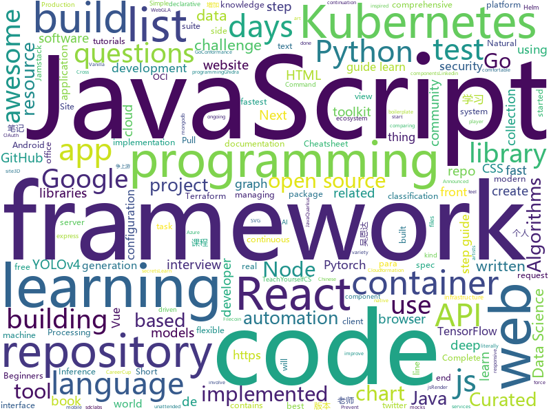

# 2020-10-07
See what the GitHub community is most excited about.

## python
+ [Python](https://github.com/TheAlgorithms/Python)(**789 stars today**): All Algorithms implemented in Python
+ [ML-From-Scratch](https://github.com/eriklindernoren/ML-From-Scratch)(**272 stars today**): Machine Learning From Scratch. Bare bones NumPy implementations of machine learning models and algorithms with a focus on accessibility. Aims to cover everything from linear regression to deep learning.
+ [30-Days-Of-Python](https://github.com/Asabeneh/30-Days-Of-Python)(**214 stars today**): 30 days of Python programming challenge is a step by step guide to learn Python programming language in 30 days.
+ [thefuck](https://github.com/nvbn/thefuck)(**130 stars today**): Magnificent app which corrects your previous console command.
+ [pet](https://github.com/timoschick/pet)(**100 stars today**): This repository contains the code for "Exploiting Cloze Questions for Few-Shot Text Classification and Natural Language Inference"
+ [gym](https://github.com/openai/gym)(**15 stars today**): A toolkit for developing and comparing reinforcement learning algorithms.
+ [Hackerrank-Codes](https://github.com/swapnanildutta/Hackerrank-Codes)(**9 stars today**): Here are some of the solutions to HackerRank questions.
+ [GHunt](https://github.com/mxrch/GHunt)(**483 stars today**): 🕵️‍♂️Investigate Google Accounts with emails.
+ [zerologon](https://github.com/risksense/zerologon)(**5 stars today**): Exploit for zerologon cve-2020-1472
+ [celery](https://github.com/celery/celery)(**23 stars today**): Distributed Task Queue (development branch)
+ [streamlit](https://github.com/streamlit/streamlit)(**25 stars today**): Streamlit — The fastest way to build data apps in Python
+ [AutoRCCar](https://github.com/hamuchiwa/AutoRCCar)(**13 stars today**): OpenCV Python Neural Network Autonomous RC Car
+ [transformers](https://github.com/huggingface/transformers)(**49 stars today**): 🤗Transformers: State-of-the-art Natural Language Processing for Pytorch and TensorFlow 2.0.
+ [django](https://github.com/django/django)(**36 stars today**): The Web framework for perfectionists with deadlines.
+ [matplotlib](https://github.com/matplotlib/matplotlib)(**97 stars today**): matplotlib: plotting with Python
+ [YOLOv4-pytorch](https://github.com/argusswift/YOLOv4-pytorch)(**42 stars today**): This is a pytorch repository of YOLOv4, attentive YOLOv4 and mobilenet YOLOv4 with PASCAL VOC and COCO
+ [aws-cli](https://github.com/aws/aws-cli)(**5 stars today**): Universal Command Line Interface for Amazon Web Services
+ [tf-pose-estimation](https://github.com/ildoonet/tf-pose-estimation)(**6 stars today**): Deep Pose Estimation implemented using Tensorflow with Custom Architectures for fast inference.
+ [ParlAI](https://github.com/facebookresearch/ParlAI)(**5 stars today**): A framework for training and evaluating AI models on a variety of openly available dialogue datasets.
+ [kube-hunter](https://github.com/aquasecurity/kube-hunter)(**4 stars today**): Hunt for security weaknesses in Kubernetes clusters
+ [AutoXue-multiuser](https://github.com/SpringCity-LaoYang/AutoXue-multiuser)(**6 stars today**): 学习强国，copy from kessil/AutoXue，对应修改最新APP版本脚本，增加多用户支持，增加了争上游答题和双人对战。
+ [bert](https://github.com/google-research/bert)(**17 stars today**): TensorFlow code and pre-trained models for BERT
+ [dgl](https://github.com/dmlc/dgl)(**4 stars today**): Python package built to ease deep learning on graph, on top of existing DL frameworks.
+ [checkov](https://github.com/bridgecrewio/checkov)(**17 stars today**): Prevent cloud misconfigurations during build-time for Terraform, Cloudformation, Kubernetes, Serverless framework and other infrastructure-as-code-languages with Checkov by Bridgecrew.
+ [eat_pytorch_in_20_days](https://github.com/lyhue1991/eat_pytorch_in_20_days)(**17 stars today**): Pytorch🍊🍉is delicious, just eat it!😋😋

## java
+ [SDE-Interview-Questions](https://github.com/twowaits/SDE-Interview-Questions)(**282 stars today**): Most comprehensive list📋of tech interview questions📘of companies scraped from Geeksforgeeks, CareerCup and Glassdoor.
+ [tutorials](https://github.com/eugenp/tutorials)(**57 stars today**): Just Announced - "Learn Spring Security OAuth":
+ [Java](https://github.com/TheAlgorithms/Java)(**173 stars today**): All Algorithms implemented in Java
+ [quarkus](https://github.com/quarkusio/quarkus)(**10 stars today**): Quarkus: Supersonic Subatomic Java.
+ [Mindustry](https://github.com/Anuken/Mindustry)(**206 stars today**): A sandbox tower defense game
+ [Java-A-Z](https://github.com/dubesar/Java-A-Z)(**9 stars today**): Java programming. Join the Discord link.
+ [ExoPlayer](https://github.com/google/ExoPlayer)(**11 stars today**): An extensible media player for Android
+ [openapi-generator](https://github.com/OpenAPITools/openapi-generator)(**11 stars today**): OpenAPI Generator allows generation of API client libraries (SDK generation), server stubs, documentation and configuration automatically given an OpenAPI Spec (v2, v3)
+ [junit5](https://github.com/junit-team/junit5)(**4 stars today**): ✅The next generation of JUnit.
+ [configuration-as-code-plugin](https://github.com/jenkinsci/configuration-as-code-plugin)(**3 stars today**): Jenkins Configuration as Code Plugin
+ [lucene-solr](https://github.com/apache/lucene-solr)(**2 stars today**): Apache Lucene and Solr open-source search software
+ [react-native-video](https://github.com/react-native-video/react-native-video)(**2 stars today**): A <Video /> component for react-native
+ [jenkins](https://github.com/jenkinsci/jenkins)(**9 stars today**): Jenkins automation server
+ [selenium](https://github.com/SeleniumHQ/selenium)(**10 stars today**): A browser automation framework and ecosystem.
+ [java-design-patterns](https://github.com/iluwatar/java-design-patterns)(**24 stars today**): Design patterns implemented in Java
+ [mit-deep-learning-book-pdf](https://github.com/janishar/mit-deep-learning-book-pdf)(**5 stars today**): MIT Deep Learning Book in PDF format (complete and parts) by Ian Goodfellow, Yoshua Bengio and Aaron Courville
+ [code-examples](https://github.com/thombergs/code-examples)(**3 stars today**): A collection of code examples from blog posts etc.
+ [MPAndroidChart](https://github.com/PhilJay/MPAndroidChart)(**6 stars today**): A powerful🚀Android chart view / graph view library, supporting line- bar- pie- radar- bubble- and candlestick charts as well as scaling, panning and animations.
+ [git-osp-for-beginners](https://github.com/aditya109/git-osp-for-beginners)(**2 stars today**): A GitHub Repository to encourage and involve beginners in Open Source Contributions
+ [neo4j](https://github.com/neo4j/neo4j)(**4 stars today**): Graphs for Everyone
+ [community](https://github.com/GoogleCloudPlatform/community)(**1 stars today**): This repository holds the content submitted to https://cloud.google.com/community. Files added to the tutorials/ will appear at https://cloud.google.com/community/tutorials.
+ [resilience4j](https://github.com/resilience4j/resilience4j)(**6 stars today**): Resilience4j is a fault tolerance library designed for Java8 and functional programming
+ [ghidra](https://github.com/NationalSecurityAgency/ghidra)(**11 stars today**): Ghidra is a software reverse engineering (SRE) framework
+ [hazelcast](https://github.com/hazelcast/hazelcast)(**2 stars today**): Open Source In-Memory Data Grid
+ [mlkit](https://github.com/googlesamples/mlkit)(**4 stars today**): A collection of sample apps to demonstrate how to use Google's ML Kit APIs on Android and iOS

## unknown
+ [You-Dont-Know-JS](https://github.com/getify/You-Dont-Know-JS)(**139 stars today**): A book series on JavaScript. @YDKJS on twitter.
+ [TeachYourselfCS-CN](https://github.com/keithnull/TeachYourselfCS-CN)(**12 stars today**): TeachYourselfCS 的中文翻译 | A Chinese translation of TeachYourselfCS
+ [A-to-Z-Resources-for-Students](https://github.com/dipakkr/A-to-Z-Resources-for-Students)(**85 stars today**): ✅Curated list of resources for college students
+ [developer-roadmap](https://github.com/kamranahmedse/developer-roadmap)(**108 stars today**): Roadmap to becoming a web developer in 2020
+ [IB-P01-EntornoIaaS](https://github.com/fsande/IB-P01-EntornoIaaS)(****): Práctica de Informática Básica
+ [ds-cheatsheets](https://github.com/FavioVazquez/ds-cheatsheets)(**10 stars today**): List of Data Science Cheatsheets to rule the world
+ [ml-workspace](https://github.com/AdicherlaVenkataSai/ml-workspace)(**3 stars today**): Machine Learning (Beginners Hub), information(courses, books, cheat sheets, live sessions) related to machine learning, data science and python is available
+ [learning](https://github.com/amitness/learning)(**19 stars today**): Becoming 1% better at data science everyday
+ [polemicas-e-tretas-dev](https://github.com/ezefranca/polemicas-e-tretas-dev)(**18 stars today**): As polêmicas e tretas🇧🇷versionadas
+ [xss-payload-list](https://github.com/payloadbox/xss-payload-list)(**4 stars today**): 🎯Cross Site Scripting ( XSS ) Vulnerability Payload List
+ [bootcamp-gostack-desafios](https://github.com/rocketseat-education/bootcamp-gostack-desafios)(**3 stars today**): Repositório contendo todos os desafios dos módulos do Bootcamp Gostack
+ [awesome](https://github.com/sindresorhus/awesome)(**229 stars today**): 😎Awesome lists about all kinds of interesting topics
+ [covid-19-data](https://github.com/nytimes/covid-19-data)(**5 stars today**): An ongoing repository of data on coronavirus cases and deaths in the U.S.
+ [can-i-take-over-xyz](https://github.com/EdOverflow/can-i-take-over-xyz)(**4 stars today**): "Can I take over XYZ?" — a list of services and how to claim (sub)domains with dangling DNS records.
+ [Interview_Question_for_Beginner](https://github.com/JaeYeopHan/Interview_Question_for_Beginner)(**12 stars today**): 👦👧Technical-Interview guidelines written for those who started studying programming. I wish you all the best.👾
+ [mentoring](https://github.com/cncf/mentoring)(**2 stars today**): 👩🏿‍🎓👨🏽‍🎓👩🏻‍🎓CNCF Mentoring + CommunityBridge + Summer of Code
+ [awesome-javascript](https://github.com/sorrycc/awesome-javascript)(**15 stars today**): 🐢A collection of awesome browser-side JavaScript libraries, resources and shiny things.
+ [awesome-test-automation](https://github.com/atinfo/awesome-test-automation)(**5 stars today**): A curated list of awesome test automation frameworks, tools, libraries, and software for different programming languages. Sponsored by http://sdclabs.com
+ [vagas](https://github.com/frontendbr/vagas)(**8 stars today**): 🔬Espaço para divulgação de vagas para front-enders.
+ [selling-partner-api-docs](https://github.com/amzn/selling-partner-api-docs)(**4 stars today**): This repository contains documentation for developers to use to call Selling Partner APIs.
+ [awesome-nodejs](https://github.com/sindresorhus/awesome-nodejs)(**25 stars today**): ⚡Delightful Node.js packages and resources
+ [awesome-vue](https://github.com/vuejs/awesome-vue)(**17 stars today**): 🎉A curated list of awesome things related to Vue.js
+ [awesome-datascience](https://github.com/academic/awesome-datascience)(**11 stars today**): 📝An awesome Data Science repository to learn and apply for real world problems.
+ [pix-api](https://github.com/bacen/pix-api)(**15 stars today**): API Pix: O Sistema de Pagamentos Instantâneos do Brasil.
+ [modern-js-cheatsheet](https://github.com/mbeaudru/modern-js-cheatsheet)(**7 stars today**): Cheatsheet for the JavaScript knowledge you will frequently encounter in modern projects.

## javascript
+ [30-seconds-of-code](https://github.com/30-seconds/30-seconds-of-code)(**288 stars today**): Short JavaScript code snippets for all your development needs
+ [30-Days-Of-JavaScript](https://github.com/Asabeneh/30-Days-Of-JavaScript)(**246 stars today**): 30 days of JavaScript programming challenge is a step by step guide to learn JavaScript programming language in 30 days
+ [FreeTube](https://github.com/FreeTubeApp/FreeTube)(**226 stars today**): An Open Source YouTube app for privacy
+ [react](https://github.com/typescript-cheatsheets/react)(**60 stars today**): Cheatsheets for experienced React developers getting started with TypeScript
+ [react-flow](https://github.com/wbkd/react-flow)(**52 stars today**): Highly customizable library for building interactive node-based editors, flow charts and diagrams
+ [tabler-icons](https://github.com/tabler/tabler-icons)(**26 stars today**): A set of over 850 free MIT-licensed high-quality SVG icons for you to use in your web projects.
+ [gatsby](https://github.com/gatsbyjs/gatsby)(**89 stars today**): Build blazing fast, modern apps and websites with React
+ [redwood](https://github.com/redwoodjs/redwood)(**11 stars today**): Bringing full-stack to the Jamstack.
+ [react](https://github.com/facebook/react)(**71 stars today**): A declarative, efficient, and flexible JavaScript library for building user interfaces.
+ [nuxt.js](https://github.com/nuxt/nuxt.js)(**22 stars today**): The Intuitive Vue Framework
+ [botframework-sdk](https://github.com/microsoft/botframework-sdk)(**2 stars today**): Bot Framework provides the most comprehensive experience for building conversation applications.
+ [he4rtoberfest-2020](https://github.com/he4rtlabs/he4rtoberfest-2020)(**31 stars today**): 
+ [webdriverio](https://github.com/webdriverio/webdriverio)(**6 stars today**): Next-gen browser and mobile automation test framework for Node.js
+ [react-markdown](https://github.com/remarkjs/react-markdown)(**1 stars today**): Render Markdown as React components
+ [in-quiz-questions](https://github.com/Ebazhanov/in-quiz-questions)(**10 stars today**): Linkedin quiz assessment, answers and questions (aws-lambda, rest-api, javascript, react, git, html, jquery, maven, mongodb, xml, java, css, python ...) ответы на квиз
+ [bigbluebutton](https://github.com/bigbluebutton/bigbluebutton)(**15 stars today**): Complete open source web conferencing system.
+ [next-auth](https://github.com/nextauthjs/next-auth)(**20 stars today**): Authentication for Next.js
+ [Chart.js](https://github.com/chartjs/Chart.js)(**22 stars today**): Simple HTML5 Charts using the <canvas> tag
+ [faker.js](https://github.com/Marak/faker.js)(**17 stars today**): generate massive amounts of realistic fake data in Node.js and the browser
+ [30-Days-Of-React](https://github.com/Asabeneh/30-Days-Of-React)(**309 stars today**): 30 Days of React challenge is a step by step guide to learn React in 30 days. This challenge needs an intermediate level of HTML, CSS, and JavaScript knowledge. It is recommended to feel good at JavaScript before you start to React. If you are not comfortable with JavaScript check out 30DaysOfJavaScript. This is a continuation of 30 Days Of Java…
+ [gulp](https://github.com/gulpjs/gulp)(**4 stars today**): A toolkit to automate & enhance your workflow
+ [p5.js](https://github.com/processing/p5.js)(**15 stars today**): p5.js is a client-side JS platform that empowers artists, designers, students, and anyone to learn to code and express themselves creatively on the web. It is based on the core principles of Processing. http://twitter.com/p5xjs —
+ [junior-recruit-scheduler](https://github.com/jojoldu/junior-recruit-scheduler)(**10 stars today**): 주니어 개발자 채용 정보
+ [office-docs-powershell](https://github.com/MicrosoftDocs/office-docs-powershell)(**1 stars today**): PowerShell Reference for Office Products - Short URL: aka.ms/office-powershell
+ [hackathon-starter](https://github.com/sahat/hackathon-starter)(**10 stars today**): A boilerplate for Node.js web applications

## html
+ [Hacktoberfest2020](https://github.com/OpenSouceCode/Hacktoberfest2020)(**163 stars today**): Make your first Pull Request and earn a free tee from GitHub!
+ [make-pull-request](https://github.com/twowaits/make-pull-request)(**14 stars today**): Use this as learning repo on how to create successful pull requests. Very basic tasks on Python, HTML, CSS, JavaScript, JAVA.
+ [learning-area](https://github.com/mdn/learning-area)(**4 stars today**): Github repo for the MDN Learning Area.
+ [salty-747](https://github.com/saltysimulations/salty-747)(**7 stars today**): 
+ [fastText](https://github.com/facebookresearch/fastText)(**6 stars today**): Library for fast text representation and classification.
+ [kubespray](https://github.com/kubernetes-sigs/kubespray)(**11 stars today**): Deploy a Production Ready Kubernetes Cluster
+ [keep-a-changelog](https://github.com/olivierlacan/keep-a-changelog)(**3 stars today**): If you build software, keep a changelog.
+ [Actions-OpenWrt](https://github.com/garypang13/Actions-OpenWrt)(**4 stars today**): Automatic unattended weekly builds of the current OpenWrt development master branch
+ [B787-XE](https://github.com/lmk02/B787-XE)(**6 stars today**): A modification of the Microsoft Flight Simulator 2020 787-10
+ [beautiful-jekyll](https://github.com/daattali/beautiful-jekyll)(**4 stars today**): ✨Build a beautiful and simple website in literally minutes. Demo at https://beautifuljekyll.com
+ [charts](https://github.com/bitnami/charts)(**4 stars today**): Helm Charts
+ [Server](https://github.com/PanDownloadServer/Server)(**103 stars today**): PanDownload的个人维护版本
+ [helm-charts](https://github.com/prometheus-community/helm-charts)(**7 stars today**): Prometheus community Helm charts
+ [jamstack.org](https://github.com/jamstack/jamstack.org)(**19 stars today**): The official Jamstack site
+ [3d-force-graph](https://github.com/vasturiano/3d-force-graph)(**7 stars today**): 3D force-directed graph component using ThreeJS/WebGL
+ [GDIndex](https://github.com/maple3142/GDIndex)(**4 stars today**): A Google Drive Index built with Vue Running on CloudFlare Workers
+ [deeplearning_ai_books](https://github.com/fengdu78/deeplearning_ai_books)(**8 stars today**): deeplearning.ai（吴恩达老师的深度学习课程笔记及资源）
+ [Front-end-Developer-Interview-Questions](https://github.com/h5bp/Front-end-Developer-Interview-Questions)(**12 stars today**): A list of helpful front-end related questions you can use to interview potential candidates, test yourself or completely ignore.
+ [Coursera-ML-AndrewNg-Notes](https://github.com/fengdu78/Coursera-ML-AndrewNg-Notes)(**15 stars today**): 吴恩达老师的机器学习课程个人笔记
+ [wpt](https://github.com/web-platform-tests/wpt)(**1 stars today**): Test suites for Web platform specs — including WHATWG, W3C, and others
+ [foundation-sites](https://github.com/foundation/foundation-sites)(**3 stars today**): The most advanced responsive front-end framework in the world. Quickly create prototypes and production code for sites that work on any kind of device.
+ [tiny-slider](https://github.com/ganlanyuan/tiny-slider)(**2 stars today**): Vanilla javascript slider for all purposes.
+ [TinDog-Start](https://github.com/londonappbrewery/TinDog-Start)(**3 stars today**): 
+ [charts](https://github.com/Oteemo/charts)(**0 stars today**): Helm chart repository
+ [tidytuesday](https://github.com/rfordatascience/tidytuesday)(**5 stars today**): Official repo for the #tidytuesday project

## go
+ [rancher](https://github.com/rancher/rancher)(**9 stars today**): Complete container management platform
+ [moby](https://github.com/moby/moby)(**13 stars today**): Moby Project - a collaborative project for the container ecosystem to assemble container-based systems
+ [fiber](https://github.com/gofiber/fiber)(**31 stars today**): ⚡️Fiber is an Express inspired web framework written in Go with☕️
+ [buildah](https://github.com/containers/buildah)(**5 stars today**): A tool that facilitates building OCI images
+ [podman](https://github.com/containers/podman)(**7 stars today**): Podman: A tool for managing OCI containers and pods
+ [Go](https://github.com/TheAlgorithms/Go)(**29 stars today**): Algorithms Implemented in GoLang
+ [mtproto](https://github.com/xelaj/mtproto)(**61 stars today**): Full-native go implementation of Telegram API
+ [ali](https://github.com/nakabonne/ali)(**88 stars today**): Generate HTTP load and plot the results in real-time
+ [kube-bench](https://github.com/aquasecurity/kube-bench)(**6 stars today**): Checks whether Kubernetes is deployed according to security best practices as defined in the CIS Kubernetes Benchmark
+ [cert-manager](https://github.com/jetstack/cert-manager)(**11 stars today**): Automatically provision and manage TLS certificates in Kubernetes
+ [telegraf](https://github.com/influxdata/telegraf)(**5 stars today**): The plugin-driven server agent for collecting & reporting metrics.
+ [sops](https://github.com/mozilla/sops)(**9 stars today**): Simple and flexible tool for managing secrets
+ [learn-go-with-tests](https://github.com/quii/learn-go-with-tests)(**17 stars today**): Learn Go with test-driven development
+ [testify](https://github.com/stretchr/testify)(**6 stars today**): A toolkit with common assertions and mocks that plays nicely with the standard library
+ [lotus](https://github.com/filecoin-project/lotus)(**2 stars today**): Implementation of the Filecoin protocol, written in Go
+ [origin](https://github.com/openshift/origin)(**2 stars today**): Conformance test suite for OpenShift
+ [argo-cd](https://github.com/argoproj/argo-cd)(**10 stars today**): Declarative continuous deployment for Kubernetes.
+ [terraform-provider-azurerm](https://github.com/terraform-providers/terraform-provider-azurerm)(**6 stars today**): Terraform provider for Azure Resource Manager
+ [terraform](https://github.com/hashicorp/terraform)(**17 stars today**): Terraform enables you to safely and predictably create, change, and improve infrastructure. It is an open source tool that codifies APIs into declarative configuration files that can be shared amongst team members, treated as code, edited, reviewed, and versioned.
+ [concourse](https://github.com/concourse/concourse)(**2 stars today**): Concourse is a container-based continuous thing-doer written in Go and Elm.
+ [charts](https://github.com/helm/charts)(**8 stars today**): Curated applications for Kubernetes
+ [singularity](https://github.com/hpcng/singularity)(**1 stars today**): Singularity: Application containers for Linux
+ [go](https://github.com/golang/go)(**41 stars today**): The Go programming language
+ [hugo](https://github.com/gohugoio/hugo)(**33 stars today**): The world’s fastest framework for building websites.
+ [argo](https://github.com/argoproj/argo)(**11 stars today**): Argo Workflows: Get stuff done with Kubernetes.

## WordCloud

