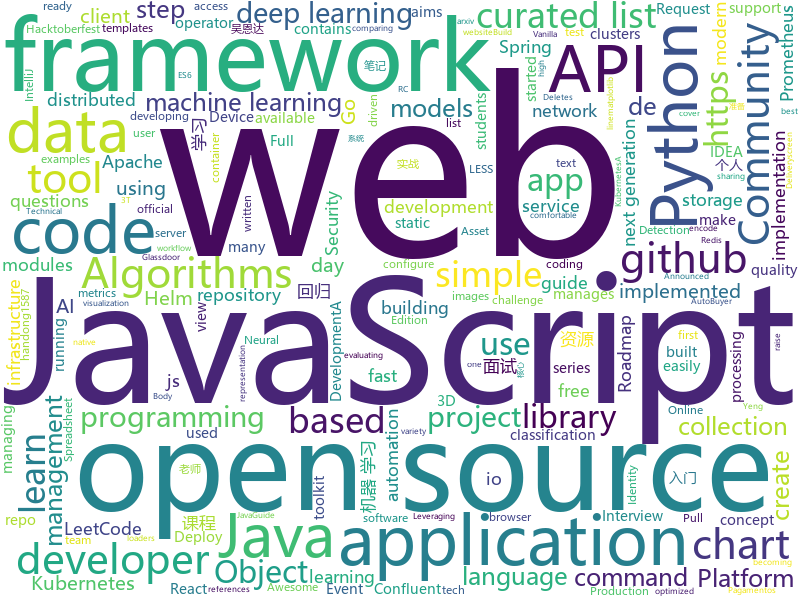

# 2020-10-08
See what the GitHub community is most excited about.

## python
+ [Python](https://github.com/TheAlgorithms/Python)(**406 stars today**): All Algorithms implemented in Python
+ [ML-From-Scratch](https://github.com/eriklindernoren/ML-From-Scratch)(**430 stars today**): Machine Learning From Scratch. Bare bones NumPy implementations of machine learning models and algorithms with a focus on accessibility. Aims to cover everything from linear regression to deep learning.
+ [thefuck](https://github.com/nvbn/thefuck)(**184 stars today**): Magnificent app which corrects your previous console command.
+ [30-Days-Of-Python](https://github.com/Asabeneh/30-Days-Of-Python)(**211 stars today**): 30 days of Python programming challenge is a step by step guide to learn Python programming language in 30 days.
+ [fvid](https://github.com/AlfredoSequeida/fvid)(**34 stars today**): fvid is a project that aims to encode any file as a video using 1-bit color images to survive compression algorithms for data retrieval.
+ [BERTopic](https://github.com/MaartenGr/BERTopic)(**28 stars today**): Leveraging BERT and a class-based TF-IDF to create easily interpretable topics.
+ [Anonymous](https://github.com/H1R0GH057/Anonymous)(**18 stars today**): 
+ [models](https://github.com/tensorflow/models)(**25 stars today**): Models and examples built with TensorFlow
+ [NeMo](https://github.com/NVIDIA/NeMo)(**23 stars today**): NeMo: a toolkit for conversational AI
+ [PythonPlantsVsZombies](https://github.com/marblexu/PythonPlantsVsZombies)(**28 stars today**): a simple PlantsVsZombies game
+ [byob](https://github.com/malwaredllc/byob)(**34 stars today**): An open-source post-exploitation framework for students, researchers and developers.
+ [Summer2021-Internships](https://github.com/Pitt-CSC/Summer2021-Internships)(**17 stars today**): Collection of Summer 2021 tech internships!
+ [pet](https://github.com/timoschick/pet)(**109 stars today**): This repository contains the code for "Exploiting Cloze Questions for Few-Shot Text Classification and Natural Language Inference"
+ [keras](https://github.com/keras-team/keras)(**17 stars today**): Deep Learning for humans
+ [public-apis](https://github.com/public-apis/public-apis)(**70 stars today**): A collective list of free APIs for use in software and web development.
+ [gym](https://github.com/openai/gym)(**14 stars today**): A toolkit for developing and comparing reinforcement learning algorithms.
+ [google-api-python-client](https://github.com/googleapis/google-api-python-client)(**4 stars today**): 🐍The official Python client library for Google's discovery based APIs.
+ [AutoRCCar](https://github.com/hamuchiwa/AutoRCCar)(**11 stars today**): OpenCV Python Neural Network Autonomous RC Car
+ [frankmocap](https://github.com/facebookresearch/frankmocap)(**22 stars today**): A Strong and Easy-to-use Single View 3D Hand+Body Pose Estimator
+ [TransCoder](https://github.com/facebookresearch/TransCoder)(**16 stars today**): Public release of the TransCoder research project https://arxiv.org/pdf/2006.03511.pdf
+ [face_recognition](https://github.com/ageitgey/face_recognition)(**19 stars today**): The world's simplest facial recognition api for Python and the command line
+ [matplotlib](https://github.com/matplotlib/matplotlib)(**13 stars today**): matplotlib: plotting with Python
+ [pytorch_geometric](https://github.com/rusty1s/pytorch_geometric)(**11 stars today**): Geometric Deep Learning Extension Library for PyTorch
+ [scikit-learn](https://github.com/scikit-learn/scikit-learn)(**18 stars today**): scikit-learn: machine learning in Python
+ [ParlAI](https://github.com/facebookresearch/ParlAI)(**9 stars today**): A framework for training and evaluating AI models on a variety of openly available dialogue datasets.

## java
+ [Java](https://github.com/TheAlgorithms/Java)(**165 stars today**): All Algorithms implemented in Java
+ [SDE-Interview-Questions](https://github.com/twowaits/SDE-Interview-Questions)(**271 stars today**): Most comprehensive list📋of tech interview questions📘of companies scraped from Geeksforgeeks, CareerCup and Glassdoor.
+ [java-design-patterns](https://github.com/iluwatar/java-design-patterns)(**24 stars today**): Design patterns implemented in Java
+ [tutorials](https://github.com/eugenp/tutorials)(**53 stars today**): Just Announced - "Learn Spring Security OAuth":
+ [JavaGuide](https://github.com/Snailclimb/JavaGuide)(**43 stars today**): 「Java学习+面试指南」一份涵盖大部分Java程序员所需要掌握的核心知识。准备 Java 面试，首选 JavaGuide！
+ [hive](https://github.com/apache/hive)(**4 stars today**): Apache Hive
+ [Hacktoberfest2020_](https://github.com/kaustubhgupta/Hacktoberfest2020_)(**6 stars today**): Use this repository to contribute quality code in languages you are comfortable with during the Hacktoberfest event. Do not make this repo act like a source of +1
+ [pmd](https://github.com/pmd/pmd)(**5 stars today**): An extensible multilanguage static code analyzer.
+ [selenium](https://github.com/SeleniumHQ/selenium)(**15 stars today**): A browser automation framework and ecosystem.
+ [keycloak](https://github.com/keycloak/keycloak)(**12 stars today**): Open Source Identity and Access Management For Modern Applications and Services
+ [kafka-streams-examples](https://github.com/confluentinc/kafka-streams-examples)(**3 stars today**): Demo applications and code examples for Apache Kafka's Streams API.
+ [thingsboard](https://github.com/thingsboard/thingsboard)(**8 stars today**): Open-source IoT Platform - Device management, data collection, processing and visualization.
+ [dropwizard](https://github.com/dropwizard/dropwizard)(**4 stars today**): A damn simple library for building production-ready RESTful web services.
+ [grpc-java](https://github.com/grpc/grpc-java)(**4 stars today**): The Java gRPC implementation. HTTP/2 based RPC
+ [spring-authorization-server](https://github.com/spring-projects-experimental/spring-authorization-server)(**3 stars today**): A community-driven project led by the Spring Security team and is focused on delivering Authorization Server support to the Spring community
+ [LeetCodeAnimation](https://github.com/MisterBooo/LeetCodeAnimation)(**53 stars today**): Demonstrate all the questions on LeetCode in the form of animation.（用动画的形式呈现解LeetCode题目的思路）
+ [CS-Notes](https://github.com/CyC2018/CS-Notes)(**47 stars today**): 📚技术面试必备基础知识、Leetcode、计算机操作系统、计算机网络、系统设计、Java、Python、C++
+ [jenkins](https://github.com/jenkinsci/jenkins)(**11 stars today**): Jenkins automation server
+ [hudi](https://github.com/apache/hudi)(**3 stars today**): Upserts, Deletes And Incremental Processing on Big Data.
+ [aws-lambda-developer-guide](https://github.com/awsdocs/aws-lambda-developer-guide)(**6 stars today**): The AWS Lambda Developer Guide
+ [junit5](https://github.com/junit-team/junit5)(**4 stars today**): ✅The next generation of JUnit.
+ [lucene-solr](https://github.com/apache/lucene-solr)(**3 stars today**): Apache Lucene and Solr open-source search software
+ [kubernetes-client](https://github.com/fabric8io/kubernetes-client)(**1 stars today**): Java client for Kubernetes & OpenShift
+ [zxing](https://github.com/zxing/zxing)(**7 stars today**): ZXing ("Zebra Crossing") barcode scanning library for Java, Android
+ [selling-partner-api-models](https://github.com/amzn/selling-partner-api-models)(**2 stars today**): This repository contains OpenAPI models for developers to use when developing software to call Selling Partner APIs.

## unknown
+ [awful-ai](https://github.com/daviddao/awful-ai)(**504 stars today**): 😈Awful AI is a curated list to track current scary usages of AI - hoping to raise awareness
+ [flutter_roadmap](https://github.com/olexale/flutter_roadmap)(**18 stars today**): Highly Subjective Roadmap to Flutter Development
+ [Hacktoberfest](https://github.com/leticiadasilva/Hacktoberfest)(**11 stars today**): 
+ [You-Dont-Know-JS](https://github.com/getify/You-Dont-Know-JS)(**144 stars today**): A book series on JavaScript. @YDKJS on twitter.
+ [developer-roadmap](https://github.com/kamranahmedse/developer-roadmap)(**125 stars today**): Roadmap to becoming a web developer in 2020
+ [Interview_Question_for_Beginner](https://github.com/JaeYeopHan/Interview_Question_for_Beginner)(**9 stars today**): 👦👧Technical-Interview guidelines written for those who started studying programming. I wish you all the best.👾
+ [CS-Learning-res](https://github.com/harvic/CS-Learning-res)(**14 stars today**): 汇总了43个方向的电子书、视频，共3T资源，包括入门、进阶、实战的所有内容，都是成系列的，入门的完美学习资源。
+ [awesome-mlops](https://github.com/visenger/awesome-mlops)(**39 stars today**): A curated list of references for MLOps
+ [machine-learning-roadmap](https://github.com/mrdbourke/machine-learning-roadmap)(**43 stars today**): A roadmap connecting many of the most important concepts in machine learning, how to learn them and what tools to use to perform them.
+ [A-to-Z-Resources-for-Students](https://github.com/dipakkr/A-to-Z-Resources-for-Students)(**127 stars today**): ✅Curated list of resources for college students
+ [pumpkin-book](https://github.com/datawhalechina/pumpkin-book)(**8 stars today**): 《机器学习》（西瓜书）公式推导解析，在线阅读地址：https://datawhalechina.github.io/pumpkin-book
+ [IB-P01-EntornoIaaS](https://github.com/fsande/IB-P01-EntornoIaaS)(****): Práctica de Informática Básica
+ [learning](https://github.com/amitness/learning)(**29 stars today**): Becoming 1% better at data science everyday
+ [TeachYourselfCS-CN](https://github.com/keithnull/TeachYourselfCS-CN)(**55 stars today**): TeachYourselfCS 的中文翻译 | A Chinese translation of TeachYourselfCS
+ [gitignore](https://github.com/github/gitignore)(**50 stars today**): A collection of useful .gitignore templates
+ [pix-api](https://github.com/bacen/pix-api)(**13 stars today**): API Pix: O Sistema de Pagamentos Instantâneos do Brasil.
+ [nuclei-templates](https://github.com/projectdiscovery/nuclei-templates)(**5 stars today**): Community curated list of templates for the nuclei engine to find a security vulnerability in application.
+ [awesome-object-detection](https://github.com/amusi/awesome-object-detection)(**5 stars today**): Awesome Object Detection based on handong1587 github: https://handong1587.github.io/deep_learning/2015/10/09/object-detection.html
+ [roadmap](https://github.com/github/roadmap)(**16 stars today**): GitHub public roadmap
+ [Python-Core-50-Courses](https://github.com/jackfrued/Python-Core-50-Courses)(**15 stars today**): Python语言基础50课
+ [sysctl](https://github.com/k4yt3x/sysctl)(**16 stars today**): K4YT3X's Hardened sysctl Configuration
+ [cortx](https://github.com/Seagate/cortx)(**4 stars today**): CORTX Community Object Storage is 100% open source object storage uniquely optimized for mass capacity storage devices.
+ [duty-machine](https://github.com/duty-machine/duty-machine)(**12 stars today**): 一个备份网络文章的服务。声援陈玫、蔡伟及其女友小唐，请关注端点星事件。
+ [intellij-community](https://github.com/JetBrains/intellij-community)(**6 stars today**): IntelliJ IDEA Community Edition & IntelliJ Platform
+ [app-ideas](https://github.com/florinpop17/app-ideas)(**63 stars today**): A Collection of application ideas which can be used to improve your coding skills.

## javascript
+ [30-seconds-of-code](https://github.com/30-seconds/30-seconds-of-code)(**306 stars today**): Short JavaScript code snippets for all your development needs
+ [beginners-intro-javascript-node](https://github.com/microsoft/beginners-intro-javascript-node)(**45 stars today**): Beginner's Series: Introduction to JavaScript (Node.js)
+ [FreeTube](https://github.com/FreeTubeApp/FreeTube)(**220 stars today**): An Open Source YouTube app for privacy
+ [30-Days-Of-JavaScript](https://github.com/Asabeneh/30-Days-Of-JavaScript)(**231 stars today**): 30 days of JavaScript programming challenge is a step by step guide to learn JavaScript programming language in 30 days
+ [react](https://github.com/typescript-cheatsheets/react)(**318 stars today**): Cheatsheets for experienced React developers getting started with TypeScript
+ [create-react-app](https://github.com/facebook/create-react-app)(**30 stars today**): Set up a modern web app by running one command.
+ [babel](https://github.com/babel/babel)(**16 stars today**): 🐠Babel is a compiler for writing next generation JavaScript.
+ [json-server](https://github.com/typicode/json-server)(**40 stars today**): Get a full fake REST API with zero coding in less than 30 seconds (seriously)
+ [ccxt](https://github.com/ccxt/ccxt)(**10 stars today**): A JavaScript / Python / PHP cryptocurrency trading API with support for more than 120 bitcoin/altcoin exchanges
+ [next.js](https://github.com/vercel/next.js)(**37 stars today**): The React Framework
+ [online](https://github.com/CollaboraOnline/online)(**11 stars today**): Collabora Online is a collaborative online office suite based on LibreOffice technology
+ [vue-cli](https://github.com/vuejs/vue-cli)(**6 stars today**): 🛠️Standard Tooling for Vue.js Development
+ [webpack](https://github.com/webpack/webpack)(**13 stars today**): A bundler for javascript and friends. Packs many modules into a few bundled assets. Code Splitting allows for loading parts of the application on demand. Through "loaders", modules can be CommonJs, AMD, ES6 modules, CSS, Images, JSON, Coffeescript, LESS, ... and your custom stuff.
+ [Chart.js](https://github.com/chartjs/Chart.js)(**17 stars today**): Simple HTML5 Charts using the <canvas> tag
+ [Scriptbale](https://github.com/xkerwin/Scriptbale)(**11 stars today**): 
+ [apexcharts.js](https://github.com/apexcharts/apexcharts.js)(**7 stars today**): 📊Interactive JavaScript Charts built on SVG
+ [grapesjs](https://github.com/artf/grapesjs)(**9 stars today**): Free and Open source Web Builder Framework. Next generation tool for building templates without coding
+ [netron](https://github.com/lutzroeder/netron)(**16 stars today**): Visualizer for neural network, deep learning, and machine learning models
+ [Fifa21-AutoBuyer](https://github.com/chithakumar13/Fifa21-AutoBuyer)(**1 stars today**): Fifa 21 AutoBuyer / Snipping Bot for fifa 21 ultimate team web app
+ [sheetjs](https://github.com/SheetJS/sheetjs)(**13 stars today**): 📗SheetJS Community Edition -- Spreadsheet Data Toolkit
+ [mapbox-gl-js](https://github.com/mapbox/mapbox-gl-js)(**4 stars today**): Interactive, thoroughly customizable maps in the browser, powered by vector tiles and WebGL
+ [Yeng-Website](https://github.com/Ping-Foundation/Yeng-Website)(**3 stars today**): This is the Yeng static website
+ [gatsby](https://github.com/gatsbyjs/gatsby)(**25 stars today**): Build blazing fast, modern apps and websites with React
+ [tabler-icons](https://github.com/tabler/tabler-icons)(**27 stars today**): A set of over 850 free MIT-licensed high-quality SVG icons for you to use in your web projects.
+ [yup](https://github.com/jquense/yup)(**12 stars today**): Dead simple Object schema validation

## html
+ [Server](https://github.com/PanDownloadServer/Server)(**206 stars today**): PanDownload的个人维护版本
+ [helm-charts](https://github.com/prometheus-community/helm-charts)(**9 stars today**): Prometheus community Helm charts
+ [awesome-angular](https://github.com/PatrickJS/awesome-angular)(**10 stars today**): 📄A curated list of awesome Angular resources
+ [Hacktoberfest2020](https://github.com/OpenSouceCode/Hacktoberfest2020)(**144 stars today**): Make your first Pull Request and earn a free tee from GitHub!
+ [zju-icicles](https://github.com/QSCTech/zju-icicles)(**12 stars today**): 浙江大学课程攻略共享计划
+ [deeplearning_ai_books](https://github.com/fengdu78/deeplearning_ai_books)(**10 stars today**): deeplearning.ai（吴恩达老师的深度学习课程笔记及资源）
+ [kubespray](https://github.com/kubernetes-sigs/kubespray)(**6 stars today**): Deploy a Production Ready Kubernetes Cluster
+ [fastText](https://github.com/facebookresearch/fastText)(**3 stars today**): Library for fast text representation and classification.
+ [hyperblog](https://github.com/freddier/hyperblog)(**10 stars today**): Un blog increíble para el curso de Git y Github de Platzi
+ [jamstack.org](https://github.com/jamstack/jamstack.org)(**8 stars today**): The official Jamstack site
+ [Machine-Learning](https://github.com/Jack-Cherish/Machine-Learning)(**4 stars today**): ⚡机器学习实战（Python3）：kNN、决策树、贝叶斯、逻辑回归、SVM、线性回归、树回归
+ [Coursera-ML-AndrewNg-Notes](https://github.com/fengdu78/Coursera-ML-AndrewNg-Notes)(**22 stars today**): 吴恩达老师的机器学习课程个人笔记
+ [learning-area](https://github.com/mdn/learning-area)(**3 stars today**): Github repo for the MDN Learning Area.
+ [charts](https://github.com/bitnami/charts)(**4 stars today**): Helm Charts
+ [cp-helm-charts](https://github.com/confluentinc/cp-helm-charts)(**2 stars today**): The Confluent Platform Helm charts enable you to deploy Confluent Platform services on Kubernetes for development, test, and proof of concept environments.
+ [hacktoberfestkorea](https://github.com/phg98/hacktoberfestkorea)(**4 stars today**): Hacktoberfest Korea site
+ [lockphish](https://github.com/jaykali/lockphish)(**17 stars today**): Lockphish it's the first tool (07/04/2020) for phishing attacks on the lock screen, designed to grab Windows credentials, Android PIN and iPhone Passcode using a https link.
+ [SpreadsheetView](https://github.com/bannzai/SpreadsheetView)(**4 stars today**): Full configurable spreadsheet view user interfaces for iOS applications. With this framework, you can easily create complex layouts like schedule, gantt chart or timetable as if you are using Excel.
+ [JavaScript30](https://github.com/wesbos/JavaScript30)(**10 stars today**): 30 Day Vanilla JS Challenge
+ [csswg-drafts](https://github.com/w3c/csswg-drafts)(**2 stars today**): CSS Working Group Editor Drafts
+ [eks-charts](https://github.com/aws/eks-charts)(**0 stars today**): Amazon EKS Helm chart repository
+ [samples](https://github.com/azure-ad-b2c/samples)(**2 stars today**): Azure AD B2C Identity Experience Framework sample User Journeys.
+ [calico](https://github.com/projectcalico/calico)(**2 stars today**): Cloud native networking and network security
+ [salty-747](https://github.com/saltysimulations/salty-747)(**4 stars today**): 
+ [glTF](https://github.com/KhronosGroup/glTF)(**5 stars today**): glTF – Runtime 3D Asset Delivery

## go
+ [server](https://github.com/screego/server)(**369 stars today**): screen sharing for developers https://screego.net/
+ [atlantis](https://github.com/runatlantis/atlantis)(**5 stars today**): Terraform Pull Request Automation
+ [jaeger](https://github.com/jaegertracing/jaeger)(**9 stars today**): CNCF Jaeger, a Distributed Tracing Platform
+ [rook](https://github.com/rook/rook)(**19 stars today**): Storage Orchestration for Kubernetes
+ [consul](https://github.com/hashicorp/consul)(**3 stars today**): Consul is a distributed, highly available, and data center aware solution to connect and configure applications across dynamic, distributed infrastructure.
+ [vault](https://github.com/hashicorp/vault)(**11 stars today**): A tool for secrets management, encryption as a service, and privileged access management
+ [promscale](https://github.com/timescale/promscale)(**23 stars today**): An open-source analytical platform for Prometheus metrics🚀
+ [Go](https://github.com/TheAlgorithms/Go)(**29 stars today**): Algorithms Implemented in GoLang
+ [test-infra](https://github.com/kubernetes/test-infra)(**4 stars today**): Test infrastructure for the Kubernetes project.
+ [postgres-operator](https://github.com/zalando/postgres-operator)(**5 stars today**): Postgres operator creates and manages PostgreSQL clusters running in Kubernetes
+ [websocket](https://github.com/gorilla/websocket)(**6 stars today**): A fast, well-tested and widely used WebSocket implementation for Go.
+ [mux](https://github.com/gorilla/mux)(**8 stars today**): A powerful HTTP router and URL matcher for building Go web servers with🦍
+ [sops](https://github.com/mozilla/sops)(**26 stars today**): Simple and flexible tool for managing secrets
+ [jira](https://github.com/go-jira/jira)(**7 stars today**): simple jira command line client in Go
+ [podman](https://github.com/containers/podman)(**9 stars today**): Podman: A tool for managing OCI containers and pods
+ [redis](https://github.com/go-redis/redis)(**6 stars today**): Type-safe Redis client for Golang
+ [charts](https://github.com/helm/charts)(**9 stars today**): Curated applications for Kubernetes
+ [node_exporter](https://github.com/prometheus/node_exporter)(**4 stars today**): Exporter for machine metrics
+ [fiber](https://github.com/gofiber/fiber)(**27 stars today**): ⚡️Fiber is an Express inspired web framework written in Go with☕️
+ [gopsutil](https://github.com/shirou/gopsutil)(**1 stars today**): psutil for golang
+ [alertmanager](https://github.com/prometheus/alertmanager)(**6 stars today**): Prometheus Alertmanager
+ [prometheus-operator](https://github.com/prometheus-operator/prometheus-operator)(**5 stars today**): Prometheus Operator creates/configures/manages Prometheus clusters atop Kubernetes
+ [rancher](https://github.com/rancher/rancher)(**93 stars today**): Complete container management platform
+ [terratest](https://github.com/gruntwork-io/terratest)(**3 stars today**): Terratest is a Go library that makes it easier to write automated tests for your infrastructure code.
+ [argo-events](https://github.com/argoproj/argo-events)(**2 stars today**): Event-driven workflow automation framework

## WordCloud

