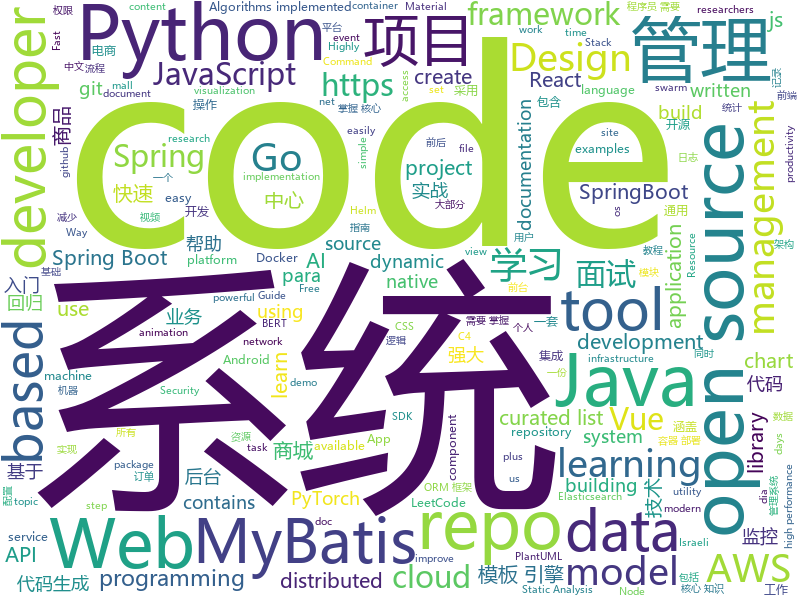

# 2020-10-09
See what the GitHub community is most excited about.

## python
+ [ML-From-Scratch](https://github.com/eriklindernoren/ML-From-Scratch)(**274 stars today**): Machine Learning From Scratch. Bare bones NumPy implementations of machine learning models and algorithms with a focus on accessibility. Aims to cover everything from linear regression to deep learning.
+ [AutoRCCar](https://github.com/hamuchiwa/AutoRCCar)(**25 stars today**): OpenCV Python Neural Network Autonomous RC Car
+ [Python](https://github.com/TheAlgorithms/Python)(**382 stars today**): All Algorithms implemented in Python
+ [30-Days-Of-Python](https://github.com/Asabeneh/30-Days-Of-Python)(**154 stars today**): 30 days of Python programming challenge is a step by step guide to learn Python programming language in 30 days.
+ [isort](https://github.com/PyCQA/isort)(**14 stars today**): A Python utility / library to sort imports.
+ [BERTopic](https://github.com/MaartenGr/BERTopic)(**120 stars today**): Leveraging BERT and a class-based TF-IDF to create easily interpretable topics.
+ [Python-100-Days](https://github.com/jackfrued/Python-100-Days)(**89 stars today**): Python - 100天从新手到大师
+ [pytorch-lightning](https://github.com/PyTorchLightning/pytorch-lightning)(**43 stars today**): The lightweight PyTorch wrapper for high-performance AI research. Scale your models, not the boilerplate.
+ [localstack](https://github.com/localstack/localstack)(**17 stars today**): 💻A fully functional local AWS cloud stack. Develop and test your cloud & Serverless apps offline!
+ [black](https://github.com/psf/black)(**20 stars today**): The uncompromising Python code formatter
+ [aws-cli](https://github.com/aws/aws-cli)(**8 stars today**): Universal Command Line Interface for Amazon Web Services
+ [PythonPlantsVsZombies](https://github.com/marblexu/PythonPlantsVsZombies)(**56 stars today**): a simple PlantsVsZombies game
+ [spymer](https://github.com/FSystem88/spymer)(**4 stars today**): Simple and relatively powerful SMS spammer | Простой и относительно мощный СМС спамер
+ [wagtail](https://github.com/wagtail/wagtail)(**9 stars today**): A Django content management system focused on flexibility and user experience
+ [asteroid](https://github.com/mpariente/asteroid)(**15 stars today**): The PyTorch-based audio source separation toolkit for researchers || Pretrained models available
+ [sentence-transformers](https://github.com/UKPLab/sentence-transformers)(**16 stars today**): Sentence Embeddings with BERT & XLNet
+ [fastapi](https://github.com/tiangolo/fastapi)(**35 stars today**): FastAPI framework, high performance, easy to learn, fast to code, ready for production
+ [Mask_RCNN](https://github.com/matterport/Mask_RCNN)(**11 stars today**): Mask R-CNN for object detection and instance segmentation on Keras and TensorFlow
+ [face_recognition](https://github.com/ageitgey/face_recognition)(**29 stars today**): The world's simplest facial recognition api for Python and the command line
+ [models](https://github.com/tensorflow/models)(**28 stars today**): Models and examples built with TensorFlow
+ [ParlAI](https://github.com/facebookresearch/ParlAI)(**8 stars today**): A framework for training and evaluating AI models on a variety of openly available dialogue datasets.
+ [Top2Vec](https://github.com/ddangelov/Top2Vec)(**8 stars today**): Top2Vec learns jointly embedded topic, document and word vectors.
+ [yolov5](https://github.com/ultralytics/yolov5)(**28 stars today**): YOLOv5 in PyTorch > ONNX > CoreML > iOS
+ [tushare](https://github.com/waditu/tushare)(**7 stars today**): TuShare is a utility for crawling historical data of China stocks
+ [byob](https://github.com/malwaredllc/byob)(**24 stars today**): An open-source post-exploitation framework for students, researchers and developers.

## java
+ [Java](https://github.com/TheAlgorithms/Java)(**190 stars today**): All Algorithms implemented in Java
+ [LeetCode](https://github.com/yuanguangxin/LeetCode)(**27 stars today**): LeetCode刷题记录与面试整理
+ [java-design-patterns](https://github.com/iluwatar/java-design-patterns)(**57 stars today**): Design patterns implemented in Java
+ [mall-swarm](https://github.com/macrozheng/mall-swarm)(**20 stars today**): mall-swarm是一套微服务商城系统，采用了 Spring Cloud Hoxton & Alibaba、Spring Boot 2.3、Oauth2、MyBatis、Docker、Elasticsearch等核心技术，同时提供了基于Vue的管理后台方便快速搭建系统。mall-swarm在电商业务的基础集成了注册中心、配置中心、监控中心、网关等系统功能。文档齐全，附带全套Spring Cloud教程。
+ [thingsboard](https://github.com/thingsboard/thingsboard)(**9 stars today**): Open-source IoT Platform - Device management, data collection, processing and visualization.
+ [elasticsearch](https://github.com/elastic/elasticsearch)(**18 stars today**): Open Source, Distributed, RESTful Search Engine
+ [mall-learning](https://github.com/macrozheng/mall-learning)(**24 stars today**): mall学习教程，架构、业务、技术要点全方位解析。mall项目（39k+star）是一套电商系统，使用现阶段主流技术实现。涵盖了SpringBoot 2.3.0、MyBatis 3.4.6、Elasticsearch 7.6.2、RabbitMQ 3.7.15、Redis 5.0、MongoDB 4.2.5、Mysql5.7等技术，采用Docker容器化部署。
+ [Hacktoberfest2020_](https://github.com/kaustubhgupta/Hacktoberfest2020_)(**11 stars today**): Use this repository to contribute quality code in languages you are comfortable with during the Hacktoberfest event. Do not make this repo act like a source of +1
+ [LeetCodeAnimation](https://github.com/MisterBooo/LeetCodeAnimation)(**62 stars today**): Demonstrate all the questions on LeetCode in the form of animation.（用动画的形式呈现解LeetCode题目的思路）
+ [dbeaver](https://github.com/dbeaver/dbeaver)(**31 stars today**): Free universal database tool and SQL client
+ [aws-doc-sdk-examples](https://github.com/awsdocs/aws-doc-sdk-examples)(**3 stars today**): Welcome to the AWS Code Examples Repository. This repo contains code examples used in the AWS documentation, AWS SDK Developer Guides, and more. For more information, see the Readme.rst file below.
+ [CS-Notes](https://github.com/CyC2018/CS-Notes)(**89 stars today**): 📚技术面试必备基础知识、Leetcode、计算机操作系统、计算机网络、系统设计、Java、Python、C++
+ [jackson-databind](https://github.com/FasterXML/jackson-databind)(**2 stars today**): General data-binding package for Jackson (2.x): works on streaming API (core) implementation(s)
+ [MPAndroidChart](https://github.com/PhilJay/MPAndroidChart)(**15 stars today**): A powerful🚀Android chart view / graph view library, supporting line- bar- pie- radar- bubble- and candlestick charts as well as scaling, panning and animations.
+ [tutorials](https://github.com/eugenp/tutorials)(**24 stars today**): Just Announced - "Learn Spring Security OAuth":
+ [jeecg-boot](https://github.com/zhangdaiscott/jeecg-boot)(**30 stars today**): 基于代码生成器的低代码平台，超越传统商业平台！前后端分离架构：SpringBoot 2.x，Ant Design&Vue，Mybatis-plus，Shiro，JWT。强大的代码生成器让前后端代码一键生成，无需写任何代码! 引领新开发模式(OnlineCoding-> 代码生成-> 手工MERGE)，帮助Java项目解决70%重复工作，让开发更关注业务逻辑，既能快速提高开发效率，帮助公司节省成本，同时又不失灵活性。
+ [keycloak](https://github.com/keycloak/keycloak)(**15 stars today**): Open Source Identity and Access Management For Modern Applications and Services
+ [mall](https://github.com/macrozheng/mall)(**60 stars today**): mall项目是一套电商系统，包括前台商城系统及后台管理系统，基于SpringBoot+MyBatis实现，采用Docker容器化部署。 前台商城系统包含首页门户、商品推荐、商品搜索、商品展示、购物车、订单流程、会员中心、客户服务、帮助中心等模块。 后台管理系统包含商品管理、订单管理、会员管理、促销管理、运营管理、内容管理、统计报表、财务管理、权限管理、设置等模块。
+ [storm](https://github.com/apache/storm)(**1 stars today**): Mirror of Apache Storm
+ [spring-boot-demo](https://github.com/xkcoding/spring-boot-demo)(**27 stars today**): spring boot demo 是一个用来深度学习并实战 spring boot 的项目，目前总共包含 65 个集成demo，已经完成 53 个。 该项目已成功集成 actuator(监控)、admin(可视化监控)、logback(日志)、aopLog(通过AOP记录web请求日志)、统一异常处理(json级别和页面级别)、freemarker(模板引擎)、thymeleaf(模板引擎)、Beetl(模板引擎)、Enjoy(模板引擎)、JdbcTemplate(通用JDBC操作数据库)、JPA(强大的ORM框架)、mybatis(强大的ORM框架)、通用Mapper(快速操作Mybatis)、PageHelper(通用的Mybatis分页插件)、mybatis-plus(快速操作M…
+ [JavaGuide](https://github.com/Snailclimb/JavaGuide)(**120 stars today**): 「Java学习+面试指南」一份涵盖大部分Java程序员所需要掌握的核心知识。准备 Java 面试，首选 JavaGuide！
+ [springboot-guide](https://github.com/Snailclimb/springboot-guide)(**4 stars today**): Not only Spring Boot but also important knowledge of Spring（不只是SpringBoot还有Spring重要知识点）
+ [react-native-iap](https://github.com/dooboolab/react-native-iap)(**3 stars today**): react-native native module for In App Purchase.
+ [litemall](https://github.com/linlinjava/litemall)(**9 stars today**): 又一个小商城。litemall = Spring Boot后端 + Vue管理员前端 + 微信小程序用户前端 + Vue用户移动端
+ [nacos](https://github.com/alibaba/nacos)(**25 stars today**): an easy-to-use dynamic service discovery, configuration and service management platform for building cloud native applications.

## unknown
+ [flutter_roadmap](https://github.com/olexale/flutter_roadmap)(**101 stars today**): Highly Subjective Roadmap to Flutter Development
+ [awful-ai](https://github.com/daviddao/awful-ai)(**432 stars today**): 😈Awful AI is a curated list to track current scary usages of AI - hoping to raise awareness
+ [developer-roadmap](https://github.com/kamranahmedse/developer-roadmap)(**116 stars today**): Roadmap to becoming a web developer in 2020
+ [Script](https://github.com/NobyDa/Script)(**11 stars today**): This project is based on the scripting capabilities of two excellent iOS proxy tools, Quantumult X or Surge.
+ [Become-A-Full-Stack-Web-Developer](https://github.com/bmorelli25/Become-A-Full-Stack-Web-Developer)(**13 stars today**): Free resources for learning Full Stack Web Development
+ [roadmap](https://github.com/github/roadmap)(**22 stars today**): GitHub public roadmap
+ [Python-Core-50-Courses](https://github.com/jackfrued/Python-Core-50-Courses)(**14 stars today**): Python语言基础50课
+ [JavaFamily](https://github.com/AobingJava/JavaFamily)(**42 stars today**): 【Java面试+Java学习指南】 一份涵盖大部分Java程序员所需要掌握的核心知识。
+ [COVID-19](https://github.com/CSSEGISandData/COVID-19)(**9 stars today**): Novel Coronavirus (COVID-19) Cases, provided by JHU CSSE
+ [free-programming-books](https://github.com/EbookFoundation/free-programming-books)(**99 stars today**): 📚Freely available programming books
+ [awesome-mlops](https://github.com/visenger/awesome-mlops)(**18 stars today**): A curated list of references for MLOps
+ [vue-companies-israel](https://github.com/JonathanDn/vue-companies-israel)(**9 stars today**): A curated list of Israeli product companies/product companies who hire Israelis - who work with Vue JS (Sorted alphabetically)
+ [coronavirus-data](https://github.com/nychealth/coronavirus-data)(**3 stars today**): 
+ [material-design-icons](https://github.com/google/material-design-icons)(**9 stars today**): Material Design icons by Google
+ [vagas](https://github.com/frontendbr/vagas)(**9 stars today**): 🔬Espaço para divulgação de vagas para front-enders.
+ [wnqueiroz](https://github.com/wnqueiroz/wnqueiroz)(**8 stars today**): 
+ [hosts](https://github.com/googlehosts/hosts)(**7 stars today**): 镜像：https://scaffrey.coding.net/p/hosts/git / https://git.qvq.network/googlehosts/hosts
+ [CS-Learning-res](https://github.com/harvic/CS-Learning-res)(**44 stars today**): 汇总了43个方向的电子书、视频，共3T资源，包括入门、进阶、实战的所有内容，都是成系列的，入门的完美学习资源。
+ [selling-partner-api-docs](https://github.com/amzn/selling-partner-api-docs)(**3 stars today**): This repository contains documentation for developers to use to call Selling Partner APIs.
+ [annotated_research_papers](https://github.com/AakashKumarNain/annotated_research_papers)(**9 stars today**): This repo contains annotated research papers that I found really good and useful
+ [Specs](https://github.com/CocoaPods/Specs)(**1 stars today**): The CocoaPods Master Repo
+ [common-words](https://github.com/yoksel/common-words)(**5 stars today**): 🧐Слова, часто используемые в CSS-классах
+ [Android](https://github.com/open-android/Android)(**18 stars today**): GitHub上最火的Android开源项目,所有开源项目都有详细资料和配套视频
+ [God-Of-BigData](https://github.com/wangzhiwubigdata/God-Of-BigData)(**12 stars today**): 大数据面试题，大数据成神之路开启...Flink/Spark/Hadoop/Hbase/Hive...
+ [C4-PlantUML](https://github.com/RicardoNiepel/C4-PlantUML)(**3 stars today**): C4-PlantUML combines the benefits of PlantUML and the C4 model for providing a simple way of describing and communicate software architectures

## javascript
+ [docs](https://github.com/github/docs)(**197 stars today**): This is the open-source repo for docs.github.com.
+ [astrofox](https://github.com/astrofox-io/astrofox)(**72 stars today**): Astrofox is a motion graphics program that lets you create music visualizations and turn them into videos.
+ [30-seconds-of-code](https://github.com/30-seconds/30-seconds-of-code)(**303 stars today**): Short JavaScript code snippets for all your development needs
+ [play.tailwindcss.com](https://github.com/tailwindlabs/play.tailwindcss.com)(**82 stars today**): 
+ [beginners-intro-javascript-node](https://github.com/microsoft/beginners-intro-javascript-node)(**177 stars today**): Beginner's Series: Introduction to JavaScript (Node.js)
+ [Calla](https://github.com/capnmidnight/Calla)(**77 stars today**): Virtual Meetups through Jitsi
+ [node](https://github.com/nodejs/node)(**35 stars today**): Node.js JavaScript runtime✨🐢🚀✨
+ [react](https://github.com/typescript-cheatsheets/react)(**250 stars today**): Cheatsheets for experienced React developers getting started with TypeScript
+ [drawio-desktop](https://github.com/jgraph/drawio-desktop)(**46 stars today**): Official electron build of diagrams.net
+ [material-ui](https://github.com/mui-org/material-ui)(**28 stars today**): React components for faster and easier web development. Build your own design system, or start with Material Design.
+ [prettier](https://github.com/prettier/prettier)(**11 stars today**): Prettier is an opinionated code formatter.
+ [cypress](https://github.com/cypress-io/cypress)(**25 stars today**): Fast, easy and reliable testing for anything that runs in a browser.
+ [pcui](https://github.com/playcanvas/pcui)(**45 stars today**): UI component library for the web
+ [register](https://github.com/is-a-dev/register)(**54 stars today**): Grab your own sweet-looking '.is-a.dev' subdomain
+ [bongo.cat](https://github.com/Externalizable/bongo.cat)(**71 stars today**): Hit the bongos like Bongo Cat!
+ [Scriptbale](https://github.com/xkerwin/Scriptbale)(**12 stars today**): 
+ [reactjs.org](https://github.com/reactjs/reactjs.org)(**6 stars today**): The React documentation website
+ [odoo](https://github.com/odoo/odoo)(**22 stars today**): Odoo. Open Source Apps To Grow Your Business.
+ [Inputmask](https://github.com/RobinHerbots/Inputmask)(**3 stars today**): Input Mask plugin
+ [netflix](https://github.com/karlhadwen/netflix)(**27 stars today**): Subscribe to my YouTube channel: https://bit.ly/CognitiveSurge - Building Netflix Using React
+ [cli](https://github.com/npm/cli)(**5 stars today**): the package manager for JavaScript
+ [OpenAPI-Specification](https://github.com/OAI/OpenAPI-Specification)(**11 stars today**): The OpenAPI Specification Repository
+ [Chart.js](https://github.com/chartjs/Chart.js)(**18 stars today**): Simple HTML5 Charts using the <canvas> tag
+ [strapi](https://github.com/strapi/strapi)(**43 stars today**): 🚀Open source Node.js Headless CMS to easily build customisable APIs
+ [alpine](https://github.com/alpinejs/alpine)(**15 stars today**): A rugged, minimal framework for composing JavaScript behavior in your markup.

## html
+ [Server](https://github.com/PanDownloadServer/Server)(**480 stars today**): PanDownload的个人维护版本
+ [make-pull-request](https://github.com/twowaits/make-pull-request)(**14 stars today**): Use this as learning repo on how to create successful pull requests. Very basic tasks on Python, HTML, CSS, JavaScript, JAVA.
+ [Machine-Learning](https://github.com/Jack-Cherish/Machine-Learning)(**8 stars today**): ⚡机器学习实战（Python3）：kNN、决策树、贝叶斯、逻辑回归、SVM、线性回归、树回归
+ [lockphish](https://github.com/jaykali/lockphish)(**7 stars today**): Lockphish it's the first tool (07/04/2020) for phishing attacks on the lock screen, designed to grab Windows credentials, Android PIN and iPhone Passcode using a https link.
+ [awesome-angular](https://github.com/PatrickJS/awesome-angular)(**4 stars today**): 📄A curated list of awesome Angular resources
+ [ctf-wiki](https://github.com/ctf-wiki/ctf-wiki)(**9 stars today**): CTF Wiki Online. Come and join us, we need you!
+ [wpt](https://github.com/web-platform-tests/wpt)(**0 stars today**): Test suites for Web platform specs — including WHATWG, W3C, and others
+ [ML-notes](https://github.com/Sakura-gh/ML-notes)(**7 stars today**): notes about machine learning
+ [charts](https://github.com/bitnami/charts)(**5 stars today**): Helm Charts
+ [phpstan](https://github.com/phpstan/phpstan)(**8 stars today**): PHP Static Analysis Tool - discover bugs in your code without running it!
+ [ecma262](https://github.com/tc39/ecma262)(**7 stars today**): Status, process, and documents for ECMA-262
+ [learning-area](https://github.com/mdn/learning-area)(**3 stars today**): Github repo for the MDN Learning Area.
+ [blog_os](https://github.com/phil-opp/blog_os)(**7 stars today**): Writing an OS in Rust
+ [amundsen](https://github.com/amundsen-io/amundsen)(**8 stars today**): Amundsen is a metadata driven application for improving the productivity of data analysts, data scientists and engineers when interacting with data.
+ [hospitalmanagement](https://github.com/sumitkumar1503/hospitalmanagement)(**5 stars today**): Hospital Management System || Python Django
+ [us-potus-model](https://github.com/TheEconomist/us-potus-model)(**1 stars today**): Code for a dynamic multilevel Bayesian model to predict US presidential elections. Written in R and Stan.
+ [bedrock](https://github.com/mozilla/bedrock)(**2 stars today**): Making mozilla.org awesome, one pebble at a time
+ [Coursera-ML-AndrewNg-Notes](https://github.com/fengdu78/Coursera-ML-AndrewNg-Notes)(**21 stars today**): 吴恩达老师的机器学习课程个人笔记
+ [1-pixel-wealth](https://github.com/MKorostoff/1-pixel-wealth)(**2 stars today**): 
+ [react-force-graph](https://github.com/vasturiano/react-force-graph)(**7 stars today**): React component for 2D, 3D, VR and AR force directed graphs
+ [docsy](https://github.com/google/docsy)(**4 stars today**): A set of Hugo doc templates for launching open source content.
+ [webdevbootcamp](https://github.com/nax3t/webdevbootcamp)(**2 stars today**): All source code for back-end projects from the Web Developer Bootcamp
+ [90sites90days](https://github.com/dorlyneto/90sites90days)(**7 stars today**): Criarei um site por dia durante os próximos 90 dias. Acompanhe a documentação para ver onde isso está chegando.
+ [Spoon-Knife](https://github.com/octocat/Spoon-Knife)(**3 stars today**): This repo is for demonstration purposes only.
+ [helm-charts](https://github.com/codecentric/helm-charts)(**0 stars today**): A curated set of Helm charts brought to you by codecentric

## go
+ [server](https://github.com/screego/server)(**439 stars today**): screen sharing for developers https://screego.net/
+ [terraform-provider-azurerm](https://github.com/terraform-providers/terraform-provider-azurerm)(**4 stars today**): Terraform provider for Azure Resource Manager
+ [vault](https://github.com/hashicorp/vault)(**21 stars today**): A tool for secrets management, encryption as a service, and privileged access management
+ [logrus](https://github.com/sirupsen/logrus)(**13 stars today**): Structured, pluggable logging for Go.
+ [moby](https://github.com/moby/moby)(**14 stars today**): Moby Project - a collaborative project for the container ecosystem to assemble container-based systems
+ [go-zero](https://github.com/tal-tech/go-zero)(**23 stars today**): go-zero is a web and rpc framework written in Go. It's born to ensure the stability of the busy sites with resilient design. Builtin goctl greatly improves the development productivity.
+ [ferry](https://github.com/lanyulei/ferry)(**79 stars today**): 本系统是集工单统计、任务钩子、权限管理、灵活配置流程与模版等等于一身的开源工单系统，当然也可以称之为工作流引擎。 致力于减少跨部门之间的沟通，自动任务的执行，提升工作效率与工作质量，减少不必要的工作量与人为出错率。
+ [aws-sdk-go](https://github.com/aws/aws-sdk-go)(**3 stars today**): AWS SDK for the Go programming language.
+ [terraform](https://github.com/hashicorp/terraform)(**16 stars today**): Terraform enables you to safely and predictably create, change, and improve infrastructure. It is an open source tool that codifies APIs into declarative configuration files that can be shared amongst team members, treated as code, edited, reviewed, and versioned.
+ [consul](https://github.com/hashicorp/consul)(**13 stars today**): Consul is a distributed, highly available, and data center aware solution to connect and configure applications across dynamic, distributed infrastructure.
+ [go](https://github.com/golang/go)(**47 stars today**): The Go programming language
+ [helmfile](https://github.com/roboll/helmfile)(**5 stars today**): Deploy Kubernetes Helm Charts
+ [clair](https://github.com/quay/clair)(**5 stars today**): Vulnerability Static Analysis for Containers
+ [terraform-provider-aws](https://github.com/terraform-providers/terraform-provider-aws)(**10 stars today**): Terraform AWS provider
+ [machinery](https://github.com/RichardKnop/machinery)(**9 stars today**): Machinery is an asynchronous task queue/job queue based on distributed message passing.
+ [buildah](https://github.com/containers/buildah)(**0 stars today**): A tool that facilitates building OCI images
+ [migrate](https://github.com/golang-migrate/migrate)(**5 stars today**): Database migrations. CLI and Golang library.
+ [influxdb](https://github.com/influxdata/influxdb)(**6 stars today**): Scalable datastore for metrics, events, and real-time analytics
+ [lotus](https://github.com/filecoin-project/lotus)(**5 stars today**): Implementation of the Filecoin protocol, written in Go
+ [bit](https://github.com/chriswalz/bit)(**114 stars today**): Bit is a modern Git CLI
+ [cilium](https://github.com/cilium/cilium)(**9 stars today**): eBPF-based Networking, Security, and Observability
+ [the-way-to-go_ZH_CN](https://github.com/unknwon/the-way-to-go_ZH_CN)(**18 stars today**): 《The Way to Go》中文译本，中文正式名《Go 入门指南》
+ [Go](https://github.com/TheAlgorithms/Go)(**49 stars today**): Algorithms Implemented in GoLang
+ [buildkit](https://github.com/moby/buildkit)(**3 stars today**): concurrent, cache-efficient, and Dockerfile-agnostic builder toolkit
+ [datadog-agent](https://github.com/DataDog/datadog-agent)(**0 stars today**): Datadog Agent

## WordCloud

