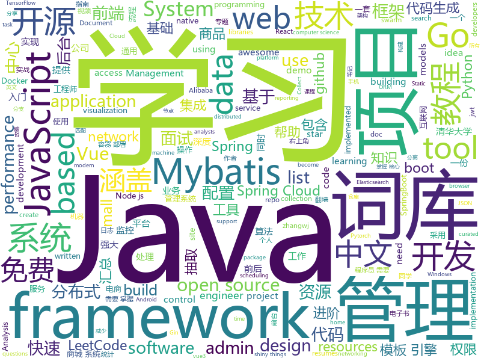

# 2020-10-10
See what the GitHub community is most excited about.

## python
+ [Python-100-Days](https://github.com/jackfrued/Python-100-Days)(**105 stars today**): Python - 100天从新手到大师
+ [sysmon](https://github.com/MatthiasSchinzel/sysmon)(**22 stars today**): Graphical system monitor for linux, including information about CPU, GPU, Memory, HDD/SDD and your network connections. Similar to windows task manager.
+ [BERTopic](https://github.com/MaartenGr/BERTopic)(**86 stars today**): Leveraging BERT and a class-based TF-IDF to create easily interpretable topics.
+ [funNLP](https://github.com/fighting41love/funNLP)(**39 stars today**): 中英文敏感词、语言检测、中外手机/电话归属地/运营商查询、名字推断性别、手机号抽取、身份证抽取、邮箱抽取、中日文人名库、中文缩写库、拆字词典、词汇情感值、停用词、反动词表、暴恐词表、繁简体转换、英文模拟中文发音、汪峰歌词生成器、职业名称词库、同义词库、反义词库、否定词库、汽车品牌词库、汽车零件词库、连续英文切割、各种中文词向量、公司名字大全、古诗词库、IT词库、财经词库、成语词库、地名词库、历史名人词库、诗词词库、医学词库、饮食词库、法律词库、汽车词库、动物词库、中文聊天语料、中文谣言数据、百度中文问答数据集、句子相似度匹配算法集合、bert资源、文本生成&摘要相关工具、cocoNLP信息抽取工具、国内电话号码正则匹配、清华大学XLORE:中英文跨语言百科知识图谱、清华大学人工智能技术…
+ [system-design-primer](https://github.com/donnemartin/system-design-primer)(**86 stars today**): Learn how to design large-scale systems. Prep for the system design interview. Includes Anki flashcards.
+ [dbt](https://github.com/fishtown-analytics/dbt)(**6 stars today**): dbt (data build tool) enables data analysts and engineers to transform their data using the same practices that software engineers use to build applications.
+ [stylegan2-ada](https://github.com/NVlabs/stylegan2-ada)(**38 stars today**): StyleGAN2 with adaptive discriminator augmentation (ADA) - Official TensorFlow implementation
+ [algo](https://github.com/wangzheng0822/algo)(**13 stars today**): 数据结构和算法必知必会的50个代码实现
+ [HelloGitHub](https://github.com/521xueweihan/HelloGitHub)(**35 stars today**): Find pearls on open-source seashore 分享 GitHub 上有趣、入门级的开源项目
+ [iOS-DeviceSupport](https://github.com/iGhibli/iOS-DeviceSupport)(**5 stars today**): This repository holds the device support files for the iOS, and I will update it regularly.
+ [insightface](https://github.com/deepinsight/insightface)(**13 stars today**): Face Analysis Project on MXNet
+ [public-apis](https://github.com/public-apis/public-apis)(**76 stars today**): A collective list of free APIs for use in software and web development.
+ [jsonresume-fake](https://github.com/jsonresume/jsonresume-fake)(**14 stars today**): Fully generated fake resumes using machine learning models trained off ~6000 JSON resumes.
+ [-HACKTOBERFEST2K20](https://github.com/afred-khan/-HACKTOBERFEST2K20)(**5 stars today**): Add all sorts of application for hacktoberfest.
+ [PythonPlantsVsZombies](https://github.com/marblexu/PythonPlantsVsZombies)(**58 stars today**): a simple PlantsVsZombies game
+ [yolov5](https://github.com/ultralytics/yolov5)(**32 stars today**): YOLOv5 in PyTorch > ONNX > CoreML > iOS
+ [sentry](https://github.com/getsentry/sentry)(**10 stars today**): Sentry is cross-platform application monitoring, with a focus on error reporting.
+ [core](https://github.com/home-assistant/core)(**26 stars today**): 🏡Open source home automation that puts local control and privacy first
+ [human-learn](https://github.com/koaning/human-learn)(**44 stars today**): Natural Intelligence is still a pretty good idea.
+ [DeepCTR](https://github.com/shenweichen/DeepCTR)(**9 stars today**): Easy-to-use,Modular and Extendible package of deep-learning based CTR models for search and recommendation.
+ [professional-services](https://github.com/GoogleCloudPlatform/professional-services)(**9 stars today**): Common solutions and tools developed by Google Cloud's Professional Services team
+ [AiLearning](https://github.com/apachecn/AiLearning)(**14 stars today**): AiLearning: 机器学习 - MachineLearning - ML、深度学习 - DeepLearning - DL、自然语言处理 NLP
+ [transformers](https://github.com/huggingface/transformers)(**47 stars today**): 🤗Transformers: State-of-the-art Natural Language Processing for Pytorch and TensorFlow 2.0.
+ [azure-cli](https://github.com/Azure/azure-cli)(**3 stars today**): Azure Command-Line Interface
+ [l5kit](https://github.com/lyft/l5kit)(**3 stars today**): L5Kit - level5.lyft.com

## java
+ [jeecg-boot](https://github.com/zhangdaiscott/jeecg-boot)(**38 stars today**): 基于代码生成器的低代码平台，超越传统商业平台！前后端分离架构：SpringBoot 2.x，Ant Design&Vue，Mybatis-plus，Shiro，JWT。强大的代码生成器让前后端代码一键生成，无需写任何代码! 引领新开发模式(OnlineCoding-> 代码生成-> 手工MERGE)，帮助Java项目解决70%重复工作，让开发更关注业务逻辑，既能快速提高开发效率，帮助公司节省成本，同时又不失灵活性。
+ [JavaGuide](https://github.com/Snailclimb/JavaGuide)(**119 stars today**): 「Java学习+面试指南」一份涵盖大部分Java程序员所需要掌握的核心知识。准备 Java 面试，首选 JavaGuide！
+ [SpringBoot-Labs](https://github.com/YunaiV/SpringBoot-Labs)(**15 stars today**): 一个涵盖六个专栏：Spring Boot 2.X、Spring Cloud、Spring Cloud Alibaba、Dubbo、分布式消息队列、分布式事务的仓库。希望胖友小手一抖，右上角来个 Star，感恩 1024
+ [advanced-java](https://github.com/doocs/advanced-java)(**37 stars today**): 😮互联网 Java 工程师进阶知识完全扫盲：涵盖高并发、分布式、高可用、微服务、海量数据处理等领域知识，后端同学必看，前端同学也可学习
+ [mall-learning](https://github.com/macrozheng/mall-learning)(**27 stars today**): mall学习教程，架构、业务、技术要点全方位解析。mall项目（39k+star）是一套电商系统，使用现阶段主流技术实现。涵盖了SpringBoot 2.3.0、MyBatis 3.4.6、Elasticsearch 7.6.2、RabbitMQ 3.7.15、Redis 5.0、MongoDB 4.2.5、Mysql5.7等技术，采用Docker容器化部署。
+ [LeetCodeAnimation](https://github.com/MisterBooo/LeetCodeAnimation)(**59 stars today**): Demonstrate all the questions on LeetCode in the form of animation.（用动画的形式呈现解LeetCode题目的思路）
+ [hello-algorithm](https://github.com/geekxh/hello-algorithm)(**34 stars today**): 🌍东半球最酷的学习项目 | 1、我写的三十万字算法图解 2、千本开源电子书 3、100 张思维导图 4、100 篇大厂面经 5、30 个学习专题🚀🚀🚀右上角点个 star，加入我们万人学习群！English Supported！
+ [Java](https://github.com/TheAlgorithms/Java)(**186 stars today**): All Algorithms implemented in Java
+ [mall](https://github.com/macrozheng/mall)(**54 stars today**): mall项目是一套电商系统，包括前台商城系统及后台管理系统，基于SpringBoot+MyBatis实现，采用Docker容器化部署。 前台商城系统包含首页门户、商品推荐、商品搜索、商品展示、购物车、订单流程、会员中心、客户服务、帮助中心等模块。 后台管理系统包含商品管理、订单管理、会员管理、促销管理、运营管理、内容管理、统计报表、财务管理、权限管理、设置等模块。
+ [apollo](https://github.com/ctripcorp/apollo)(**16 stars today**): Apollo（阿波罗）是携程框架部门研发的分布式配置中心，能够集中化管理应用不同环境、不同集群的配置，配置修改后能够实时推送到应用端，并且具备规范的权限、流程治理等特性，适用于微服务配置管理场景。
+ [toBeTopJavaer](https://github.com/hollischuang/toBeTopJavaer)(**15 stars today**): To Be Top Javaer - Java工程师成神之路
+ [flink](https://github.com/apache/flink)(**17 stars today**): Apache Flink
+ [interviews](https://github.com/kdn251/interviews)(**64 stars today**): Everything you need to know to get the job.
+ [xxl-job](https://github.com/xuxueli/xxl-job)(**8 stars today**): A distributed task scheduling framework.（分布式任务调度平台XXL-JOB）
+ [elasticsearch](https://github.com/elastic/elasticsearch)(**20 stars today**): Open Source, Distributed, RESTful Search Engine
+ [CS-Notes](https://github.com/CyC2018/CS-Notes)(**98 stars today**): 📚技术面试必备基础知识、Leetcode、计算机操作系统、计算机网络、系统设计、Java、Python、C++
+ [mall-swarm](https://github.com/macrozheng/mall-swarm)(**22 stars today**): mall-swarm是一套微服务商城系统，采用了 Spring Cloud Hoxton & Alibaba、Spring Boot 2.3、Oauth2、MyBatis、Docker、Elasticsearch等核心技术，同时提供了基于Vue的管理后台方便快速搭建系统。mall-swarm在电商业务的基础集成了注册中心、配置中心、监控中心、网关等系统功能。文档齐全，附带全套Spring Cloud教程。
+ [AndroidUtilCode](https://github.com/Blankj/AndroidUtilCode)(**14 stars today**): 🔥Android developers should collect the following utils(updating).
+ [java-design-patterns](https://github.com/iluwatar/java-design-patterns)(**48 stars today**): Design patterns implemented in Java
+ [LeetCode](https://github.com/yuanguangxin/LeetCode)(**32 stars today**): LeetCode刷题记录与面试整理
+ [spring-framework](https://github.com/spring-projects/spring-framework)(**25 stars today**): Spring Framework
+ [mybatis-3](https://github.com/mybatis/mybatis-3)(**11 stars today**): MyBatis SQL mapper framework for Java
+ [spring-boot-demo](https://github.com/xkcoding/spring-boot-demo)(**29 stars today**): spring boot demo 是一个用来深度学习并实战 spring boot 的项目，目前总共包含 65 个集成demo，已经完成 53 个。 该项目已成功集成 actuator(监控)、admin(可视化监控)、logback(日志)、aopLog(通过AOP记录web请求日志)、统一异常处理(json级别和页面级别)、freemarker(模板引擎)、thymeleaf(模板引擎)、Beetl(模板引擎)、Enjoy(模板引擎)、JdbcTemplate(通用JDBC操作数据库)、JPA(强大的ORM框架)、mybatis(强大的ORM框架)、通用Mapper(快速操作Mybatis)、PageHelper(通用的Mybatis分页插件)、mybatis-plus(快速操作M…
+ [skywalking](https://github.com/apache/skywalking)(**7 stars today**): APM, Application Performance Monitoring System
+ [easyexcel](https://github.com/alibaba/easyexcel)(**15 stars today**): 快速、简单避免OOM的java处理Excel工具

## unknown
+ [frontend](https://github.com/kottans/frontend)(**10 stars today**): Kottans frontend course🎓
+ [COVID-19](https://github.com/CSSEGISandData/COVID-19)(**11 stars today**): Novel Coronavirus (COVID-19) Cases, provided by JHU CSSE
+ [awesome-php](https://github.com/ziadoz/awesome-php)(**12 stars today**): A curated list of amazingly awesome PHP libraries, resources and shiny things.
+ [free-programming-books](https://github.com/EbookFoundation/free-programming-books)(**104 stars today**): 📚Freely available programming books
+ [Script](https://github.com/NobyDa/Script)(**10 stars today**): This project is based on the scripting capabilities of two excellent iOS proxy tools, Quantumult X or Surge.
+ [CS-Learning-res](https://github.com/harvic/CS-Learning-res)(**44 stars today**): 汇总了43个方向的电子书、视频，共3T资源，包括入门、进阶、实战的所有内容，都是成系列的，入门的完美学习资源。
+ [clash_for_windows_pkg](https://github.com/Fndroid/clash_for_windows_pkg)(**37 stars today**): A Windows/macOS GUI based on Clash
+ [CodeGuide](https://github.com/fuzhengwei/CodeGuide)(**27 stars today**): 📚本代码库是作者小傅哥多年从事一线互联网 Java 开发的学习历程技术汇总，旨在为大家提供一个清晰详细的学习教程，侧重点更倾向编写Java核心内容。如果本仓库能为您提供帮助，请给予支持(关注、点赞、分享)！
+ [CppGuide](https://github.com/balloonwj/CppGuide)(**60 stars today**): C/C++学习，后端开发进阶指南。
+ [JavaFamily](https://github.com/AobingJava/JavaFamily)(**35 stars today**): 【Java面试+Java学习指南】 一份涵盖大部分Java程序员所需要掌握的核心知识。
+ [coding-interview-university](https://github.com/jwasham/coding-interview-university)(**118 stars today**): A complete computer science study plan to become a software engineer.
+ [3y](https://github.com/ZhongFuCheng3y/3y)(**24 stars today**): 📓从Java基础、JavaWeb基础到常用的框架再到面试题都有完整的教程，几乎涵盖了Java后端必备的知识点
+ [awesome-javascript](https://github.com/sorrycc/awesome-javascript)(**28 stars today**): 🐢A collection of awesome browser-side JavaScript libraries, resources and shiny things.
+ [common-words](https://github.com/yoksel/common-words)(**6 stars today**): 🧐Слова, часто используемые в CSS-классах
+ [awesome-nodejs](https://github.com/sindresorhus/awesome-nodejs)(**22 stars today**): ⚡Delightful Node.js packages and resources
+ [LeetcodeTop](https://github.com/afatcoder/LeetcodeTop)(**18 stars today**): 汇总各大互联网公司容易考察的高频leetcode题🔥
+ [Android](https://github.com/open-android/Android)(**14 stars today**): GitHub上最火的Android开源项目,所有开源项目都有详细资料和配套视频
+ [scientific-visualization-book](https://github.com/rougier/scientific-visualization-book)(**74 stars today**): ❗️WIP❗️An open access book on scientific visualization using python and matplotlib
+ [IntelliJ-IDEA-Tutorial](https://github.com/judasn/IntelliJ-IDEA-Tutorial)(**10 stars today**): IntelliJ IDEA 简体中文专题教程
+ [awesome-wechat-weapp](https://github.com/justjavac/awesome-wechat-weapp)(**15 stars today**): 微信小程序开发资源汇总💯
+ [weekly](https://github.com/ruanyf/weekly)(**14 stars today**): 科技爱好者周刊，每周五发布
+ [awesome-self-supervised-learning](https://github.com/jason718/awesome-self-supervised-learning)(**12 stars today**): A curated list of awesome self-supervised methods
+ [docs](https://github.com/dapr/docs)(**2 stars today**): User documentation for Dapr
+ [free](https://github.com/freefq/free)(**17 stars today**): 免费科学上网,免费翻墙,免费ssr,免费v2ray,免费vmess节点,免费节点,翻墙,蓝灯,谷歌商店

## javascript
+ [docs](https://github.com/github/docs)(**203 stars today**): This is the open-source repo for docs.github.com.
+ [hacker-scripts](https://github.com/NARKOZ/hacker-scripts)(**193 stars today**): Based on a true story
+ [bongo.cat](https://github.com/Externalizable/bongo.cat)(**110 stars today**): Hit the bongos like Bongo Cat!
+ [register](https://github.com/is-a-dev/register)(**82 stars today**): Grab your own sweet-looking '.is-a.dev' subdomain
+ [freeCodeCamp](https://github.com/freeCodeCamp/freeCodeCamp)(**63 stars today**): freeCodeCamp.org's open source codebase and curriculum. Learn to code at home.
+ [react-advanced-2020](https://github.com/john-smilga/react-advanced-2020)(**4 stars today**): 
+ [node](https://github.com/nodejs/node)(**59 stars today**): Node.js JavaScript runtime✨🐢🚀✨
+ [astrofox](https://github.com/astrofox-io/astrofox)(**121 stars today**): Astrofox is a motion graphics program that lets you create music visualizations and turn them into videos.
+ [play.tailwindcss.com](https://github.com/tailwindlabs/play.tailwindcss.com)(**73 stars today**): 
+ [papermerge](https://github.com/ciur/papermerge)(**51 stars today**): Open Source Document Management System for Digital Archives (Scanned Documents)
+ [react-native](https://github.com/facebook/react-native)(**25 stars today**): A framework for building native apps with React.
+ [vue](https://github.com/vuejs/vue)(**77 stars today**): 🖖Vue.js is a progressive, incrementally-adoptable JavaScript framework for building UI on the web.
+ [beginners-intro-javascript-node](https://github.com/microsoft/beginners-intro-javascript-node)(**248 stars today**): Beginner's Series: Introduction to JavaScript (Node.js)
+ [awesome-mac](https://github.com/jaywcjlove/awesome-mac)(**15 stars today**):  Now we have become very big, Different from the original idea. Collect premium software in various categories.
+ [scripts](https://github.com/lxk0301/scripts)(**31 stars today**): 京东薅羊毛工具（活动入口：京东app->我的->游戏与互动->查看更多）讨论组：https://t.me/JD_fruit_pet
+ [sortablejs](https://github.com/SortableJS/sortablejs)(**7 stars today**): Create and reorder lists with drag-and-drop. For use with modern browsers and touch devices
+ [Web](https://github.com/qianguyihao/Web)(**15 stars today**): 前端入门到进阶图文教程，超详细的Web前端学习笔记。从零开始学前端，做一名精致优雅的前端工程师。公众号「千古壹号」作者。
+ [winston](https://github.com/winstonjs/winston)(**6 stars today**): A logger for just about everything.
+ [vuepress](https://github.com/vuejs/vuepress)(**14 stars today**): 📝Minimalistic Vue-powered static site generator
+ [30-seconds-of-code](https://github.com/30-seconds/30-seconds-of-code)(**274 stars today**): Short JavaScript code snippets for all your development needs
+ [vue-admin-beautiful](https://github.com/chuzhixin/vue-admin-beautiful)(**38 stars today**): 🚀🚀🚀vue-admin-beautiful是github开源admin中最优秀的集成框架之一，它是国内首个基于vue3.0 + antdv的开源admin项目，同时支持电脑，手机，平板，🔥🔥🔥默认分支使用vue3.x开发，master分支使用的是vue2.x开发
+ [quasar](https://github.com/quasarframework/quasar)(**21 stars today**): Quasar Framework - Build high-performance VueJS user interfaces in record time
+ [react-developer-roadmap](https://github.com/adam-golab/react-developer-roadmap)(**54 stars today**): Roadmap to becoming a React developer
+ [OpenAPI-Specification](https://github.com/OAI/OpenAPI-Specification)(**10 stars today**): The OpenAPI Specification Repository
+ [alpine](https://github.com/alpinejs/alpine)(**23 stars today**): A rugged, minimal framework for composing JavaScript behavior in your markup.

## html
+ [Server](https://github.com/PanDownloadServer/Server)(**414 stars today**): PanDownload的个人维护版本
+ [nndl.github.io](https://github.com/nndl/nndl.github.io)(**14 stars today**): 《神经网络与深度学习》 邱锡鹏著 Neural Network and Deep Learning
+ [zh.javascript.info](https://github.com/javascript-tutorial/zh.javascript.info)(**17 stars today**): 现代 JavaScript 教程（The Modern JavaScript Tutorial）
+ [charts](https://github.com/bitnami/charts)(**6 stars today**): Helm Charts
+ [pandownload.com_Pages_Backup](https://github.com/Womsxd/pandownload.com_Pages_Backup)(**2 stars today**): pandownload页面的备份，应该是比较完全的一份
+ [Front-end-Developer-Interview-Questions](https://github.com/h5bp/Front-end-Developer-Interview-Questions)(**17 stars today**): A list of helpful front-end related questions you can use to interview potential candidates, test yourself or completely ignore.
+ [docker-development-youtube-series](https://github.com/marcel-dempers/docker-development-youtube-series)(**4 stars today**): 
+ [ML-notes](https://github.com/Sakura-gh/ML-notes)(**8 stars today**): notes about machine learning
+ [blog_os](https://github.com/phil-opp/blog_os)(**6 stars today**): Writing an OS in Rust
+ [elevate-lab-website](https://github.com/Elevate-Lab/elevate-lab-website)(**1 stars today**): A website to inform and invite contributors to elevate-lab
+ [amundsen](https://github.com/amundsen-io/amundsen)(**7 stars today**): Amundsen is a metadata driven application for improving the productivity of data analysts, data scientists and engineers when interacting with data.
+ [phpstan](https://github.com/phpstan/phpstan)(**7 stars today**): PHP Static Analysis Tool - discover bugs in your code without running it!
+ [howtheytest](https://github.com/abhivaikar/howtheytest)(**45 stars today**): A collection of public resources about how software companies test their software
+ [fast](https://github.com/reblim/fast)(**14 stars today**): Develop, build, deploy, redeploy, and teardown frontend projects fast.
+ [zju-icicles](https://github.com/QSCTech/zju-icicles)(**14 stars today**): 浙江大学课程攻略共享计划
+ [calico](https://github.com/projectcalico/calico)(**3 stars today**): Cloud native networking and network security
+ [tidytuesday](https://github.com/rfordatascience/tidytuesday)(**6 stars today**): Official repo for the #tidytuesday project
+ [aave-protocol](https://github.com/aave/aave-protocol)(**3 stars today**): Aave Protocol Version 1.0 - Decentralized Lending Pools
+ [bitcointreasuries.org](https://github.com/nvk/bitcointreasuries.org)(**1 stars today**): 
+ [Coursera-ML-AndrewNg-Notes](https://github.com/fengdu78/Coursera-ML-AndrewNg-Notes)(**21 stars today**): 吴恩达老师的机器学习课程个人笔记
+ [LGBTQIA-in-China](https://github.com/LGBT-CN/LGBTQIA-in-China)(**11 stars today**): 🏳️‍🌈中国的性少数群体一直渴望着自由平等
+ [electron-api-demos](https://github.com/electron/electron-api-demos)(**5 stars today**): Explore the Electron APIs
+ [hospitalmanagement](https://github.com/sumitkumar1503/hospitalmanagement)(**4 stars today**): Hospital Management System || Python Django
+ [hugo-PaperMod](https://github.com/adityatelange/hugo-PaperMod)(**5 stars today**): SSG Hugo | Theme - PaperMod
+ [912_project](https://github.com/stellarkey/912_project)(**3 stars today**): 清华大学计算机系考研攻略 Guidance for postgraduate entrance examination in Department of Computer Science and Technology, Tsinghua University

## go
+ [ferry](https://github.com/lanyulei/ferry)(**81 stars today**): 本系统是集工单统计、任务钩子、权限管理、灵活配置流程与模版等等于一身的开源工单系统，当然也可以称之为工作流引擎。 致力于减少跨部门之间的沟通，自动任务的执行，提升工作效率与工作质量，减少不必要的工作量与人为出错率。
+ [server](https://github.com/screego/server)(**539 stars today**): screen sharing for developers https://screego.net/
+ [go-admin](https://github.com/go-admin-team/go-admin)(**33 stars today**): 基于Gin + Vue + Element UI的前后端分离权限管理系统脚手架（包含了：基础用户管理功能，jwt鉴权，代码生成器，RBAC资源控制，表单构建等）分分钟构建自己的中后台项目；文档：http://doc.zhangwj.com/go-admin-site/ Demo： http://www.zhangwj.com/#/login
+ [v2ray-core](https://github.com/v2fly/v2ray-core)(**38 stars today**): A platform for building proxies to bypass network restrictions.
+ [dns](https://github.com/miekg/dns)(**9 stars today**): DNS library in Go
+ [gin](https://github.com/gin-gonic/gin)(**34 stars today**): Gin is a HTTP web framework written in Go (Golang). It features a Martini-like API with much better performance -- up to 40 times faster. If you need smashing performance, get yourself some Gin.
+ [lotus](https://github.com/filecoin-project/lotus)(**5 stars today**): Implementation of the Filecoin protocol, written in Go
+ [kubernetes](https://github.com/kubernetes/kubernetes)(**32 stars today**): Production-Grade Container Scheduling and Management
+ [telegraf](https://github.com/influxdata/telegraf)(**7 stars today**): The plugin-driven server agent for collecting & reporting metrics.
+ [go-zero](https://github.com/tal-tech/go-zero)(**24 stars today**): go-zero is a web and rpc framework written in Go. It's born to ensure the stability of the busy sites with resilient design. Builtin goctl greatly improves the development productivity.
+ [vault](https://github.com/hashicorp/vault)(**19 stars today**): A tool for secrets management, encryption as a service, and privileged access management
+ [pprof](https://github.com/google/pprof)(**6 stars today**): pprof is a tool for visualization and analysis of profiling data
+ [rook](https://github.com/rook/rook)(**18 stars today**): Storage Orchestration for Kubernetes
+ [istio](https://github.com/istio/istio)(**16 stars today**): Connect, secure, control, and observe services.
+ [casbin](https://github.com/casbin/casbin)(**16 stars today**): An authorization library that supports access control models like ACL, RBAC, ABAC in Golang
+ [logrus](https://github.com/sirupsen/logrus)(**13 stars today**): Structured, pluggable logging for Go.
+ [go](https://github.com/golang/go)(**42 stars today**): The Go programming language
+ [quic-go](https://github.com/lucas-clemente/quic-go)(**8 stars today**): A QUIC implementation in pure go
+ [autoscaler](https://github.com/kubernetes/autoscaler)(**6 stars today**): Autoscaling components for Kubernetes
+ [viper](https://github.com/spf13/viper)(**13 stars today**): Go configuration with fangs
+ [Go](https://github.com/TheAlgorithms/Go)(**54 stars today**): Algorithms Implemented in GoLang
+ [minio](https://github.com/minio/minio)(**20 stars today**): High Performance, Kubernetes Native Object Storage
+ [cilium](https://github.com/cilium/cilium)(**9 stars today**): eBPF-based Networking, Security, and Observability
+ [influxdb](https://github.com/influxdata/influxdb)(**6 stars today**): Scalable datastore for metrics, events, and real-time analytics
+ [aws-sdk-go](https://github.com/aws/aws-sdk-go)(**3 stars today**): AWS SDK for the Go programming language.

## WordCloud

