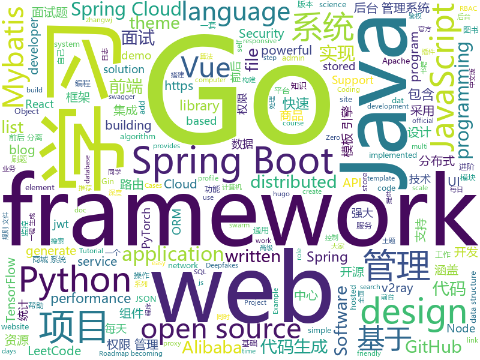

# 2020-10-11
See what the GitHub community is most excited about.

## python
+ [big_screen](https://github.com/TurboWay/big_screen)(**153 stars today**): 数据大屏可视化
+ [Real-Time-Voice-Cloning](https://github.com/CorentinJ/Real-Time-Voice-Cloning)(**27 stars today**): Clone a voice in 5 seconds to generate arbitrary speech in real-time
+ [30-Days-Of-Python](https://github.com/Asabeneh/30-Days-Of-Python)(**213 stars today**): 30 days of Python programming challenge is a step by step guide to learn Python programming language in 30 days.
+ [Python-100-Days](https://github.com/jackfrued/Python-100-Days)(**267 stars today**): Python - 100天从新手到大师
+ [DeepFaceLab](https://github.com/iperov/DeepFaceLab)(**35 stars today**): DeepFaceLab is the leading software for creating deepfakes.
+ [faceswap](https://github.com/deepfakes/faceswap)(**34 stars today**): Deepfakes Software For All
+ [Chinese-BERT-wwm](https://github.com/ymcui/Chinese-BERT-wwm)(**21 stars today**): Pre-Training with Whole Word Masking for Chinese BERT（中文BERT-wwm系列模型）
+ [bert](https://github.com/google-research/bert)(**32 stars today**): TensorFlow code and pre-trained models for BERT
+ [HelloGitHub](https://github.com/521xueweihan/HelloGitHub)(**54 stars today**): Find pearls on open-source seashore 分享 GitHub 上有趣、入门级的开源项目
+ [yolov5](https://github.com/ultralytics/yolov5)(**46 stars today**): YOLOv5 in PyTorch > ONNX > CoreML > iOS
+ [system-design-primer](https://github.com/donnemartin/system-design-primer)(**137 stars today**): Learn how to design large-scale systems. Prep for the system design interview. Includes Anki flashcards.
+ [Instagram](https://github.com/Pure-L0G1C/Instagram)(**10 stars today**): Bruteforce attack for Instagram
+ [horovod](https://github.com/horovod/horovod)(**7 stars today**): Distributed training framework for TensorFlow, Keras, PyTorch, and Apache MXNet.
+ [yolov4-deepsort](https://github.com/theAIGuysCode/yolov4-deepsort)(**49 stars today**): Object tracking implemented with YOLOv4, DeepSort, and TensorFlow.
+ [numpy](https://github.com/numpy/numpy)(**20 stars today**): The fundamental package for scientific computing with Python.
+ [pytorch-tutorial](https://github.com/yunjey/pytorch-tutorial)(**21 stars today**): PyTorch Tutorial for Deep Learning Researchers
+ [human-learn](https://github.com/koaning/human-learn)(**56 stars today**): Natural Intelligence is still a pretty good idea.
+ [jina](https://github.com/jina-ai/jina)(**18 stars today**): An easier way to build neural search in the cloud
+ [shadowsocks](https://github.com/shadowsocks/shadowsocks)(**3 stars today**): 
+ [discord.py](https://github.com/Rapptz/discord.py)(**18 stars today**): An API wrapper for Discord written in Python.
+ [Statistical-Learning-Method_Code](https://github.com/Dod-o/Statistical-Learning-Method_Code)(**27 stars today**): 手写实现李航《统计学习方法》书中全部算法
+ [python-telegram-bot](https://github.com/python-telegram-bot/python-telegram-bot)(**26 stars today**): We have made you a wrapper you can't refuse
+ [AutoRCCar](https://github.com/hamuchiwa/AutoRCCar)(**88 stars today**): OpenCV Python Neural Network Autonomous RC Car
+ [stylegan2-ada](https://github.com/NVlabs/stylegan2-ada)(**61 stars today**): StyleGAN2 with adaptive discriminator augmentation (ADA) - Official TensorFlow implementation
+ [AiLearning](https://github.com/apachecn/AiLearning)(**30 stars today**): AiLearning: 机器学习 - MachineLearning - ML、深度学习 - DeepLearning - DL、自然语言处理 NLP

## java
+ [jeecg-boot](https://github.com/zhangdaiscott/jeecg-boot)(**227 stars today**): 基于代码生成器的低代码平台，超越传统商业平台！前后端分离架构：SpringBoot 2.x，Ant Design&Vue，Mybatis-plus，Shiro，JWT。强大的代码生成器让前后端代码一键生成，无需写任何代码! 引领新开发模式(OnlineCoding-> 代码生成-> 手工MERGE)，帮助Java项目解决70%重复工作，让开发更关注业务逻辑，既能快速提高开发效率，帮助公司节省成本，同时又不失灵活性。
+ [JavaGuide](https://github.com/Snailclimb/JavaGuide)(**167 stars today**): 「Java学习+面试指南」一份涵盖大部分Java程序员所需要掌握的核心知识。准备 Java 面试，首选 JavaGuide！
+ [CS-Notes](https://github.com/CyC2018/CS-Notes)(**109 stars today**): 📚技术面试必备基础知识、Leetcode、计算机操作系统、计算机网络、系统设计、Java、Python、C++
+ [spring-boot-demo](https://github.com/xkcoding/spring-boot-demo)(**52 stars today**): spring boot demo 是一个用来深度学习并实战 spring boot 的项目，目前总共包含 65 个集成demo，已经完成 53 个。 该项目已成功集成 actuator(监控)、admin(可视化监控)、logback(日志)、aopLog(通过AOP记录web请求日志)、统一异常处理(json级别和页面级别)、freemarker(模板引擎)、thymeleaf(模板引擎)、Beetl(模板引擎)、Enjoy(模板引擎)、JdbcTemplate(通用JDBC操作数据库)、JPA(强大的ORM框架)、mybatis(强大的ORM框架)、通用Mapper(快速操作Mybatis)、PageHelper(通用的Mybatis分页插件)、mybatis-plus(快速操作M…
+ [SpringBoot-Labs](https://github.com/YunaiV/SpringBoot-Labs)(**38 stars today**): 一个涵盖六个专栏：Spring Boot 2.X、Spring Cloud、Spring Cloud Alibaba、Dubbo、分布式消息队列、分布式事务的仓库。希望胖友小手一抖，右上角来个 Star，感恩 1024
+ [mall](https://github.com/macrozheng/mall)(**75 stars today**): mall项目是一套电商系统，包括前台商城系统及后台管理系统，基于SpringBoot+MyBatis实现，采用Docker容器化部署。 前台商城系统包含首页门户、商品推荐、商品搜索、商品展示、购物车、订单流程、会员中心、客户服务、帮助中心等模块。 后台管理系统包含商品管理、订单管理、会员管理、促销管理、运营管理、内容管理、统计报表、财务管理、权限管理、设置等模块。
+ [Sentinel](https://github.com/alibaba/Sentinel)(**20 stars today**): A powerful flow control component enabling reliability, resilience and monitoring for microservices. (面向云原生微服务的高可用流控防护组件)
+ [canal](https://github.com/alibaba/canal)(**25 stars today**): 阿里巴巴 MySQL binlog 增量订阅&消费组件
+ [java-design-patterns](https://github.com/iluwatar/java-design-patterns)(**54 stars today**): Design patterns implemented in Java
+ [spring-cloud-alibaba](https://github.com/alibaba/spring-cloud-alibaba)(**39 stars today**): Spring Cloud Alibaba provides a one-stop solution for application development for the distributed solutions of Alibaba middleware.
+ [LeetCode](https://github.com/yuanguangxin/LeetCode)(**68 stars today**): LeetCode刷题记录与面试整理
+ [advanced-java](https://github.com/doocs/advanced-java)(**89 stars today**): 😮互联网 Java 工程师进阶知识完全扫盲：涵盖高并发、分布式、高可用、微服务、海量数据处理等领域知识，后端同学必看，前端同学也可学习
+ [flink](https://github.com/apache/flink)(**21 stars today**): Apache Flink
+ [skywalking](https://github.com/apache/skywalking)(**12 stars today**): APM, Application Performance Monitoring System
+ [xxl-job](https://github.com/xuxueli/xxl-job)(**11 stars today**): A distributed task scheduling framework.（分布式任务调度平台XXL-JOB）
+ [AntennaPod](https://github.com/AntennaPod/AntennaPod)(**12 stars today**): A podcast manager for Android
+ [mall-swarm](https://github.com/macrozheng/mall-swarm)(**49 stars today**): mall-swarm是一套微服务商城系统，采用了 Spring Cloud Hoxton & Alibaba、Spring Boot 2.3、Oauth2、MyBatis、Docker、Elasticsearch等核心技术，同时提供了基于Vue的管理后台方便快速搭建系统。mall-swarm在电商业务的基础集成了注册中心、配置中心、监控中心、网关等系统功能。文档齐全，附带全套Spring Cloud教程。
+ [miaosha](https://github.com/qiurunze123/miaosha)(**19 stars today**): ⭐⭐⭐⭐秒杀系统设计与实现.互联网工程师进阶与分析🙋🐓
+ [nacos](https://github.com/alibaba/nacos)(**31 stars today**): an easy-to-use dynamic service discovery, configuration and service management platform for building cloud native applications.
+ [LeetCodeAnimation](https://github.com/MisterBooo/LeetCodeAnimation)(**77 stars today**): Demonstrate all the questions on LeetCode in the form of animation.（用动画的形式呈现解LeetCode题目的思路）
+ [SpringBoot-Learning](https://github.com/dyc87112/SpringBoot-Learning)(**12 stars today**): Spring Boot基础教程，Spring Boot 2.x版本连载中！！！
+ [SpringAll](https://github.com/wuyouzhuguli/SpringAll)(**28 stars today**): 循序渐进，学习Spring Boot、Spring Boot & Shiro、Spring Batch、Spring Cloud、Spring Cloud Alibaba、Spring Security & Spring Security OAuth2，博客Spring系列源码：https://mrbird.cc
+ [rocketmq](https://github.com/apache/rocketmq)(**7 stars today**): Mirror of Apache RocketMQ
+ [guava](https://github.com/google/guava)(**31 stars today**): Google core libraries for Java
+ [eladmin](https://github.com/elunez/eladmin)(**80 stars today**): 项目基于 Spring Boot 2.1.0 、 Jpa、 Spring Security、redis、Vue的前后端分离的后台管理系统，项目采用分模块开发方式， 权限控制采用 RBAC，支持数据字典与数据权限管理，支持一键生成前后端代码，支持动态路由

## unknown
+ [free-programming-books](https://github.com/EbookFoundation/free-programming-books)(**180 stars today**): 📚Freely available programming books
+ [100ProjectsOfCode](https://github.com/aceking007/100ProjectsOfCode)(**542 stars today**): A list of practical knowledge-building projects.
+ [developer-roadmap](https://github.com/kamranahmedse/developer-roadmap)(**193 stars today**): Roadmap to becoming a web developer in 2020
+ [architect-awesome](https://github.com/xingshaocheng/architect-awesome)(**22 stars today**): 后端架构师技术图谱
+ [coding-interview-university](https://github.com/jwasham/coding-interview-university)(**167 stars today**): A complete computer science study plan to become a software engineer.
+ [engineer-vocabulary-list](https://github.com/mercari/engineer-vocabulary-list)(**397 stars today**): Engineer Vocabulary List in Japanese/English
+ [build-your-own-x](https://github.com/danistefanovic/build-your-own-x)(**78 stars today**): 🤓Build your own (insert technology here)
+ [Best-websites-a-programmer-should-visit](https://github.com/sdmg15/Best-websites-a-programmer-should-visit)(**24 stars today**): 🔗Some useful websites for programmers.
+ [cloudflare-2020-general-engineering-assignment](https://github.com/cloudflare-hiring/cloudflare-2020-general-engineering-assignment)(**18 stars today**): 
+ [COVID-19](https://github.com/CSSEGISandData/COVID-19)(**14 stars today**): Novel Coronavirus (COVID-19) Cases, provided by JHU CSSE
+ [applied-ml](https://github.com/eugeneyan/applied-ml)(**33 stars today**): 📚Papers by organizations sharing their work on applied data science & machine learning.
+ [eloquente-javascript](https://github.com/braziljs/eloquente-javascript)(**19 stars today**): Tradução do livro Eloquent JavaScript - 2ª edição.
+ [recommended-books](https://github.com/woai3c/recommended-books)(**18 stars today**): 计算机经典书籍推荐 部分书籍提供PDF下载
+ [frontend](https://github.com/kottans/frontend)(**32 stars today**): Kottans frontend course🎓
+ [Clash_Chinese_Patch](https://github.com/BoyceLig/Clash_Chinese_Patch)(**23 stars today**): 
+ [chromium](https://github.com/chromium/chromium)(**18 stars today**): The official GitHub mirror of the Chromium source
+ [computer-science](https://github.com/ossu/computer-science)(**64 stars today**): 🎓Path to a free self-taught education in Computer Science!
+ [LibraryBookSearchEngine](https://github.com/fenwii/LibraryBookSearchEngine)(**29 stars today**): LibraryBookSearchEngine，link librarys of all Countries, search all resources of books. 图书馆图书搜索引擎,在家链接全球图书馆，搜索图书资源
+ [awesome-point-cloud-analysis](https://github.com/Yochengliu/awesome-point-cloud-analysis)(**10 stars today**): A list of papers and datasets about point cloud analysis (processing)
+ [NewGrad-2021](https://github.com/Pitt-CSC/NewGrad-2021)(**10 stars today**): A collection of New Grad full time roles in SWE, Quant, and PM.
+ [awesome-mlops](https://github.com/visenger/awesome-mlops)(**39 stars today**): A curated list of references for MLOps
+ [v2ray-rules-dat](https://github.com/Loyalsoldier/v2ray-rules-dat)(**11 stars today**): 🦄🎃👻V2Ray 路由规则文件加强版，可代替官方 geoip.dat 和 geosite.dat 规则文件，兼容 Trojan-Go。Enhanced edition of V2Ray rules dat files, compatible with Trojan-Go.
+ [HowToHunt](https://github.com/KathanP19/HowToHunt)(**20 stars today**): Tutorials and Things to Do while Hunting Vulnerability.
+ [PythonPark](https://github.com/Jack-Cherish/PythonPark)(**6 stars today**): Python开源项目之「自学编程之路」，学习指南+技术干货+大厂面经+资源分享
+ [OnJava8](https://github.com/LingCoder/OnJava8)(**40 stars today**): 《On Java 8》中文版，又名《Java编程思想》 第5版

## javascript
+ [docs](https://github.com/github/docs)(**334 stars today**): This is the open-source repo for docs.github.com.
+ [hacker-scripts](https://github.com/NARKOZ/hacker-scripts)(**252 stars today**): Based on a true story
+ [beginners-intro-javascript-node](https://github.com/microsoft/beginners-intro-javascript-node)(**295 stars today**): Beginner's Series: Introduction to JavaScript (Node.js)
+ [awesome-selfhosted](https://github.com/awesome-selfhosted/awesome-selfhosted)(**64 stars today**): A list of Free Software network services and web applications which can be hosted locally. Selfhosting is the process of hosting and managing applications instead of renting from Software-as-a-Service providers
+ [freeCodeCamp](https://github.com/freeCodeCamp/freeCodeCamp)(**96 stars today**): freeCodeCamp.org's open source codebase and curriculum. Learn to code at home.
+ [react-developer-roadmap](https://github.com/adam-golab/react-developer-roadmap)(**88 stars today**): Roadmap to becoming a React developer
+ [vue](https://github.com/vuejs/vue)(**107 stars today**): 🖖Vue.js is a progressive, incrementally-adoptable JavaScript framework for building UI on the web.
+ [github-profile-readme-generator](https://github.com/rahuldkjain/github-profile-readme-generator)(**134 stars today**): 🚀Generate GitHub profile README easily with the latest add-ons like visitors count, GitHub stats, etc using minimal UI.
+ [RSSHub](https://github.com/DIYgod/RSSHub)(**27 stars today**): 🍰Everything is RSSible
+ [next.js](https://github.com/vercel/next.js)(**71 stars today**): The React Framework
+ [react-advanced-2020](https://github.com/john-smilga/react-advanced-2020)(**14 stars today**): 
+ [scripts](https://github.com/lxk0301/scripts)(**50 stars today**): 京东薅羊毛工具（活动入口：京东app->我的->游戏与互动->查看更多）讨论组：https://t.me/JD_fruit_pet
+ [fe-interview](https://github.com/haizlin/fe-interview)(**30 stars today**): 前端面试每日 3+1，以面试题来驱动学习，提倡每日学习与思考，每天进步一点！每天早上5点纯手工发布面试题（死磕自己，愉悦大家），3000+道前端面试题全面覆盖，HTML/CSS/JavaScript/Vue/React/Nodejs/TypeScript/ECMAScritpt/Webpack/Jquery/小程序/软技能……
+ [web3.js](https://github.com/ethereum/web3.js)(**9 stars today**): Ethereum JavaScript API
+ [vue-admin-template](https://github.com/PanJiaChen/vue-admin-template)(**17 stars today**): a vue2.0 minimal admin template
+ [joplin](https://github.com/laurent22/joplin)(**53 stars today**): Joplin - an open source note taking and to-do application with synchronization capabilities for Windows, macOS, Linux, Android and iOS. Forum: https://discourse.joplinapp.org/
+ [Daily-Interview-Question](https://github.com/Advanced-Frontend/Daily-Interview-Question)(**24 stars today**): 我是木易杨，公众号「高级前端进阶」作者，每天搞定一道前端大厂面试题，祝大家天天进步，一年后会看到不一样的自己。
+ [incubator-echarts](https://github.com/apache/incubator-echarts)(**31 stars today**): A powerful, interactive charting and data visualization library for browser
+ [Luckysheet](https://github.com/mengshukeji/Luckysheet)(**450 stars today**): Luckysheet is an online spreadsheet like excel that is powerful, simple to configure, and completely open source.
+ [monaco-editor](https://github.com/microsoft/monaco-editor)(**18 stars today**): A browser based code editor
+ [vant-weapp](https://github.com/youzan/vant-weapp)(**14 stars today**): 轻量、可靠的小程序 UI 组件库
+ [astrofox](https://github.com/astrofox-io/astrofox)(**334 stars today**): Astrofox is a motion graphics program that lets you create music visualizations and turn them into videos.
+ [Weather-Cal](https://github.com/mzeryck/Weather-Cal)(**15 stars today**): This is a Scriptable widget that allows you to display, position, and format multiple elements, including the date, a greeting, your upcoming events, the current weather, and future weather. You can even create your own elements.
+ [javascript-algorithms](https://github.com/trekhleb/javascript-algorithms)(**88 stars today**): 📝Algorithms and data structures implemented in JavaScript with explanations and links to further readings
+ [discord.js](https://github.com/discordjs/discord.js)(**17 stars today**): A powerful JavaScript library for interacting with the Discord API

## html
+ [elevate-lab-website](https://github.com/Elevate-Lab/elevate-lab-website)(**4 stars today**): A website to inform and invite contributors to elevate-lab
+ [zju-icicles](https://github.com/QSCTech/zju-icicles)(**21 stars today**): 浙江大学课程攻略共享计划
+ [HacktoberFest2020](https://github.com/bajajvinamr/HacktoberFest2020)(**12 stars today**): Make your first PR! ~ A beginner-friendly repository. Add your profile, a blog, or any program under any language (it can be anything from a hello-world program to a complex data structure algorithm) or update the existing one. Just make sure to add the file under the correct directory. Happy hacking!
+ [speedtest](https://github.com/librespeed/speedtest)(**9 stars today**): Self-hosted Speedtest for HTML5 and more. Easy setup, examples, configurable, mobile friendly. Supports PHP, Node, Multiple servers, and more
+ [Server](https://github.com/PanDownloadServer/Server)(**398 stars today**): PanDownload的个人维护版本
+ [swagger-codegen](https://github.com/swagger-api/swagger-codegen)(**16 stars today**): swagger-codegen contains a template-driven engine to generate documentation, API clients and server stubs in different languages by parsing your OpenAPI / Swagger definition.
+ [v2-ui](https://github.com/sprov065/v2-ui)(**9 stars today**): 支持多协议多用户的 v2ray 面板，Support multi-protocol multi-user v2ray panel
+ [18S191](https://github.com/mitmath/18S191)(**4 stars today**): Course 18.S191 at MIT, fall 2020 - Introduction to computational thinking with Julia:
+ [LGBTQIA-in-China](https://github.com/LGBT-CN/LGBTQIA-in-China)(**17 stars today**): 🏳️‍🌈中国的性少数群体一直渴望着自由平等
+ [huxpro.github.io](https://github.com/Huxpro/huxpro.github.io)(**5 stars today**): My Blog / Jekyll Themes / PWA
+ [kubeasz](https://github.com/easzlab/kubeasz)(**10 stars today**): 使用Ansible脚本安装K8S集群，介绍组件交互原理，方便直接，不受国内网络环境影响
+ [juliamono](https://github.com/cormullion/juliamono)(**82 stars today**): repository for JuliaMono, a monospaced font designed to work well with the Julia language. Details in the web site:
+ [node-js-getting-started](https://github.com/heroku/node-js-getting-started)(**2 stars today**): Getting Started with Node on Heroku
+ [computer-science-flash-cards](https://github.com/jwasham/computer-science-flash-cards)(**13 stars today**): Mini website for testing both general CS knowledge and enforce coding practice and common algorithm/data structure memorization.
+ [gopl-zh](https://github.com/golang-china/gopl-zh)(**9 stars today**): 📚Go语言圣经中文版
+ [gohugo-theme-ananke](https://github.com/theNewDynamic/gohugo-theme-ananke)(**0 stars today**): Ananke: A theme for Hugo Sites
+ [CG-SQL](https://github.com/facebookincubator/CG-SQL)(**50 stars today**): CG/SQL is a compiler that converts a SQL Stored Procedure like language into C for SQLite. SQLite has no stored procedures of its own. CG/CQL can also generate other useful artifacts for testing and schema maintenance.
+ [ansible-os-hardening](https://github.com/dev-sec/ansible-os-hardening)(**3 stars today**): This Ansible role provides numerous security-related configurations, providing all-round base protection.
+ [hexo-theme-matery](https://github.com/blinkfox/hexo-theme-matery)(**12 stars today**): A beautiful hexo blog theme with material design and responsive design.一个基于材料设计和响应式设计而成的全面、美观的Hexo主题。国内访问：http://blinkfox.com
+ [goproxy.cn](https://github.com/goproxy/goproxy.cn)(**10 stars today**): The most trusted Go module proxy in China.
+ [vex-hugo](https://github.com/themefisher/vex-hugo)(**0 stars today**): Vex is a product landing page theme/template created by Themefisher based on the latest Bootstrap 4 framework. It is fully responsive and beautifully crafted with Product Showcase, Testimonials, and Email Subscription sections
+ [calibre-web](https://github.com/janeczku/calibre-web)(**9 stars today**): 📚Web app for browsing, reading and downloading eBooks stored in a Calibre database
+ [privacytools.io](https://github.com/privacytools/privacytools.io)(**4 stars today**): 🛡🛠You are being watched. Protect your privacy against global mass surveillance.
+ [hugo-coder](https://github.com/luizdepra/hugo-coder)(**5 stars today**): A minimalist blog theme for hugo.
+ [css-course-content](https://github.com/Video-Lab/css-course-content)(**2 stars today**): Project files and content for the CSS 'Zero to Hero' course.

## go
+ [v2ray-core](https://github.com/v2fly/v2ray-core)(**88 stars today**): A platform for building proxies to bypass network restrictions.
+ [ferry](https://github.com/lanyulei/ferry)(**117 stars today**): 本系统是集工单统计、任务钩子、权限管理、灵活配置流程与模版等等于一身的开源工单系统，当然也可以称之为工作流引擎。 致力于减少跨部门之间的沟通，自动任务的执行，提升工作效率与工作质量，减少不必要的工作量与人为出错率。
+ [go-zero](https://github.com/tal-tech/go-zero)(**81 stars today**): go-zero is a web and rpc framework written in Go. It's born to ensure the stability of the busy sites with resilient design. Builtin goctl greatly improves the development productivity.
+ [go-admin](https://github.com/go-admin-team/go-admin)(**75 stars today**): 基于Gin + Vue + Element UI的前后端分离权限管理系统脚手架（包含了：基础用户管理功能，jwt鉴权，代码生成器，RBAC资源控制，表单构建等）分分钟构建自己的中后台项目；文档：http://doc.zhangwj.com/go-admin-site/ Demo： http://www.zhangwj.com/#/login
+ [server](https://github.com/screego/server)(**694 stars today**): screen sharing for developers https://screego.net/
+ [seaweedfs](https://github.com/chrislusf/seaweedfs)(**321 stars today**): SeaweedFS is a distributed object store and file system to store and serve billions of files fast! Object store has O(1) disk seek, transparent cloud integration. Filer supports cross-cluster active-active replication, Kubernetes, POSIX, S3 API, encryption, Erasure Coding for warm storage, FUSE mount, Hadoop, WebDAV.
+ [go](https://github.com/golang/go)(**71 stars today**): The Go programming language
+ [gopsutil](https://github.com/shirou/gopsutil)(**11 stars today**): psutil for golang
+ [lotus](https://github.com/filecoin-project/lotus)(**9 stars today**): Implementation of the Filecoin protocol, written in Go
+ [gin-vue-admin](https://github.com/flipped-aurora/gin-vue-admin)(**24 stars today**): 基于gin+vue搭建的后台管理系统框架，集成jwt鉴权，权限管理，动态路由，分页封装，多点登录拦截，资源权限，上传下载，代码生成器，表单生成器等基础功能，五分钟一套CURD前后端代码包含数据库的快感你不要体验一下吗~,更多功能正在开发中，欢迎issue和pr~
+ [algorithm-pattern](https://github.com/greyireland/algorithm-pattern)(**36 stars today**): 算法模板，最科学的刷题方式，最快速的刷题路径，你值得拥有~
+ [fabric](https://github.com/hyperledger/fabric)(**7 stars today**): Hyperledger Fabric is an enterprise-grade permissioned distributed ledger framework for developing solutions and applications. Its modular and versatile design satisfies a broad range of industry use cases. It offers a unique approach to consensus that enables performance at scale while preserving privacy.
+ [tidb](https://github.com/pingcap/tidb)(**19 stars today**): TiDB is an open source distributed HTAP database compatible with the MySQL protocol
+ [PhoneInfoga](https://github.com/sundowndev/PhoneInfoga)(**8 stars today**): Advanced information gathering & OSINT framework for phone numbers
+ [beego](https://github.com/astaxie/beego)(**20 stars today**): beego is an open-source, high-performance web framework for the Go programming language.
+ [dns](https://github.com/miekg/dns)(**11 stars today**): DNS library in Go
+ [gost](https://github.com/ginuerzh/gost)(**8 stars today**): GO Simple Tunnel - a simple tunnel written in golang
+ [gjson](https://github.com/tidwall/gjson)(**7 stars today**): Get JSON values quickly - JSON parser for Go
+ [gogs](https://github.com/gogs/gogs)(**20 stars today**): Gogs is a painless self-hosted Git service
+ [vault-lambda-extension](https://github.com/hashicorp/vault-lambda-extension)(**14 stars today**): 
+ [gorm](https://github.com/go-gorm/gorm)(**31 stars today**): The fantastic ORM library for Golang, aims to be developer friendly
+ [gin](https://github.com/gin-gonic/gin)(**57 stars today**): Gin is a HTTP web framework written in Go (Golang). It features a Martini-like API with much better performance -- up to 40 times faster. If you need smashing performance, get yourself some Gin.
+ [gopl.io](https://github.com/adonovan/gopl.io)(**7 stars today**): Example programs from "The Go Programming Language"
+ [lantern](https://github.com/getlantern/lantern)(**26 stars today**): Lantern官方版本下载 蓝灯 翻墙 代理 科学上网 外网 加速器 梯子 路由 lantern proxy vpn censorship-circumvention censorship gfw accelerator
+ [advanced-go-programming-book](https://github.com/chai2010/advanced-go-programming-book)(**10 stars today**): 📚《Go语言高级编程》开源图书，涵盖CGO、Go汇编语言、RPC实现、Protobuf插件实现、Web框架实现、分布式系统等高阶主题(完稿)

## WordCloud

