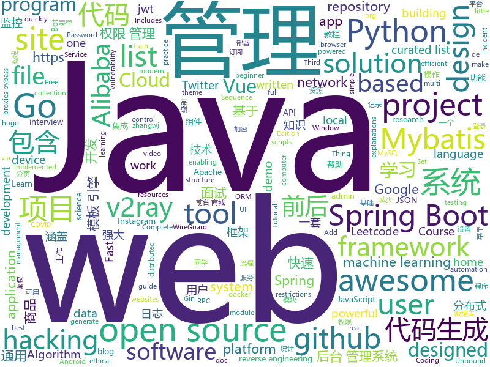

# 2020-10-12
See what the GitHub community is most excited about.

## python
+ [twint](https://github.com/twintproject/twint)(**149 stars today**): An advanced Twitter scraping & OSINT tool written in Python that doesn't use Twitter's API, allowing you to scrape a user's followers, following, Tweets and more while evading most API limitations.
+ [big_screen](https://github.com/TurboWay/big_screen)(**120 stars today**): 数据大屏可视化
+ [h4cker](https://github.com/The-Art-of-Hacking/h4cker)(**38 stars today**): This repository is primarily maintained by Omar Santos and includes thousands of resources related to ethical hacking / penetration testing, digital forensics and incident response (DFIR), vulnerability research, exploit development, reverse engineering, and more.
+ [Real-Time-Voice-Cloning](https://github.com/CorentinJ/Real-Time-Voice-Cloning)(**108 stars today**): Clone a voice in 5 seconds to generate arbitrary speech in real-time
+ [scikit-learn](https://github.com/scikit-learn/scikit-learn)(**23 stars today**): scikit-learn: machine learning in Python
+ [InstaPy](https://github.com/timgrossmann/InstaPy)(**9 stars today**): 📷Instagram Bot - Tool for automated Instagram interactions
+ [core](https://github.com/home-assistant/core)(**33 stars today**): 🏡Open source home automation that puts local control and privacy first
+ [tuya-convert](https://github.com/ct-Open-Source/tuya-convert)(**5 stars today**): A collection of scripts to flash Tuya IoT devices to alternative firmwares
+ [audiobook](https://github.com/ProgrammingHero1/audiobook)(**8 stars today**): 
+ [numpy](https://github.com/numpy/numpy)(**35 stars today**): The fundamental package for scientific computing with Python.
+ [TransCoder](https://github.com/facebookresearch/TransCoder)(**24 stars today**): Public release of the TransCoder research project https://arxiv.org/pdf/2006.03511.pdf
+ [Automation-scripts](https://github.com/python-geeks/Automation-scripts)(**7 stars today**): Repo for creating awesome automation scripts to make my panda lazier
+ [cupp](https://github.com/Mebus/cupp)(**4 stars today**): Common User Passwords Profiler (CUPP)
+ [system-design-primer](https://github.com/donnemartin/system-design-primer)(**197 stars today**): Learn how to design large-scale systems. Prep for the system design interview. Includes Anki flashcards.
+ [fairseq](https://github.com/pytorch/fairseq)(**15 stars today**): Facebook AI Research Sequence-to-Sequence Toolkit written in Python.
+ [Python-100-Days](https://github.com/jackfrued/Python-100-Days)(**96 stars today**): Python - 100天从新手到大师
+ [tianshou](https://github.com/thu-ml/tianshou)(**8 stars today**): An elegant, flexible, and superfast PyTorch deep reinforcement learning platform.
+ [wagtail](https://github.com/wagtail/wagtail)(**8 stars today**): A Django content management system focused on flexibility and user experience
+ [Ciphey](https://github.com/Ciphey/Ciphey)(**84 stars today**): ⚡Automatically decrypt encryptions without knowing the key or cipher, decode encodings, and crack hashes⚡
+ [DeDRM_tools](https://github.com/apprenticeharper/DeDRM_tools)(**11 stars today**): DeDRM tools for ebooks
+ [bips](https://github.com/bitcoin/bips)(**4 stars today**): Bitcoin Improvement Proposals
+ [Summer2021-Internships](https://github.com/Pitt-CSC/Summer2021-Internships)(**10 stars today**): Collection of Summer 2021 tech internships!
+ [multi-v2ray](https://github.com/Jrohy/multi-v2ray)(**12 stars today**): v2ray多用户管理部署程序
+ [electricitymap-contrib](https://github.com/tmrowco/electricitymap-contrib)(**25 stars today**): A real-time visualisation of the CO2 emissions of electricity consumption
+ [holehe](https://github.com/megadose/holehe)(**17 stars today**): holehe allows you to check if the mail is used on different sites like twitter, instagram and will retrieve information on sites with the forgotten password function.

## java
+ [advanced-java](https://github.com/doocs/advanced-java)(**50 stars today**): 😮互联网 Java 工程师进阶知识完全扫盲：涵盖高并发、分布式、高可用、微服务、海量数据处理等领域知识，后端同学必看，前端同学也可学习
+ [JavaGuide](https://github.com/Snailclimb/JavaGuide)(**151 stars today**): 「Java学习+面试指南」一份涵盖大部分Java程序员所需要掌握的核心知识。准备 Java 面试，首选 JavaGuide！
+ [java-design-patterns](https://github.com/iluwatar/java-design-patterns)(**89 stars today**): Design patterns implemented in Java
+ [jeecg-boot](https://github.com/zhangdaiscott/jeecg-boot)(**234 stars today**): 基于代码生成器的低代码平台，超越传统商业平台！前后端分离架构：SpringBoot 2.x，SpringCloud Alibaba，Ant Design&Vue，Mybatis-plus，Shiro，JWT。强大的代码生成器让前后端代码一键生成，无需写任何代码! 引领新开发模式(OnlineCoding-> 代码生成-> 手工MERGE)，帮助Java项目解决70%重复工作，让开发更关注业务逻辑，既能快速提高开发效率，帮助公司节省成本，同时又不失灵活性。
+ [spring-cloud-alibaba](https://github.com/alibaba/spring-cloud-alibaba)(**55 stars today**): Spring Cloud Alibaba provides a one-stop solution for application development for the distributed solutions of Alibaba middleware.
+ [Sentinel](https://github.com/alibaba/Sentinel)(**33 stars today**): A powerful flow control component enabling reliability, resilience and monitoring for microservices. (面向云原生微服务的高可用流控防护组件)
+ [spring-boot-demo](https://github.com/xkcoding/spring-boot-demo)(**78 stars today**): spring boot demo 是一个用来深度学习并实战 spring boot 的项目，目前总共包含 65 个集成demo，已经完成 53 个。 该项目已成功集成 actuator(监控)、admin(可视化监控)、logback(日志)、aopLog(通过AOP记录web请求日志)、统一异常处理(json级别和页面级别)、freemarker(模板引擎)、thymeleaf(模板引擎)、Beetl(模板引擎)、Enjoy(模板引擎)、JdbcTemplate(通用JDBC操作数据库)、JPA(强大的ORM框架)、mybatis(强大的ORM框架)、通用Mapper(快速操作Mybatis)、PageHelper(通用的Mybatis分页插件)、mybatis-plus(快速操作M…
+ [SpringBoot-Labs](https://github.com/YunaiV/SpringBoot-Labs)(**75 stars today**): 一个涵盖六个专栏：Spring Boot 2.X、Spring Cloud、Spring Cloud Alibaba、Dubbo、分布式消息队列、分布式事务的仓库。希望胖友小手一抖，右上角来个 Star，感恩 1024
+ [mall](https://github.com/macrozheng/mall)(**106 stars today**): mall项目是一套电商系统，包括前台商城系统及后台管理系统，基于SpringBoot+MyBatis实现，采用Docker容器化部署。 前台商城系统包含首页门户、商品推荐、商品搜索、商品展示、购物车、订单流程、会员中心、客户服务、帮助中心等模块。 后台管理系统包含商品管理、订单管理、会员管理、促销管理、运营管理、内容管理、统计报表、财务管理、权限管理、设置等模块。
+ [ghidra](https://github.com/NationalSecurityAgency/ghidra)(**19 stars today**): Ghidra is a software reverse engineering (SRE) framework
+ [CS-Notes](https://github.com/CyC2018/CS-Notes)(**157 stars today**): 📚技术面试必备基础知识、Leetcode、计算机操作系统、计算机网络、系统设计、Java、Python、C++
+ [LeetCode](https://github.com/yuanguangxin/LeetCode)(**98 stars today**): LeetCode刷题记录与面试整理
+ [canal](https://github.com/alibaba/canal)(**65 stars today**): 阿里巴巴 MySQL binlog 增量订阅&消费组件
+ [spring-framework](https://github.com/spring-projects/spring-framework)(**23 stars today**): Spring Framework
+ [calcite](https://github.com/apache/calcite)(**10 stars today**): Apache Calcite
+ [rocketmq](https://github.com/apache/rocketmq)(**12 stars today**): Mirror of Apache RocketMQ
+ [Signal-Android](https://github.com/signalapp/Signal-Android)(**8 stars today**): A private messenger for Android.
+ [interview](https://github.com/mission-peace/interview)(**8 stars today**): Interview questions
+ [spring-boot-examples](https://github.com/ityouknow/spring-boot-examples)(**18 stars today**): about learning Spring Boot via examples. Spring Boot 教程、技术栈示例代码，快速简单上手教程。
+ [dubbo](https://github.com/apache/dubbo)(**7 stars today**): Apache Dubbo is a high-performance, java based, open source RPC framework.
+ [zookeeper](https://github.com/apache/zookeeper)(**8 stars today**): Apache ZooKeeper
+ [base-admin](https://github.com/huanzi-qch/base-admin)(**50 stars today**): Base Admin一套简单通用的后台管理系统，主要功能有：权限管理、菜单管理、用户管理，系统设置、实时日志，实时监控，API加密，以及登录用户修改密码、配置个性菜单等
+ [k-9](https://github.com/k9mail/k-9)(**8 stars today**): K-9 Mail – Open Source Email App for Android
+ [Android-IMSI-Catcher-Detector](https://github.com/CellularPrivacy/Android-IMSI-Catcher-Detector)(**3 stars today**): AIMSICD • Fight IMSI-Catcher, StingRay and silent SMS!
+ [spring-boot](https://github.com/spring-projects/spring-boot)(**30 stars today**): Spring Boot

## unknown
+ [free-programming-books](https://github.com/EbookFoundation/free-programming-books)(**436 stars today**): 📚Freely available programming books
+ [COVID-19](https://github.com/pcm-dpc/COVID-19)(**10 stars today**): COVID-19 Italia - Monitoraggio situazione
+ [coding-interview-university](https://github.com/jwasham/coding-interview-university)(**176 stars today**): A complete computer science study plan to become a software engineer.
+ [developer-roadmap](https://github.com/kamranahmedse/developer-roadmap)(**506 stars today**): Roadmap to becoming a web developer in 2020
+ [project-based-learning](https://github.com/tuvtran/project-based-learning)(**50 stars today**): Curated list of project-based tutorials
+ [COVID-19](https://github.com/CSSEGISandData/COVID-19)(**11 stars today**): Novel Coronavirus (COVID-19) Cases, provided by JHU CSSE
+ [wirehole](https://github.com/IAmStoxe/wirehole)(**67 stars today**): WireHole is a combination of WireGuard, Pi-hole, and Unbound in a docker-compose project with the intent of enabling users to quickly and easily create a personally managed full or split-tunnel WireGuard VPN with ad blocking capabilities thanks to Pi-hole, and DNS caching, additional privacy options, and upstream providers via Unbound.
+ [Front-End-Checklist](https://github.com/thedaviddias/Front-End-Checklist)(**20 stars today**): 🗂The perfect Front-End Checklist for modern websites and meticulous developers
+ [cloudflare-2020-general-engineering-assignment](https://github.com/cloudflare-hiring/cloudflare-2020-general-engineering-assignment)(**6 stars today**): 
+ [hacker-roadmap](https://github.com/sundowndev/hacker-roadmap)(**7 stars today**): 📌Your beginner pen-testing start guide. A guide for amateur pen testers and a collection of hacking tools, resources and references to practice ethical hacking and web security.
+ [Best-websites-a-programmer-should-visit](https://github.com/sdmg15/Best-websites-a-programmer-should-visit)(**18 stars today**): 🔗Some useful websites for programmers.
+ [awesome-semantic-segmentation](https://github.com/mrgloom/awesome-semantic-segmentation)(**15 stars today**): 🤘awesome-semantic-segmentation
+ [awesome-incident-response](https://github.com/meirwah/awesome-incident-response)(**8 stars today**): A curated list of tools for incident response
+ [100ProjectsOfCode](https://github.com/aceking007/100ProjectsOfCode)(**199 stars today**): A list of practical knowledge-building projects.
+ [asuswrt-merlin.ng](https://github.com/RMerl/asuswrt-merlin.ng)(**5 stars today**): Third party firmware for Asus routers (newer codebase)
+ [applied-ml](https://github.com/eugeneyan/applied-ml)(**23 stars today**): 📚Papers by organizations sharing their work on applied data science & machine learning.
+ [pumpkin-book](https://github.com/datawhalechina/pumpkin-book)(**12 stars today**): 《机器学习》（西瓜书）公式推导解析，在线阅读地址：https://datawhalechina.github.io/pumpkin-book
+ [awesome](https://github.com/sindresorhus/awesome)(**84 stars today**): 😎Awesome lists about all kinds of interesting topics
+ [common-words](https://github.com/yoksel/common-words)(**5 stars today**): 🧐Слова, часто используемые в CSS-классах
+ [what-happens-when](https://github.com/alex/what-happens-when)(**31 stars today**): An attempt to answer the age old interview question "What happens when you type google.com into your browser and press enter?"
+ [awesome-termux-hacking](https://github.com/may215/awesome-termux-hacking)(**4 stars today**): ⚡️An awesome list of the best Termux hacking tools
+ [awesome-java](https://github.com/Snailclimb/awesome-java)(**8 stars today**): Collection of awesome Java project on Github(Github 上非常棒的 Java 开源项目集合).
+ [leetcode](https://github.com/grandyang/leetcode)(**7 stars today**): Provide all my solutions and explanations in Chinese for all the Leetcode coding problems.
+ [HowToHunt](https://github.com/KathanP19/HowToHunt)(**52 stars today**): Tutorials and Things to Do while Hunting Vulnerability.
+ [architect-awesome](https://github.com/xingshaocheng/architect-awesome)(**21 stars today**): 后端架构师技术图谱

## javascript
+ [Luckysheet](https://github.com/mengshukeji/Luckysheet)(**322 stars today**): Luckysheet is an online spreadsheet like excel that is powerful, simple to configure, and completely open source.
+ [next.js](https://github.com/vercel/next.js)(**94 stars today**): The React Framework
+ [Fifa21-AutoBuyer](https://github.com/chithakumar13/Fifa21-AutoBuyer)(**5 stars today**): Fifa 21 AutoBuyer / Snipping Bot for fifa 21 ultimate team web app
+ [module-federation-examples](https://github.com/module-federation/module-federation-examples)(**7 stars today**): Implementation examples of module federation , by the creators of module federation
+ [freeCodeCamp](https://github.com/freeCodeCamp/freeCodeCamp)(**139 stars today**): freeCodeCamp.org's open source codebase and curriculum. Learn to code at home.
+ [unlock-music](https://github.com/ix64/unlock-music)(**16 stars today**): Unlock encrypted music file in browser. 在浏览器中解锁加密的音乐文件。
+ [PurpleAir-AQI-Scriptable-Widget](https://github.com/jasonsnell/PurpleAir-AQI-Scriptable-Widget)(**9 stars today**): Generate Scriptable app widget to query PurpleAir sensor and display local AQI.
+ [vuepress](https://github.com/vuejs/vuepress)(**10 stars today**): 📝Minimalistic Vue-powered static site generator
+ [awesome-selfhosted](https://github.com/awesome-selfhosted/awesome-selfhosted)(**108 stars today**): A list of Free Software network services and web applications which can be hosted locally. Selfhosting is the process of hosting and managing applications instead of renting from Software-as-a-Service providers
+ [docs](https://github.com/github/docs)(**164 stars today**): This is the open-source repo for docs.github.com.
+ [hacker-scripts](https://github.com/NARKOZ/hacker-scripts)(**211 stars today**): Based on a true story
+ [zhaopp](https://github.com/gdtool/zhaopp)(**61 stars today**): 一个Google Drive搜索引擎 https://GeZhong.vip
+ [msfs2020-toolbar-little-nav-map](https://github.com/bymaximus/msfs2020-toolbar-little-nav-map)(**4 stars today**): Microsoft FlightSimulator 2020 Toolbar LittleNavMap window
+ [react-advanced-2020](https://github.com/john-smilga/react-advanced-2020)(**20 stars today**): 
+ [javascript-algorithms](https://github.com/trekhleb/javascript-algorithms)(**115 stars today**): 📝Algorithms and data structures implemented in JavaScript with explanations and links to further readings
+ [project-guidelines](https://github.com/elsewhencode/project-guidelines)(**12 stars today**): A set of best practices for JavaScript projects
+ [vant-weapp](https://github.com/youzan/vant-weapp)(**18 stars today**): 轻量、可靠的小程序 UI 组件库
+ [website](https://github.com/CodingTrain/website)(**4 stars today**): The train engine powering the Coding Train website
+ [covid19india-react](https://github.com/covid19india/covid19india-react)(**9 stars today**): Tracking the impact of COVID-19 in India
+ [complete-javascript-course](https://github.com/jonasschmedtmann/complete-javascript-course)(**4 stars today**): Starter files, final projects and FAQ for my Complete JavaScript course
+ [Motrix](https://github.com/agalwood/Motrix)(**20 stars today**): A full-featured download manager.
+ [uBlock](https://github.com/gorhill/uBlock)(**27 stars today**): uBlock Origin - An efficient blocker for Chromium and Firefox. Fast and lean.
+ [create-react-app](https://github.com/facebook/create-react-app)(**35 stars today**): Set up a modern web app by running one command.
+ [whatsapp-web-reveng](https://github.com/sigalor/whatsapp-web-reveng)(**4 stars today**): Reverse engineering WhatsApp Web.
+ [DPlayer](https://github.com/MoePlayer/DPlayer)(**9 stars today**): 🍭Wow, such a lovely HTML5 danmaku video player

## html
+ [juliamono](https://github.com/cormullion/juliamono)(**48 stars today**): repository for JuliaMono, a monospaced font designed to work well with the Julia language. Details in the web site:
+ [HTML-CSS-Tutorial](https://github.com/cassidoo/HTML-CSS-Tutorial)(**11 stars today**): Tutorial for HTML and CSS
+ [free-for-dev](https://github.com/ripienaar/free-for-dev)(**24 stars today**): A list of SaaS, PaaS and IaaS offerings that have free tiers of interest to devops and infradev
+ [docker-development-youtube-series](https://github.com/marcel-dempers/docker-development-youtube-series)(**7 stars today**): 
+ [fluxion](https://github.com/FluxionNetwork/fluxion)(**1 stars today**): Fluxion is a remake of linset by vk496 with enhanced functionality.
+ [machine-learning-systems-design](https://github.com/chiphuyen/machine-learning-systems-design)(**13 stars today**): A booklet on machine learning systems design with exercises
+ [home-assistant.io](https://github.com/home-assistant/home-assistant.io)(**5 stars today**): 📘Home Assistant User documentation
+ [awesome-piracy](https://github.com/Igglybuff/awesome-piracy)(**5 stars today**): A curated list of awesome warez and piracy links
+ [REKCARC-TSC-UHT](https://github.com/PKUanonym/REKCARC-TSC-UHT)(**10 stars today**): 清华大学计算机系课程攻略 Guidance for courses in Department of Computer Science and Technology, Tsinghua University
+ [ESPEasy](https://github.com/letscontrolit/ESPEasy)(**4 stars today**): Easy MultiSensor device based on ESP8266
+ [py4e](https://github.com/csev/py4e)(**2 stars today**): Web site for www.py4e.com and source to the Python 3.0 textbook
+ [calibre-web](https://github.com/janeczku/calibre-web)(**8 stars today**): 📚Web app for browsing, reading and downloading eBooks stored in a Calibre database
+ [HacktoberFest2020](https://github.com/bajajvinamr/HacktoberFest2020)(**3 stars today**): Make your first PR! ~ A beginner-friendly repository. Add your profile, a blog, or any program under any language (it can be anything from a hello-world program to a complex data structure algorithm) or update the existing one. Just make sure to add the file under the correct directory. Happy hacking!
+ [H4ckT0b3rF3st-2k20](https://github.com/openmindsclub/H4ckT0b3rF3st-2k20)(**6 stars today**): By OpenMinds Club, a repository dedicated to the Hacktoberfest 2020 (7th edition). This repository had been created to encourage anyone and everyone interested to dive into the open source community.
+ [aws-sa-associate-saac02](https://github.com/acantril/aws-sa-associate-saac02)(**3 stars today**): Course Files for AWS Certified Solutions Architect Certification Course (SAAC02) - Adrian Cantrill
+ [hugo-coder](https://github.com/luizdepra/hugo-coder)(**5 stars today**): A minimalist blog theme for hugo.
+ [lockphish](https://github.com/JasonJerry/lockphish)(**3 stars today**): Lockphish is a tool for phishing attacks on the lock screen, designed to grab Windows credentials, Android PIN and iPhone Passcode[No longer works on latest devices]
+ [ML-notes](https://github.com/Sakura-gh/ML-notes)(**5 stars today**): notes about machine learning
+ [free-v2ray](https://github.com/iwxf/free-v2ray)(**7 stars today**): 每天更新，分享免费V2Ray账号、订阅链接，V2Ray翻墙科学上网教程。
+ [hyperblog](https://github.com/freddier/hyperblog)(**8 stars today**): Un blog increíble para el curso de Git y Github de Platzi
+ [blog_os](https://github.com/phil-opp/blog_os)(**8 stars today**): Writing an OS in Rust
+ [hugo-theme-stack](https://github.com/CaiJimmy/hugo-theme-stack)(**7 stars today**): Card-style Hugo theme designed for bloggers
+ [v2-ui](https://github.com/sprov065/v2-ui)(**6 stars today**): 支持多协议多用户的 v2ray 面板，Support multi-protocol multi-user v2ray panel
+ [CLRS](https://github.com/walkccc/CLRS)(**5 stars today**): 📚Solutions to Introduction to Algorithms Third Edition
+ [zju-icicles](https://github.com/QSCTech/zju-icicles)(**6 stars today**): 浙江大学课程攻略共享计划

## go
+ [v2ray-core](https://github.com/v2fly/v2ray-core)(**244 stars today**): A platform for building proxies to bypass network restrictions.
+ [ferry](https://github.com/lanyulei/ferry)(**231 stars today**): 本系统是集工单统计、任务钩子、权限管理、灵活配置流程与模版等等于一身的开源工单系统，当然也可以称之为工作流引擎。 致力于减少跨部门之间的沟通，自动任务的执行，提升工作效率与工作质量，减少不必要的工作量与人为出错率。
+ [bubbletea](https://github.com/charmbracelet/bubbletea)(**331 stars today**): A powerful little TUI framework🏗
+ [go-admin](https://github.com/go-admin-team/go-admin)(**63 stars today**): 基于Gin + Vue + Element UI的前后端分离权限管理系统脚手架（包含了：基础用户管理功能，jwt鉴权，代码生成器，RBAC资源控制，表单构建等）分分钟构建自己的中后台项目；文档：http://doc.zhangwj.com/go-admin-site/ Demo： http://www.zhangwj.com/#/login
+ [frp](https://github.com/fatedier/frp)(**44 stars today**): A fast reverse proxy to help you expose a local server behind a NAT or firewall to the internet.
+ [gin-vue-admin](https://github.com/flipped-aurora/gin-vue-admin)(**32 stars today**): 基于gin+vue搭建的后台管理系统框架，集成jwt鉴权，权限管理，动态路由，分页封装，多点登录拦截，资源权限，上传下载，代码生成器，表单生成器等基础功能，五分钟一套CURD前后端代码包含数据库的快感你不要体验一下吗~,更多功能正在开发中，欢迎issue和pr~
+ [kubecolor](https://github.com/dty1er/kubecolor)(**32 stars today**): colorizes kubectl output
+ [go-zero](https://github.com/tal-tech/go-zero)(**105 stars today**): go-zero is a web and rpc framework written in Go. It's born to ensure the stability of the busy sites with resilient design. Builtin goctl greatly improves the development productivity.
+ [statsviz](https://github.com/arl/statsviz)(**118 stars today**): 🚀Instant live visualization of your Go application runtime statistics (GC, MemStats, etc.) in the browser
+ [tidb](https://github.com/pingcap/tidb)(**25 stars today**): TiDB is an open source distributed HTAP database compatible with the MySQL protocol
+ [glow](https://github.com/charmbracelet/glow)(**28 stars today**): Render markdown on the CLI, with pizzazz! 💅🏻
+ [goquery](https://github.com/PuerkitoBio/goquery)(**7 stars today**): A little like that j-thing, only in Go.
+ [awesome-go](https://github.com/avelino/awesome-go)(**41 stars today**): A curated list of awesome Go frameworks, libraries and software
+ [kubecraftadmin](https://github.com/erjadi/kubecraftadmin)(**23 stars today**): 
+ [amongusdiscord](https://github.com/denverquane/amongusdiscord)(**14 stars today**): Discord Bot to automute Among Us players at round transitions, in conjunction with https://github.com/denverquane/amonguscapture
+ [learn-go-with-tests](https://github.com/quii/learn-go-with-tests)(**13 stars today**): Learn Go with test-driven development
+ [chainlink](https://github.com/smartcontractkit/chainlink)(**7 stars today**): node of the decentralized oracle network, bridging on and off-chain computation
+ [gjson](https://github.com/tidwall/gjson)(**11 stars today**): Get JSON values quickly - JSON parser for Go
+ [quic-go](https://github.com/lucas-clemente/quic-go)(**5 stars today**): A QUIC implementation in pure go
+ [gopl.io](https://github.com/adonovan/gopl.io)(**11 stars today**): Example programs from "The Go Programming Language"
+ [photoprism](https://github.com/photoprism/photoprism)(**14 stars today**): Personal Photo Management powered by Go and Google TensorFlow
+ [restic](https://github.com/restic/restic)(**5 stars today**): Fast, secure, efficient backup program
+ [annie](https://github.com/iawia002/annie)(**15 stars today**): 👾Fast, simple and clean video downloader
+ [v2ray-core](https://github.com/v2ray/v2ray-core)(**21 stars today**): A platform for building proxies to bypass network restrictions.
+ [buildpacks](https://github.com/GoogleCloudPlatform/buildpacks)(**78 stars today**): Builders and buildpacks designed to run on Google Cloud's container platforms

## WordCloud

